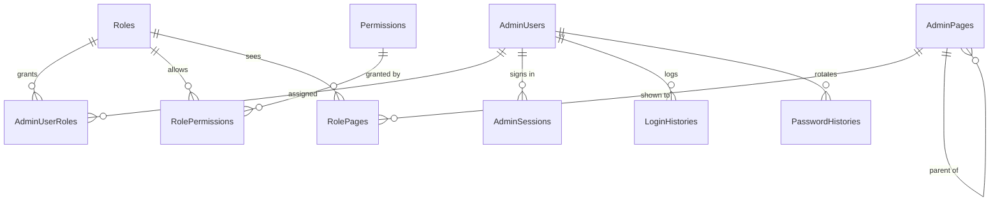

# Database Relationships & ERD

**179 tables · 310 foreign keys · all trusted and enabled.**
Companion to `Database-Architecture.md`.

---

## 1. Cascade policy

**Every foreign key in this database uses `NO ACTION` (the default).**
There is not one `ON DELETE CASCADE` or `ON UPDATE CASCADE` in the schema.

That is a deliberate decision, not an oversight:

1. **Soft delete makes cascade delete unreachable.** Rows are flagged
   `IsDeleted = 1`, never removed, so a delete cascade would never fire in normal
   operation. Its only effect would be during a manual cleanup — exactly when
   silent, unbounded deletion is most dangerous.
2. **Cascade paths on this graph are long.** `Customers → Orders → OrderItems →
   OrderItemTaxes` plus `→ Reviews`, `→ Shipments`, `→ Payments`. A single
   cascading delete of one customer could remove financial records that legally
   must be retained.
3. **SQL Server rejects multiple cascade paths anyway.** `Orders` is reachable
   from `Customers` directly and via `Carts`; `OrderItems` from `Orders` and
   `Products`. Cascades here would fail at creation time.

Deletion order, where a hard delete is ever genuinely required, is handled
explicitly in application code inside a transaction.

**Update cascade is unnecessary** because every foreign key points at an
immutable `IDENTITY` surrogate key. Business identifiers that *do* change
(`Slug`, `Sku`, `Code`) are never foreign keys — `Slug` changes instead write a
301 into `dbo.Redirects`.

### Delete restrictions enforced by the schema

| Rule | Mechanism |
|---|---|
| A category with products cannot be deleted | FK from `ProductCategories` + service check (Category.txt §7) |
| A category with children cannot be deleted | Self-referencing FK on `Categories.ParentId` |
| A blog category in use cannot be deleted | FK from `BlogPosts` (Blog.txt §19) |
| An order with lines cannot be removed | FK from `OrderItems` |
| A coupon with redemptions keeps its history | FK from `CouponRedemptions`; release is an explicit reversal |
| Super Admin cannot be deleted | `Roles.IsSystem = 1` + service rule (Users.txt §5) |

---

## 2. Core commerce ERD

```mermaid
erDiagram
    Customers        ||--o{ CustomerAddresses : "has"
    Customers        ||--o{ Orders            : "places"
    Customers        ||--o{ Carts             : "owns"
    Customers        ||--o{ Wishlists         : "owns"
    Customers        ||--o{ Reviews           : "writes"
    Customers        ||--o{ RewardPointLedgers: "earns"
    Customers        ||--o{ SupportTickets    : "raises"

    Categories       ||--o{ Categories        : "parent of"
    Categories       ||--o{ ProductCategories : "groups"
    Products         ||--o{ ProductCategories : "belongs to"
    Products         ||--o{ ProductVariants   : "has"
    Products         ||--o{ ProductMedia      : "shows"
    Products         ||--o{ InventoryStocks   : "stocked as"
    Products         ||--o{ Reviews           : "receives"
    Products         ||--|| ProductRatingSummaries : "summarised by"
    Brands           ||--o{ Products          : "brands"
    Artisans         ||--o{ Products          : "crafts"

    Warehouses       ||--o{ InventoryStocks   : "holds"
    InventoryStocks  ||--o{ InventoryTransactions : "logs"

    Carts            ||--o{ CartItems         : "contains"
    Carts            ||--o{ CheckoutSessions  : "becomes"

    Orders           ||--o{ OrderItems        : "contains"
    Orders           ||--o{ OrderAddresses    : "ships to"
    Orders           ||--o{ OrderStatusHistories : "transitions"
    Orders           ||--o{ OrderNotes        : "annotated by"
    Orders           ||--o{ Payments          : "paid by"
    Orders           ||--o{ Shipments         : "fulfilled by"
    Orders           ||--o{ ReturnRequests    : "returned via"
    Orders           ||--o| Invoices          : "invoiced as"
    OrderItems       ||--o{ OrderItemTaxes    : "taxed by"
    OrderItems       ||--o| Reviews           : "reviewed by"

    Payments         ||--o{ Refunds           : "refunded by"
    Refunds          ||--o{ RefundTaxes       : "reverses"
    Shipments        ||--o{ ShipmentItems     : "packs"
    Shipments        ||--o{ ShipmentTrackingEvents : "tracked by"
    Couriers         ||--o{ Shipments         : "carries"

    Coupons          ||--o{ CouponRedemptions : "redeemed as"
    Orders           }o--o| Coupons           : "discounted by"
```



---

## 3. Content, engagement and operations ERD

```mermaid
erDiagram
    Reviews          ||--o{ ReviewMedia            : "illustrated by"
    Reviews          ||--o{ ReviewReplies          : "answered by"
    Reviews          ||--o{ ReviewAbuseReports     : "reported as"
    Reviews          ||--o{ ReviewHelpfulVotes     : "voted on"
    Reviews          ||--o{ ReviewSubRatings       : "detailed by"
    Reviews          ||--o{ ReviewModerationHistories : "moderated via"
    OrderItems       ||--o| ReviewRequests         : "invites"

    SupportTickets   ||--o{ SupportTicketMessages  : "threads"
    SupportTickets   ||--o{ SupportTicketAttachments : "attaches"
    SupportTickets   ||--o{ SupportTicketStatusHistories : "transitions"
    InquiryCategories||--o{ SupportTickets         : "classifies"
    ContactSubmissions ||--o| SupportTickets       : "escalates to"

    NotificationEvents ||--o{ NotificationEventTemplates : "renders via"
    NotificationTemplates ||--o{ NotificationEventTemplates : "used by"
    NotificationEvents ||--o{ Notifications        : "raises"
    Notifications    ||--o{ NotificationDeliveryLogs : "attempts"
    Customers        ||--o{ NotificationPreferences: "configures"
    Customers        ||--o{ CustomerDevices        : "registers"

    Subscribers      ||--o{ NewsletterSegmentMembers : "grouped in"
    NewsletterSegments ||--o{ NewsletterSegmentMembers : "contains"
    NewsletterSegments ||--o{ Campaigns            : "targets"
    Campaigns        ||--o{ CampaignRecipients     : "sends to"
    CampaignRecipients ||--o{ CampaignEvents       : "generates"
    Subscribers      ||--o{ SubscriberTags         : "tagged"

    BlogCategories   ||--o{ BlogPosts              : "groups"
    BlogAuthors      ||--o{ BlogPosts              : "writes"
    BlogPosts        ||--o{ BlogComments           : "receives"
    BlogPosts        ||--o{ BlogPostProducts       : "promotes"
    CmsPages         ||--o{ Faqs                   : "answers on"

    SeoMetas         ||--o{ SeoAuditFindings       : "audited by"
    SeoAuditRuns     ||--o{ SeoAuditFindings       : "produces"
    Redirects        ||--o{ NotFoundLogs           : "resolves"
    SeoKeywords      ||--o{ SeoKeywordRankings     : "ranked by"

    ReportDefinitions||--o{ SavedReports           : "saved as"
    ReportDefinitions||--o{ ScheduledReports       : "scheduled as"
    ScheduledReports ||--o{ ScheduledReportRecipients : "emails"
    ReportDefinitions||--o{ ReportRuns             : "executed as"
```



---

## 4. Identity and access ERD



---

## 5. Cardinality reference for the critical paths

| Relationship | Cardinality | Optional? | Notes |
|---|---|---|---|
| `Customers → Orders` | 1 : 0..N | Optional | `Orders.CustomerId` is nullable — guest checkout |
| `Orders → OrderItems` | 1 : 1..N | Required | An order with no lines is invalid |
| `OrderItems → OrderItemTaxes` | 1 : 0..N | Optional | Zero rows for a zero-rated line |
| `Orders → Payments` | 1 : 0..N | Optional | Many rows: retries and partial captures |
| `Orders → Shipments` | 1 : 0..N | Optional | Many rows: split shipments |
| `Shipments → ShipmentTrackingEvents` | 1 : 0..N | Optional | Courier webhook feed |
| `Orders → Invoices` | 1 : 0..1 | Optional | Generated on payment; credit notes self-reference |
| `Products → ProductVariants` | 1 : 0..N | Optional | Only when `HasVariants = 1` |
| `Products → InventoryStocks` | 1 : 0..N | Optional | One row per (variant, warehouse) |
| `Products ↔ Categories` | M : N | — | Via `ProductCategories`; `Products.CategoryId` is the primary one |
| `Customers ↔ Products` (wishlist) | M : N | — | Via `Wishlists` → `WishlistItems` |
| `Customers → Reviews` | 1 : 0..N | Optional | **One per product**, by `UX_Reviews_CustomerProduct` |
| `Products → ProductRatingSummaries` | 1 : 0..1 | Optional | Cache; absent until the first approved review |
| `Roles ↔ Permissions` | M : N | — | Via `RolePermissions` |
| `Coupons → CouponRedemptions` | 1 : 0..N | Optional | One per successful use |
| `Subscribers → CampaignRecipients` | 1 : 0..N | Optional | Unique per campaign |

---

## 6. Self-referencing hierarchies

| Table | Column | Guard |
|---|---|---|
| `Categories` | `ParentId` | `Depth` + `TreePath` maintained; circular refs rejected in service (Category.txt §20) |
| `AdminPages` | `ParentId` | Two levels in practice |
| `MediaFolders` | `ParentId` | Path string mirrors the tree |
| `BlogCategories` | `ParentId` | Single level in practice |
| `ReviewReplies` | `ParentReplyId` | Allows future nesting |
| `Invoices` | `OriginalInvoiceId` | Credit note → original invoice |

---

## 7. Deliberately loose references

Three places use `(EntityType, EntityId)` pairs instead of hard foreign keys.
Each is a considered trade, not laziness — a hard FK would require one nullable
column per target table, and adding a target would mean a schema change.

| Table | Pair | Why |
|---|---|---|
| `AuditLogs` | `EntityType`, `EntityId` | Audits *every* table. 179 nullable FK columns is not a design. |
| `ApprovalRequests` | `EntityType`, `EntityId` | Any guarded action across any module. |
| `SeoMetas` | `EntityType`, `EntityId` | Keyed on `RoutePath`; the pair is provenance. Routes exist that are not entities (`/`, `/shop`). |
| `Notifications` | `RelatedEntityType`, `RelatedEntityId` | "View details" can point at an order, a shipment, a review or a ticket. |
| `PageViewLogs` | `EntityType`, `EntityId` | Any viewable page type. |

Referential integrity for these is the responsibility of the writing service.
The trade is documented so nobody later mistakes it for a missing constraint.

---

## 8. Referential integrity verification

Run after any deployment:

```sql
-- Must return 0 rows: every FK trusted and enabled
SELECT name, is_not_trusted, is_disabled
FROM   sys.foreign_keys
WHERE  is_not_trusted = 1 OR is_disabled = 1;

-- Must return 0 rows: every table has a primary key
SELECT t.name
FROM   sys.tables t
WHERE  t.is_ms_shipped = 0
  AND  NOT EXISTS (SELECT 1 FROM sys.key_constraints k
                   WHERE k.parent_object_id = t.object_id AND k.type = 'PK');

-- Must return 0 rows: no CHECK constraint bypassed with NOCHECK
SELECT name FROM sys.check_constraints WHERE is_not_trusted = 1;
```

Verified on the deployed database on 2026-08-12: **all three return zero rows.**
