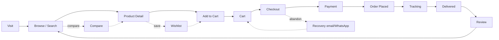

# Enterprise Handicraft E-Commerce Platform
## Customer Website — UI/UX Design Specification · Master Index

**Document ID:** HCX-CXSPEC-001
**Version:** 1.0
**Status:** Approved for Figma Production
**Owner:** Principal Product Designer / CX Lead / Enterprise Product Owner
**Audience:** UI Designers (Figma), UX Architects, Front-End Engineers, Business Analysts, QA, SEO, Content, Merchandising
**Target Platform:** ASP.NET Core MVC (.NET 8) · Modular Monolith · Clean Architecture · MSSQL · Bootstrap 5 · jQuery
**Companion document:** `docs/ui-ux/` — Admin Panel specification (HCX-UXSPEC-001)

---

## 0.1 Purpose of This Document

This document set is the **single source of truth** for the complete customer-facing storefront of the Enterprise Handicraft E-Commerce Platform.

It is written so that a Product Designer can open Figma and build **every page, every drawer, every modal, every bottom sheet, every state, and every component** without asking a single additional question.

It contains **no code**. All technical references are declarative specifications — tokens, measurements, behaviours, rules and acceptance criteria — never implementations.

### Relationship to the Admin Specification

| Concern | Admin spec (`docs/ui-ux/`) | This spec (`docs/ui-ux-storefront/`) |
|---------|---------------------------|--------------------------------------|
| Audience | 9 internal operator roles | Anonymous visitors, registered customers, guests |
| Priority | Density, speed, control | Desire, trust, clarity, conversion |
| Design system | `Chamunda DS — Admin` | `Chamunda DS — Storefront` (shared primitives, different semantic layer and scale) |
| Shared assets | Colour primitives, icon set, spacing scale, motion tokens, illustration family | ✅ Inherited |
| Divergent | Type scale, density, component styling, imagery weight, motion expressiveness | ✅ Redefined here |

**Rule:** the two systems share **primitive tokens** (raw colour, spacing, radius, motion values) so brand colour is identical everywhere. They do **not** share semantic tokens or components — an admin table row and a product card have nothing in common.

---

## 0.2 Document Set Structure

| # | File | Contents |
|---|------|----------|
| 00 | `00-Master-Index.md` | This file. Index, conventions, glossary, screen counts, CX principles |
| 01 | `01-CX-Foundations.md` | Business goals, shopper personas, customer journey maps, information architecture, site shell (header, mega menu, footer), responsive strategy, content & microcopy, trust framework, performance budgets, SEO surface |
| 02 | `02-Design-System-Foundations.md` | Typography, colour (light + dark), spacing, grid, breakpoints, elevation, radius, motion, iconography, imagery, theming, accessibility foundations |
| 03 | `03-Component-Library.md` | Every storefront component: anatomy, sizes, variants, states, behaviour, responsive rules, Figma variant matrix |
| 04 | `04-Figma-Organization.md` | Figma file structure, pages, sections, frames, naming, Variables (colour/type/spacing/grid), auto layout, prototypes, developer handoff |
| 05 | `05-Global-UX-Patterns.md` | Listing pattern, detail pattern, form pattern, drawer/bottom-sheet pattern, dialogs, toasts, empty/loading/error states, system pages, micro-interaction catalogue |
| 10 | `10-Modules-01-02-Auth-Home.md` | Module 1 Authentication · Module 2 Home |
| 11 | `11-Modules-03-13-Shop-Search.md` | Module 3 Shop / Product Listing · Module 13 Search |
| 12 | `12-Modules-04-05-06-PDP-Compare-Wishlist.md` | Module 4 Product Details · Module 5 Compare · Module 6 Wishlist |
| 13 | `13-Modules-07-08-09-Cart-Checkout-Payment.md` | Module 7 Cart · Module 8 Checkout · Module 9 Payment |
| 14 | `14-Modules-10-11-12-Account-Orders-Tracking.md` | Module 10 My Account · Module 11 Orders · Module 12 Order Tracking |
| 15 | `15-Modules-14-17-Support-Reviews-Rewards-Notifications.md` | Module 14 Customer Support · Module 15 Reviews · Module 16 Rewards · Module 17 Notifications |
| 16 | `16-Modules-18-19-Blog-Static.md` | Module 18 Blog · Module 19 Static Pages |
| 17 | `17-Module-20-AI-Shopping.md` | Module 20 AI Shopping Features |
| 20 | `20-Appendix-Inventory-And-Handoff.md` | Master screen inventory, modal/drawer/sheet inventory, journey map library, prototype flows, conversion instrumentation, QA checklist, delivery phasing, open decisions |

---

## 0.3 How To Read a Module Chapter

Every module chapter follows an **identical 40-section template**.

| § | Section | What it gives the designer |
|---|---------|---------------------------|
| 1 | Business Goal | The commercial outcome this module owns |
| 2 | Purpose | The job the shopper hires it to do |
| 3 | Customer Journey | Narrative + Mermaid journey diagram |
| 4 | Navigation Flow | Mermaid flow diagram of routes and overlays |
| 5 | Complete Screen List | Every page, modal, drawer, sheet, uniquely IDed |
| 6 | Information Architecture | Content model and hierarchy |
| 7 | Screen Hierarchy | Parent/child tree |
| 8 | Desktop Layout | ≥1280px composition |
| 9 | Tablet Layout | 768–1279px composition |
| 10 | Mobile Layout | <768px composition |
| 11 | Wireframe Description | ASCII wireframes + region narrative |
| 12 | Header | Header state/behaviour for this module |
| 13 | Mega Menu / Navigation | Navigation behaviour |
| 14 | Footer | Footer variant |
| 15 | Breadcrumb | Trail rules + schema |
| 16 | Search | Search scope and behaviour |
| 17 | Filters | Every filter, type, source, dependency |
| 18 | Sorting | Options and defaults |
| 19 | Cards | Card specs used |
| 20 | Widgets | Non-card modules |
| 21 | Forms & Fields | Every field: type, label, placeholder, help, constraint |
| 22 | Validation Rules | Field and form rules with exact messages |
| 23 | Action Buttons | Hierarchy, placement, behaviour |
| 24 | Icons | Icon usage |
| 25 | Typography & Spacing | Applied scale for this module |
| 26 | Images / Video / Carousels | Media specs |
| 27 | Pagination | Model |
| 28 | Empty State | Copy + composition |
| 29 | Loading State & Skeleton | Skeleton composition |
| 30 | Success State | Composition + copy |
| 31 | Error State | Every error and its recovery |
| 32 | Confirmation Dialogs | Exact copy and buttons |
| 33 | Notifications | Toasts and messages triggered |
| 34 | Micro-interactions & Animation | Motion detail |
| 35 | Accessibility | Module-specific requirements |
| 36 | Responsive Behaviour | Reflow table |
| 37 | Prototype Flow | What to wire in Figma |
| 38 | Figma Components & Variants | Direct build list |
| 39 | Auto Layout Structure | Frame tree |
| 40 | UX Guidelines · Developer Handoff · Analytics · Future Scalability | Rules, notes, tracking, roadmap |

### Per-Screen Detail Blocks

Key screens additionally carry a **24-field screen block**: purpose, business objective, layout, sections, components, buttons, icons, typography, spacing, colours, responsive behaviour, hover / focus / pressed / disabled / loading / success / error states, animation, transition, prototype interaction, navigation flow, accessibility, UX notes, developer notes.

---

## 0.4 ID & Naming Conventions

### 0.4.1 Screen and Overlay IDs

```
PG-<MODULE#>-<SEQ>    Page (full route)            e.g. PG-04-01  (Product Detail)
MOD-<MODULE#>-<SEQ>   Modal (centred overlay)      e.g. MOD-07-03 (Apply Coupon)
DRW-<MODULE#>-<SEQ>   Drawer (side panel)          e.g. DRW-07-01 (Mini Cart)
SHT-<MODULE#>-<SEQ>   Bottom sheet (mobile)        e.g. SHT-03-01 (Filters Sheet)
SEC-<MODULE#>-<SEQ>   Page section / band          e.g. SEC-02-04 (New Arrivals Rail)
STA-<MODULE#>-<SEQ>   Named state                  e.g. STA-03-02 (No Results)
TST-<MODULE#>-<SEQ>   Toast                        e.g. TST-06-01 (Added to Wishlist)
```

### 0.4.2 Component IDs

```
CMP-<Category>-<Name>    e.g. CMP-PRD-Card, CMP-CRT-LineItem, CMP-NAV-MegaMenu
```

### 0.4.3 Route Convention

```
/                                   Home
/c/{category-slug}                  Category listing
/c/{category}/{subcategory}         Sub-category listing
/shop                               All products
/p/{product-slug}                   Product detail
/search?q=                          Search results
/cart                               Cart
/checkout                           Checkout
/checkout/success/{orderNumber}     Order confirmation
/account                            Account dashboard
/account/orders/{orderNumber}       Order detail
/track/{orderNumber}                Guest order tracking
/wishlist                           Wishlist
/compare                            Compare
/blog                               Blog index
/blog/{slug}                        Article
/artisans/{slug}                    Artisan profile
/pages/{slug}                       Static page
/help                               Help centre
```

---

## 0.5 Glossary

| Term | Definition |
|------|------------|
| **Shopper** | Any visitor, whether anonymous, guest or signed-in |
| **PLP** | Product Listing Page (category, search results, collection) |
| **PDP** | Product Detail Page |
| **Rail** | A horizontally scrolling row of cards on a page |
| **Band** | A full-width horizontal page section |
| **Mini Cart** | Right-side drawer summarising the cart |
| **Artisan** | The named maker credited on a product — a first-class storefront entity |
| **Craft Cluster** | A geographic/community grouping of artisans, browsable and filterable |
| **Variation Notice** | The mandatory disclosure that handmade items vary slightly |
| **Trust Band** | The row of guarantees (authenticity, returns, secure payment, artisan-made) |
| **Above the Fold** | Visible without scrolling at 1440×900 desktop and 390×844 mobile |
| **Conversion Surface** | Any element directly leading to Add to Cart or Place Order |
| **Progressive Disclosure** | Revealing detail on demand rather than all at once |
| **Guest** | A shopper who checks out without creating an account |

---

## 0.6 Storefront Screen Count Summary

| Module | Pages | Modals | Drawers | Sheets | Sections/Rails | Total frames (desktop) |
|--------|------:|-------:|--------:|-------:|---------------:|----------------------:|
| 01 Authentication | 12 | 10 | 1 | 4 | – | 27 |
| 02 Home | 1 | 6 | 2 | 3 | 18 | 30 |
| 03 Shop / PLP | 6 | 8 | 3 | 5 | 6 | 28 |
| 04 Product Details | 4 | 14 | 4 | 6 | 14 | 42 |
| 05 Compare | 2 | 4 | 1 | 2 | – | 9 |
| 06 Wishlist | 3 | 6 | 1 | 2 | – | 12 |
| 07 Cart | 3 | 8 | 2 | 4 | 4 | 21 |
| 08 Checkout | 6 | 12 | 2 | 5 | – | 25 |
| 09 Payment | 8 | 10 | 1 | 3 | – | 22 |
| 10 My Account | 14 | 16 | 2 | 6 | – | 38 |
| 11 Orders | 6 | 12 | 2 | 4 | – | 24 |
| 12 Order Tracking | 3 | 5 | 1 | 2 | – | 11 |
| 13 Search | 4 | 4 | 2 | 3 | – | 13 |
| 14 Customer Support | 8 | 10 | 2 | 4 | – | 24 |
| 15 Reviews | 4 | 10 | 2 | 3 | – | 19 |
| 16 Rewards | 5 | 8 | 1 | 2 | – | 16 |
| 17 Notifications | 4 | 6 | 2 | 2 | – | 14 |
| 18 Blog | 6 | 4 | 1 | 2 | – | 13 |
| 19 Static Pages | 12 | 4 | – | 2 | – | 18 |
| 20 AI Shopping | 6 | 8 | 3 | 4 | 5 | 26 |
| System (404/500/Maintenance/Offline/Cookie) | 8 | 4 | – | 1 | – | 13 |
| **TOTAL** | **125** | **169** | **35** | **69** | **47** | **445** |

Multiply by breakpoints where the layout materially differs (desktop 1440, tablet 768, mobile 390) → approximately **980 storefront frames**, plus dark-theme spot checks.

---

## 0.7 CX Principles (Non-Negotiable)

1. **The craft is the hero.** Photography, artisan story and material truth get more space than chrome. Never let UI compete with the product.
2. **Trust before persuasion.** Authenticity, return policy, secure payment and real reviews appear before any urgency device.
3. **Honest scarcity only.** Countdown timers, "only 2 left" and "12 people viewing" are used only when literally true, and are removed when not.
4. **Every handmade item declares its variation.** The variation notice is mandatory on PDP, cart and order confirmation — it prevents the single most common return reason.
5. **Three taps to buy.** From any product card, a shopper can reach purchase in three interactions or fewer.
6. **Guest checkout is first-class.** Account creation is offered after purchase, never demanded before it.
7. **No dark patterns.** No pre-ticked marketing consent, no hidden costs, no fake countdowns, no confirm-shaming, no disguised ads. Total cost is visible before payment details are requested.
8. **Mobile is the primary design target.** 68% of traffic. Every screen is designed at 390px first, then expanded.
9. **Performance is a feature.** LCP ≤2.5s on 4G. Design decisions that break the budget are redesigned, not excused.
10. **Accessible by default.** WCAG 2.1 AA is the floor. Every conversion path is completable by keyboard and screen reader.
11. **Never lose the shopper's work.** Cart, filters, form input and scroll position survive navigation, refresh and session expiry.
12. **Explain, don't block.** Every error states what went wrong and exactly how to fix it.

---

## 0.8 Primary Conversion Funnel



**Design targets per step**

| Step | Target | Design levers |
|------|--------|---------------|
| Visit → Browse | ≥85% | Fast LCP, clear category entry, search prominence |
| Browse → PDP | ≥35% | Card imagery, price clarity, honest badges |
| PDP → Add to Cart | ≥12% | Gallery quality, trust band, delivery estimate, variation notice, sticky CTA |
| Cart → Checkout | ≥65% | No surprise costs, visible savings, delivery estimate, easy edit |
| Checkout → Payment | ≥80% | Single-page checkout, guest default, address autofill, progress clarity |
| Payment → Placed | ≥92% | Method breadth, UPI-first, retry without data loss, COD availability |
| Placed → Review | ≥18% | Post-delivery request timing, one-tap rating, photo incentive |

---

## 0.9 Global Screen States Required Everywhere

Every data-bearing surface must be designed in all of these:

| State | When |
|-------|------|
| Loading (first paint) | Skeleton matching final geometry |
| Loading (in-place) | Existing content retained, subtle progress |
| Loaded — default | — |
| Loaded — sparse | Fewer items than the layout expects (e.g. 2 products in a 4-up grid) |
| Empty (nothing exists) | Illustration + heading + supporting line + CTA |
| Empty (filtered/searched) | Icon + reason + active filter chips + clear action |
| Error (recoverable) | Cause + retry |
| Error (blocking) | Cause + alternate path + support link |
| Offline | Banner + cached content notice |
| Unauthenticated | Sign-in prompt in context, never a hard redirect |
| Out of stock / unavailable | Alternatives offered, notify-me action |

---

## 0.10 Change Control

| Version | Date | Author | Change |
|---------|------|--------|--------|
| 1.0 | 2026-08-03 | Principal Product Designer | Initial complete customer website specification |

Any change to this document must be reflected in Figma within one working day, and vice versa. The Figma file version label must match the version number here.
