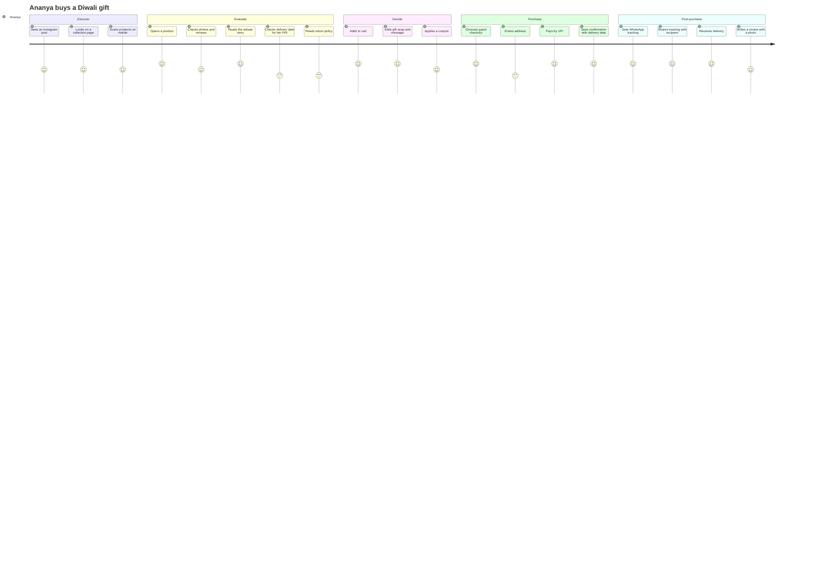
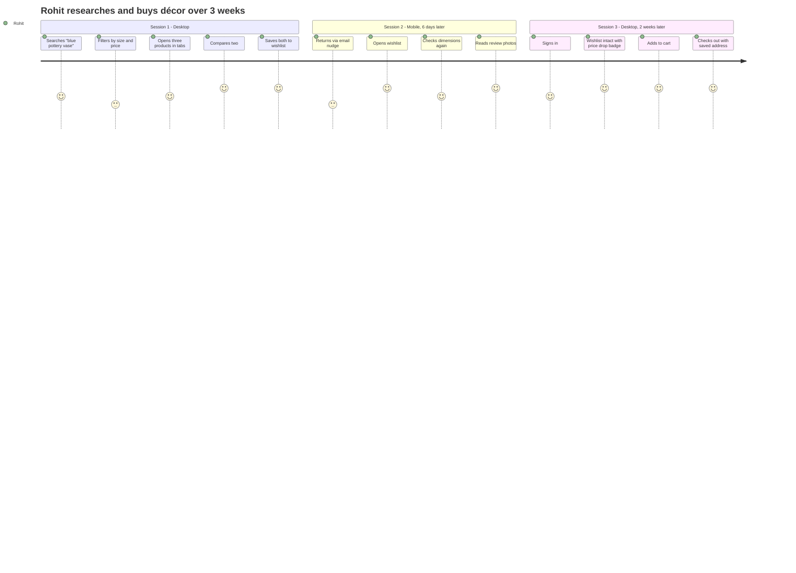
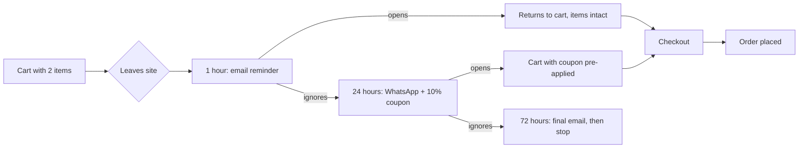
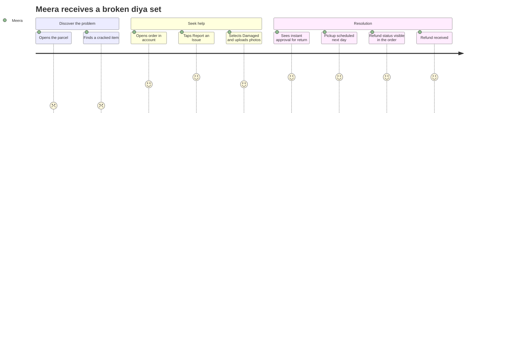
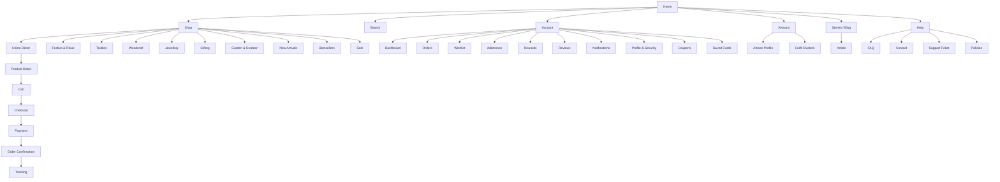

# 01 — CX Foundations

Enterprise Handicraft E-Commerce Platform · Customer Website UI/UX Specification

---

## 1. Business Context

### 1.1 What the Storefront Sells

Handmade and artisan-crafted goods across home décor, textiles, pottery, metalwork, woodcraft, jewellery, festive and ritual items, and gifting collections. The commercial proposition is not price — it is **provenance, craft technique, material honesty and the named maker**. The storefront's job is to make that proposition legible and desirable within seconds, then remove every obstacle between desire and purchase.

### 1.2 Commercial Objectives

| ID | Objective | Target | CX implication |
|----|-----------|--------|----------------|
| CG-01 | Raise overall conversion rate | 1.8% → 2.6% | Faster PDP, sticky CTA, guest checkout, UPI-first payment |
| CG-02 | Raise average order value | ₹2,846 → ₹3,400 | Combos, complete-the-look, gift wrap, free-shipping threshold nudge |
| CG-03 | Reduce cart abandonment | 68% → 55% | No surprise costs, delivery estimate in cart, single-page checkout, recovery flows |
| CG-04 | Reduce returns | 4.2% → 3.0% | Mandatory variation notice, dimension visualiser, accurate colour, review photos |
| CG-05 | Grow repeat purchase rate | 22% → 32% | Rewards, account value, post-purchase content, personalised home |
| CG-06 | Grow organic traffic | +40% YoY | Fast Core Web Vitals, structured data, craft content, artisan pages |
| CG-07 | Build brand trust | NPS ≥ 55 | Real reviews, artisan stories, transparent policies, responsive support |
| CG-08 | Survive festival demand spikes | 5× traffic, no degradation | Performance budgets, honest scarcity, queue-free checkout |

### 1.3 CX Success Metrics (Design-Owned)

| Metric | Target |
|--------|--------|
| Time to first product view | ≤ 8 s |
| PDP → Add to Cart | ≥ 12% |
| Checkout completion | ≥ 80% |
| Checkout time (returning) | ≤ 90 s |
| Checkout time (guest, new address) | ≤ 3 min |
| Mobile task success (unmoderated) | ≥ 92% |
| SUS score | ≥ 82 |
| WCAG 2.1 AA automated pass | 100% |
| LCP (mobile 4G, p75) | ≤ 2.5 s |
| CLS | ≤ 0.05 |
| INP | ≤ 200 ms |

---

## 2. Shopper Personas

### P-01 · "Ananya, the Gifting Buyer" — 34, Bengaluru, Product Manager
- **Context:** Buys 6–10 times a year, almost always as gifts. Shops on mobile during commute.
- **Needs:** Confidence the item looks like the photos; delivery by a specific date; gift wrap and a message; easy returns if it disappoints.
- **Anxieties:** "Will it arrive in time?" "Is this actually handmade?" "Can I return it if she doesn't like it?"
- **Design response:** Delivery-date promise on PDP and cart, gift options at cart and checkout, prominent return policy, artisan credentials, review photos.

### P-02 · "Rohit, the Considered Decorator" — 41, Mumbai, Architect
- **Context:** Furnishing a home. Researches heavily across sessions and devices. Compares, saves, returns weeks later.
- **Needs:** Exact dimensions, material truth, colour fidelity, how it looks in a room, comparison across options.
- **Anxieties:** "Will the scale be wrong?" "Is the colour accurate?" "Does it match what I already own?"
- **Design response:** Dimension diagram and scale reference, 360° spin, zoom, compare tool, wishlist across devices, "in-room" imagery, recently viewed.

### P-03 · "Meera, the Festival Shopper" — 52, Jaipur, Homemaker
- **Context:** Buys in bursts around Diwali, Navratri and weddings. Larger baskets, price-sensitive, uses WhatsApp heavily.
- **Needs:** Festival collections, combos and sets, clear savings, COD, order tracking she can share.
- **Anxieties:** "Is this the real price or inflated then discounted?" "Will it come before the festival?" "Can I pay on delivery?"
- **Design response:** Festival landing bands, combo pricing with explicit savings, honest MRP display, COD availability by PIN, WhatsApp order updates, shareable tracking link.

### P-04 · "Sara, the Conscious Collector" — 28, Delhi, Designer
- **Context:** Buys fewer, better things. Cares who made it and how.
- **Needs:** Artisan story, craft technique, sustainability claims, provenance, limited-edition signalling.
- **Anxieties:** "Is 'handmade' a marketing word here?" "Does the maker actually benefit?"
- **Design response:** Artisan profiles with photo and story, craft-cluster pages, technique explainers, GI-tag badges, "meet the maker" video, story-first PDP band.

### P-05 · "David, the International Buyer" — 46, London, Consultant
- **Context:** Buys Indian handicraft for gifting and home. Unfamiliar with Indian sizing, materials and shipping.
- **Needs:** Currency display, international shipping cost and time, customs clarity, familiar payment methods.
- **Anxieties:** "What will this cost me in total?" "How long will it take?" "Will customs charge me?"
- **Design response:** Currency selector, landed-cost transparency, international delivery estimates, card and wallet payments, unit conversion (cm/inch).

### P-06 · "Priya, the Returning Loyalist" — 37, Pune, Teacher
- **Context:** Bought 8 times. Signed in. Expects the site to remember her.
- **Needs:** Fast reorder, saved addresses and cards, reward points, early access.
- **Anxieties:** "Do I have to re-enter everything again?"
- **Design response:** One-tap reorder, saved address/card selection, points balance in header, personalised home, member-only drops.

### 2.1 Persona × Module Priority

| Module | Ananya | Rohit | Meera | Sara | David | Priya |
|--------|:------:|:-----:|:-----:|:----:|:-----:|:-----:|
| Home | ●● | ●● | ●●● | ●● | ●● | ●●● |
| Shop / PLP | ●● | ●●● | ●●● | ●● | ●● | ●● |
| Search | ●●● | ●● | ● | ●● | ●● | ●●● |
| PDP | ●●● | ●●● | ●●● | ●●● | ●●● | ●● |
| Compare | ● | ●●● | ● | ●● | ● | – |
| Wishlist | ●● | ●●● | ● | ●●● | ● | ●● |
| Cart | ●●● | ●● | ●●● | ●● | ●●● | ●●● |
| Checkout | ●●● | ●● | ●●● | ●● | ●●● | ●●● |
| Payment | ●● | ●● | ●●● | ●● | ●●● | ●● |
| Account | ● | ●● | ● | ● | ● | ●●● |
| Orders / Tracking | ●●● | ●● | ●●● | ●● | ●●● | ●●● |
| Support | ●● | ● | ●● | ● | ●●● | ● |
| Reviews | ●● | ●●● | ● | ●●● | ●● | ●● |
| Rewards | ● | ● | ●● | ● | – | ●●● |
| Blog / Stories | ● | ●● | ● | ●●● | ●● | ● |
| AI features | ●● | ●●● | ● | ●● | ●●● | ●● |

---

## 3. Customer Journey Maps

### 3.1 End-to-End Journey — First-Time Gift Buyer



**Emotional low points and the design response**

| Low point | Cause | Design response |
|-----------|-------|-----------------|
| Delivery-date check | Buried, requires effort | PIN check inline on PDP, remembered for the session, delivery date shown on the product card in search results after first entry |
| Return policy | Written in legal language, hidden in the footer | Plain-language summary on PDP in an expander: "7-day returns · we pay return shipping for damaged items" |
| Address entry | Long form, repetitive typing | PIN auto-fills city and state, address autocomplete, single-column layout, mobile keyboards typed per field |

### 3.2 End-to-End Journey — Considered Purchase Across Sessions



### 3.3 Recovery Journey — Abandoned Cart



**Design rules:** the cart must be restored exactly, including gift options and quantities; a pre-applied coupon must be visibly applied with its saving shown, never silently; the recovery sequence stops after three touches.

### 3.4 Service Recovery Journey — Damaged Delivery



**Design rules:** "Report an Issue" is on the order detail, not buried in Help; photo upload is required for damage and takes under 30 seconds; the resolution path and expected refund timing are stated before the shopper submits.

---

## 4. Information Architecture

### 4.1 Site Map



### 4.2 Navigation Model

| Level | Surface | Contents |
|-------|---------|----------|
| **Primary** | Header nav bar | Shop (mega menu), New Arrivals, Festive, Gifting, Artisans, Stories, Sale |
| **Utility** | Header right | Search, Account, Wishlist (count), Cart (count), Currency/Language, Help |
| **Secondary** | Mega menu panels | Category tree (3 levels), Shop by Material, Shop by Price, Shop by Artisan, featured collection tile |
| **Tertiary** | PLP left rail / sheet | Filters and sort |
| **Contextual** | Breadcrumb, related rails, in-content links | — |
| **Footer** | Footer columns | Shop, About, Help, Policies, Contact, Social, Newsletter, Payment & trust marks |
| **Mobile primary** | Bottom tab bar | Home, Shop, Search, Wishlist, Account |
| **Mobile secondary** | Hamburger drawer | Full category tree, account links, help, currency |

### 4.3 Mega Menu Structure (Desktop)

```
SHOP ▾
┌──────────────────────────────────────────────────────────────────────────────────────┐
│ SHOP BY CATEGORY        SHOP BY MATERIAL     SHOP BY OCCASION      ┌────────────────┐ │
│ Home Décor         ›    Brass                Diwali                │  [collection   │ │
│   Vases                 Ceramic              Wedding               │   image tile]  │ │
│   Wall Art              Terracotta           Housewarming          │                │ │
│   Lamps & Lighting      Wood                 Anniversary           │  Diwali        │ │
│   Decorative Bowls      Marble               Corporate Gifting     │  Collection    │ │
│ Festive & Ritual   ›    Cotton                                     │  Up to 25% off │ │
│   Diyas & Lamps         Silk                 SHOP BY PRICE         │  [Shop Now]    │ │
│   Puja Thali            Jute                 Under ₹500            └────────────────┘ │
│   Idols                 Silver               ₹500 – ₹1,500                            │
│ Textiles           ›    Bamboo               ₹1,500 – ₹5,000       SHOP BY ARTISAN    │
│ Woodcraft          ›                         Above ₹5,000          Jaipur Cluster     │
│ Jewellery          ›                                               Kutch Cluster      │
│ Gifting            ›    ─────────────────────────────────────      Channapatna        │
│ Garden & Outdoor   ›    New Arrivals · Bestsellers · Sale          Bengal Kantha      │
│                                                    [View all →]    [Meet all makers →]│
└──────────────────────────────────────────────────────────────────────────────────────┘
```

**Behaviour:** opens on hover after 150 ms and on click/Enter; closes on mouse-leave after 300 ms, on Escape, or on outside click. Hovering a category with children swaps the second column to that category's sub-categories with a 120 ms cross-fade. Full keyboard support with arrow-key traversal. Maximum panel height 560 px; content never scrolls inside the panel — if a category has too many children, it shows the top 8 plus "View all".

---

## 5. Site Shell

### 5.1 Desktop Header (≥1280 px)

```
┌──────────────────────────────────────────────────────────────────────────────────────┐
│ ANNOUNCEMENT BAR  h=40   Free shipping above ₹999 · Diwali sale live · Track order [×]│
├──────────────────────────────────────────────────────────────────────────────────────┤
│ HEADER  h=80                                                                          │
│  [LOGO 168×36]   [ ⌕ Search for pottery, diyas, cushions…            ]  ₹ ▾ 👤 ♡2 🛍3│
├──────────────────────────────────────────────────────────────────────────────────────┤
│ NAV BAR  h=52                                                                         │
│  Shop ▾   New Arrivals   Festive   Gifting   Artisans   Stories   Sale        Help ▾  │
└──────────────────────────────────────────────────────────────────────────────────────┘
```

| Region | Height | Background | Border | Sticky |
|--------|--------|-----------|--------|--------|
| Announcement bar | 40 | `--color-bg-accent` (terracotta-50) or campaign colour | none | No — scrolls away |
| Header | 80 | `--color-bg-surface` | none | Yes (compacts to 64) |
| Nav bar | 52 | `--color-bg-surface` | bottom 1px `--color-border-subtle` | Yes |
| Mega menu panel | auto (max 560) | `--color-bg-surface` | `--elevation-3` | Overlay |

**Scroll behaviour:** below 120 px of scroll the header compacts — announcement bar scrolls away, header height 80 → 64, logo 168 → 132, nav bar merges into the header row on screens ≥1440. Scrolling up reveals the full header again (auto-hide on scroll down, reveal on scroll up, mobile only).

### 5.2 Header Element Specification

| Slot | Element | Behaviour |
|------|---------|-----------|
| 1 | Logo | Links home; SVG; light/dark variants |
| 2 | Search | 480 px input (desktop), expands to 640 on focus; opens the suggestions panel |
| 3 | Currency selector | Shown only when multi-currency is enabled; flag + code |
| 4 | Language selector | Shown only when >1 locale; code + chevron |
| 5 | Account | Signed out: person icon + "Sign in". Signed in: avatar + first name; opens a menu |
| 6 | Wishlist | Heart with count badge; links to `/wishlist`; badge animates on add |
| 7 | Cart | Bag with count badge; opens the Mini Cart drawer (never navigates on desktop) |
| 8 | Help | Dropdown: Help Centre, Track Order, Contact Us, WhatsApp |

**Account menu (signed in):** greeting with first name, points balance chip, My Orders, Wishlist, Addresses, Rewards, Coupons, Notifications, Profile, Sign Out.

### 5.3 Tablet Header (768–1279 px)

Announcement bar retained. Header height 72. Logo 148. Search collapses to an icon that expands into a full-width overlay row. Nav bar becomes a horizontally scrollable chip row of top-level categories; "Shop" opens a full-height left drawer instead of a mega menu.

### 5.4 Mobile Header (<768 px)

```
┌──────────────────────────────────────┐
│ Free shipping above ₹999        [×]  │  h=36
├──────────────────────────────────────┤
│ ☰    [ KARIGAR ]           ♡2   🛍3  │  h=56
├──────────────────────────────────────┤
│ [ ⌕ Search handmade treasures…    ]  │  h=48
├──────────────────────────────────────┤
│ New · Festive · Décor · Gifts · Sale │  h=40 scrollable chips
└──────────────────────────────────────┘
```

- Header hides on scroll down, reveals on scroll up (search row included).
- Bottom tab bar (h=60, safe-area padded): Home · Shop · Search · Wishlist · Account, each with an icon, label and badge where applicable.
- Cart is reached from the header bag icon and from a persistent sticky footer CTA on PDP.

### 5.5 Footer

```
┌──────────────────────────────────────────────────────────────────────────────────────┐
│ NEWSLETTER BAND                                                                       │
│  Join the Karigar circle — craft stories and early access to new collections          │
│  [ your@email.com                    ] [ Subscribe ]   ☐ I agree to receive emails    │
├──────────────────────────────────────────────────────────────────────────────────────┤
│ SHOP           ABOUT            HELP              POLICIES         CONNECT            │
│ New Arrivals   Our Story        Help Centre       Privacy Policy   [IG][FB][YT][PIN]  │
│ Home Décor     Meet the Makers  Track Order       Terms & Conditions                  │
│ Festive        Craft Clusters   Shipping Info     Shipping Policy  📞 +91 98765 43210 │
│ Textiles       Sustainability   Returns           Return Policy    ✉ care@karigar.com │
│ Jewellery      Careers          Contact Us        Refund Policy    💬 WhatsApp        │
│ Gifting        Press            FAQ               Cookie Policy    Mon–Sat, 10am–7pm  │
│ Sale           Blog             Bulk Orders       Sitemap                             │
├──────────────────────────────────────────────────────────────────────────────────────┤
│ TRUST BAND                                                                            │
│  🤲 100% Handmade   ✅ 7-Day Returns   🔒 Secure Payments   🚚 Pan-India Delivery      │
├──────────────────────────────────────────────────────────────────────────────────────┤
│ [visa][mc][rupay][upi][razorpay][cod]        © 2026 Karigar Crafts · GSTIN 08AAB…     │
│ India (₹ INR) ▾   English ▾                              Made with care in Jaipur     │
└──────────────────────────────────────────────────────────────────────────────────────┘
```

**Mobile footer:** columns become accordions (collapsed by default), newsletter band full-width above them, trust band as a 2×2 grid, payment marks wrap, legal text centred.

---

## 6. Responsive Strategy

### 6.1 Breakpoints

| Token | Name | Range | Container | Gutter | Columns | Margin |
|-------|------|-------|-----------|--------|---------|--------|
| `xs` | Mobile | 0–575 | fluid | 16 | 4 | 16 |
| `sm` | Mobile L | 576–767 | 540 | 16 | 4 | 20 |
| `md` | Tablet | 768–991 | 720 | 24 | 8 | 24 |
| `lg` | Tablet L | 992–1199 | 960 | 24 | 12 | 24 |
| `xl` | Desktop | 1200–1439 | 1140 | 24 | 12 | 32 |
| `xxl` | Large desktop | ≥1440 | 1320 (max content 1440) | 32 | 12 | 40 |

**Primary design widths:** 390 (mobile), 768 (tablet), 1440 (desktop). Verification widths: 320, 1280, 1920.

### 6.2 Reflow Rules

| Pattern | Desktop | Tablet | Mobile |
|---------|---------|--------|--------|
| Product grid | 4 across (5 on ≥1600) | 3 across | 2 across |
| Product rail | 5 visible, arrows | 3.5 visible, swipe | 2.2 visible, swipe |
| PLP filters | Left rail 264 px, sticky | Filter button → drawer | Filter button → full-screen sheet |
| PDP | Gallery 7 / Info 5 | Gallery 6 / Info 6 | Stacked, gallery first |
| PDP CTA | Inline in the info column | Inline | Sticky bottom bar |
| Cart | Items 8 / Summary 4 sticky | Items 7 / Summary 5 | Stacked, summary sticky bottom |
| Checkout | Form 7 / Summary 5 sticky | Form 7 / Summary 5 | Stacked, collapsible summary at top, sticky pay bar |
| Account | Sidebar 3 / Content 9 | Tabs + content | Menu list → drill-down pages |
| Mega menu | Full panel | Left drawer | Full-screen drawer with accordions |
| Modals | Centred, max 720 | Centred, 90vw | Full-screen sheet |
| Drawers | Right, 420–480 | Right, 80vw | Bottom sheet |
| Compare | 4 columns | 3 columns | 2 columns, horizontal scroll |
| Blog article | Content 8 / TOC rail 4 | Content full, TOC collapsible | Content full, TOC in a sheet |
| Footer | 5 columns | 3 columns | Accordions |

### 6.3 Touch & Density

- Minimum touch target 44×44 on tablet, 48×48 on mobile, with ≥8 px separation.
- Primary conversion controls (Add to Cart, Place Order) are ≥56 px tall on mobile.
- Thumb-zone rule: on mobile, primary actions sit in the bottom third of the viewport; destructive actions never do.
- Hover-only affordances must have a tap or always-visible equivalent.

---

## 7. Content & Microcopy Standards

### 7.1 Voice

Warm, specific, unhurried. First person plural for the brand ("we"), second person for the shopper ("you"). Concrete nouns over adjectives — "hand-thrown in Jaipur, 24 cm tall" beats "beautiful premium vase". Never shout. Never fake urgency.

### 7.2 Capitalisation

| Element | Style | Example |
|---------|-------|---------|
| Page titles | Sentence case | "Your cart" |
| Category names | Title Case | "Home Décor" |
| Buttons | Title Case | "Add to Cart", "Place Order" |
| Field labels | Sentence case | "Delivery PIN code" |
| Navigation | Title Case | "New Arrivals" |
| Badges | UPPERCASE | "BESTSELLER", "NEW" |
| Toasts | Sentence case | "Added to your wishlist" |
| Legal | Sentence case | — |

### 7.3 Button Label Rules

- Verb + object: "Add to Cart", "Place Order", "Track Order", "Write a Review".
- Never "Submit", "OK", "Click here", "Continue" alone.
- The checkout primary always names the next step: "Continue to Payment" → "Pay ₹4,250".
- Destructive labels name the object: "Remove Item", "Cancel Order".
- Cancel is always "Cancel"; dismissive secondary is "Not now".

### 7.4 Message Templates

| Type | Template | Example |
|------|----------|---------|
| Success toast | `{Object} {past-tense verb}` | "Added to cart" |
| Success with action | `{Object} {verb}. [Action]` | "Saved to wishlist. [View]" |
| Error toast | `Couldn't {verb}. {Reason}.` | "Couldn't apply coupon. It has expired." |
| Field required | `{Label} is required` | "Delivery PIN code is required" |
| Field format | `Enter a valid {thing}` | "Enter a valid 10-digit mobile number" |
| Inventory | `Only {n} left` | "Only 2 left" |
| Unavailable | `Out of stock` + notify action | — |
| Delivery | `Get it by {day, date}` | "Get it by Wed, 12 Aug" |
| Savings | `You save ₹{n} ({p}%)` | "You save ₹350 (22%)" |
| Empty | `{Empty heading}` + supporting line + CTA | "Your cart is empty" |
| Payment failure | `Payment didn't go through. {Reason}. Your cart is safe.` | — |

### 7.5 Formatting

| Type | Format | Example |
|------|--------|---------|
| Currency (INR) | ₹ + Indian grouping, no decimals when whole | ₹1,24,500 · ₹1,250 · ₹999.50 |
| Currency (other) | Symbol + Western grouping, 2 decimals | $1,499.00 |
| Strikethrough MRP | `₹1,600` struck, muted, after the selling price | — |
| Discount | `22% OFF` in a chip | — |
| Rating | `4.6` + stars + `(128)` | — |
| Delivery date | `Wed, 12 Aug` (never "3–5 business days" alone) | — |
| Delivery range | `Wed, 12 Aug – Fri, 14 Aug` | — |
| Dimensions | `L × W × H` with unit and an inch conversion in a tooltip | 30 × 20 × 15 cm |
| Weight | Value + unit | 850 g |
| Stock | "In stock" / "Only {n} left" / "Out of stock" | — |
| Order number | `#HC-2026-000482` monospace | — |
| Relative time | <60 s "Just now"; <60 m "12 min ago"; <24 h "4 hours ago"; <7 d "3 days ago"; else date | — |
| Not available | Em dash `—` | — |

### 7.6 Truncation

Product names clamp to 2 lines on cards with the full name in the accessible name and title attribute. Descriptions clamp to 3 lines with "Read more". Review bodies clamp to 4 lines with "Read more". Never truncate: price, delivery date, stock status, order number, total.

---

## 8. Trust Framework

Trust is engineered, not asserted. Every element below is a designed component with a defined placement.

| Trust element | Where it appears | Component |
|---------------|------------------|-----------|
| Handmade guarantee | PDP, footer, checkout | `CMP-TRS-Badge` |
| Artisan attribution | Product card, PDP, order confirmation | `CMP-ART-Chip`, `CMP-ART-StoryCard` |
| Variation notice | PDP (near price), cart line item, order confirmation | `CMP-TRS-VariationNotice` |
| Real photos in reviews | PDP reviews, review gallery | `CMP-REV-PhotoStrip` |
| Verified purchase badge | Every review | `CMP-REV-VerifiedBadge` |
| Return window | PDP, cart, checkout, order | `CMP-TRS-ReturnSummary` |
| Delivery promise | PDP, cart, checkout | `CMP-DLV-Estimate` |
| Secure payment marks | Checkout, footer | `CMP-TRS-PaymentMarks` |
| Total cost transparency | Cart and checkout summary — no cost appears after payment selection | `CMP-CRT-Summary` |
| Contact visibility | Header help menu, footer, order detail | — |
| GSTIN and legal identity | Footer, invoice | — |
| Review authenticity note | Reviews section: "We only publish reviews from verified purchases" | — |
| Craft cluster provenance | PDP, artisan page | `CMP-ART-ClusterBadge` |

### 8.1 Anti-Dark-Pattern Rules

| Prohibited | Required instead |
|-----------|------------------|
| Pre-ticked marketing consent | Unticked, with plain-language purpose |
| Fake countdown timers | Timers only for genuinely scheduled sale windows, server-time anchored |
| Fake "n people viewing" | Real figure or omit entirely |
| Inflated MRP to manufacture discount | MRP is the genuine list price; discount computed from it |
| Hidden shipping/COD fees revealed at payment | All costs shown in cart before checkout |
| Confirm-shaming decline copy | Neutral: "Not now" |
| Forced account creation | Guest checkout equal in prominence |
| Hard-to-find unsubscribe or cancel | One click from the account and from every email |
| Auto-added items (insurance, donation, warranty) | Opt-in only, unticked |
| Disguised advertising in listings | Sponsored items labelled |

---

## 9. Performance Budgets (Design-Impacting)

| Surface | Budget | Design consequence |
|---------|--------|--------------------|
| LCP (mobile 4G p75) | ≤ 2.5 s | Hero image ≤ 120 KB, preloaded, no carousel autoplay before LCP |
| CLS | ≤ 0.05 | Every image and ad slot has a reserved aspect-ratio box; no late-injected banners |
| INP | ≤ 200 ms | No heavy JS on tap; filters apply optimistically |
| Total page weight (Home) | ≤ 1.2 MB | Max 6 above-fold images, lazy-load below fold |
| Total page weight (PLP) | ≤ 900 KB initial | 24 products per page, images 320 px wide at 2× |
| Total page weight (PDP) | ≤ 1.4 MB | First gallery image eager, rest lazy; 360° set loads on demand |
| Product card image | ≤ 45 KB | WEBP/AVIF, 320×320 at 1×, 640×640 at 2× |
| Hero banner | ≤ 120 KB desktop, ≤ 70 KB mobile | Separate mobile crop, never a scaled desktop image |
| Web fonts | ≤ 2 families, ≤ 4 weights, ≤ 180 KB total | Subset to Latin + Devanagari; `font-display: swap` |
| Third-party scripts | ≤ 3 above the fold | Chat widget, pixels and reviews load after interaction or idle |
| Carousel | Max 6 slides | Beyond that use a grid |
| Product grid render | ≤ 16 ms/row | Virtualise beyond 60 cards |

---

## 10. SEO Surface Requirements

| Requirement | Design implication |
|-------------|-------------------|
| One `H1` per page | PLP: category name. PDP: product name. Never a logo as H1 |
| Heading hierarchy unbroken | Section headings are H2, sub-sections H3 |
| Breadcrumbs on every page below home | Rendered visually and as BreadcrumbList structured data |
| Product structured data | Name, image, description, SKU, brand, offers, availability, aggregateRating |
| Review structured data | Rating, author, date, body |
| FAQ structured data | On PDP FAQ block and Help FAQ page |
| Article structured data | Blog posts |
| Canonical URLs | Filtered PLPs canonicalise to the base category unless the facet is indexable |
| Indexable facets | Category × material, category × colour, category × price band — these get real H1s and intro copy |
| Pagination | Real links with `rel` hints; infinite scroll always has a paginated fallback URL |
| Image alt text | Descriptive, product-specific, never "product image" |
| Internal linking | Related products, artisan links, category cross-links, blog → product |
| Category intro copy | 80–150 words above or below the grid, editorially controlled |
| Page speed | See §9 |

---

## 11. Localisation & Internationalisation

| Aspect | Requirement |
|--------|-------------|
| Launch locales | en-IN (default), hi-IN, en-US |
| Text expansion | Design for +35% string length; buttons and nav must not fix width |
| RTL readiness | Logical spacing, mirror-safe layouts, directional icons have RTL variants |
| Currency | INR base; display currencies with a clear "converted, charged in INR" note where applicable |
| Number format | Indian grouping for INR (lakh/crore), Western otherwise |
| Units | cm/g default with an inch/oz toggle remembered per user |
| Date format | `Day, DD Mon` for delivery; `DD MMM YYYY` elsewhere |
| Address format | Per-country templates; India uses PIN → city/state autofill |
| Phone | Country selector with `+91` default |
| Content translation | Product names, descriptions, category names, CMS, blog; untranslated content falls back to English with a subtle notice |
| Festival calendar | Regionally aware — Diwali, Navratri, Onam, Pongal, Eid, Christmas surface by locale |

---

## 12. Accessibility Foundations

### 12.1 Compliance Target

WCAG 2.1 Level AA across the entire storefront. Every step of the purchase funnel must be completable using keyboard alone and using a screen reader alone.

### 12.2 Non-Negotiable Rules

| ID | Rule |
|----|------|
| A11Y-01 | Text contrast ≥ 4.5:1; large text (≥18.66 px or ≥14 px bold) ≥ 3:1 |
| A11Y-02 | Non-text UI (borders, icons, focus rings, chart marks) ≥ 3:1 |
| A11Y-03 | Every interactive element reachable and operable by keyboard |
| A11Y-04 | Visible focus indicator everywhere; never removed without a stronger replacement |
| A11Y-05 | Colour never the sole carrier of meaning (stock status, errors, selected swatches) |
| A11Y-06 | Every input has a persistent visible label; placeholder is never the label |
| A11Y-07 | Errors linked programmatically to their field and announced |
| A11Y-08 | All images have meaningful alt text; decorative images marked decorative |
| A11Y-09 | Carousels expose slide count, current slide and a pause control; never autoplay without pause |
| A11Y-10 | Modals, drawers and sheets trap focus, are labelled, and restore focus on close |
| A11Y-11 | Toasts announced politely; errors assertively |
| A11Y-12 | Motion respects reduced-motion preference — transforms become ≤100 ms opacity fades |
| A11Y-13 | Zoom to 200% loses no content; 400% remains usable in single-column reflow |
| A11Y-14 | Page title updates on route change; heading levels never skip |
| A11Y-15 | Colour swatches include the colour name as text |
| A11Y-16 | Star ratings expose the numeric value ("4.6 out of 5") |
| A11Y-17 | Price includes currency in the accessible name ("four thousand two hundred fifty rupees") |
| A11Y-18 | Cart and wishlist counts announced on change |
| A11Y-19 | Video has captions; audio-described alternative for craft-process videos where dialogue matters |
| A11Y-20 | Timeouts (payment sessions, reserved stock) warn at 2 minutes with an extend option |
| A11Y-21 | Skip link to main content is the first tab stop |
| A11Y-22 | Touch targets ≥44 px (tablet) / ≥48 px (mobile) |
| A11Y-23 | Form autofill attributes correct so password managers and browser autofill work |
| A11Y-24 | No keyboard trap in any overlay, including third-party chat |

### 12.3 Screen Reader Announcement Map

| Event | Announcement |
|-------|-------------|
| Page load | "{Page title}. {N} products." |
| Filter applied | "Filtered by {facet}: {value}. {N} products." |
| Sort changed | "Sorted by {option}." |
| Add to cart | "{Product} added to cart. Cart has {N} items." |
| Add to wishlist | "{Product} saved to wishlist." |
| Remove from cart | "{Product} removed. Cart has {N} items." |
| Quantity change | "Quantity {n}. Line total {amount}." |
| Coupon applied | "Coupon {code} applied. You save {amount}." |
| Coupon failed | "Coupon not applied. {Reason}." |
| Variant selected | "{Option} {value} selected. Price {amount}. {Stock status}." |
| Delivery check | "Delivery to {PIN} by {date}." |
| Step change (checkout) | "Step {n} of {m}: {name}." |
| Payment processing | "Processing payment. Please wait." |
| Order placed | "Order placed. Order number {n}." |
| Load more | "{N} more products loaded. {Total} total." |
| Modal open | "{Title} dialog." |
| Error | "{N} errors. First error: {message}." |

---

## 13. Global Interaction Model

### 13.1 Keyboard Shortcuts (Storefront)

| Key | Action |
|-----|--------|
| `/` | Focus search |
| `Esc` | Close overlay / clear search |
| `Tab` / `Shift+Tab` | Traverse |
| `Enter` / `Space` | Activate |
| `←` `→` | Gallery and carousel navigation |
| `+` `−` | Zoom in the gallery lightbox |
| `Home` / `End` | First / last slide or grid item |

Shortcuts are deliberately minimal — shoppers are not power users. Discoverability is via visible controls, not memorised keys.

### 13.2 State Persistence

| State | Persistence | Scope |
|-------|-------------|-------|
| Cart | 30 days (guest, cookie) / indefinite (signed in, server) | Cross-device when signed in |
| Wishlist | Session (guest, merged on sign-in) / permanent (signed in) | Cross-device when signed in |
| Recently viewed | 30 days, max 20 items | Device |
| Compare list | Session, max 4 items | Device |
| Filters and sort | URL query string | Shareable, restored on back |
| Scroll position | Restored on back-navigation from PDP to PLP | Session |
| Delivery PIN | 30 days | Device |
| Currency and language | 1 year | Device + account preference |
| Cookie consent | 12 months | Device |
| Theme (light/dark/system) | 1 year | Device + account preference |

### 13.3 Optimistic vs Confirmed Actions

| Action | Model |
|--------|-------|
| Add to wishlist | Optimistic; revert with a toast on failure |
| Quantity change in cart | Optimistic with a debounce; revert and explain on failure |
| Remove from cart | Optimistic with an 8-second Undo |
| Add to cart | Confirmed (button spinner) — stock must be validated |
| Apply coupon | Confirmed |
| Address save | Confirmed |
| Place order | Confirmed, idempotent, double-submit blocked |
| Filter apply | Optimistic count update, confirmed result set |

### 13.4 Unsaved Input Protection

Checkout, review submission and support ticket forms retain input across accidental navigation, refresh and session expiry. On return, a banner reads "We saved what you'd entered" with a Clear option.

---

## 14. Global Data States Reference

| State | Design |
|-------|--------|
| Loading (initial) | Skeleton matching final geometry; appears after 200 ms; minimum 400 ms once shown |
| Loading (in-place) | Existing content at 60% opacity after 400 ms + 2 px top progress bar |
| Empty (nothing exists) | Illustration 200 px + heading + supporting line + primary CTA + secondary path |
| Empty (filtered) | Icon 64 px + "No products match your filters" + active filter chips + "Clear all filters" + suggested relaxations |
| Empty (search) | Icon 64 px + "No results for '{query}'" + spelling suggestion + popular categories + trending searches |
| Error (recoverable) | Icon 64 px + plain-language cause + "Try Again" + support link |
| Error (blocking) | Full-page state with an alternate route |
| Partial failure | Content renders + inline notice naming what failed + retry for that region |
| Out of stock | Product remains visible with alternatives and a notify-me action |
| Offline | Persistent banner + "You're viewing saved content" |
| Session expired (checkout) | Modal explaining, with cart preserved and a one-tap resume |

---

## 15. Analytics & Instrumentation (Design-Owned Events)

Every designed interaction that affects conversion must be measurable. The design specifies the event; engineering implements it.

| Event | Trigger | Key properties |
|-------|---------|----------------|
| `view_item_list` | PLP or rail rendered | list_id, category, item_count, position |
| `select_item` | Product card clicked | item_id, list_id, position |
| `view_item` | PDP viewed | item_id, price, category, artisan, in_stock |
| `gallery_interact` | Image change, zoom, 360 spin, video play | item_id, interaction_type |
| `variant_select` | Option chosen | item_id, option, value, in_stock |
| `delivery_check` | PIN entered | pincode, serviceable, promised_date |
| `add_to_cart` | Add to Cart | item_id, quantity, value, source (pdp/card/rail/wishlist) |
| `add_to_wishlist` | Wishlist toggle | item_id, source |
| `view_cart` | Cart page or mini cart opened | value, item_count, surface |
| `remove_from_cart` | Remove | item_id, reason (if given) |
| `apply_coupon` | Coupon attempt | code, success, discount, failure_reason |
| `begin_checkout` | Checkout entered | value, item_count, is_guest |
| `add_shipping_info` | Delivery method chosen | method, cost |
| `add_payment_info` | Payment method chosen | method |
| `purchase` | Order placed | order_id, value, tax, shipping, discount, coupon, items |
| `purchase_failed` | Payment failure | reason, method, value |
| `search` | Search submitted | query, result_count, source |
| `search_no_results` | Zero results | query |
| `filter_apply` | Filter changed | facet, value, result_count |
| `sort_apply` | Sort changed | option |
| `review_submit` | Review posted | item_id, rating, has_photo |
| `support_contact` | Ticket/chat/WhatsApp initiated | channel, context |
| `ai_assistant_open` | AI assistant opened | source |
| `ai_recommendation_click` | AI card clicked | recommendation_type, item_id |

Funnel dashboards, cohort analysis and A/B test readouts are consumed in the Admin spec's Reports module.

---

## 16. Future Scalability

| Capability | Reserved storefront affordance |
|------------|-------------------------------|
| Multi-vendor marketplace | "Sold by" slot on the product card and PDP; vendor filter placeholder |
| Subscriptions / craft box | Purchase-type selector reserved on PDP |
| Made-to-order customisation | Configurator entry point on PDP for eligible products |
| Virtual try / AR placement | "View in your room" button slot on the PDP gallery |
| Live shopping / craft demos | Event band reserved on Home |
| Loyalty tiers | Tier chip in the account header and PDP member pricing slot |
| Store locator / experience centres | Footer link and a header help entry |
| B2B / bulk ordering | "Bulk enquiry" CTA on PDP and footer |
| Gift registry / wedding lists | Wishlist type selector |
| Regional language expansion | Locale switcher scales to a searchable list beyond 3 locales |
| Progressive Web App | Install prompt slot, offline shell |
| Marketplace channel parity | Consistent product schema so listings syndicate cleanly |
