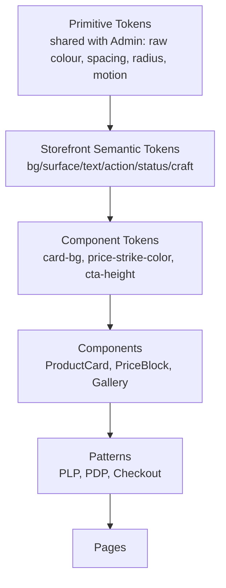

# 02 — Design System Foundations (Storefront)

Enterprise Handicraft E-Commerce Platform · Customer Website UI/UX Specification
**Design System Name:** `Chamunda DS — Storefront`

---

## 1. System Architecture

### 1.1 Token Layers



**Rule:** primitives are shared with the Admin system so brand colour is identical across the whole product. Semantic tokens are storefront-specific — a storefront surface is warmer, more generous and more image-led than an admin table.

### 1.2 Token Naming

```
--{category}-{role}-{variant}-{state}

--color-bg-canvas
--color-bg-surface
--color-bg-craft
--color-text-primary
--color-price-sale
--color-action-primary-bg-hover
--space-lg
--radius-card
--font-size-body-md
--duration-normal
--shadow-card-hover
```

In Figma these are **Variables** across collections: `Primitives`, `Semantic/Light`, `Semantic/Dark`, `Spacing`, `Typography`, `Radius`, `Effects`, `Grid`, `Sizing/Desktop|Tablet|Mobile`.

---

## 2. Colour System

### 2.1 Brand Rationale

The storefront palette is drawn from Indian craft materials: **indigo dye** (primary brand and action), **terracotta clay** (warmth, craft identity, secondary action), **brass** (premium, ratings, badges), against a **warm paper neutral** that makes photography of natural materials look correct. Cool greys are avoided in backgrounds because they render terracotta, jute and wood tones as muddy.

### 2.2 Primitive — Indigo (Primary)

| Token | Hex | Storefront usage |
|-------|-----|------------------|
| `indigo-25` | `#F5F7FF` | Subtle band background |
| `indigo-50` | `#EEF2FF` | Selected swatch ring background, info band |
| `indigo-100` | `#E0E7FF` | Chip fill |
| `indigo-200` | `#C7D2FE` | Disabled primary, decorative rules |
| `indigo-300` | `#A5B4FC` | Dark-theme accent text |
| `indigo-400` | `#818CF8` | Dark-theme primary action |
| `indigo-500` | `#6366F1` | Illustration accents |
| `indigo-600` | `#4F46E5` | **Primary action (light)**, links |
| `indigo-700` | `#4338CA` | Primary hover |
| `indigo-800` | `#3730A3` | Primary pressed |
| `indigo-900` | `#312E81` | Dark surfaces, footer |
| `indigo-950` | `#1E1B4B` | Deepest brand surface |

### 2.3 Primitive — Terracotta (Craft / Secondary)

| Token | Hex | Storefront usage |
|-------|-----|------------------|
| `terracotta-50` | `#FDF3EF` | **Craft story band background**, announcement bar |
| `terracotta-100` | `#FAE3DA` | Artisan chip fill, festival band |
| `terracotta-200` | `#F4C7B5` | Craft panel borders |
| `terracotta-300` | `#EDA88C` | Decorative accents |
| `terracotta-400` | `#E28B67` | — |
| `terracotta-500` | `#D4714C` | **Secondary action**, "Handmade" badge |
| `terracotta-600` | `#B85B3A` | Secondary hover |
| `terracotta-700` | `#95482E` | Secondary pressed, craft heading text |
| `terracotta-800` | `#733825` | — |
| `terracotta-900` | `#57291B` | — |

### 2.4 Primitive — Brass (Premium / Rating)

| Token | Hex | Storefront usage |
|-------|-----|------------------|
| `brass-50` | `#FDF8EC` | Premium band background |
| `brass-100` | `#F9EFD1` | Bestseller badge fill |
| `brass-200` | `#F2DDA3` | — |
| `brass-300` | `#E8C86E` | **Star rating fill** |
| `brass-400` | `#DDB244` | Featured icon |
| `brass-500` | `#C99A28` | Limited edition, member tier |
| `brass-600` | `#A87D1D` | Brass text on light |
| `brass-700` | `#845F17` | — |

### 2.5 Primitive — Warm Neutrals (Paper)

Deliberately warmer than the Admin slate scale so product photography of clay, jute, wood and brass reads true.

| Token | Hex | Usage |
|-------|-----|-------|
| `paper-0` | `#FFFFFF` | Surface, cards |
| `paper-25` | `#FEFDFB` | Raised surface |
| `paper-50` | `#FAF9F7` | **Canvas (light)** |
| `paper-100` | `#F4F2EE` | Subtle band, image backdrop |
| `paper-200` | `#E8E5DF` | Default border, dividers |
| `paper-300` | `#D6D2CA` | Strong border, disabled |
| `paper-400` | `#A8A29A` | Placeholder, tertiary text |
| `paper-500` | `#7A746B` | Secondary text |
| `paper-600` | `#5C5750` | Body alt |
| `paper-700` | `#403C36` | Headings alt |
| `paper-800` | `#2A2724` | **Primary text (light)** |
| `paper-900` | `#1A1816` | Max contrast |
| `paper-950` | `#0F0E0D` | **Canvas (dark)** |

### 2.6 Status Colours

#### Success (Emerald)
| Token | Hex | Usage |
|-------|-----|-------|
| `success-50` | `#ECFDF5` | Success band, "in stock" pill background |
| `success-100` | `#D1FAE5` | Chip fill |
| `success-400` | `#34D399` | Dark-theme text |
| `success-500` | `#10B981` | Icon |
| `success-600` | `#059669` | **Text/button on light** |
| `success-700` | `#047857` | Hover |

#### Warning (Amber)
| Token | Hex | Usage |
|-------|-----|-------|
| `warning-50` | `#FFFBEB` | Low-stock band |
| `warning-100` | `#FEF3C7` | Chip fill |
| `warning-400` | `#FBBF24` | Dark-theme text |
| `warning-500` | `#F59E0B` | Icon |
| `warning-600` | `#D97706` | **Text on light** — "Only 2 left" |
| `warning-700` | `#B45309` | Hover |

#### Danger (Rose-Red) — also the **Sale** colour
| Token | Hex | Usage |
|-------|-----|-------|
| `danger-50` | `#FEF2F2` | Error band |
| `danger-100` | `#FEE2E2` | Chip fill |
| `danger-400` | `#F87171` | Dark-theme text |
| `danger-500` | `#EF4444` | Icon, **sale badge fill** |
| `danger-600` | `#DC2626` | **Sale price text**, error text, destructive button |
| `danger-700` | `#B91C1C` | Hover |

> **Note:** red carries a dual role on the storefront — error *and* sale/discount. They never appear in the same component, and sale usage is always paired with a `%` or `OFF` label so meaning is unambiguous.

#### Info (Sky)
| Token | Hex | Usage |
|-------|-----|-------|
| `info-50` | `#F0F9FF` | Info band, delivery notice |
| `info-100` | `#E0F2FE` | Chip fill |
| `info-400` | `#38BDF8` | Dark-theme text |
| `info-500` | `#0EA5E9` | Icon |
| `info-600` | `#0284C7` | **Text on light** |

### 2.7 Semantic Tokens — Light Theme

| Token | Value | Contrast |
|-------|-------|----------|
| `--color-bg-canvas` | `paper-50` | — |
| `--color-bg-surface` | `paper-0` | — |
| `--color-bg-surface-raised` | `paper-0` | — |
| `--color-bg-subtle` | `paper-100` | — |
| `--color-bg-craft` | `terracotta-50` | — |
| `--color-bg-premium` | `brass-50` | — |
| `--color-bg-inverse` | `paper-900` | — |
| `--color-bg-image-placeholder` | `paper-100` | — |
| `--color-bg-overlay` | `rgba(26,24,22,0.60)` | — |
| `--color-bg-scrim-image` | `linear-gradient(rgba(0,0,0,0) 40%, rgba(0,0,0,0.55))` | — |
| `--color-text-primary` | `paper-800` | 13.6:1 |
| `--color-text-secondary` | `paper-500` | 5.1:1 |
| `--color-text-tertiary` | `paper-400` | 3.1:1 (meta ≥14 px only) |
| `--color-text-placeholder` | `paper-400` | — |
| `--color-text-disabled` | `paper-300` | — |
| `--color-text-inverse` | `paper-0` | — |
| `--color-text-brand` | `indigo-600` | 6.9:1 |
| `--color-text-link` | `indigo-600` | 6.9:1 |
| `--color-text-craft` | `terracotta-700` | 6.2:1 |
| `--color-price` | `paper-900` | 15.4:1 |
| `--color-price-sale` | `danger-600` | 5.9:1 |
| `--color-price-strike` | `paper-400` | — |
| `--color-border-subtle` | `paper-100` | — |
| `--color-border-default` | `paper-200` | — |
| `--color-border-strong` | `paper-300` | 3.1:1 |
| `--color-border-brand` | `indigo-600` | — |
| `--color-focus-ring` | `indigo-600` | 3.1:1 |
| `--color-action-primary-bg` | `indigo-600` | white on it 7.1:1 |
| `--color-action-primary-bg-hover` | `indigo-700` | — |
| `--color-action-primary-bg-active` | `indigo-800` | — |
| `--color-action-secondary-bg` | `terracotta-500` | white on it 4.6:1 |
| `--color-action-buy-now-bg` | `terracotta-600` | white on it 5.8:1 |
| `--color-rating-fill` | `brass-300` | — |
| `--color-rating-empty` | `paper-200` | — |

### 2.8 Semantic Tokens — Dark Theme

| Token | Value |
|-------|-------|
| `--color-bg-canvas` | `#0F0E0D` |
| `--color-bg-surface` | `#1A1816` |
| `--color-bg-surface-raised` | `#242220` |
| `--color-bg-subtle` | `#242220` |
| `--color-bg-craft` | `rgba(212,113,76,0.12)` |
| `--color-bg-premium` | `rgba(201,154,40,0.12)` |
| `--color-bg-inverse` | `paper-50` |
| `--color-bg-image-placeholder` | `#242220` |
| `--color-bg-overlay` | `rgba(0,0,0,0.72)` |
| `--color-text-primary` | `#F5F3F0` |
| `--color-text-secondary` | `#C4BEB6` |
| `--color-text-tertiary` | `#8F8880` |
| `--color-text-inverse` | `#1A1816` |
| `--color-text-brand` | `indigo-400` |
| `--color-text-craft` | `terracotta-300` |
| `--color-price` | `#F5F3F0` |
| `--color-price-sale` | `danger-400` |
| `--color-price-strike` | `#8F8880` |
| `--color-border-subtle` | `rgba(196,190,182,0.10)` |
| `--color-border-default` | `rgba(196,190,182,0.18)` |
| `--color-border-strong` | `rgba(196,190,182,0.32)` |
| `--color-focus-ring` | `indigo-400` |
| `--color-action-primary-bg` | `indigo-500` |
| `--color-action-secondary-bg` | `terracotta-500` |

**Dark theme rules**
- Never pure black — `#0F0E0D` retains warmth and avoids halation against warm product photography.
- Elevation is expressed by surface lightening, not heavier shadow.
- **Product images are never altered by theme.** Every product image sits on a `paper-0` inner backdrop with 8 px padding inside its card in dark mode, so white-background craft photography does not glow against a dark canvas. This is a mandatory rule.
- Sale red lightens to `danger-400`; strike-through prices lighten to remain visible without competing.
- Badges use 18% alpha fills with 300/400-step text.

### 2.9 Semantic Colour Mapping — Commerce States

| Concept | Light | Dark | Paired non-colour cue |
|---------|-------|------|----------------------|
| In stock | `success-600` text | `success-400` | ✓ icon |
| Low stock | `warning-600` text on `warning-50` | `warning-400` | ⚠ icon + count |
| Out of stock | `paper-500` text on `paper-100` | muted | "Out of stock" text + greyscale image at 60% |
| Sale price | `danger-600` | `danger-400` | struck MRP + `% OFF` chip |
| New | `info-600` on `info-50` | `info-400` | "NEW" label |
| Bestseller | `brass-700` on `brass-100` | `brass-300` | award icon + "BESTSELLER" |
| Handmade | `terracotta-700` on `terracotta-100` | `terracotta-300` | hand icon + "HANDMADE" |
| Limited edition | `brass-700` on `brass-50` | `brass-300` | "LIMITED" |
| Free shipping | `success-700` on `success-50` | `success-400` | truck icon |
| Verified review | `success-600` | `success-400` | check-badge icon |
| Order delivered | `success-600` | `success-400` | check icon + label |
| Order in transit | `info-600` | `info-400` | truck icon + label |
| Order cancelled | `paper-500` | muted | label |
| Payment failed | `danger-600` | `danger-400` | alert icon + label |

### 2.10 Colour Usage Rules

| ID | Rule |
|----|------|
| CU-01 | Indigo is reserved for the primary action and links. Never decorative. |
| CU-02 | Terracotta signals craft and the secondary/Buy Now action. Never used for errors. |
| CU-03 | Red means sale **or** error, never both in one component; sale usage always carries a `%`/`OFF` label. |
| CU-04 | Product photography is never tinted, filtered or theme-adjusted. |
| CU-05 | Image backdrops are `paper-0` or `paper-100` only. |
| CU-06 | Maximum 3 accent colours visible in one viewport, excluding product imagery and badges. |
| CU-07 | Badges on a product card: maximum 2 visible, priority order Sale > Bestseller > New > Handmade > Limited. |
| CU-08 | Gradients are permitted only as image scrims, never as button or surface fills. |
| CU-09 | Text over imagery always sits on a scrim reaching ≥4.5:1 measured against the underlying region. |

### 2.11 Campaign Theming

Festival campaigns may override a limited token set without touching components:

| Overridable | Not overridable |
|-------------|-----------------|
| `--color-bg-craft` (band background) | Primary action colour |
| Announcement bar background and text | Text primary/secondary |
| Hero overlay scrim | Status colours |
| Badge accent for the campaign | Focus ring |
| Section heading accent rule | Price colours |

Every campaign override must pass the same contrast rules; a campaign palette is signed off by design before it can be scheduled.

---

## 3. Typography

### 3.1 Typefaces

| Role | Family | Fallback | Weights |
|------|--------|----------|---------|
| Display / Headings | **Fraunces** (variable serif, soft optical size) | Georgia, 'Times New Roman', serif | 400, 500, 600, 700 |
| UI / Body | **Inter** | system-ui, 'Segoe UI', Roboto, sans-serif | 400, 500, 600, 700 |
| Numeric / Price | **Inter** with tabular figures | as above | 500, 600, 700 |
| Code / IDs | **JetBrains Mono** | ui-monospace, Consolas | 400, 500 |
| Devanagari | **Noto Serif Devanagari** (headings) / **Noto Sans Devanagari** (body) | — | 400, 500, 600, 700 |

**Rationale:** Fraunces gives the brand a hand-made, editorial warmth appropriate to craft storytelling, used for headings and display only. Inter carries all functional UI text where legibility and density matter. This pairing is deliberately different from the Admin system, which is Inter-only — the storefront needs personality, the admin needs neutrality.

**Loading:** both families subset to Latin + Devanagari, `font-display: swap`, preloaded for the two weights used above the fold (Fraunces 600, Inter 400). Total font payload ≤180 KB.

### 3.2 Type Scale

Base 16 px, fluid between mobile and desktop using clamped ranges.

| Token | Family | Mobile | Desktop | Line height | Weight | Tracking | Usage |
|-------|--------|--------|---------|-------------|--------|----------|-------|
| `display-2xl` | Fraunces | 40 | 64 | 1.05 | 600 | -0.02em | Home hero headline |
| `display-xl` | Fraunces | 32 | 48 | 1.10 | 600 | -0.02em | Campaign banner, 404 |
| `display-lg` | Fraunces | 28 | 40 | 1.15 | 600 | -0.015em | Band headings ("New Arrivals") |
| `heading-xl` | Fraunces | 24 | 32 | 1.20 | 600 | -0.01em | Page title, PDP product name |
| `heading-lg` | Fraunces | 22 | 28 | 1.25 | 600 | -0.01em | Section heading |
| `heading-md` | Inter | 20 | 24 | 1.30 | 600 | -0.005em | Card group heading, modal title |
| `heading-sm` | Inter | 18 | 20 | 1.35 | 600 | 0 | Sub-section, accordion header |
| `heading-xs` | Inter | 16 | 16 | 1.40 | 600 | 0 | Form group title, card title |
| `body-xl` | Inter | 18 | 18 | 1.60 | 400 | 0 | Article lead, story copy |
| `body-lg` | Inter | 16 | 16 | 1.60 | 400 | 0 | **PDP description, article body** |
| `body-md` | Inter | 15 | 15 | 1.55 | 400 | 0 | **Default UI body** |
| `body-sm` | Inter | 14 | 14 | 1.50 | 400 | 0 | Secondary lines, card meta |
| `body-xs` | Inter | 13 | 13 | 1.45 | 400 | 0 | Fine print, helper text |
| `label-lg` | Inter | 15 | 15 | 1.40 | 500 | 0 | Form labels, filter labels |
| `label-md` | Inter | 14 | 14 | 1.40 | 500 | 0 | Tabs, chips, nav |
| `label-sm` | Inter | 12 | 12 | 1.35 | 600 | 0.02em | Badges, small chips |
| `caption` | Inter | 12 | 12 | 1.40 | 400 | 0 | Timestamps, image captions |
| `overline` | Inter | 11 | 11 | 1.45 | 600 | 0.10em UPPER | Eyebrow labels, category kicker |
| `price-2xl` | Inter | 28 | 32 | 1.20 | 700 | -0.01em tabular | PDP price |
| `price-xl` | Inter | 22 | 24 | 1.25 | 700 | -0.01em tabular | Cart total, checkout total |
| `price-lg` | Inter | 18 | 18 | 1.30 | 600 | 0 tabular | Card price |
| `price-md` | Inter | 16 | 16 | 1.35 | 600 | 0 tabular | Line item price |
| `price-sm` | Inter | 14 | 14 | 1.40 | 500 | 0 tabular | Struck MRP, unit price |
| `nav-lg` | Inter | 16 | 15 | 1.40 | 500 | 0 | Primary nav |
| `button-lg` | Inter | 17 | 16 | 1.20 | 600 | 0 | Large CTA |
| `button-md` | Inter | 15 | 15 | 1.20 | 600 | 0 | Standard button |
| `button-sm` | Inter | 14 | 14 | 1.20 | 600 | 0 | Small button |
| `mono-md` | JetBrains Mono | 14 | 14 | 1.45 | 400 | 0 | Order number, SKU |

### 3.3 Typographic Rules

| ID | Rule |
|----|------|
| TY-01 | Fraunces is used for headings and display only — never for body copy, buttons, labels or data |
| TY-02 | Maximum 3 type sizes per section |
| TY-03 | Body line length 60–75 characters; article content column max 680 px |
| TY-04 | All prices, quantities and totals use tabular figures |
| TY-05 | Product names on cards clamp to 2 lines; on PDP they never truncate |
| TY-06 | Never centre body text longer than one line; headings may be centred in hero and band contexts |
| TY-07 | Minimum functional text size 13 px; 11 px reserved for the overline style only |
| TY-08 | Links in body copy are underlined and coloured; navigation links are not underlined until hover |
| TY-09 | Devanagari line-height increases by 0.15 at every scale step |
| TY-10 | Uppercase is used only for overline, badges and payment marks — never for headings or buttons |
| TY-11 | Struck MRP is always smaller and lighter than the selling price, never the same size |
| TY-12 | Sale price is bolder than regular price, and is the only place `danger` colour appears in a price |

### 3.4 Text Colour Application

| Context | Token |
|---------|-------|
| Headings | `--color-text-primary` |
| Body | `--color-text-primary` |
| Secondary lines, card meta | `--color-text-secondary` |
| Timestamps, counts, fine print | `--color-text-tertiary` |
| Craft story headings | `--color-text-craft` |
| Selling price | `--color-price` |
| Sale price | `--color-price-sale` |
| Struck MRP | `--color-price-strike` |
| Links | `--color-text-link` |
| On imagery | `--color-text-inverse` over a scrim |
| Errors | `danger-600` / `danger-400` |
| Success messages | `success-700` / `success-400` |

---

## 4. Spacing

### 4.1 Scale (4 px base)

| Token | Value | Usage |
|-------|-------|-------|
| `space-3xs` | 2 | Icon-to-text micro gap |
| `space-2xs` | 4 | Badge inset, dense gaps |
| `space-xs` | 8 | Icon gap, chip padding-x, tight stacks |
| `space-sm` | 12 | Input padding-x, list item gap |
| `space-md` | 16 | **Default gap**, card padding (mobile) |
| `space-lg` | 24 | **Card padding (desktop)**, grid gutter |
| `space-xl` | 32 | Between content blocks |
| `space-2xl` | 40 | Section internal spacing |
| `space-3xl` | 56 | **Band spacing (mobile)** |
| `space-4xl` | 80 | **Band spacing (desktop)** |
| `space-5xl` | 120 | Hero and editorial spacing |

### 4.2 Applied Spacing

| Context | Desktop | Tablet | Mobile |
|---------|---------|--------|--------|
| Page horizontal padding | 40 (max-width container) | 24 | 16 |
| Between page bands | 80 | 64 | 56 |
| Band heading → content | 32 | 24 | 20 |
| Product grid gutter | 24 | 20 | 12 |
| Product grid row gap | 40 | 32 | 24 |
| Card internal padding | 16 (below image) | 16 | 12 |
| Card image → text gap | 12 | 12 | 8 |
| Form field vertical gap | 20 | 20 | 16 |
| Label → input gap | 6 | 6 | 6 |
| Input → helper/error gap | 6 | 6 | 6 |
| Button group gap | 12 | 12 | 12 |
| Icon → label gap in button | 8 | 8 | 8 |
| PDP gallery → info gap | 48 | 32 | 24 (stacked) |
| Cart line item vertical padding | 20 | 20 | 16 |
| Checkout section gap | 32 | 32 | 24 |
| Footer column gap | 40 | 32 | — (accordion) |
| Drawer/sheet padding | 24 | 24 | 20 |
| Modal padding | 32 | 24 | 20 |
| Rail item gap | 20 | 16 | 12 |

---

## 5. Grid & Layout

### 5.1 Column Grid

See `01-CX-Foundations §6.1` for breakpoint definitions.

### 5.2 Canonical Layout Templates

| ID | Name | Structure | Used by |
|----|------|-----------|---------|
| `SL-01` | Full-bleed bands | 12, edge-to-edge sections | Home, campaign landing |
| `SL-02` | Filter rail + grid | 3 / 9 | PLP, search results |
| `SL-03` | Gallery + info | 7 / 5 | PDP |
| `SL-04` | Content + sticky summary | 8 / 4 | Cart, checkout |
| `SL-05` | Account sidebar + content | 3 / 9 | My Account |
| `SL-06` | Centred narrow | 6 centred, max 560 | Auth, simple forms, order tracking |
| `SL-07` | Centred wide | 8 centred, max 800 | Order confirmation, article |
| `SL-08` | Editorial | 8 content / 4 rail | Blog article, artisan story |
| `SL-09` | Comparison table | 12, first column sticky | Compare |
| `SL-10` | Blank / system | 6 centred | 404, 500, maintenance |
| `SL-11` | Two-column split | 6 / 6 | Auth with brand imagery, About |
| `SL-12` | Rail | 12, horizontal scroll | Product rails, story rails |

### 5.3 Vertical Rhythm

- Page top: 32 px below the header (desktop) / 20 px (mobile) before the first content element, except full-bleed heroes which start flush.
- Between bands: `space-4xl` desktop / `space-3xl` mobile.
- Within a band: heading block → 32 px → content → 24 px → band CTA.
- Consecutive bands of the same background colour get a 1 px `--color-border-subtle` divider or alternate to `--color-bg-subtle` to prevent visual merging.

### 5.4 Z-Index Scale

| Layer | z-index |
|-------|---------|
| Base | 0 |
| Sticky PDP CTA bar | 100 |
| Sticky filter bar | 110 |
| Sticky cart summary | 120 |
| Announcement bar | 900 |
| Header | 1000 |
| Nav bar | 1000 |
| Mega menu panel | 1010 |
| Dropdown / select menu | 1050 |
| Tooltip | 1070 |
| Drawer scrim | 1080 |
| Drawer / bottom sheet | 1090 |
| Modal scrim | 1100 |
| Modal | 1110 |
| Search overlay | 1120 |
| Lightbox | 1150 |
| Toast | 1200 |
| Cookie consent | 1250 |
| Chat widget | 1300 |

---

## 6. Elevation & Shadows

| Token | Light | Dark | Usage |
|-------|-------|------|-------|
| `elevation-0` | none | none | Flat bands |
| `elevation-1` | `0 1px 2px rgba(26,24,22,0.04), 0 1px 3px rgba(26,24,22,0.06)` | `0 1px 3px rgba(0,0,0,0.5)` | Resting cards |
| `elevation-2` | `0 2px 6px rgba(26,24,22,0.06), 0 4px 12px rgba(26,24,22,0.06)` | `0 4px 12px rgba(0,0,0,0.5)` | Card hover, dropdowns |
| `elevation-3` | `0 4px 12px rgba(26,24,22,0.08), 0 12px 24px rgba(26,24,22,0.08)` | `0 12px 24px rgba(0,0,0,0.55)` | Mega menu, popovers, drawers |
| `elevation-4` | `0 8px 24px rgba(26,24,22,0.10), 0 20px 40px rgba(26,24,22,0.10)` | `0 20px 40px rgba(0,0,0,0.6)` | Modals, lightbox |
| `elevation-5` | `0 16px 32px rgba(26,24,22,0.12), 0 32px 64px rgba(26,24,22,0.12)` | `0 32px 64px rgba(0,0,0,0.65)` | Toasts, sticky bars lifting |
| `elevation-sticky-up` | `0 -2px 12px rgba(26,24,22,0.08)` | `0 -2px 12px rgba(0,0,0,0.5)` | Sticky bottom bars |

Shadows use a warm-tinted black (`26,24,22`) to sit correctly on the paper canvas.

---

## 7. Border Radius

| Token | Value | Applied to |
|-------|-------|-----------|
| `radius-none` | 0 | Full-bleed imagery |
| `radius-xs` | 4 | Small badges, checkbox |
| `radius-sm` | 6 | Chips, tags, small buttons |
| `radius-md` | 8 | **Buttons, inputs, dropdown items** |
| `radius-lg` | 12 | **Cards, image containers, modals** |
| `radius-xl` | 16 | Feature cards, drawers, bottom sheets (top corners) |
| `radius-2xl` | 24 | Hero panels, promotional tiles |
| `radius-full` | 9999 | Avatars, pills, swatches, quantity steppers |

**Rule:** product image containers use `radius-lg` with `overflow: hidden`; the image itself is never independently rounded.

---

## 8. Motion

### 8.1 Durations

| Token | Value | Usage |
|-------|-------|-------|
| `duration-instant` | 80 ms | Colour/opacity micro-changes |
| `duration-fast` | 150 ms | Buttons, chips, hover |
| `duration-normal` | 250 ms | Dropdown, accordion, tab, toast |
| `duration-slow` | 350 ms | Modal, drawer, gallery transition |
| `duration-slower` | 500 ms | Page band reveal, hero |
| `duration-shimmer` | 1400 ms | Skeleton sweep |

### 8.2 Easing

| Token | Curve | Usage |
|-------|-------|-------|
| `ease-standard` | `cubic-bezier(0.2, 0, 0, 1)` | Default |
| `ease-decelerate` | `cubic-bezier(0, 0, 0, 1)` | Entering |
| `ease-accelerate` | `cubic-bezier(0.3, 0, 1, 1)` | Exiting |
| `ease-craft` | `cubic-bezier(0.34, 1.2, 0.44, 1)` | Add-to-cart confirmation, wishlist heart — a soft, warm overshoot |
| `ease-linear` | `linear` | Progress, shimmer, marquee |

### 8.3 Signature Motion Patterns

| Pattern | Spec |
|---------|------|
| Card hover | Image scale 1.0 → 1.04 (400 ms `ease-standard`), card lift `translateY(-2px)` + elevation 1→2 (150 ms), secondary image cross-fade if present |
| Add to cart | Button label → spinner → check (`ease-craft`, 300 ms), then a flying-thumbnail arc to the cart icon (450 ms), cart badge scale pop 1→1.25→1 |
| Wishlist toggle | Heart fill draws (200 ms) + scale 1→1.3→1 (`ease-craft`), soft radial pulse behind at 12% opacity |
| Mini cart open | Drawer slides in from right (350 ms `ease-decelerate`), scrim fades (250 ms), first item highlights `success-50` for 1.5 s |
| Bottom sheet | Slides up (350 ms `ease-decelerate`), grab handle, drag-to-dismiss with rubber-band resistance |
| Gallery change | Cross-fade 200 ms; thumbnail active ring animates position 250 ms |
| Zoom | Lens follows cursor with no delay; zoom pane fades in 150 ms |
| Accordion | Height auto-animate 250 ms; chevron rotates 180° |
| Band reveal on scroll | Fade + `translateY(16px → 0)`, 500 ms, triggered at 15% visibility, once only, staggered 60 ms across children (max 6 stagger steps) |
| Sticky CTA appear | Slides up 250 ms when the inline CTA scrolls out of view |
| Filter apply | Grid cross-fades 200 ms; result count rolls |
| Price change (variant) | Old price fades out up 8 px, new fades in from down 8 px, 200 ms |
| Toast | Slides in from the right (desktop) / up (mobile), 250 ms; auto-dismiss with a 2 px progress line |
| Skeleton | Gradient sweep left→right, 1400 ms linear infinite |
| Order confirmation | Check circle draws (400 ms) then check strokes (250 ms), single confetti burst (once, 1.2 s) |
| Reduced motion | All transforms → opacity-only ≤100 ms; scroll reveals disabled; confetti replaced by a static badge; carousels do not auto-advance |

---

## 9. Iconography

### 9.1 Library

**Primary:** Lucide — outline, 24 px grid, 1.75 px stroke (slightly lighter than the Admin 2 px for a softer retail feel), round caps and joins.
**Secondary:** custom craft icon set (pottery wheel, loom, chisel, anvil, kolam, diya, jute) drawn on the same grid for category and story use.
**Brand marks:** payment networks, couriers and social platforms use official assets, never restyled.

### 9.2 Sizes

| Token | Size | Stroke | Usage |
|-------|------|--------|-------|
| `icon-xs` | 14 | 1.5 | Inline text markers |
| `icon-sm` | 16 | 1.5 | Chips, small buttons, inputs |
| `icon-md` | 20 | 1.75 | **Default** — nav, buttons, cards |
| `icon-lg` | 24 | 1.75 | Header utility icons, section headers |
| `icon-xl` | 32 | 2 | Trust badges, feature tiles |
| `icon-2xl` | 48 | 2 | Empty/error states (secondary) |
| `icon-3xl` | 64 | 2 | Empty/error states (primary) |

### 9.3 Canonical Icon Map

| Concept | Icon |
|---------|------|
| Search | `search` |
| Cart | `shopping-bag` |
| Wishlist | `heart` / `heart` filled |
| Account | `user-round` |
| Menu | `menu` |
| Close | `x` |
| Back | `chevron-left` |
| Forward / next | `chevron-right` |
| Expand | `chevron-down` |
| Filter | `sliders-horizontal` |
| Sort | `arrow-up-down` |
| Grid view | `layout-grid` |
| List view | `list` |
| Compare | `git-compare-arrows` |
| Share | `share-2` |
| Zoom | `zoom-in` |
| 360° view | `rotate-3d` |
| Video | `play-circle` |
| Gallery | `images` |
| Star rating | `star` |
| Verified | `badge-check` |
| Handmade | `hand-heart` (custom) |
| Artisan | `hand-heart` |
| Craft cluster | `map-pin` |
| Material | `layers` |
| Dimensions | `ruler` |
| Weight | `weight` |
| Delivery | `truck` |
| Delivery estimate | `calendar-check` |
| Free shipping | `truck` + `badge-percent` |
| Returns | `undo-2` |
| Secure payment | `shield-check` |
| Gift | `gift` |
| Gift wrap | `gift` |
| Coupon | `ticket-percent` |
| Reward points | `gem` |
| Wallet | `wallet` |
| UPI | brand mark |
| Card | `credit-card` |
| Net banking | `landmark` |
| COD | `banknote` |
| Order | `package` |
| Order placed | `check-circle` |
| Packed | `package-check` |
| Shipped | `truck` |
| Out for delivery | `bike` |
| Delivered | `home` |
| Cancelled | `circle-x` |
| Return in progress | `undo-2` |
| Refunded | `banknote-arrow-down` |
| Track | `map-pin` |
| Invoice | `file-text` |
| Reorder | `repeat` |
| Notifications | `bell` |
| Chat / support | `message-circle` |
| WhatsApp | brand mark |
| Phone | `phone` |
| Email | `mail` |
| Help | `circle-help` |
| Info | `info` |
| Warning | `triangle-alert` |
| Error | `circle-alert` |
| Success | `circle-check` |
| Location / address | `map-pinned` |
| Edit | `pencil` |
| Delete | `trash-2` |
| Add | `plus` |
| Remove | `minus` |
| Copy | `copy` |
| Download | `download` |
| Upload | `upload` |
| Camera | `camera` |
| Sparkle (AI) | `sparkles` |
| Trending | `flame` |
| New | `badge-plus` |
| Bestseller | `award` |
| Limited | `gem` |
| Eco / sustainable | `leaf` |
| Language | `languages` |
| Currency | `indian-rupee` |
| Theme | `sun` / `moon` |

### 9.4 Icon Rules

| ID | Rule |
|----|------|
| IC-01 | One icon, one meaning, product-wide |
| IC-02 | Icon-only controls have an accessible label and, on desktop, a tooltip |
| IC-03 | Icons inherit text colour unless conveying status |
| IC-04 | Never icon-only for a primary conversion action |
| IC-05 | Payment, courier and social brand marks are full-colour originals, never recoloured |
| IC-06 | Custom craft icons match Lucide's optical weight and 24 px grid |

---

## 10. Imagery

### 10.1 Product Image Derivatives

| Name | Size | Ratio | Usage |
|------|------|-------|-------|
| Micro | 64×64 | 1:1 | Cart line, order line, search suggestion |
| Thumb | 120×120 | 1:1 | Mini cart, wishlist compact, gallery thumbs |
| Card | 400×400 | 1:1 | Product card (served at 2× for retina) |
| Card-tall | 400×500 | 4:5 | Editorial/lifestyle card variant |
| Detail | 900×900 | 1:1 | PDP main image |
| Zoom | 2000×2000 | 1:1 | Lightbox and lens zoom |
| Hero desktop | 2400×1000 | 12:5 | Home hero |
| Hero tablet | 1536×864 | 16:9 | Home hero |
| Hero mobile | 1080×1350 | 4:5 | Home hero |
| Category tile | 720×540 | 4:3 | Category grid |
| Collection banner | 1600×600 | 8:3 | Band banner |
| Artisan portrait | 800×800 | 1:1 | Artisan card and profile |
| Artisan cover | 1920×640 | 3:1 | Artisan profile header |
| Blog cover | 1600×900 | 16:9 | Article header, OG image |
| Review photo | 1200×1200 | 1:1 | Review gallery |
| Lifestyle / in-room | 1600×1200 | 4:3 | PDP secondary imagery |

### 10.2 Photography Direction

| Type | Direction |
|------|-----------|
| Pack shot | Product on `#FFFFFF` or `#FAF9F7`, centred, ≥12% padding, soft natural directional light, honest colour, no heavy retouching of natural variation |
| Detail shot | Macro of the craft technique — brush strokes, weave, hammer marks, grain. Mandatory for every product; this is the proof of handmade |
| Scale shot | Product beside a familiar object or a human hand, mandatory for décor and vessels |
| Lifestyle | In a real, warm Indian interior; product clearly identifiable and unobstructed |
| Artisan | The maker at work, environmental portrait, hands visible, never staged-stock |
| Process | Sequence showing the making, used in story bands and PDP story |
| Flat lay | For sets and gifting collections |

**Mandatory per product:** minimum 4 images — pack shot, detail/technique, scale, lifestyle. Recommended 6–8. Products missing the detail shot cannot be marked "Handmade" in merchandising.

### 10.3 Image Handling Rules

| Rule | Detail |
|------|--------|
| Aspect ratio boxes | Every image container reserves its ratio before load — CLS is non-negotiable |
| Loading | First viewport images eager with `fetchpriority=high`; everything else lazy |
| Formats | AVIF → WEBP → JPG fallback, `srcset` at 1×/2× |
| Placeholder | `--color-bg-image-placeholder` fill + centred image icon at 24% opacity; optional low-quality blur-up |
| Broken image | Placeholder + "Image unavailable" caption, never a broken icon |
| Alt text | Descriptive and specific: "Hand-painted blue pottery vase with floral motif, 24 cm tall" |
| Zoom source | ≥2000 px required; if unavailable, the zoom control is hidden rather than showing a blurry zoom |
| Dark theme | Product images sit on a `paper-0` inner backdrop with 8 px inset — never directly on the dark canvas |
| Watermarks | Prohibited on product imagery |
| Text in images | Prohibited except in campaign banners, where an HTML text layer must also exist for accessibility and localisation |

### 10.4 Video

| Aspect | Spec |
|--------|------|
| PDP product video | ≤60 s, MP4 H.264, poster frame required, muted, no autoplay, controls visible |
| Craft process video | ≤3 min, captions required, transcript link |
| Artisan interview | Captions + transcript required |
| Hero video | Prohibited above the fold on mobile; permitted on desktop only if ≤2 MB, muted, looping, with a pause control and a static poster fallback |
| Aspect ratios | 1:1 (product), 16:9 (story), 9:16 (reels/social embeds) |
| Player | Custom controls matching the design system; native fullscreen |

---

## 11. Theming

| Mode | Behaviour |
|------|-----------|
| Light | Default |
| Dark | Full parity; every screen designed in both |
| System | Follows OS, live-updating |

**Switching:** toggle in the footer and in Account → Preferences. Transition is a 150 ms colour cross-fade on background and text only. Persisted per device and per account.

**Dark-mode specific rules:** product images get a light inner backdrop (§2.8); campaign banner imagery gets a dark-tuned variant or a stronger scrim; illustration assets have dedicated dark variants; payment and courier brand marks switch to their light-on-dark official variants where provided, otherwise sit on a white chip.

---

## 12. Accessibility Foundations

### 12.1 Verified Contrast (Light Theme)

| Pair | Ratio | Verdict |
|------|-------|---------|
| `text-primary` on `bg-surface` | 13.6:1 | AAA |
| `text-secondary` on `bg-surface` | 5.1:1 | AA |
| `text-tertiary` on `bg-surface` | 3.1:1 | AA for ≥18.66 px / meta only |
| White on `action-primary-bg` | 7.1:1 | AAA |
| White on `action-secondary-bg` | 4.6:1 | AA |
| White on `action-buy-now-bg` | 5.8:1 | AA |
| `price-sale` on `bg-surface` | 5.9:1 | AA |
| `text-craft` on `bg-craft` | 6.2:1 | AAA |
| `warning-600` on `warning-50` | 4.9:1 | AA |
| `success-600` on `success-50` | 4.7:1 | AA |
| `border-strong` on `bg-surface` | 3.1:1 | AA (non-text) |
| `focus-ring` on `bg-surface` | 3.1:1 | AA (non-text) |
| `rating-fill` on `bg-surface` | 2.1:1 | Decorative — numeric value always present |

### 12.2 Focus Specification

| Element | Focus treatment |
|---------|-----------------|
| Button | 2 px ring `--color-focus-ring`, 2 px offset |
| Input | Border → brand + 3 px ring at 18% alpha |
| Product card | 2 px ring, 3 px offset, radius +2 |
| Link | 2 px ring, 2 px offset |
| Swatch | 2 px ring outside the existing selected ring |
| Icon button | 2 px ring, 2 px offset, radius-full if circular |
| Nav item | 2 px ring inset |
| Gallery thumbnail | 2 px ring + brightness 1.05 |
| Quantity stepper | Ring around the whole control |
| Checkbox / radio | 2 px ring, 2 px offset |

### 12.3 Hover Specification

| Element | Hover |
|---------|-------|
| Primary button | bg → `-hover`, 150 ms |
| Secondary/outline button | bg tint + border → strong |
| Product card | See §8.3 |
| Link | Underline appears |
| Nav item | Text → primary + 2 px underline grows from centre (200 ms) |
| Swatch | Scale 1.08 + tooltip with the colour name |
| Gallery thumbnail | Opacity 0.8 → 1, 1 px ring |
| Category tile | Image scale 1.05, scrim deepens, label shifts up 2 px |
| Icon button | Circular `--color-bg-subtle` background fades in |

### 12.4 Disabled Specification

Opacity 0.45 or explicit disabled tokens, `cursor: not-allowed`, no hover response, and — mandatory — a visible reason nearby or in a tooltip ("Out of stock", "Select a size first", "Minimum order ₹500"). A disabled primary action must never leave the shopper guessing.

---

## 13. Design System Governance

| Aspect | Rule |
|--------|------|
| New component | Must serve 3 real use cases and ship with all states, both themes, all breakpoints, a11y notes and dev notes |
| Overrides | Detaching a library component is prohibited; request a variant |
| Campaign theming | Only the token set in §2.11 may be overridden, and must pass contrast checks |
| Deprecation | Marked `⚠ Deprecated` for one release before removal |
| Versioning | Semantic; token renames are MAJOR |
| Review cadence | Fortnightly system review, monthly accessibility audit, quarterly performance audit against §9 of CX Foundations |
| Shared primitives | Any change to a primitive token requires sign-off from both the storefront and admin design owners |
