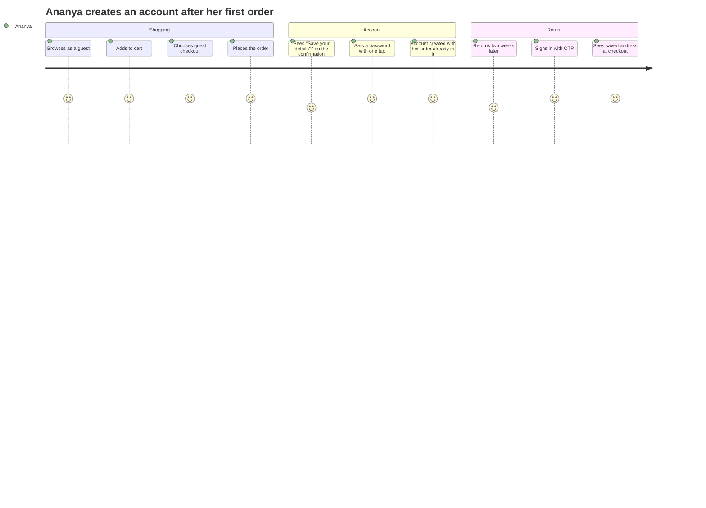
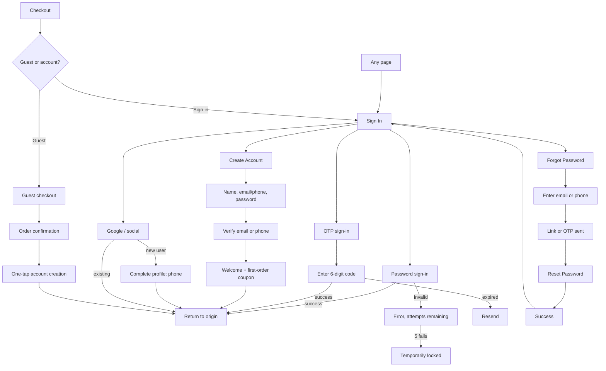
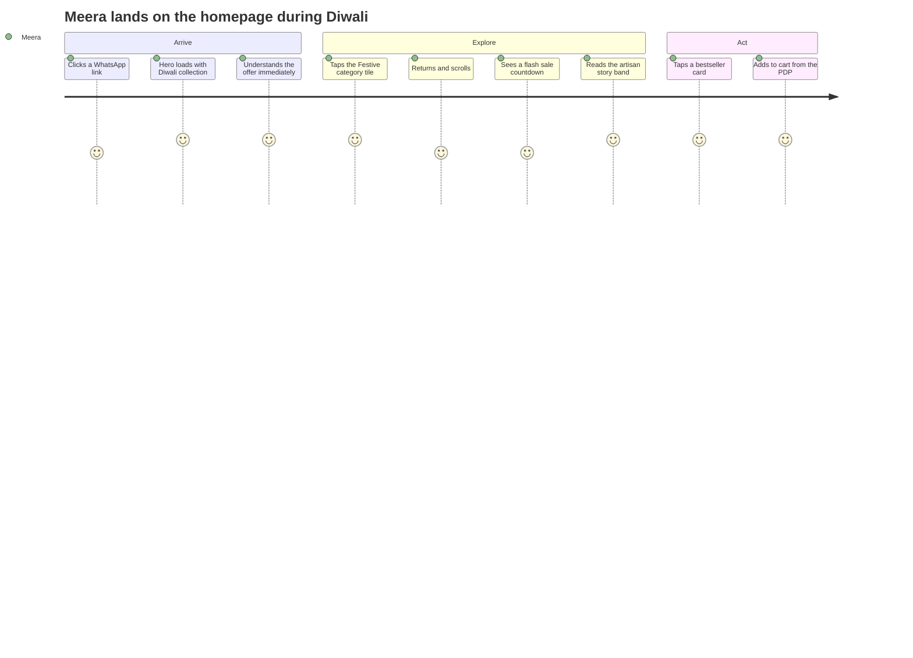
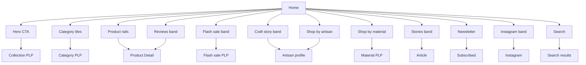

# Modules 01–02 — Authentication & Home

Enterprise Handicraft E-Commerce Platform · Customer Website UI/UX Specification

---
---

# MODULE 01 · AUTHENTICATION

## 1.1 Business Goal

Authentication is a tax on the shopper, not a feature they want. Its job is to be as short as possible while still creating an account that increases lifetime value. Every additional field costs conversion. Target: registration in under 45 seconds, sign-in in under 15 seconds, and **zero forced authentication before purchase**.

## 1.2 Purpose

Let shoppers create an account, sign in by password, OTP or social provider, recover access, and verify contact details — while making guest purchase equally easy and offering account creation at the moment it is most obviously valuable (immediately after an order).

## 1.3 Customer Journey



**Narrative:** Ananya never sees a sign-in wall. She buys as a guest. On the confirmation page a single card offers "Save your details for next time — just set a password", pre-filled with the email and address she already entered. One field, one tap, account created, order attached. When she returns she signs in by OTP because she does not remember passwords, and checkout takes 40 seconds.

## 1.4 Navigation Flow



## 1.5 Complete Screen List

| ID | Screen | Route | Type |
|----|--------|-------|------|
| PG-01-01 | Sign In | `/signin` | Page |
| PG-01-02 | Create Account | `/register` | Page |
| PG-01-03 | OTP Verification | `/signin/otp` | Page |
| PG-01-04 | Forgot Password | `/forgot-password` | Page |
| PG-01-05 | Reset Password | `/reset-password?token=` | Page |
| PG-01-06 | Email Verification Pending | `/verify-email` | Page |
| PG-01-07 | Email Verified Success | `/verify-email/success` | Page |
| PG-01-08 | Mobile Verification | `/verify-mobile` | Page |
| PG-01-09 | Complete Your Profile (post-social) | `/complete-profile` | Page |
| PG-01-10 | Account Locked | `/account-locked` | Page |
| PG-01-11 | Welcome / First Visit | `/welcome` | Page |
| PG-01-12 | Sign Out Confirmation | — | Page state |
| MOD-01-01 | Sign In Modal (contextual) | — | Modal SM |
| MOD-01-02 | Create Account Modal | — | Modal SM |
| MOD-01-03 | OTP Modal | — | Modal SM |
| MOD-01-04 | Guest or Sign In choice | — | Modal MD |
| MOD-01-05 | Post-Purchase Account Creation | — | Modal MD |
| MOD-01-06 | Session Expired | — | Modal SM |
| MOD-01-07 | Resend Verification | — | Modal SM |
| MOD-01-08 | Change Phone Number | — | Modal SM |
| MOD-01-09 | Sign Out Confirm | — | Modal XS |
| MOD-01-10 | Merge Guest Cart | — | Modal MD |
| DRW-01-01 | Account Menu (signed in) | — | Drawer/Popover |
| SHT-01-01 | Sign In Sheet (mobile) | — | Sheet |
| SHT-01-02 | OTP Sheet (mobile) | — | Sheet |
| SHT-01-03 | Guest/Sign In choice sheet | — | Sheet |
| SHT-01-04 | Account menu sheet | — | Sheet |

## 1.6 Information Architecture

```
Authentication
├── Entry points
│   ├── Header account icon
│   ├── Checkout choice screen
│   ├── Contextual prompts (wishlist, reviews, points)
│   └── Deep links from email/SMS
├── Methods
│   ├── Password (email or phone + password)
│   ├── OTP (phone or email, passwordless)
│   └── Social (Google; Apple and Facebook reserved)
├── Recovery
│   ├── Forgot password → email link or SMS OTP
│   └── Account locked → cooldown or reset
└── Verification
    ├── Email (link)
    └── Mobile (OTP) — required before COD and reviews
```

## 1.7 Screen Hierarchy

```
Sign In (PG-01-01)
├── Password tab
├── OTP tab → OTP Verification (PG-01-03)
├── Google button → Complete Profile (PG-01-09) if new
├── Forgot Password (PG-01-04) → Reset (PG-01-05)
└── Create Account (PG-01-02) → Verify (PG-01-06 / PG-01-08) → Welcome (PG-01-11)
```

## 1.8 Desktop Layout

Template `SL-11` (two-column split), max width 1200, vertically centred, min height `100vh - header`.

- **Left column (50%):** full-bleed craft photography — an artisan's hands at work — with a subtle indigo gradient overlay, a rotating quote from a maker, and the logo in the top-left. Hidden below 992 px.
- **Right column (50%):** centred form card, max width 440, padding 48. Contains logo (mobile only), heading, method tabs, form, divider, social buttons, footer link, and legal microcopy.

## 1.9 Tablet Layout

Single column, centred, max width 480, with a compact craft-photo band (height 180) above the card instead of the split. Padding 32.

## 1.10 Mobile Layout

Full-screen, no imagery band (protects LCP), padding 20. Heading at 24 px top offset. Fields at 52 px height. Primary button full-width 56 px. Social buttons full-width stacked. Sticky bottom area holds nothing — the keyboard needs the room.

**Contextual prompts on mobile use `SHT-01-01` (sheet) rather than navigating away**, so the shopper never loses their place.

## 1.11 Wireframe Description

### PG-01-01 · Sign In (Desktop)

```
┌────────────────────────────────┬─────────────────────────────────────────────┐
│                                │                                             │
│   [KARIGAR logo, white]        │            Welcome back                     │
│                                │      Sign in to continue shopping           │
│                                │                                             │
│   [ artisan photograph,        │   ┌─────────────┬─────────────┐             │
│     hands shaping clay,        │   │  Password   │     OTP     │             │
│     indigo gradient overlay ]  │   └─────────────┴─────────────┘             │
│                                │                                             │
│                                │   Email or mobile number                    │
│   "Every piece carries the     │   [ ananya@example.com               ]      │
│    hands that made it."        │                                             │
│    — Ram Prasad Sharma,        │   Password                                  │
│      Jaipur                    │   [ ••••••••••••                    👁 ]    │
│                                │                                             │
│                                │   ☐ Keep me signed in    Forgot password?   │
│                                │                                             │
│                                │   [           Sign In            ]          │
│                                │                                             │
│                                │   ──────────────  or  ──────────────        │
│                                │                                             │
│                                │   [  G  Continue with Google          ]     │
│                                │                                             │
│                                │   New to Karigar?  Create an account        │
│                                │                                             │
│                                │   By continuing you agree to our Terms      │
│                                │   and Privacy Policy.                       │
└────────────────────────────────┴─────────────────────────────────────────────┘
```

### PG-01-03 · OTP Verification

```
┌─────────────────────────────────────────────┐
│ ‹ Back                                      │
│                                             │
│         Enter the code we sent              │
│    We sent a 6-digit code to +91 98765…345  │
│                    [Change number]          │
│                                             │
│   ┌───┐ ┌───┐ ┌───┐ ┌───┐ ┌───┐ ┌───┐       │
│   │ 4 │ │ 8 │ │ 2 │ │   │ │   │ │   │       │
│   └───┘ └───┘ └───┘ └───┘ └───┘ └───┘       │
│                                             │
│   Didn't get it?  Resend in 00:24           │
│                                             │
│   [            Verify            ]          │
│                                             │
│   Trouble receiving the code?               │
│   Get it on WhatsApp instead                │
└─────────────────────────────────────────────┘
```

### MOD-01-04 · Guest or Sign In (Checkout)

```
┌────────────────────────────────────────────────────────┐
│  How would you like to check out?                 [×]  │
├────────────────────────────────────────────────────────┤
│  ┌──────────────────────────────────────────────────┐  │
│  │  Continue as guest                               │  │
│  │  Check out quickly. You can create an account    │  │
│  │  after your order.                               │  │
│  │  [        Continue as Guest        ]             │  │
│  └──────────────────────────────────────────────────┘  │
│  ┌──────────────────────────────────────────────────┐  │
│  │  Sign in                                         │  │
│  │  Use your saved addresses, cards and 2,480       │  │
│  │  reward points (worth ₹248 off).                 │  │
│  │  [            Sign In             ]              │  │
│  └──────────────────────────────────────────────────┘  │
│                                                        │
│  New here?  Create an account                          │
└────────────────────────────────────────────────────────┘
```

Both options are visually equal — guest is listed first deliberately.

### MOD-01-05 · Post-Purchase Account Creation

```
┌────────────────────────────────────────────────────────┐
│  ✓  Order placed! Save your details?              [×]  │
├────────────────────────────────────────────────────────┤
│  We already have your name, email and address from     │
│  this order. Just choose a password and you're set.    │
│                                                        │
│  ananya@example.com                     (from order)   │
│                                                        │
│  Create a password                                     │
│  [ ••••••••••••                              👁 ]      │
│  ●●●○ Good                                             │
│                                                        │
│  ✓ Track this order    ✓ Faster checkout next time     │
│  ✓ 100 welcome points  ✓ Save your wishlist            │
│                                                        │
│  [        Create My Account        ]                   │
│  [           Not now              ]                    │
└────────────────────────────────────────────────────────┘
```

## 1.12 Header

Auth pages use a **minimal header**: logo only, centred on mobile, left-aligned on desktop, with a "Need help?" link on the right. No navigation, no search, no cart — nothing to distract from completing the task. Contextual modals and sheets keep the full site header behind them.

## 1.13 Mega Menu / Navigation

Not present on dedicated auth pages. The account entry point in the site header shows: signed out → person icon + "Sign in" (label hidden below 992); signed in → avatar + first name opening `DRW-01-01`.

**Account menu contents (signed in):** greeting, points chip, My Orders, Wishlist (count), Addresses, Rewards, Coupons (count), Notifications (count), Profile & Security, Help, Sign Out.

## 1.14 Footer

Auth pages use the **minimal footer**: copyright, Privacy Policy, Terms, Help — three links maximum, `body-xs`, centred.

## 1.15 Breadcrumb

Not used in this module.

## 1.16 Search

Not present on auth pages.

## 1.17 Filters

Not applicable.

## 1.18 Sorting

Not applicable.

## 1.19 Cards

| Card | Usage |
|------|-------|
| Auth form card | `bg-surface`, radius-xl, `elevation-2`, padding 48 desktop / 20 mobile; on mobile it is a flat full-width panel with no card chrome |
| Method choice card (guest/sign-in) | Bordered card with heading, benefit list and a full-width CTA |
| Benefit list | Check-icon list used in registration and post-purchase prompts |

## 1.20 Widgets

| Widget | Spec |
|--------|------|
| Password strength meter | 4-segment bar + label (Weak / Fair / Good / Strong) + a live requirement checklist that ticks as each rule is satisfied |
| OTP timer | Countdown `00:24` beside "Resend"; resend disabled until zero, then becomes a link |
| Social button row | Google (and reserved Apple/Facebook), full-width, 52 px, official brand marks, `border-strong` outline style |
| Trust strip | "🔒 Your details are encrypted" beneath the form |
| Attempt counter | "3 attempts remaining" appears only after the first failure |

## 1.21 Forms & Fields

### Sign In — Password

| Field | Type | Required | Placeholder | Autocomplete | Notes |
|-------|------|----------|-------------|--------------|-------|
| Email or mobile | Text | Yes | ananya@example.com or 98765 43210 | `username` | Accepts either; detects and validates by format |
| Password | Password | Yes | — | `current-password` | Reveal toggle; caps-lock warning |
| Keep me signed in | Checkbox | No | — | — | Default off; helper "Stay signed in for 30 days on this device" |

### Sign In — OTP

| Field | Type | Required | Notes |
|-------|------|----------|-------|
| Mobile or email | Text | Yes | Country selector defaults to +91 |
| OTP | 6-box numeric | Yes | `one-time-code` autocomplete; auto-advance, paste-fill, auto-submit |

### Create Account

| Field | Type | Required | Placeholder | Autocomplete | Notes |
|-------|------|----------|-------------|--------------|-------|
| Full name | Text | Yes | Ananya Iyer | `name` | Split into first/last only if the store needs it — one field converts better |
| Email | Email | Yes | ananya@example.com | `email` | Uniqueness checked on blur |
| Mobile number | Phone | Yes | 98765 43210 | `tel` | +91 default; needed for delivery updates |
| Password | Password | Yes | — | `new-password` | Strength meter + checklist |
| Marketing consent | Checkbox | No | — | — | **Unticked.** "Send me craft stories and offers by email and WhatsApp" |
| Terms | Implicit | — | — | — | "By creating an account you agree to our Terms and Privacy Policy" — no checkbox required, stated as microcopy |

### Forgot Password

| Field | Type | Required | Notes |
|-------|------|----------|-------|
| Email or mobile | Text | Yes | Determines whether a link or an OTP is sent |

### Reset Password

| Field | Type | Required | Notes |
|-------|------|----------|-------|
| New password | Password | Yes | Strength meter |
| Confirm password | Password | Yes | Match validation on blur |
| Sign out other devices | Checkbox | No | Default on |

### Complete Your Profile (post-social)

| Field | Type | Required | Notes |
|-------|------|----------|-------|
| Mobile number | Phone | Yes | Required for delivery updates |
| Marketing consent | Checkbox | No | Unticked |

## 1.22 Validation Rules

| Field | Rule | Message |
|-------|------|---------|
| Email/mobile | Required | "Enter your email or mobile number" |
| Email | Valid format | "Enter a valid email address" |
| Mobile | 10 digits | "Enter a valid 10-digit mobile number" |
| Password (sign-in) | Required | "Enter your password" |
| Credentials | Invalid pair | "The email or password is incorrect. 4 attempts remaining." |
| Attempts | 5 failures | "Too many attempts. Try again in 15 minutes, or [reset your password]." |
| Full name | Required, 2–60, letters/spaces/hyphens/apostrophes | "Enter your name" / "Names can only contain letters, spaces, hyphens and apostrophes" |
| Email | Already registered | "This email is already registered. [Sign in instead]" |
| Mobile | Already registered | "This number is already registered. [Sign in instead]" |
| Password (new) | ≥8 chars, 1 letter, 1 number | "Use at least 8 characters with a letter and a number" |
| Password | Common/breached | "That password is too common. Choose something harder to guess." |
| Password | Contains name/email | "Don't use your name or email in your password" |
| Confirm password | Match | "Passwords don't match" |
| OTP | 6 digits | "Enter the 6-digit code" |
| OTP | Wrong | "That code isn't right. 2 attempts left." |
| OTP | Expired | "This code has expired. [Send a new one]" |
| OTP | Too many resends | "You've requested too many codes. Try again in 30 minutes." |
| Reset token | Expired | "This link has expired. [Request a new one]" |
| Reset token | Used | "This link has already been used. [Request a new one]" |
| Social | Email already exists with password | "You already have an account with this email. Sign in with your password, then link Google from your profile." |
| Verification | Email not verified | Non-blocking banner: "Verify your email to secure your account. [Resend]" |
| Verification | Mobile not verified for COD | "Verify your mobile number to use cash on delivery. [Verify now]" |

## 1.23 Action Buttons

| Button | Type | Placement | Behaviour |
|--------|------|-----------|-----------|
| Sign In | Primary XL, full-width | Form | Loading → success → redirect to origin |
| Create Account | Primary XL, full-width | Form | Loading → verification step |
| Send Code | Primary XL | OTP tab | Loading → OTP screen with timer started |
| Verify | Primary XL | OTP screen | Auto-triggers on the 6th digit |
| Resend | Link | Below OTP | Disabled until the timer reaches zero |
| Continue with Google | Outline XL, full-width | Below divider | Opens the provider flow |
| Forgot password? | Link | Beside the password label | Navigates or opens a sheet |
| Create an account | Link | Form footer | — |
| Continue as Guest | Primary XL | Checkout choice | — |
| Not now | Ghost | Post-purchase prompt | Neutral wording, no shaming |
| Change number | Link | OTP screen | Returns with the field focused |
| Get it on WhatsApp | Link | OTP screen | Alternate delivery channel |
| Sign Out | Danger-ghost | Account menu | Confirmation modal |

## 1.24 Icons

Account `user-round` · Password visible `eye` / hidden `eye-off` · Email `mail` · Phone `phone` · OTP `message-square-lock` · WhatsApp brand mark · Google brand mark · Lock `lock` · Verified `badge-check` · Warning `triangle-alert` · Success `circle-check` · Back `chevron-left` · Timer `clock`.

## 1.25 Typography & Spacing

| Element | Style |
|---------|-------|
| Page heading | `heading-xl` (Fraunces) |
| Sub-heading | `body-md`, `text-secondary` |
| Field label | `label-lg` |
| Input text | `body-md` |
| Helper/error | `body-xs` |
| Button | `button-lg` |
| Legal microcopy | `body-xs`, `text-tertiary` |
| Card padding | 48 desktop / 32 tablet / 20 mobile |
| Field gap | 20 |
| Section gap | 32 |
| Heading → form gap | 32 |

## 1.26 Images / Video / Carousels

The desktop side panel uses one artisan photograph per session, selected from a curated set of six, with a matching maker quote. Images are 1200×1600 (3:4), ≤140 KB, lazy-loaded (they are not the LCP element on desktop because the form renders first). No video, no carousel — auth pages must be fast and quiet.

## 1.27 Pagination

Not applicable.

## 1.28 Empty State

Not applicable — forms are never empty in the data sense.

## 1.29 Loading State & Skeleton

| Surface | Treatment |
|---------|-----------|
| Form submit | Button spinner, fields disabled, no layout shift |
| Social redirect | Full-card overlay: spinner + "Connecting to Google…" |
| OTP send | Button spinner then transition to the OTP screen |
| Page load | No skeleton — the form is rendered server-side and is instantly interactive |

## 1.30 Success State

| Event | Treatment |
|-------|-----------|
| Sign in | Brief success check on the button, then redirect to the origin page with a toast "Welcome back, Ananya" |
| Account created | Welcome page: check animation, "Welcome to Karigar", 100 welcome points awarded, first-order coupon shown with a copy action, and "Start Shopping" |
| Email verified | Success page with a check and "Continue Shopping" |
| Mobile verified | Inline success chip on the profile, toast "Mobile number verified" |
| Password reset | Success page: "Your password has been changed" + "Sign In" |
| Post-purchase account created | Modal turns into a success state showing the order already attached |

## 1.31 Error State

| Error | Treatment |
|-------|-----------|
| Invalid credentials | Form-level danger alert above the fields; password cleared, email retained; attempts remaining shown |
| Account locked | Dedicated page with a countdown, an explanation and a reset-password path |
| OTP wrong | Boxes flash danger and clear; attempts remaining shown; field refocuses on box 1 |
| Network failure | Inline alert "Check your connection and try again" with a Retry that preserves all input |
| Social provider failure | "We couldn't connect to Google. [Try again] or [use email instead]" |
| Expired reset link | Page state with "Request a new link" |
| Server error | Alert + reference code + support link; input preserved |
| Email already registered | Inline field error with a direct "Sign in instead" link that carries the email across |

## 1.32 Confirmation Dialogs

| Dialog | Title | Body | Buttons |
|--------|-------|------|---------|
| Sign out | "Sign out?" | "You'll need to sign in again to see your orders and saved items." | Cancel · Sign Out |
| Merge guest cart | "You have items in two carts" | Shows both lists; "We'll combine them so nothing is lost." | Keep Both (default) · Use Signed-in Cart · Use Guest Cart |
| Session expired | "Your session timed out" | "For your security we signed you out. Your cart is saved." | Continue as Guest · Sign In |
| Leave verification | "Verify later?" | "You can still shop, but you'll need to verify your mobile number for cash on delivery." | Verify Now · Skip for Now |

## 1.33 Notifications

| Trigger | Type | Message |
|---------|------|---------|
| Signed in | Success toast | "Welcome back, {first name}" |
| Signed out | Info toast | "You've been signed out" |
| Account created | Success toast | "Account created · 100 points added" |
| Email verification sent | Info toast | "Verification email sent to {email}" |
| Email verified | Success toast | "Email verified" |
| Mobile verified | Success toast | "Mobile number verified" |
| Password changed | Success toast | "Password updated" |
| Cart merged | Info toast | "We combined your carts — {n} items" |
| Guest wishlist merged | Info toast | "{n} saved items added to your wishlist" |
| New device sign-in | Email + in-app | "New sign-in from {device} in {city}" |

## 1.34 Micro-interactions & Animation

Tab switch between Password and OTP slides the indicator (250 ms) and cross-fades the panel · Password reveal toggles the icon with a 150 ms cross-fade · Strength meter segments fill sequentially with a colour transition · OTP boxes scale 1.05 on focus and the filled box gets a brand border · Completing the OTP flashes all six boxes success then auto-submits · Social button shows a spinner in place of its brand mark · Success check draws over 400 ms with `ease-craft` · Error shake is 3 px, 200 ms, disabled under reduced motion · The artisan quote cross-fades every 8 seconds on desktop.

## 1.35 Accessibility

- The method tabs are a proper tablist with arrow-key navigation.
- OTP boxes are a single labelled group; the accessible label is "Verification code, 6 digits"; each box announces its position.
- `autocomplete="one-time-code"` enables SMS autofill on iOS and Android — a significant conversion win.
- Password reveal announces "Password shown"/"Password hidden".
- The strength meter is described in text, not colour alone.
- Errors are linked to their fields and announced assertively on submit.
- The caps-lock warning is announced.
- Social buttons include the provider name in text, never icon-only.
- The countdown announces politely at 30 s and 0 s only, not every second.
- Focus moves to the form-level alert on failed submit, then to the first invalid field on the next tab.
- All flows completable by keyboard alone; no keyboard trap in the social provider window.

## 1.36 Responsive Behaviour

| Element | Desktop | Tablet | Mobile |
|---------|---------|--------|--------|
| Layout | Split 50/50 | Single column + photo band | Single column, no photo |
| Card | 440 wide, elevated | 480 wide, elevated | Full-width, flat |
| Field height | 48 | 48 | 52 |
| Button height | 52 | 52 | 56 |
| Contextual auth | Modal | Modal | Bottom sheet |
| OTP boxes | 48×56 | 48×56 | 44×52 (fits 6 across at 390) |
| Social buttons | Full-width stacked | Full-width stacked | Full-width stacked |

## 1.37 Prototype Flow (SP-11)

Sign In → wrong password (error state, attempts shown) → correct password → welcome toast → return to origin. Branch: OTP tab → send code → OTP screen → wrong code → correct code → success. Branch: Create Account → validation errors → success → verification → welcome. Branch: Checkout → guest/sign-in choice → guest → order → post-purchase account creation → success.

## 1.38 Figma Components & Variants

**Required:** `CMP-INP-TextField`, `CMP-INP-PhoneInput`, `CMP-INP-OtpInput`, `CMP-INP-Checkbox`, `CMP-ACT-Button`, `CMP-NAV-Tabs`, `CMP-FBK-Alert`, `CMP-FBK-InlineMessage`, `CMP-OVL-Modal`, `CMP-OVL-BottomSheet`, `CMP-FBK-SuccessState`, `CMP-IND-TrustBadge`.

**New to build:**

| Component | Variants |
|-----------|----------|
| `CMP-AUT-Card` | Breakpoint (Desktop/Tablet/Mobile) × Elevated (Y/N) |
| `CMP-AUT-SocialButton` | Provider (Google/Apple/Facebook) × State (Default/Hover/Loading/Disabled) |
| `CMP-AUT-StrengthMeter` | Level (Empty/Weak/Fair/Good/Strong) |
| `CMP-AUT-OtpTimer` | State (Counting/Ready/Exhausted) |
| `CMP-AUT-BenefitList` | Items (3/4/5) |
| `CMP-AUT-MethodChoiceCard` | Type (Guest/SignIn/Register) × State (Default/Hover/Focus) |
| `CMP-AUT-BrandPanel` | Image (6 variants) × Quote (shown/hidden) |

## 1.39 Auto Layout Structure

```
Frame: Sign In — Desktop 1440 (H, Fill × Fill, gap 0)
├── Instance: BrandPanel (50%, Fill × Fill)
└── Frame: Form Column (50%, V, Fill × Fill, centre, padding 64)
    └── Instance: AUT-Card (440 fixed × Hug, V, gap 32, padding 48)
        ├── Frame: Heading (V, Fill × Hug, gap 8)
        ├── Instance: Tabs (Fill × 44)
        ├── Frame: Fields (V, Fill × Hug, gap 20)
        ├── Frame: Options Row (H, Fill × Hug, space-between)
        ├── Instance: Button / Sign In (Fill × 52)
        ├── Instance: Divider with label
        ├── Frame: Social (V, Fill × Hug, gap 12)
        ├── Frame: Footer Link (H, Fill × Hug, centre)
        └── txt / Legal microcopy (Fill)
```

## 1.40 UX Guidelines · Developer Notes · Analytics · Scalability

### UX Guidelines

| ID | Guideline |
|----|-----------|
| AU-01 | Never gate browsing, wishlisting or checkout behind authentication |
| AU-02 | Guest checkout is presented first and with equal visual weight |
| AU-03 | Account creation is offered when its value is obvious — after an order, not before |
| AU-04 | OTP is a first-class sign-in method, not a fallback; many Indian shoppers never set a password |
| AU-05 | One name field, not two, unless there is a hard requirement |
| AU-06 | Marketing consent is never pre-ticked and is separate from the terms |
| AU-07 | Error messages state attempts remaining so the shopper can gauge risk |
| AU-08 | Never clear the whole form on error — only the password field |
| AU-09 | Contextual authentication appears as an overlay so the shopper keeps their place |
| AU-10 | Guest carts and wishlists merge on sign-in with a visible, reversible explanation |
| AU-11 | Verification is non-blocking except where legally or operationally required (COD, reviews) |
| AU-12 | Return the shopper to exactly where they were after signing in |

### Developer Notes

1. Correct `autocomplete` attributes throughout — `username`, `current-password`, `new-password`, `one-time-code`, `tel`, `name` — these materially affect conversion.
2. OTP autofill requires the SMS to carry the correct origin-bound format.
3. Rate limit by IP and by identifier; the UI shows a friendly countdown, never a raw 429.
4. Password reset tokens are single-use with a 60-minute expiry; expired links land on a state that offers a new one.
5. Session cookies are `HttpOnly`, `Secure`, `SameSite=Lax`; "Keep me signed in" extends to 30 days with a refresh policy.
6. Cart and wishlist merge runs server-side and is idempotent; the UI explains what happened.
7. Return-URL handling must be validated against an allow-list to prevent open redirects.
8. New-device sign-in triggers an email notification.
9. Social sign-in returning an email that already exists with a password must **not** silently link accounts — the UI directs the shopper to sign in and link deliberately.

### Analytics Events

`sign_in_start` (method) · `sign_in_success` (method) · `sign_in_failure` (reason) · `register_start` (source) · `register_success` · `otp_sent` · `otp_verified` · `otp_failed` · `social_auth_start` (provider) · `password_reset_request` · `password_reset_complete` · `guest_checkout_selected` · `post_purchase_account_created` · `cart_merged` (items).

### Future Scalability

Apple and Facebook sign-in (buttons reserved) · passkeys/WebAuthn as the primary method with password as fallback · magic links by email · phone-number-only accounts with no email · B2B accounts with company profiles and multiple contacts · SSO for corporate gifting clients · progressive profiling that collects preferences over time rather than at registration.

---
---

# MODULE 02 · HOME

## 2.1 Business Goal

The homepage is the brand's shop window and the primary routing surface for returning shoppers. Its job is to communicate what makes this store different within three seconds, route shoppers into a category or product within eight seconds, and merchandise seasonal demand. Target: ≥85% of visitors interact with a discovery surface; ≥35% reach a PDP within the session; LCP ≤2.5 s.

## 2.2 Purpose

Establish the craft proposition, surface seasonal and personalised merchandising, provide fast routes into the catalogue, and build trust through artisan storytelling, reviews and guarantees.

## 2.3 Customer Journey



## 2.4 Navigation Flow



## 2.5 Complete Screen List

| ID | Screen / Section | Type |
|----|------------------|------|
| PG-02-01 | Home | Page |
| SEC-02-01 | Hero banner / slider | Band |
| SEC-02-02 | Trust badges strip | Band |
| SEC-02-03 | Shop by category | Band |
| SEC-02-04 | Flash sale (conditional) | Band |
| SEC-02-05 | Featured products | Rail |
| SEC-02-06 | New arrivals | Rail |
| SEC-02-07 | Festival collection | Band |
| SEC-02-08 | The handmade story | Editorial band |
| SEC-02-09 | Shop by material | Band |
| SEC-02-10 | Bestsellers | Rail |
| SEC-02-11 | Trending now | Rail |
| SEC-02-12 | Shop by artisan | Band |
| SEC-02-13 | Featured brands / workshops | Band |
| SEC-02-14 | Customer reviews | Band |
| SEC-02-15 | Recently viewed (conditional) | Rail |
| SEC-02-16 | Recommended for you (conditional) | Rail |
| SEC-02-17 | Stories from the blog | Band |
| SEC-02-18 | Instagram feed | Band |
| SEC-02-19 | Newsletter | Band |
| MOD-02-01 | Newsletter popup | Modal |
| MOD-02-02 | Cookie consent | Banner |
| MOD-02-03 | Location / currency prompt | Modal SM |
| MOD-02-04 | Quick view (from a card) | Modal MD |
| MOD-02-05 | Video lightbox (story band) | Modal Full |
| MOD-02-06 | App install prompt | Banner |
| DRW-02-01 | Mini cart | Drawer |
| DRW-02-02 | Mobile nav drawer | Drawer |
| SHT-02-01 | Quick view sheet | Sheet |
| SHT-02-02 | Newsletter sheet | Sheet |
| SHT-02-03 | Category sheet | Sheet |

## 2.6 Information Architecture

Band order is a merchandising decision governed by these rules:

1. **Hero** — the single most important message. Never more than 3 slides.
2. **Trust** — immediately after the hero; answers "can I trust this store?" before any selling.
3. **Category routing** — the fastest path for shoppers who know what they want.
4. **Time-sensitive merchandising** — flash sale or festival, only when live.
5. **Product discovery rails** — featured, new, bestsellers, trending.
6. **Brand story** — the craft differentiator, placed after the shopper has seen products so it reads as substance, not preamble.
7. **Personalised rails** — recently viewed and recommendations, only when data exists.
8. **Social proof** — reviews and Instagram.
9. **Content** — blog stories.
10. **Capture** — newsletter, last.

**Maximum 12 bands render on any single load.** Bands with no content are removed entirely, never shown empty.

## 2.7 Screen Hierarchy

```
Home (PG-02-01)
├── Shell: announcement, header, nav
├── SEC-02-01 Hero (1–3 slides)
├── SEC-02-02 Trust strip
├── SEC-02-03 Categories (8 tiles)
├── SEC-02-04 Flash sale [conditional]
├── SEC-02-05 Featured rail
├── SEC-02-06 New arrivals rail
├── SEC-02-07 Festival collection [conditional]
├── SEC-02-08 Handmade story (editorial + video)
├── SEC-02-09 Shop by material (6 tiles)
├── SEC-02-10 Bestsellers rail
├── SEC-02-11 Trending rail
├── SEC-02-12 Shop by artisan (4 cards)
├── SEC-02-13 Featured workshops
├── SEC-02-14 Reviews band
├── SEC-02-15 Recently viewed [conditional]
├── SEC-02-16 Recommended [conditional]
├── SEC-02-17 Blog stories (3 cards)
├── SEC-02-18 Instagram (6 tiles)
├── SEC-02-19 Newsletter
└── Footer
```

## 2.8 Desktop Layout

Template `SL-01` (full-bleed bands). Container max 1440 with 40 px margins; hero, festival band and Instagram may go edge-to-edge. Band spacing 80 px. Every band has: an optional overline, an `display-lg` heading, an optional sub-line, an optional "View all →" link aligned right on the heading row, then content.

## 2.9 Tablet Layout

Container 720/960. Band spacing 64. Category tiles 4 across (2 rows). Rails show 3.5 cards. Story band becomes stacked (image above text). Instagram 4 tiles. Reviews 2 across.

## 2.10 Mobile Layout

Container fluid, 16 px margins. Band spacing 56. Hero uses the 4:5 crop with content below the image. Category tiles become a 2-column grid or a horizontally scrolling circular strip depending on the campaign. All rails show 2.2 cards. Story band stacks with the video as a tap-to-play poster. Instagram 2×3. Reviews one per slide in a swipeable carousel.

**Mobile band order is re-sequenced:** Hero → Categories → Trust (compact 2×2) → Flash/Festival → Bestsellers → New Arrivals → Story → Recommended → Reviews → Blog → Newsletter. Category routing moves above trust because mobile shoppers scroll with intent.

## 2.11 Wireframe Description

### Desktop

```
┌──────────────────────────────────────────────────────────────────────────────────────┐
│ Free shipping above ₹999 · Diwali sale live now · Track your order              [×]   │
├──────────────────────────────────────────────────────────────────────────────────────┤
│ [LOGO]  [ ⌕ Search for pottery, diyas, cushions…      ]        ₹▾  👤  ♡2  🛍3        │
│ Shop ▾  New Arrivals  Festive  Gifting  Artisans  Stories  Sale              Help ▾   │
├──────────────────────────────────────────────────────────────────────────────────────┤
│ ╔══════════════════════════════════════════════════════════════════════════════════╗ │
│ ║  HANDMADE FOR DIWALI                                                             ║ │
│ ║  Light your home with                     [ full-bleed hero photograph:          ║ │
│ ║  pieces made by hand                        brass diyas glowing, warm light ]    ║ │
│ ║  Brass diyas, blue pottery and                                                   ║ │
│ ║  festive décor from artisans across India                                        ║ │
│ ║  [ Shop the Collection ]  [ Meet the Makers ]                                    ║ │
│ ║                                                    ● ○ ○                         ║ │
│ ╚══════════════════════════════════════════════════════════════════════════════════╝ │
├──────────────────────────────────────────────────────────────────────────────────────┤
│  🤲 100% Handmade    ✅ 7-Day Returns    🔒 Secure Payments    🚚 Free above ₹999      │
├──────────────────────────────────────────────────────────────────────────────────────┤
│ Shop by Category                                                        View all →   │
│ ┌────────┐ ┌────────┐ ┌────────┐ ┌────────┐                                          │
│ │ Home   │ │Festive │ │Textiles│ │ Wood-  │                                          │
│ │ Décor  │ │& Ritual│ │        │ │ craft  │                                          │
│ │ 312    │ │ 186    │ │ 248    │ │ 164    │                                          │
│ └────────┘ └────────┘ └────────┘ └────────┘                                          │
│ ┌────────┐ ┌────────┐ ┌────────┐ ┌────────┐                                          │
│ │Jewel…  │ │Gifting │ │Garden  │ │  Sale  │                                          │
│ └────────┘ └────────┘ └────────┘ └────────┘                                          │
├──────────────────────────────────────────────────────────────────────────────────────┤
│ ⚡ FLASH SALE  Ends in  02 : 14 : 33                                    Shop all →    │
│ ┌────────┐ ┌────────┐ ┌────────┐ ┌────────┐ ┌────────┐                        ‹  ›   │
│ │ -40%   │ │ -35%   │ │ -40%   │ │ -30%   │ │ -45%   │                               │
│ │ [card] │ │ [card] │ │ [card] │ │ [card] │ │ [card] │                               │
│ │ 12 left│ │ 4 left │ │ 28 left│ │ 9 left │ │ 2 left │                               │
│ └────────┘ └────────┘ └────────┘ └────────┘ └────────┘                               │
├──────────────────────────────────────────────────────────────────────────────────────┤
│ New Arrivals                                                            View all →   │
│ [5 product cards, horizontally scrollable]                                    ‹  ›   │
├──────────────────────────────────────────────────────────────────────────────────────┤
│ ╔══════════════════════════════════════════════════════════════════════════════════╗ │
│ ║  ┌──────────────────────┐   MADE BY HAND, NOT BY MACHINE                         ║ │
│ ║  │                      │   Every piece in our collection is made by an artisan   ║ │
│ ║  │  [artisan at work    │   whose name we know. No two are identical — and that   ║ │
│ ║  │   photograph or      │   is exactly the point.                                 ║ │
│ ║  │   video with play]   │                                                         ║ │
│ ║  │                      │   🤲 240 artisans   🏘 18 craft clusters                ║ │
│ ║  └──────────────────────┘   [ Read Our Story ]  [ Meet the Makers ]               ║ │
│ ╚══════════════════════════════════════════════════════════════════════════════════╝ │
├──────────────────────────────────────────────────────────────────────────────────────┤
│ Shop by Material                                                                      │
│ ( Brass )( Ceramic )( Terracotta )( Wood )( Cotton )( Silk )                          │
├──────────────────────────────────────────────────────────────────────────────────────┤
│ Bestsellers                                                             View all →   │
│ [5 product cards]                                                             ‹  ›   │
├──────────────────────────────────────────────────────────────────────────────────────┤
│ Meet the Makers                                                         View all →   │
│ ┌───────────┐ ┌───────────┐ ┌───────────┐ ┌───────────┐                              │
│ │ [portrait]│ │ [portrait]│ │ [portrait]│ │ [portrait]│                              │
│ │ Ram Prasad│ │ Lakshmi D.│ │ Mohan S.  │ │ Anita B.  │                              │
│ │ Blue      │ │ Kantha    │ │ Channa-   │ │ Dhokra    │                              │
│ │ Pottery   │ │ Embroidery│ │ patna Wood│ │ Metal     │                              │
│ │ Jaipur    │ │ Bengal    │ │ Karnataka │ │ Odisha    │                              │
│ │ 212 pieces│ │ 168 pieces│ │ 94 pieces │ │ 76 pieces │                              │
│ └───────────┘ └───────────┘ └───────────┘ └───────────┘                              │
├──────────────────────────────────────────────────────────────────────────────────────┤
│ What Our Customers Say                            ★ 4.7 average from 3,214 reviews   │
│ ┌──────────────┐ ┌──────────────┐ ┌──────────────┐                            ‹  ›  │
│ │ ★★★★★        │ │ ★★★★★        │ │ ★★★★☆        │                                   │
│ │ "The colours │ │ "Gifted this │ │ "Beautiful   │                                   │
│ │  are richer…"│ │  to my mum…" │ │  work…"      │                                   │
│ │ [photo]      │ │              │ │ [photo]      │                                   │
│ │ Meera N.  ✓  │ │ Arjun K.  ✓  │ │ Sara T.  ✓   │                                   │
│ └──────────────┘ └──────────────┘ └──────────────┘                                   │
├──────────────────────────────────────────────────────────────────────────────────────┤
│ Recently Viewed                                                                 ‹  › │
│ Recommended for You  ✨                                                          ‹  › │
├──────────────────────────────────────────────────────────────────────────────────────┤
│ Stories from the Workshop                                               View all →   │
│ [3 article cards]                                                                    │
├──────────────────────────────────────────────────────────────────────────────────────┤
│ @karigarcrafts on Instagram                                            Follow us →   │
│ [6 square tiles]                                                                     │
├──────────────────────────────────────────────────────────────────────────────────────┤
│ Join the Karigar circle — craft stories and early access                              │
│ [ your@email.com                          ] [ Subscribe ]   ☐ I agree to receive…    │
├──────────────────────────────────────────────────────────────────────────────────────┤
│ FOOTER                                                                                │
└──────────────────────────────────────────────────────────────────────────────────────┘
```

### Mobile

```
┌──────────────────────────────────┐
│ Free shipping above ₹999    [×]  │
├──────────────────────────────────┤
│ ☰    KARIGAR         ♡2   🛍3    │
│ [ ⌕ Search handmade treasures ]  │
│ New · Festive · Décor · Gifts    │
├──────────────────────────────────┤
│                                  │
│    [ hero image 4:5, diyas ]     │
│                                  │
│ HANDMADE FOR DIWALI              │
│ Light your home with pieces      │
│ made by hand                     │
│ [   Shop the Collection    ]     │
│ ● ○ ○                            │
├──────────────────────────────────┤
│ Shop by Category                 │
│ ┌──────────┐ ┌──────────┐        │
│ │Home Décor│ │ Festive  │        │
│ └──────────┘ └──────────┘        │
│ ┌──────────┐ ┌──────────┐        │
│ │ Textiles │ │ Gifting  │        │
│ └──────────┘ └──────────┘        │
│         [ View all ]             │
├──────────────────────────────────┤
│ 🤲 Handmade     ✅ 7-day returns │
│ 🔒 Secure pay   🚚 Free ₹999+    │
├──────────────────────────────────┤
│ ⚡ FLASH SALE   02:14:33          │
│ [2.2 product cards, swipe]       │
├──────────────────────────────────┤
│ Bestsellers            View all →│
│ [2.2 product cards, swipe]       │
├──────────────────────────────────┤
│ [ artisan photo / video 4:5 ]    │
│ MADE BY HAND, NOT BY MACHINE     │
│ Every piece is made by an        │
│ artisan whose name we know.      │
│ [   Meet the Makers   ]          │
├──────────────────────────────────┤
│ … remaining bands …              │
├──────────────────────────────────┤
│ 🏠   🛍   🔍   ♡   👤            │
└──────────────────────────────────┘
```

## 2.12 Header

Full site header per `01-CX-Foundations §5`. The homepage is the only page where the header is **not** compacted on initial load — the full-height header with the nav bar is part of the brand impression. Compaction begins after 120 px of scroll as elsewhere.

## 2.13 Mega Menu / Navigation

Full mega menu available. On the homepage, hovering "Shop" is the second-most-used navigation action after the search field, so the panel must open within 150 ms and render without layout shift — its content is pre-rendered and hidden, not fetched on hover.

## 2.14 Footer

Full footer with the newsletter band.

## 2.15 Breadcrumb

Not present on the homepage.

## 2.16 Search

Header search is prominent (480 px desktop, full-width row on mobile) with rotating example placeholders. On mobile the search field is a persistent row beneath the header, not hidden behind an icon — search is the primary discovery tool for returning shoppers.

## 2.17 Filters

Not applicable.

## 2.18 Sorting

Not applicable. Rail ordering is merchandising-controlled, with these definitions surfaced in the admin: Featured (manual), New Arrivals (published in the last 30 days, newest first), Bestsellers (units sold in the last 30 days), Trending (view velocity in the last 7 days), Recommended (personalisation engine).

## 2.19 Cards

| Card | Where | Spec |
|------|-------|------|
| Product card MD | All product rails | `CMP-PRD-Card` — image, title, artisan, rating, price, badges, wishlist |
| Category tile | Categories band | 4:3 image, overlay label, product count, hover zoom |
| Material chip tile | Materials band | 120×120 circular material texture image + label |
| Artisan card | Meet the Makers | Portrait, name, craft, cluster, piece count, link |
| Review card | Reviews band | Rating, quote (3-line clamp), photo, name, verified badge, product link |
| Article card | Stories band | 16:9 cover, category chip, title, excerpt, reading time |
| Instagram tile | Instagram band | Square image, hover overlay with engagement counts |
| Workshop/brand card | Featured brands | Logo or workshop photo, name, region, product count |

## 2.20 Widgets

| Widget | Spec |
|--------|------|
| Hero slider | Max 3 slides, 7 s interval, pause control, dots, keyboard, swipe. **Slide 1 renders server-side and is the LCP element — it never lazy-loads and the carousel does not initialise until after LCP.** |
| Trust strip | 4 items desktop / 2×2 mobile, icon 32 + label + optional sub-line |
| Flash sale band | Countdown (server-anchored), product rail with per-item stock remaining, "Shop all" link. **Renders only while a genuine sale window is active**; the entire band is absent otherwise |
| Festival band | Full-bleed image, headline, CTA, optional countdown |
| Story band | Split image/video + text, stat chips (artisans, clusters), two CTAs |
| Newsletter band | Email field, subscribe button, unticked consent checkbox, incentive line, privacy link |
| Instagram band | 6 tiles, follow CTA, graceful removal if the feed fails |
| Personalised rails | Render only with sufficient data (≥1 viewed product / ≥3 signals); otherwise absent, never a placeholder |

## 2.21 Forms & Fields

| Form | Fields |
|------|--------|
| Header search | Query (see Module 13) |
| Newsletter band | Email (required, `email` autocomplete), consent checkbox (unticked, required for EU-style compliance where applicable), optional name |
| Newsletter popup | Same, plus the incentive display |
| Currency/location prompt | Country select, currency select, "Remember my choice" |

## 2.22 Validation Rules

| Field | Rule | Message |
|-------|------|---------|
| Newsletter email | Required | "Enter your email address" |
| Newsletter email | Valid format | "Enter a valid email address" |
| Newsletter email | Already subscribed | "You're already on the list — thank you!" (treated as success, not error) |
| Newsletter consent | Required where mandated | "Please tick the box to subscribe" |
| Rate limit | Too many attempts | "Please try again in a few minutes" |

## 2.23 Action Buttons

| Button | Type | Placement |
|--------|------|-----------|
| Hero primary CTA | Primary LG | Hero content block |
| Hero secondary CTA | Outline LG (on-image variant with a scrim) | Hero content block |
| View all | Link with chevron | Every band heading row |
| Shop the Collection | Primary LG | Festival/flash bands |
| Read Our Story / Meet the Makers | Outline LG | Story band |
| Add to Cart | Primary SM | Product cards (hover on desktop) |
| Quick View | Ghost on-image | Product cards (hover, desktop only) |
| Subscribe | Primary MD | Newsletter |
| Follow us | Outline MD | Instagram band |
| Rail arrows | Icon button on-image | Rails |

## 2.24 Icons

Category icons (craft set) · `flame` trending · `award` bestseller · `badge-plus` new · `zap` flash sale · `clock` countdown · `hand-heart` handmade · `truck` shipping · `shield-check` secure · `undo-2` returns · `star` rating · `badge-check` verified · `chevron-right` view all · `play-circle` video · Instagram brand mark · `sparkles` AI-personalised rails.

## 2.25 Typography & Spacing

| Element | Style |
|---------|-------|
| Hero headline | `display-2xl` (Fraunces 600) |
| Hero sub-line | `body-xl` |
| Band heading | `display-lg` (Fraunces 600) |
| Band sub-line | `body-md`, `text-secondary` |
| Band overline | `overline` |
| Card title | `body-md` 500 |
| View all link | `label-md` |
| Trust label | `label-md` |
| Trust sub-line | `body-xs` |
| Countdown digits | `price-xl` tabular |
| Band spacing | 80 / 64 / 56 |
| Heading → content | 32 / 24 / 20 |

## 2.26 Images / Video / Carousels

| Asset | Spec |
|-------|------|
| Hero desktop | 2400×1000, ≤120 KB AVIF, eager, `fetchpriority=high` |
| Hero tablet | 1536×864, ≤90 KB |
| Hero mobile | 1080×1350, ≤70 KB, eager |
| Category tile | 720×540, ≤40 KB, lazy below fold |
| Product card | 400×400 @2×, ≤45 KB, lazy below fold |
| Artisan portrait | 800×800, ≤55 KB, lazy |
| Story band media | 1200×900 image or ≤4 MB video with a poster; video never autoplays on mobile |
| Instagram tile | 600×600, ≤35 KB, lazy |
| Blog cover | 1600×900, ≤70 KB, lazy |

**Carousel rules:** hero max 3 slides, 7 s, pause control visible, no autoplay under reduced motion. Product rails never autoplay. The Instagram band is static, not a carousel.

## 2.27 Pagination

Not applicable. Rails cap at 12 items with a "View all" route.

## 2.28 Empty State

The homepage is never empty, but individual bands are removed entirely when they have no content:

| Band | Empty behaviour |
|------|-----------------|
| Flash sale | Band absent |
| Festival | Band absent |
| Recently viewed | Band absent (first-time visitors) |
| Recommended | Band absent until ≥3 behavioural signals exist |
| Reviews | Band absent below 10 published reviews |
| Instagram | Band absent if the feed fails or returns <6 items |
| New arrivals | Falls back to Bestsellers if fewer than 5 products qualify |

## 2.29 Loading State & Skeleton

| Region | Treatment |
|--------|-----------|
| Hero | Server-rendered — no skeleton. A solid `bg-subtle` block with the correct aspect ratio holds the space if the image is still decoding |
| Category tiles | 8 ratio-boxed skeletons |
| Product rails | 5 product-card skeletons |
| Story band | Image ratio box + 3 text lines |
| Reviews | 3 review-card skeletons |
| Instagram | 6 square skeletons |
| Personalised rails | Skeleton only if data is being fetched; otherwise the band does not render at all |

Below-the-fold bands render their skeleton only when they enter the viewport, so the initial payload stays small.

## 2.30 Success State

| Event | Treatment |
|-------|-----------|
| Newsletter subscribed | Form replaced in place by a success panel: check icon, "You're in! Here's 10% off your first order — WELCOME10 [Copy]" |
| Added to cart from a card | Product toast + cart badge animation + mini cart (desktop) |
| Wishlist add | Heart animation + toast |
| Currency set | Toast "Prices now shown in USD" + prices update in place |

## 2.31 Error State

| Error | Treatment |
|-------|-----------|
| Hero fails to load | Solid brand-gradient block retains the headline and CTA — the message survives without the image |
| A rail fails | That band is removed silently; the page never shows a broken band to a shopper |
| Instagram feed fails | Band removed |
| Newsletter submit fails | Inline error beneath the field with a Retry; the email is retained |
| Personalisation service fails | Rails fall back to non-personalised bestsellers, without any visible error |
| Total page failure | 500 page per `05-Global-UX-Patterns §P-11` |

## 2.32 Confirmation Dialogs

None on the homepage, except the cookie consent banner (`CMP-OVL-CookieConsent`) and the optional location/currency prompt, which is dismissible and non-blocking.

## 2.33 Notifications

| Trigger | Type | Message |
|---------|------|---------|
| Newsletter subscribed | Success toast | "You're subscribed" |
| Added to cart | Product toast | "Added to cart · View Cart" |
| Wishlist add | Product toast | "Saved to wishlist · View" |
| Currency changed | Info toast | "Prices now shown in USD" |
| Flash sale ending | In-band only | Countdown; no interruptive notification |
| Back online | Success toast | "Back online" |

## 2.34 Micro-interactions & Animation

Hero slide cross-fade with a subtle 1.03 → 1.0 image scale over 700 ms · Category tile hover: image scale 1.05, scrim deepens, label rises 2 px · Rail arrows fade in on hover and disable at the ends · Card hover per the global catalogue · Countdown digits flip on each second change (opacity-only under reduced motion) · Band reveal on scroll: fade + 16 px rise, staggered 60 ms, once only · Trust strip icons draw once on first view · Story band video: play button scales on hover, poster cross-fades to the video on play · Newsletter success: form collapses and the success panel expands over 300 ms · Instagram tiles show an overlay with engagement counts on hover.

## 2.35 Accessibility

- The hero carousel exposes slide count and current index, has a visible pause control, and does not auto-advance under reduced motion.
- Every band heading is an `H2`; the hero headline is the page `H1`.
- Rails are keyboard-navigable — `Tab` moves card to card and the container scrolls to keep the focused card in view.
- Rail arrows have accessible names ("Scroll bestsellers left").
- Category tiles have a single accessible name combining the category and product count.
- Countdown announces politely at most once a minute and states the end time in its accessible name.
- Decorative band imagery is marked decorative; meaningful imagery has descriptive alt text.
- Trust strip icons are decorative — the label carries the meaning.
- The Instagram band's external links are announced as opening in a new tab.
- Colour is never the only signal in badges — text is always present.

## 2.36 Responsive Behaviour

| Band | Desktop | Tablet | Mobile |
|------|---------|--------|--------|
| Hero | Full-bleed 12:5, overlay content | 16:9, overlay content | 4:5 image, content below |
| Trust | 4 across | 4 across | 2×2 |
| Categories | 4×2 tiles | 4×2 tiles | 2-col grid or circular strip |
| Flash sale | 5 cards + countdown right | 3.5 cards | 2.2 cards, countdown below the heading |
| Rails | 5 cards + arrows | 3.5 cards | 2.2 cards, swipe |
| Story band | Split 6/6 | Stacked | Stacked, video as poster |
| Materials | 6 chips inline | 6 chips inline | Scrollable chips |
| Artisans | 4 cards | 3 cards | 1.5 cards, swipe |
| Reviews | 3 cards | 2 cards | 1 card carousel |
| Instagram | 6 tiles | 4 tiles | 2×3 |
| Newsletter | Inline field + button | Inline | Stacked |

## 2.37 Prototype Flow (SP-01 / SP-02 / SP-12)

Home → hero CTA → collection PLP → back → category tile → PLP → product card → PDP → Add to Cart → mini cart → continue shopping → home (scroll position restored) → story band video → artisan profile → artisan's products → PDP.

## 2.38 Figma Components & Variants

**Required:** `CMP-MED-Hero`, `CMP-MED-Carousel`, `CMP-MED-CategoryTile`, `CMP-PRD-Card`, `CMP-PRD-Rail`, `CMP-REV-Card`, `CMP-CNT-ArticleCard`, `CMP-CNT-InstagramTile`, `CMP-CNT-NewsletterForm`, `CMP-IND-TrustBadge`, `CMP-IND-Countdown`, `CMP-PRD-ArtisanCard`, `CMP-NAV-*`, `CMP-OVL-CookieConsent`.

**New to build:**

| Component | Variants |
|-----------|----------|
| `CMP-HOM-Band` | Type (Rail/Grid/Editorial/Banner/Feed) × Background (Canvas/Subtle/Craft/Premium) × Heading (With link/Without/None) |
| `CMP-HOM-BandHeading` | Alignment (Left/Centre) × Link (Y/N) × Overline (Y/N) |
| `CMP-HOM-TrustStrip` | Items (3/4) × Layout (Row/Grid) × Density (Standard/Compact) |
| `CMP-HOM-FlashBand` | State (Active/Ending Soon/Ended) × Cards (3/5) |
| `CMP-HOM-StoryBand` | Media (Image/Video) × Layout (Image left/Image right/Stacked) |
| `CMP-HOM-MaterialChip` | Size (SM/MD) × State (Default/Hover) |
| `CMP-HOM-ArtisanCard` | Size (SM/MD) × Media (Portrait/Portrait+craft) |
| `CMP-HOM-NewsletterBand` | State (Default/Submitting/Success/Error) × Layout (Inline/Stacked) |

## 2.39 Auto Layout Structure

```
Frame: Home — Desktop 1440 (V, Fill × Hug, gap 0)
├── Instance: AnnouncementBar (Fill × 40)
├── Instance: Header (Fill × 80)        [Fixed]
├── Instance: NavBar (Fill × 52)        [Fixed]
├── Instance: Hero (Fill × 640)
└── Frame: Bands (V, Fill × Hug, gap 80, padding 80 0)
    ├── Instance: HOM-TrustStrip (Fill × Hug)
    ├── Instance: HOM-Band / Categories
    │   ├── Instance: BandHeading (Fill × Hug)
    │   └── Frame: Tiles (H wrap, Fill × Hug, gap 24)
    ├── Instance: HOM-FlashBand           [conditional]
    ├── Instance: HOM-Band / Featured Rail
    ├── Instance: HOM-Band / New Arrivals Rail
    ├── Instance: HOM-StoryBand
    ├── Instance: HOM-Band / Materials
    ├── Instance: HOM-Band / Bestsellers Rail
    ├── Instance: HOM-Band / Artisans
    ├── Instance: HOM-Band / Reviews
    ├── Instance: HOM-Band / Recently Viewed   [conditional]
    ├── Instance: HOM-Band / Recommended       [conditional]
    ├── Instance: HOM-Band / Blog
    ├── Instance: HOM-Band / Instagram
    └── Instance: HOM-NewsletterBand
└── Instance: Footer (Fill × Hug)
```

Each band is a component instance so merchandising can reorder bands in Figma by dragging, mirroring how the CMS reorders them in production.

## 2.40 UX Guidelines · Developer Notes · Analytics · Scalability

### UX Guidelines

| ID | Guideline |
|----|-----------|
| HM-01 | The hero communicates one message. Three slides maximum, and slide 1 must work alone |
| HM-02 | Trust appears before persuasion — the trust strip sits directly after the hero |
| HM-03 | A band with no content is removed, never shown empty or with placeholders |
| HM-04 | Flash sales and countdowns appear only when a real scheduled window is running |
| HM-05 | Stock-remaining figures on flash cards must be true |
| HM-06 | Personalised rails are labelled and appear only with real signals behind them |
| HM-07 | The craft story band sits after products so it reads as substance, not preamble |
| HM-08 | Never more than 12 bands on a single load |
| HM-09 | The homepage must be fully usable and shoppable without JavaScript-dependent enhancements |
| HM-10 | The newsletter popup respects the frequency rules in `03-Component-Library §118` |
| HM-11 | Reviews shown on the homepage are real, verified and link to their product |
| HM-12 | Category tiles show live product counts — an empty category is never linked |

### Developer Notes

1. **LCP element is hero slide 1.** It is server-rendered with a preload hint, `fetchpriority=high`, and correct `srcset`. The carousel library initialises only after the LCP paint.
2. All below-fold bands lazy-render on intersection with a 200 px root margin.
3. Band order, visibility and content are CMS-driven; the front end must handle bands arriving in any order and any subset.
4. Personalisation is progressive — the page renders non-personalised content first and swaps in personalised rails without layout shift (reserved height).
5. Countdown values come from the server; client clocks are never trusted.
6. The Instagram feed is cached server-side with a 30-minute TTL; failures remove the band silently.
7. Product rails use the same card component and data shape as PLP so caching is shared.
8. The cookie banner must not block the LCP or shift layout — it renders after first paint, anchored to the bottom.
9. Aspect-ratio boxes on every image are mandatory; CLS budget is 0.05 for the whole page.

### Analytics Events

`view_item_list` per rail (with `list_id` = band name) · `select_item` · `select_promotion` (hero, festival, flash) · `view_promotion` (on band impression) · `add_to_cart` (source = card/rail name) · `newsletter_subscribe` · `search` (from the header) · `banner_click` · `scroll_depth` (25/50/75/100) · `band_impression` (band name, position).

### Future Scalability

Fully personalised band ordering per shopper · live shopping and craft-demo event band · shoppable video · user-generated content gallery beyond Instagram · regional homepages by locale and festival calendar · A/B testing of hero and band order at the CMS level · loyalty-tier-specific bands (member-only drops) · seasonal theme switching via the campaign token modes defined in `02-Design-System-Foundations §2.11`.
