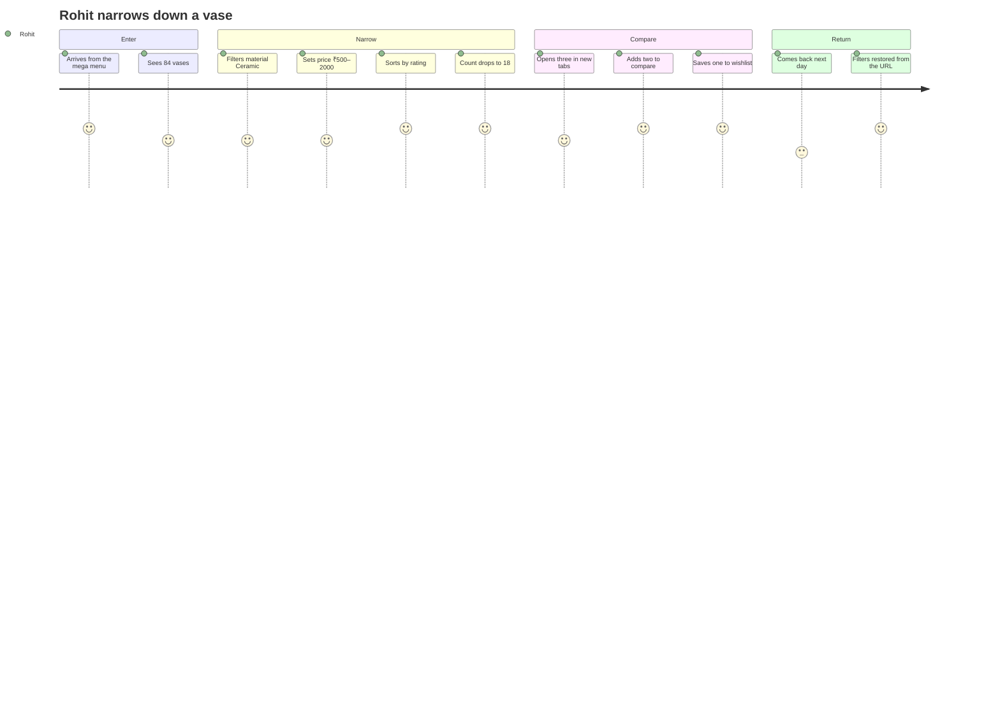
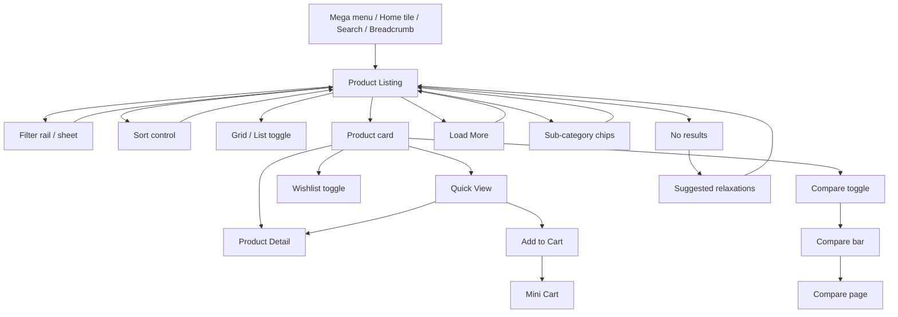
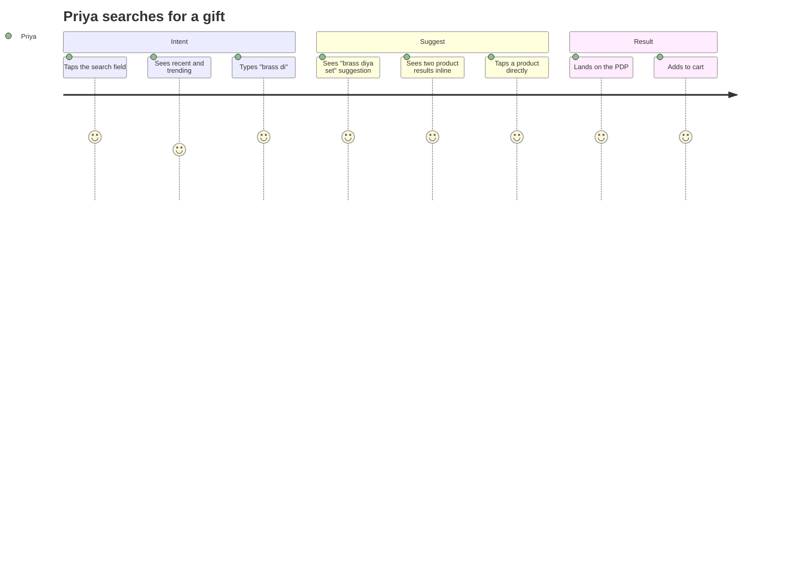
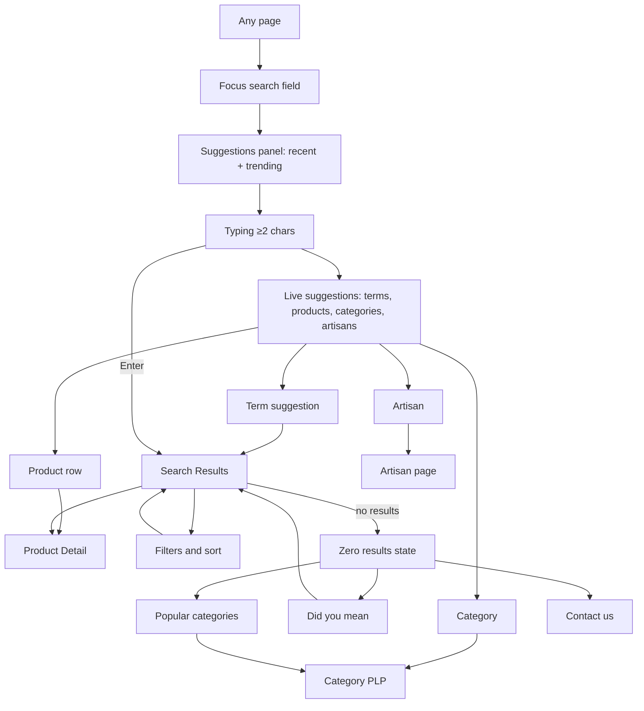

# Modules 03 & 13 — Shop (Product Listing) & Search

Enterprise Handicraft E-Commerce Platform · Customer Website UI/UX Specification

---
---

# MODULE 03 · SHOP / PRODUCT LISTING

## 3.1 Business Goal

The listing page is where browsing intent becomes product intent. It must let shoppers narrow 1,482 products to a handful worth opening, without losing patience or context. Target: ≥35% of PLP sessions reach a PDP; filter usage ≥45% on category pages; zero-result rate below 3%; scroll-back to a previously viewed position always works.

## 3.2 Purpose

Present filtered, sorted, browsable product collections with enough information on each card for a confident click, and enough filtering power to handle a catalogue organised by craft, material, artisan and occasion rather than by size and brand alone.

## 3.3 Customer Journey



**Friction points and responses:** the count dropping to zero after a filter (→ counts shown on every option, zero-count options disabled not hidden); losing position after opening a product (→ scroll and page restoration); not knowing why an option is unavailable (→ disabled with a count of 0 rather than removed).

## 3.4 Navigation Flow



## 3.5 Complete Screen List

| ID | Screen / Overlay | Route | Type |
|----|------------------|-------|------|
| PG-03-01 | Category Listing | `/c/{category}` | Page |
| PG-03-02 | Sub-category Listing | `/c/{category}/{sub}` | Page |
| PG-03-03 | All Products | `/shop` | Page |
| PG-03-04 | Collection Listing (New, Sale, Festive, Bestsellers) | `/collections/{slug}` | Page |
| PG-03-05 | Material / Attribute Listing | `/shop/material/{slug}` | Page |
| PG-03-06 | Artisan Listing | `/artisans/{slug}` | Page |
| STA-03-01 | Loading | — | State |
| STA-03-02 | No results (filtered) | — | State |
| STA-03-03 | Empty category | — | State |
| STA-03-04 | Error | — | State |
| MOD-03-01 | Quick View | — | Modal MD |
| MOD-03-02 | Size Guide (from Quick View) | — | Modal LG |
| MOD-03-03 | Notify Me (out of stock) | — | Modal SM |
| MOD-03-04 | Sign-in prompt (wishlist) | — | Modal SM |
| MOD-03-05 | Compare limit reached | — | Modal XS |
| MOD-03-06 | Share collection | — | Popover |
| MOD-03-07 | Delivery PIN check | — | Modal SM |
| MOD-03-08 | Save this search | — | Modal SM |
| DRW-03-01 | Filters (tablet) | — | Drawer |
| DRW-03-02 | Mini Cart | — | Drawer |
| DRW-03-03 | Compare drawer | — | Drawer |
| SHT-03-01 | Filters sheet (mobile) | — | Sheet |
| SHT-03-02 | Sort sheet | — | Sheet |
| SHT-03-03 | Quick View sheet | — | Sheet |
| SHT-03-04 | Variant select sheet | — | Sheet |
| SHT-03-05 | Notify me sheet | — | Sheet |

## 3.6 Information Architecture

```
Product Listing
├── Context header
│   ├── Breadcrumb
│   ├── H1 (category name)
│   ├── Product count
│   └── Category description (SEO, collapsible on mobile)
├── Sub-navigation
│   └── Sibling / child category chips
├── Controls
│   ├── Filters (rail / drawer / sheet)
│   ├── Sort
│   ├── View toggle (grid / list)
│   └── Active filter bar
├── Results
│   ├── Product grid or list
│   ├── Injected banners (max 1 per 8 cards)
│   └── Pagination (Load More + numbered fallback)
├── SEO content block
└── Discovery
    ├── Related categories
    ├── Popular searches in this category
    └── Recently viewed rail
```

## 3.7 Screen Hierarchy

```
PLP (PG-03-01)
├── Header / Nav / Breadcrumb
├── Page heading block
├── Sub-category chip nav
├── Toolbar (count, view, sort) + Filter rail (desktop)
├── Active filter bar
├── Product grid
│   ├── Product cards → Quick View / PDP / Wishlist / Compare
│   └── Injected collection banner
├── Load More / pagination
├── SEO copy
├── Related categories
├── Recently viewed rail
└── Footer
```

## 3.8 Desktop Layout

Template `SL-02` (3/9). Filter rail 264 px, sticky from the top of the results area, independently scrollable, with its own thin scrollbar. Results column fills. Toolbar sticky beneath the header at 56 px. Grid 4 across at 1440, 5 across at ≥1600.

## 3.9 Tablet Layout

Filter rail is replaced by a "Filters (3)" button opening `DRW-03-01` (right drawer, 400 px). Grid 3 across. Toolbar remains sticky. Sub-category chips scroll horizontally.

## 3.10 Mobile Layout

Grid 2 across with a 12 px gutter. Sticky control bar (Filters button with count · Sort button) at 52 px directly beneath the header. Active filter chips on a scrollable row beneath. Filters open `SHT-03-01` — a full-screen sheet where selections are **batched** and applied by a sticky "Show 128 products" button, avoiding repeated reloads on a slow connection.

## 3.11 Wireframe Description

See `05-Global-UX-Patterns §P-01` for the full desktop and mobile wireframes. Module-specific additions:

### Sub-category chip navigation (all breakpoints)

```
( All 84 )( Ceramic 42 )( Brass 18 )( Terracotta 14 )( Marble 6 )( Glass 4 )
```
Sits between the heading block and the toolbar. Active chip is brand-filled. Horizontally scrollable on mobile with edge fades.

### `SHT-03-01` · Filters Sheet (mobile)

```
┌──────────────────────────────────┐
│ [×]  Filters          Clear all  │
├──────────────────────────────────┤
│ ▾ Category                       │
│   ☑ Vases                    84  │
│   ☐ Wall Art                102  │
│   ☐ Lamps & Lighting         68  │
├──────────────────────────────────┤
│ ▾ Price                          │
│   ▁▃▅▇▅▃▁                        │
│   [₹500]────●──────●────[₹2,000] │
│   [ ₹500 ]        [ ₹2,000 ]     │
├──────────────────────────────────┤
│ ▾ Material                       │
│   ☑ Ceramic                  42  │
│   ☐ Brass                    18  │
│   ☐ Terracotta               14  │
│   ☐ Marble                    6  │
│   Show all (8)                   │
├──────────────────────────────────┤
│ ▾ Colour                         │
│   ●Indigo ●White ●Terracotta     │
│   ●Brass  ●Green  ●Multi         │
├──────────────────────────────────┤
│ ▾ Rating                         │
│   ☐ ★★★★☆ & above            62  │
│   ☐ ★★★☆☆ & above            78  │
├──────────────────────────────────┤
│ ▸ Handmade By                    │
│ ▸ Availability                   │
│ ▸ Discount                       │
│ ▸ Country of Origin              │
├──────────────────────────────────┤
│ [       Show 18 products       ] │  sticky
└──────────────────────────────────┘
```

### `MOD-03-01` · Quick View

```
┌────────────────────────────────────────────────────────────────┐
│                                                           [×]  │
│ ┌────────────────────┐  JAIPUR BLUE POTTERY                    │
│ │                    │  Blue Pottery Vase — Hand-painted       │
│ │   gallery 1:1      │  ★4.6 (128)                             │
│ │   with dots        │  🤲 Ram Prasad Sharma                   │
│ │                    │                                         │
│ │   ● ○ ○ ○          │  ₹1,250  ₹̶1̶,̶6̶0̶0̶  22% OFF               │
│ └────────────────────┘                                         │
│                         Colour: Indigo Blue                    │
│                         ● ○ ○ ○                                │
│                         Size: [S][M][L]                        │
│                         ✓ Only 3 left                          │
│                         🚚 Get it by Wed, 12 Aug               │
│                                                                │
│                         [− 1 +]  [   Add to Cart   ]  [♡]      │
│                         [ View Full Details → ]                │
└────────────────────────────────────────────────────────────────┘
```

Quick View is a **conversion shortcut, not a PDP replacement** — it carries the essentials plus a clear route to the full page. Hidden on touch devices below 768 px, where the variant sheet (`SHT-03-04`) is used instead.

## 3.12 Header

Full site header, compacted on scroll. The current category is highlighted in the nav bar and expanded in the mega menu when opened.

## 3.13 Mega Menu / Navigation

Full mega menu. Additionally, the PLP provides in-page category navigation via sub-category chips and a "Related categories" block at the foot of the page.

## 3.14 Footer

Full footer.

## 3.15 Breadcrumb

```
Home / Home Décor / Vases
Home / Home Décor / Vases / Ceramic          (indexable facet)
Home / Collections / Diwali Collection
Home / Artisans / Ram Prasad Sharma
```
Emits BreadcrumbList structured data. On mobile, shows "‹ Home Décor" only.

## 3.16 Search

The header search is available. Additionally, filter groups with more than 12 values include an inline search field ("Search materials"), and the empty-results state offers a search box scoped to the category.

## 3.17 Filters

### Filter Registry

| Filter | Type | Source | Default | Multi | Notes |
|--------|------|--------|---------|-------|-------|
| Category | Checkbox tree | Category taxonomy | Current category | Yes | Shows counts; parent selection includes children |
| Price | Dual-range slider + numeric inputs | Min/max in the result set | Full range | — | Histogram of product distribution behind the track |
| Material | Checkbox list | Product attribute | None | Yes | Inline search above 12 values |
| Colour | Swatch grid | Product attribute | None | Yes | Swatch + name text; multi-colour items show a split swatch |
| Brand / Workshop | Checkbox list | Brand entity | None | Yes | With counts |
| Handmade By (Artisan) | Checkbox list with avatars | Artisan entity | None | Yes | Grouped by craft cluster; inline search |
| Craft Cluster | Checkbox list | Cluster entity | None | Yes | Regional grouping |
| Rating | Radio ("4★ & above") | Aggregate rating | None | No | 4★, 3★, 2★ options only |
| Availability | Checkbox | Stock | In stock (soft default: out-of-stock items sort last but are shown) | Yes | In stock, Made to order, Pre-order |
| Discount | Radio | Computed | None | No | 10%+, 20%+, 30%+, 50%+ |
| Country of Origin | Checkbox list | Product attribute | None | Yes | — |
| Size / Dimensions | Checkbox or range | Product attribute | None | Yes | Category-dependent |
| Occasion | Checkbox list | Tag | None | Yes | Diwali, Wedding, Housewarming, Corporate |
| Price per unit | — | — | — | — | Reserved |
| New arrivals | Toggle | Published date | Off | — | Last 30 days |
| Eco / Sustainable | Toggle | Attribute | Off | — | — |
| GI Tagged | Toggle | Attribute | Off | — | Geographical Indication certified crafts |

### Filter Behaviour Rules

| ID | Rule |
|----|------|
| FL-01 | Every option shows a live count of matching products |
| FL-02 | Options producing zero results are **disabled and dimmed**, not removed — the shopper learns what the catalogue contains |
| FL-03 | Counts update after each selection, reflecting the other active filters |
| FL-04 | Desktop and tablet apply immediately; mobile batches until "Show N products" |
| FL-05 | Filters are reflected in the URL and are shareable and bookmarkable |
| FL-06 | Filter groups with a selection stay expanded across navigation |
| FL-07 | The first four groups are expanded by default; the rest collapsed |
| FL-08 | Long value lists show the top 8 by count, then "Show all (N)" |
| FL-09 | Selected values always appear in the visible portion of their group, even if outside the top 8 |
| FL-10 | The result count is announced on every change |
| FL-11 | "Clear all" is always visible when any filter is active |
| FL-12 | Individual filters are removable from the active filter bar without opening the rail |

## 3.18 Sorting

| Option | Definition | Default for |
|--------|------------|-------------|
| Popularity | Weighted views + add-to-carts + purchases over 30 days | **Default** — category pages |
| Latest | Publish date descending | New Arrivals collection |
| Bestselling | Units sold over 30 days | Bestsellers collection |
| Rating | Average rating desc; products with <3 reviews rank after those with more | — |
| Price: Low to High | Effective selling price ascending | — |
| Price: High to Low | Effective selling price descending | — |
| Discount | Discount percentage descending | Sale collection |
| Relevance | Search-score based | Search results only |

Sorting is a dropdown on desktop (trigger shows the current option) and a bottom sheet on mobile. Changing sort scrolls to the top of the grid and announces the change. Sort is encoded in the URL.

## 3.19 Cards

| Card | Usage | Spec |
|------|-------|------|
| Product card MD | Grid view | Full spec in `03-Component-Library §25` |
| Product card list | List view | Adds a short description and key specs |
| Collection banner | Injected in the grid | Max 1 per 8 cards; spans the full grid width |
| Related category card | Bottom of page | Image + name + count |
| Recently viewed card | Bottom rail | Compact card |

### Card Content Priority (research-driven)

1. Image (primary, and secondary on hover)
2. Price with discount
3. Product name
4. Rating with count
5. Artisan attribution
6. Stock urgency (only when true)
7. Badge (max 2)
8. Add to Cart (hover on desktop)

## 3.20 Widgets

| Widget | Spec |
|--------|------|
| Result count | "84 products" beside the toolbar; updates live and is announced |
| View toggle | Segmented Grid/List, persisted per shopper |
| Active filter bar | Removable chips + "Clear all"; sticky beneath the toolbar |
| Price histogram | Bar distribution behind the price slider so shoppers see where products cluster |
| Compare bar | Sticky bottom bar once ≥1 product is selected |
| Save this search | Optional: saves the filter set to the account with an alert when new products match |
| Category description | 80–150 words, collapsed to 3 lines on mobile with "Read more" |
| Related categories | 4–6 tiles at the foot of the page |
| Popular in this category | Chip row of common searches, linking to pre-filtered views |

## 3.21 Forms & Fields

| Form | Fields |
|------|--------|
| Price range | Min (numeric, ₹ prefix), Max (numeric); validated as min ≤ max |
| Filter search | Text, filters the value list within a group |
| Notify me | Email (pre-filled if signed in), optional mobile, consent line |
| Delivery PIN | 6-digit PIN, remembered for 30 days |
| Save this search | Search name, alert frequency (Daily/Weekly/Never) |
| Quick View | Variant options, quantity |

## 3.22 Validation Rules

| Field | Rule | Message |
|-------|------|---------|
| Price min | Numeric, ≥0 | "Enter a valid amount" |
| Price max | Numeric, ≥ min | "Maximum must be more than the minimum" |
| Price range | Within catalogue bounds | Silently clamps with a note "Adjusted to available range" |
| PIN code | 6 digits | "Enter a valid 6-digit PIN code" |
| PIN code | Serviceable | "We don't deliver to {pin} yet. [Notify me]" |
| Notify me email | Required, valid | "Enter a valid email address" |
| Quick View variant | Required option unselected | "Choose a size" — inline, with the selector highlighted |
| Quantity | ≥1, ≤ available | "Only {n} available" |
| Compare limit | Max 4 | "You can compare up to 4 products. Remove one to add another." |

## 3.23 Action Buttons

| Button | Type | Placement | Behaviour |
|--------|------|-----------|-----------|
| Filters (n) | Outline MD | Mobile/tablet toolbar | Opens sheet/drawer; badge shows the active count |
| Sort | Outline MD | Toolbar | Dropdown or sheet |
| Grid / List | Segmented | Toolbar (desktop) | Persists |
| Clear all | Link | Filter rail header, active bar | Removes all filters |
| Show N products | Primary XL, sticky | Filter sheet | Applies and closes |
| Add to Cart | Primary SM | Card (hover) | Adds default variant or opens Quick View if options are required |
| Quick View | Ghost on-image | Card (hover, desktop) | Opens modal |
| Wishlist | On-image icon | Card top-right | Toggles |
| Compare | Ghost on-image or checkbox | Card | Toggles; opens the compare bar |
| Notify Me | Outline SM | Out-of-stock card | Opens modal |
| Load More | Outline LG, centred | Below the grid | Loads the next page, updates the URL |
| Read more | Link | Category description (mobile) | Expands |
| Save this search | Ghost | Toolbar overflow | Opens modal (signed-in only) |

## 3.24 Icons

`sliders-horizontal` filters · `arrow-up-down` sort · `layout-grid` / `list` view toggle · `x` remove chip · `heart` wishlist · `git-compare-arrows` compare · `eye` quick view · `bell` notify me · `chevron-down` expand group · `search` filter search · `package-x` out of stock · `star` rating · `truck` delivery · `sparkles` recommended.

## 3.25 Typography & Spacing

| Element | Style |
|---------|-------|
| H1 category name | `display-lg` (Fraunces) |
| Product count | `body-md`, `text-secondary` |
| Category description | `body-md`, max 720 px |
| Filter group heading | `label-lg` 500 |
| Filter option label | `body-md` |
| Filter option count | `body-sm`, `text-tertiary` |
| Card title | `body-md` 500 |
| Card price | `price-lg` |
| Toolbar controls | `label-md` |
| Grid gutter | 24 / 20 / 12 |
| Grid row gap | 40 / 32 / 24 |
| Filter group gap | 24 |
| Filter option gap | 12 |

## 3.26 Images / Video / Carousels

Card images 400×400 served at 1× and 2×, ≤45 KB, AVIF/WEBP, lazy below the fold with a 200 px root margin. The first row of cards loads eagerly. Secondary hover images load only on first hover (desktop). Collection banners 1600×600 desktop / 1:1 mobile. No video on PLP — it competes with scanning and costs performance.

## 3.27 Pagination

- Default: **Load More**, 24 products per page, showing "Load More (24 of 84)".
- The URL updates with each load so refresh and back-navigation restore the loaded set.
- After 3 loads a numbered pager also appears, allowing jumps.
- A hidden but crawlable numbered pagination exists for SEO on every PLP.
- Scroll position and loaded pages are restored when returning from a PDP.
- Mobile shows Load More only; the numbered pager appears in the footer area.

## 3.28 Empty State

### STA-03-02 · No results after filtering

```
┌──────────────────────────────────────────────────┐
│                    ⌕ (64px)                       │
│         No products match your filters            │
│    Try removing a filter to see more options.     │
│                                                   │
│  Active: (Ceramic ×) (₹500–₹800 ×) (★4+ ×)        │
│                                                   │
│  [ Clear All Filters ]                            │
│                                                   │
│  Try removing:                                    │
│  • Price ₹500–₹800 → 24 products                  │
│  • Rating 4★ & above → 18 products                │
│                                                   │
│  Or browse: Vases · Wall Art · Lamps              │
└──────────────────────────────────────────────────┘
```

The **suggested relaxations** — each showing how many products would appear — are the critical element. They turn a dead end into a decision.

### STA-03-03 · Empty category

Illustration + "Nothing here yet" + "We're adding new pieces to this collection soon." + "Browse all products" + a bestsellers rail. Also offers "Notify me when this category has products" for signed-in shoppers.

## 3.29 Loading State & Skeleton

| Surface | Treatment |
|---------|-----------|
| Initial page | Toolbar renders immediately (disabled); filter rail skeleton (6 groups); grid skeleton (8 cards) |
| Filter apply | Grid dims to 60% after 400 ms with a 2 px top progress bar; counts show a subtle shimmer; the grid cross-fades when results arrive |
| Load More | Button shows a spinner; new cards fade and rise in with a 60 ms stagger |
| Sort change | Grid cross-fades; scroll returns to the grid top |
| Quick View | Modal shell renders instantly with a skeleton inside; content fades in |
| Card image | Ratio box with `bg-image-placeholder`; no layout shift on load |

## 3.30 Success State

| Event | Treatment |
|-------|-----------|
| Filter applied | Result count rolls to the new value; chip animates into the active bar |
| Added to cart from a card | Button success flash → product toast → cart badge pop → mini cart (desktop) |
| Wishlist added | Heart fills with a pop; toast with View action |
| Compare added | Compare bar slides up; count increments |
| Notify me set | Button becomes "We'll notify you ✓"; toast with Undo |
| Search saved | Toast "Search saved · we'll email you when new pieces match" |

## 3.31 Error State

| Error | Treatment |
|-------|-----------|
| Results fail to load | Error state in the results column: "We couldn't load these products" + Try Again + the filter rail remains usable |
| Filter counts fail | Filters still work; counts hidden rather than showing stale numbers |
| Load More fails | Inline error beneath the button + Retry; already-loaded products remain |
| Image fails | Placeholder with the product name as the caption |
| Add to cart fails | Toast "Couldn't add to cart. {reason}" + Retry; the card returns to its default state |
| Out of stock on add | Card updates in place to the out-of-stock state; toast explains; Notify Me offered |
| Network offline | Banner + cached results shown with "Showing saved results from {time}" |

## 3.32 Confirmation Dialogs

| Dialog | Trigger | Content |
|--------|---------|---------|
| Compare limit | Adding a 5th product | "You can compare up to 4 products" + the current list with remove actions + "Replace one" |
| Clear all filters | Clicking Clear all with ≥3 filters active | "Clear all 4 filters?" + Cancel / Clear All (mobile only — desktop clears immediately with an Undo toast) |
| Leave with unsaved search | Navigating with a modified saved search | "Save changes to this search?" |

## 3.33 Notifications

| Trigger | Type | Message |
|---------|------|---------|
| Added to cart | Product toast | "Added to cart · View Cart" |
| Wishlist | Product toast | "Saved to wishlist · View" |
| Compare added | Info toast | "Added to compare (2 of 4) · Compare Now" |
| Compare full | Warning toast | "You can compare up to 4 products" |
| Filters cleared | Info toast | "Filters cleared" + Undo |
| Notify me | Success toast | "We'll email you when it's back" + Undo |
| Search saved | Success toast | "Search saved" |
| Sign-in nudge | Info toast | "Sign in to keep your wishlist across devices" |

## 3.34 Micro-interactions & Animation

Filter checkbox check draws in 150 ms and the count rolls · Chip enters the active bar scaling from 0.9 with a 200 ms ease · Price slider handles show a value tooltip while dragging and the histogram highlights the selected range · Grid cross-fade on filter/sort, 200 ms · Card hover per the global catalogue · Load More: spinner then staggered card entry · Compare bar slides up 250 ms · Sticky toolbar gains a shadow once the page scrolls past it · Wishlist heart pops with `ease-craft` · Skeleton to content is always a cross-fade, never a hard swap.

## 3.35 Accessibility

- The results region is a labelled landmark; the count is in an `aria-live="polite"` region.
- Filter groups are fieldsets with legends; each option's accessible name includes its count ("Ceramic, 42 products").
- Disabled zero-count options announce "unavailable with current filters".
- The price slider exposes both handle values, min, max and step; numeric inputs are the keyboard-friendly alternative.
- Active filter chips announce "Remove filter Ceramic".
- The view toggle is a radiogroup.
- Product cards are a single focusable element with a composed accessible name: "Blue Pottery Vase, ₹1,250, reduced from ₹1,600, rated 4.6 out of 5 from 128 reviews, only 3 left".
- Nested card controls (wishlist, compare, add to cart) are separately focusable with their own labels.
- Load More announces "24 more products loaded, 48 of 84 shown".
- Colour swatch filters include the colour name in text.
- Focus is preserved across filter application — it does not jump to the top of the page.
- The filter sheet traps focus and returns it to the Filters button on close.

## 3.36 Responsive Behaviour

| Element | Desktop | Tablet | Mobile |
|---------|---------|--------|--------|
| Filters | Left rail 264, sticky, instant apply | Drawer 400, instant apply | Full sheet, batched apply |
| Grid | 4 (5 at ≥1600) | 3 | 2 |
| Card actions | On hover | Always visible | Always visible |
| Quick View | Modal | Modal | Variant sheet instead |
| Toolbar | Count + view + sort inline | Filters + sort buttons | Filters + sort buttons, sticky |
| Active chips | Row below toolbar | Row below toolbar | Scrollable row |
| Sub-category nav | Inline chips | Scrollable chips | Scrollable chips |
| Category description | Full, below grid | Full | 3-line clamp, "Read more" |
| Compare | Bar with 4 thumbs | Bar with 3 | Compact bar with count |
| Pagination | Load More + numbered | Load More + numbered | Load More |

## 3.37 Prototype Flow (SP-03 / SP-07)

PLP → open filter sheet (mobile) → select material and price → count updates → Show N products → grid cross-fades → scroll → Load More → tap card → PDP → back (position and filters restored) → wishlist toggle → compare two → compare bar → Compare page.

## 3.38 Figma Components & Variants

**Required:** `CMP-PRD-Card`, `CMP-PRD-CardList`, `CMP-PRD-Grid`, `CMP-FLT-*` (all six), `CMP-NAV-Breadcrumb`, `CMP-NAV-ChipNav`, `CMP-NAV-Pagination`, `CMP-OVL-Modal`, `CMP-OVL-BottomSheet`, `CMP-FBK-EmptyState`, `CMP-FBK-Skeleton`, `CMP-PRD-CompareBar`, `CMP-MED-CollectionBanner`.

**New to build:**

| Component | Variants |
|-----------|----------|
| `CMP-PLP-Toolbar` | Breakpoint (Desktop/Tablet/Mobile) × Filters (Rail/Button) × Sticky (Y/N) |
| `CMP-PLP-HeadingBlock` | Description (Full/Clamped/None) × Count (Y/N) |
| `CMP-PLP-PriceHistogram` | Distribution shape (4 samples) × Selection (None/Partial) |
| `CMP-PLP-FilterOption` | Type (Checkbox/Swatch/Radio/Toggle) × State (Default/Selected/Disabled-Zero/Hover/Focus) |
| `CMP-PLP-RelaxationSuggestion` | Count (1/2/3 suggestions) |
| `CMP-PLP-QuickView` | Breakpoint (Modal/Sheet) × State (Loading/Loaded/Variant-Error/Out of Stock) |
| `CMP-PLP-RelatedCategories` | Count (4/6) |

## 3.39 Auto Layout Structure

```
Frame: PLP — Desktop 1440 (V, Fill × Hug, gap 0)
├── Shell instances (Announcement, Header, NavBar)
├── Instance: Breadcrumb (Fill × 44)
├── Frame: Heading Block (V, Fill × Hug, gap 8, padding 24 40 0)
├── Instance: ChipNav (Fill × 44)
├── Frame: Body (H, Fill × Hug, gap 32, padding 24 40, align top)
│   ├── Instance: FLT-Rail (264 fixed × Hug)   [Sticky]
│   └── Frame: Results (V, Fill × Hug, gap 24)
│       ├── Instance: PLP-Toolbar (Fill × 56)   [Sticky]
│       ├── Instance: FLT-ActiveBar (Fill × 40)
│       ├── Instance: PRD-Grid (Fill × Hug)
│       │   └── 24 × Instance: PRD-Card + 3 × Instance: CollectionBanner
│       └── Instance: Pagination (Fill × 80)
├── Frame: SEO Copy (Fill × Hug, padding 40, max-width 720)
├── Instance: PLP-RelatedCategories
├── Instance: PRD-Rail / Recently Viewed
├── Instance: Footer
└── Instance: PRD-CompareBar (Fill × 80)  [Fixed bottom, conditional]
```

## 3.40 UX Guidelines · Developer Notes · Analytics · Scalability

### UX Guidelines

| ID | Guideline |
|----|-----------|
| PL-01 | Never hide the product count — it is the shopper's primary feedback signal |
| PL-02 | Zero-count filter options are disabled, not removed |
| PL-03 | Never return an empty page without suggested relaxations and their counts |
| PL-04 | Restore scroll position, loaded pages, filters and sort on back-navigation — this is the single biggest PLP frustration |
| PL-05 | Filters live in the URL so they can be shared and bookmarked |
| PL-06 | Batch filter application on mobile, apply instantly on desktop |
| PL-07 | Show out-of-stock products by default (sorted last) — they are still useful signals; give them a Notify Me path |
| PL-08 | One injected banner per 8 cards maximum |
| PL-09 | Sponsored cards are labelled and capped at 1 in 8 |
| PL-10 | Card content priority is fixed — never let a badge push the price below the fold of the card |
| PL-11 | Quick View is a shortcut, never a replacement for the PDP |
| PL-12 | Stock urgency figures must be literally true |

### Developer Notes

1. Filter state serialises to the query string in a stable, human-readable order so URLs are cacheable and shareable.
2. Facet counts come from the search index in the same query as the results — never as a second round trip.
3. The first row of cards is server-rendered; the rest hydrate.
4. Scroll restoration stores the scroll offset and the loaded page count in session storage keyed by the URL.
5. Load More uses `history.pushState` so back returns to the previous page state rather than the top.
6. Card images use `srcset` with 400/800 widths and explicit `width`/`height` for CLS.
7. Category pages with indexable facet combinations render a distinct H1, intro copy and canonical; all other facet combinations canonicalise to the base category and are `noindex, follow`.
8. Quick View fetches only the fields it needs, not the full PDP payload.
9. Compare selections persist in session storage, capped at 4.
10. The price histogram is computed server-side from the current result set, bucketed into 20 bins.

### Analytics Events

`view_item_list` (list_id, category, count, filters, sort) · `select_item` (position) · `filter_apply` (facet, value, result_count) · `filter_clear` · `sort_apply` · `view_toggle` · `load_more` (page, total_loaded) · `quick_view_open` · `add_to_cart` (source=plp_card / quick_view) · `add_to_wishlist` · `compare_add` · `notify_me` · `zero_results` (filters) · `relaxation_click` (suggestion).

### Future Scalability

Visual/similar-image filtering · AI-assisted natural-language filtering ("show me vases under ₹2000 in blue") · saved searches with alerts · shop-the-look listings · in-listing size and dimension visualisation · personalised default sort per shopper · infinite scroll as an opt-in preference · multi-vendor "sold by" filter · availability-by-PIN filtering.

---
---

# MODULE 13 · SEARCH

## 13.1 Business Goal

Shoppers who search convert at roughly three times the rate of those who only browse. Search must therefore be prominent, fast, forgiving of spelling and phrasing, and must almost never return nothing. Target: search usage ≥30% of sessions; zero-result rate <3%; search → PDP ≥45%.

## 13.2 Purpose

Let shoppers find products, categories, artisans and content by typing what they mean — including craft terms, material names, regional names and occasions — with suggestions that shorten the path and a results page that behaves like a first-class PLP.

## 13.3 Customer Journey



**Alternate path — no results:** Priya types "brass deeya". Fuzzy matching corrects to "brass diya" and shows results under a "Showing results for brass diya · Search instead for brass deeya" line. If nothing matches at all, she sees popular categories, trending searches and a support contact.

## 13.4 Navigation Flow



## 13.5 Complete Screen List

| ID | Screen / Overlay | Route | Type |
|----|------------------|-------|------|
| PG-13-01 | Search Results | `/search?q=` | Page |
| PG-13-02 | Search Results — No Results | `/search?q=` | State |
| PG-13-03 | Search Landing (mobile, empty query) | `/search` | Page |
| PG-13-04 | Visual Search Results (AI) | `/search/visual` | Page |
| DRW-13-01 | Suggestions Panel (desktop) | — | Panel |
| SHT-13-01 | Search Overlay (mobile) | — | Full sheet |
| SHT-13-02 | Filters sheet | — | Sheet |
| SHT-13-03 | Sort sheet | — | Sheet |
| MOD-13-01 | Voice search | — | Modal SM |
| MOD-13-02 | Image search upload | — | Modal MD |
| MOD-13-03 | Save this search | — | Modal SM |
| MOD-13-04 | Search help / tips | — | Modal SM |

## 13.6 Information Architecture

```
Search
├── Entry
│   ├── Header field (desktop, persistent)
│   ├── Header field row (mobile, persistent)
│   ├── "/" keyboard shortcut
│   └── Empty-state CTAs across the site
├── Suggestions panel
│   ├── Recent searches (max 5, removable, clearable)
│   ├── Trending searches (max 6, merchandising-controlled)
│   ├── Term suggestions (max 6, match highlighted)
│   ├── Product results (max 4, rich rows)
│   ├── Category matches (max 3)
│   ├── Artisan matches (max 2)
│   └── "See all N results" footer
└── Results page
    ├── Query echo + count + correction notice
    ├── Result-type tabs (Products / Articles / Artisans / Help)
    ├── Filters and sort (identical to PLP)
    ├── Product grid
    └── Zero-result recovery
```

## 13.7 Screen Hierarchy

```
Search Results (PG-13-01)
├── Header with the query in the field
├── Query heading block ("42 results for 'blue pottery'")
├── Correction notice [conditional]
├── Result tabs [conditional — only when non-product matches exist]
├── Filters + sort + active chips
├── Product grid
├── Related searches chip row
├── Load More
└── Footer
```

## 13.8 Desktop Layout

Identical to PLP (`SL-02`, 3/9) with these differences: the H1 is the query echo; a correction notice sits above the toolbar; result-type tabs appear when the query matches articles, artisans or help content; a "Related searches" chip row sits below the grid.

## 13.9 Tablet Layout

As PLP tablet. The suggestions panel width matches the expanded search field (which grows to 520 px on focus).

## 13.10 Mobile Layout

Tapping the search field opens `SHT-13-01`, a full-screen overlay: back chevron, field (auto-focused, keyboard raised), Cancel, then the suggestions content. Results use the standard mobile PLP layout. The query remains in the header field so it can be edited without going back.

## 13.11 Wireframe Description

### Suggestions panel

See `03-Component-Library §23` for the full anatomy. Behavioural detail:

- Empty query → Recent (with individual `×` and "Clear all") + Trending.
- 1 character → nothing yet (avoids noise).
- ≥2 characters → live results, 200 ms debounce, skeleton rows during fetch.
- Matched substring is bolded within suggestions.
- Product rows show thumbnail, name, price and stock state; out-of-stock products appear last and are marked.
- Keyboard `↓`/`↑` moves through every row across sections; `Enter` activates; `Esc` closes and restores the previous query.

### PG-13-01 · Search Results (desktop)

```
┌──────────────────────────────────────────────────────────────────────────────────────┐
│ [LOGO]  [ ⌕ blue pottery                              ×  ]      ₹▾ 👤 ♡2 🛍3         │
├──────────────────────────────────────────────────────────────────────────────────────┤
│ 42 results for "blue pottery"                                                         │
│ Showing results for blue pottery · Search instead for "blue pottary"                  │
├──────────────────────────────────────────────────────────────────────────────────────┤
│ Products (42) │ Stories (3) │ Artisans (2) │ Help (1)                                 │
├────────────────────┬─────────────────────────────────────────────────────────────────┤
│ FILTERS            │ [Grid][List]        42 results       Sort: [Relevance ▾]         │
│ (identical to PLP) │ (Ceramic ×)                                              Clear   │
│                    ├─────────────────────────────────────────────────────────────────┤
│                    │ [4-column product grid]                                          │
│                    │                                                                  │
│                    │           [ Load More (24 of 42) ]                                │
├────────────────────┴─────────────────────────────────────────────────────────────────┤
│ Related searches:  ( blue pottery vase )( jaipur pottery )( ceramic bowls )            │
│                    ( blue pottery plates )( hand painted pottery )                     │
├──────────────────────────────────────────────────────────────────────────────────────┤
│ FOOTER                                                                                │
└──────────────────────────────────────────────────────────────────────────────────────┘
```

### PG-13-02 · No Results

```
┌──────────────────────────────────────────────────┐
│         ⌕ (64px illustration)                     │
│      No results for "brass elephant lamp"         │
│   We couldn't find a match. Try fewer or          │
│   different words.                                │
│                                                   │
│   Did you mean:  brass elephant · brass lamp      │
│                                                   │
│   [ ⌕ Search again                           ]    │
│                                                   │
│   Browse popular categories                       │
│   ┌────────┐ ┌────────┐ ┌────────┐ ┌────────┐     │
│   │ Décor  │ │Festive │ │Textiles│ │Gifting │     │
│   └────────┘ └────────┘ └────────┘ └────────┘     │
│                                                   │
│   Trending: diwali gifts · brass diya · kantha    │
│                                                   │
│   Still can't find it? [Chat with us] or          │
│   [Ask our AI assistant ✨]                        │
├──────────────────────────────────────────────────┤
│ RAIL · Bestsellers                                │
└──────────────────────────────────────────────────┘
```

**Rule:** a zero-result page always offers partial matches, category routes, trending terms, human support and the AI assistant. It is never a dead end.

## 13.12 Header

The search field is the header's most prominent element on the results page and shows the current query with a clear `×`. On mobile it remains visible and editable above the results.

## 13.13 Mega Menu / Navigation

Available as normal. The suggestions panel and the mega menu are mutually exclusive — opening one closes the other.

## 13.14 Footer

Full footer.

## 13.15 Breadcrumb

```
Home / Search results for "blue pottery"
```
Not indexed; provided for orientation only.

## 13.16 Search

### Matching Behaviour

| Aspect | Rule |
|--------|------|
| Fields searched | Product name, description, category, material, colour, craft technique, artisan name, cluster, brand, tags, SKU |
| Typo tolerance | Fuzzy matching with edit distance 1 for ≤6-character words, 2 for longer; corrections shown as "Showing results for X · Search instead for Y" |
| Synonyms | Curated dictionary: diya = deepak = lamp; kantha = embroidered; matka = pot; thali = plate; dupatta = scarf; and regional/vernacular equivalents |
| Stemming | Plural/singular and common inflections |
| Multi-word | AND by default with automatic OR relaxation when AND returns <3 results, flagged as "Showing broader results" |
| Numbers | "set of 5", dimensions, price mentions ("under 2000") parsed into filters where confidently detected, shown as a removable chip |
| SKU / order number | Exact match jumps directly to the product or order tracking |
| Ranking | Exact name match → starts-with → category match → attribute match → description; boosted by popularity, rating and stock; out-of-stock demoted |
| Personalisation | Signed-in shoppers get a mild boost on previously viewed categories, labelled where it materially changes ordering |

## 13.17 Filters

Identical registry to PLP (§3.17), plus:

| Filter | Notes |
|--------|-------|
| Result type | Products / Stories / Artisans / Help — rendered as tabs, not a filter group |
| Match confidence | Internal only, not exposed |

Filters applied to a search preserve the query in the URL.

## 13.18 Sorting

Adds **Relevance** as the default and only default for search. All other PLP options remain available. Changing away from Relevance is remembered for the session but resets on a new query.

## 13.19 Cards

Same card set as PLP, plus:

| Card | Usage |
|------|-------|
| Suggestion product row | 64 px row: 48 px thumb, name (1 line, match bolded), price, stock chip |
| Article result card | Cover, title, excerpt, reading time |
| Artisan result card | Portrait, name, craft, cluster, product count |
| Help result row | Icon, question, category |

## 13.20 Widgets

| Widget | Spec |
|--------|------|
| Recent searches | Max 5, stored per device for 30 days, individually removable, "Clear all" |
| Trending searches | Max 6, merchandising-controlled with an automatic fallback to genuine top queries |
| Correction notice | "Showing results for X · Search instead for Y" where Y re-runs the literal query |
| Related searches | Chip row below the grid, derived from co-occurring queries |
| Result-type tabs | Only rendered when non-product results exist |
| Voice search | Mic icon in the field (where supported); modal with a live waveform and transcript |
| Image search | Camera icon; upload or capture; results labelled "Visually similar" |
| Save this search | Signed-in only; stores query + filters with an alert option |

## 13.21 Forms & Fields

| Field | Type | Notes |
|-------|------|-------|
| Query | Search input | `type=search`, `autocomplete=off`, `enterkeyhint=search`; max 100 chars |
| Voice | — | Requires microphone permission; shows a permission-denied state with a manual fallback |
| Image | File | JPG/PNG/WEBP ≤10 MB; camera capture on mobile |
| Save search name | Text | 3–40 chars |

## 13.22 Validation Rules

| Field | Rule | Message |
|-------|------|---------|
| Query | Min 2 characters for suggestions | (silent — no suggestions shown) |
| Query | Max 100 characters | Truncated with a note "Search terms are limited to 100 characters" |
| Query | Empty on submit | Focus retained, no navigation |
| Image | Size ≤10 MB | "Image is too large. Maximum 10 MB." |
| Image | Format | "Use a JPG, PNG or WEBP image" |
| Voice | Permission denied | "We need microphone access to use voice search. [Type instead]" |
| Voice | No speech detected | "We didn't catch that. [Try again] or [Type instead]" |
| Save search | Name required | "Give this search a name" |

## 13.23 Action Buttons

| Button | Type | Placement |
|--------|------|-----------|
| Search (submit) | Implicit on Enter; icon button on mobile | Field |
| Clear query | Icon `×` | Field trailing |
| Cancel | Ghost | Mobile overlay |
| Voice search | Icon | Field trailing |
| Image search | Icon | Field trailing |
| See all N results | Link row | Suggestions footer |
| Clear recent | Link | Suggestions panel |
| Remove recent item | Icon `×` | Each recent row |
| Search instead for "X" | Link | Correction notice |
| Related search chip | Chip | Below grid |
| Ask our AI assistant | Outline MD | Zero-result state |
| Chat with us | Outline MD | Zero-result state |
| Save this search | Ghost | Toolbar overflow |

## 13.24 Icons

`search` · `x` clear · `clock` recent (or `rotate-ccw`) · `flame` trending · `mic` voice · `camera` image search · `sparkles` AI · `message-circle` chat · `chevron-right` see all · `bookmark` save search.

## 13.25 Typography & Spacing

| Element | Style |
|---------|-------|
| Query echo H1 | `heading-xl` |
| Result count | `body-md`, `text-secondary` |
| Correction notice | `body-sm` |
| Section header in panel | `overline` |
| Suggestion text | `body-md`, match in 600 weight and `text-brand` |
| Product row name | `body-md` |
| Product row price | `price-md` |
| Panel row height | 48 (text), 64 (product) |
| Panel padding | 12 vertical between sections, 16 horizontal |
| Panel max height | 560, then scrolls |

## 13.26 Images / Video / Carousels

Suggestion thumbnails 48×48 (96 at 2×), ≤8 KB, loaded only for visible rows. Results grid images identical to PLP. No video or carousel in search.

## 13.27 Pagination

Identical to PLP: Load More with a numbered fallback, 24 per page, URL-encoded.

## 13.28 Empty State

| Case | Treatment |
|------|-----------|
| Empty query (mobile landing) | Recent + Trending + popular categories + bestsellers rail |
| No suggestions while typing | "No matches yet — press Enter to search everything" |
| Zero results | Full recovery state per §13.11 |
| Zero results after filtering a search | "No results for 'blue pottery' with these filters" + relaxation suggestions + "Clear filters" |
| Result type tab empty | "No stories match 'blue pottery'" with the Products tab remaining active |

## 13.29 Loading State & Skeleton

| Surface | Treatment |
|---------|-----------|
| Suggestions | 3 text-row skeletons + 2 product-row skeletons after 200 ms |
| Results page | PLP skeleton (toolbar + filter rail + 8 cards) |
| Filter within search | Grid dims with a top progress bar |
| Voice | Live waveform animation + "Listening…" |
| Image search | Uploaded image thumbnail + "Finding similar pieces…" with a progress indicator |

## 13.30 Success State

| Event | Treatment |
|-------|-----------|
| Results found | Count announced; grid fades in |
| Correction applied | Notice shown with the literal-search escape hatch |
| Search saved | Toast "Search saved · we'll email you when new pieces match" |
| Voice transcribed | Transcript appears in the field and search runs automatically |
| Image match found | "We found 12 visually similar pieces" with the uploaded image shown as a removable chip |

## 13.31 Error State

| Error | Treatment |
|-------|-----------|
| Search service down | "Search isn't available right now" + browse categories + retry; the header field remains but shows an inline notice |
| Suggestions fail | Panel silently falls back to Recent + Trending; typing still submits |
| Results fail | Error state with Retry; the query is preserved |
| Voice unsupported | Mic icon hidden entirely rather than failing on tap |
| Image search fails | "We couldn't match that image. [Try another] or [Search by text]" |
| Timeout | "This is taking longer than usual" + Retry after 8 s |

## 13.32 Confirmation Dialogs

| Dialog | Trigger | Content |
|--------|---------|---------|
| Clear recent searches | "Clear all" in the panel | "Clear your recent searches?" · Cancel / Clear |
| Delete saved search | From the account | "Delete '{name}'? You'll stop getting alerts for it." · Cancel / Delete |

## 13.33 Notifications

| Trigger | Type | Message |
|---------|------|---------|
| Search saved | Success toast | "Search saved" |
| Recent cleared | Info toast | "Recent searches cleared" + Undo |
| New matches for a saved search | Email / in-app | "3 new pieces match your saved search 'blue pottery'" |
| Search unavailable | Warning toast | "Search is temporarily unavailable" |

## 13.34 Micro-interactions & Animation

Field expands from 480 to 640 px on focus over 200 ms (desktop) · Panel fades and drops 8 px on open · Rows highlight on keyboard traversal with the container auto-scrolling · Matched substring bolds as you type · Clearing the query cross-fades the panel back to Recent + Trending · Mobile overlay slides up with the keyboard · Voice waveform animates with real amplitude · Chip removal shrinks and fades · Result count rolls on change.

## 13.35 Accessibility

- The search field is a labelled combobox with the suggestions panel as its popup; expanded/collapsed state and the active option are exposed.
- Suggestions form a listbox; each option's accessible name includes its type ("Product, Blue Pottery Vase, one thousand two hundred fifty rupees").
- The result count is announced politely after each search or filter change.
- The correction notice is announced and offers a keyboard-reachable escape to the literal query.
- Recent-search removal buttons are labelled "Remove {term} from recent searches".
- The mobile overlay traps focus and returns it to the search field on close.
- Voice search announces its state changes (listening, processing, transcribed).
- Zero-result recovery links are all keyboard reachable and logically ordered.

## 13.36 Responsive Behaviour

| Element | Desktop | Tablet | Mobile |
|---------|---------|--------|--------|
| Field | 480 px, expands to 640 on focus | Icon → 520 px overlay row | Persistent full-width row |
| Suggestions | Panel below the field | Panel below the field | Full-screen overlay |
| Product rows in panel | 4 | 4 | 3 |
| Results layout | PLP desktop | PLP tablet | PLP mobile |
| Result tabs | Inline | Inline | Scrollable chips |
| Related searches | Chip row | Chip row | Scrollable chips |

## 13.37 Prototype Flow (SP-03)

Tap search → overlay opens with Recent + Trending → type "blue pot" → suggestions appear (skeleton → content) → tap a term suggestion → results page → apply a filter → count updates → tap a product → PDP. Branch: type a misspelling → correction notice → tap "Search instead for" → zero results → tap a popular category.

## 13.38 Figma Components & Variants

**Required:** `CMP-SRC-SearchBar`, `CMP-SRC-Suggestions`, `CMP-SRC-Overlay`, `CMP-PRD-Card`, `CMP-PRD-CardCompact`, all `CMP-FLT-*`, `CMP-FBK-EmptyState`, `CMP-NAV-ChipNav`, `CMP-CNT-ArticleCard`.

**New to build:**

| Component | Variants |
|-----------|----------|
| `CMP-SRC-SuggestionRow` | Type (Term/Product/Category/Artisan/Help/Recent/Trending) × State (Default/Hover/Focused) |
| `CMP-SRC-CorrectionNotice` | Type (Auto-corrected/Broadened/Partial) |
| `CMP-SRC-ZeroResults` | Suggestions (0/1/2/3 did-you-mean) × Support (Chat/AI/Both) |
| `CMP-SRC-RelatedSearches` | Count (3/5/8) |
| `CMP-SRC-VoiceModal` | State (Requesting/Listening/Processing/Success/Error/Denied) |
| `CMP-SRC-ImageSearch` | State (Empty/Uploading/Processing/Results/Error) |
| `CMP-SRC-ResultTabs` | Tabs (2/3/4) × Active (per tab) |

## 13.39 Auto Layout Structure

```
Component: Suggestions Panel (V, Fill × Hug, max-height 560, radius-lg, elevation-3)
├── Frame: Recent (V, Fill × Hug, gap 0)
│   ├── Frame: Section Header (H, Fill × 32, space-between)
│   └── 5 × Instance: SuggestionRow [Type: Recent]
├── Instance: Divider
├── Frame: Trending (V, Fill × Hug)
│   ├── Frame: Section Header
│   └── Frame: Chips (H wrap, Fill × Hug, gap 8)
├── Instance: Divider
├── Frame: Suggestions (V, Fill × Hug)
├── Instance: Divider
├── Frame: Products (V, Fill × Hug)
│   └── 4 × Instance: SuggestionRow [Type: Product]
├── Instance: Divider
├── Frame: Categories + Artisans (H, Fill × Hug, gap 24)
└── Instance: SuggestionRow [Type: See all]
```

## 13.40 UX Guidelines · Developer Notes · Analytics · Scalability

### UX Guidelines

| ID | Guideline |
|----|-----------|
| SR-01 | Search is always visible — never hidden behind an icon on mobile |
| SR-02 | Suggestions begin at 2 characters, debounced at 200 ms |
| SR-03 | Product results appear inside the suggestions panel — many shoppers never reach the results page |
| SR-04 | Corrections always offer an escape to the literal query |
| SR-05 | Zero results is a routing problem, not an error — always offer categories, trending terms and support |
| SR-06 | Synonyms must cover regional and vernacular craft vocabulary; this list is a living merchandising asset |
| SR-07 | Recent searches are per device, removable and clearable — they are personal data |
| SR-08 | The results page is a full PLP with filters and sort, not a stripped-down list |
| SR-09 | Out-of-stock products appear last, never hidden — they signal that the store carries the category |
| SR-10 | Never auto-navigate on a single result; always show the result page so the shopper stays oriented |

### Developer Notes

1. Suggestions and results come from the same search index so ranking is consistent.
2. Debounce 200 ms; cancel in-flight requests on each keystroke.
3. Recent searches live in local storage, capped at 5, with a 30-day expiry; clearing is immediate and local.
4. The synonym and stop-word dictionaries are editable in the admin without a release.
5. Zero-result queries are logged for merchandising review — this list drives catalogue and synonym decisions.
6. Query parameters are validated and length-capped to prevent abuse.
7. Search results are `noindex, follow`; only curated landing pages for high-volume queries are indexable.
8. The suggestions panel is rendered from a single response containing all sections — never one request per section.
9. Image search resizes client-side before upload to stay under the payload budget.

### Analytics Events

`search` (query, result_count, source, corrected) · `search_suggestion_click` (type, position, query) · `search_no_results` (query) · `search_correction_accepted` / `_rejected` · `search_filter_apply` · `search_result_click` (position, item_id) · `related_search_click` · `voice_search_start` / `_success` / `_failure` · `image_search_start` / `_success` · `saved_search_create`.

### Future Scalability

Natural-language search ("gifts under ₹2000 for a housewarming") · conversational search handing off to the AI assistant · visual search from camera · search personalisation by purchase history · federated search across products, content and help · query-level merchandising rules (pin a product to a query) · vernacular script search (Devanagari input matching transliterated product names) · search-driven landing pages for high-volume queries.
