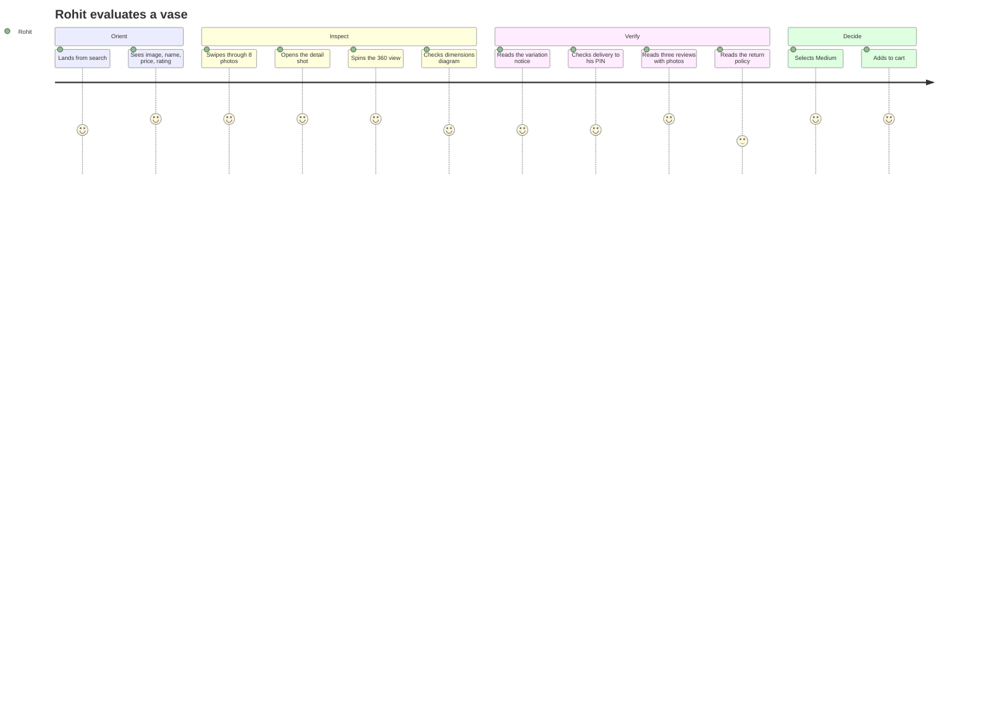
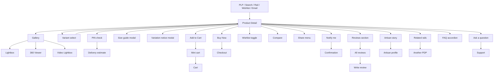
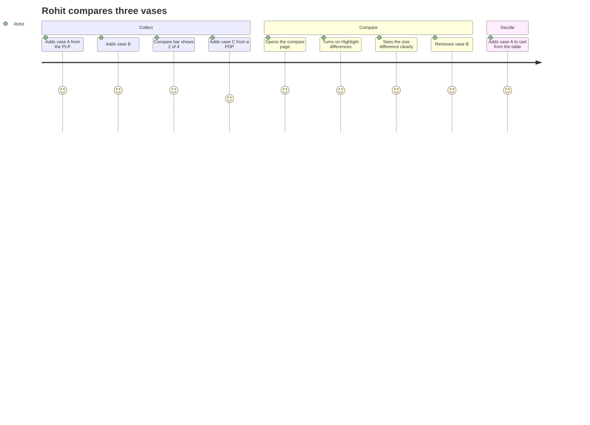
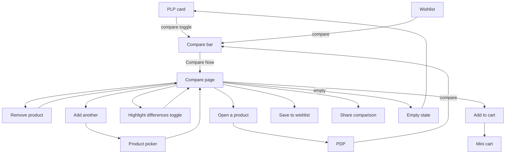
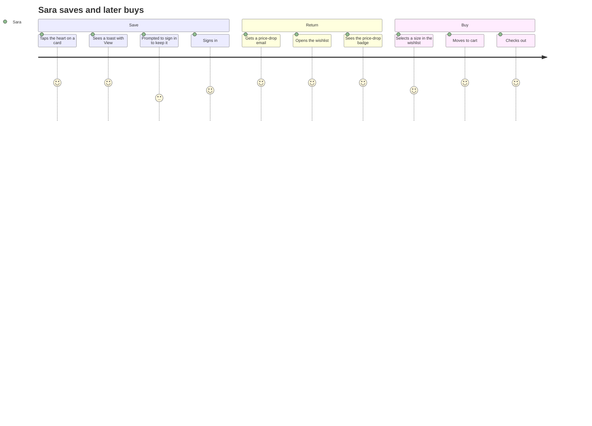
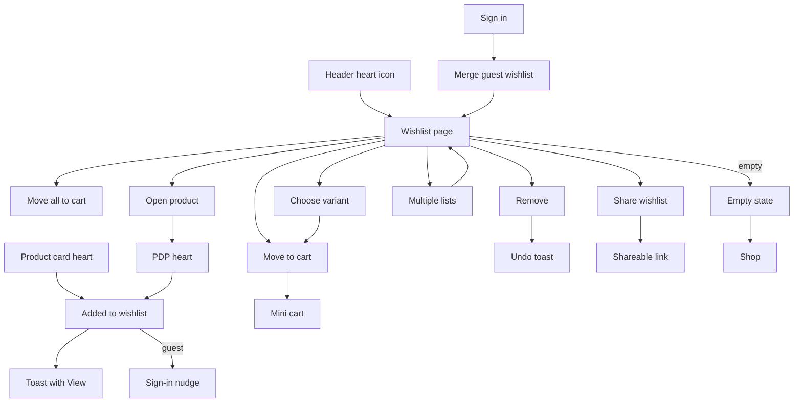

# Modules 04–06 — Product Details, Compare & Wishlist

Enterprise Handicraft E-Commerce Platform · Customer Website UI/UX Specification

---
---

# MODULE 04 · PRODUCT DETAILS

## 4.1 Business Goal

The PDP is where the sale is won or lost. For handicraft it carries an unusual burden: the shopper cannot touch the object, the object is not identical to its photograph, and the price premium must be justified by provenance. The PDP must therefore sell the craft, disclose the variation honestly, and remove every doubt about size, delivery and returns. Target: PDP → Add to Cart ≥12%; size-related returns reduced by 30%; time to Add to Cart ≤45 s for a decided shopper.

## 4.2 Purpose

Present a complete, honest and desirable picture of one product — imagery, variants, price, availability, delivery, materials, dimensions, care, provenance, artisan story, reviews and answers — and convert that into a cart addition with minimum friction.

## 4.3 Customer Journey



**Anxiety map and design response**

| Anxiety | Where it peaks | Response |
|---------|----------------|----------|
| "Will it look like the photo?" | Gallery | Detail macro shot mandatory, review photos prominent, variation notice honest |
| "How big is it really?" | Specs | Dimension diagram with a familiar-object scale reference, cm/inch toggle |
| "Is it actually handmade?" | Story | Named artisan, cluster, process imagery, GI badge where applicable |
| "When will it arrive?" | Delivery | PIN check inline, exact promised date, not a vague range |
| "What if I don't like it?" | Actions | Return window stated beside the CTA, not in the footer |
| "Is this a fair price?" | Price | Honest MRP, no fake anchoring, material and time cues in the story |

## 4.4 Navigation Flow



## 4.5 Complete Screen List

| ID | Screen / Overlay | Route | Type |
|----|------------------|-------|------|
| PG-04-01 | Product Detail | `/p/{slug}` | Page |
| PG-04-02 | Product Detail — variant deep link | `/p/{slug}?variant={id}` | Page state |
| PG-04-03 | All Reviews | `/p/{slug}/reviews` | Page |
| PG-04-04 | Customer Photos Gallery | `/p/{slug}/photos` | Page |
| STA-04-01 | Out of stock | — | State |
| STA-04-02 | Discontinued / unavailable | — | State |
| STA-04-03 | Made to order | — | State |
| STA-04-04 | Pre-order | — | State |
| MOD-04-01 | Image Lightbox | — | Full overlay |
| MOD-04-02 | 360° Viewer (expanded) | — | Full overlay |
| MOD-04-03 | Video player | — | Full overlay |
| MOD-04-04 | Size guide | — | Modal LG |
| MOD-04-05 | Variation notice — what to expect | — | Modal MD |
| MOD-04-06 | Delivery & returns detail | — | Modal MD |
| MOD-04-07 | Care instructions | — | Modal MD |
| MOD-04-08 | Notify me when back in stock | — | Modal SM |
| MOD-04-09 | Share | — | Popover |
| MOD-04-10 | Ask a question | — | Modal MD |
| MOD-04-11 | Write a review | — | Modal LG |
| MOD-04-12 | Review photo lightbox | — | Full overlay |
| MOD-04-13 | Report a review | — | Modal SM |
| MOD-04-14 | Sign-in prompt (wishlist/review) | — | Modal SM |
| DRW-04-01 | Mini cart | — | Drawer |
| DRW-04-02 | Full specifications | — | Drawer 480 |
| DRW-04-03 | AI assistant (product context) | — | Drawer |
| DRW-04-04 | Compare drawer | — | Drawer |
| SHT-04-01 | Variant select sheet | — | Sheet |
| SHT-04-02 | Size guide sheet | — | Sheet |
| SHT-04-03 | Delivery check sheet | — | Sheet |
| SHT-04-04 | Share sheet | — | Sheet |
| SHT-04-05 | Reviews filter sheet | — | Sheet |
| SHT-04-06 | Specifications sheet | — | Sheet |

## 4.6 Information Architecture

```
Product Detail
├── Above the fold
│   ├── Gallery (images, 360, video)
│   └── Buy box
│       ├── Brand / craft eyebrow
│       ├── Product name (H1)
│       ├── Rating + review count + units sold
│       ├── Artisan chip
│       ├── Price block (selling, MRP, discount, tax note)
│       ├── Variation notice
│       ├── Variant selectors
│       ├── Stock indicator
│       ├── Delivery estimate + PIN check
│       ├── Quantity + Add to Cart + Buy Now + Wishlist
│       ├── Trust badges
│       └── Detail accordions (summary level)
├── Story
│   ├── The craft (technique, process imagery)
│   └── The maker (artisan card, video)
├── Details
│   ├── Description (rich)
│   ├── Specifications
│   ├── Dimensions diagram
│   ├── Materials & care
│   └── Shipping & returns
├── Social proof
│   ├── Rating breakdown + AI summary
│   ├── Customer photo strip
│   └── Review list with filters
├── Questions
│   └── FAQ accordion + Ask a question
└── Discovery
    ├── Complete the look
    ├── Similar products
    ├── More from this artisan
    └── Recently viewed
```

## 4.7 Screen Hierarchy

```
PDP (PG-04-01)
├── Shell + breadcrumb
├── Main split: Gallery | Buy box
├── Story bands (craft, maker)
├── Details section (tabs on desktop, accordions on mobile)
├── Reviews section → All Reviews (PG-04-03) → Photos (PG-04-04)
├── FAQ
├── Discovery rails
├── Footer
└── Sticky CTA bar (mobile) / sticky buy box (desktop)
```

## 4.8 Desktop Layout

Template `SL-03` (7/5). Gallery column 58.33%, buy box 41.67% with `position: sticky` so it remains visible while the gallery scrolls (until the story section begins, where it releases). Gap 48. Container max 1440, margins 40.

Below the main split, all bands are full-width within the container. The details section uses tabs at ≥992 px (Description · Specifications · Materials & Care · Shipping & Returns) and accordions below that.

## 4.9 Tablet Layout

Split 6/6 with a 32 px gap. The buy box is not sticky (insufficient height). Gallery uses thumbnails below the main image. Details become accordions. Reviews single column.

## 4.10 Mobile Layout

Fully stacked. Gallery is a full-width swipeable carousel (390×390) with dots and a counter chip. Buy box content follows in the order specified in §4.6. Details are accordions. A **sticky bottom CTA bar** (72 px) appears once the inline Add to Cart scrolls out of view, showing price + wishlist + Add to Cart.

Variant selection with more than 4 options opens `SHT-04-01` rather than wrapping into many rows.

## 4.11 Wireframe Description

Full desktop and mobile wireframes are in `05-Global-UX-Patterns §P-02`. Module-specific detail:

### Story band — The craft

```
┌──────────────────────────────────────────────────────────────────────────────────────┐
│  HOW IT'S MADE                                                                        │
│  Nine steps, entirely by hand                                                         │
│  ┌────────┐ ┌────────┐ ┌────────┐ ┌────────┐                                          │
│  │ 1      │ │ 2      │ │ 3      │ │ 4      │                                          │
│  │[photo] │ │[photo] │ │[photo] │ │[photo] │                                          │
│  │Preparing│ │Shaping │ │Painting│ │ Firing │                                          │
│  │the dough│ │on wheel│ │by hand │ │at 800°C│                                          │
│  └────────┘ └────────┘ └────────┘ └────────┘                                          │
│  Jaipur blue pottery uses no clay at all — it's made from quartz powder, glass and     │
│  fuller's earth, a technique that travelled from Persia in the 14th century.           │
│  [ Read the full story → ]                                                             │
└──────────────────────────────────────────────────────────────────────────────────────┘
```

### Reviews section

```
┌──────────────────────────────────────────────────────────────────────────────────────┐
│ Customer Reviews                                                    [ Write a Review ]│
├────────────────────────────┬─────────────────────────────────────────────────────────┤
│        4.6                 │  ✨ What customers say          AI-generated summary     │
│      ★★★★★                 │  Customers love the colour depth and the visible hand-   │
│   128 reviews              │  painted detail. Several mention it is smaller than      │
│                            │  expected — check the dimensions before ordering.        │
│ 5★ ████████████ 92         │  👍 Loved: colour (42) · craftsmanship (38) · packing    │
│ 4★ ████ 24                 │  👎 Mentioned: size (12) · delivery time (6)             │
│ 3★ ██ 8                    │                                                          │
│ 2★ ▏3                      │  Quality ★4.8   Value ★4.3   As pictured ★4.7           │
│ 1★ ▏1                      │                                                          │
│                            │  We only publish reviews from verified purchases.        │
├────────────────────────────┴─────────────────────────────────────────────────────────┤
│ Customer photos (24)                                                     View all →  │
│ [img][img][img][img][img][img][img][+17]                                             │
├──────────────────────────────────────────────────────────────────────────────────────┤
│ [All ▾] [With photos] [5★] [4★] [3★] [2★] [1★]        Sort: [Most helpful ▾]         │
├──────────────────────────────────────────────────────────────────────────────────────┤
│ [review card]                                                                         │
│ [review card]                                                                         │
│ [review card]                                                                         │
│                              [ See all 128 reviews ]                                  │
└──────────────────────────────────────────────────────────────────────────────────────┘
```

### `STA-04-01` · Out of stock buy box

```
│ ₹1,250  ₹̶1̶,̶6̶0̶0̶  22% OFF                        │
│                                                  │
│ ⓘ Currently out of stock                         │
│   This piece is made in small batches. We expect │
│   more by mid-August.                            │
│                                                  │
│ [        Notify Me When Available        ]       │
│ [♡ Save to Wishlist]                             │
│                                                  │
│ Available in other options:                      │
│ Colour: ●Indigo (out) ○White ✓ ○Green ✓          │
│                                                  │
│ Or explore similar pieces ↓                      │
```

Similar products load immediately beneath — an out-of-stock PDP must never be a dead end.

## 4.12 Header

Full site header. On mobile the header compacts on scroll and the product name appears in the header bar once the inline title scrolls out of view, giving persistent context.

## 4.13 Mega Menu / Navigation

Standard. The PDP additionally provides breadcrumb navigation and category links within the specifications ("Category: Home Décor › Vases").

## 4.14 Footer

Full footer.

## 4.15 Breadcrumb

```
Home / Home Décor / Vases / Blue Pottery Vase — Hand-painted
```
The final item is the product name, truncated at 40 characters with the full name in the accessible name. Emits BreadcrumbList structured data. Mobile shows "‹ Vases".

## 4.16 Search

Header search available. The reviews section has its own search when a product has >50 reviews ("Search reviews — e.g. size, colour, packaging").

## 4.17 Filters

Applies to the reviews list only:

| Filter | Type | Options |
|--------|------|---------|
| Rating | Chip toggles | 5★, 4★, 3★, 2★, 1★ |
| With media | Toggle | Photos only, Videos only |
| Verified | Toggle | Verified purchases only (on by default and locked — all published reviews are verified) |
| Variant | Select | Filter by the size/colour reviewed |
| Keyword | Search | Free text within review bodies |
| Theme (AI) | Chips | Derived themes: colour, size, packaging, craftsmanship, delivery |

## 4.18 Sorting

Reviews only: Most helpful (default) · Most recent · Highest rating · Lowest rating · With photos first.

## 4.19 Cards

| Card | Usage |
|------|-------|
| Review card | Reviews list |
| Artisan story card | Maker band |
| Process step card | Craft story band |
| Product card | Related, similar, complete-the-look, recently viewed rails |
| Spec group card | Specifications section |
| FAQ item | Questions accordion |

## 4.20 Widgets

| Widget | Spec |
|--------|------|
| Gallery | `CMP-MED-Gallery` — thumbs-left desktop, carousel mobile, zoom lens, 360 and video entries |
| Buy box | Sticky container holding identity, price, variants, stock, delivery, actions, trust |
| Variation notice | Mandatory for handmade items; links to a modal with example photographs of acceptable variation |
| Delivery estimate | PIN check inline; remembers the PIN for 30 days; shows the promised date, cost and COD availability |
| Dimension diagram | Annotated silhouette + unit toggle + familiar-object scale reference |
| Trust badge row | Handmade · 7-day returns · Secure payment · Free shipping above ₹999 |
| Rating breakdown | Distribution bars, sub-ratings, authenticity note |
| AI review summary | Labelled, balanced, theme-linked |
| Customer photo strip | Horizontally scrolling, opens the photo gallery |
| FAQ accordion | Product-specific questions, emits FAQ structured data |
| Sticky CTA bar (mobile) | Price + wishlist + Add to Cart |
| Recently viewed rail | Excludes the current product |
| Social proof ticker | Optional, honest only: "12 sold in the last 7 days" — omitted when the figure is small or unverified |

## 4.21 Forms & Fields

| Form | Field | Type | Required | Notes |
|------|-------|------|----------|-------|
| Variant selection | Colour | Swatch group | Yes if the product has colours | Name shown as text |
| | Size | Pill group | Yes if sized | Size guide link adjacent |
| | Material / Finish | Pill group | If applicable | — |
| Quantity | Quantity | Stepper | Yes | Min 1, max per stock and per-order limit |
| Delivery check | PIN code | 6-digit numeric | No | Remembered 30 days |
| Notify me | Email | Email | Yes | Pre-filled if signed in |
| | Mobile | Phone | No | For WhatsApp/SMS alerts |
| | Consent | Checkbox | Yes | "Notify me by email and WhatsApp" |
| Ask a question | Question | Textarea | Yes | 10–500 chars |
| | Email | Email | Yes if signed out | For the answer |
| Write a review | Rating | Star input | Yes | — |
| | Sub-ratings | Star inputs | No | Quality, Value, As pictured |
| | Title | Text | No | ≤80 |
| | Review | Textarea | Yes | 20–2000, counter |
| | Photos | Photo upload | No | Up to 6, 5 MB each |
| | Recommend | Toggle | No | "I recommend this product" |
| | Display name | Text/Select | Yes | Full name, first name + initial, or Anonymous |
| Share | — | — | — | Copy link, WhatsApp, social, email |

## 4.22 Validation Rules

| Field | Rule | Message |
|-------|------|---------|
| Variant | Required option unselected on Add to Cart | "Choose a size" — inline beside the selector, which is scrolled into view and highlighted |
| Variant | Combination out of stock | Selector shows the option struck through; selecting it shows "This combination is out of stock" + Notify Me |
| Quantity | ≥1 | Stepper cannot go below 1 |
| Quantity | ≤ available stock | "Only 3 available" — the stepper `+` disables with a tooltip |
| Quantity | ≤ per-order limit | "Maximum 5 per order" |
| PIN code | 6 digits | "Enter a valid 6-digit PIN code" |
| PIN code | Serviceable | "We don't deliver to 560038 yet. [Notify me when we do]" |
| PIN code | COD unavailable | Inline note: "Cash on delivery isn't available for this PIN code" |
| Notify me email | Required, valid | "Enter a valid email address" |
| Notify me | Already registered | "You're already on the list for this product" (treated as success) |
| Question | 10–500 chars | "Ask a question of at least 10 characters" |
| Review rating | Required | "Select a rating" |
| Review body | 20–2000 | "Write at least 20 characters" / "Reviews are limited to 2,000 characters" |
| Review photos | ≤6, ≤5 MB, JPG/PNG/WEBP | "You can upload up to 6 photos" / "File is too large. Maximum 5 MB." |
| Review eligibility | Must have a delivered order | "You can review this after your order is delivered" |
| Review duplicate | One per product per order | "You've already reviewed this product. [Edit your review]" |
| Add to cart | Product unavailable | "Sorry, this just sold out" + refresh the buy box + Notify Me |
| Add to cart | Price changed | "The price has changed to ₹1,180" — shown before adding, requires acknowledgement |

## 4.23 Action Buttons

| Button | Type | Placement | Behaviour |
|--------|------|-----------|-----------|
| Add to Cart | Primary XL | Buy box + sticky bar | Loading → success → mini cart (desktop) / toast (mobile) |
| Buy Now | Buy Now XL | Beside Add to Cart | Adds and goes straight to checkout |
| Wishlist | Icon button LG | Beside CTAs and on the gallery | Toggles with animation |
| Notify Me | Primary XL | Out-of-stock state | Opens modal |
| Compare | Ghost MD | Below CTAs | Adds to the compare bar |
| Share | Ghost icon | Gallery overlay and below CTAs | Popover / native share |
| Size guide | Link | Beside the size label | Modal / sheet |
| What to expect | Link | Inside the variation notice | Modal |
| Check delivery | Secondary SM | Delivery block | Inline result |
| Change PIN | Link | Delivery block | Re-opens the input |
| View full specifications | Link | Specs section | Drawer / sheet |
| Read the full story | Outline MD | Craft band | Article or artisan page |
| Shop this artisan | Outline MD | Maker band | Artisan PLP |
| Write a Review | Outline MD | Reviews header | Modal (with eligibility check) |
| See all reviews | Outline LG | Reviews footer | All Reviews page |
| Helpful | Ghost SM | Each review | Optimistic vote |
| Report | Ghost SM | Each review | Modal |
| Ask a question | Outline MD | FAQ section | Modal |
| Zoom / expand | On-image icon | Gallery | Lightbox |

## 4.24 Icons

`zoom-in` · `rotate-3d` 360 · `play-circle` video · `expand` lightbox · `heart` wishlist · `share-2` · `git-compare-arrows` compare · `ruler` dimensions · `layers` material · `hand-heart` handmade · `truck` delivery · `undo-2` returns · `shield-check` secure · `map-pin` PIN · `bell` notify · `star` rating · `badge-check` verified · `sparkles` AI summary · `camera` review photos · `circle-help` FAQ · `chevron-down` accordion · `leaf` eco · `gem` GI tagged.

## 4.25 Typography & Spacing

| Element | Style |
|---------|-------|
| Brand / craft eyebrow | `overline`, `text-craft` |
| Product name (H1) | `heading-xl` (Fraunces) |
| Rating line | `body-sm` |
| Price | `price-2xl` |
| MRP | `price-sm` struck |
| Discount chip | `label-sm` |
| Variant group label | `label-lg` with the selected value inline |
| Stock line | `body-sm` |
| Delivery block | `body-sm` |
| Band heading | `display-lg` |
| Description body | `body-lg`, max 720 px |
| Spec label | `label-md`, `text-secondary` |
| Spec value | `body-md` |
| Review body | `body-md` |
| Gallery gap | 12 (thumbs) |
| Buy box internal gap | 24 |
| Band spacing | 80 / 64 / 56 |

## 4.26 Images / Video / Carousels

| Asset | Spec |
|-------|------|
| Main gallery image | 900×900, ≤90 KB, **first image eager with `fetchpriority=high` — this is the LCP element** |
| Gallery images 2–8 | Lazy, loaded on thumbnail hover or carousel proximity |
| Zoom source | 2000×2000, loaded only on zoom activation |
| Thumbnails | 144×144 @2×, ≤10 KB each |
| 360° set | 24 or 36 frames at 800×800, loaded on demand with a progress indicator |
| Video | ≤60 s, poster frame required, never autoplay |
| Process imagery | 600×600 per step, lazy |
| Artisan portrait | 800×800, lazy |
| Review photos | 1200×1200 source, 300×300 in the strip, lazy |
| Related rails | Standard card images, lazy |

**Carousel rules (mobile gallery):** swipe with scroll-snap, dots plus a "3/8" counter, pinch-to-zoom, tap opens the lightbox, no autoplay.

## 4.27 Pagination

Reviews: 5 shown inline, then "See all 128 reviews" → the All Reviews page with Load More at 20 per page. Customer photos: 8 in the strip, then the full gallery page with infinite scroll. Q&A: 5 shown, "See all questions".

## 4.28 Empty State

| Case | Treatment |
|------|-----------|
| No reviews | "No reviews yet — be the first to share your experience" + Write a Review (with eligibility explanation for signed-out shoppers) |
| No customer photos | Strip omitted entirely |
| No questions | "No questions yet — ask us anything about this piece" + Ask a Question |
| No related products | Rail omitted |
| No artisan assigned | Maker band omitted; the craft band remains |
| No 360 or video | Those gallery entries omitted; the gallery adapts |
| Reviews filtered to zero | "No reviews match these filters" + Clear filters |

## 4.29 Loading State & Skeleton

| Region | Treatment |
|--------|-----------|
| Above the fold | Server-rendered; gallery ratio box and buy box render immediately. Only the delivery estimate and stock may resolve asynchronously, each with an inline shimmer of fixed height |
| Gallery thumbs | Skeleton squares |
| Reviews | 3 review-card skeletons (loads with the page) |
| Rails | 5 card skeletons, rendered on viewport entry |
| 360 viewer | Progress ring with "Loading 360° view… 12/24" |
| Variant change | Price, stock and gallery cross-fade; no layout shift because heights are reserved |
| Add to cart | Button spinner; no other change |

## 4.30 Success State

| Event | Treatment |
|-------|-----------|
| Added to cart | Button flashes a check → mini cart opens (desktop) with the item highlighted / product toast (mobile) → cart badge pops |
| Buy Now | Brief loading, then navigation to checkout |
| Wishlist added | Heart fills with a pop; toast "Saved to wishlist · View" |
| PIN checked | Delivery block expands with a green check and the promised date, animating in |
| Notify me | Button becomes "We'll notify you ✓"; success modal confirms the channel |
| Review submitted | Modal turns into a success state: "Thanks — your review is live" (or "will appear after moderation") + points earned |
| Question asked | "We'll email you when we answer, usually within a day" |
| Compare added | Compare bar slides up |

## 4.31 Error State

| Error | Treatment |
|-------|-----------|
| Product not found | Full-page state: "This piece is no longer available" + similar products rail + browse category |
| Product unpublished | Same as above |
| Variant combination unavailable | Inline note + the unavailable option struck through + Notify Me for that variant |
| Out of stock on add | Buy box updates in place; toast explains; Notify Me offered; similar products load below |
| Price changed since page load | Modal: "The price has changed from ₹1,400 to ₹1,250" + Continue / Reload |
| PIN check fails | "We couldn't check delivery right now. [Try again]" — the CTA is never blocked by this |
| Gallery image fails | Placeholder with the product name; the remaining images still work |
| 360 fails to load | Falls back to still images with a note |
| Reviews fail | Section shows "Couldn't load reviews" + Retry; the rest of the page is unaffected |
| Add to cart fails | Toast with the reason + Retry; the button returns to its default state |
| Review submit fails | Form retains everything; inline error; Retry |

## 4.32 Confirmation Dialogs

| Dialog | Trigger | Content |
|--------|---------|---------|
| Leave review form | Closing with content entered | "Discard your review?" · Keep Writing / Discard |
| Report review | Report action | Reason radio group (Inappropriate, Spam, Not about this product, Fake) + optional detail · Cancel / Report |
| Remove from compare | Compare bar `×` | No dialog — immediate with an Undo toast |
| Price change acknowledgement | Stale price on add | "The price has changed" + old and new + Continue / Cancel |

## 4.33 Notifications

| Trigger | Type | Message |
|---------|------|---------|
| Added to cart | Product toast | "Added to cart · View Cart" |
| Wishlist | Product toast | "Saved to wishlist · View" |
| Notify me set | Success toast | "We'll email you when it's back" + Undo |
| Delivery checked | Silent | Inline block updates |
| Review submitted | Success toast | "Review posted · +50 points" |
| Question submitted | Success toast | "Question sent" |
| Copied link | Info toast | "Link copied" |
| Compare added | Info toast | "Added to compare (2 of 4)" |
| Back in stock (email/push) | External | "The Blue Pottery Vase is back" |

## 4.34 Micro-interactions & Animation

Gallery thumbnail selection slides the active ring 250 ms and cross-fades the main image 200 ms · Zoom lens follows the cursor with no easing; the zoom pane fades in 150 ms · 360 auto-rotates once on first open, then stops · Variant selection: swatch ring animates in, price transitions (old fades up, new fades in from below, 200 ms), gallery cross-fades to the variant image, stock line updates with a tone change · PIN check: button spinner → the delivery block expands 250 ms with a green check drawing · Add to Cart: spinner → check (`ease-craft`) → flying thumbnail arc to the cart icon → badge pop · Wishlist heart draws and pops with a radial pulse · Sticky bar slides up 250 ms when the inline CTA leaves the viewport · Accordion height animates 250 ms · Review helpful vote increments with a subtle count roll · Story band process steps reveal with a 60 ms stagger on scroll.

## 4.35 Accessibility

- H1 is the product name; band headings are H2; sub-sections H3.
- The gallery is a labelled region; thumbnails are a tablist controlling the main image; the main image's alt text describes the specific view ("Detail of hand-painted floral motif").
- The 360 viewer has keyboard frame stepping and announces "Frame 12 of 24".
- The lightbox traps focus, announces "Image 3 of 8", and restores focus on close.
- Variant selectors are radiogroups with the group name in the legend; unavailable options announce "out of stock"; the colour name is always text.
- Price announces the full amount with currency and the saving.
- The stock line is text, never colour alone.
- The delivery result is announced politely after a PIN check.
- Add to Cart announces "{Product} added to cart, cart has {n} items".
- The sticky mobile bar is not a focus trap and does not obscure content — content padding accounts for its height.
- Review ratings announce numerically; the breakdown bars have an accessible table alternative.
- The AI summary is labelled as AI-generated in text, not only by icon.
- All accordions are proper disclosure widgets with content in the DOM when collapsed.

## 4.36 Responsive Behaviour

| Element | Desktop | Tablet | Mobile |
|---------|---------|--------|--------|
| Layout | 7/5 sticky buy box | 6/6 non-sticky | Stacked |
| Gallery | Thumbs left + zoom lens | Thumbs below | Swipe carousel + pinch zoom |
| Variant selectors | Inline | Inline | Inline; sheet above 4 options |
| CTAs | Inline row | Inline row | Sticky bottom bar |
| Details | Tabs | Accordions | Accordions |
| Specifications | Two-column list | Two-column | Stacked key/value |
| Story band | Split image/text | Stacked | Stacked |
| Process steps | 4 across | 3 across | 2.2 swipe |
| Reviews | 2 columns | 1 column | 1 column |
| Photo strip | 8 visible | 6 visible | 4.5 swipe |
| Rails | 5 cards | 3.5 | 2.2 |

## 4.37 Prototype Flow (SP-01 / SP-02)

PDP → swipe gallery → open lightbox → close → spin 360 → select colour (price and gallery update) → select size → check PIN → delivery date appears → Add to Cart → mini cart → continue → scroll to reviews → filter to photos → open a review photo → write a review (eligibility prompt) → related rail → another PDP.

## 4.38 Figma Components & Variants

**Required:** `CMP-MED-Gallery`, `CMP-MED-Zoom`, `CMP-MED-Lightbox`, `CMP-MED-Spin360`, `CMP-MED-VideoPlayer`, `CMP-PRD-Price`, `CMP-PRD-Swatch`, `CMP-PRD-OptionSelector`, `CMP-PRD-Stock`, `CMP-PRD-VariationNotice`, `CMP-PRD-DeliveryEstimate`, `CMP-PRD-SpecList`, `CMP-PRD-Dimensions`, `CMP-PRD-ArtisanCard`, `CMP-PRD-Rail`, `CMP-REV-*` (all), `CMP-ACT-QtyStepper`, `CMP-ACT-WishlistToggle`, `CMP-NAV-Accordion`, `CMP-NAV-Tabs`, `CMP-IND-TrustBadge`.

**New to build:**

| Component | Variants |
|-----------|----------|
| `CMP-PDP-BuyBox` | State (In stock / Low / Out of stock / Made to order / Pre-order / Unavailable) × Variants (None/1 group/2 groups/3 groups) × Sticky (Y/N) |
| `CMP-PDP-StickyBar` | State (Hidden/Visible) × Stock (In/Out) |
| `CMP-PDP-ProcessStep` | Position (1–9) × Media (Photo/Illustration) |
| `CMP-PDP-CraftBand` | Steps (3/4/6) × Layout (Row/Grid) |
| `CMP-PDP-TrustRow` | Items (3/4) × Layout (Row/Grid) |
| `CMP-PDP-DeliveryBlock` | State (Prompt/Checking/Success/Unserviceable/Error) × COD (Available/Not) |
| `CMP-PDP-DetailAccordionGroup` | Sections (3/4/5) |
| `CMP-PDP-ReviewsSection` | State (Has reviews/Empty/Loading/Error) × AI summary (Y/N) × Photos (Y/N) |
| `CMP-PDP-OutOfStockPanel` | Alternatives (Variants/Similar/Both) |

## 4.39 Auto Layout Structure

See `04-Figma-Organization §8.2` for the full desktop and mobile trees. Key constraint: the buy box is a sticky sibling, not nested inside the scrolling gallery column, and every asynchronous element (delivery estimate, stock line) has a reserved minimum height so nothing shifts.

## 4.40 UX Guidelines · Developer Notes · Analytics · Scalability

### UX Guidelines

| ID | Guideline |
|----|-----------|
| PD-01 | The above-the-fold contract in `§P-02` is non-negotiable at both primary breakpoints |
| PD-02 | Variant changes never reload the page and never shift layout |
| PD-03 | The variation notice is mandatory and non-dismissible for handmade products |
| PD-04 | Delivery dates are specific ("Wed, 12 Aug"), never vague ranges alone |
| PD-05 | Return policy appears beside the CTA, not only in the footer |
| PD-06 | A required unselected option produces an inline prompt, never a silently disabled button |
| PD-07 | Out of stock is never a dead end — alternatives and Notify Me appear immediately |
| PD-08 | Reviews load with the page; they are conversion content, not secondary content |
| PD-09 | The detail macro shot is mandatory — it is the proof of handmade |
| PD-10 | Dimension diagrams with a scale reference are mandatory for décor and vessels |
| PD-11 | Social proof figures must be literally true or omitted |
| PD-12 | Buy Now must not skip anything the shopper needs to see — it goes to checkout, never straight to payment |

### Developer Notes

1. **LCP is the first gallery image.** Server-render it with a preload hint and `fetchpriority=high`; do not initialise the gallery library until after the LCP paint.
2. Variant switching updates the URL with `history.replaceState` so the variant is shareable without polluting history.
3. Reserve heights for the delivery estimate, stock line and price so async resolution causes no CLS.
4. Price and stock re-validate when the tab regains focus after 10 minutes, and again at Add to Cart.
5. Add to Cart is idempotent by request key to survive double taps.
6. The 360 frame set loads on demand with a progressive strategy (every 4th frame first, then fill in).
7. Structured data: Product with offers, aggregateRating, brand, sku, gtin; Review; BreadcrumbList; FAQPage.
8. Review pagination and filtering are server-side; the inline five come with the initial payload.
9. The PIN check result caches per PIN + product for the session.
10. Related-product rails are computed server-side and cached; they must never delay the main content.

### Analytics Events

`view_item` (item_id, price, category, artisan, in_stock, variant) · `gallery_interact` (type: swipe/zoom/360/video, index) · `variant_select` (option, value, in_stock) · `delivery_check` (pincode, serviceable, promised_date) · `size_guide_open` · `variation_notice_open` · `add_to_cart` (source=pdp) · `buy_now` · `add_to_wishlist` · `compare_add` · `share` (channel) · `notify_me` · `review_section_view` · `review_filter` · `review_helpful` · `write_review_open` / `review_submit` · `question_submit` · `related_click` (rail, position) · `scroll_depth`.

### Future Scalability

AR "view in your room" · virtual try-on for jewellery · live video consultation with the artisan · made-to-order configurator (choose colour, size, engraving) · bundle builder on the PDP · subscription/gift-box purchase option · user-generated content gallery beyond reviews · dynamic content by referral source · shoppable process video · comparison drawer opened directly from the PDP · sustainability and provenance passport per piece.

---
---

# MODULE 05 · COMPARE PRODUCTS

## 5.1 Business Goal

Comparison converts considered shoppers who would otherwise stall or leave to compare elsewhere. For handicraft, the comparison axes are unusual — material, technique, artisan, dimensions, care — and a generic spec table does not serve them. Target: ≥8% of considered sessions use compare; compare → PDP ≥60%; compare → cart ≥15%.

## 5.2 Purpose

Let shoppers place up to four products side by side, see what actually differs, and act directly from the comparison.

## 5.3 Customer Journey



## 5.4 Navigation Flow



## 5.5 Complete Screen List

| ID | Screen / Overlay | Route | Type |
|----|------------------|-------|------|
| PG-05-01 | Compare | `/compare` | Page |
| PG-05-02 | Compare (shared link) | `/compare?ids=` | Page |
| STA-05-01 | Empty compare | — | State |
| STA-05-02 | Single product | — | State |
| MOD-05-01 | Add product picker | — | Modal LG |
| MOD-05-02 | Compare limit reached | — | Modal XS |
| MOD-05-03 | Share comparison | — | Popover |
| MOD-05-04 | Variant select before add | — | Modal MD |
| DRW-05-01 | Compare bar (sticky) | — | Bar |
| SHT-05-01 | Add product sheet | — | Sheet |
| SHT-05-02 | Variant sheet | — | Sheet |

## 5.6 Information Architecture

```
Compare
├── Header (count, highlight-differences toggle, clear all, share)
├── Product column headers (sticky)
│   ├── Image, name, rating, price, badges
│   ├── Remove
│   └── Add to Cart / Wishlist
├── Attribute rows (sticky first column)
│   ├── Price & discount
│   ├── Rating & reviews
│   ├── Availability & delivery
│   ├── Material & technique
│   ├── Dimensions & weight
│   ├── Colour options
│   ├── Artisan & cluster
│   ├── Country of origin
│   ├── Care instructions
│   ├── Returns
│   └── Key features
└── Actions row (repeat of Add to Cart, sticky at the bottom on long tables)
```

## 5.7 Screen Hierarchy

```
Compare (PG-05-01)
├── Header + controls
├── Comparison table
│   ├── Sticky attribute column (left)
│   ├── 2–4 product columns
│   └── Empty "Add product" column
├── Sticky action row
└── Similar products rail
```

## 5.8 Desktop Layout

Template `SL-09`. Attribute column 200 px fixed and sticky-left. Product columns equal width, minimum 240 px. The product header row is sticky-top beneath the site header, so the shopper always knows which column is which. Full table width scrolls horizontally only when four columns exceed the container (below 1200 px).

## 5.9 Tablet Layout

3 product columns visible; the fourth requires horizontal scroll. Attribute column narrows to 160. Sticky behaviour retained.

## 5.10 Mobile Layout

2 product columns visible with horizontal scroll to reach the rest. The attribute column is 120 px and sticky. Product headers remain sticky. A "swipe to compare more" hint appears once. Attribute rows collapse into groups (Basics, Craft, Size, Care) that can be expanded, so the table is not overwhelming on a small screen.

## 5.11 Wireframe Description

### Desktop

```
┌──────────────────────────────────────────────────────────────────────────────────────┐
│ Compare Products (3)         [✓ Highlight differences]   [Share]   [Clear all]        │
├──────────────┬──────────────────┬──────────────────┬──────────────────┬──────────────┤
│              │        [×]       │        [×]       │        [×]       │              │
│              │   ┌──────────┐   │   ┌──────────┐   │   ┌──────────┐   │      ＋      │
│              │   │  image   │   │   │  image   │   │   │  image   │   │  Add another │
│              │   └──────────┘   │   └──────────┘   │   └──────────┘   │   product    │
│              │ Blue Pottery     │ Terracotta       │ Brass Urli       │              │
│              │ Vase — Jaipur    │ Planter          │ Bowl             │              │
│              │ ★4.6 (128)       │ ★4.2 (44)        │ ★4.8 (86)        │              │
│              │ ₹1,250 ₹̶1̶,̶6̶0̶0̶  │ ₹680             │ ₹2,100           │              │
│              │ [Add to Cart] ♡  │ [Add to Cart] ♡  │ [Add to Cart] ♡  │              │
├──────────────┼──────────────────┼──────────────────┼──────────────────┼──────────────┤
│ Price        │ ₹1,250  22% off  │ ₹680             │ ₹2,100           │              │
│ Rating       │ ★4.6 · 128       │ ★4.2 · 44        │ ★4.8 · 86        │              │
│ Availability │ ✓ Only 3 left    │ ✓ In stock       │ ✓ In stock       │              │
│ Delivery     │ Wed, 12 Aug      │ Wed, 12 Aug      │ Thu, 13 Aug      │              │
├──────────────┼──────────────────┼──────────────────┼──────────────────┼──────────────┤
│ ▾ CRAFT                                                                               │
│ Material     │ ▓ Ceramic        │ ▓ Terracotta     │ ▓ Brass          │              │
│ Technique    │ ▓ Blue pottery   │ ▓ Hand-moulded   │ ▓ Hand-beaten    │              │
│ Artisan      │ Ram Prasad Sharma│ Lakshmi Devi     │ Mohan Singh      │              │
│ Cluster      │ ▓ Jaipur, RJ     │ ▓ Kutch, GJ      │ ▓ Moradabad, UP  │              │
│ Origin       │ India            │ India            │ India            │              │
├──────────────┼──────────────────┼──────────────────┼──────────────────┼──────────────┤
│ ▾ SIZE                                                                                │
│ Dimensions   │ ▓ 30×20×15 cm    │ ▓ 25×25×22 cm    │ ▓ 35×35×12 cm    │              │
│ Weight       │ ▓ 850 g          │ ▓ 1,200 g        │ ▓ 1,650 g        │              │
│ Colours      │ ●●●● 4 options   │ ●● 2 options     │ ● 1 option       │              │
├──────────────┼──────────────────┼──────────────────┼──────────────────┼──────────────┤
│ ▾ CARE & RETURNS                                                                      │
│ Care         │ Wipe with a dry  │ Avoid soaking    │ Polish monthly   │              │
│              │ cloth            │                  │                  │              │
│ Returns      │ 7 days           │ 7 days           │ 7 days           │              │
├──────────────┴──────────────────┴──────────────────┴──────────────────┴──────────────┤
│              │ [ Add to Cart ]  │ [ Add to Cart ]  │ [ Add to Cart ]  │              │  sticky
└──────────────────────────────────────────────────────────────────────────────────────┘
```

`▓` marks cells highlighted as differing when "Highlight differences" is on.

### Mobile

```
┌──────────────────────────────────┐
│ ‹  Compare (3)          [Clear]  │
│ [✓ Highlight differences]        │
├────────┬─────────────┬───────────┤
│        │     [×]     │    [×]    │
│        │  ┌───────┐  │ ┌───────┐ │
│        │  │ image │  │ │ image │ │  sticky headers
│        │  └───────┘  │ └───────┘ │
│        │ Blue Potte… │ Terracot… │
│        │ ★4.6        │ ★4.2      │
│        │ ₹1,250      │ ₹680      │
├────────┼─────────────┼───────────┤
│ Price  │ ₹1,250      │ ₹680      │
│ Rating │ ★4.6 (128)  │ ★4.2 (44) │
│ Avail. │ 3 left      │ In stock  │
├────────┴─────────────┴───────────┤
│ ▾ CRAFT                          │
│ Material│ ▓Ceramic   │▓Terracotta│
│ Artisan │ Ram Prasad │ Lakshmi D.│
├──────────────────────────────────┤
│ ▸ SIZE                           │
│ ▸ CARE & RETURNS                 │
├──────────────────────────────────┤
│      ← swipe to see more →       │
├────────┬─────────────┬───────────┤
│        │[Add to Cart]│[Add to Ca…│  sticky
└────────┴─────────────┴───────────┘
```

## 5.12 Header

Standard site header. The compare page title includes the count.

## 5.13 Mega Menu / Navigation

Standard. The compare bar is present on PLP and PDP pages and persists across navigation until cleared.

## 5.14 Footer

Full footer.

## 5.15 Breadcrumb

`Home / Compare` — orientation only, not indexed.

## 5.16 Search

The "Add another product" picker includes a search field scoped to the same category as the existing selections, with recently viewed and wishlist items offered as quick picks.

## 5.17 Filters

Not applicable, except within the add-product picker (category-scoped search).

## 5.18 Sorting

Not applicable. Column order follows the order in which products were added; columns can be reordered by drag on desktop.

## 5.19 Cards

Product column headers are a dedicated compact card: image (1:1, 200 px), name (2-line clamp), rating, price block, badges, remove control, Add to Cart, wishlist toggle.

## 5.20 Widgets

| Widget | Spec |
|--------|------|
| Compare bar | Sticky bottom bar on PLP/PDP: up to 4 thumbnails with remove, dashed empty slots, count, "Compare Now", "Clear All" |
| Highlight differences | Toggle; when on, cells that differ across columns get a `bg-subtle` tint and a left accent; identical rows can optionally be hidden |
| Attribute groups | Collapsible groups (Basics, Craft, Size, Care & Returns) — expanded on desktop, collapsed beyond the first on mobile |
| Add-product column | Dashed placeholder with a `+` opening the picker |
| Sticky action row | Repeats Add to Cart at the table foot for long comparisons |
| Similar products rail | Below the table, filtered to the same category |
| Share comparison | Generates a URL containing the product IDs |

## 5.21 Forms & Fields

| Form | Fields |
|------|--------|
| Add product picker | Search query, category filter, results grid with select actions |
| Variant select before add | Colour, size — required options must be chosen before adding to cart from the table |
| Share | Copy link, WhatsApp, email |

## 5.22 Validation Rules

| Rule | Message |
|------|---------|
| Maximum 4 products | "You can compare up to 4 products. Remove one to add another." |
| Minimum 2 to compare | Single-product state shows "Add at least one more product to compare" |
| Same-category recommendation | Non-blocking notice: "These products are in different categories — some attributes won't compare directly" |
| Add to cart without required options | Opens the variant modal/sheet rather than erroring |
| Removed/unavailable product | Column shows "No longer available" with a Remove action |
| Shared link with invalid IDs | Invalid IDs dropped silently; a notice states "1 product from this link is no longer available" |

## 5.23 Action Buttons

| Button | Type | Placement |
|--------|------|-----------|
| Compare Now | Primary MD | Compare bar |
| Clear All | Ghost | Compare bar and page header |
| Highlight differences | Toggle switch | Page header |
| Remove (×) | Icon button | Each column header |
| Add another product | Ghost, in the dashed column | Table |
| Add to Cart | Primary MD | Each column header and sticky foot row |
| Wishlist | Icon button | Each column header |
| Open product | Link on the name and image | Each column |
| Share | Ghost icon | Page header |
| Continue Shopping | Outline MD | Empty state |

## 5.24 Icons

`git-compare-arrows` compare · `x` remove · `plus` add · `eye` highlight differences (or a toggle) · `heart` wishlist · `share-2` · `chevron-down` group expand · `arrow-left-right` scroll hint.

## 5.25 Typography & Spacing

| Element | Style |
|---------|-------|
| Page title | `heading-xl` |
| Attribute label | `label-md`, `text-secondary` |
| Attribute value | `body-md` |
| Group heading | `overline`, sticky within the table |
| Product name | `body-md` 500, 2-line clamp |
| Price | `price-lg` |
| Row height | 56 desktop / 48 mobile, auto for multi-line values |
| Column padding | 16 |
| Attribute column width | 200 / 160 / 120 |

## 5.26 Images / Video / Carousels

Column header images 400×400 served at 240 px, ≤35 KB, eager (only 2–4 of them). No video or carousel in comparison — it would defeat the purpose.

## 5.27 Pagination

Not applicable.

## 5.28 Empty State

```
┌──────────────────────────────────────────────────┐
│               ⚖ (illustration 160)                │
│           Nothing to compare yet                  │
│   Add up to 4 products to see them side by side.  │
│                                                   │
│   [ Browse Products ]   [ View Wishlist ]         │
│                                                   │
│   Recently viewed                                 │
│   [card][card][card][card]  ← add directly        │
└──────────────────────────────────────────────────┘
```

The recently-viewed rail lets shoppers populate the comparison without leaving the page.

## 5.29 Loading State & Skeleton

Column header skeletons (image square + 3 lines) and 8 attribute row skeletons. The attribute column labels render immediately since they are static. Add-to-cart shows a per-column button spinner.

## 5.30 Success State

Added to cart from a column: button flashes a check, the column header shows an "In your cart" chip, the mini cart opens (desktop) or a toast appears (mobile). The product remains in the comparison.

## 5.31 Error State

| Error | Treatment |
|-------|-----------|
| Product data fails | That column shows an error cell with Retry; other columns are unaffected |
| Product unavailable | Column shows "No longer available", greyed, with Remove and "Find similar" |
| Add to cart fails | Toast + button reset |
| Shared link partly invalid | Notice above the table |
| All products unavailable | Falls back to the empty state with an explanation |

## 5.32 Confirmation Dialogs

| Dialog | Trigger | Content |
|--------|---------|---------|
| Clear all | Clear All with ≥2 products | "Clear your comparison?" · Cancel / Clear All |
| Compare limit | Adding a 5th | "You can compare up to 4 products" + the current list with remove actions |

Removing a single product needs no dialog — it is immediate with an Undo toast.

## 5.33 Notifications

| Trigger | Type | Message |
|---------|------|---------|
| Added to compare | Info toast | "Added to compare (2 of 4) · Compare Now" |
| Removed | Info toast | "Removed from compare" + Undo |
| Limit reached | Warning toast | "You can compare up to 4 products" |
| Cleared | Info toast | "Comparison cleared" + Undo |
| Added to cart | Product toast | "Added to cart · View Cart" |
| Link copied | Info toast | "Comparison link copied" |

## 5.34 Micro-interactions & Animation

Adding to compare animates a thumbnail into the compare bar · The bar slides up on first add · Removing a column collapses its width over 250 ms and the remaining columns expand to fill · Highlight-differences toggling animates the cell tints in with a 40 ms stagger down the table · Horizontal scroll on mobile shows a shadow on the sticky attribute column · The "swipe to compare more" hint pulses once then fades permanently · Column drag-reorder (desktop) lifts the column with an elevation change.

## 5.35 Accessibility

- The comparison is a proper data table with a caption, row headers (attribute names) and column headers (product names), so screen readers announce "Material, Blue Pottery Vase, Ceramic".
- The sticky first column is a genuine `th` scope=row, not a visual duplicate.
- "Highlight differences" is a labelled switch that announces its state; highlighted cells also carry a text indicator ("differs") in their accessible name, not colour alone.
- Remove buttons are labelled "Remove Blue Pottery Vase from comparison".
- Horizontal scroll regions are keyboard scrollable and announce their scrollability.
- Attribute groups are disclosure widgets.
- Column count changes are announced ("Comparing 2 products").

## 5.36 Responsive Behaviour

| Element | Desktop | Tablet | Mobile |
|---------|---------|--------|--------|
| Visible columns | 4 | 3 | 2 |
| Attribute column | 200 sticky | 160 sticky | 120 sticky |
| Attribute groups | All expanded | All expanded | First expanded, rest collapsed |
| Column reorder | Drag | Drag | Not available |
| Action row | Sticky foot | Sticky foot | Sticky foot |
| Add column | Inline dashed column | Inline | Button above the table |

## 5.37 Prototype Flow (SP-07)

PLP → toggle compare on two cards → bar appears → add a third from a PDP → Compare Now → toggle highlight differences → collapse a group → remove one → add another via the picker → Add to Cart from a column → mini cart.

## 5.38 Figma Components & Variants

**Required:** `CMP-PRD-CompareBar`, `CMP-PRD-Price`, `CMP-PRD-Rating`, `CMP-ACT-Button`, `CMP-ACT-WishlistToggle`, `CMP-CNT-Table`, `CMP-FBK-EmptyState`, `CMP-OVL-Modal`, `CMP-PRD-Rail`.

**New to build:**

| Component | Variants |
|-----------|----------|
| `CMP-CMP-ColumnHeader` | State (Default/Hover/Unavailable/InCart) × Badges (0/1/2) |
| `CMP-CMP-AttributeRow` | Type (Text/Price/Rating/Swatch/Stock/Multi-line) × Highlighted (Y/N) × Columns (2/3/4) |
| `CMP-CMP-GroupHeader` | State (Expanded/Collapsed) |
| `CMP-CMP-AddColumn` | State (Default/Hover/Focus) |
| `CMP-CMP-Bar` | Count (1/2/3/4) × Breakpoint (Desktop/Mobile) |
| `CMP-CMP-ScrollHint` | State (Visible/Fading) |

## 5.39 Auto Layout Structure

```
Frame: Compare — Desktop 1440 (V, Fill × Hug, gap 0)
├── Shell + Breadcrumb
├── Frame: Header (H, Fill × Hug, padding 24 40, space-between)
├── Frame: Table (H, Fill × Hug, gap 0)   [horizontal scroll container]
│   ├── Frame: Attribute Column (200 fixed, V, gap 0)   [Sticky left]
│   │   ├── Instance: ColumnHeader / Spacer
│   │   └── n × txt / Attribute label (Fill × 56)
│   └── 4 × Frame: Product Column (Fill min 240, V, gap 0)
│       ├── Instance: CMP-ColumnHeader (Fill × Hug)   [Sticky top]
│       └── n × Instance: AttributeRow cell (Fill × 56)
├── Instance: Sticky Action Row (Fill × 72)
├── Instance: PRD-Rail / Similar products
└── Footer
```

## 5.40 UX Guidelines · Developer Notes · Analytics · Scalability

### UX Guidelines

| ID | Guideline |
|----|-----------|
| CP-01 | Highlight differences is the feature that makes comparison useful — make it prominent and default it on when ≥3 products are compared |
| CP-02 | The attribute column and product headers must always be visible while scrolling |
| CP-03 | Comparison rows are craft-relevant (material, technique, artisan, cluster), not generic e-commerce specs |
| CP-04 | Actions live in the comparison — the shopper should never have to open a PDP to buy |
| CP-05 | Comparisons persist across the session and are shareable by URL |
| CP-06 | Never silently drop a product — unavailable items stay visible with an explanation |
| CP-07 | Cross-category comparison is allowed but flagged, since some rows will not align |
| CP-08 | Removing is instant and undoable; clearing everything requires confirmation |

### Developer Notes

1. Compare selections persist in session storage and, for signed-in shoppers, sync to the account so the list survives device changes.
2. The shared URL encodes product IDs; invalid or unpublished IDs are dropped with a visible notice.
3. Difference detection normalises units before comparing (cm vs inch, g vs kg) so "850 g" and "0.85 kg" are treated as equal.
4. The table renders as a real `<table>` for accessibility; the sticky column and header use CSS position sticky, not duplicated DOM.
5. Attribute rows are driven by the category's attribute set, so comparing pottery shows different rows from comparing textiles.
6. Rows where all products lack a value are hidden entirely.

### Analytics Events

`compare_add` (item_id, source, count) · `compare_remove` · `compare_view` (count, categories) · `compare_highlight_toggle` (on/off) · `compare_add_to_cart` (item_id, position) · `compare_share` · `compare_clear` · `compare_limit_hit`.

### Future Scalability

AI-generated "which should I choose?" summary comparing the selected products against the shopper's stated need · comparison against previously purchased items · saved comparisons in the account · comparison of variants within one product · print/PDF export of a comparison for offline decision-making.

---
---

# MODULE 06 · WISHLIST

## 6.1 Business Goal

The wishlist is a deferred-purchase queue and one of the strongest signals of intent the store receives. It also creates a reason to return and a reason to create an account. Target: ≥18% of sessions add to wishlist; ≥25% of wishlist items eventually purchase; wishlist-driven return visits ≥12% of sessions.

## 6.2 Purpose

Let shoppers save pieces they are considering, keep those saves across devices and sessions, notify them about price drops and restocks, and move items to the cart in one action.

## 6.3 Customer Journey



## 6.4 Navigation Flow



## 6.5 Complete Screen List

| ID | Screen / Overlay | Route | Type |
|----|------------------|-------|------|
| PG-06-01 | Wishlist | `/wishlist` | Page |
| PG-06-02 | Shared Wishlist (public view) | `/wishlist/shared/{token}` | Page |
| PG-06-03 | Wishlist — multiple lists | `/wishlist/{listId}` | Page |
| STA-06-01 | Empty wishlist | — | State |
| STA-06-02 | Guest wishlist (unsaved) | — | State |
| MOD-06-01 | Choose variant before moving to cart | — | Modal MD |
| MOD-06-02 | Share wishlist | — | Modal MD |
| MOD-06-03 | Create / rename list | — | Modal SM |
| MOD-06-04 | Delete list | — | Modal SM |
| MOD-06-05 | Move to another list | — | Modal SM |
| MOD-06-06 | Sign-in prompt | — | Modal SM |
| DRW-06-01 | Mini cart | — | Drawer |
| SHT-06-01 | Variant sheet | — | Sheet |
| SHT-06-02 | Item actions sheet | — | Sheet |

## 6.6 Information Architecture

```
Wishlist
├── Header (count, list selector, share, sort)
├── Bulk actions (Move all to cart, Clear)
├── Item grid or list
│   ├── Product card with wishlist-specific overlays
│   ├── Price-drop / back-in-stock badges
│   ├── Variant selector (if required)
│   ├── Move to Cart
│   ├── Remove
│   └── Move to another list
├── Guest notice (if not signed in)
└── Recommendations based on saved items
```

## 6.7 Screen Hierarchy

```
Wishlist (PG-06-01)
├── Header + list tabs [if multiple lists]
├── Guest banner [conditional]
├── Toolbar (count, sort, share, move all)
├── Item grid
├── Empty state [conditional]
├── "You might also like" rail
└── Footer
```

## 6.8 Desktop Layout

Full-width container. Grid of 4 wishlist cards per row (slightly wider than PLP cards to accommodate the variant selector and Move to Cart). Toolbar above with count, sort and bulk actions. Optional list tabs above the toolbar when multiple lists exist.

## 6.9 Tablet Layout

3 cards per row. Toolbar wraps to two rows if needed. List tabs scroll horizontally.

## 6.10 Mobile Layout

Single-column list rows (not a 2-up grid) — each row shows a 120 px image, name, price, stock, variant selector and a full-width Move to Cart, because the wishlist is an action queue rather than a browsing surface. Swipe-left on a row reveals Remove, with an explicit `×` also present.

## 6.11 Wireframe Description

### Desktop

```
┌──────────────────────────────────────────────────────────────────────────────────────┐
│ My Wishlist (8)                                     [Share]  [Sort: Recently added ▾] │
│ [ All (8) ] [ Diwali gifts (3) ] [ For the new house (2) ] [ + New list ]            │
├──────────────────────────────────────────────────────────────────────────────────────┤
│ ⓘ You're not signed in. [Sign in] to keep your wishlist across devices.        [×]   │
├──────────────────────────────────────────────────────────────────────────────────────┤
│                                                    [ Move All to Cart ]  [ Clear ]    │
├──────────────────────────────────────────────────────────────────────────────────────┤
│ ┌──────────────┐ ┌──────────────┐ ┌──────────────┐ ┌──────────────┐                  │
│ │ ↓ PRICE DROP │ │              │ │ OUT OF STOCK │ │              │                  │
│ │    image  [×]│ │   image  [×] │ │   image  [×] │ │   image  [×] │                  │
│ │ Blue Pottery │ │ Kantha       │ │ Brass Diya   │ │ Wooden       │                  │
│ │ Vase         │ │ Cushion      │ │ Set of 5     │ │ Elephant     │                  │
│ │ ★4.6         │ │ ★4.4         │ │ ★4.8         │ │ ★4.2         │                  │
│ │ ₹1,150       │ │ ₹890         │ │ ₹450         │ │ ₹640         │                  │
│ │ was ₹1,250   │ │              │ │              │ │              │                  │
│ │ Size: [M ▾]  │ │              │ │              │ │ Size: [L ▾]  │                  │
│ │ ✓ In stock   │ │ ✓ In stock   │ │ Out of stock │ │ Only 2 left  │                  │
│ │[Move to Cart]│ │[Move to Cart]│ │ [Notify Me]  │ │[Move to Cart]│                  │
│ │ Added 12 Jun │ │ Added 10 Jun │ │ Added 2 Jun  │ │ Added 1 Jun  │                  │
│ └──────────────┘ └──────────────┘ └──────────────┘ └──────────────┘                  │
├──────────────────────────────────────────────────────────────────────────────────────┤
│ You might also like                                                             ‹  › │
│ [product rail based on saved items]                                                  │
└──────────────────────────────────────────────────────────────────────────────────────┘
```

### Mobile

```
┌──────────────────────────────────┐
│ ‹  My Wishlist (8)      [Share]  │
│ [All][Diwali][New house][+]      │
├──────────────────────────────────┤
│ ⓘ Sign in to keep your wishlist  │
│   across devices.  [Sign in] [×] │
├──────────────────────────────────┤
│      [ Move All to Cart ]        │
├──────────────────────────────────┤
│ ┌──────────────────────────────┐ │
│ │┌────┐ ↓ PRICE DROP       [×] │ │
│ ││img │ Blue Pottery Vase      │ │
│ ││120 │ ★4.6 (128)             │ │
│ │└────┘ ₹1,150  was ₹1,250     │ │
│ │       Size: [Medium      ▾]  │ │
│ │       ✓ In stock             │ │
│ │       [    Move to Cart    ] │ │
│ └──────────────────────────────┘ │
│ ┌──────────────────────────────┐ │
│ │ …                            │ │
│ └──────────────────────────────┘ │
├──────────────────────────────────┤
│ 🏠   🛍   🔍   ♡   👤            │
└──────────────────────────────────┘
```

## 6.12 Header

Standard site header. The heart icon carries a count badge that animates on every add and remove.

## 6.13 Mega Menu / Navigation

Standard. The wishlist is reachable from the header heart, the account menu and the mobile bottom tab bar.

## 6.14 Footer

Full footer.

## 6.15 Breadcrumb

`Home / My Wishlist` — orientation only.

## 6.16 Search

Not present for wishlists under 20 items. Above 20 items, a search field filters saved items by name.

## 6.17 Filters

Above 20 items: filter by availability (In stock / Out of stock), price drop, and list. Below that threshold, filters are unnecessary noise and are not shown.

## 6.18 Sorting

Recently added (default) · Price: low to high · Price: high to low · Name A–Z · Availability (in stock first) · Price drop first.

## 6.19 Cards

Wishlist card extends the standard product card with: added date, price-drop indicator showing the previous price, back-in-stock badge, inline variant selector when the product requires options, Move to Cart as the primary action, and a remove `×` in the top-right of the image.

## 6.20 Widgets

| Widget | Spec |
|--------|------|
| List tabs | Multiple named lists (All plus custom); "+ New list"; each shows a count |
| Guest banner | Dismissible, explains that the wishlist is device-only until sign-in |
| Bulk actions | Move All to Cart (skips out-of-stock items with an explanation), Clear |
| Price-drop badge | "↓ Price drop" with the previous price struck; computed against the price when the item was saved |
| Back-in-stock badge | "Back in stock" for items that were out of stock and returned |
| Share | Generates a read-only public link; optional expiry and hide-prices option (useful for gift registries) |
| Recommendations rail | "You might also like", derived from saved items |
| Move to list | Per-item action for organising into named lists |

## 6.21 Forms & Fields

| Form | Fields |
|------|--------|
| Variant selection | Colour, size — required before moving to cart |
| Create/rename list | List name (2–40 chars), optional description, privacy (Private / Shareable) |
| Share | Link (copyable), channel buttons, "Hide prices" toggle, optional expiry |
| Move to list | Target list select or create new |

## 6.22 Validation Rules

| Rule | Message |
|------|---------|
| Wishlist limit | 100 items: "Your wishlist is full (100 items). Remove something to add more." |
| List name required | "Give this list a name" |
| List name unique | "You already have a list with this name" |
| List limit | 10 lists: "You can create up to 10 lists" |
| Move to cart without variant | Opens the variant modal/sheet rather than erroring |
| Move to cart, out of stock | Button is replaced by Notify Me; Move All skips it with a notice |
| Move to cart, unavailable | "This piece is no longer available" + Remove + Find similar |
| Share disabled for empty list | "Add something to this list before sharing" |
| Guest limit | Guest wishlists cap at 25 items with a prompt to sign in |

## 6.23 Action Buttons

| Button | Type | Placement |
|--------|------|-----------|
| Move to Cart | Primary MD, full-width on the card | Each item |
| Notify Me | Outline MD | Out-of-stock items |
| Remove | Icon `×` on-image | Each item |
| Move All to Cart | Primary MD | Toolbar |
| Clear | Ghost | Toolbar |
| Share | Outline MD | Header |
| New list | Ghost with `+` | List tabs |
| Move to list | Item overflow menu | Each item |
| Sign in | Primary SM | Guest banner |
| Continue Shopping | Primary LG | Empty state |

## 6.24 Icons

`heart` filled · `x` remove · `shopping-bag` move to cart · `bell` notify · `share-2` · `plus` new list · `folder` list · `trending-down` price drop · `package-check` back in stock · `arrow-right` move to list.

## 6.25 Typography & Spacing

| Element | Style |
|---------|-------|
| Page title | `heading-xl` |
| Count | `body-md`, `text-secondary` |
| List tab | `label-md` |
| Card title | `body-md` 500 |
| Price | `price-lg` |
| Previous price | `price-sm` struck |
| Added date | `body-xs`, `text-tertiary` |
| Card gap | 24 / 20 / 16 |
| Row height (mobile) | auto, min 160 |

## 6.26 Images / Video / Carousels

Card images identical to PLP (400×400 @2×). Mobile row images 120×120. All lazy below the fold. No video or carousel.

## 6.27 Pagination

Load More at 24 items. Wishlists rarely exceed one page; the cap is 100 items.

## 6.28 Empty State

### STA-06-01 · Empty wishlist

```
┌──────────────────────────────────────────────────┐
│              ♡ (illustration 160)                 │
│           Your wishlist is empty                  │
│  Tap the heart on any piece to save it for later. │
│                                                   │
│        [ Explore Products ]                       │
│        [ Shop New Arrivals ]                      │
├──────────────────────────────────────────────────┤
│ RAIL · Bestsellers                                │
│ RAIL · Recently viewed                            │
└──────────────────────────────────────────────────┘
```

### STA-06-02 · Guest wishlist

The list renders normally with a persistent (dismissible) banner explaining that saves are stored on this device only, with a Sign In action. On sign-in, guest items merge into the account wishlist and a toast confirms "{n} saved items added to your wishlist".

## 6.29 Loading State & Skeleton

Grid of 8 card skeletons; the toolbar renders immediately with the count shimmering. Per-item actions show inline spinners rather than blocking the page. Moving all to cart shows a progress indicator with a running count.

## 6.30 Success State

| Event | Treatment |
|-------|-----------|
| Item added (from anywhere) | Heart fills with a pop; toast "Saved to wishlist · View"; header badge increments |
| Moved to cart | Card animates out; toast "Moved to cart · View Cart"; cart badge pops |
| Moved all | Progress → success state: "6 items moved to cart · 2 skipped (out of stock)" |
| List created | Tab appears and becomes active |
| Shared | Modal shows the link with a Copy action and a "Link copied" confirmation |
| Notify me set | Button becomes "We'll notify you ✓" |

## 6.31 Error State

| Error | Treatment |
|-------|-----------|
| Wishlist fails to load | Error state with Retry; the header count is preserved from cache |
| Add fails | Heart reverts with a toast "Couldn't save. Try again." |
| Move to cart fails | Item stays; toast with the reason and Retry |
| Item unavailable | Card shows "No longer available" with Remove and Find Similar |
| Share link fails | "Couldn't create a share link. [Try again]" |
| Merge fails on sign-in | Non-blocking: "We couldn't merge your saved items. [Try again]" — nothing is lost |
| Guest storage full | "Sign in to save more than 25 items" |

## 6.32 Confirmation Dialogs

| Dialog | Trigger | Content |
|--------|---------|---------|
| Clear wishlist | Clear action | "Remove all 8 items from your wishlist?" · Cancel / Clear Wishlist |
| Delete list | Deleting a named list | "Delete '{name}'? The 3 items in it will move to your main wishlist." · Cancel / Delete List |
| Remove item | — | No dialog — immediate with Undo |

## 6.33 Notifications

| Trigger | Type | Message |
|---------|------|---------|
| Added | Product toast | "Saved to wishlist · View" |
| Removed | Info toast | "Removed from wishlist" + Undo |
| Moved to cart | Product toast | "Moved to cart · View Cart" |
| Moved all | Success toast | "{n} items moved to cart" |
| List created | Success toast | "List created" |
| Shared | Info toast | "Wishlist link copied" |
| Price drop (email/push) | External | "The Blue Pottery Vase you saved is now ₹1,150" |
| Back in stock (email/push) | External | "The Brass Diya Set is back in stock" |
| Low stock on a saved item | External | "Only 2 left of a piece in your wishlist" |
| Guest merge | Info toast | "{n} saved items added to your wishlist" |

## 6.34 Micro-interactions & Animation

Heart fill draws and pops with `ease-craft` plus a radial pulse · Header badge scales 1→1.25→1 · Removing collapses the card and the grid reflows over 250 ms · Undo re-expands the card · Move to Cart animates the card's thumbnail toward the cart icon · Price-drop badge slides in with a subtle downward arrow animation on first view · List tab switching cross-fades the grid · Mobile swipe-to-remove uses rubber-band resistance and reveals a red Remove panel.

## 6.35 Accessibility

- The wishlist is a labelled list; each item is a list item with a composed accessible name including price, stock and any badge.
- The heart toggle announces both states ("Save to wishlist" / "Remove from wishlist") and confirms the result.
- The header badge count is announced on change.
- Remove buttons are labelled with the product name.
- Swipe-to-remove always has a visible button equivalent.
- Variant selectors within cards are properly labelled and grouped.
- Price-drop and back-in-stock badges include text, never colour or icon alone.
- Move All announces its outcome, including skipped items and why.
- List tabs are a tablist with arrow-key navigation.

## 6.36 Responsive Behaviour

| Element | Desktop | Tablet | Mobile |
|---------|---------|--------|--------|
| Layout | 4-up grid | 3-up grid | Single-column rows |
| Item actions | On card | On card | Full-width button + swipe |
| List tabs | Inline | Inline | Scrollable |
| Bulk actions | Toolbar right | Toolbar right | Full-width above the list |
| Share | Modal | Modal | Sheet |
| Variant select | Inline select | Inline select | Sheet |

## 6.37 Prototype Flow (SP-07)

PLP → heart two products (animation + toast) → header badge increments → open wishlist → guest banner → sign in → merge toast → select a size on one item → Move to Cart → mini cart → back → remove an item → Undo → share the wishlist → copy link.

## 6.38 Figma Components & Variants

**Required:** `CMP-PRD-Card`, `CMP-ACT-WishlistToggle`, `CMP-PRD-Price`, `CMP-PRD-Stock`, `CMP-INP-Select`, `CMP-FBK-EmptyState`, `CMP-FBK-Alert`, `CMP-OVL-Modal`, `CMP-OVL-BottomSheet`, `CMP-PRD-Rail`, `CMP-NAV-Tabs`.

**New to build:**

| Component | Variants |
|-----------|----------|
| `CMP-WSH-Card` | State (In stock / Low / Out of stock / Unavailable) × Badge (None/Price drop/Back in stock) × Variant selector (Y/N) × Breakpoint (Grid/Row) |
| `CMP-WSH-Toolbar` | Bulk actions (Y/N) × Sort (Y/N) × Search (Y/N) |
| `CMP-WSH-ListTabs` | Lists (1/2/4/6) × Overflow (Y/N) |
| `CMP-WSH-GuestBanner` | State (Visible/Dismissed) |
| `CMP-WSH-ShareModal` | State (Default/Generating/Ready/Error) × Options (Prices shown/hidden) |
| `CMP-WSH-MoveAllResult` | Outcome (All moved / Partial / None) |

## 6.39 Auto Layout Structure

```
Frame: Wishlist — Desktop 1440 (V, Fill × Hug, gap 24, padding 24 40)
├── Frame: Header (H, Fill × Hug, space-between)
├── Instance: WSH-ListTabs (Fill × 44)            [conditional]
├── Instance: WSH-GuestBanner (Fill × Hug)        [conditional]
├── Instance: WSH-Toolbar (Fill × 56)
├── Frame: Grid (H wrap, Fill × Hug, gap 24)
│   └── n × Instance: WSH-Card (Fill min 280)
├── Instance: EmptyState                          [conditional]
├── Instance: PRD-Rail / You might also like
└── Footer
```

## 6.40 UX Guidelines · Developer Notes · Analytics · Scalability

### UX Guidelines

| ID | Guideline |
|----|-----------|
| WL-01 | Wishlist works for guests immediately — never demand sign-in to save |
| WL-02 | The sign-in nudge explains the benefit (cross-device) rather than demanding authentication |
| WL-03 | Move to Cart is the primary action on every item — the wishlist is an action queue |
| WL-04 | Price drops and restocks are surfaced visually and by notification; they are the reason shoppers return |
| WL-05 | Removing is instant and undoable; clearing everything is confirmed |
| WL-06 | Out-of-stock items stay in the list with a Notify Me path — removing them destroys intent data and shopper trust |
| WL-07 | Variant selection happens in the wishlist, not by bouncing to the PDP |
| WL-08 | Merging a guest wishlist on sign-in is automatic, visible and never destructive |
| WL-09 | Shared wishlists are read-only, with an option to hide prices for gift use |
| WL-10 | Filters and search appear only above 20 items |

### Developer Notes

1. Guest wishlists live in local storage (cap 25) and merge server-side on sign-in; the merge is idempotent and never overwrites.
2. Price-drop detection compares the current price against the price recorded at save time; the recorded price updates when the shopper acknowledges the drop or moves the item to cart.
3. Availability and price are refreshed on every wishlist page load — stale wishlists are the main cause of add-to-cart failures.
4. Share links are signed tokens with optional expiry; they render a read-only view with no account data.
5. Move All processes sequentially with per-item results, skipping unavailable items and reporting them.
6. The header count comes from a lightweight endpoint and is cached client-side, updated optimistically on toggle.
7. Wishlist state syncs across open tabs via a storage event so the heart state never disagrees with itself.

### Analytics Events

`add_to_wishlist` (item_id, source) · `remove_from_wishlist` · `view_wishlist` (count) · `wishlist_move_to_cart` (item_id) · `wishlist_move_all` (moved, skipped) · `wishlist_share` (channel) · `wishlist_list_create` · `wishlist_price_drop_view` · `wishlist_notify_me` · `wishlist_merge` (items).

### Future Scalability

Gift registries with purchased-item tracking · collaborative lists shared with family · wishlist-based restock prioritisation feeding merchandising · "notify me when it drops below ₹X" price alerts · move-to-list drag and drop · wishlist-driven personalised home bands · public curator lists ("Sara's Diwali picks").
