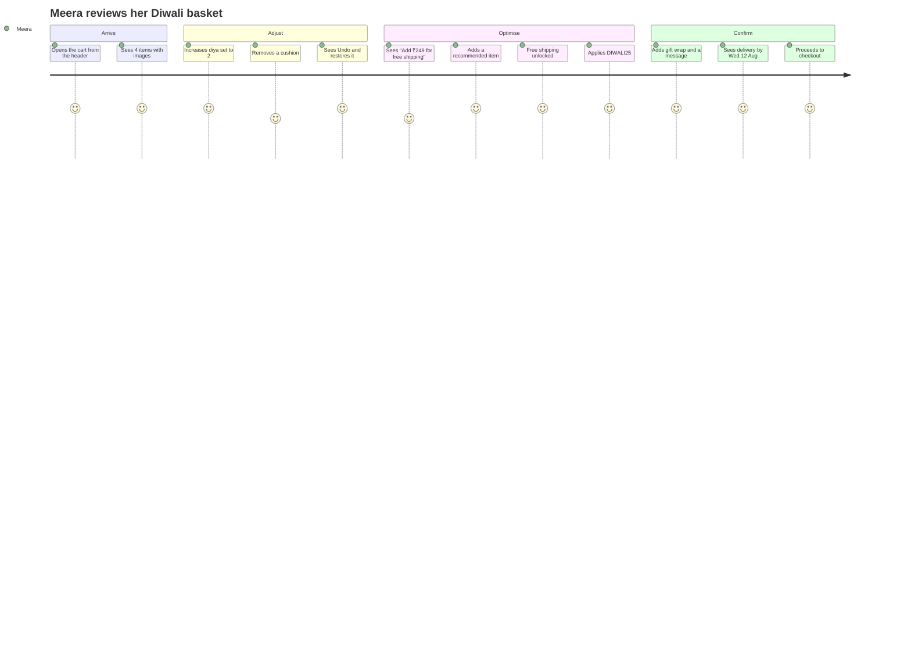
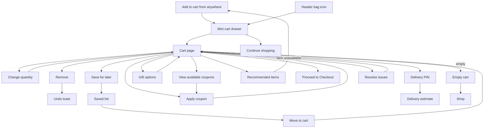
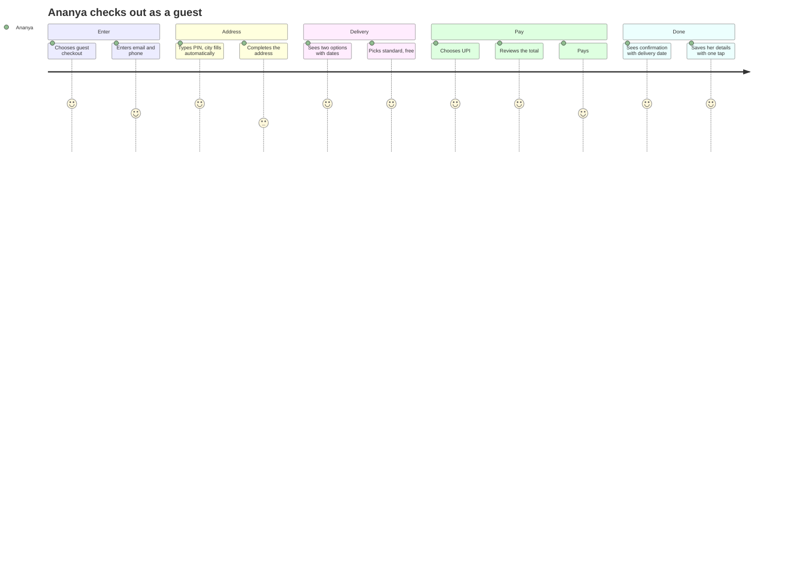
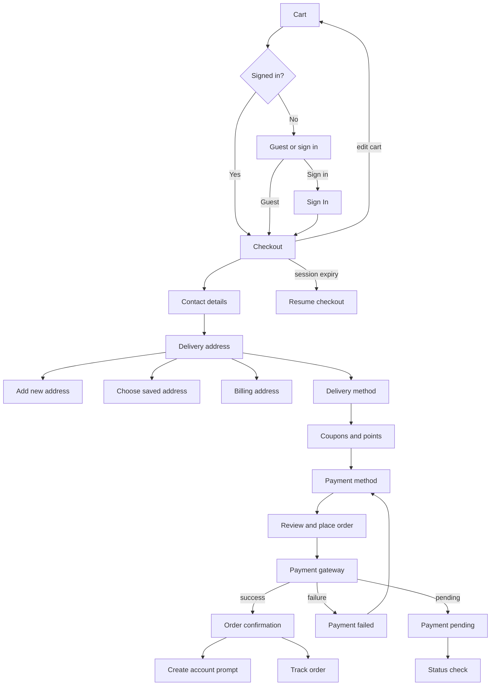
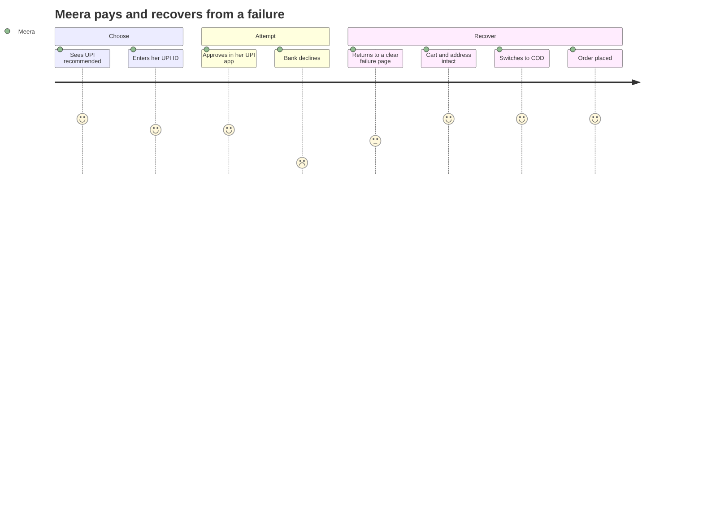
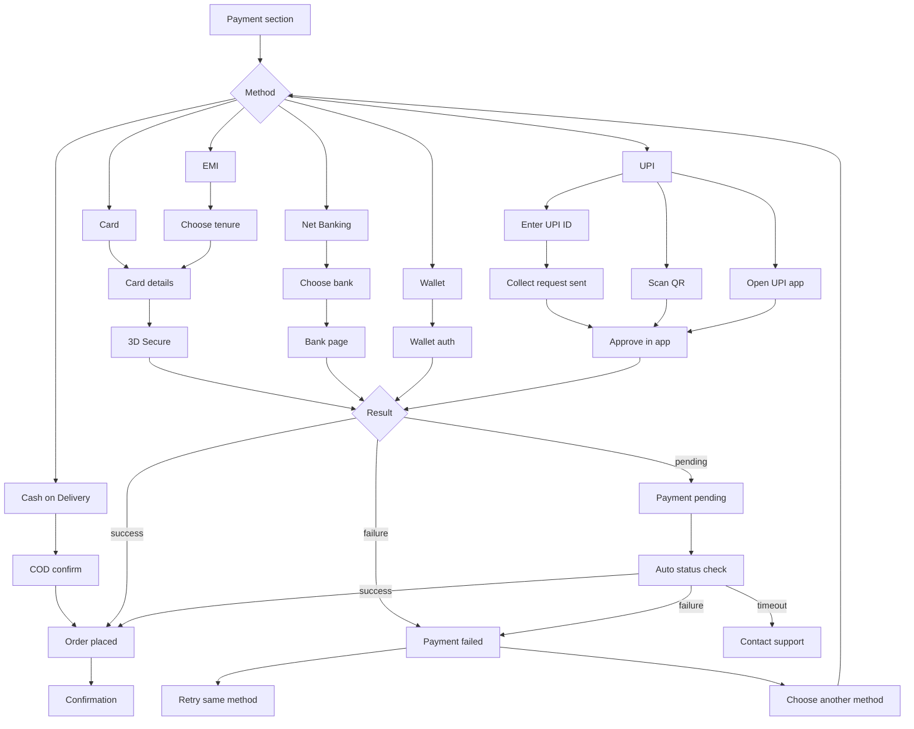

# Modules 07–09 — Cart, Checkout & Payment

Enterprise Handicraft E-Commerce Platform · Customer Website UI/UX Specification

> These three modules form the revenue-critical path. Every design decision here is measured against a single question: does it reduce the number of shoppers who leave between adding an item and seeing the confirmation?

---
---

# MODULE 07 · CART

## 7.1 Business Goal

The cart is where hidden costs kill orders. India-wide research and this store's own data put cart abandonment at 68%, and the leading causes are unexpected shipping cost, uncertainty about delivery date, and the shopper simply losing confidence. The cart must therefore be a **complete, honest statement of what the shopper will pay and when they will receive it**, with nothing left to be revealed later. Target: cart → checkout ≥65%; abandonment reduced to 55%.

## 7.2 Purpose

Let the shopper review, adjust and understand their order in full — items, options, quantities, savings, gift treatment, delivery cost and delivery date — and move to checkout with confidence.

## 7.3 Customer Journey



## 7.4 Navigation Flow



## 7.5 Complete Screen List

| ID | Screen / Overlay | Route | Type |
|----|------------------|-------|------|
| PG-07-01 | Cart | `/cart` | Page |
| PG-07-02 | Saved for Later (section) | `/cart#saved` | Section |
| PG-07-03 | Shared Cart (link) | `/cart/shared/{token}` | Page |
| STA-07-01 | Empty cart | — | State |
| STA-07-02 | Cart with unavailable items | — | State |
| STA-07-03 | Cart with price changes | — | State |
| MOD-07-01 | Remove item confirm | — | Modal XS |
| MOD-07-02 | Available coupons | — | Modal MD |
| MOD-07-03 | Coupon terms | — | Popover |
| MOD-07-04 | Gift options | — | Modal MD |
| MOD-07-05 | Gift message preview | — | Modal SM |
| MOD-07-06 | Delivery estimate detail | — | Modal SM |
| MOD-07-07 | Tax breakdown | — | Popover |
| MOD-07-08 | Share cart | — | Modal SM |
| DRW-07-01 | Mini Cart | — | Drawer 420 |
| DRW-07-02 | Recommended items | — | Drawer |
| SHT-07-01 | Mini cart sheet (mobile) | — | Sheet |
| SHT-07-02 | Coupons sheet | — | Sheet |
| SHT-07-03 | Gift options sheet | — | Sheet |
| SHT-07-04 | Order summary sheet | — | Sheet |

## 7.6 Information Architecture

```
Cart
├── Header (title, item count, continue shopping)
├── Alerts (unavailable items, price changes, stock warnings)
├── Free-shipping progress
├── Item list
│   └── Per item: image, name, variant, artisan, variation notice,
│       stock, unit price, quantity, line total, save for later, remove
├── Gift options
├── Saved for later
├── Recommended items
└── Summary (sticky)
    ├── Subtotal, discount, gift wrap, delivery, tax
    ├── Total + savings
    ├── Coupon input
    ├── Delivery estimate
    ├── Checkout CTA
    └── Trust badges + payment marks
```

## 7.7 Screen Hierarchy

```
Cart (PG-07-01)
├── Shell + breadcrumb
├── Page header
├── Alert region [conditional]
├── Two-column body
│   ├── Items column (8)
│   │   ├── Free shipping progress
│   │   ├── Cart line items
│   │   ├── Gift options panel
│   │   └── Saved for later
│   └── Summary column (4, sticky)
├── Recommended rail
└── Footer
```

## 7.8 Desktop Layout

Template `SL-04` (8/4). Items column left, summary column right and sticky from the top of the content area with a 24 px offset below the header. Gap 40. The summary never scrolls out of view — the checkout button is always reachable.

## 7.9 Tablet Layout

7/5 split, summary still sticky. Line items compress: image 80 px, actions move to a single row beneath the price.

## 7.10 Mobile Layout

Fully stacked. The summary appears **twice**: a collapsed total bar sticky at the bottom (72 px: total + item count + "Checkout") and the full breakdown expandable from it via `SHT-07-04`. Line items are full-width cards with a 96 px image. Quantity stepper and remove sit on one row.

The sticky bottom bar is the single most important element on mobile cart — it must never be obscured by the browser chrome and must respect the safe area.

## 7.11 Wireframe Description

### Desktop

```
┌──────────────────────────────────────────────────────────────────────────────────────┐
│ Home / Cart                                                                           │
├──────────────────────────────────────────────────────────────────────────────────────┤
│ Your Cart (4 items)                                              ← Continue Shopping  │
├──────────────────────────────────────────────────────────────────────────────────────┤
│ ⚠ 1 item is no longer available. [Remove it] to continue.                             │
├────────────────────────────────────────────────────┬─────────────────────────────────┤
│ 🚚 Add ₹249 more for free shipping                 │ ┌─ Order Summary ─────────────┐ │
│ ██████████████████░░░░░░  ₹750 of ₹999             │ │ Subtotal (4 items) ₹3,930   │ │
├────────────────────────────────────────────────────┤ │ Discount (DIWALI25) −₹393   │ │
│ ┌────────────────────────────────────────────────┐ │ │ Gift wrap             ₹99   │ │
│ │┌──────┐ Blue Pottery Vase — Jaipur     ₹1,250  │ │ │ Delivery            FREE    │ │
│ ││ img  │ Size: Medium · Colour: Indigo          │ │ │ Taxes (GST 12%)  ₹455 ⓘ    │ │
│ ││ 96   │ 🤲 Ram Prasad Sharma                   │ │ │ ─────────────────────────   │ │
│ │└──────┘ 🤲 Handmade — each piece varies        │ │ │ Total              ₹4,091   │ │
│ │         ⚠ Only 2 left                          │ │ │ You save ₹393               │ │
│ │         [− 1 +]   Save for later · Remove      │ │ ├─────────────────────────────┤ │
│ │                                        ₹1,250  │ │ │ 🎟 DIWALI25 applied  [×]    │ │
│ └────────────────────────────────────────────────┘ │ │ [ Add another code       ]  │ │
│ ┌────────────────────────────────────────────────┐ │ │ View available coupons →    │ │
│ │┌──────┐ Brass Diya Set of 5            ₹450   │ │ ├─────────────────────────────┤ │
│ ││ img  │ 🤲 Mohan Singh                         │ │ │ 📍 Deliver to 560038 [Change]│ │
│ │└──────┘ ✓ In stock                             │ │ │ 🚚 Get it by Wed, 12 Aug    │ │
│ │         [− 2 +]   Save for later · Remove      │ │ ├─────────────────────────────┤ │
│ │                                          ₹900  │ │ │ [  Proceed to Checkout  ]   │ │
│ └────────────────────────────────────────────────┘ │ │                             │ │
│ ┌────────────────────────────────────────────────┐ │ │ 🔒 Secure checkout          │ │
│ │┌──────┐ Terracotta Planter          ₹680      │ │ │ ✅ 7-day returns            │ │
│ ││ img  │ ⛔ No longer available                 │ │ │ [visa][mc][upi][rupay][cod] │ │
│ │└──────┘ [Save for later] [Remove]              │ │ └─────────────────────────────┘ │
│ └────────────────────────────────────────────────┘ │                                 │
│ ┌─ 🎁 Gift Options ──────────────────────────────┐ │                                 │
│ │ ☑ This is a gift                               │ │                                 │
│ │ Wrap: (○ None) (● Traditional ₹99) (○ Premium  │ │                                 │
│ │       ₹199)                                    │ │                                 │
│ │ Message (optional)                    142/250  │ │                                 │
│ │ [ Happy Diwali, Amma! Love, Meera            ] │ │                                 │
│ │ ☑ Hide prices on the packing slip              │ │                                 │
│ └────────────────────────────────────────────────┘ │                                 │
│ ┌─ Saved for Later (2) ──────────────────────────┐ │                                 │
│ │ [img] Kantha Cushion  ₹890  [Move to Cart][×]  │ │                                 │
│ └────────────────────────────────────────────────┘ │                                 │
├────────────────────────────────────────────────────┴─────────────────────────────────┤
│ You might also like                                                             ‹  › │
│ [product rail]                                                                       │
└──────────────────────────────────────────────────────────────────────────────────────┘
```

### Mobile

```
┌──────────────────────────────────┐
│ ‹  Your Cart (4)                 │
├──────────────────────────────────┤
│ ⚠ 1 item unavailable  [Remove]   │
├──────────────────────────────────┤
│ 🚚 Add ₹249 for free shipping    │
│ ████████████░░░░░                │
├──────────────────────────────────┤
│ ┌──────────────────────────────┐ │
│ │┌────┐ Blue Pottery Vase      │ │
│ ││img │ Medium · Indigo        │ │
│ ││ 96 │ 🤲 Handmade, varies    │ │
│ │└────┘ ⚠ Only 2 left          │ │
│ │       ₹1,250                 │ │
│ │ [− 1 +]      Save  ·  Remove │ │
│ └──────────────────────────────┘ │
│ ┌──────────────────────────────┐ │
│ │ …                            │ │
│ └──────────────────────────────┘ │
├──────────────────────────────────┤
│ 🎁 Gift options              ›   │
├──────────────────────────────────┤
│ 🎟 DIWALI25 applied  −₹393  [×]  │
│ [ Enter another code         ]   │
├──────────────────────────────────┤
│ 📍 560038 · Get it Wed, 12 Aug   │
├──────────────────────────────────┤
│ Saved for later (2)          ›   │
├──────────────────────────────────┤
│ You might also like  [rail]      │
├──────────────────────────────────┤
│ Total ₹4,091 · 4 items       ⌃   │  sticky
│ [      Proceed to Checkout    ]  │  72px
└──────────────────────────────────┘
```

### `DRW-07-01` · Mini Cart

Full anatomy in `03-Component-Library §54`. Behaviour: opens automatically after Add to Cart on desktop, auto-closes after 6 s of no interaction; on mobile a product toast is shown instead, and the sheet opens only when the shopper taps the bag icon.

## 7.12 Header

Standard site header. The bag badge shows the item count (not the line count) and animates on every change. On the cart page itself, the bag icon is non-interactive to avoid a confusing self-link.

## 7.13 Mega Menu / Navigation

Available. "Continue Shopping" returns to the last browsed listing, not the homepage — this is a meaningful conversion detail.

## 7.14 Footer

Full footer on the cart page (unlike checkout, which uses the minimal footer).

## 7.15 Breadcrumb

`Home / Cart` — orientation only.

## 7.16 Search

Header search available. Not present within the cart itself.

## 7.17 Filters

Not applicable.

## 7.18 Sorting

Not applicable. Items appear in the order added, most recent first.

## 7.19 Cards

| Card | Usage |
|------|-------|
| Cart line item | Primary list |
| Saved-for-later item | Compact row |
| Summary card | Sticky totals panel |
| Gift options panel | Expandable card |
| Recommended product card | Rail |
| Coupon card | Available-coupons modal |

## 7.20 Widgets

| Widget | Spec |
|--------|------|
| Free-shipping progress | Bar + remaining amount; celebrates on unlock; hidden once the threshold is met and the shopper has scrolled past |
| Coupon input | Field + Apply; shows the applied coupon as a removable green row; "View available coupons" opens a list of coupons the shopper is eligible for |
| Delivery estimate | PIN + promised date + COD availability; PIN is pre-filled from previous use |
| Order summary | Complete cost breakdown; tax has an explanatory popover; savings line in success tone |
| Gift options | Wrap selection with images and prices, message with live preview, hide-prices toggle |
| Saved for later | Separate list below the cart; items here are not counted in the total |
| Unavailable-items alert | Blocks checkout until resolved, with per-item resolution actions |
| Price-change alert | Non-blocking; lists what changed with old and new prices |
| Recommended rail | Based on cart contents; "Complete the look" framing |

## 7.21 Forms & Fields

| Form | Field | Type | Required | Notes |
|------|-------|------|----------|-------|
| Line item | Quantity | Stepper | Yes | 1 to min(stock, per-order limit); typing allowed |
| Coupon | Code | Text | Yes | Uppercase-normalised, trimmed, 3–20 chars |
| Delivery | PIN code | 6-digit numeric | No | Remembered 30 days |
| Gift | Is a gift | Checkbox | No | Reveals the rest |
| Gift | Wrap style | Radio cards | Conditional | With images and prices |
| Gift | Message | Textarea | No | ≤250 chars, live counter, preview |
| Gift | Hide prices | Checkbox | No | Default checked when gifting |
| Gift | Recipient name | Text | No | Printed on the card |
| Share cart | — | — | — | Generates a link |

## 7.22 Validation Rules

| Field / Condition | Rule | Message |
|-------------------|------|---------|
| Quantity | ≥1 | Stepper cannot go below 1; at 1 the `−` becomes a remove action |
| Quantity | ≤ available stock | "Only 2 available" — the `+` disables with a tooltip and the quantity clamps with a notice |
| Quantity | ≤ per-order limit | "Maximum 5 per order" |
| Quantity | Non-numeric input | Reverts to the previous value on blur |
| Cart | Item out of stock | "No longer available" — checkout blocked until removed or saved for later |
| Cart | Item price changed | "Price updated from ₹1,400 to ₹1,250" — non-blocking, acknowledged by continuing |
| Cart | Item unpublished | "This piece is no longer sold" + Remove + Find similar |
| Cart | Empty | Checkout button not rendered; empty state shown |
| Cart | Maximum 50 line items | "Your cart is full. Please check out or remove items." |
| Coupon | Required | "Enter a coupon code" |
| Coupon | Invalid | "This coupon isn't valid" |
| Coupon | Expired | "This coupon expired on 25 Oct" |
| Coupon | Minimum not met | "Add ₹250 more to use this coupon" — with a link to recommended items |
| Coupon | Not applicable | "This coupon doesn't apply to the items in your cart" |
| Coupon | Usage limit | "You've already used this coupon" |
| Coupon | Already applied | "This coupon is already applied" |
| Coupon | Not combinable | "DIWALI25 can't be combined with FREESHIP. Keep which one?" |
| PIN | 6 digits | "Enter a valid 6-digit PIN code" |
| PIN | Not serviceable | "We don't deliver to 560038 yet. [Notify me]" — checkout still allowed with a different address |
| PIN | COD unavailable | Inline note only, non-blocking |
| Gift message | ≤250 | "Message must be 250 characters or fewer" |
| Gift message | Prohibited content | "Please remove contact details from the gift message" |
| Gift wrap | Item not eligible | "Gift wrap isn't available for {item}" — listed explicitly |

## 7.23 Action Buttons

| Button | Type | Placement | Behaviour |
|--------|------|-----------|-----------|
| Proceed to Checkout | Primary XL, full-width | Summary + sticky bar | Blocked while unresolved items exist, with the reason stated |
| Continue Shopping | Link with back chevron | Page header | Returns to the last listing |
| Apply (coupon) | Secondary MD | Coupon row | Loading → applied or error |
| Remove coupon | Icon `×` | Applied coupon row | Immediate + Undo |
| View available coupons | Link | Below coupon input | Modal/sheet |
| Quantity − / + | Stepper | Line item | Debounced 500 ms |
| Save for later | Link | Line item | Moves to the saved list |
| Remove | Link (danger on hover) | Line item | Confirm at quantity >1 or high value; otherwise immediate + Undo |
| Move to cart | Outline SM | Saved item | — |
| Change PIN | Link | Delivery block | Re-opens the input |
| Gift options | Expander / row link | Items column | Expands or opens a sheet |
| Preview message | Link | Gift panel | Modal showing the printed card |
| Share cart | Ghost icon | Page header | Modal with a link |
| Resolve issues | Primary SM | Alert | Scrolls to the first problem item |

## 7.24 Icons

`shopping-bag` cart · `trash-2` remove · `heart` save for later · `ticket-percent` coupon · `gift` gift options · `truck` delivery · `map-pin` PIN · `info` tax explanation · `shield-check` secure · `undo-2` returns · `plus`/`minus` quantity · `chevron-up` expand summary · `triangle-alert` unavailable · `trending-down` price drop.

## 7.25 Typography & Spacing

| Element | Style |
|---------|-------|
| Page title | `heading-xl` |
| Item count | `body-md`, `text-secondary` |
| Item name | `body-lg` 500 |
| Variant line | `body-sm`, `text-secondary` |
| Unit price | `price-md` |
| Line total | `price-md` 600 |
| Summary label | `body-md` |
| Summary value | `price-md` tabular |
| Total | `price-xl` |
| Savings line | `body-sm`, `success-700` |
| Line item padding | 20 vertical |
| Summary card padding | 24 |
| Column gap | 40 / 32 / — |

## 7.26 Images / Video / Carousels

Line item images 96×96 (192 at 2×), ≤12 KB, eager for the first three, lazy after. Mini cart images 64×64. Gift wrap option images 120×80. Recommended rail uses standard card images, lazy.

## 7.27 Pagination

None. Carts above 20 items collapse older items behind "Show all {n} items" to keep the summary reachable.

## 7.28 Empty State

```
┌──────────────────────────────────────────────────┐
│            🧺 (illustration 180)                  │
│             Your cart is empty                    │
│   Discover handmade pieces from artisans across   │
│   India — every one made by a person, not a       │
│   machine.                                        │
│                                                   │
│      [ Start Shopping ]   [ View Wishlist ]       │
├──────────────────────────────────────────────────┤
│ Saved for later (2)                               │
│ [saved item rows with Move to Cart]               │
├──────────────────────────────────────────────────┤
│ RAIL · Recently viewed                            │
│ RAIL · Bestsellers                                │
└──────────────────────────────────────────────────┘
```

Saved-for-later items and recently viewed appear even when the cart is empty — the empty cart is a recovery surface.

## 7.29 Loading State & Skeleton

| Surface | Treatment |
|---------|-----------|
| Initial load | 3 line-item skeletons + summary skeleton; the header count renders from cache immediately |
| Quantity change | Line total and summary values shimmer in place; the rest of the page stays interactive |
| Coupon apply | Button spinner; summary values shimmer |
| PIN check | Inline spinner in the delivery block |
| Remove | Row fades to 40% then collapses |
| Checkout click | Button spinner + "Preparing checkout…" after 800 ms |
| Mini cart | Skeleton items on first open |

## 7.30 Success State

| Event | Treatment |
|-------|-----------|
| Item added | Mini cart opens with the item highlighted `success-50` for 1.5 s; badge pops |
| Quantity changed | Line total and summary count up/down over 200 ms |
| Coupon applied | Green row slides in; total counts down; toast "Coupon applied · You save ₹393" |
| Free shipping unlocked | Bar fills, turns green, single pulse, message changes to "You've unlocked free shipping 🎉" |
| Gift options saved | Panel collapses to a summary line "🎁 Traditional wrap · message added" |
| PIN checked | Delivery block expands with the promised date |
| Item saved for later | Row animates into the saved section; toast with Undo |

## 7.31 Error State

| Error | Treatment |
|-------|-----------|
| Cart fails to load | Full error state with Retry; header count preserved |
| Item unavailable | Row tinted `danger-50`, "No longer available", Save/Remove actions, checkout blocked with a clear reason on the button |
| Stock reduced below quantity | Quantity clamps with a notice "Only 2 left — quantity updated" |
| Price changed | Amber alert listing the changes; requires no action but is clearly visible |
| Coupon failure | Inline error under the field with the precise reason and, where relevant, the shortfall amount |
| Coupon conflict | Modal asking which coupon to keep |
| PIN check fails | "We couldn't check delivery right now" — checkout is never blocked by this |
| Quantity update fails | Reverts with a toast "Couldn't update quantity. Try again." |
| Remove fails | Row restored with a toast |
| Session expired | Cart preserved server-side for signed-in shoppers, in a cookie for guests; a banner explains and offers sign-in |
| Checkout unavailable | "Checkout is temporarily unavailable. Your cart is saved." + Retry + support contact |

## 7.32 Confirmation Dialogs

| Dialog | Trigger | Content |
|--------|---------|---------|
| Remove item | Remove with quantity >1 or value >₹2,000 | Item preview + "You can move it to your wishlist instead." · Save for Later / Cancel / Remove Item |
| Remove item | Quantity 1, low value | No dialog — immediate with an 8 s Undo |
| Clear cart | Clear all (if offered) | "Remove all 4 items?" · Cancel / Clear Cart |
| Coupon conflict | Applying a non-combinable coupon | Comparison of both savings · Keep DIWALI25 / Use FREESHIP |
| Leave with gift message unsaved | Navigating with unsaved gift text | "Save your gift message?" · Discard / Save |

## 7.33 Notifications

| Trigger | Type | Message |
|---------|------|---------|
| Item added | Product toast | "Added to cart · View Cart" |
| Item removed | Info toast | "Item removed" + Undo (8 s) |
| Saved for later | Info toast | "Saved for later" + Undo |
| Moved to cart | Product toast | "Moved to cart" |
| Coupon applied | Success toast | "Coupon applied · You save ₹393" |
| Coupon removed | Info toast | "Coupon removed" + Undo |
| Free shipping unlocked | Success toast | "Free shipping unlocked 🎉" |
| Quantity clamped | Warning toast | "Only 2 left — we updated the quantity" |
| Price changed | Warning alert (inline) | "Some prices have changed" |
| Cart restored | Info toast | "We restored your cart" |
| Abandoned cart (email/WhatsApp) | External | "You left something behind" |

## 7.34 Micro-interactions & Animation

Quantity stepper: value rolls; line total and summary values count to their new figures over 200 ms · Free-shipping bar fills smoothly and pulses once on unlock · Coupon row slides in from the left with a green flash; total counts down · Removing collapses the row height over 250 ms; Undo re-expands it · Mini cart slides in 350 ms with the new item highlighted · Gift panel expands 250 ms; the wrap selection animates a ribbon on the chosen card · Delivery block expands with the date drawing in · Sticky mobile bar slides up on first scroll and stays · Checkout button shows a spinner then a brief "Preparing checkout…" label.

## 7.35 Accessibility

- The cart is a labelled region; the item list is a proper list with each item's accessible name composed of name, variant, quantity and line total.
- Quantity steppers expose current value, min and max, and announce the new line total after each change.
- Removing announces "{Product} removed from cart, cart has {n} items" and moves focus to the next item (or the empty state).
- Undo is keyboard reachable within the toast before it dismisses; the toast timer pauses on focus.
- The summary is a description list with programmatic label/value association; the total is announced on every change.
- Coupon success and failure are announced assertively.
- The free-shipping progress bar exposes value, max and the remaining amount in text.
- The unavailable-items alert receives focus on page load and its "Resolve" action jumps to the first problem item.
- The sticky mobile bar is not a focus trap; page content has bottom padding equal to its height.
- The checkout button's disabled state always carries a text reason, never colour alone.

## 7.36 Responsive Behaviour

| Element | Desktop | Tablet | Mobile |
|---------|---------|--------|--------|
| Layout | 8/4 sticky summary | 7/5 sticky summary | Stacked + sticky total bar |
| Line item image | 96 | 80 | 96 |
| Line item actions | Right-aligned inline | Below price | Below price, full-width tap targets |
| Summary | Sticky card | Sticky card | Collapsed bar + expandable sheet |
| Gift options | Inline expandable panel | Inline | Row link → sheet |
| Coupon | Inline in summary | Inline | Inline above the sticky bar |
| Saved for later | Below items | Below items | Collapsible section |
| Mini cart | Right drawer | Right drawer | Bottom sheet (bag icon only) |

## 7.37 Prototype Flow (SP-04)

Add to cart from PDP → mini cart opens → View Cart → change quantity (summary updates) → remove an item → Undo → apply a coupon (error then success) → free shipping unlocks → add gift wrap and message → check PIN → Proceed to Checkout.

## 7.38 Figma Components & Variants

**Required:** `CMP-CRT-LineItem`, `CMP-CRT-MiniCart`, `CMP-CRT-Summary`, `CMP-CRT-CouponInput`, `CMP-CRT-AppliedCoupon`, `CMP-CRT-CouponCard`, `CMP-CRT-GiftOptions`, `CMP-CRT-ShippingProgress`, `CMP-CRT-SavedItem`, `CMP-ACT-QtyStepper`, `CMP-PRD-DeliveryEstimate`, `CMP-FBK-Alert`, `CMP-FBK-EmptyState`, `CMP-IND-TrustBadge`, `CMP-IND-PaymentMarks`, `CMP-PRD-Rail`.

**New to build:**

| Component | Variants |
|-----------|----------|
| `CMP-CRT-StickyBar` | State (Default/Loading/Blocked) × Expanded (Y/N) |
| `CMP-CRT-IssueAlert` | Type (Unavailable/Price change/Stock reduced/Multiple) × Count |
| `CMP-CRT-GiftWrapOption` | Style (None/Traditional/Premium) × State (Default/Selected/Unavailable) |
| `CMP-CRT-GiftMessagePreview` | Card design (2 variants) |
| `CMP-CRT-SavedSection` | Count (0/1/3/5+) × Collapsed (Y/N) |

## 7.39 Auto Layout Structure

```
Frame: Cart — Desktop 1440 (V, Fill × Hug, gap 24, padding 24 40)
├── Instance: Breadcrumb
├── Frame: Header (H, Fill × Hug, space-between)
├── Instance: CRT-IssueAlert (Fill × Hug)        [conditional]
└── Frame: Body (H, Fill × Hug, gap 40, align top)
    ├── Frame: Items (Fill, V, gap 16)
    │   ├── Instance: CRT-ShippingProgress (Fill × 64)
    │   ├── Frame: Line Items (V, Fill × Hug, gap 0, dividers)
    │   │   └── n × Instance: CRT-LineItem (Fill × Hug)
    │   ├── Instance: CRT-GiftOptions (Fill × Hug)
    │   └── Instance: CRT-SavedSection (Fill × Hug)
    └── Frame: Summary (400 fixed, V, gap 16)     [Sticky]
        ├── Instance: CRT-Summary
        ├── Instance: CRT-CouponInput
        ├── Instance: PRD-DeliveryEstimate
        ├── Instance: Button / Proceed to Checkout (Fill × 56)
        └── Frame: Trust (V, gap 12)
```

## 7.40 UX Guidelines · Developer Notes · Analytics · Scalability

### UX Guidelines

| ID | Guideline |
|----|-----------|
| CT-01 | **No cost may first appear after the cart.** Delivery, taxes and any fees are shown here or the design has failed |
| CT-02 | The delivery date is shown in the cart, not deferred to checkout |
| CT-03 | Removal is undoable for 8 seconds; high-value removals are confirmed |
| CT-04 | Save for Later is offered every time removal is confirmed |
| CT-05 | The checkout button is never disabled without a visible reason |
| CT-06 | Coupon errors state the exact shortfall and how to fix it |
| CT-07 | Free-shipping progress uses a real threshold and celebrates genuinely |
| CT-08 | The variation notice appears on handmade line items — the last chance to set expectations before purchase |
| CT-09 | The cart survives session expiry, device change (signed in) and 30 days (guest) |
| CT-10 | Recommendations are relevant to the cart, capped at one rail, and never interrupt the summary |
| CT-11 | Nothing is auto-added — no insurance, no donation, no warranty |
| CT-12 | On mobile the total and checkout action are always visible |

### Developer Notes

1. Quantity updates debounce 500 ms and send the absolute value, not a delta, to avoid race conditions.
2. Every cart mutation returns the full recalculated cart so the client never computes totals itself.
3. Stock and price are re-validated on cart load, on tab focus after 10 minutes, and again at checkout entry.
4. Guest carts persist in a signed cookie for 30 days; signed-in carts persist server-side and merge on sign-in.
5. Coupon validation is server-side and returns a structured reason code the UI maps to copy.
6. The delivery estimate uses the same service as PDP and checkout — one source of truth for promised dates.
7. Cart mutations are idempotent by request key.
8. The sticky mobile bar uses safe-area insets and must be tested against iOS Safari's collapsing chrome.
9. Abandoned-cart recovery restores the exact cart including gift options and applied coupons.

### Analytics Events

`view_cart` (value, item_count) · `add_to_cart` · `remove_from_cart` (item_id, reason) · `update_quantity` (from, to) · `save_for_later` · `move_to_cart` · `apply_coupon` (code, success, discount, failure_reason) · `remove_coupon` · `gift_options_used` (wrap, message) · `delivery_check` · `free_shipping_unlocked` · `begin_checkout` · `cart_issue_shown` (type) · `cart_abandoned` (inferred).

### Future Scalability

Multi-address split shipping from one cart · scheduled delivery date selection · subscription items alongside one-time items · bulk/wholesale quantity pricing shown in-cart · shareable carts for group gifting · cart-level personalisation ("frequently bought with your basket") · buy-now-pay-later eligibility shown in the summary · in-cart currency switching with a landed-cost estimate.

---
---

# MODULE 08 · CHECKOUT

## 8.1 Business Goal

Checkout is the narrowest point of the funnel and the most expensive place to lose a shopper. Every field, every click and every second of uncertainty costs revenue. The design principle is ruthless: **collect only what is needed to deliver and charge, in the order the shopper expects, on one page, with the total always visible**. Target: checkout completion ≥80%; returning-shopper checkout ≤90 s; guest checkout with a new address ≤3 min.

## 8.2 Purpose

Collect contact details, delivery address, delivery method and payment method; apply discounts and reward points; present the final total transparently; and place the order.

## 8.3 Customer Journey



## 8.4 Navigation Flow



## 8.5 Complete Screen List

| ID | Screen / Overlay | Route | Type |
|----|------------------|-------|------|
| PG-08-01 | Checkout (single page) | `/checkout` | Page |
| PG-08-02 | Guest or Sign In choice | `/checkout/start` | Page |
| PG-08-03 | Order Confirmation | `/checkout/success/{orderNumber}` | Page |
| PG-08-04 | Payment Pending | `/checkout/pending/{orderNumber}` | Page |
| PG-08-05 | Payment Failed | `/checkout/failed` | Page |
| PG-08-06 | Session Resume | `/checkout/resume` | Page |
| STA-08-01 | Cart changed during checkout | — | State |
| STA-08-02 | Address not serviceable | — | State |
| MOD-08-01 | Guest or Sign In | — | Modal MD |
| MOD-08-02 | Add / Edit Address | — | Modal MD |
| MOD-08-03 | Address suggestions (autocomplete) | — | Popover |
| MOD-08-04 | Saved addresses | — | Modal MD |
| MOD-08-05 | Available coupons | — | Modal MD |
| MOD-08-06 | Reward points | — | Modal SM |
| MOD-08-07 | Gift card | — | Modal SM |
| MOD-08-08 | Order summary detail | — | Modal MD |
| MOD-08-09 | Terms & conditions | — | Modal LG |
| MOD-08-10 | Cart changed | — | Modal MD |
| MOD-08-11 | Session expiring | — | Modal SM |
| MOD-08-12 | Leave checkout confirm | — | Modal SM |
| SHT-08-01 | Address sheet | — | Sheet |
| SHT-08-02 | Delivery options sheet | — | Sheet |
| SHT-08-03 | Coupons sheet | — | Sheet |
| SHT-08-04 | Order summary sheet | — | Sheet |
| SHT-08-05 | Payment method sheet | — | Sheet |

## 8.6 Information Architecture

```
Checkout (single page, progressive sections)
├── Minimal header (logo, secure badge, help)
├── Progress indicator (3 steps)
├── Section 1 · Contact
│   ├── Email (order confirmation)
│   └── Mobile (delivery updates)
├── Section 2 · Delivery address
│   ├── Saved addresses (signed in) or new address form
│   ├── PIN → city/state autofill
│   ├── Address type (Home/Work/Other)
│   └── Billing address (same as delivery by default)
├── Section 3 · Delivery method
│   └── Options with dates and costs
├── Section 4 · Payment
│   ├── Discounts (coupon, points, gift card)
│   └── Payment method selection with inline detail
├── Order summary (sticky, always visible)
├── Place Order
└── Minimal footer (trust, policies)
```

**Single-page with progressive disclosure**, not a multi-page wizard: each section collapses to a summary line once complete, and the next opens. Completed sections are editable in place. This preserves the sense of progress without the cost of page loads.

## 8.7 Screen Hierarchy

```
Checkout (PG-08-01)
├── Minimal header
├── Progress stepper
├── Form column
│   ├── Contact section [expanded → summary]
│   ├── Address section [expanded → summary]
│   ├── Delivery section [expanded → summary]
│   └── Payment section [expanded]
├── Summary column (sticky)
│   ├── Item list (collapsed, expandable)
│   ├── Coupon / points / gift card
│   ├── Cost breakdown
│   ├── Place Order
│   └── Trust badges
└── Minimal footer
```

## 8.8 Desktop Layout

Template `SL-04` (7/5). Form column left, summary right and sticky. Gap 40. Container max 1200 — narrower than the rest of the site, which measurably improves focus. **The header contains no navigation, search, mega menu or cart icon** — only the logo, a secure-checkout badge and a help link. The footer is minimal.

## 8.9 Tablet Layout

7/5 retained. Summary sticky. Address form fields go two-up where they are short (city/PIN, state/country).

## 8.10 Mobile Layout

Fully stacked. The order summary appears **collapsed at the top** as "4 items · ₹4,091 ⌄" (expandable) and again as a sticky bottom bar with the total and the primary action. Sections expand one at a time. Each section's primary action ("Continue to Delivery") is full-width at 56 px.

The bottom bar label changes with context: "Continue to Delivery" → "Continue to Payment" → "Pay ₹4,091".

## 8.11 Wireframe Description

### Desktop

```
┌──────────────────────────────────────────────────────────────────────────────────────┐
│  [KARIGAR]                          🔒 Secure Checkout                      Need help?│
├──────────────────────────────────────────────────────────────────────────────────────┤
│  ①────────②────────③                                                                  │
│  Address  Delivery  Payment                                                           │
├────────────────────────────────────────────────┬─────────────────────────────────────┤
│ ✓ Contact                             [Edit]   │ ┌─ Order Summary ─────────────────┐ │
│   ananya@example.com · +91 98765 43210         │ │ 4 items                     ⌄   │ │
├────────────────────────────────────────────────┤ │ [img][img][img][img]            │ │
│ ✓ Delivery Address                    [Edit]   │ ├─────────────────────────────────┤ │
│   Ananya Iyer                                  │ │ Subtotal          ₹3,930        │ │
│   402, Rosewood Apartments, 12th Main          │ │ Discount (DIWALI25) −₹393       │ │
│   Indiranagar, Bengaluru, KA 560038            │ │ Reward points      −₹100        │ │
│   +91 98765 43210                              │ │ Gift wrap            ₹99        │ │
├────────────────────────────────────────────────┤ │ Delivery            FREE        │ │
│ ✓ Delivery Method                     [Edit]   │ │ Taxes (GST) ⓘ      ₹455        │ │
│   Standard · Free · Get it by Wed, 12 Aug      │ │ ─────────────────────────────   │ │
├────────────────────────────────────────────────┤ │ Total            ₹3,991        │ │
│ ▾ Payment                                      │ │ You save ₹493                  │ │
│                                                │ ├─────────────────────────────────┤ │
│  Have a coupon?  🎟 DIWALI25 applied  [×]      │ │ 🎟 Add a coupon                 │ │
│  Use reward points  2,480 available            │ │ 💎 Use 1,000 points (−₹100)     │ │
│  [────●─────] 1,000 points = ₹100 off          │ │ 🎁 Gift card                    │ │
│                                                │ ├─────────────────────────────────┤ │
│  Choose how to pay                             │ │ [    Place Order · ₹3,991   ]   │ │
│  ┌────────────────────────────────────────┐    │ │                                 │ │
│  │ ⦿ UPI                    Recommended   │    │ │ By placing this order you agree │ │
│  │   [ ananya@okhdfcbank        ] [Verify]│    │ │ to our Terms and Privacy Policy │ │
│  │   or scan the QR code in your app      │    │ ├─────────────────────────────────┤ │
│  └────────────────────────────────────────┘    │ │ 🔒 256-bit encryption           │ │
│  ┌────────────────────────────────────────┐    │ │ ✅ 7-day returns                │ │
│  │ ○ Credit / Debit Card    10% off HDFC  │    │ │ 🤲 100% handmade                │ │
│  └────────────────────────────────────────┘    │ │ [visa][mc][rupay][upi]          │ │
│  ┌────────────────────────────────────────┐    │ └─────────────────────────────────┘ │
│  │ ○ Net Banking                          │    │                                     │
│  ├────────────────────────────────────────┤    │                                     │
│  │ ○ Wallets                              │    │                                     │
│  ├────────────────────────────────────────┤    │                                     │
│  │ ○ Cash on Delivery          +₹49 fee   │    │                                     │
│  └────────────────────────────────────────┘    │                                     │
├────────────────────────────────────────────────┴─────────────────────────────────────┤
│ © 2026 Karigar · Privacy · Terms · Refund Policy · Need help? care@karigar.com        │
└──────────────────────────────────────────────────────────────────────────────────────┘
```

### Mobile

```
┌──────────────────────────────────┐
│ ‹ KARIGAR      🔒 Secure         │
├──────────────────────────────────┤
│ ①──②──③  Address Delivery Payment│
├──────────────────────────────────┤
│ 4 items · ₹3,991              ⌄  │
├──────────────────────────────────┤
│ ✓ Contact              [Edit]    │
│   ananya@example.com             │
├──────────────────────────────────┤
│ ✓ Delivery Address     [Edit]    │
│   402, Rosewood Apts…            │
│   Bengaluru, KA 560038           │
├──────────────────────────────────┤
│ ✓ Delivery             [Edit]    │
│   Free · Wed, 12 Aug             │
├──────────────────────────────────┤
│ ▾ Payment                        │
│ 🎟 DIWALI25 applied  −₹393  [×]  │
│ 💎 Use 1,000 points (−₹100)      │
│                                  │
│ ┌──────────────────────────────┐ │
│ │ ⦿ UPI          Recommended   │ │
│ │ [ ananya@okhdfcbank        ] │ │
│ └──────────────────────────────┘ │
│ ┌──────────────────────────────┐ │
│ │ ○ Card         10% off HDFC  │ │
│ └──────────────────────────────┘ │
│ ┌──────────────────────────────┐ │
│ │ ○ Cash on Delivery   +₹49    │ │
│ └──────────────────────────────┘ │
├──────────────────────────────────┤
│ Total ₹3,991                  ⌃  │  sticky
│ [        Pay ₹3,991           ]  │  76px
└──────────────────────────────────┘
```

### `MOD-08-02` · Add Address

```
┌────────────────────────────────────────────────┐
│  Add delivery address                     [×]  │
├────────────────────────────────────────────────┤
│  Full name *                                   │
│  [ Ananya Iyer                             ]   │
│                                                │
│  Mobile number *                               │
│  [ +91 ] [ 98765 43210                     ]   │
│  We'll only use this for delivery updates      │
│                                                │
│  PIN code *                                    │
│  [ 560038                          ] ✓         │
│  Bengaluru, Karnataka                          │
│                                                │
│  Flat, house no., building *                   │
│  [ 402, Rosewood Apartments                ]   │
│                                                │
│  Area, street, sector *                        │
│  [ 12th Main, Indiranagar                  ]   │
│                                                │
│  Landmark (optional)                           │
│  [ Near Indiranagar Metro                  ]   │
│                                                │
│  Address type                                  │
│  [ 🏠 Home ] [ 🏢 Work ] [ 📍 Other ]           │
│                                                │
│  ☑ Save this address for next time             │
├────────────────────────────────────────────────┤
│                     [ Cancel ]  [ Use This Address ] │
└────────────────────────────────────────────────┘
```

Field order matches how an Indian address is written and spoken — PIN first because it auto-fills city and state, saving two fields of typing.

## 8.12 Header

**Minimal header only.** Logo (links to home with an unsaved-changes guard), a secure-checkout badge with a lock icon, and a "Need help?" link opening contact options. No navigation, no search, no mega menu, no cart icon — every one of these is a documented source of checkout leakage.

## 8.13 Mega Menu / Navigation

Deliberately absent. The only exit routes are the logo (guarded), "Edit cart" links in the summary, and the help link.

## 8.14 Footer

Minimal footer: copyright, Privacy, Terms, Refund Policy, support email. No newsletter, no social, no category links.

## 8.15 Breadcrumb

Replaced by the progress stepper.

## 8.16 Search

Absent.

## 8.17 Filters

Not applicable.

## 8.18 Sorting

Not applicable.

## 8.19 Cards

| Card | Usage |
|------|-------|
| Section card | Each checkout section, with collapsed-summary and expanded states |
| Address card | Saved address selection (radio card) |
| Delivery option card | Method selection (radio card) |
| Payment option card | Method selection (radio card, expands inline) |
| Saved card item | Stored payment cards |
| Order summary card | Sticky totals |
| Coupon card | Available coupons modal |

## 8.20 Widgets

| Widget | Spec |
|--------|------|
| Progress stepper | 3 steps; completed steps clickable; mobile shows "Step 2 of 3 — Delivery" plus a bar |
| Section summary | Collapsed completed sections show the key value and an Edit link |
| PIN autofill | Entering 6 digits fills city and state, validates serviceability, and updates the delivery estimate |
| Address autocomplete | Optional suggestion list as the shopper types the street |
| Delivery options | Each shows name, promised date, cost, and courier where relevant |
| Reward points applicator | Balance, max redeemable with the rule stated, slider + numeric input, live discount |
| Coupon input | Same behaviour as cart; an already-applied coupon carries over |
| Gift card | Code entry with balance display and partial-application handling |
| Order summary | Collapsed item strip expandable to the full list; complete cost breakdown; tax popover |
| Trust stack | Encryption, returns, handmade guarantee, payment marks |
| Session timer | Only when stock is reserved; a warning modal at 2 minutes with an extend option |

## 8.21 Forms & Fields

### Contact

| Field | Type | Required | Autocomplete | Notes |
|-------|------|----------|--------------|-------|
| Email | Email | Yes | `email` | "Order confirmation goes here" |
| Mobile | Phone | Yes | `tel` | "For delivery updates on WhatsApp and SMS" |
| Marketing consent | Checkbox | No | — | Unticked; separate from the order |

### Delivery Address

| Field | Type | Required | Autocomplete | Notes |
|-------|------|----------|--------------|-------|
| Full name | Text | Yes | `name` | Recipient, may differ from the buyer |
| Mobile | Phone | Yes | `tel` | Recipient's number |
| PIN code | 6-digit numeric | Yes | `postal-code` | **First field** — autofills city/state |
| City | Text | Yes | `address-level2` | Auto-filled, editable |
| State | Select | Yes | `address-level1` | Auto-filled |
| Flat / house / building | Text | Yes | `address-line1` | — |
| Area / street / sector | Text | Yes | `address-line2` | — |
| Landmark | Text | No | — | "Helps our courier find you" |
| Country | Select | Yes | `country` | Default India |
| Address type | Segmented | No | — | Home / Work / Other |
| Save address | Checkbox | No | — | Signed-in only, default on |
| Set as default | Checkbox | No | — | Shown only when saving |

### Billing Address

Single checkbox "Billing address is the same as delivery" (checked by default). Unchecking reveals the same field set. GST invoice option reveals: GSTIN, registered business name, and business address.

### Delivery Method

Radio cards generated from the shipping engine; each shows method name, promised date range, cost and any note.

### Payment

Radio cards per method; the selected card expands to reveal its inputs (detailed in Module 09).

### Order Notes

Optional textarea, ≤250 chars: "Any delivery instructions?" — placed in the delivery section, not payment.

### Terms

Not a checkbox. Microcopy beneath the Place Order button: "By placing this order you agree to our Terms and Privacy Policy." A checkbox is used only where a jurisdiction requires it.

## 8.22 Validation Rules

| Field | Rule | Message |
|-------|------|---------|
| Email | Required, valid | "Enter your email address" / "Enter a valid email address" |
| Email | Disposable domain | "Please use a permanent email address so we can send your order confirmation" |
| Mobile | Required, 10 digits | "Enter a valid 10-digit mobile number" |
| Full name | Required, 2–60 | "Enter the recipient's name" |
| PIN | Required, 6 digits | "Enter a valid 6-digit PIN code" |
| PIN | Serviceable | "We don't deliver to 560038 yet. [Use a different address]" — blocking for this address |
| PIN | COD unavailable | Non-blocking note in the payment section |
| City / State | Required | "{Label} is required" |
| Address line 1 | Required, 5–100 | "Enter your flat, house or building" |
| Address line 2 | Required, 3–100 | "Enter your area or street" |
| GSTIN | Format `^[0-9]{2}[A-Z]{5}[0-9]{4}[A-Z]{1}[1-9A-Z]{1}Z[0-9A-Z]{1}$` | "Enter a valid 15-character GSTIN" |
| Delivery method | Required | "Choose a delivery method" |
| Coupon | Per cart rules | Same catalogue as Module 07 |
| Reward points | ≤ balance | "You have 2,480 points available" |
| Reward points | ≤ max redeemable | "You can use up to 1,000 points on this order (20% of the order value)" |
| Gift card | Valid, unexpired, has balance | "This gift card has no balance left" / "This gift card has expired" |
| Payment method | Required | "Choose how you'd like to pay" |
| Payment method | COD limit | "Cash on delivery isn't available for orders above ₹15,000" |
| Payment method | COD not serviceable | "Cash on delivery isn't available for this PIN code" |
| Order notes | ≤250 | "Notes must be 250 characters or fewer" |
| Cart | Changed during checkout | Modal listing changes; requires acknowledgement before continuing |
| Cart | Empty | Redirect to the cart with an explanation |
| Stock | Reserved and expired | "We couldn't hold your items — please review your cart" |
| Total | ≤0 after discounts | Payment section shows "No payment needed" with a Place Order action |

## 8.23 Action Buttons

| Button | Type | Placement | Behaviour |
|--------|------|-----------|-----------|
| Continue as Guest | Primary XL | Choice screen | — |
| Sign In | Outline XL | Choice screen | — |
| Continue to Delivery | Primary XL | Address section | Validates and collapses the section |
| Continue to Payment | Primary XL | Delivery section | — |
| Place Order · ₹{total} | Primary XL | Summary + sticky bar | **The amount is always in the label** |
| Edit | Link | Each completed section | Re-expands the section |
| Add new address | Outline MD | Address section | Modal/sheet |
| Use this address | Primary MD | Address modal | — |
| Apply (coupon) | Secondary MD | Discounts | — |
| Apply points | Secondary MD | Points widget | — |
| View all coupons | Link | Discounts | Modal |
| Change (delivery) | Link | Delivery summary | — |
| Edit cart | Link | Summary header | Returns to cart with a guard |
| Need help? | Link | Header | Contact options |

## 8.24 Icons

`lock` secure · `check-circle` completed section · `map-pinned` address · `home`/`building-2`/`map-pin` address types · `truck` delivery · `calendar-check` promised date · `ticket-percent` coupon · `gem` points · `gift` gift card · `credit-card` card · `smartphone-nfc` UPI · `landmark` net banking · `wallet` wallet · `banknote` COD · `info` tax · `pencil` edit · `chevron-down` expand summary · `shield-check` trust.

## 8.25 Typography & Spacing

| Element | Style |
|---------|-------|
| Section heading | `heading-md` |
| Section summary value | `body-md` |
| Field label | `label-lg` |
| Input | `body-md`, height 52 |
| Helper | `body-xs` |
| Error | `body-xs`, `danger-600` |
| Summary label | `body-md` |
| Summary value | `price-md` tabular |
| Total | `price-xl` |
| Place Order button | `button-lg` |
| Legal microcopy | `body-xs`, `text-tertiary` |
| Section gap | 24 |
| Field gap | 20 |
| Card padding | 24 / 20 |

## 8.26 Images / Video / Carousels

Order summary thumbnails 48×48, ≤6 KB, eager (maximum 4 shown plus "+N"). Gift wrap option images 96×64. Payment method logos are SVG. **No other imagery** — checkout carries no marketing media of any kind.

## 8.27 Pagination

Not applicable.

## 8.28 Empty State

Checkout is unreachable with an empty cart — entry redirects to the cart's empty state. If the cart empties during checkout (all items become unavailable), a full-page state explains and offers the wishlist and recently viewed.

## 8.29 Loading State & Skeleton

| Surface | Treatment |
|---------|-----------|
| Initial load | Section shells render immediately; the summary shows a skeleton for computed values |
| PIN check | Inline spinner; city/state fields shimmer while filling |
| Delivery options | 2 option-card skeletons while rates are fetched |
| Coupon / points apply | Summary values shimmer |
| Place Order | Button spinner + label "Processing…"; **the entire form locks to prevent double submission**; a full-screen overlay appears after 1.5 s with "Please don't close this page" |
| Gateway redirect | Full-page state: "Taking you to your bank…" with a spinner and a cancel option |

## 8.30 Success State

Order confirmation (`PG-08-03`):

```
┌──────────────────────────────────────────────────────────────────┐
│                          ✓ (animated)                             │
│                    Thank you, Ananya!                             │
│                  Your order is confirmed                          │
│                                                                   │
│  Order #HC-2026-000482                              [Copy]        │
│  ┌─────────────────────────────────────────────────────────────┐ │
│  │ 🚚  Arriving Wednesday, 12 August                           │ │
│  │     To: 402, Rosewood Apartments, Indiranagar,               │ │
│  │         Bengaluru, KA 560038                                 │ │
│  └─────────────────────────────────────────────────────────────┘ │
│                                                                   │
│  We've sent a confirmation to ananya@example.com and will send    │
│  delivery updates on WhatsApp to +91 98765 43210.                 │
│                                                                   │
│  ┌─ Your order ────────────────────────────────────────────────┐ │
│  │ [img] Blue Pottery Vase — Medium, Indigo    ×1     ₹1,250   │ │
│  │ [img] Brass Diya Set of 5                   ×2       ₹900   │ │
│  │ 🎁 Traditional gift wrap                            ₹99     │ │
│  │ ─────────────────────────────────────────────────────────  │ │
│  │ Paid by UPI                                       ₹3,991    │ │
│  └─────────────────────────────────────────────────────────────┘ │
│                                                                   │
│  🤲 A note about handmade pieces                                  │
│     Each piece is made by hand and varies slightly in colour      │
│     and finish. That's what makes yours unique.                   │
│                                                                   │
│  [   Track Your Order   ]   [   Continue Shopping   ]             │
│                                                                   │
│  ┌─────────────────────────────────────────────────────────────┐ │
│  │  Save your details for next time?                            │ │
│  │  Just choose a password — we already have the rest.          │ │
│  │  [ ••••••••••• ]        [ Create My Account ]   Not now      │ │
│  └─────────────────────────────────────────────────────────────┘ │
├──────────────────────────────────────────────────────────────────┤
│ RAIL · You might also like                                        │
└──────────────────────────────────────────────────────────────────┘
```

A single confetti burst plays once. The order number is copyable. The account prompt appears only for guests.

## 8.31 Error State

| Error | Treatment |
|-------|-----------|
| Validation errors | Inline per field; a summary alert lists them as links; focus moves to the first |
| PIN not serviceable | Address section shows the error and blocks continuing until a different address is used |
| Cart changed | Modal listing every change (removed, price changed, stock reduced) with Accept and Review Cart |
| Stock reservation expired | Banner + automatic re-validation + a list of what changed |
| Delivery rates fail | "We couldn't calculate delivery. [Retry]" — standard rate offered as a fallback with a note |
| Coupon fails | Inline with the precise reason |
| Payment fails | See Module 09 — **the shopper returns to checkout with every field intact** |
| Payment pending | Dedicated page with automatic status polling and clear guidance not to retry |
| Order creation fails after payment | Critical state: "Your payment succeeded but we hit a problem creating your order. Reference {id}. Our team is on it and will contact you within 30 minutes." + support contact. This must never look like a lost payment |
| Session expired | Modal; details preserved; sign-in or continue as guest |
| Network loss | Banner; entered data preserved locally; Place Order disabled with the reason |

## 8.32 Confirmation Dialogs

| Dialog | Trigger | Content |
|--------|---------|---------|
| Leave checkout | Clicking the logo or browser back with data entered | "Leave checkout? Your cart is saved and we'll remember what you've entered." · Stay / Leave |
| Cart changed | Detected on entry or before payment | List of changes with old/new values · Review Cart / Continue |
| Session expiring | 2 minutes before expiry | Countdown · Stay on This Page / Sign In |
| Remove coupon | — | No dialog — immediate with Undo |
| COD confirmation | Selecting COD above a threshold | "Cash on delivery adds ₹49. You'll pay ₹4,040 to the courier." · Change Method / Continue |

## 8.33 Notifications

| Trigger | Type | Message |
|---------|------|---------|
| Address saved | Success toast | "Address saved" |
| Coupon applied | Success toast | "Coupon applied · You save ₹393" |
| Points applied | Success toast | "1,000 points applied · ₹100 off" |
| Delivery method changed | Silent | Summary updates |
| Order placed | Full page + email + SMS/WhatsApp | Confirmation with the order number and delivery date |
| Payment failed | Inline + toast | "Payment didn't go through. Your cart is safe." |
| Session warning | Modal | Countdown |
| Cart changed | Modal | Change list |

## 8.34 Micro-interactions & Animation

Section completion: the section collapses over 250 ms into its summary line with a green check drawing in, and the next section expands · Stepper node fills with a check-draw and the connector fills left to right · PIN entry: on the 6th digit a spinner appears, then city and state fill with a brief highlight · Delivery option selection animates the radio and updates the summary total with a count animation · Coupon and points apply: summary line slides in green, total counts down · Place Order: button spinner, form locks with a subtle overlay, then a full-screen processing state · Confirmation: check circle draws (400 ms), check strokes (250 ms), single confetti burst, content fades up in a 60 ms stagger.

## 8.35 Accessibility

- The stepper is an ordered list with each step's state in its accessible name and `aria-current` on the active step.
- Section expansion and collapse are announced ("Delivery address, completed, edit").
- Every field has a persistent visible label and correct autocomplete.
- PIN autofill announces "City and state filled: Bengaluru, Karnataka".
- The delivery and payment option groups are radiogroups with the group name in the legend; each option's accessible name includes its cost and promised date.
- Summary changes are announced politely; the total is announced on every change.
- Validation errors are linked to their fields and announced assertively on submit; focus moves to the summary alert first.
- The Place Order button's accessible name includes the amount ("Place order, three thousand nine hundred ninety-one rupees").
- During processing the button announces "Processing your order, please wait" and the form is marked busy.
- The confirmation page moves focus to the success heading and announces the order number.
- The sticky mobile bar never obscures the focused field — the page scrolls to keep focus visible above it.
- No time limit without a warning and an extend option.

## 8.36 Responsive Behaviour

| Element | Desktop | Tablet | Mobile |
|---------|---------|--------|--------|
| Layout | 7/5 sticky summary | 7/5 sticky | Stacked + sticky bar |
| Header | Minimal with badge | Minimal | Minimal, compact |
| Stepper | Horizontal with labels | Horizontal | "Step 2 of 3" + bar |
| Address form | 2-up short fields | 2-up | Single column |
| Address selection | Radio cards inline | Radio cards | Sheet |
| Delivery options | Radio cards inline | Inline | Inline |
| Payment options | Radio cards, inline expand | Inline | Inline expand |
| Summary | Sticky right | Sticky right | Collapsed top + sticky bottom |
| Place Order | In summary | In summary | Sticky bar |
| Field height | 52 | 52 | 52 |

## 8.37 Prototype Flow (SP-04 / SP-05)

Cart → Proceed to Checkout → guest/sign-in choice → guest → contact → address (PIN autofill demo) → validation error → correction → continue → delivery options → continue → apply coupon → apply points → select UPI → Place Order → processing → confirmation → account creation prompt → Track Order.

## 8.38 Figma Components & Variants

**Required:** `CMP-CHK-AddressCard`, `CMP-CHK-DeliveryOption`, `CMP-CHK-PaymentOption`, `CMP-CHK-SavedCard`, `CMP-CHK-PointsApplicator`, `CMP-CHK-Confirmation`, `CMP-CRT-Summary`, `CMP-CRT-CouponInput`, `CMP-NAV-Stepper`, `CMP-INP-*`, `CMP-INP-PincodeCheck`, `CMP-INP-PhoneInput`, `CMP-FBK-Alert`, `CMP-OVL-Modal`, `CMP-OVL-BottomSheet`, `CMP-IND-TrustBadge`, `CMP-IND-PaymentMarks`.

**New to build:**

| Component | Variants |
|-----------|----------|
| `CMP-CHK-Section` | State (Upcoming/Active/Completed/Error) × Type (Contact/Address/Delivery/Payment) |
| `CMP-CHK-SectionSummary` | Type (4) × Editable (Y/N) |
| `CMP-CHK-MinimalHeader` | Breakpoint (Desktop/Mobile) × Help (Y/N) |
| `CMP-CHK-MinimalFooter` | Breakpoint |
| `CMP-CHK-StickyBar` | State (Continue/Pay/Processing/Blocked) × Expanded (Y/N) |
| `CMP-CHK-AddressForm` | State (Empty/Filling/Filled/Error/Unserviceable) × GST (Shown/Hidden) |
| `CMP-CHK-CartChangedModal` | Changes (1/2/3+) × Type (Removed/Price/Stock/Mixed) |
| `CMP-CHK-ProcessingOverlay` | State (Processing/Redirecting/Verifying) |
| `CMP-CHK-ConfirmationCard` | Payment (Prepaid/COD) × Account prompt (Y/N) × Gift (Y/N) |

## 8.39 Auto Layout Structure

See `04-Figma-Organization §8.2` for the desktop tree. Mobile:

```
Frame: Checkout — Mobile 390 (V, Fill × Hug, gap 0)
├── Instance: CHK-MinimalHeader (Fill × 56)   [Fixed]
├── Instance: Stepper / Compact (Fill × 44)
├── Instance: CRT-Summary / Collapsed (Fill × 56)
├── Frame: Sections (V, Fill × Hug, gap 12, padding 16)
│   ├── Instance: CHK-Section / Contact [Completed]
│   ├── Instance: CHK-Section / Address [Completed]
│   ├── Instance: CHK-Section / Delivery [Completed]
│   └── Instance: CHK-Section / Payment [Active]
├── Instance: CHK-MinimalFooter (Fill × Hug)
└── Instance: CHK-StickyBar (Fill × 76)       [Fixed bottom]
```

## 8.40 UX Guidelines · Developer Notes · Analytics · Scalability

### UX Guidelines

| ID | Guideline |
|----|-----------|
| CO-01 | One page, progressive sections — never a multi-page wizard |
| CO-02 | The header and footer are minimal; no navigation escape routes except the guarded logo |
| CO-03 | The total is visible at all times on every breakpoint |
| CO-04 | The Place Order button always contains the amount |
| CO-05 | Guest checkout is the default path and is never penalised |
| CO-06 | PIN code comes first in the address form and autofills city and state |
| CO-07 | Collect nothing that is not required to deliver and charge |
| CO-08 | No new cost may appear at this stage that was not visible in the cart |
| CO-09 | Payment failure returns the shopper to checkout with everything intact |
| CO-10 | Terms are stated as microcopy, not an extra checkbox, unless legally required |
| CO-11 | Marketing consent is separate, unticked, and never bundled with the order |
| CO-12 | Account creation is offered after the order, never before |
| CO-13 | Every section that is complete collapses to a scannable summary with an Edit link |
| CO-14 | The form locks during submission; double-submission is impossible |

### Developer Notes

1. Checkout is a single route with client-side section state; browser back within checkout moves between sections, not out of checkout.
2. Order creation is idempotent by client-generated key — a retry after a network failure must never create a second order.
3. Stock is reserved when payment is initiated, with a 15-minute hold and a 2-minute warning modal.
4. Delivery rates and dates come from the same service used on PDP and cart.
5. All amounts are computed server-side; the client renders what it is given.
6. Form state persists in session storage so a refresh or accidental navigation loses nothing.
7. `autocomplete` attributes are mandatory on every field — browser autofill is a major conversion lever.
8. The payment gateway integration must handle three outcomes distinctly: success, failure and pending (async UPI/net banking). Pending has its own page with polling and clear "do not retry" guidance.
9. If payment succeeds but order creation fails, the failure path must capture the payment reference and alert operations immediately; the shopper sees a reassuring, specific message.
10. GST invoice fields appear only when the shopper opts in.

### Analytics Events

`begin_checkout` (value, items, is_guest) · `checkout_step_view` (step) · `checkout_step_complete` (step, duration) · `add_shipping_info` (method, cost) · `add_payment_info` (method) · `apply_coupon` · `apply_points` · `address_autofill_used` · `checkout_error` (field, reason) · `checkout_abandon` (step) · `purchase` (order_id, value, tax, shipping, discount, coupon, payment_method, items) · `purchase_failed` (reason) · `post_purchase_account_created`.

### Future Scalability

One-tap checkout for returning shoppers with a saved method · express checkout buttons (UPI intent, wallet) above the fold · address book with map-pin selection · scheduled delivery slots · split delivery to multiple addresses · buy-now-pay-later · corporate/GST checkout with purchase orders · multi-currency with landed-cost display · saved carts converting to quotes for bulk buyers.

---
---

# MODULE 09 · PAYMENT

## 9.1 Business Goal

Payment is the final gate. In India, method breadth and failure recovery matter more than anything else: UPI dominates, COD remains essential for trust in higher-value handmade goods, and bank-side failures are common enough that the recovery experience is itself a conversion feature. Target: payment success ≥92%; failure-to-retry recovery ≥55%; zero double charges.

## 9.2 Purpose

Present every supported payment method clearly, collect payment details securely, handle success, failure and pending states without losing the order, and give the shopper certainty about what they paid and when.

## 9.3 Customer Journey



## 9.4 Navigation Flow



## 9.5 Complete Screen List

| ID | Screen / Overlay | Route | Type |
|----|------------------|-------|------|
| PG-09-01 | Payment section (within checkout) | `/checkout` | Section |
| PG-09-02 | Payment processing | — | Full-page state |
| PG-09-03 | Gateway redirect | External | External |
| PG-09-04 | Payment success | `/checkout/success/{order}` | Page |
| PG-09-05 | Payment failed | `/checkout/failed` | Page |
| PG-09-06 | Payment pending | `/checkout/pending/{order}` | Page |
| PG-09-07 | UPI QR / intent | — | Panel/state |
| PG-09-08 | 3D Secure | External | External |
| MOD-09-01 | Card details | — | Inline expand |
| MOD-09-02 | Saved cards | — | Inline expand |
| MOD-09-03 | CVV re-entry | — | Modal SM |
| MOD-09-04 | Bank list | — | Modal MD |
| MOD-09-05 | Wallet list | — | Modal MD |
| MOD-09-06 | EMI tenure | — | Modal MD |
| MOD-09-07 | COD confirmation | — | Modal SM |
| MOD-09-08 | Payment security info | — | Modal SM |
| MOD-09-09 | Delete saved card | — | Modal XS |
| MOD-09-10 | Cancel payment | — | Modal SM |
| SHT-09-01 | Payment method sheet | — | Sheet |
| SHT-09-02 | Bank list sheet | — | Sheet |
| SHT-09-03 | UPI app chooser | — | Sheet |

## 9.6 Information Architecture

```
Payment
├── Method list (ordered by likelihood of use)
│   ├── UPI (recommended, first)
│   ├── Credit / Debit Card
│   ├── Net Banking
│   ├── Wallets
│   ├── EMI (conditional on value)
│   └── Cash on Delivery (conditional on PIN and value)
├── Selected method detail (expands inline)
├── Offers per method
├── Security assurance
└── Place Order (amount in the label)
```

**Method order is not arbitrary.** UPI is first because it is the dominant Indian method and has the highest success rate; COD is last but always present because removing it destroys trust for higher-value handmade purchases. Order is configurable per store and may be personalised by the shopper's previous successful method.

## 9.7 Screen Hierarchy

```
Payment (within Checkout)
├── Discounts (coupon, points, gift card)
├── Method radio cards
│   └── Selected card expands: inputs, offers, notes
├── Security note
└── Place Order → Processing → Success / Failed / Pending
```

## 9.8 Desktop Layout

Within the checkout form column. Method cards are full-width radio cards, 72 px collapsed, expanding to fit their inputs. The summary column remains sticky with the Place Order button.

## 9.9 Tablet Layout

Identical, with slightly reduced padding.

## 9.10 Mobile Layout

Method cards stack full-width. The selected card expands inline. The sticky bottom bar carries "Pay ₹3,991". The UPI app chooser opens as a sheet listing installed UPI apps where the device supports intent handoff.

## 9.11 Wireframe Description

### Method selection with UPI expanded

```
┌────────────────────────────────────────────────────────────┐
│ Choose how to pay                                          │
│ ┌────────────────────────────────────────────────────────┐ │
│ │ ⦿ 📱 UPI                              [Recommended]    │ │
│ │    Pay by any UPI app — instant and free               │ │
│ │    ┌──────────────────────────────────────────────┐    │ │
│ │    │ [ ananya@okhdfcbank              ] [Verify]  │    │ │
│ │    │ ✓ Ananya Iyer                                │    │ │
│ │    └──────────────────────────────────────────────┘    │ │
│ │    or                                                   │ │
│ │    [GPay] [PhonePe] [Paytm] [BHIM]   ← open your app    │ │
│ │    or scan                                              │ │
│ │    ┌──────────┐                                         │ │
│ │    │ QR code  │  Scan with any UPI app                  │ │
│ │    └──────────┘                                         │ │
│ └────────────────────────────────────────────────────────┘ │
│ ┌────────────────────────────────────────────────────────┐ │
│ │ ○ 💳 Credit / Debit Card         10% off with HDFC     │ │
│ ├────────────────────────────────────────────────────────┤ │
│ │ ○ 🏦 Net Banking                                       │ │
│ ├────────────────────────────────────────────────────────┤ │
│ │ ○ 👛 Wallets                     Paytm, PhonePe, Amazon│ │
│ ├────────────────────────────────────────────────────────┤ │
│ │ ○ 📅 EMI                         From ₹665/month       │ │
│ ├────────────────────────────────────────────────────────┤ │
│ │ ○ 💵 Cash on Delivery            +₹49 handling fee     │ │
│ └────────────────────────────────────────────────────────┘ │
│                                                            │
│ 🔒 Your payment details are encrypted and never stored on  │
│    our servers. [How we keep you safe]                     │
└────────────────────────────────────────────────────────────┘
```

### Card details expanded

```
│ ⦿ 💳 Credit / Debit Card                                    │
│    Saved cards                                              │
│    ⦿ [VISA] •••• 4821   12/27   Ananya's HDFC   [CVV: ___] │
│    ○ [MC]   •••• 9012   08/26                        [Del] │
│    ○ Use a new card                                         │
│                                                             │
│    Card number                                              │
│    [ 1234 5678 9012 3456              ] [VISA]              │
│    Expiry              CVV                                  │
│    [ MM / YY    ]      [ ••• ] ⓘ                            │
│    Name on card                                             │
│    [ ANANYA IYER                      ]                     │
│    ☑ Save this card securely for next time                  │
│    🔒 We never store your CVV                               │
```

### `PG-09-05` · Payment Failed

```
┌──────────────────────────────────────────────────┐
│              ⚠ (illustration 120)                 │
│           Payment didn't go through               │
│                                                   │
│  Your bank declined the payment. No money has     │
│  been taken from your account.                    │
│                                                   │
│  ┌─────────────────────────────────────────────┐ │
│  │ ✓ Your cart is safe — 4 items, ₹3,991       │ │
│  │ ✓ Your address is saved                     │ │
│  │ Reference: PAY-8f3c92                       │ │
│  └─────────────────────────────────────────────┘ │
│                                                   │
│  What you can do:                                 │
│  • Check that your card or UPI has enough balance │
│  • Try a different payment method                 │
│                                                   │
│  [      Try Again with UPI      ]                 │
│  [   Choose a Different Method  ]                 │
│                                                   │
│  Still stuck? [Chat with us] · [WhatsApp]         │
└──────────────────────────────────────────────────┘
```

### `PG-09-06` · Payment Pending

```
┌──────────────────────────────────────────────────┐
│              ⏳ (animated)                        │
│          We're confirming your payment            │
│                                                   │
│  This usually takes a few seconds. Please don't   │
│  close this page or pay again.                    │
│                                                   │
│  ████████████░░░░░  Checking… (12s)               │
│                                                   │
│  Order #HC-2026-000482 · ₹3,991 · UPI             │
│                                                   │
│  We'll email and message you as soon as it's      │
│  confirmed, even if you close this page.          │
│                                                   │
│  [ Check Status ]   [ Contact Support ]           │
└──────────────────────────────────────────────────┘
```

Automatic polling every 3 seconds for 90 seconds, then a message offering support with the reference. **"Please don't pay again" is the most important sentence on this page.**

## 9.12 Header

Minimal checkout header. During processing the header is non-interactive.

## 9.13 Mega Menu / Navigation

Absent.

## 9.14 Footer

Minimal footer with payment marks and security note.

## 9.15 Breadcrumb

Replaced by the checkout stepper (step 3).

## 9.16 Search

Present only inside the net banking bank list ("Search your bank") and the wallet list.

## 9.17 Filters

Not applicable.

## 9.18 Sorting

Bank list: popular banks first (6 tiles), then alphabetical. Wallets: by popularity.

## 9.19 Cards

| Card | Usage |
|------|-------|
| Payment method card | Radio card, expands inline |
| Saved card item | Within the card method |
| Bank tile | Popular banks grid |
| Wallet tile | Wallet selection |
| EMI plan card | Tenure with monthly amount and total interest |
| Offer chip | Attached to a method |

## 9.20 Widgets

| Widget | Spec |
|--------|------|
| UPI ID verifier | Validates the ID and returns the registered name for confirmation before charging |
| UPI app chooser | Lists installed apps on mobile via intent; falls back to QR on desktop |
| UPI QR | Rendered with the amount encoded; includes a countdown to expiry |
| Card form | Number with live network detection, expiry, CVV with an explanatory tooltip, name; card number formatted in groups of 4 |
| Saved cards | Tokenised, showing network, last 4, expiry, nickname; CVV required at use |
| Bank list | 6 popular tiles + searchable full list |
| EMI calculator | Tenure options with monthly amount, interest and total cost stated plainly |
| COD panel | Fee, total payable to the courier, eligibility note, and any verification requirement |
| Offers | Method-specific offers shown as chips with terms in a popover |
| Security note | Encryption statement + a link explaining PCI handling |
| Processing overlay | Locks the page, explains not to close or refresh |
| Status poller | On the pending page, with visible progress |

## 9.21 Forms & Fields

| Method | Field | Type | Required | Notes |
|--------|-------|------|----------|-------|
| UPI | UPI ID | Text | Yes (if not using QR/intent) | Format `name@bank`; Verify returns the registered name |
| Card | Card number | Numeric, formatted | Yes | Live network detection; `cc-number` autocomplete |
| Card | Expiry | MM/YY | Yes | `cc-exp`; auto-advance |
| Card | CVV | Numeric, masked | Yes | 3 digits (4 for Amex); tooltip showing where to find it; `cc-csc` |
| Card | Name on card | Text | Yes | `cc-name` |
| Card | Save card | Checkbox | No | Explains tokenisation, unticked by default |
| Saved card | CVV | Numeric | Yes | Required every time |
| Net banking | Bank | Radio/select | Yes | Popular tiles + search |
| Wallet | Wallet | Radio | Yes | May require linking |
| EMI | Bank | Select | Yes | — |
| EMI | Tenure | Radio cards | Yes | 3/6/9/12/24 months with full cost stated |
| COD | Confirmation | Checkbox | Yes | "I'll pay ₹4,040 in cash on delivery" |
| Gift card | Code | Text | Conditional | Applied before method selection |

## 9.22 Validation Rules

| Field | Rule | Message |
|-------|------|---------|
| Method | Required | "Choose how you'd like to pay" |
| UPI ID | Format | "Enter a valid UPI ID (like name@bank)" |
| UPI ID | Verification failed | "We couldn't verify this UPI ID. Check it and try again." |
| Card number | Luhn valid | "Check your card number" |
| Card number | Supported network | "We don't accept {network} cards yet" |
| Card number | Blocked BIN | "This card can't be used here. Try another." |
| Expiry | Valid, future | "Check the expiry date" / "This card has expired" |
| CVV | 3–4 digits | "Enter the 3-digit code on the back of your card" |
| Name on card | Required, letters | "Enter the name as printed on your card" |
| Bank | Required | "Choose your bank" |
| Wallet | Required | "Choose a wallet" |
| EMI tenure | Required | "Choose a tenure" |
| EMI | Minimum order value | "EMI is available on orders above ₹3,000" |
| COD | Value limit | "Cash on delivery isn't available for orders above ₹15,000" |
| COD | PIN not eligible | "Cash on delivery isn't available for this PIN code" |
| COD | Unverified mobile | "Verify your mobile number to use cash on delivery. [Verify now]" |
| COD | Confirmation unticked | "Please confirm you'll pay on delivery" |
| Amount | Changed since selection | "The amount has changed to ₹4,040 (COD fee). Continue?" |
| Gateway | Unavailable | "{Method} is temporarily unavailable. Please choose another." — that method disables with the reason |

## 9.23 Action Buttons

| Button | Type | Placement | Behaviour |
|--------|------|-----------|-----------|
| Place Order · ₹{total} | Primary XL | Summary + sticky bar | Locks the form, shows processing |
| Verify (UPI) | Secondary MD | UPI field | Returns the registered name |
| Open {app} | Outline MD | UPI app chooser | Deep links to the UPI app |
| Change method | Link | Failure page and processing states | Returns to selection |
| Try Again | Primary XL | Failure page | Retries the same method |
| Check Status | Outline MD | Pending page | Manual poll |
| Contact Support | Outline MD | Failure/pending pages | Opens chat/WhatsApp with the reference pre-filled |
| Delete saved card | Icon | Saved card row | Confirmation |
| How we keep you safe | Link | Security note | Modal |
| Cancel payment | Link | Processing overlay | Confirmation; only available before the gateway handoff |

## 9.24 Icons

`smartphone-nfc` UPI · `credit-card` card · `landmark` net banking · `wallet` wallet · `banknote` COD · `calendar-clock` EMI · `qr-code` QR · `shield-check` secure · `lock` encryption · `circle-help` CVV help · `circle-check` success · `circle-alert` failure · `loader` processing · brand marks for networks, UPI apps, wallets and banks.

## 9.25 Typography & Spacing

| Element | Style |
|---------|-------|
| Method name | `body-lg` 500 |
| Method description | `body-sm`, `text-secondary` |
| Offer chip | `label-sm` |
| Field label | `label-lg` |
| Card number input | `body-lg`, letter-spacing 0.05em, tabular |
| Amount in button | `button-lg` |
| Security note | `body-xs` |
| Method card padding | 20 |
| Expanded content padding | 20, top divider |
| Method card gap | 12 |

## 9.26 Images / Video / Carousels

Payment brand marks are SVG at a consistent 24 px height. UPI app icons 40×40. Bank logos 32×32 in tiles. QR code rendered client-side from a server-provided payload at 200×200 with a quiet zone. No photography anywhere in payment.

## 9.27 Pagination

Bank list: 6 popular tiles, then a searchable scrollable list of all banks.

## 9.28 Empty State

| Case | Treatment |
|------|-----------|
| No saved cards | "No saved cards" + "Use a new card" selected by default |
| No methods available | Critical error state: "We can't process payments right now" + support contact + "Your cart is saved" |
| Wallet not linked | "Link your {wallet} account to pay" with the linking flow |

## 9.29 Loading State & Skeleton

| Surface | Treatment |
|---------|-----------|
| Method list | 5 method-card skeletons while gateway availability is checked |
| UPI verify | Inline spinner in the field; the name appears with a check |
| Card network detection | Logo fades in beside the number as it is typed |
| Bank list | Tile skeletons |
| EMI options | Plan card skeletons while rates are fetched |
| Processing | Full-page overlay: spinner, "Processing your payment", "Please don't close this page or press back", elapsed time after 10 s |
| Redirect | "Taking you to your bank…" with a cancel option |
| Pending poll | Progress bar with elapsed seconds and an explicit "don't pay again" line |

## 9.30 Success State

Handled by the order confirmation page (`PG-08-03` / §8.30), which additionally shows: the payment method used, the last 4 digits or UPI handle, the transaction reference, and — for COD — the exact amount to keep ready for the courier.

## 9.31 Error State

| Error | Message | Recovery |
|-------|---------|----------|
| Insufficient funds | "Your bank declined the payment — there may not be enough balance." | Try another method |
| Card declined | "Your bank declined this card." | Try another card or method |
| Incorrect card details | "Some card details look wrong." | Fields highlighted, values retained except CVV |
| 3DS failed / abandoned | "The verification wasn't completed." | Retry same method |
| UPI request expired | "The payment request expired." | Send again |
| UPI rejected in app | "The payment was declined in your UPI app." | Retry or switch |
| Gateway timeout | "We didn't hear back from your bank." | Status check, never auto-retry |
| Gateway down | "{Method} isn't available right now." | Method disabled, alternatives highlighted |
| Network loss mid-payment | "We lost connection while confirming." | Status check page |
| Duplicate submission | Blocked entirely by an idempotency key and a locked form |
| Payment succeeded, order failed | "Your payment went through but we hit a problem creating your order. Reference {id}. Our team has been alerted and will contact you within 30 minutes — you have not been charged twice." | Support contact, order created manually |
| COD verification failed | "We couldn't verify your mobile number." | Retry OTP or switch method |

**Universal rule:** every failure page states explicitly whether money was taken, preserves the cart and address, and offers at least two forward paths.

## 9.32 Confirmation Dialogs

| Dialog | Trigger | Content |
|--------|---------|---------|
| COD confirmation | Selecting COD | "You'll pay ₹4,040 in cash when your order arrives. This includes a ₹49 handling fee." · Change Method / Confirm COD |
| Cancel payment | Cancelling during processing (pre-handoff only) | "Cancel this payment? Your cart will be saved." · Keep Paying / Cancel Payment |
| Delete saved card | Deleting a card | "Remove card ending 4821?" · Cancel / Remove Card |
| Amount changed | COD fee or offer changes the total | "The amount has changed from ₹3,991 to ₹4,040" · Review / Continue |
| Leave during processing | Browser back or close during processing | Native beforeunload plus an in-page warning: "Your payment is being processed. Leaving now may delay your order." |

## 9.33 Notifications

| Trigger | Type | Message |
|---------|------|---------|
| UPI verified | Inline success | "✓ Ananya Iyer" |
| Payment successful | Full page + email + SMS/WhatsApp | Order confirmation |
| Payment failed | Full page + toast | "Payment didn't go through — no money was taken" |
| Payment pending | Full page + email | "We're confirming your payment" |
| Payment confirmed after pending | Email + SMS/WhatsApp + push | "Your order is confirmed" |
| Card saved | Success toast | "Card saved securely" |
| Card deleted | Info toast | "Card removed" |
| Method unavailable | Warning inline | "{Method} is temporarily unavailable" |
| Offer applied | Success toast | "10% bank discount applied · You save ₹399" |

## 9.34 Micro-interactions & Animation

Method card expands 250 ms revealing its inputs · Card network logo fades in as the number is recognised · Card number auto-formats in groups of four as typed · CVV tooltip shows an illustrated card back on focus · UPI verify: spinner then a green check with the registered name sliding in · QR code fades in with a countdown ring around it · Processing overlay fades in over 200 ms and the spinner is accompanied by rotating reassurance messages every 4 s ("Contacting your bank…", "Confirming payment…") · Success: check circle draws then strokes, then a single confetti burst · Failure: gentle shake of the error card once, never aggressive.

## 9.35 Accessibility

- The method list is a radiogroup with a legend; each option's accessible name includes its name, description, any fee and any offer.
- Expanded method content is programmatically associated with its option.
- Card number, expiry and CVV have correct autocomplete tokens so password managers and browser autofill work.
- The CVV help tooltip is keyboard reachable and its content is available to screen readers.
- The processing state announces "Processing your payment, please wait" and marks the region busy; the page is not navigable during this time but is not a focus trap.
- Failure pages move focus to the heading and announce the outcome assertively, including whether money was taken.
- The pending page's poll updates announce at most once every 15 seconds to avoid noise.
- Amount changes are announced.
- QR codes have a text alternative offering the UPI ID and a copy action.
- All timers (UPI request expiry, session hold) have warnings and extension paths.

## 9.36 Responsive Behaviour

| Element | Desktop | Tablet | Mobile |
|---------|---------|--------|--------|
| Method cards | Full-width, inline expand | Same | Same |
| UPI | ID field + QR side by side | Stacked | ID field + app chooser sheet; QR secondary |
| Card form | 2-up expiry/CVV | 2-up | 2-up (they are short) |
| Bank list | Grid of 6 + search | Grid of 6 | Sheet with search |
| EMI plans | 3-up cards | 2-up | Stacked |
| Place Order | In summary | In summary | Sticky bar |
| Processing | Full-page overlay | Full-page | Full-page |
| Failure/pending | Centred narrow | Centred | Full-width |

## 9.37 Prototype Flow (SP-04 / SP-10)

Checkout payment section → select UPI → enter ID → verify → Place Order → processing overlay → **failure** → failure page (cart intact) → Choose a Different Method → select COD → confirmation dialog → Place Order → success → confirmation. Second branch: card → 3DS simulation → pending → poll → success.

## 9.38 Figma Components & Variants

**Required:** `CMP-CHK-PaymentOption`, `CMP-CHK-SavedCard`, `CMP-INP-TextField`, `CMP-FBK-ErrorState`, `CMP-FBK-SuccessState`, `CMP-OVL-Modal`, `CMP-OVL-BottomSheet`, `CMP-IND-PaymentMarks`, `CMP-FBK-Progress`.

**New to build:**

| Component | Variants |
|-----------|----------|
| `CMP-PAY-MethodCard` | Method (UPI/Card/NetBanking/Wallet/EMI/COD) × State (Collapsed/Expanded/Selected/Disabled/Processing) × Offer (Y/N) × Fee (Y/N) |
| `CMP-PAY-UpiPanel` | Mode (ID/QR/Intent) × State (Empty/Verifying/Verified/Error) |
| `CMP-PAY-CardForm` | State (Empty/Filling/Valid/Error) × Network (Visa/MC/RuPay/Amex/Unknown) × Saved (Y/N) |
| `CMP-PAY-BankGrid` | Popular (6) × Search (Y/N) |
| `CMP-PAY-EmiPlan` | Tenure (3/6/9/12/24) × State (Default/Selected/Ineligible) |
| `CMP-PAY-CodPanel` | State (Eligible/Ineligible/Verification needed) × Fee (Y/N) |
| `CMP-PAY-ProcessingOverlay` | State (Processing/Redirecting/Verifying) × Duration (Short/Long) |
| `CMP-PAY-FailureState` | Reason (8 variants) × Recovery (Retry/Switch/Both) |
| `CMP-PAY-PendingState` | Elapsed (Short/Long/Timeout) |
| `CMP-PAY-SecurityNote` | Expanded (Y/N) |

## 9.39 Auto Layout Structure

```
Frame: Payment Section (V, Fill × Hug, gap 12)
├── Frame: Discounts (V, Fill × Hug, gap 12)
│   ├── Instance: CRT-CouponInput
│   ├── Instance: CHK-PointsApplicator
│   └── Instance: Gift card row
├── txt / "Choose how to pay" (heading-md)
├── Frame: Methods (V, Fill × Hug, gap 12)
│   ├── Instance: PAY-MethodCard / UPI [Expanded]
│   │   └── Instance: PAY-UpiPanel (Fill × Hug)
│   ├── Instance: PAY-MethodCard / Card [Collapsed]
│   ├── Instance: PAY-MethodCard / NetBanking
│   ├── Instance: PAY-MethodCard / Wallet
│   ├── Instance: PAY-MethodCard / EMI
│   └── Instance: PAY-MethodCard / COD
└── Instance: PAY-SecurityNote (Fill × Hug)
```

## 9.40 UX Guidelines · Developer Notes · Analytics · Scalability

### UX Guidelines

| ID | Guideline |
|----|-----------|
| PY-01 | UPI is first and marked recommended — it is the dominant and most reliable Indian method |
| PY-02 | COD is always offered where eligible; removing it costs trust on higher-value handmade goods |
| PY-03 | Every fee is shown before the method is selected, never after |
| PY-04 | Failure pages state explicitly whether money was taken |
| PY-05 | Cart, address and delivery choice survive every failure |
| PY-06 | Pending is a distinct state with polling and an explicit "do not pay again" instruction |
| PY-07 | Double submission is impossible — the form locks and the request is idempotent |
| PY-08 | CVV is never stored, and the UI says so |
| PY-09 | Saved cards are tokenised; the UI explains what is stored |
| PY-10 | Unavailable methods are disabled with a reason, not hidden |
| PY-11 | Offers are shown on the method they apply to, with terms one tap away |
| PY-12 | Nothing marketing-related appears on any payment surface |

### Developer Notes

1. Order creation and payment initiation use a client-generated idempotency key; retries can never create a duplicate order or a second charge.
2. Three outcomes must be handled distinctly and explicitly: success, failure, pending. Pending is not a failure and must never be presented as one.
3. Webhooks are the source of truth for payment state; client-side results are treated as hints only.
4. The pending page polls every 3 s for 90 s, then stops and offers support with the reference — it never polls indefinitely.
5. Card data never touches the application server; use gateway-hosted fields or tokenisation. The UI must reflect this claim truthfully.
6. Saved cards use network tokenisation per RBI rules; the UI shows only network, last 4 and expiry.
7. COD eligibility is checked against PIN, order value and (where policy requires) mobile verification, before the method is offered.
8. UPI intent deep links are constructed server-side with the correct amount and reference; the app chooser only appears where the device supports it.
9. Gateway availability is checked on page load; methods that are down are disabled with a reason rather than failing at submission.
10. Every payment attempt is logged with a reference the shopper can quote to support, displayed on failure and pending pages.

### Analytics Events

`add_payment_info` (method) · `payment_method_view` (methods_shown) · `payment_initiated` (method, amount) · `payment_success` (method, amount, duration) · `payment_failed` (method, reason_code) · `payment_pending` (method) · `payment_retry` (previous_method, new_method) · `payment_method_switch` · `upi_verify` (success) · `card_saved` · `cod_selected` · `cod_confirmed` · `emi_selected` (tenure) · `offer_applied` (method, offer_id) · `payment_abandoned` (method, step).

### Future Scalability

One-tap repeat payment with a saved method · UPI AutoPay for subscriptions · buy-now-pay-later providers · international cards and wallets with dynamic currency conversion · pay-by-link for phone orders and bulk enquiries · split payment across methods (gift card plus UPI) · corporate credit terms · QR-based in-person payment for exhibitions and pop-ups · biometric authentication for saved methods.
