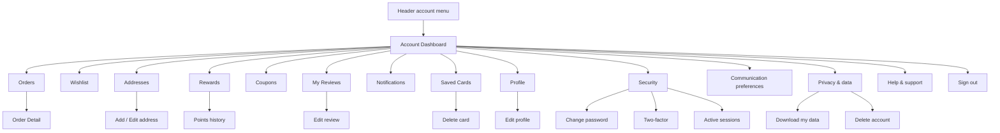
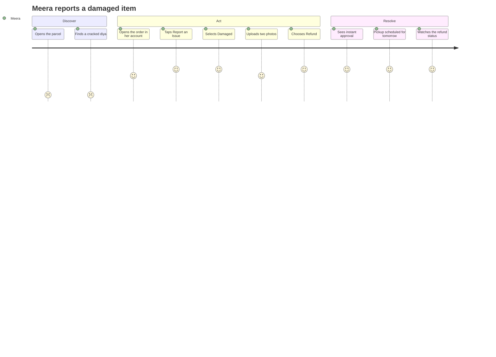
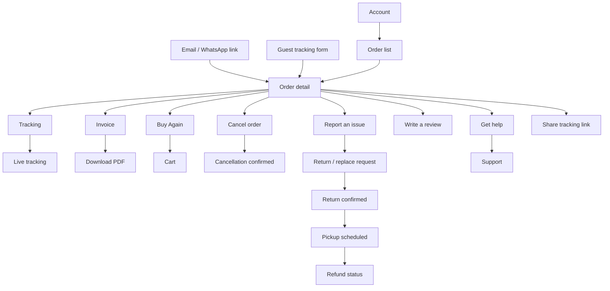
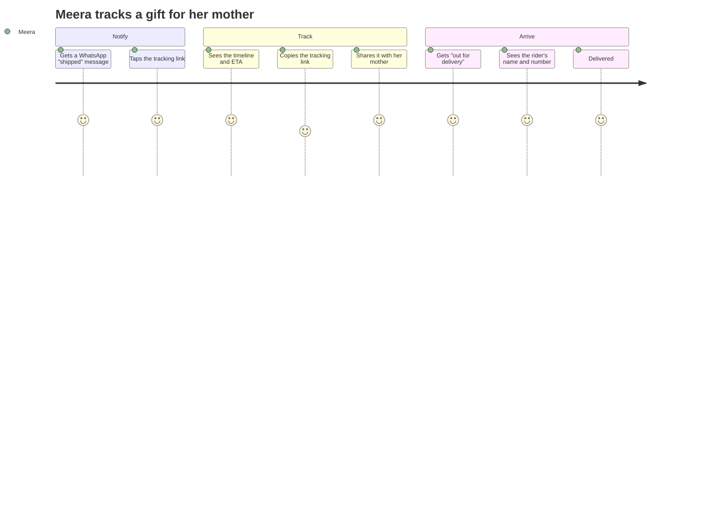
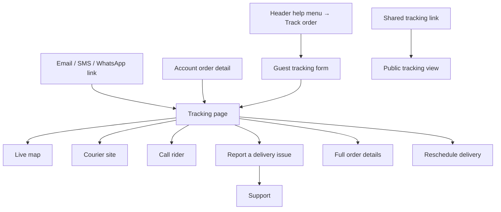

# Modules 10–12 — My Account, Orders & Order Tracking

Enterprise Handicraft E-Commerce Platform · Customer Website UI/UX Specification

---
---

# MODULE 10 · MY ACCOUNT

## 10.1 Business Goal

The account is the retention engine. It converts a one-time buyer into a repeat customer by making the second purchase materially easier than the first, and it deflects support contacts by answering "where is my order?" without a human. Target: repeat purchase rate 22% → 32%; ≥60% of returning shoppers use a saved address; support contacts per order reduced by 35%.

## 10.2 Purpose

Give the shopper a single place to see their orders, manage addresses and payment methods, track rewards and coupons, control communication preferences, manage their profile and security, and exercise their data rights.

## 10.3 Customer Journey


## 10.4 Navigation Flow



## 10.5 Complete Screen List

| ID | Screen / Overlay | Route | Type |
|----|------------------|-------|------|
| PG-10-01 | Account Dashboard | `/account` | Page |
| PG-10-02 | Profile | `/account/profile` | Page |
| PG-10-03 | Addresses | `/account/addresses` | Page |
| PG-10-04 | Orders | `/account/orders` | Page |
| PG-10-05 | Wishlist | `/wishlist` | Page (Module 06) |
| PG-10-06 | My Reviews | `/account/reviews` | Page |
| PG-10-07 | Notifications | `/account/notifications` | Page |
| PG-10-08 | Rewards & Points | `/account/rewards` | Page |
| PG-10-09 | My Coupons | `/account/coupons` | Page |
| PG-10-10 | Saved Cards | `/account/payment-methods` | Page |
| PG-10-11 | Security | `/account/security` | Page |
| PG-10-12 | Communication Preferences | `/account/preferences` | Page |
| PG-10-13 | Privacy & Data | `/account/privacy` | Page |
| PG-10-14 | Referrals | `/account/referrals` | Page |
| MOD-10-01 | Edit profile | — | Modal MD |
| MOD-10-02 | Change email | — | Modal SM |
| MOD-10-03 | Verify new email/mobile | — | Modal SM |
| MOD-10-04 | Add / edit address | — | Modal MD |
| MOD-10-05 | Delete address | — | Modal XS |
| MOD-10-06 | Change password | — | Modal SM |
| MOD-10-07 | Set up two-factor | — | Modal MD |
| MOD-10-08 | Backup codes | — | Modal SM |
| MOD-10-09 | Sign out other sessions | — | Modal SM |
| MOD-10-10 | Delete saved card | — | Modal XS |
| MOD-10-11 | Points terms | — | Modal MD |
| MOD-10-12 | Coupon terms | — | Popover |
| MOD-10-13 | Download my data | — | Modal MD |
| MOD-10-14 | Delete account | — | Modal MD (guarded) |
| MOD-10-15 | Upload avatar | — | Modal SM |
| MOD-10-16 | Referral share | — | Modal MD |
| DRW-10-01 | Notifications drawer | — | Drawer |
| DRW-10-02 | Account menu | — | Drawer/Popover |
| SHT-10-01 | Account menu sheet | — | Sheet |
| SHT-10-02 | Address sheet | — | Sheet |
| SHT-10-03 | Filter orders sheet | — | Sheet |
| SHT-10-04 | Profile edit sheet | — | Sheet |
| SHT-10-05 | Preferences sheet | — | Sheet |
| SHT-10-06 | Points history sheet | — | Sheet |

## 10.6 Information Architecture

```
My Account
├── Dashboard (overview + shortcuts)
├── Orders
│   ├── Order list (filterable)
│   └── Order detail → tracking, invoice, return, review, reorder
├── Wishlist (Module 06)
├── Addresses
├── Payment methods (saved cards, UPI IDs)
├── Rewards
│   ├── Points balance and history
│   └── Referrals
├── Coupons
├── Reviews (written and pending)
├── Notifications (in-app inbox)
├── Profile (name, email, mobile, DOB, gender, avatar)
├── Security (password, 2FA, sessions, login history)
├── Communication preferences (channel × topic matrix)
└── Privacy & data (download, delete account)
```

## 10.7 Screen Hierarchy

```
Account (PG-10-01)
├── Shell + breadcrumb
├── Desktop: sidebar (3) + content (9)
├── Mobile: menu list → drill-down page per section
└── Dashboard content
    ├── Greeting + profile summary
    ├── Stat cards (orders, points, coupons, wishlist)
    ├── Active order tracker
    ├── Recent orders
    ├── Recommended for you
    └── Quick links
```

## 10.8 Desktop Layout

Template `SL-05` (3/9). Sidebar 264 px, sticky, listing every section with icons and counts; the active item has a 3 px left brand bar. Content column fills. Container max 1280.

## 10.9 Tablet Layout

Sidebar collapses to a horizontal scrollable tab strip above the content. Content full width. Stat cards 2-up.

## 10.10 Mobile Layout

The account root is a **menu list** — a full-page list of sections with icons, labels, counts and chevrons, plus a profile header card at the top and a Sign Out row at the bottom. Tapping a section navigates to a dedicated page with a back chevron. This drill-down pattern is faster and more familiar on mobile than a tab strip.

The dashboard content (active order, stats) appears above the menu list on the account root.

## 10.11 Wireframe Description

### Desktop dashboard

```
┌──────────────────────────────────────────────────────────────────────────────────────┐
│ Home / My Account                                                                     │
├──────────────────┬───────────────────────────────────────────────────────────────────┤
│ ┌──────────────┐ │  Hello, Priya 👋                                                  │
│ │ [avatar 56]  │ │  Member since March 2024                                          │
│ │ Priya Sharma │ │                                                                   │
│ │ Gold member  │ │  ┌──────────┬──────────┬──────────┬──────────┐                    │
│ └──────────────┘ │  │ ORDERS   │ POINTS   │ COUPONS  │ WISHLIST │                    │
│                  │  │   12     │  2,480   │    3     │    8     │                    │
│ ▸ Dashboard      │  │ 1 active │ ₹248 off │available │  saved   │                    │
│ ▸ My Orders   12 │  └──────────┴──────────┴──────────┴──────────┘                    │
│ ▸ Wishlist     8 │                                                                   │
│ ▸ Addresses    3 │  ┌─ Track your order ──────────────────────────────────────────┐  │
│ ▸ Rewards        │  │ #HC-2026-000482 · 3 items · ₹4,250                           │  │
│ ▸ Coupons      3 │  │ ●───────●───────●───────◉───────○                            │  │
│ ▸ My Reviews   4 │  │ Placed  Packed  Shipped  Out for   Delivered                 │  │
│ ▸ Notifications 2│  │                          delivery                            │  │
│ ▸ Saved Cards  2 │  │ 🚚 Arriving today · Rider Suresh · [Track] [Call]            │  │
│ ▸ Profile        │  └─────────────────────────────────────────────────────────────┘  │
│ ▸ Security       │                                                                   │
│ ▸ Preferences    │  Recent orders                                    View all →      │
│ ▸ Privacy & Data │  ┌─────────────────────────────────────────────────────────────┐  │
│ ▸ Help           │  │ #HC-2026-000441 · 12 Jun · ₹1,890 · [● Delivered]           │  │
│ ─────────────    │  │ [img][img]  [Buy Again] [Write a Review] [Invoice]           │  │
│ ▸ Sign Out       │  └─────────────────────────────────────────────────────────────┘  │
│                  │  ┌─────────────────────────────────────────────────────────────┐  │
│                  │  │ #HC-2026-000388 · 02 Jun · ₹8,900 · [● Delivered]           │  │
│                  │  └─────────────────────────────────────────────────────────────┘  │
│                  │                                                                   │
│                  │  ┌─ Your points ───────────────────────────────────────────────┐  │
│                  │  │ 💎 2,480 points · worth ₹248 off your next order             │  │
│                  │  │ 420 points expire on 31 Dec 2026                             │  │
│                  │  │ ████████░░ 2,480 / 3,000 to Platinum                         │  │
│                  │  │ [How to earn] [Use my points]                                │  │
│                  │  └─────────────────────────────────────────────────────────────┘  │
│                  │                                                                   │
│                  │  Recommended for you                                        ‹  ›  │
│                  │  [product rail]                                                   │
└──────────────────┴───────────────────────────────────────────────────────────────────┘
```

### Mobile account root

```
┌──────────────────────────────────┐
│ ‹  My Account                    │
├──────────────────────────────────┤
│ ┌──────────────────────────────┐ │
│ │ [avatar] Priya Sharma        │ │
│ │          Gold member  ›      │ │
│ │ 💎 2,480 points · ₹248 off   │ │
│ └──────────────────────────────┘ │
├──────────────────────────────────┤
│ ┌──────────────────────────────┐ │
│ │ 🚚 Arriving today            │ │
│ │ #HC-2026-000482 · 3 items    │ │
│ │ ●──●──●──◉──○                │ │
│ │ [      Track Order       ]   │ │
│ └──────────────────────────────┘ │
├──────────────────────────────────┤
│ 📦 My Orders                12 › │
│ ♡  Wishlist                  8 › │
│ 📍 Addresses                 3 › │
│ 💎 Rewards & Points            › │
│ 🎟 My Coupons                3 › │
│ ⭐ My Reviews                4 › │
│ 🔔 Notifications             2 › │
│ 💳 Saved Cards               2 › │
│ 👤 Profile                     › │
│ 🔒 Security                    › │
│ ✉  Communication Preferences   › │
│ 🛡 Privacy & Data              › │
│ 💬 Help & Support              › │
├──────────────────────────────────┤
│ 🚪 Sign Out                      │
├──────────────────────────────────┤
│ 🏠   🛍   🔍   ♡   👤            │
└──────────────────────────────────┘
```

### Addresses page

```
┌──────────────────────────────────────────────────────────────────┐
│ Addresses (3)                                    [ + Add Address ]│
├──────────────────────────────────────────────────────────────────┤
│ ┌────────────────────────────────┐ ┌────────────────────────────┐│
│ │ 🏠 Home            [DEFAULT]   │ │ 🏢 Work                    ││
│ │ Priya Sharma                   │ │ Priya Sharma               ││
│ │ 402, Rosewood Apartments       │ │ Karigar Tech Park, Tower B ││
│ │ 12th Main, Indiranagar         │ │ Whitefield                 ││
│ │ Bengaluru, KA 560038           │ │ Bengaluru, KA 560066       ││
│ │ +91 98765 43210                │ │ +91 98765 43210            ││
│ │ [Edit] [Delete]                │ │ [Edit] [Delete] [Set default]││
│ └────────────────────────────────┘ └────────────────────────────┘│
│ ┌────────────────────────────────┐                               │
│ │ 📍 Mum's house                 │                               │
│ │ ⚠ We don't deliver here yet    │                               │
│ │ [Edit] [Delete]                │                               │
│ └────────────────────────────────┘                               │
└──────────────────────────────────────────────────────────────────┘
```

## 10.12 Header

Standard site header. The account menu shows the avatar, first name, points chip and quick links. On the account pages the header remains fully functional — shoppers frequently move from account back to shopping.

## 10.13 Mega Menu / Navigation

Standard. Account navigation is the sidebar (desktop) or the drill-down menu (mobile).

## 10.14 Footer

Full footer.

## 10.15 Breadcrumb

```
Home / My Account
Home / My Account / My Orders
Home / My Account / My Orders / #HC-2026-000482
Home / My Account / Addresses
```

## 10.16 Search

Order search on the Orders page (order number, product name). Notification search above 50 items. No global account search.

## 10.17 Filters

Orders: status, date range, amount. Reviews: published, pending, drafts. Notifications: type, read state. Points history: earned, redeemed, expired.

## 10.18 Sorting

Orders: date desc (default), amount, status. Reviews: date desc. Points history: date desc. Addresses: default first, then most recently used.

## 10.19 Cards

| Card | Usage |
|------|-------|
| Profile summary card | Sidebar and mobile header |
| Stat card | Dashboard 4-up |
| Active order tracker | Dashboard prominent card |
| Order card | Recent orders and the order list |
| Points card | Balance, expiry, tier progress |
| Address card | Addresses page and checkout |
| Saved card item | Payment methods |
| Coupon card | Coupons page |
| Review card | My Reviews |
| Notification item | Notifications |

## 10.20 Widgets

| Widget | Spec |
|--------|------|
| Greeting | Time-aware, first name, member-since line |
| Stat cards | Orders (with active count), Points (with rupee value), Coupons (available), Wishlist (saved) — each is a link |
| Active order tracker | Only when an order is in flight; shows the timeline, ETA and a Track action; the single most valuable element on the dashboard |
| Points card | Balance, rupee equivalent, expiring-soon warning with a date, tier progress bar, earn and redeem actions |
| Tier badge | Bronze/Silver/Gold/Platinum with benefits on tap |
| Referral card | Code, share actions, earned-so-far figure |
| Recommendations rail | Based on purchase history |
| Communication matrix | Channel × topic grid of toggles |
| Session list | Device, location, last active, current-session badge, sign-out action |
| Data export | Request, status, download link with expiry |

## 10.21 Forms & Fields

### Profile

| Field | Type | Required | Notes |
|-------|------|----------|-------|
| Avatar | Image upload | No | Circular crop, ≤2 MB |
| Full name | Text | Yes | 2–60 |
| Email | Email | Yes | Change requires verification of the new address |
| Mobile | Phone | Yes | Change requires OTP verification |
| Date of birth | Date | No | "So we can send you a birthday treat" |
| Gender | Select | No | Female / Male / Other / Prefer not to say |
| Language | Select | No | — |
| Currency | Select | No | — |

### Address

Same field set as checkout (`13-Modules… §8.21`), plus a nickname field ("Home", "Mum's house") and a set-as-default checkbox.

### Security

| Field | Type | Notes |
|-------|------|-------|
| Current password | Password | Required to change password |
| New password | Password | Strength meter + checklist |
| Confirm password | Password | Match |
| Two-factor | Toggle + setup flow | TOTP QR + 10 backup codes (downloadable) |
| Sign out other sessions | Action | Confirmation |

### Communication Preferences

A matrix of topics × channels:

| Topic | Email | SMS | WhatsApp | Push |
|-------|:-----:|:---:|:--------:|:----:|
| Order updates | locked on | ☑ | ☑ | ☑ |
| Delivery alerts | locked on | ☑ | ☑ | ☑ |
| Price drops on saved items | ☑ | ☐ | ☑ | ☑ |
| Back in stock | ☑ | ☐ | ☑ | ☑ |
| New arrivals & collections | ☑ | ☐ | ☐ | ☐ |
| Offers & sales | ☑ | ☐ | ☑ | ☐ |
| Craft stories & blog | ☑ | ☐ | ☐ | ☐ |
| Review requests | ☑ | ☐ | ☑ | ☐ |
| Rewards & points | ☑ | ☐ | ☐ | ☑ |

Transactional rows are locked on with an explanation ("We need to send these to fulfil your order"). A single "Unsubscribe from all marketing" action sits beneath the matrix.

### Privacy & Data

Download my data (request, status, download), Delete my account (guarded), consent history (what was agreed and when), and cookie preferences (re-opens the consent manager).

## 10.22 Validation Rules

| Field | Rule | Message |
|-------|------|---------|
| Full name | Required, 2–60 | "Enter your name" |
| Email | Valid, unique | "This email is already registered to another account" |
| Email change | Verification required | "We've sent a link to {new email}. Your email will change once you confirm." |
| Mobile | Valid, unique | "This number is already registered" |
| Mobile change | OTP required | "Enter the code we sent to {number}" |
| Date of birth | Age ≥13 | "You must be at least 13 to use Karigar" |
| Avatar | ≤2 MB, JPG/PNG/WEBP | "Image is too large. Maximum 2 MB." |
| Address | Per checkout rules | — |
| Address | Maximum 10 | "You can save up to 10 addresses" |
| Address delete | Used by an active order | "This address is used by an order in progress. You can delete it after delivery." |
| Address delete | Is default | "Choose another default address first" |
| Current password | Required, correct | "Your current password isn't right" |
| New password | Policy | "Use at least 8 characters with a letter and a number" |
| New password | Not same as current | "Choose a password you haven't used before" |
| Confirm password | Match | "Passwords don't match" |
| Saved cards | Maximum 5 | "You can save up to 5 cards" |
| Card delete | Used by a subscription | "This card is used for a recurring order" |
| Delete account | Active orders exist | "You have 1 order in progress. You can delete your account after it's delivered." |
| Delete account | Typed confirmation | "Type DELETE to confirm" |
| Data export | Rate limit | "You can request your data once every 30 days" |

## 10.23 Action Buttons

| Button | Type | Placement |
|--------|------|-----------|
| Edit profile | Outline MD | Profile |
| Save changes | Primary MD | Any form |
| Add address | Primary MD | Addresses header |
| Edit / Delete / Set default | Link / Ghost | Address card |
| Change password | Outline MD | Security |
| Set up two-factor | Primary MD | Security |
| Sign out other sessions | Danger outline MD | Security |
| Add card | Outline MD | Payment methods |
| Delete card | Ghost danger | Card row |
| Use my points | Primary MD | Points card |
| How to earn | Link | Points card |
| Share referral | Primary MD | Referrals |
| Buy Again | Outline MD | Order card |
| Track Order | Primary MD | Active order tracker |
| Download my data | Outline MD | Privacy |
| Delete my account | Danger outline MD | Privacy (bottom, deliberately not prominent) |
| Unsubscribe from all marketing | Ghost | Preferences |
| Sign Out | Danger ghost | Sidebar / mobile list |

## 10.24 Icons

`user-round` profile · `package` orders · `heart` wishlist · `map-pinned` addresses · `gem` rewards · `ticket-percent` coupons · `star` reviews · `bell` notifications · `credit-card` cards · `shield-check` security · `mail` preferences · `lock` privacy · `message-circle` help · `log-out` sign out · `home`/`building-2`/`map-pin` address types · `crown` tier · `gift` referral · `download` export · `trash-2` delete.

## 10.25 Typography & Spacing

| Element | Style |
|---------|-------|
| Greeting | `heading-xl` (Fraunces) |
| Section title | `heading-lg` |
| Card title | `heading-xs` |
| Stat value | `price-xl` tabular |
| Stat label | `overline` |
| Sidebar item | `body-md` |
| Body | `body-md` |
| Meta | `body-sm`, `text-secondary` |
| Sidebar width | 264 |
| Card padding | 24 / 20 |
| Section gap | 32 / 24 |

## 10.26 Images / Video / Carousels

Avatar 80/56/40 px. Order card thumbnails 56×56 (max 3 shown plus "+N"). Recommendation rail uses standard card images. Tier badge is an SVG illustration. No video.

## 10.27 Pagination

Orders 10 per page with Load More. Points history 20 per page. Notifications 25 with infinite scroll. Reviews 10. Addresses and cards show all (capped at 10 and 5).

## 10.28 Empty State

| Section | Heading | Body | CTA |
|---------|---------|------|-----|
| Orders | No orders yet | When you place an order, you'll be able to track it here. | Start Shopping |
| Wishlist | Your wishlist is empty | Tap the heart on any piece to save it. | Explore Products |
| Addresses | No saved addresses | Add an address to check out faster next time. | Add Address |
| Cards | No saved cards | Save a card during checkout to pay faster. | — |
| Coupons | No coupons right now | We'll show your offers here when you have some. | Shop Now |
| Points | Start earning points | Earn points on every order and use them for discounts. | How It Works |
| Reviews | You haven't reviewed anything yet | Reviews from your delivered orders appear here. | View Orders |
| Notifications | You're all caught up | Order updates and offers will appear here. | — |
| Referrals | Invite a friend | Give ₹200, get ₹200 when they place their first order. | Share My Code |

## 10.29 Loading State & Skeleton

Dashboard: greeting renders immediately; stat cards, active order tracker and recent orders each show their own skeleton. Sidebar renders immediately (static). Section pages show list skeletons. Forms show field skeletons only on first load; subsequent visits render from cache.

## 10.30 Success State

| Event | Treatment |
|-------|-----------|
| Profile saved | Toast "Profile updated"; changed field briefly highlights |
| Email changed | "Check {new email} to confirm" + a pending chip beside the email until verified |
| Mobile verified | Green verified chip appears |
| Address saved | Card animates into the list; toast |
| Password changed | Toast + "You'll stay signed in on this device" |
| Two-factor enabled | Success state with backup codes and a download action |
| Card deleted | Row collapses; toast with Undo (30 s) |
| Preferences saved | Inline "Saved" indicator per row; no page-level toast (too noisy for a matrix) |
| Data export ready | Notification + a download button with an expiry date |

## 10.31 Error State

| Error | Treatment |
|-------|-----------|
| Section fails to load | Per-section error with Retry; the sidebar and other sections remain usable |
| Save fails | Inline error; entered values preserved; Retry |
| Email/mobile already in use | Field-level error with a sign-in link |
| Verification link expired | "This link has expired. [Send a new one]" |
| Address not serviceable | Card shows a warning chip; it can still be saved but is disabled at checkout with an explanation |
| Card tokenisation fails | "We couldn't save that card. You can still use it at checkout." |
| Data export fails | "We couldn't prepare your data. [Try again] or contact support." |
| Account deletion blocked | Clear explanation of what blocks it and when it becomes possible |
| Session expired | Redirect to sign-in with a return path back to the same account page |

## 10.32 Confirmation Dialogs

| Dialog | Content |
|--------|---------|
| Delete address | "Delete this address? You can add it again later." · Cancel / Delete Address |
| Delete card | "Remove card ending 4821?" · Cancel / Remove Card |
| Sign out other sessions | "Sign out of {n} other devices? You'll stay signed in here." · Cancel / Sign Out Others |
| Sign out | "Sign out? You'll need to sign in again to see your orders." · Cancel / Sign Out |
| Unsubscribe all | "Turn off all marketing messages? You'll still get order and delivery updates." · Cancel / Turn Off |
| Delete account | Guarded: what will be deleted, what is retained for legal reasons (order and tax records), that it cannot be undone; requires typing DELETE and re-entering the password |
| Discard profile changes | "Discard your changes?" · Keep Editing / Discard |

## 10.33 Notifications

| Trigger | Type | Message |
|---------|------|---------|
| Profile updated | Success toast | "Profile updated" |
| Address saved / deleted | Success toast | "Address saved" / "Address deleted" + Undo |
| Password changed | Success toast + email | "Password updated" |
| 2FA enabled | Success toast + email | "Two-factor authentication is on" |
| New sign-in | Email + in-app | "New sign-in from {device} in {city}" |
| Points earned | In-app + email | "You earned 425 points from order #…" |
| Points expiring | Email + in-app | "420 points expire on 31 Dec" |
| Tier upgrade | In-app + email | "You're now a Gold member" |
| New coupon | In-app + email | "A new coupon is waiting for you" |
| Data export ready | Email + in-app | "Your data is ready to download" |

## 10.34 Micro-interactions & Animation

Stat card values count up on first load · The active order tracker's current node pulses gently · Points balance rolls when it changes · Tier progress bar fills on load · Address card set-as-default animates the badge into place · Sidebar active indicator slides between items · Preference toggles show an inline "Saved" chip that fades after 2 s · Avatar upload shows a circular crop preview updating live · Backup codes reveal with a subtle stagger · Deleting a card collapses the row.

## 10.35 Accessibility

- The account sidebar is a navigation landmark with the current page marked.
- Mobile drill-down pages have a back control and announce the section on entry.
- Stat cards are links with composed accessible names ("12 orders, 1 active, view orders").
- The active order tracker is an ordered list with each step's state and timestamp.
- The preferences matrix is a proper table with row and column headers, so each toggle announces "Order updates, WhatsApp, on".
- Locked transactional toggles announce why they cannot be changed.
- Password strength is described in text.
- Backup codes are selectable text with a copy action, not an image.
- Destructive actions require confirmation and announce their consequences before the confirm button is reachable.
- The data-export download link states the file type and size.

## 10.36 Responsive Behaviour

| Element | Desktop | Tablet | Mobile |
|---------|---------|--------|--------|
| Navigation | Sidebar 264 sticky | Horizontal tab strip | Drill-down menu list |
| Stat cards | 4-up | 2-up | 2-up compact |
| Active order | Full card | Full card | Compact card with Track CTA |
| Order cards | Full detail | Full detail | Condensed |
| Addresses | 2-up grid | 2-up | Single column |
| Forms | Modal | Modal | Full-page or sheet |
| Preferences matrix | Full table | Scrollable table | Grouped by topic, channels as toggles beneath |

## 10.37 Prototype Flow (SP-06)

Account dashboard → active order tracker → Track Order → back → Orders → order detail → Buy Again → cart → back → Addresses → add address → PIN autofill → save → Preferences → toggle WhatsApp off → Security → change password → success.

## 10.38 Figma Components & Variants

**Required:** `CMP-ACC-Sidebar`, `CMP-ACC-ProfileCard`, `CMP-ACC-PointsCard`, `CMP-ACC-NotificationItem`, `CMP-ORD-Card`, `CMP-ORD-Timeline`, `CMP-CHK-AddressCard`, `CMP-CHK-SavedCard`, `CMP-CRT-CouponCard`, `CMP-REV-Card`, `CMP-INP-*`, `CMP-OVL-Modal`, `CMP-OVL-BottomSheet`, `CMP-FBK-EmptyState`.

**New to build:**

| Component | Variants |
|-----------|----------|
| `CMP-ACC-StatCard` | Type (Orders/Points/Coupons/Wishlist) × State (Default/Hover/Empty/Loading) |
| `CMP-ACC-ActiveOrderCard` | Status (5 in-flight states) × Breakpoint |
| `CMP-ACC-MenuRow` | Icon × Count (Y/N) × Type (Navigation/Destructive) |
| `CMP-ACC-TierBadge` | Tier (Bronze/Silver/Gold/Platinum) × Size (SM/MD) |
| `CMP-ACC-PreferenceRow` | Channels (2/3/4) × Locked (Y/N) × State (Saving/Saved) |
| `CMP-ACC-SessionRow` | Device (Desktop/Mobile/Tablet) × Current (Y/N) |
| `CMP-ACC-ReferralCard` | State (No referrals/Has referrals) |
| `CMP-ACC-DataExportCard` | State (None/Requested/Processing/Ready/Expired) |

## 10.39 Auto Layout Structure

```
Frame: Account Dashboard — Desktop 1440 (V, Fill × Hug, gap 24, padding 24 40)
├── Instance: Breadcrumb
└── Frame: Body (H, Fill × Hug, gap 32, align top)
    ├── Instance: ACC-Sidebar (264 fixed × Hug)   [Sticky]
    └── Frame: Content (Fill, V, gap 32)
        ├── Frame: Greeting (V, gap 4)
        ├── Frame: Stats (H, Fill × 120, gap 16)
        │   └── 4 × Instance: ACC-StatCard (Fill)
        ├── Instance: ACC-ActiveOrderCard (Fill × Hug)  [conditional]
        ├── Frame: Recent Orders (V, Fill × Hug, gap 16)
        ├── Instance: ACC-PointsCard (Fill × Hug)
        └── Instance: PRD-Rail / Recommended
```

## 10.40 UX Guidelines · Developer Notes · Analytics · Scalability

### UX Guidelines

| ID | Guideline |
|----|-----------|
| AC-01 | The dashboard answers "where is my order?" first — the active order tracker is the top content element |
| AC-02 | Every section is reachable in one tap from the account root |
| AC-03 | Buy Again is present on every delivered order |
| AC-04 | Transactional communications cannot be switched off, and the UI explains why |
| AC-05 | Marketing consent can be withdrawn in one action |
| AC-06 | Destructive actions (delete account, delete card, sign out others) are guarded and explain their consequences |
| AC-07 | Data export and account deletion are genuinely available, not buried |
| AC-08 | Saved addresses that are no longer serviceable are flagged before checkout, not during |
| AC-09 | Points expiry is surfaced with a date, well before it happens |
| AC-10 | Mobile uses drill-down navigation, not cramped tabs |

### Developer Notes

1. Email and mobile changes are two-step: the new value is pending until verified, and both old and new are shown during the transition.
2. Address serviceability is re-checked on load, not only at save, since coverage changes.
3. Saved cards are network tokens; deletion revokes the token.
4. Preference changes save immediately per row (no page-level Save) with an inline confirmation.
5. Data export runs as a background job producing a signed, expiring download link.
6. Account deletion is a soft delete with a 30-day grace period; the shopper can restore by signing in, and this is stated in the confirmation.
7. Order and tax records are retained for the statutory period even after deletion; this is disclosed explicitly.
8. Session list uses device fingerprint plus geo-IP; the current session is always identifiable and cannot be signed out from the list.

### Analytics Events

`account_view` (section) · `profile_update` (fields) · `address_add` / `address_edit` / `address_delete` · `card_add` / `card_delete` · `preference_change` (topic, channel, value) · `points_view` · `referral_share` (channel) · `buy_again_click` · `track_order_click` · `data_export_request` · `account_delete_request` · `signout` · `signout_all_sessions`.

### Future Scalability

Loyalty tier benefits page with unlockable perks · saved payment UPI IDs alongside cards · family/shared accounts for gifting · order-based product care reminders · personalised craft recommendations by purchase history · subscription management · address book with map-pin selection · in-account returns portal (see Module 11) · digital purchase certificates for collectible pieces.

---
---

# MODULE 11 · ORDERS

## 11.1 Business Goal

Order self-service deflects the most common support contacts and builds the confidence needed for repeat purchase. Returns handled well convert a bad experience into loyalty. Target: ≥70% of order enquiries self-served; return request completion ≤2 min; reorder ≥8% of repeat purchases.

## 11.2 Purpose

Let shoppers see everything about every order they have placed — items, status, payments, invoices, delivery — and act on it: track, reorder, cancel, return, review, download an invoice, or get help.

## 11.3 Customer Journey



## 11.4 Navigation Flow



## 11.5 Complete Screen List

| ID | Screen / Overlay | Route | Type |
|----|------------------|-------|------|
| PG-11-01 | Order List | `/account/orders` | Page |
| PG-11-02 | Order Detail | `/account/orders/{orderNumber}` | Page |
| PG-11-03 | Invoice preview | `/account/orders/{n}/invoice` | Page |
| PG-11-04 | Return / Replace request | `/account/orders/{n}/return` | Page (3-step) |
| PG-11-05 | Return detail & status | `/account/returns/{rmaNumber}` | Page |
| PG-11-06 | Cancellation | `/account/orders/{n}/cancel` | Page or modal |
| MOD-11-01 | Cancel order | — | Modal MD |
| MOD-11-02 | Cancellation reason | — | Modal MD |
| MOD-11-03 | Report an issue | — | Modal MD |
| MOD-11-04 | Return item selection | — | Modal LG |
| MOD-11-05 | Return reason & photos | — | Modal LG |
| MOD-11-06 | Return resolution choice | — | Modal MD |
| MOD-11-07 | Pickup slot selection | — | Modal MD |
| MOD-11-08 | Refund status detail | — | Modal MD |
| MOD-11-09 | Download invoice | — | Modal SM |
| MOD-11-10 | Reorder — unavailable items | — | Modal MD |
| MOD-11-11 | Share order tracking | — | Modal SM |
| MOD-11-12 | Order help | — | Modal MD |
| SHT-11-01 | Order filters | — | Sheet |
| SHT-11-02 | Order actions | — | Sheet |
| SHT-11-03 | Return flow sheets | — | Sheet |
| SHT-11-04 | Invoice options | — | Sheet |

## 11.6 Information Architecture

```
Orders
├── Order list
│   ├── Filters (status, date, amount)
│   ├── Search (order number, product)
│   └── Order cards with contextual actions
└── Order detail
    ├── Status header + timeline
    ├── Delivery info (address, method, courier, AWB, ETA)
    ├── Items (with per-item actions)
    ├── Payment summary (method, breakdown, invoice)
    ├── Gift details (if any)
    ├── Actions (track, reorder, cancel, return, review, help)
    └── Related: returns, refunds, replacement orders
```

## 11.7 Screen Hierarchy

```
Order List (PG-11-01)
├── Filters + search
├── Order cards
└── Load More

Order Detail (PG-11-02)
├── Header (order number, date, status chip, actions)
├── Timeline
├── Delivery card
├── Item list
├── Payment card + invoice
├── Gift card [conditional]
├── Return/refund status [conditional]
└── Help card
```

## 11.8 Desktop Layout

Order list: full-width within the account content column, cards stacked. Order detail: two columns — items and timeline (8), delivery/payment/actions summary (4, sticky).

## 11.9 Tablet Layout

Single column for order detail; the summary card moves above the item list so key facts stay high.

## 11.10 Mobile Layout

Order cards full-width. Order detail fully stacked with the status and ETA pinned at the top, then timeline, delivery, items, payment. Primary action (usually Track) is a sticky bottom button while the order is in flight.

## 11.11 Wireframe Description

### Order list

```
┌──────────────────────────────────────────────────────────────────┐
│ My Orders (12)                          [⌕ Search] [Filters ▾]   │
├──────────────────────────────────────────────────────────────────┤
│ [All] [In progress 1] [Delivered 9] [Cancelled 1] [Returns 1]    │
├──────────────────────────────────────────────────────────────────┤
│ ┌──────────────────────────────────────────────────────────────┐ │
│ │ #HC-2026-000482 · Placed 03 Aug        [● Out for delivery]  │ │
│ │ ┌────┐┌────┐┌────┐  3 items                          ₹4,250  │ │
│ │ │img ││img ││img │  Blue Pottery Vase + 2 more                │ │
│ │ └────┘└────┘└────┘                                            │ │
│ │ 🚚 Arriving today · Rider Suresh K.                           │ │
│ │ [ Track Order ]  [ View Details ]                        [⋮] │ │
│ └──────────────────────────────────────────────────────────────┘ │
│ ┌──────────────────────────────────────────────────────────────┐ │
│ │ #HC-2026-000441 · Placed 12 Jun            [● Delivered]     │ │
│ │ ┌────┐┌────┐  2 items                              ₹1,890    │ │
│ │ └────┘└────┘  Delivered on 15 Jun                             │ │
│ │ ⏳ Return window closes in 2 days                              │ │
│ │ [ Buy Again ] [ Write a Review ] [ Return ]              [⋮] │ │
│ └──────────────────────────────────────────────────────────────┘ │
│ ┌──────────────────────────────────────────────────────────────┐ │
│ │ #HC-2026-000388 · Placed 02 Jun            [● Refunded]      │ │
│ │ Refund of ₹1,250 credited on 20 Jun                           │ │
│ └──────────────────────────────────────────────────────────────┘ │
│                        [ Load More ]                              │
└──────────────────────────────────────────────────────────────────┘
```

### Order detail

```
┌──────────────────────────────────────────────────────────────────────────────────────┐
│ ‹ Back to orders                                                                      │
│ Order #HC-2026-000482                          [● Out for delivery]   [Share] [Help] │
│ Placed on 03 Aug 2026, 10:24 AM                                                       │
├────────────────────────────────────────────────────┬─────────────────────────────────┤
│ ●───────●───────●───────◉───────○                  │ ┌─ Delivery ──────────────────┐ │
│ Placed  Packed  Shipped  Out for  Delivered        │ │ 🚚 Arriving today            │ │
│ 03 Aug  03 Aug  03 Aug   04 Aug   Expected today   │ │ Bluedart Express             │ │
│ 10:24   17:30   22:15    08:12                     │ │ AWB BD1234567890      [copy] │ │
│                                                     │ │ Rider: Suresh K.             │ │
│ 🚚 Out for delivery since 8:12 AM                   │ │ [ Track Live ] [ Call ]      │ │
│    Rider Suresh K. · +91 98765 00000                │ ├──────────────────────────────┤ │
├────────────────────────────────────────────────────┤ │ Deliver to                   │ │
│ Items (3)                                          │ │ Meera Nair                   │ │
│ ┌────────────────────────────────────────────────┐ │ │ 402, Rosewood Apartments     │ │
│ │┌──────┐ Blue Pottery Vase — Jaipur    ₹1,250   │ │ │ Indiranagar, Bengaluru       │ │
│ ││ img  │ Size: Medium · Colour: Indigo          │ │ │ KA 560038                    │ │
│ ││  96  │ 🤲 Ram Prasad Sharma                   │ │ │ +91 98765 12345              │ │
│ │└──────┘ Qty 1                                  │ │ ├──────────────────────────────┤ │
│ │         [Buy Again] [Return] [Review]          │ │ │ Payment                      │ │
│ └────────────────────────────────────────────────┘ │ │ UPI · ananya@okhdfcbank      │ │
│ ┌────────────────────────────────────────────────┐ │ │ Paid 03 Aug, 10:25 AM        │ │
│ │┌──────┐ Brass Diya Set of 5           ₹900    │ │ │ Subtotal        ₹3,930       │ │
│ │└──────┘ Qty 2                                  │ │ │ Discount        −₹393        │ │
│ └────────────────────────────────────────────────┘ │ │ Gift wrap          ₹99       │ │
│ ┌─ 🎁 Gift ──────────────────────────────────────┐ │ │ Delivery          FREE       │ │
│ │ Traditional wrap · Prices hidden               │ │ │ Taxes             ₹455       │ │
│ │ "Happy Diwali, Amma! — Meera"                  │ │ │ ──────────────────────       │ │
│ └────────────────────────────────────────────────┘ │ │ Total          ₹4,091        │ │
│ ┌─ 🤲 A note about handmade pieces ──────────────┐ │ │ [ Download Invoice ]         │ │
│ │ Each piece varies slightly. [What to expect]   │ │ ├──────────────────────────────┤ │
│ └────────────────────────────────────────────────┘ │ │ [ Buy Again ]                │ │
│                                                     │ │ [ Report an Issue ]          │ │
│                                                     │ │ [ Cancel Order ]             │ │
│                                                     │ └──────────────────────────────┘ │
└────────────────────────────────────────────────────┴─────────────────────────────────┘
```

### Return request — 3 steps

```
Step 1 · What would you like to return?
┌──────────────────────────────────────────────────┐
│ ☑ [img] Blue Pottery Vase        Qty [1 ▾] of 1  │
│ ☐ [img] Brass Diya Set of 5      Qty [_ ▾] of 2  │
│                                    [ Continue ]  │
└──────────────────────────────────────────────────┘

Step 2 · Why are you returning it?
┌──────────────────────────────────────────────────┐
│ ⦿ Damaged or broken                              │
│ ○ Not as described                               │
│ ○ Wrong item received                            │
│ ○ Quality not as expected                        │
│ ○ Size or fit issue                              │
│ ○ Changed my mind                                │
│ ○ Arrived late                                   │
│                                                  │
│ Tell us more (optional)                          │
│ [ The rim was cracked when it arrived         ]  │
│                                                  │
│ Photos (required for damage)          2 of 6     │
│ [img][img][ + ]                                  │
│                              [Back] [ Continue ] │
└──────────────────────────────────────────────────┘

Step 3 · How should we make it right?
┌──────────────────────────────────────────────────┐
│ ⦿ Refund ₹1,250 to your UPI                      │
│   Credited in 5–7 business days after we receive │
│   and check the item                             │
│ ○ Replace with the same item                     │
│   Ships within 2 days of pickup                  │
│ ○ Store credit ₹1,350 (₹100 extra)               │
│   Credited immediately after pickup              │
│                                                  │
│ Pickup from                                      │
│ 402, Rosewood Apartments…            [Change]    │
│ Preferred date  [ Tomorrow, 5 Aug            ▾]  │
│                                                  │
│ ✓ Free pickup · no return shipping charge        │
│                        [Back] [ Confirm Return ] │
└──────────────────────────────────────────────────┘
```

## 11.12 Header

Standard site header for signed-in shoppers. Guest order tracking (`/track/{orderNumber}`) uses a simplified header.

## 11.13 Mega Menu / Navigation

Standard. Order detail includes a "Back to orders" link that preserves list filters.

## 11.14 Footer

Full footer.

## 11.15 Breadcrumb

```
Home / My Account / My Orders
Home / My Account / My Orders / #HC-2026-000482
Home / My Account / My Orders / #HC-2026-000482 / Return
```

## 11.16 Search

Order search matches order number (partial), product name and courier AWB.

## 11.17 Filters

Status tabs (All / In progress / Delivered / Cancelled / Returns), date range (Last 30 days / 3 months / 6 months / This year / Custom), amount range, and "Has an open issue".

## 11.18 Sorting

Date placed descending (default); amount high/low available in the filter sheet.

## 11.19 Cards

Order card, order item row, delivery card, payment card, gift card, timeline, return status card, refund status card, help card.

## 11.20 Widgets

| Widget | Spec |
|--------|------|
| Status timeline | Horizontal (desktop) / vertical (mobile); exception states replace the rail with an explanatory banner |
| Return window indicator | "Return window closes in 2 days" — appears from delivery until expiry |
| Courier block | Courier name, AWB with copy, rider name and phone when out for delivery, live-track link |
| Invoice | Preview and download; GST invoice where applicable |
| Per-item actions | Buy Again, Return, Review — scoped to the item, not the whole order |
| Refund tracker | Stepped status with the expected credit date and method |
| Reorder | Adds all available items to the cart and reports what could not be added |
| Share tracking | Generates a public tracking link (no personal data beyond the recipient name and city) |
| Help card | Context-aware: "Problem with this order?" with the top three relevant help topics |

## 11.21 Forms & Fields

| Form | Field | Type | Required | Notes |
|------|-------|------|----------|-------|
| Cancel | Reason | Radio | Yes | Ordered by mistake, Found it cheaper, Delivery too slow, Changed my mind, Other |
| Cancel | Detail | Textarea | If Other | ≤250 |
| Return | Items | Checkbox + qty | Yes | Bounded by delivered quantity minus already returned |
| Return | Reason | Radio | Yes | Per item |
| Return | Comment | Textarea | No | ≤500 |
| Return | Photos | Photo upload | Required for damage/defect/wrong item | 1–6, ≤5 MB each |
| Return | Resolution | Radio cards | Yes | Refund / Replace / Store credit |
| Return | Pickup address | Address select | Yes | Defaults to the delivery address |
| Return | Pickup date | Date select | Yes | Available slots only |
| Report issue | Issue type | Radio | Yes | Damaged, Missing item, Wrong item, Late, Other |
| Invoice | Format | Radio | No | PDF (default) / Email to me |

## 11.22 Validation Rules

| Rule | Message |
|------|---------|
| Cancel window | "This order has already shipped and can't be cancelled. You can return it after delivery." |
| Cancel reason | "Please tell us why you're cancelling" |
| Return window | "The 7-day return window for this order closed on 22 Jun. [Contact us] if something's wrong." |
| Return eligibility | "This item can't be returned" + the reason (personalised/made-to-order/hygiene) |
| Return quantity | "You can return up to 2 of this item" |
| Return items | "Select at least one item to return" |
| Return reason | "Choose a reason for each item" |
| Return photos | "Add at least one photo so we can see the damage" |
| Photo size | "Each photo must be under 5 MB" |
| Photo count | "You can add up to 6 photos" |
| Pickup date | "Choose a pickup date" |
| Pickup unavailable | "Pickup isn't available at this address. [Ship it back yourself] and we'll refund the postage." |
| Replacement stock | "This item is out of stock, so we can't replace it. Choose a refund or store credit." |
| Reorder unavailable | "2 of 3 items are available. Add them to your cart?" |
| Invoice unavailable | "Your invoice will be ready once the order ships" |
| Guest tracking | "We couldn't find that order. Check the order number and the email or phone used." |

## 11.23 Action Buttons

| Button | Type | Placement | Availability |
|--------|------|-----------|--------------|
| Track Order | Primary MD | Card + detail | In-flight orders |
| View Details | Outline MD | Card | Always |
| Buy Again | Outline MD | Card + detail + per item | Delivered/cancelled |
| Write a Review | Outline MD | Card + per item | Delivered, unreviewed |
| Return | Outline MD | Card + per item | Within the return window |
| Cancel Order | Danger outline | Detail `⋮` | Before dispatch |
| Report an Issue | Outline MD | Detail | Delivered orders |
| Download Invoice | Outline MD | Detail | Shipped onwards |
| Share Tracking | Ghost icon | Detail | In-flight |
| Get Help | Ghost | Detail | Always |
| Call Rider | Outline MD | Detail | Out for delivery only |
| Confirm Return | Primary XL | Return step 3 | — |

## 11.24 Icons

`package` order · `truck` shipped · `bike` out for delivery · `home` delivered · `circle-x` cancelled · `undo-2` return · `banknote-arrow-down` refund · `file-text` invoice · `download` · `repeat` buy again · `star` review · `map-pin` track · `phone` call rider · `share-2` · `camera` photo upload · `clock` return window · `circle-help` help · `gift` gift order.

## 11.25 Typography & Spacing

| Element | Style |
|---------|-------|
| Order number | `mono-md` |
| Status chip | `label-sm` |
| Order date | `body-sm`, `text-secondary` |
| Item name | `body-md` 500 |
| Amount | `price-md` |
| Total | `price-xl` |
| Timeline label | `body-sm` |
| Timeline timestamp | `body-xs`, `text-tertiary` |
| Card padding | 20 |
| Card gap | 16 |

## 11.26 Images / Video / Carousels

Order card thumbnails 56×56, max 3 plus "+N". Item row images 96×96. Return photo upload previews 96×96. Invoice preview renders as a PDF viewer or an image preview with a download action. No video.

## 11.27 Pagination

Order list: 10 per page with Load More. Return list: 10. Refund history: 20.

## 11.28 Empty State

| Case | Treatment |
|------|-----------|
| No orders | "No orders yet" + "When you place an order, you'll be able to track it here." + Start Shopping + a bestsellers rail |
| No orders in filter | "No orders match these filters" + Clear filters |
| No returns | "No returns" + "If something isn't right with an order, you can return it from the order page." |
| Guest with no match | "We couldn't find that order" + check-your-details guidance + support contact |

## 11.29 Loading State & Skeleton

Order list: 3 order-card skeletons. Order detail: header renders immediately from the list cache where available; timeline, items and summary each show skeletons. Invoice: PDF viewer skeleton. Return flow: step content skeleton while eligibility is checked.

## 11.30 Success State

| Event | Treatment |
|-------|-----------|
| Order cancelled | Success page: "Your order has been cancelled" + refund amount, method and expected timing + Continue Shopping |
| Return confirmed | Success page: RMA number, pickup date, what happens next (3 steps), refund expectation, and a "Track this return" action |
| Reorder | Cart populated; toast "3 items added to your cart" or a modal if some were unavailable |
| Invoice downloaded | Toast "Invoice downloaded" |
| Review submitted | Toast + points earned |
| Issue reported | Success state with a ticket reference and expected response time |

## 11.31 Error State

| Error | Treatment |
|-------|-----------|
| Order not found | "We couldn't find this order" + check the number + support |
| Not your order | 403 state with a sign-in prompt |
| Cancellation failed | "We couldn't cancel this order — it may have already shipped. [Contact us]" |
| Return submission failed | Form preserved; inline error; Retry |
| Photo upload failed | Per-file retry; other photos unaffected |
| Invoice generation failed | "Your invoice isn't ready yet. [Email it to me] when it is." |
| Tracking unavailable | Timeline still shown from internal status with a note: "Live tracking isn't available for this courier" |
| Reorder partial failure | Modal listing which items could not be added and why, with the rest added |
| Refund delayed | Status shows the expected date passed, with an explanation and a support action |

## 11.32 Confirmation Dialogs

| Dialog | Content |
|--------|---------|
| Cancel order | "Cancel order #HC-2026-000482? This cancels all 3 items. Your refund of ₹4,091 will be issued to your UPI within 5–7 business days. This can't be undone." + reason select · Keep My Order / Cancel Order |
| Confirm return | Summary of items, reason, resolution, pickup date and refund expectation · Back / Confirm Return |
| Cancel a return | "Cancel this return request? The pickup will be cancelled." · Keep Return / Cancel Return |
| Reorder with unavailable items | "2 of 3 items are available. Add them to your cart?" · Cancel / Add Available Items |

## 11.33 Notifications

| Trigger | Type | Message |
|---------|------|---------|
| Order confirmed | Email + SMS/WhatsApp + in-app | "Your order is confirmed · arriving Wed, 12 Aug" |
| Packed | WhatsApp + in-app | "Your order has been packed" |
| Shipped | Email + SMS/WhatsApp + push | "Your order has shipped · track it here" |
| Out for delivery | SMS/WhatsApp + push | "Arriving today · rider Suresh, +91 98765 00000" |
| Delivered | Email + WhatsApp + push | "Delivered · how was it?" |
| Delivery failed | SMS/WhatsApp + push | "We couldn't deliver today — we'll try again tomorrow" |
| Cancelled | Email + in-app | "Your order has been cancelled · refund initiated" |
| Return approved | Email + WhatsApp | "Return approved · pickup on 5 Aug" |
| Return picked up | WhatsApp | "We've collected your return" |
| Refund issued | Email + WhatsApp | "Refund of ₹1,250 issued to your UPI" |
| Refund credited | Email | "Your refund has been credited" |
| Review request | Email + WhatsApp | "How was your Blue Pottery Vase?" (5 days after delivery) |

## 11.34 Micro-interactions & Animation

Timeline node fills with a check-draw as status advances; the current node pulses gently · Status chip cross-fades on change · Return step transitions slide horizontally with the stepper advancing · Photo upload shows a progress ring then a thumbnail · Copy AWB morphs the icon to a check · Reorder animates items flying to the cart icon · Refund tracker fills progressively · Order card expands to reveal all items when more than 3.

## 11.35 Accessibility

- The order list is a labelled list; each card's accessible name includes the order number, date, status and total.
- The timeline is an ordered list with each step's state and timestamp; the current step carries `aria-current`.
- Status changes on an open page are announced politely.
- The AWB and order number are copyable with accessible copy buttons.
- The return flow is a labelled multi-step form with progress announced on each step change.
- Photo upload announces per-file progress and completion.
- Per-item actions include the item name in their accessible names.
- Countdown for the return window states the exact closing date, not only the relative time.
- Invoice download states the file type and size.

## 11.36 Responsive Behaviour

| Element | Desktop | Tablet | Mobile |
|---------|---------|--------|--------|
| Order list | Full-width cards | Full-width cards | Condensed cards |
| Order detail | 8/4 with sticky summary | Stacked, summary first | Stacked, sticky primary action |
| Timeline | Horizontal | Horizontal | Vertical |
| Item actions | Inline row | Inline | Stacked buttons |
| Return flow | Modal 3-step | Modal | Full-page 3-step with a stepper |
| Invoice | Inline preview | Inline | Download or email only |

## 11.37 Prototype Flow (SP-06)

Orders → order detail (out for delivery) → Track → back → delivered order → Report an Issue → return step 1 (select item) → step 2 (reason + photos) → step 3 (resolution + pickup) → confirm → success with RMA → return status page → refund tracker.

## 11.38 Figma Components & Variants

**Required:** `CMP-ORD-Card`, `CMP-ORD-Timeline`, `CMP-ORD-StatusChip`, `CMP-ORD-ReturnItem`, `CMP-ORD-RefundStatus`, `CMP-CRT-LineItem` (read-only), `CMP-INP-PhotoUpload`, `CMP-NAV-Stepper`, `CMP-OVL-Modal`, `CMP-FBK-SuccessState`, `CMP-FBK-EmptyState`.

**New to build:**

| Component | Variants |
|-----------|----------|
| `CMP-ORD-DetailHeader` | Status (12) × Actions (2/3/4) |
| `CMP-ORD-DeliveryCard` | State (Pre-dispatch/In transit/Out for delivery/Delivered/Failed/RTO) × Rider info (Y/N) |
| `CMP-ORD-PaymentCard` | Method (6) × Invoice (Available/Pending) |
| `CMP-ORD-ItemRow` | Actions (None/Review/Return/Both) × Returned (Y/N) |
| `CMP-ORD-ReturnWindow` | State (Open/Closing soon/Closed) |
| `CMP-ORD-ReturnStep` | Step (1/2/3) × State (Default/Error/Loading) |
| `CMP-ORD-GiftCard` | Prices hidden (Y/N) |
| `CMP-ORD-HelpCard` | Context (Pre-dispatch/In transit/Delivered/Issue) |

## 11.39 Auto Layout Structure

```
Frame: Order Detail — Desktop (V, Fill × Hug, gap 24, padding 24 40)
├── Instance: Breadcrumb
├── Instance: ORD-DetailHeader (Fill × Hug)
├── Frame: Body (H, Fill × Hug, gap 32, align top)
│   ├── Frame: Main (Fill, V, gap 24)
│   │   ├── Instance: ORD-Timeline (Fill × Hug)
│   │   ├── Frame: Items (V, Fill × Hug, gap 12)
│   │   ├── Instance: ORD-GiftCard        [conditional]
│   │   └── Instance: PRD-VariationNotice [conditional]
│   └── Frame: Summary (360 fixed, V, gap 16)  [Sticky]
│       ├── Instance: ORD-DeliveryCard
│       ├── Instance: ORD-PaymentCard
│       └── Frame: Actions (V, gap 12)
└── Footer
```

## 11.40 UX Guidelines · Developer Notes · Analytics · Scalability

### UX Guidelines

| ID | Guideline |
|----|-----------|
| OR-01 | "Where is my order?" is answered above the fold on every order surface |
| OR-02 | Returns are self-service and complete in three steps or fewer |
| OR-03 | Return eligibility and the closing date are visible before the shopper starts |
| OR-04 | Photos are required only where they genuinely affect the decision (damage, wrong item) |
| OR-05 | Refund timing and method are stated before the shopper confirms |
| OR-06 | Per-item actions beat order-level actions — most issues affect one item |
| OR-07 | Cancellation is offered wherever it is genuinely possible, and its impossibility is explained where it is not |
| OR-08 | Tracking is shareable without exposing account data |
| OR-09 | Buy Again is one tap and reports honestly on what could not be added |
| OR-10 | Guests can track and return without an account |

### Developer Notes

1. Order status is push-updated where available (SignalR or polling) so an open page reflects reality without a refresh.
2. Return eligibility is computed server-side per item from delivery date, category rules and prior returns.
3. Return photo uploads are direct-to-storage with per-file progress and independent retry.
4. Invoices are generated on dispatch and cached; regeneration must produce a byte-identical document.
5. Guest tracking is authenticated by order number plus email or phone, rate-limited to prevent enumeration.
6. Share-tracking links are signed, expiring tokens exposing only status, ETA, recipient first name and city.
7. Reorder validates availability and price at the moment of the click, not from cached order data.
8. Cancellation windows are enforced server-side; the UI mirrors them but never decides.

### Analytics Events

`view_order_list` · `view_order_detail` (status) · `track_order_click` · `buy_again` (items_added, items_unavailable) · `cancel_order_start` / `_complete` (reason) · `return_start` / `_step` / `_complete` (reason, resolution) · `return_photo_upload` · `invoice_download` · `share_tracking` · `report_issue` (type) · `review_from_order`.

### Future Scalability

Self-service exchange with size swap · partial-order cancellation · in-app return QR for courier pickup · refund to a chosen method rather than the original · order notes and delivery instructions post-purchase · reschedule delivery · order-level gifting after purchase · repair service requests for craft pieces · certificate of authenticity download.

---
---

# MODULE 12 · ORDER TRACKING

## 12.1 Business Goal

"Where is my order?" is the single most common customer contact in Indian e-commerce. Every self-served answer removes a support cost and reduces anxiety, which measurably increases repeat purchase. Target: ≥80% of tracking enquiries self-served; tracking page visited by ≥65% of orders; WISMO contacts reduced by 40%.

## 12.2 Purpose

Show exactly where an order is, when it will arrive, who is delivering it, and what to do if something goes wrong — for both signed-in customers and guests, on any device, shareable with the gift recipient.

## 12.3 Customer Journey



## 12.4 Navigation Flow



## 12.5 Complete Screen List

| ID | Screen / Overlay | Route | Type |
|----|------------------|-------|------|
| PG-12-01 | Order Tracking | `/track/{orderNumber}` | Page |
| PG-12-02 | Guest Tracking Form | `/track` | Page |
| PG-12-03 | Public Shared Tracking | `/track/shared/{token}` | Page |
| STA-12-01 | Delivery exception | — | State |
| STA-12-02 | Delivered | — | State |
| STA-12-03 | Return in transit | — | State |
| MOD-12-01 | Live map | — | Modal LG |
| MOD-12-02 | Report a delivery issue | — | Modal MD |
| MOD-12-03 | Reschedule delivery | — | Modal MD |
| MOD-12-04 | Share tracking | — | Modal SM |
| MOD-12-05 | Courier contact | — | Modal SM |
| SHT-12-01 | Tracking actions sheet | — | Sheet |
| SHT-12-02 | Reschedule sheet | — | Sheet |

## 12.6 Information Architecture

```
Tracking
├── Hero status (current state, ETA, big and unambiguous)
├── Timeline (all events with timestamps and locations)
├── Courier block (name, AWB, rider details when applicable)
├── Delivery address
├── Order summary (items, total) — collapsed by default
├── Actions (live map, call rider, reschedule, report issue, full order)
└── Help
```

## 12.7 Screen Hierarchy

```
Tracking (PG-12-01)
├── Header (simplified for guest/shared views)
├── Status hero
├── Timeline
├── Courier + address cards
├── Order summary (collapsible)
├── Actions
├── Help
└── Footer
```

## 12.8 Desktop Layout

Template `SL-06` (centred, max 800). Single column — tracking is a focused, linear read. Status hero at the top, then the timeline, then supporting cards.

## 12.9 Tablet Layout

Identical, max width 720.

## 12.10 Mobile Layout

Full-width, 16 px margins. The status hero occupies the first viewport with the ETA in large type. The timeline follows. Actions are a sticky row at the bottom when the order is out for delivery (Call Rider, Live Map).

## 12.11 Wireframe Description

```
┌──────────────────────────────────────────────────┐
│ [KARIGAR]                          Need help?    │
├──────────────────────────────────────────────────┤
│                    🚚                             │
│            Arriving today                         │
│         between 2 PM and 6 PM                     │
│                                                   │
│  Order #HC-2026-000482 · 3 items · ₹4,091         │
│                                                   │
│  ┌─────────────────────────────────────────────┐ │
│  │ 🏍 Suresh K. is delivering your order        │ │
│  │    [ Call Rider ]     [ Live Map ]           │ │
│  └─────────────────────────────────────────────┘ │
├──────────────────────────────────────────────────┤
│  ● Out for delivery          Today, 8:12 AM      │
│  │   Bengaluru Hub · with Suresh K.               │
│  │                                                │
│  ● Reached your city         Today, 6:40 AM      │
│  │   Bengaluru Hub                                │
│  │                                                │
│  ● In transit                03 Aug, 10:15 PM    │
│  │   Departed Jaipur Hub                          │
│  │                                                │
│  ● Picked up                 03 Aug, 5:30 PM     │
│  │   Jaipur                                       │
│  │                                                │
│  ● Packed                    03 Aug, 5:30 PM     │
│  │                                                │
│  ● Order placed              03 Aug, 10:24 AM    │
│                                                   │
│  ○ Delivered                 Expected today       │
├──────────────────────────────────────────────────┤
│ ┌─ Delivering to ─────────────────────────────┐  │
│ │ Meera Nair                                   │  │
│ │ 402, Rosewood Apartments, Indiranagar        │  │
│ │ Bengaluru, KA 560038                         │  │
│ └──────────────────────────────────────────────┘  │
│ ┌─ Courier ───────────────────────────────────┐  │
│ │ Bluedart Express                             │  │
│ │ AWB BD1234567890                    [copy]   │  │
│ │ [ Track on Bluedart ↗ ]                      │  │
│ └──────────────────────────────────────────────┘  │
├──────────────────────────────────────────────────┤
│ Your order (3 items)                          ⌄  │
├──────────────────────────────────────────────────┤
│ [ Share Tracking ]  [ Report an Issue ]           │
│ [ View Full Order Details ]                       │
├──────────────────────────────────────────────────┤
│ Something wrong? We're here to help.              │
│ [Chat] [WhatsApp] [Call us]                       │
└──────────────────────────────────────────────────┘
```

### Guest tracking form

```
┌──────────────────────────────────────────────────┐
│              Track your order                     │
│   Enter your order number and the email or        │
│   phone number you used.                          │
│                                                   │
│   Order number                                    │
│   [ HC-2026-000482                            ]   │
│   Find this in your confirmation email            │
│                                                   │
│   Email or mobile number                          │
│   [ meera@example.com                         ]   │
│                                                   │
│   [           Track My Order            ]         │
│                                                   │
│   Have an account? [Sign in] to see all orders    │
└──────────────────────────────────────────────────┘
```

### Delivery exception state

```
│                    ⚠                              │
│        We couldn't deliver today                  │
│                                                   │
│  Our rider tried at 3:40 PM but no one was home.  │
│  We'll try again tomorrow between 10 AM and 2 PM. │
│                                                   │
│  Attempt 1 of 3                                   │
│                                                   │
│  [ Reschedule Delivery ]  [ Change Address ]      │
│  [ Call Rider ]                                   │
```

## 12.12 Header

Signed-in shoppers see the full site header. Guest and shared views see a simplified header: logo and "Need help?" only — no navigation, keeping focus on the answer.

## 12.13 Mega Menu / Navigation

Available to signed-in shoppers. Absent from the shared public view.

## 12.14 Footer

Full footer for signed-in views; minimal footer for guest and shared views.

## 12.15 Breadcrumb

`Home / My Account / My Orders / #HC-2026-000482 / Tracking` for signed-in shoppers. Absent for guest and shared views.

## 12.16 Search

Not present. The guest form is the entry mechanism.

## 12.17 Filters

Not applicable.

## 12.18 Sorting

Timeline is chronological, newest first.

## 12.19 Cards

Status hero, rider card, delivery address card, courier card, order summary (collapsible), help card, exception card.

## 12.20 Widgets

| Widget | Spec |
|--------|------|
| Status hero | Large icon, status headline, ETA in `heading-lg`, order number and value; the single most important element |
| ETA | Specific where possible ("today between 2 PM and 6 PM"), a date otherwise; never a vague range alone |
| Timeline | Every courier event with timestamp and location; internal events (packed, placed) included |
| Rider block | Appears only when out for delivery: name, photo where available, call action, live map |
| Live map | Courier position, route, destination, ETA; optional and gracefully absent |
| Share tracking | Public link with no account data; optional expiry |
| Reschedule | Available where the courier supports it; slot picker |
| Exception panel | Replaces the hero on failed delivery, RTO or hold; explains what happened and what happens next |
| Delivery proof | After delivery: timestamp, received-by name, and a photo where the courier provides one |
| Help block | Channel options with the order context pre-filled |

## 12.21 Forms & Fields

| Form | Field | Type | Required | Notes |
|------|-------|------|----------|-------|
| Guest tracking | Order number | Text | Yes | Accepts with or without the `HC-` prefix |
| Guest tracking | Email or mobile | Text | Yes | Must match the order |
| Reschedule | Date | Date select | Yes | Available slots only |
| Reschedule | Time slot | Radio | Yes | Courier-provided windows |
| Report issue | Issue type | Radio | Yes | Not delivered but marked delivered, Damaged package, Rider unreachable, Wrong address, Other |
| Report issue | Detail | Textarea | Conditional | ≤500 |
| Report issue | Photos | Photo upload | Conditional | For damaged packaging |
| Share | Expiry | Select | No | 7 days / 30 days / No expiry |

## 12.22 Validation Rules

| Rule | Message |
|------|---------|
| Order number required | "Enter your order number" |
| Order number format | "Order numbers look like HC-2026-000482" |
| Contact required | "Enter the email or phone number you used" |
| No match | "We couldn't find that order. Check the order number and contact details." |
| Rate limit | "Too many attempts. Try again in 15 minutes." |
| Reschedule window | "Rescheduling isn't available for this shipment" |
| Reschedule date | "Choose a date within the next 7 days" |
| Report issue too early | "Your order is still in transit. [Track it] or contact us if you're worried." |
| Share link expired | "This tracking link has expired. Ask the sender for a new one." |

## 12.23 Action Buttons

| Button | Type | Availability |
|--------|------|--------------|
| Track My Order | Primary XL | Guest form |
| Call Rider | Primary MD | Out for delivery only |
| Live Map | Outline MD | When the courier provides live data |
| Track on {courier} | Outline MD (external) | Always when an AWB exists |
| Share Tracking | Ghost MD | Always |
| Reschedule Delivery | Outline MD | Exception states, where supported |
| Change Address | Outline MD | Pre-dispatch and some exception states |
| Report an Issue | Ghost MD | Always |
| View Full Order Details | Link | Signed-in only |
| Copy AWB | Icon | Always |

## 12.24 Icons

`truck` in transit · `bike` out for delivery · `home` delivered · `package-check` packed · `map-pin` location · `phone` call rider · `map` live map · `share-2` share · `copy` copy AWB · `triangle-alert` exception · `calendar-clock` reschedule · `circle-help` help · `camera` proof of delivery · `external-link` courier site.

## 12.25 Typography & Spacing

| Element | Style |
|---------|-------|
| Status headline | `heading-xl` (Fraunces) |
| ETA | `heading-lg` |
| Order meta | `body-md`, `text-secondary` |
| Timeline event | `body-md` 500 |
| Timeline timestamp | `body-sm`, `text-tertiary` |
| Timeline location | `body-sm`, `text-secondary` |
| Card padding | 20 |
| Timeline node gap | 32 |
| Section gap | 24 |

## 12.26 Images / Video / Carousels

Rider photo 48×48 circular where the courier provides it. Courier logo 24 px. Proof-of-delivery photo shown at 320 px with a lightbox. Map is an embedded tile view, lazy-loaded, ≤200 KB. Order summary thumbnails 48×48. No video.

## 12.27 Pagination

Timeline shows all events (typically 5–12). Above 20 events, older ones collapse behind "Show earlier updates".

## 12.28 Empty State

| Case | Treatment |
|------|-----------|
| No tracking events yet | "Your order is confirmed. We'll update this page as soon as it's packed." + expected dispatch date |
| Tracking unavailable | Internal status timeline still shown with a note: "Live courier updates aren't available for this shipment" |
| Guest form, no match | Inline error with guidance and a support link |

## 12.29 Loading State & Skeleton

Status hero renders first from the order record; the timeline shows 4 node skeletons while courier data loads. The map loads last and never blocks the page. On the guest form, the button shows a spinner during lookup.

## 12.30 Success State

| Event | Treatment |
|-------|-----------|
| Delivered | Hero changes to a green check with "Delivered on Wed, 12 Aug at 4:15 PM", received-by name, proof photo where available, and two next actions: "Write a Review" and "Buy Again" |
| Reschedule confirmed | Success state with the new date and a note that the courier has been informed |
| Issue reported | Success state with a ticket reference and expected response time |
| Link shared | Toast "Tracking link copied" |

## 12.31 Error State

| Error | Treatment |
|-------|-----------|
| Order not found | Inline on the guest form with guidance |
| Courier API down | Internal status shown with "Live updates are temporarily unavailable — last updated {time}" |
| Map fails | Map area replaced by the address card; no error shown to the shopper |
| Rider phone unavailable | Call button replaced by "Contact support" |
| Delivery failed | Exception state with attempt count, reason and next attempt |
| RTO in progress | "This order is on its way back to us" with the refund expectation |
| Lost in transit | "We're investigating with the courier" + support contact + reassurance about the refund policy |
| Expired share link | Dedicated state explaining and offering the guest tracking form |

## 12.32 Confirmation Dialogs

| Dialog | Content |
|--------|---------|
| Reschedule | "Reschedule to {date}, {slot}? The courier will be informed." · Cancel / Confirm |
| Change address | "Changing the address may delay delivery by 1–2 days." · Cancel / Change Address |
| Report issue | Summary of what will be sent, including photos · Cancel / Send Report |

## 12.33 Notifications

All tracking-related notifications are listed in Module 11 §11.33. The tracking page itself updates live where push is available, showing a subtle "Updated just now" indicator.

## 12.34 Micro-interactions & Animation

Timeline nodes fill with a check-draw as events arrive · The current node has a gentle pulsing halo · The status hero icon animates subtly (truck drifts 3 px horizontally on a loop; disabled under reduced motion) · Live status updates slide the new event in at the top with a brief highlight · Copy AWB morphs to a check · The map pin drops on load · Delivered state plays a single check-draw, no confetti (delivery is expected, not a celebration).

## 12.35 Accessibility

- The status hero is the page `H1` region and is announced on load.
- The timeline is an ordered list; each event's accessible name includes the status, absolute timestamp and location.
- Live updates are announced politely, at most once per event.
- The ETA is stated in full in text, not only as a visual badge.
- The rider phone number is a real `tel:` link.
- The map has a full text alternative (the address and current status).
- Proof-of-delivery photos have descriptive alt text.
- The guest form has correct autocomplete and clear error association.
- The shared public view exposes no personal data beyond the recipient's first name and city.

## 12.36 Responsive Behaviour

| Element | Desktop | Tablet | Mobile |
|---------|---------|--------|--------|
| Layout | Centred 800 | Centred 720 | Full-width |
| Status hero | Large, centred | Large | Full viewport height on first paint |
| Timeline | Vertical | Vertical | Vertical, condensed |
| Rider actions | Inline buttons | Inline | Sticky bottom row |
| Map | Inline embed | Inline | Modal on tap |
| Order summary | Collapsible inline | Collapsible | Collapsible |

## 12.37 Prototype Flow (SP-06)

WhatsApp link → tracking page (shipped) → timeline → share link → copy → (time skip) → out for delivery state → rider card → call → live map → delivered state → Write a Review.

## 12.38 Figma Components & Variants

**Required:** `CMP-ORD-Timeline`, `CMP-ORD-StatusChip`, `CMP-ORD-TrackingMap`, `CMP-FBK-SuccessState`, `CMP-FBK-ErrorState`, `CMP-OVL-Modal`, `CMP-INP-TextField`.

**New to build:**

| Component | Variants |
|-----------|----------|
| `CMP-TRK-StatusHero` | Status (Placed/Packed/Shipped/Out for delivery/Delivered/Failed/RTO/Cancelled) × ETA (Specific/Date/Unknown) |
| `CMP-TRK-RiderCard` | State (Assigned/Unavailable) × Photo (Y/N) |
| `CMP-TRK-TimelineEvent` | Type (Internal/Courier) × State (Complete/Current/Pending/Exception) |
| `CMP-TRK-CourierCard` | Courier (5) × Live tracking (Y/N) |
| `CMP-TRK-ExceptionPanel` | Reason (Not home/Address issue/Refused/Damaged/Weather/Other) × Attempts (1/2/3) |
| `CMP-TRK-GuestForm` | State (Default/Loading/Error) |
| `CMP-TRK-DeliveryProof` | Photo (Y/N) × Signature (Y/N) |

## 12.39 Auto Layout Structure

```
Frame: Tracking — Mobile 390 (V, Fill × Hug, gap 0)
├── Instance: Header / Simplified (Fill × 56)
├── Instance: TRK-StatusHero (Fill × Hug, padding 32 16)
├── Instance: TRK-RiderCard (Fill × Hug)          [conditional]
├── Frame: Timeline (V, Fill × Hug, gap 0, padding 16)
│   └── n × Instance: TRK-TimelineEvent (Fill × Hug)
├── Instance: Card / Delivery address (Fill × Hug)
├── Instance: TRK-CourierCard (Fill × Hug)
├── Instance: Accordion / Order summary (Fill × Hug)
├── Frame: Actions (V, Fill × Hug, gap 12, padding 16)
├── Instance: Card / Help (Fill × Hug)
└── Instance: Sticky Actions (Fill × 72)          [when out for delivery]
```

## 12.40 UX Guidelines · Developer Notes · Analytics · Scalability

### UX Guidelines

| ID | Guideline |
|----|-----------|
| TR-01 | The ETA is the most important element on the page and must be visible without scrolling |
| TR-02 | Guests track without an account — order number plus email or phone is enough |
| TR-03 | Tracking links are shareable and safe to send to a gift recipient |
| TR-04 | Exceptions explain what happened, what happens next, and what the shopper can do |
| TR-05 | Rider contact appears only when it is genuinely actionable |
| TR-06 | Courier API failures never leave a blank page — internal status always renders |
| TR-07 | Live map is an enhancement, never a dependency |
| TR-08 | Delivery is confirmed with evidence where available (time, receiver, photo) |
| TR-09 | The page updates live where possible and shows when it last updated |
| TR-10 | Support contact is one tap away from every tracking state |

### Developer Notes

1. Internal status is authoritative for the timeline's spine; courier events enrich it. If the courier feed fails, the page still renders a complete internal timeline.
2. Courier status codes are mapped to internal statuses through a configurable table so new couriers need no release.
3. Guest lookup is rate-limited and requires two matching factors to prevent order-number enumeration.
4. Shared links are signed tokens exposing a reduced payload — no email, phone, full address or payment data.
5. Live updates use push where available with a 60-second polling fallback; the "Updated {time}" indicator reflects the real last fetch.
6. Rider phone numbers are masked/proxied by the courier where supported.
7. The map is lazy-loaded on interaction and never blocks LCP.
8. ETA calculation is server-side and consistent with the promise shown at PDP, cart and checkout.

### Analytics Events

`view_tracking` (status, source: email/sms/whatsapp/account/shared) · `tracking_guest_lookup` (success) · `track_live_map` · `call_rider` · `share_tracking` (channel) · `reschedule_start` / `_complete` · `report_delivery_issue` (type) · `tracking_external_click` (courier) · `tracking_help_click` (channel).

### Future Scalability

Real-time rider location with an ETA countdown · delivery-window selection at checkout reflected here · photo proof of delivery as standard · neighbour/safe-place delivery instructions · contactless delivery confirmation · WhatsApp-native tracking with an interactive template · predictive delay alerts before the shopper notices · sustainability information per shipment (route, packaging) · in-transit gifting messages sent to the recipient.
