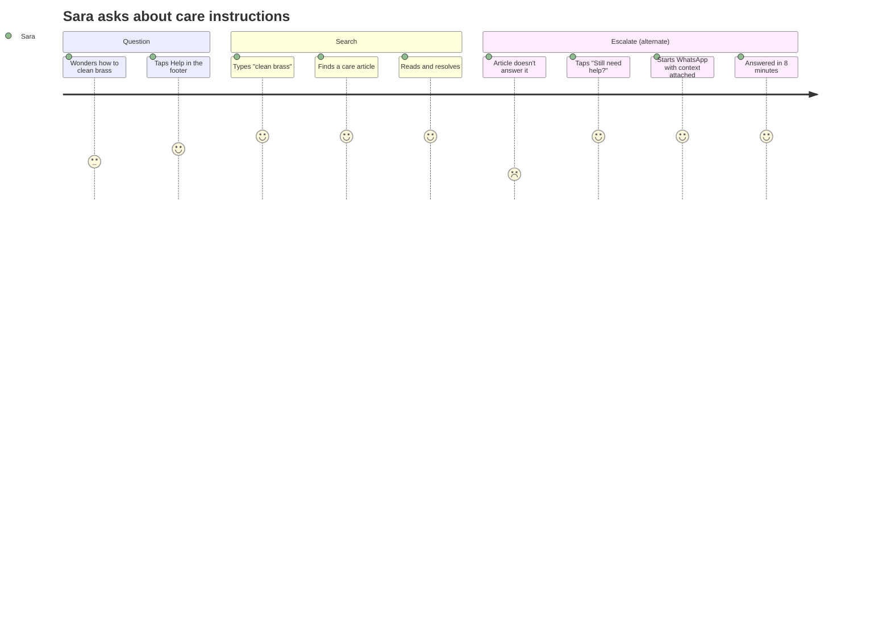
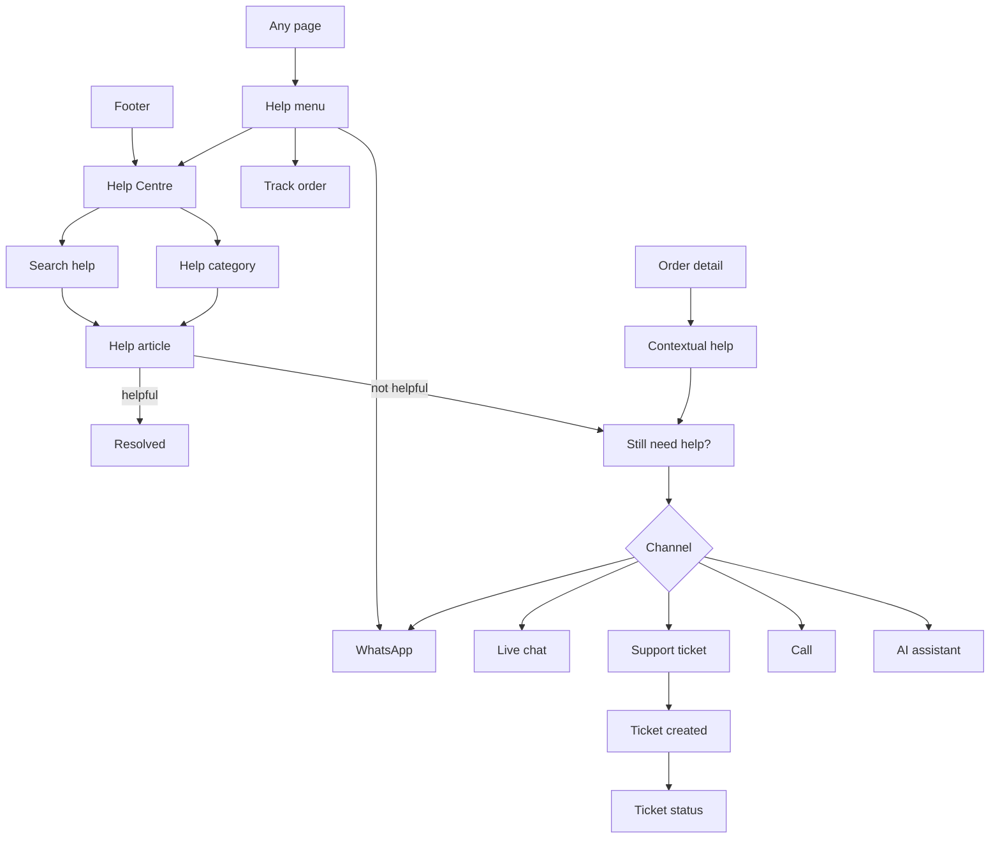
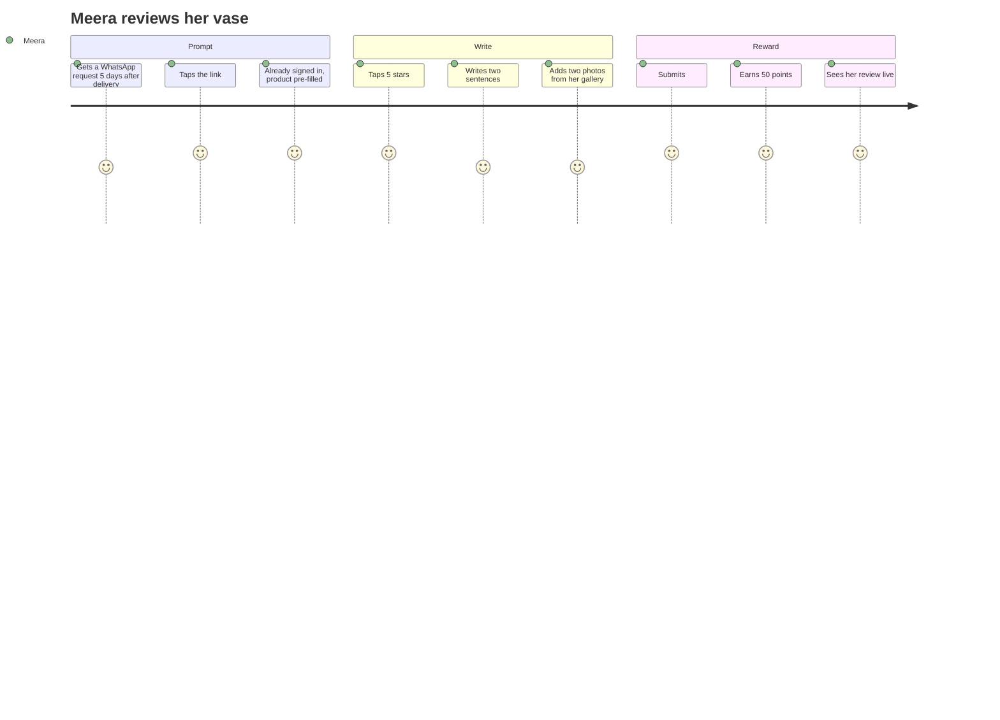
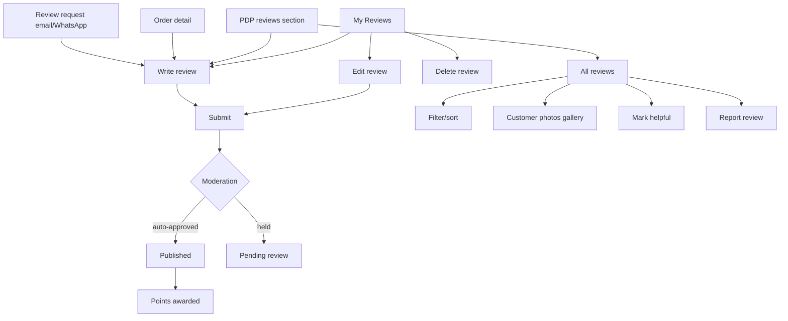
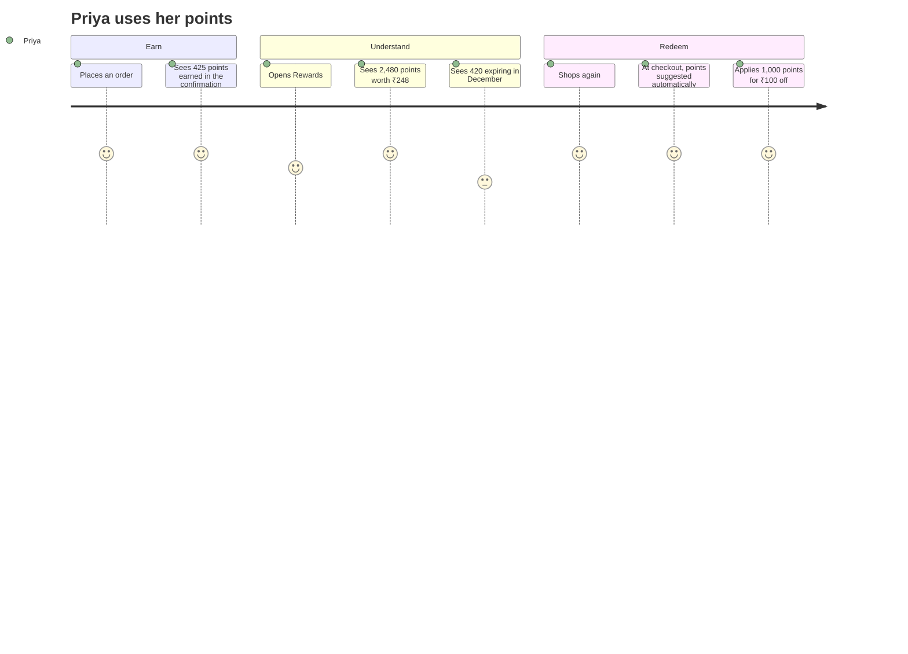
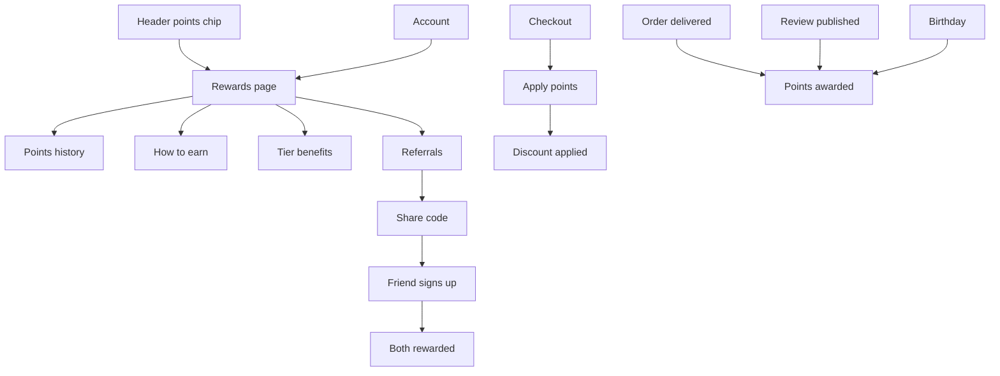
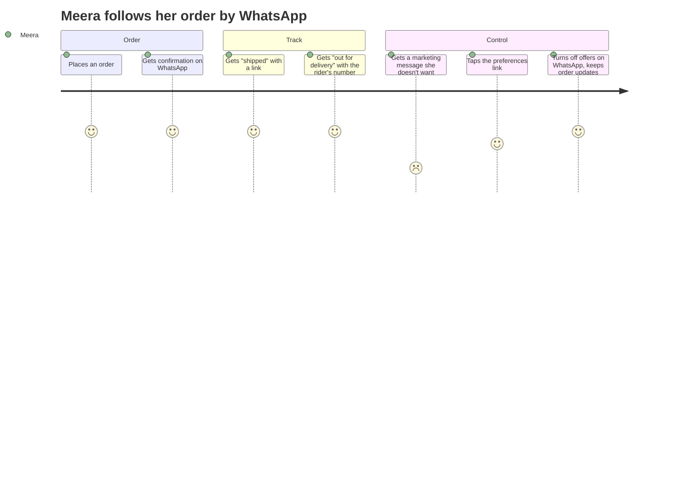
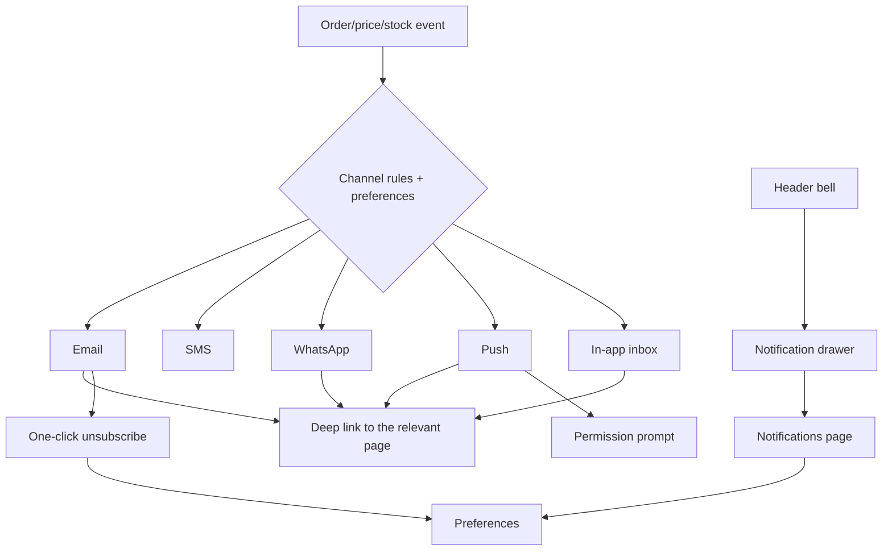

# Modules 14–17 — Customer Support, Reviews, Rewards & Notifications

Enterprise Handicraft E-Commerce Platform · Customer Website UI/UX Specification

---
---

# MODULE 14 · CUSTOMER SUPPORT

## 14.1 Business Goal

Support is a trust multiplier for a premium handmade brand and a cost centre if handled badly. The design goal is to answer most questions without a human, and to make reaching a human effortless and unembarrassing when self-service fails. Target: ≥65% self-service resolution; first-response under 2 hours in-hours; support CSAT ≥4.5.

## 14.2 Purpose

Give shoppers fast, contextual answers through a searchable help centre and FAQs, and clear routes to a human via chat, WhatsApp, phone, email and a ticket system — with the order context carried automatically.

## 14.3 Customer Journey



## 14.4 Navigation Flow



## 14.5 Complete Screen List

| ID | Screen / Overlay | Route | Type |
|----|------------------|-------|------|
| PG-14-01 | Help Centre home | `/help` | Page |
| PG-14-02 | Help category | `/help/{category}` | Page |
| PG-14-03 | Help article | `/help/{category}/{slug}` | Page |
| PG-14-04 | Help search results | `/help/search?q=` | Page |
| PG-14-05 | Contact Us | `/contact` | Page |
| PG-14-06 | Submit a ticket | `/help/ticket/new` | Page |
| PG-14-07 | My tickets | `/account/support` | Page |
| PG-14-08 | Ticket detail | `/account/support/{id}` | Page |
| MOD-14-01 | Help menu | — | Popover |
| MOD-14-02 | Contextual help | — | Modal MD |
| MOD-14-03 | Was this helpful? feedback | — | Inline + modal |
| MOD-14-04 | Choose a channel | — | Modal MD |
| MOD-14-05 | Ticket created | — | Modal SM |
| MOD-14-06 | Attach files | — | Modal SM |
| MOD-14-07 | Close ticket | — | Modal XS |
| MOD-14-08 | Rate support | — | Modal SM |
| MOD-14-09 | Callback request | — | Modal SM |
| MOD-14-10 | Business hours notice | — | Modal SM |
| DRW-14-01 | Live chat | — | Drawer 400 |
| DRW-14-02 | AI assistant | — | Drawer 420 |
| SHT-14-01 | Help menu sheet | — | Sheet |
| SHT-14-02 | Channel chooser sheet | — | Sheet |
| SHT-14-03 | Chat sheet | — | Sheet |
| SHT-14-04 | Ticket form sheet | — | Sheet |

## 14.6 Information Architecture

```
Support
├── Help Centre
│   ├── Search (primary entry)
│   ├── Popular questions
│   ├── Categories
│   │   ├── Orders & Delivery
│   │   ├── Returns & Refunds
│   │   ├── Payments & Pricing
│   │   ├── Products & Care
│   │   ├── Account & Privacy
│   │   ├── Offers & Rewards
│   │   └── About Karigar
│   └── Articles (with feedback and escalation)
├── Contact
│   ├── WhatsApp (primary in India)
│   ├── Live chat (in-hours)
│   ├── Email / ticket
│   ├── Phone (with hours)
│   └── Callback request
└── My tickets
    ├── List with status
    └── Thread with attachments
```

## 14.7 Screen Hierarchy

```
Help Centre (PG-14-01)
├── Hero with search
├── Popular questions
├── Category grid
├── Contact band
└── Footer

Article (PG-14-03)
├── Breadcrumb
├── Title + updated date
├── Body (with TOC on desktop)
├── Was this helpful?
├── Related articles
└── Still need help? (channel chooser)
```

## 14.8 Desktop Layout

Help Centre: `SL-01` with a centred search hero (max 720), then a 3-column category grid. Article: `SL-08` (8/4) — content column max 720, right rail with a table of contents, related articles and a contact card. Contact page: `SL-11` split — channels on the left, hours and location on the right.

## 14.9 Tablet Layout

Category grid 2-up. Article TOC collapses to a disclosure above the content. Contact channels stack.

## 14.10 Mobile Layout

Search hero full-width. Categories as a single-column list with icons and counts. Article: TOC in a sheet; content full-width; the "Still need help?" block is sticky at the bottom after 50% scroll. Chat and AI assistant open as bottom sheets at 92% height.

## 14.11 Wireframe Description

### Help Centre

```
┌──────────────────────────────────────────────────────────────────┐
│                    How can we help?                               │
│         [ ⌕ Search for an answer…                            ]    │
│         Popular: track order · returns · care · sizes             │
├──────────────────────────────────────────────────────────────────┤
│ Popular questions                                                 │
│ ▸ Where is my order?                                              │
│ ▸ How do I return something?                                      │
│ ▸ How long does delivery take?                                    │
│ ▸ How do I care for brass items?                                  │
│ ▸ Why do handmade pieces look slightly different?                 │
├──────────────────────────────────────────────────────────────────┤
│ Browse by topic                                                   │
│ ┌──────────────┐ ┌──────────────┐ ┌──────────────┐                │
│ │ 📦 Orders &  │ │ ↩ Returns &  │ │ 💳 Payments  │                │
│ │   Delivery   │ │   Refunds    │ │   & Pricing  │                │
│ │ 12 articles  │ │ 8 articles   │ │ 9 articles   │                │
│ └──────────────┘ └──────────────┘ └──────────────┘                │
│ ┌──────────────┐ ┌──────────────┐ ┌──────────────┐                │
│ │ 🏺 Products  │ │ 👤 Account & │ │ 🎁 Offers &  │                │
│ │   & Care     │ │   Privacy    │ │   Rewards    │                │
│ └──────────────┘ └──────────────┘ └──────────────┘                │
├──────────────────────────────────────────────────────────────────┤
│ Still need help?                                                  │
│ ┌──────────────┐ ┌──────────────┐ ┌──────────────┐ ┌────────────┐│
│ │ 💬 WhatsApp  │ │ 💭 Live Chat │ │ ✉ Email us   │ │ 📞 Call us ││
│ │ Fastest      │ │ Mon–Sat      │ │ Reply in 24h │ │ 10am–7pm   ││
│ │ [Chat now]   │ │ 10am–7pm     │ │ [Send email] │ │ [Call]     ││
│ └──────────────┘ └──────────────┘ └──────────────┘ └────────────┘│
└──────────────────────────────────────────────────────────────────┘
```

### Article with escalation

```
┌────────────────────────────────────────┬─────────────────────────┐
│ Help / Products & Care / Brass care    │ ON THIS PAGE            │
│                                        │ • Daily care            │
│ How to care for brass items            │ • Removing tarnish      │
│ Updated 12 June 2026 · 2 min read      │ • What to avoid         │
│                                        │ • When to re-polish     │
│ Brass develops a natural patina over   │                         │
│ time. Many people love this — but if   │ RELATED                 │
│ you prefer the original shine, here's  │ • Caring for terracotta │
│ how to keep it…                        │ • Why colours vary      │
│                                        │ • Cleaning blue pottery │
│ ## Daily care                          │                         │
│ Wipe with a soft, dry cloth after use… │ ┌─────────────────────┐ │
│                                        │ │ Still need help?    │ │
│ ## Removing tarnish                    │ │ [💬 WhatsApp]       │ │
│ Mix lemon juice with a pinch of salt…  │ │ [💭 Chat]           │ │
│                                        │ │ [✉ Email]           │ │
│ [image: hands polishing a diya]        │ └─────────────────────┘ │
│                                        │                         │
├────────────────────────────────────────┤                         │
│ Was this helpful?   [👍 Yes]  [👎 No]  │                         │
└────────────────────────────────────────┴─────────────────────────┘
```

### Live chat drawer

```
┌─ Chat with us ──────────────── [×] ┐
│ 🟢 Meera from Karigar · online      │
├─────────────────────────────────────┤
│ Order context                       │
│ #HC-2026-000482 · Out for delivery  │
│ [Change] [Remove]                   │
├─────────────────────────────────────┤
│  ┌────────────────────────────────┐ │
│  │ Hi! How can I help today?      │ │
│  │                    10:02 AM    │ │
│  └────────────────────────────────┘ │
│         ┌────────────────────────┐  │
│         │ My diya arrived cracked│  │
│         │              10:03 AM ✓│  │
│         └────────────────────────┘  │
│  ┌────────────────────────────────┐ │
│  │ I'm sorry! Could you send a    │ │
│  │ photo?              10:03 AM   │ │
│  └────────────────────────────────┘ │
├─────────────────────────────────────┤
│ [📎] [ Type a message…        ] [→] │
└─────────────────────────────────────┘
```

## 14.12 Header

Standard site header with a Help menu in the utility area (Help Centre, Track Order, Contact Us, WhatsApp). The Help Centre itself uses the standard header.

## 14.13 Mega Menu / Navigation

Standard. Help category navigation is in-page.

## 14.14 Footer

Full footer; the Help column is the primary discovery route for support.

## 14.15 Breadcrumb

```
Home / Help
Home / Help / Products & Care
Home / Help / Products & Care / How to care for brass items
```

## 14.16 Search

Help search matches article titles, bodies and tags, with typo tolerance and synonyms shared with product search where relevant ("diya" = "lamp"). Suggestions appear as the shopper types. Zero results offers the channel chooser directly — a failed help search is a support request in waiting.

## 14.17 Filters

Article list: by category and by "most helpful". Ticket list: by status (Open / Awaiting your reply / Resolved / Closed).

## 14.18 Sorting

Articles: relevance (search) or popularity (browse). Tickets: last updated descending.

## 14.19 Cards

Category card, article card, channel card, ticket card, FAQ item, contact info card.

## 14.20 Widgets

| Widget | Spec |
|--------|------|
| Search hero | Large field, popular-query chips beneath |
| Popular questions | Top 5 by volume, editorially overridable |
| Category grid | Icon, name, article count |
| Table of contents | Sticky rail with scroll-spy (desktop) |
| Was this helpful | Thumbs up/down; "No" reveals a short reason picker and the channel chooser |
| Channel chooser | Cards showing availability, expected response time and current status (online/offline) |
| Business hours | Live indicator; out-of-hours shows the next opening time and offers WhatsApp or a ticket |
| Order context | When escalating from an order, the order is attached automatically and shown as a removable chip |
| Live chat | Agent name and photo, typing indicator, read receipts, file attachment, transcript email |
| AI assistant entry | Offered alongside human channels, clearly labelled |
| Ticket thread | Messages with timestamps, attachments, status changes, and a rating prompt on resolution |
| Callback request | Name, number, preferred time window |

## 14.21 Forms & Fields

### Ticket / Email

| Field | Type | Required | Notes |
|-------|------|----------|-------|
| Topic | Select | Yes | Order issue, Return/refund, Product question, Payment, Account, Feedback, Other |
| Order | Select | Conditional | Pre-filled when arriving from an order; lists recent orders |
| Subject | Text | Yes | 5–100 |
| Message | Textarea | Yes | 20–2000, counter |
| Attachments | File upload | No | Up to 5, ≤10 MB each, images and PDF |
| Email | Email | Yes if signed out | Pre-filled when signed in |
| Name | Text | Yes if signed out | — |
| Phone | Phone | No | "If you'd prefer a call back" |
| Preferred channel | Radio | No | Email / WhatsApp / Phone |

### Contact form (Contact Us page)

Name, email, phone (optional), subject, message, and a "This is about an order" toggle revealing an order selector.

### Callback request

Name, phone, preferred window (Morning / Afternoon / Evening), topic.

### Chat

Message field with attachment support; pre-chat form only when signed out (name and email).

## 14.22 Validation Rules

| Field | Rule | Message |
|-------|------|---------|
| Topic | Required | "Choose what this is about" |
| Subject | Required, 5–100 | "Add a short subject" |
| Message | Required, 20–2000 | "Tell us a bit more (at least 20 characters)" |
| Email | Required, valid | "Enter a valid email address" |
| Name | Required | "Enter your name" |
| Attachment | ≤10 MB each | "Each file must be under 10 MB" |
| Attachment | ≤5 files | "You can attach up to 5 files" |
| Attachment | Type | "Attach images or PDF files" |
| Phone | Valid | "Enter a valid 10-digit mobile number" |
| Callback window | Required | "Choose when we should call" |
| Rate limit | Too many tickets | "You've raised several requests recently. We'll respond to those first — or [chat with us now]." |
| Out of hours | Chat unavailable | "Live chat opens at 10 AM. [WhatsApp us] or [send a message] and we'll reply first thing." |

## 14.23 Action Buttons

| Button | Type | Placement |
|--------|------|-----------|
| Search | Implicit / icon | Help hero |
| Chat now | Primary MD | Channel card |
| WhatsApp us | Primary MD (brand green) | Channel card, footer, help menu |
| Send a message | Outline MD | Channel card |
| Call us | Outline MD | Channel card (tel: link) |
| Request a callback | Ghost MD | Channel card |
| Ask our AI assistant | Outline MD | Channel chooser, zero-result states |
| Was this helpful — Yes/No | Ghost | Article foot |
| Still need help? | Primary MD | Article foot, sticky on mobile |
| Submit | Primary XL | Ticket form |
| Attach files | Ghost | Ticket form and chat |
| Reply | Primary MD | Ticket thread |
| Close ticket | Ghost | Ticket thread |
| Rate this support | Primary MD | Resolution prompt |

## 14.24 Icons

`circle-help` help · `search` · `message-circle` chat · WhatsApp brand mark · `mail` email · `phone` call · `phone-call` callback · `sparkles` AI · `thumbs-up`/`thumbs-down` feedback · `paperclip` attach · `ticket` support ticket · `clock` hours · `circle-check` resolved · `package` orders category · `undo-2` returns · `credit-card` payments · `hand-heart` products & care · `user-round` account · `gift` offers.

## 14.25 Typography & Spacing

| Element | Style |
|---------|-------|
| Help hero heading | `display-lg` (Fraunces) |
| Article title | `heading-xl` |
| Article body | `body-lg`, max 680 |
| Article H2 | `heading-lg` |
| Category card title | `heading-xs` |
| Channel card title | `heading-xs` |
| Chat message | `body-md` |
| Timestamp | `body-xs`, `text-tertiary` |
| Content column max | 680 |
| Section gap | 64 / 48 |

## 14.26 Images / Video / Carousels

Help articles support inline images (max 1200 px wide, lazy) and short instructional videos with captions. Category cards use craft icons rather than photography. Agent avatars 40 px. No carousels.

## 14.27 Pagination

Article lists: 20 per category with Load More. Search results: 20 with Load More. Tickets: 20. Chat: infinite scroll upward through history.

## 14.28 Empty State

| Case | Treatment |
|------|-----------|
| No search results | "No answers for '{query}'" + suggested topics + the channel chooser directly |
| No tickets | "No support requests" + "If you need help, we're here." + channel cards |
| Chat offline | "Live chat opens at 10 AM" + WhatsApp and ticket options |
| Category empty | "No articles here yet" + related categories |

## 14.29 Loading State & Skeleton

Help home: category card skeletons. Article: title and 6 body-line skeletons; the TOC builds after content loads. Search: 5 result-row skeletons. Chat: 3 message skeletons on history load, typing indicator for the agent. Ticket list: 3 card skeletons.

## 14.30 Success State

| Event | Treatment |
|-------|-----------|
| Ticket submitted | Success page: reference number, expected response time, "We've emailed you a copy", and a link to My Tickets |
| Article helpful | Inline "Thanks for letting us know" replacing the buttons |
| Chat resolved | Prompt to rate the conversation and an option to email the transcript |
| Callback booked | "We'll call you between 2 PM and 4 PM today" + a reference |
| Ticket resolved | Status changes with a rating prompt |

## 14.31 Error State

| Error | Treatment |
|-------|-----------|
| Help content fails | "We couldn't load help articles" + Retry + direct channel cards |
| Search fails | Falls back to browsing categories with a notice |
| Chat unavailable | Channel card disabled with the reason and the next opening time |
| Chat disconnected | "You've been disconnected. [Reconnect]" — the transcript is preserved |
| Ticket submit fails | Form preserved; inline error; Retry |
| Attachment upload fails | Per-file retry |
| Rate limited | Explains and offers the fastest live channel |

## 14.32 Confirmation Dialogs

| Dialog | Content |
|--------|---------|
| Close ticket | "Mark this as resolved? You can reopen it within 30 days." · Cancel / Mark Resolved |
| End chat | "End this chat? We'll email you the transcript." · Keep Chatting / End Chat |
| Leave with unsent message | "You have an unsent message." · Stay / Leave |
| Remove order context | "Remove the order from this conversation? It helps us answer faster." · Keep / Remove |

## 14.33 Notifications

| Trigger | Type | Message |
|---------|------|---------|
| Ticket created | Email + in-app | "We've got your message · reference SUP-4821" |
| Agent replied | Email + push + in-app | "We've replied to your question" |
| Ticket resolved | Email + in-app | "Your request has been resolved" |
| Chat message while away | Push | "Meera replied to your chat" |
| Callback scheduled | SMS + in-app | "We'll call you between 2 and 4 PM" |
| Rating request | In-app | "How did we do?" |

## 14.34 Micro-interactions & Animation

Search suggestions cross-fade as typed · Category cards lift on hover · "Was this helpful" buttons animate into a thank-you message · Chat drawer slides in; new messages animate up with a subtle scale · Typing indicator shows three animated dots · Sent messages show a tick then a double tick on read · Attachment upload shows a progress ring on the thumbnail · The channel-availability dot pulses when live.

## 14.35 Accessibility

- The help search is a labelled combobox with announced result counts.
- Articles use correct heading hierarchy and the TOC links are real anchors.
- "Was this helpful" buttons have descriptive accessible names including the article title.
- Chat is a live region announcing new messages politely; the agent's name is included.
- The typing indicator is announced once, not continuously.
- Attachments announce their name, size and upload state.
- Business-hours status is text, not colour alone.
- Phone numbers are `tel:` links; WhatsApp links state that they open an external app.
- The chat drawer traps focus and can always be closed by keyboard.

## 14.36 Responsive Behaviour

| Element | Desktop | Tablet | Mobile |
|---------|---------|--------|--------|
| Help hero | Centred 720 | Centred | Full-width |
| Categories | 3-up grid | 2-up | List |
| Article | 8/4 with TOC rail | Full + TOC disclosure | Full + TOC sheet |
| Channels | 4-up cards | 2-up | Stacked |
| Chat | Right drawer 400 | Right drawer | Bottom sheet 92% |
| Ticket form | Centred 640 | Centred | Full-page |
| Still need help | Article foot | Article foot | Sticky after 50% scroll |

## 14.37 Prototype Flow

Footer Help → Help Centre → search "return" → results → article → not helpful → channel chooser → WhatsApp (context attached) / or ticket form → submit → success with reference → My Tickets → thread → agent reply → resolved → rate.

## 14.38 Figma Components & Variants

**Required:** `CMP-SRC-SearchBar`, `CMP-CNT-FaqItem`, `CMP-CNT-Toc`, `CMP-CNT-ArticleCard`, `CMP-OVL-Drawer`, `CMP-OVL-BottomSheet`, `CMP-INP-*`, `CMP-INP-FileUpload`, `CMP-FBK-EmptyState`, `CMP-FBK-SuccessState`.

**New to build:**

| Component | Variants |
|-----------|----------|
| `CMP-SUP-CategoryCard` | Category (7) × State (Default/Hover) |
| `CMP-SUP-ChannelCard` | Channel (WhatsApp/Chat/Email/Phone/Callback/AI) × Availability (Online/Offline/Busy) |
| `CMP-SUP-HelpfulPrompt` | State (Unanswered/Yes/No/Reason shown) |
| `CMP-SUP-ChatDrawer` | State (Connecting/Active/Agent typing/Ended/Offline/Disconnected) |
| `CMP-SUP-ChatMessage` | Sender (Agent/Customer/System) × State (Sending/Sent/Read/Failed) × Attachment (Y/N) |
| `CMP-SUP-TicketCard` | Status (Open/Awaiting reply/Resolved/Closed) |
| `CMP-SUP-TicketThread` | Messages (1/3/6+) × Attachments (Y/N) |
| `CMP-SUP-OrderContextChip` | State (Attached/Removable) |
| `CMP-SUP-HoursIndicator` | State (Open/Closed/Opening soon) |

## 14.39 Auto Layout Structure

```
Frame: Help Centre — Desktop (V, Fill × Hug, gap 64)
├── Shell
├── Frame: Hero (V, Fill × Hug, gap 24, padding 64 40, centre)
│   ├── txt / Heading
│   ├── Instance: SearchBar (720 max × 56)
│   └── Frame: Popular chips (H wrap, gap 8)
├── Frame: Popular questions (V, Fill × Hug, gap 12, max 720 centred)
├── Frame: Categories (H wrap, Fill × Hug, gap 24, padding 0 40)
│   └── 7 × Instance: SUP-CategoryCard
├── Frame: Contact band (H, Fill × Hug, gap 24, padding 48 40)
│   └── 4 × Instance: SUP-ChannelCard
└── Footer
```

## 14.40 UX Guidelines · Developer Notes · Analytics · Scalability

### UX Guidelines

| ID | Guideline |
|----|-----------|
| SU-01 | Search is the primary entry to help — not a category list |
| SU-02 | WhatsApp is listed first in India; it has the highest engagement and lowest friction |
| SU-03 | Order context attaches automatically when escalating from an order |
| SU-04 | A failed help search offers a human immediately |
| SU-05 | Availability and expected response time are stated on every channel |
| SU-06 | Out-of-hours states offer an asynchronous route, never a dead end |
| SU-07 | "Was this helpful — No" opens a path forward, not just a data collection prompt |
| SU-08 | Ticket references are visible, copyable and included in every email |
| SU-09 | Chat transcripts are emailable |
| SU-10 | The AI assistant is offered as an option, never as a barrier to reaching a human |

### Developer Notes

1. Help articles are CMS-managed and emit FAQ structured data where the format fits.
2. Help search shares the search infrastructure with product search, with a separate index.
3. Chat availability is driven by real agent presence, not a static schedule.
4. Escalation carries order ID, page URL, device and browser automatically into the ticket or chat.
5. Attachments are virus-scanned before an agent sees them.
6. WhatsApp deep links use the business number with a pre-filled context message.
7. Ticket rate limiting is per account and per email to prevent abuse without blocking genuine follow-ups.
8. Chat and ticket threads are retained per the privacy policy and are included in data exports.

### Analytics Events

`help_search` (query, results) · `help_search_no_results` · `help_article_view` (article, source) · `help_article_helpful` (yes/no, reason) · `support_escalate` (from_article, channel) · `chat_start` / `chat_message` / `chat_end` (duration, resolved) · `ticket_create` (topic, has_order, has_attachment) · `ticket_reply` · `ticket_resolved` · `support_rating` (score) · `callback_request` · `whatsapp_click` (source).

### Future Scalability

AI-first triage that answers common questions and hands off with full context · proactive support (detecting a failed payment or delayed delivery and reaching out first) · video call support for craft consultation · community Q&A where other customers answer · multilingual support routing · in-app voice notes on WhatsApp · support inside the order timeline rather than a separate destination.

---
---

# MODULE 15 · REVIEWS

## 15.1 Business Goal

Reviews with photographs are the single strongest conversion asset on a handicraft PDP, because they show what the piece actually looks like in a real home. Volume and recency matter as much as rating. Target: review rate ≥18% of delivered orders; ≥40% of reviews with photos; review-exposed sessions convert 2× non-exposed.

## 15.2 Purpose

Let verified buyers rate and describe what they received, upload photographs, edit their reviews, and help other shoppers — and let all shoppers read, filter and trust that content.

## 15.3 Customer Journey



## 15.4 Navigation Flow



## 15.5 Complete Screen List

| ID | Screen / Overlay | Route | Type |
|----|------------------|-------|------|
| PG-15-01 | Write a Review | `/review/{orderItemId}` | Page |
| PG-15-02 | All Reviews (product) | `/p/{slug}/reviews` | Page |
| PG-15-03 | Customer Photos gallery | `/p/{slug}/photos` | Page |
| PG-15-04 | My Reviews | `/account/reviews` | Page |
| MOD-15-01 | Write review | — | Modal LG |
| MOD-15-02 | Edit review | — | Modal LG |
| MOD-15-03 | Delete review confirm | — | Modal XS |
| MOD-15-04 | Photo upload | — | Modal MD |
| MOD-15-05 | Review photo lightbox | — | Full overlay |
| MOD-15-06 | Report a review | — | Modal SM |
| MOD-15-07 | Review guidelines | — | Modal MD |
| MOD-15-08 | Review submitted | — | Modal SM |
| MOD-15-09 | Sign-in to review | — | Modal SM |
| MOD-15-10 | Not eligible | — | Modal SM |
| SHT-15-01 | Review form sheet | — | Sheet |
| SHT-15-02 | Filter reviews sheet | — | Sheet |
| SHT-15-03 | Review actions sheet | — | Sheet |

## 15.6 Information Architecture

```
Reviews
├── Reading (on PDP)
│   ├── Rating summary + breakdown
│   ├── AI summary (labelled)
│   ├── Customer photo strip
│   ├── Filters (rating, media, variant, theme)
│   ├── Sort (helpful, recent, rating)
│   └── Review list with helpful votes and replies
├── Writing
│   ├── Eligibility check (verified purchase)
│   ├── Rating + sub-ratings
│   ├── Title + body
│   ├── Photos / video
│   ├── Recommend toggle
│   └── Display name choice
└── Managing (account)
    ├── Published reviews
    ├── Pending reviews
    └── Awaiting review (delivered, unreviewed items)
```

## 15.7 Screen Hierarchy

```
All Reviews (PG-15-02)
├── Product header (mini)
├── Rating summary + breakdown + AI summary
├── Photo strip → Photos gallery
├── Filters + sort
├── Review list
├── Load More
└── Write a review CTA
```

## 15.8 Desktop Layout

All Reviews: `SL-08` — summary and filters in a left rail (4), review list right (8). Write review: modal LG (800) with the product shown at the top for context.

## 15.9 Tablet Layout

Summary above the list, filters as a horizontal chip row. Review form modal at 90vw.

## 15.10 Mobile Layout

Summary card, then a horizontally scrolling filter chip row, then the list. Write review is a full-screen sheet with the rating step first and large touch targets — a 44 px star is too small, so stars are 40 px with 48 px hit areas.

## 15.11 Wireframe Description

### Write a Review

```
┌────────────────────────────────────────────────────────┐
│  Write a review                                   [×]  │
├────────────────────────────────────────────────────────┤
│  ┌────┐ Blue Pottery Vase — Jaipur                     │
│  │img │ Size: Medium · Colour: Indigo                  │
│  └────┘ Delivered 15 Jun 2026                          │
├────────────────────────────────────────────────────────┤
│  How would you rate it? *                              │
│  ★ ★ ★ ★ ★    Excellent                                │
│                                                        │
│  Rate the details (optional)                           │
│  Quality        ★ ★ ★ ★ ★                              │
│  Value for money ★ ★ ★ ★ ☆                             │
│  As pictured    ★ ★ ★ ★ ★                              │
│                                                        │
│  Add a title (optional)                                │
│  [ Beautiful craftsmanship                         ]   │
│                                                        │
│  Tell us about it *                              68/2000│
│  [ The colours are richer than the photos. You can   ] │
│  [ see the brush strokes where it was painted.       ] │
│  What did you like? How does it look in your home?      │
│                                                        │
│  Add photos (optional)                          2 of 6 │
│  [img][img][ + ]                                       │
│  Photos help other shoppers more than anything else    │
│                                                        │
│  ☑ I recommend this product                            │
│                                                        │
│  Show my name as                                       │
│  ⦿ Meera N.   ○ Meera Nair   ○ Anonymous                │
│                                                        │
│  ℹ You'll earn 50 points when your review is published  │
│    [Review guidelines]                                  │
├────────────────────────────────────────────────────────┤
│                      [ Cancel ]  [ Post My Review ]    │
└────────────────────────────────────────────────────────┘
```

### My Reviews

```
┌──────────────────────────────────────────────────────────────────┐
│ My Reviews                                                        │
│ [ Published (4) ] [ Pending (1) ] [ To review (2) ]              │
├──────────────────────────────────────────────────────────────────┤
│ ┌──────────────────────────────────────────────────────────────┐ │
│ │ [img] Blue Pottery Vase                    ★★★★★  12 Jun     │ │
│ │ "Beautiful craftsmanship"                                     │ │
│ │ The colours are richer than the photos…                       │ │
│ │ [photo][photo]  👍 24 found this helpful                      │ │
│ │ [ Edit ]  [ Delete ]                                          │ │
│ └──────────────────────────────────────────────────────────────┘ │
├──────────────────────────────────────────────────────────────────┤
│ To review (2)                                                     │
│ ┌──────────────────────────────────────────────────────────────┐ │
│ │ [img] Brass Diya Set of 5 · Delivered 20 Jun                  │ │
│ │ ☆☆☆☆☆  Tap to rate            [ Write a Review ]  +50 points  │ │
│ └──────────────────────────────────────────────────────────────┘ │
└──────────────────────────────────────────────────────────────────┘
```

## 15.12 Header

Standard site header.

## 15.13 Mega Menu / Navigation

Standard. The All Reviews page includes a back link to the PDP.

## 15.14 Footer

Full footer.

## 15.15 Breadcrumb

```
Home / Home Décor / Vases / Blue Pottery Vase / Reviews
Home / My Account / My Reviews
```

## 15.16 Search

Review search within a product's reviews when the count exceeds 50: "Search reviews — e.g. size, colour, packaging".

## 15.17 Filters

Rating (5★–1★ chips), With photos, With videos, Variant (size/colour reviewed), Theme (AI-derived: colour, size, packaging, craftsmanship, delivery), Verified only (locked on).

## 15.18 Sorting

Most helpful (default), Most recent, Highest rating, Lowest rating, With photos first.

## 15.19 Cards

Review card, review photo tile, rating breakdown, AI summary card, to-review prompt card, pending review card.

## 15.20 Widgets

| Widget | Spec |
|--------|------|
| Rating summary | Average, stars, count, distribution bars (clickable filters), sub-rating averages |
| AI summary | Labelled, balanced, theme chips linking to filtered views |
| Photo strip | Customer photos, opens the gallery |
| Star input | 40 px stars with 48 px hit areas, hover/keyboard preview with a text label |
| Photo uploader | Tile grid, drag to reorder, camera capture on mobile, client-side compression |
| Points incentive | Shown before submission with a disclosure that reviews are not required to be positive |
| Helpful vote | Optimistic; signed-out shoppers get a one-time sign-in nudge |
| Review reply | Brand replies shown indented beneath the review |
| Eligibility gate | Explains that reviews come from verified purchases; offers sign-in |
| To-review prompt | In the account and after delivery, listing unreviewed delivered items with the points offer |

## 15.21 Forms & Fields

| Field | Type | Required | Notes |
|-------|------|----------|-------|
| Overall rating | Star input | Yes | 1–5, with labels |
| Sub-ratings | Star inputs | No | Quality, Value, As pictured, and Craftsmanship for craft categories |
| Title | Text | No | ≤80 |
| Review body | Textarea | Yes | 20–2000, counter, placeholder prompts |
| Photos | Photo upload | No | Up to 6, ≤5 MB each, JPG/PNG/WEBP |
| Video | Upload | No | ≤60 s, ≤50 MB |
| Recommend | Checkbox | No | Default on when rating ≥4 |
| Display name | Radio | Yes | Abbreviated (default), full, or anonymous |
| Location | Auto | — | City shown from the order, editable to hide |

## 15.22 Validation Rules

| Rule | Message |
|------|---------|
| Rating required | "Select a rating" |
| Body required | "Write at least 20 characters" |
| Body too long | "Reviews are limited to 2,000 characters" |
| Title too long | "Titles are limited to 80 characters" |
| Photos count | "You can add up to 6 photos" |
| Photo size | "Each photo must be under 5 MB" |
| Photo type | "Use JPG, PNG or WEBP images" |
| Video length | "Videos must be 60 seconds or shorter" |
| Eligibility | "You can review this once it's delivered" |
| Not purchased | "Reviews come from verified purchases. [Shop this product]" |
| Duplicate | "You've already reviewed this. [Edit your review]" |
| Edit window | "Reviews can be edited within 30 days" |
| Prohibited content | "Please remove personal details like phone numbers or email addresses" |
| Profanity | "Please rephrase — we can't publish this language" |
| Links | "Links aren't allowed in reviews" |
| Rate limit | "You've posted several reviews recently. Try again tomorrow." |

## 15.23 Action Buttons

| Button | Type | Placement |
|--------|------|-----------|
| Write a Review | Outline MD / Primary in prompts | PDP, order, account |
| Post My Review | Primary XL | Form |
| Save Changes | Primary XL | Edit form |
| Add photos | Ghost with `+` | Form |
| Cancel | Ghost | Form |
| Edit | Ghost SM | My Reviews |
| Delete | Ghost danger SM | My Reviews |
| Helpful | Ghost SM with count | Review card |
| Report | Ghost SM | Review card |
| See all reviews | Outline LG | PDP reviews section |
| View all photos | Link | Photo strip |
| Review guidelines | Link | Form |

## 15.24 Icons

`star` rating · `camera` photos · `video` · `thumbs-up` helpful · `flag` report · `badge-check` verified · `pencil` edit · `trash-2` delete · `sparkles` AI summary · `gem` points · `circle-help` guidelines · `image` photo gallery.

## 15.25 Typography & Spacing

| Element | Style |
|---------|-------|
| Average rating | `display-lg` |
| Review title | `heading-xs` |
| Review body | `body-md` |
| Reviewer name | `body-sm` 500 |
| Date and variant | `body-xs`, `text-tertiary` |
| Star input | 40 px |
| Star display | 14–18 px |
| Review card gap | 24 |
| Form field gap | 24 |

## 15.26 Images / Video / Carousels

Review photos: stored at 1200×1200, displayed at 96 px in cards, 300 px in the strip, full size in the lightbox. Client-side compression before upload. Video plays inline with captions where provided. The photo gallery is a masonry grid with a lightbox.

## 15.27 Pagination

PDP: 5 inline, then All Reviews at 20 per page with Load More. Photos gallery: 24 per page, infinite scroll. My Reviews: 10 per page.

## 15.28 Empty State

| Case | Treatment |
|------|-----------|
| No reviews on a product | "No reviews yet — be the first to share your experience" + Write a Review (or the eligibility explanation) |
| No photos | Strip omitted |
| Filtered to zero | "No reviews match these filters" + Clear filters |
| My Reviews empty | "You haven't reviewed anything yet" + "Reviews from your delivered orders appear here" + View Orders |
| Nothing to review | "You're all caught up" |

## 15.29 Loading State & Skeleton

Review list: 3 review-card skeletons. Rating summary: bar skeletons. AI summary: 3 text-line skeletons with the label already rendered. Photo strip: 6 square skeletons. Form submit: button spinner with the form locked. Photo upload: per-tile progress rings.

## 15.30 Success State

Submission success shows: check animation, "Thanks — your review helps other shoppers", points earned, whether it is live or pending moderation with the expected timing, a link to view it, and a prompt to review other delivered items ("You have 1 more item to review · +50 points").

## 15.31 Error State

| Error | Treatment |
|-------|-----------|
| Reviews fail to load | Section error with Retry; the rest of the PDP is unaffected |
| Submit fails | Form preserved entirely, including photos already uploaded; inline error; Retry |
| Photo upload fails | Per-file retry; other photos unaffected |
| Not eligible | Modal explaining verified-purchase policy with a path to shop or sign in |
| Already reviewed | Modal offering Edit |
| Content rejected | Inline explanation of which rule was breached and how to fix it |
| Moderation hold | Success with "Your review will appear within 24 hours" |

## 15.32 Confirmation Dialogs

| Dialog | Content |
|--------|---------|
| Delete review | "Delete your review? Other shoppers won't see it anymore, and your 50 points will be removed." · Cancel / Delete Review |
| Discard draft | "Discard your review?" · Keep Writing / Discard |
| Report review | Reason radio group (Inappropriate, Spam, Not about this product, Fake) + optional detail · Cancel / Report |

## 15.33 Notifications

| Trigger | Type | Message |
|---------|------|---------|
| Review request | Email + WhatsApp (5 days after delivery) | "How was your Blue Pottery Vase? · earn 50 points" |
| Review published | Email + in-app | "Your review is live · 50 points added" |
| Review held | In-app | "Your review is being checked and will appear within 24 hours" |
| Review rejected | Email | Explains which guideline and offers to edit |
| Helpful milestone | In-app | "24 people found your review helpful" |
| Brand replied | Email + in-app | "Karigar replied to your review" |
| Reminder | WhatsApp (12 days after delivery, once) | "Still love your Brass Diya Set? Share a photo · 50 points" |

## 15.34 Micro-interactions & Animation

Stars fill progressively on hover with the label updating · Selected rating pulses once · Photo upload tiles appear immediately with a progress ring then cross-fade to the image · Character counter changes tone at 90% · Helpful vote increments with a count roll and the thumb fills · Submit shows a spinner then a check-draw · Filter chips animate in · Photo lightbox opens with a scale-from-thumbnail transition.

## 15.35 Accessibility

- The star input is a labelled radiogroup; arrow keys change the rating and the current value is announced with its label ("4 stars, Very good").
- Star displays announce "Rated 4.6 out of 5".
- Photo upload announces progress and completion per file, and each photo has an editable description field for alt text.
- The character counter is announced at thresholds, not continuously.
- Helpful votes announce the new count.
- The AI summary is labelled in text.
- Filter chips announce their pressed state and the resulting count.
- The lightbox traps focus and announces the photo index.
- Review cards expose the rating, verified status, date and variant in their accessible names.

## 15.36 Responsive Behaviour

| Element | Desktop | Tablet | Mobile |
|---------|---------|--------|--------|
| Reviews layout | 4/8 summary + list | Summary above list | Stacked |
| Filters | Rail checkboxes | Chip row | Scrollable chips + sheet |
| Review form | Modal 800 | Modal 90vw | Full-screen sheet |
| Star input | 40 px | 40 px | 40 px with 48 px hit area |
| Photo strip | 8 visible | 6 | 4.5 swipe |
| Photo gallery | 4-col masonry | 3-col | 2-col |
| My Reviews | Full cards | Full cards | Condensed |

## 15.37 Prototype Flow (SP-08)

PDP → reviews section → filter "with photos" → open a photo lightbox → back → See all reviews → sort by recent → Write a Review → eligibility check → form → rate → write → upload photos → submit → success with points → My Reviews.

## 15.38 Figma Components & Variants

**Required:** `CMP-REV-Card`, `CMP-REV-RatingInput`, `CMP-REV-Breakdown`, `CMP-REV-PhotoStrip`, `CMP-REV-AiSummary`, `CMP-REV-Form`, `CMP-INP-PhotoUpload`, `CMP-MED-Lightbox`, `CMP-OVL-Modal`, `CMP-OVL-BottomSheet`, `CMP-FLT-Chip`.

**New to build:**

| Component | Variants |
|-----------|----------|
| `CMP-REV-ToReviewCard` | State (Default/Hover) × Points (Y/N) |
| `CMP-REV-MyReviewCard` | Status (Published/Pending/Rejected) × Media (Y/N) × Reply (Y/N) |
| `CMP-REV-EligibilityGate` | Reason (Not purchased/Not delivered/Already reviewed/Signed out) |
| `CMP-REV-PhotoTile` | State (Empty/Uploading/Uploaded/Error) × Removable |
| `CMP-REV-SubmitSuccess` | Moderation (Live/Pending) × Points (Y/N) × More to review (Y/N) |
| `CMP-REV-FilterChips` | Count (3/5/8) × Active (0/1/2) |

## 15.39 Auto Layout Structure

```
Frame: All Reviews — Desktop (V, Fill × Hug, gap 24, padding 24 40)
├── Instance: Breadcrumb
├── Frame: Product header (H, Fill × Hug, gap 16)
└── Frame: Body (H, Fill × Hug, gap 32, align top)
    ├── Frame: Summary rail (320 fixed, V, gap 24)   [Sticky]
    │   ├── Instance: REV-Breakdown
    │   ├── Instance: REV-AiSummary
    │   └── Instance: Button / Write a Review
    └── Frame: List (Fill, V, gap 24)
        ├── Instance: REV-PhotoStrip
        ├── Instance: REV-FilterChips + Sort
        ├── n × Instance: REV-Card
        └── Instance: Pagination / Load More
```

## 15.40 UX Guidelines · Developer Notes · Analytics · Scalability

### UX Guidelines

| ID | Guideline |
|----|-----------|
| RV-01 | Only verified purchasers can review, and the UI says so — this is the foundation of trust |
| RV-02 | Photos are the highest-value content; ask for them explicitly and explain why |
| RV-03 | Negative reviews are published; filtering or hiding them destroys credibility |
| RV-04 | Points for reviews are offered but never conditional on a positive rating, and this is disclosed |
| RV-05 | The review form opens with the product visible so the shopper knows exactly what they are rating |
| RV-06 | Moderation delays are communicated with an expected time |
| RV-07 | Reviews are editable for 30 days |
| RV-08 | The AI summary must include negative themes when they exist |
| RV-09 | Review prompts arrive when the shopper has had time to use the piece — 5 days after delivery, once, with one reminder |
| RV-10 | Display-name choice includes a genuine anonymous option |

### Developer Notes

1. Eligibility is computed from delivered order items, not from any order — undelivered items cannot be reviewed.
2. Auto-moderation checks profanity, PII, links and duplicate text; anything held is queued for human review with a 24-hour SLA.
3. Photos are stored at full resolution, compressed client-side before upload, and moderated individually so one bad photo does not reject a good review.
4. Product rating aggregates update transactionally on publish, edit and delete.
5. Helpful votes are one per shopper per review, idempotent, and stored per account or per device for guests.
6. Review structured data is emitted for published reviews.
7. Points are awarded on publication, not submission, and reversed on deletion — the UI states this in the delete confirmation.
8. The AI summary regenerates on a schedule and after significant review volume changes, with the last-updated date shown.

### Analytics Events

`review_prompt_click` (channel) · `review_form_open` (source) · `review_rating_select` (value) · `review_photo_add` (count) · `review_submit` (rating, has_photo, has_video, length) · `review_published` · `review_edit` · `review_delete` · `review_helpful` · `review_report` · `review_filter` (facet) · `review_photo_view` · `ai_summary_theme_click`.

### Future Scalability

Video reviews as a first-class format · Q&A alongside reviews · review incentives tiered by content quality (photo, video) · syndication to Google Shopping · reviewer profiles and badges · "reviews from people like you" filtering by home type or use case · artisan responses to reviews · translated reviews across locales.

---
---

# MODULE 16 · REWARDS

## 16.1 Business Goal

A loyalty programme increases repeat purchase and average order value while giving a reason to create an account. For a considered-purchase craft brand, points must feel meaningful rather than trivial, and the rules must be simple enough to explain in one sentence. Target: enrolled customers purchase 1.8× more often; ≥35% of points issued are redeemed; referral-driven customers ≥8% of new customers.

## 16.2 Purpose

Let shoppers earn points on purchases and actions, understand their balance and its value, redeem points at checkout, refer friends, and progress through membership tiers.

## 16.3 Customer Journey



## 16.4 Navigation Flow



## 16.5 Complete Screen List

| ID | Screen / Overlay | Route | Type |
|----|------------------|-------|------|
| PG-16-01 | Rewards overview | `/account/rewards` | Page |
| PG-16-02 | Points history | `/account/rewards/history` | Page |
| PG-16-03 | How it works | `/rewards` | Public page |
| PG-16-04 | Referrals | `/account/referrals` | Page |
| PG-16-05 | Referral landing (for the friend) | `/refer/{code}` | Public page |
| MOD-16-01 | Points terms | — | Modal MD |
| MOD-16-02 | Tier benefits | — | Modal MD |
| MOD-16-03 | Share referral | — | Modal MD |
| MOD-16-04 | Expiring points | — | Modal SM |
| MOD-16-05 | Redeem points | — | Inline at checkout |
| MOD-16-06 | Points earned | — | Toast/modal |
| MOD-16-07 | Tier upgraded | — | Modal SM |
| MOD-16-08 | Referral reward earned | — | Modal SM |
| SHT-16-01 | Points history sheet | — | Sheet |
| SHT-16-02 | Share sheet | — | Sheet |

## 16.6 Information Architecture

```
Rewards
├── Balance
│   ├── Points, rupee value, expiring soon
│   └── Tier and progress to next
├── Earn
│   ├── Purchases (base rate + tier multiplier)
│   ├── Reviews (with photo bonus)
│   ├── Referrals
│   ├── Birthday
│   ├── Profile completion
│   └── Newsletter signup
├── Redeem
│   ├── Conversion rate and cap
│   └── Applied at checkout
├── History (earned, redeemed, expired)
├── Tiers and benefits
└── Referrals (code, share, tracking)
```

## 16.7 Screen Hierarchy

```
Rewards (PG-16-01)
├── Balance hero card
├── Tier progress
├── How to earn (grid)
├── Recent activity (5) → History
├── Referral card
└── Terms link
```

## 16.8 Desktop Layout

Within the account content column. Balance hero full width, then a two-column split: earn grid (7) and tier card (5). Recent activity below, then the referral card.

## 16.9 Tablet Layout

Balance hero full width, earn grid 2-up, tier card below.

## 16.10 Mobile Layout

Balance hero as a prominent card (brass-toned), tier progress beneath it, earn methods as a single-column list, recent activity as rows, referral card with a full-width share button.

## 16.11 Wireframe Description

```
┌──────────────────────────────────────────────────────────────────┐
│ Rewards                                          [How it works]  │
├──────────────────────────────────────────────────────────────────┤
│ ┌──────────────────────────────────────────────────────────────┐ │
│ │  💎  2,480 points                                             │ │
│ │      worth ₹248 off your next order                           │ │
│ │      ⚠ 420 points expire on 31 Dec 2026                       │ │
│ │      [ Shop and Redeem ]                                      │ │
│ └──────────────────────────────────────────────────────────────┘ │
├──────────────────────────────────────────────────────────────────┤
│ ┌─ Your tier ──────────────────────────────────────────────────┐ │
│ │ 🥇 Gold member                                                │ │
│ │ ████████████████░░░░  2,480 / 3,000 to Platinum               │ │
│ │ 520 points to go · earn 1.5× on every order at Platinum       │ │
│ │ [See all tier benefits]                                       │ │
│ └──────────────────────────────────────────────────────────────┘ │
├──────────────────────────────────────────────────────────────────┤
│ How to earn                                                       │
│ ┌──────────────┐ ┌──────────────┐ ┌──────────────┐               │
│ │ 🛍 Shop      │ │ ⭐ Review    │ │ 📷 Add photos│               │
│ │ 10 points    │ │ 50 points    │ │ +25 points   │               │
│ │ per ₹100     │ │ per review   │ │ per review   │               │
│ └──────────────┘ └──────────────┘ └──────────────┘               │
│ ┌──────────────┐ ┌──────────────┐ ┌──────────────┐               │
│ │ 🎁 Refer     │ │ 🎂 Birthday  │ │ 👤 Complete  │               │
│ │ 500 points   │ │ 200 points   │ │ profile      │               │
│ │ per friend   │ │ every year   │ │ 100 points   │               │
│ └──────────────┘ └──────────────┘ └──────────────┘               │
├──────────────────────────────────────────────────────────────────┤
│ Recent activity                                    View all →     │
│ + 425   Order #HC-2026-000482                       03 Aug        │
│ + 50    Review · Blue Pottery Vase                  20 Jun        │
│ − 1,000 Redeemed on order #HC-2026-000441           12 Jun        │
│ + 500   Referral · Sara joined                      02 Jun        │
├──────────────────────────────────────────────────────────────────┤
│ ┌─ Refer a friend ─────────────────────────────────────────────┐ │
│ │ Give ₹200, get 500 points                                     │ │
│ │ Your code: PRIYA200                                  [Copy]   │ │
│ │ [ 💬 WhatsApp ]  [ ✉ Email ]  [ 🔗 Copy link ]                │ │
│ │ 2 friends joined · 1,000 points earned                        │ │
│ └──────────────────────────────────────────────────────────────┘ │
├──────────────────────────────────────────────────────────────────┤
│ Points expire 12 months after they're earned. [Full terms]        │
└──────────────────────────────────────────────────────────────────┘
```

## 16.12 Header

Standard header. Signed-in shoppers see a points chip in the account menu and, on the account pages, in the profile card.

## 16.13 Mega Menu / Navigation

Standard. "Rewards" appears in the account navigation and in the footer under About.

## 16.14 Footer

Full footer with a Rewards link.

## 16.15 Breadcrumb

`Home / My Account / Rewards` · `Home / Rewards` (public page).

## 16.16 Search

Not applicable. Points history above 100 entries gains a date filter rather than search.

## 16.17 Filters

Points history: type (Earned / Redeemed / Expired / Adjusted), date range.

## 16.18 Sorting

History: date descending only.

## 16.19 Cards

Balance hero, tier card, earn-method card, activity row, referral card, tier benefit card, expiring-points alert.

## 16.20 Widgets

| Widget | Spec |
|--------|------|
| Balance hero | Brass-toned card: points in `display-lg`, rupee value, expiry warning, primary CTA |
| Tier progress | Current tier badge, progress bar, points to next tier, the next tier's headline benefit |
| Earn grid | Six methods with icon, rate and a short explanation; each links to the relevant action |
| Activity list | Signed values with colour and sign, reference link, date |
| Referral card | Code with copy, share channels, friends joined, points earned |
| Redemption widget (checkout) | Balance, max redeemable with the rule stated, slider + numeric input, live discount, remaining balance |
| Expiry warning | Appears within 60 days of expiry, with the exact date and amount |
| Tier benefits modal | Table of tiers × benefits with the current tier highlighted |

## 16.21 Forms & Fields

| Form | Field | Type | Notes |
|------|-------|------|-------|
| Redeem (checkout) | Points to use | Slider + numeric | Bounded by balance and the per-order cap |
| Referral share | Channel | Buttons | WhatsApp, email, copy link, native share |
| Referral email | Recipient emails | Tag input | Up to 10 |
| Referral email | Message | Textarea | Pre-filled, editable, ≤300 |

## 16.22 Validation Rules

| Rule | Message |
|------|---------|
| Redeem minimum | "You need at least 500 points to redeem" |
| Redeem maximum | "You can use up to 1,000 points on this order (20% of the order value)" |
| Redeem increments | "Points are used in increments of 100" |
| Insufficient balance | "You have 2,480 points available" |
| Referral self-use | "You can't use your own referral code" |
| Referral already used | "This code has already been used on your account" |
| Referral not new | "Referral rewards are for new customers" |
| Referral email limit | "You can invite up to 10 people at a time" |
| Referral email invalid | "'{value}' isn't a valid email address" |

## 16.23 Action Buttons

| Button | Type | Placement |
|--------|------|-----------|
| Shop and Redeem | Primary MD | Balance hero |
| See all tier benefits | Link | Tier card |
| View all activity | Link | Recent activity |
| Copy code | Ghost with icon | Referral card |
| WhatsApp / Email / Copy link | Outline MD | Referral card |
| Apply points | Secondary MD | Checkout |
| Remove points | Icon `×` | Checkout applied row |
| Full terms | Link | Foot of the page |
| How it works | Outline MD | Header |

## 16.24 Icons

`gem` points · `crown` tier · `gift` referral · `shopping-bag` earn by shopping · `star` earn by reviewing · `camera` photo bonus · `cake` birthday · `user-round-check` profile · `trending-up` progress · `clock-alert` expiring · `copy` · WhatsApp brand mark · `mail` · `link`.

## 16.25 Typography & Spacing

| Element | Style |
|---------|-------|
| Points balance | `display-lg` tabular |
| Rupee value | `heading-md` |
| Expiry warning | `body-sm`, `warning-700` |
| Tier name | `heading-sm` |
| Earn rate | `heading-xs` |
| Activity amount | `price-md` tabular, signed |
| Card padding | 24 |
| Card gap | 16 |

## 16.26 Images / Video / Carousels

Tier badges are SVG illustrations (bronze, silver, gold, platinum). Earn-method cards use icons, not photography. The public "How it works" page uses one illustrative image per step. No video or carousel.

## 16.27 Pagination

Points history: 20 per page with Load More. Referral list: 10.

## 16.28 Empty State

| Case | Treatment |
|------|-----------|
| Zero points | "Start earning points" + "Earn 10 points for every ₹100 you spend" + Shop Now + the earn grid |
| No activity | "No activity yet" |
| No referrals | "Invite a friend — give ₹200, get 500 points" + share actions |
| Not enrolled (guest) | Public "How it works" page with a Create Account CTA |

## 16.29 Loading State & Skeleton

Balance hero skeleton (large number placeholder), tier bar skeleton, earn grid renders immediately (static content), activity rows skeleton. The checkout redemption widget shows an inline skeleton while the balance loads and never blocks the payment step.

## 16.30 Success State

| Event | Treatment |
|-------|-----------|
| Points earned | Toast "+425 points earned" and, on the order confirmation, a dedicated line |
| Points redeemed | Checkout summary shows the discount; toast confirms |
| Tier upgraded | Modal with the new tier badge, an animation, and the unlocked benefits |
| Referral joined | Modal + email: "Sara joined · you earned 500 points" |
| Code copied | Toast "Code copied" |

## 16.31 Error State

| Error | Treatment |
|-------|-----------|
| Balance fails to load | Card shows "Couldn't load your points" + Retry; checkout falls back to hiding the widget rather than blocking |
| Redemption fails | Inline error at checkout; the order can still proceed without points |
| Referral code invalid | Inline on the landing page with a path to shop normally |
| Points expired unexpectedly | History shows the expiry entry with the date; a support link is offered |
| Tier calculation delayed | "Your tier updates within 24 hours of an order" |

## 16.32 Confirmation Dialogs

| Dialog | Content |
|--------|---------|
| Remove points at checkout | No dialog — immediate with Undo |
| Terms acknowledgement | Not a dialog — terms are linked, not gated |

## 16.33 Notifications

| Trigger | Type | Message |
|---------|------|---------|
| Points earned | In-app + email (order confirmation) | "You earned 425 points" |
| Points expiring | Email + in-app (60, 30 and 7 days before) | "420 points expire on 31 December" |
| Tier upgraded | Email + in-app | "You're now a Gold member" |
| Tier at risk | Email (annual review) | "Keep shopping to stay Gold" |
| Referral joined | Email + in-app | "Sara joined · 500 points added" |
| Birthday points | Email + in-app | "Happy birthday — 200 points from us" |
| Redemption reminder | Email (quarterly) | "You have 2,480 points waiting · worth ₹248" |

## 16.34 Micro-interactions & Animation

Points balance counts up on load and rolls when it changes · Tier progress bar fills on load with a slight overshoot · Tier upgrade plays a badge reveal with a shimmer (once) · Earn-method cards lift on hover · Copy code morphs the icon to a check · Redemption slider updates the discount live with the total counting down · Expiring-points warning pulses once on first view per session.

## 16.35 Accessibility

- The points balance is announced with its rupee value, not only the number.
- The tier progress bar exposes current, max and remaining values in text.
- Expiry warnings state the exact date in text.
- The redemption slider has an accompanying numeric input and announces the resulting discount on change.
- The earn grid items are links with descriptive names including the rate.
- Activity rows announce the sign in words ("plus 425 points" / "minus 1,000 points").
- Referral code is selectable text with an accessible copy button.
- Tier badges have text alternatives.

## 16.36 Responsive Behaviour

| Element | Desktop | Tablet | Mobile |
|---------|---------|--------|--------|
| Balance hero | Full-width card | Full-width | Full-width, larger type |
| Tier card | Beside earn grid | Below | Below hero |
| Earn grid | 3-up | 2-up | Single column list |
| Activity | Table-like rows | Rows | Condensed rows |
| Referral | Card with inline channels | Card | Card with stacked buttons |
| Redemption (checkout) | Inline slider | Inline | Inline, larger touch target |

## 16.37 Prototype Flow

Account → Rewards → tier benefits modal → back → referral share → WhatsApp → back → Shop and Redeem → PDP → cart → checkout → points widget → apply → total updates → place order → confirmation showing points earned.

## 16.38 Figma Components & Variants

**Required:** `CMP-ACC-PointsCard`, `CMP-ACC-TierBadge`, `CMP-CHK-PointsApplicator`, `CMP-INP-RangeSlider`, `CMP-OVL-Modal`, `CMP-FBK-EmptyState`, `CMP-FBK-Alert`.

**New to build:**

| Component | Variants |
|-----------|----------|
| `CMP-RWD-BalanceHero` | State (Zero/Low/Healthy/Expiring soon) |
| `CMP-RWD-TierProgress` | Tier (Bronze/Silver/Gold/Platinum) × Progress (0/25/50/75/100%) |
| `CMP-RWD-EarnCard` | Method (6) × State (Default/Hover/Completed) |
| `CMP-RWD-ActivityRow` | Type (Earned/Redeemed/Expired/Adjusted) |
| `CMP-RWD-ReferralCard` | State (No referrals/Has referrals) × Breakpoint |
| `CMP-RWD-TierBenefitsTable` | Tiers (4) × Current (per tier) |
| `CMP-RWD-ExpiryAlert` | Urgency (60d/30d/7d) |

## 16.39 Auto Layout Structure

```
Frame: Rewards — Desktop (V, Fill × Hug, gap 32)
├── Frame: Header (H, Fill × Hug, space-between)
├── Instance: RWD-BalanceHero (Fill × Hug)
├── Frame: Split (H, Fill × Hug, gap 24)
│   ├── Frame: Earn (Fill, V, gap 16)
│   │   ├── txt / How to earn
│   │   └── Frame: Grid (H wrap, gap 16) → 6 × RWD-EarnCard
│   └── Instance: RWD-TierProgress (400 fixed)
├── Frame: Activity (V, Fill × Hug, gap 12)
├── Instance: RWD-ReferralCard (Fill × Hug)
└── txt / Terms link
```

## 16.40 UX Guidelines · Developer Notes · Analytics · Scalability

### UX Guidelines

| ID | Guideline |
|----|-----------|
| RW-01 | Always show points as both a number and a rupee value — points alone are abstract |
| RW-02 | The earn rule must be expressible in one sentence: "10 points for every ₹100" |
| RW-03 | Expiry is surfaced 60, 30 and 7 days ahead with the exact date |
| RW-04 | Redemption is suggested automatically at checkout when the shopper has a usable balance |
| RW-05 | Caps and minimums are stated before the shopper tries, not after |
| RW-06 | Tier benefits are concrete and immediate, never vague status |
| RW-07 | Referral rewards are explained symmetrically ("give X, get Y") |
| RW-08 | Points are awarded on delivery, not order placement, and this is stated |
| RW-09 | Deleting a review reverses its points, and the delete confirmation says so |
| RW-10 | The programme never uses countdowns or artificial urgency |

### Developer Notes

1. Points ledger is append-only; the balance is derived, never directly edited.
2. Purchase points are awarded on delivery and reversed on return or refund proportionally.
3. Expiry runs on a rolling 12-month basis per earning event, not per account.
4. Redemption caps are enforced server-side; the client displays the computed maximum.
5. Tier evaluation runs nightly and on order delivery; the UI states the update cadence.
6. Referral attribution uses a signed code with a 30-day cookie plus account matching, and is validated against self-referral and repeat-account abuse.
7. All point values and rates are configurable without a release.

### Analytics Events

`rewards_view` · `points_earned` (amount, source) · `points_redeemed` (amount, order_value) · `points_expiring_view` · `tier_upgraded` (from, to) · `tier_benefits_view` · `referral_share` (channel) · `referral_signup` (code) · `referral_reward_earned` · `earn_method_click` (method).

### Future Scalability

Tier-exclusive early access and member pricing · points for non-purchase actions (attending a craft workshop, sharing on social) · gifting points to another customer · charity donation of points to artisan communities · partner earn and burn · anniversary rewards · streak bonuses for consecutive months.

---
---

# MODULE 17 · NOTIFICATIONS

## 17.1 Business Goal

Notifications drive return visits and reduce support load, but over-notification is the fastest route to unsubscribes and app-uninstalls. The design goal is high-value, low-volume, channel-appropriate messaging with genuine control in the shopper's hands. Target: order-notification open rate ≥65%; marketing opt-out rate <2% per quarter; notification-driven sessions ≥10%.

## 17.2 Purpose

Deliver order, delivery, price, stock, reward and marketing messages across email, SMS, WhatsApp, push and in-app; and give the shopper a clear inbox and precise per-topic, per-channel control.

## 17.3 Customer Journey



## 17.4 Navigation Flow



## 17.5 Complete Screen List

| ID | Screen / Overlay | Route | Type |
|----|------------------|-------|------|
| PG-17-01 | Notifications inbox | `/account/notifications` | Page |
| PG-17-02 | Communication preferences | `/account/preferences` | Page |
| PG-17-03 | Unsubscribe landing | `/unsubscribe?token=` | Public page |
| PG-17-04 | Push permission explainer | — | Inline |
| DRW-17-01 | Notification drawer | — | Drawer 400 |
| MOD-17-01 | Push permission prompt | — | Modal SM |
| MOD-17-02 | WhatsApp opt-in | — | Modal SM |
| MOD-17-03 | Notification detail | — | Modal SM |
| MOD-17-04 | Clear all confirm | — | Modal XS |
| MOD-17-05 | Unsubscribe confirm | — | Modal SM |
| MOD-17-06 | Snooze notifications | — | Modal SM |
| SHT-17-01 | Notification sheet | — | Sheet |
| SHT-17-02 | Preferences sheet | — | Sheet |

## 17.6 Information Architecture

```
Notifications
├── Channels
│   ├── Email (all types)
│   ├── SMS (transactional only, by default)
│   ├── WhatsApp (opt-in, high engagement in India)
│   ├── Push (browser/app, opt-in)
│   └── In-app inbox (always available)
├── Types
│   ├── Transactional (order, delivery, payment, returns) — cannot be disabled
│   ├── Service (price drop, back in stock, review request)
│   └── Marketing (offers, new arrivals, stories)
├── Inbox
│   ├── Grouped by day
│   ├── Read/unread
│   └── Actions per item
└── Preferences
    └── Topic × channel matrix
```

## 17.7 Screen Hierarchy

```
Notifications inbox (PG-17-01)
├── Header (title, unread count, mark all read, settings)
├── Filter tabs (All / Unread / Orders / Offers)
├── Grouped list (Today / Yesterday / Earlier)
├── Load More
└── Empty state
```

## 17.8 Desktop Layout

Within the account content column, or as a right drawer (400 px) from the header bell. Items are 88 px rows with an icon, title, body, timestamp and optional thumbnail.

## 17.9 Tablet Layout

Same as desktop; the drawer takes 60vw.

## 17.10 Mobile Layout

Full-page inbox from the account menu; the bell opens a bottom sheet at 85%. Rows are 96 px with larger touch targets and swipe-to-dismiss (with an explicit action button as well).

## 17.11 Wireframe Description

### Notification drawer

```
┌─ Notifications (3) ───── Mark all read ─ [×] ┐
│ [All] [Unread] [Orders] [Offers]              │
├───────────────────────────────────────────────┤
│ TODAY                                         │
│ ● ┌────┐ Out for delivery                     │
│   │ 🚚 │ Your order #HC-2026-000482 is        │
│   └────┘ arriving today between 2–6 PM        │
│          8:12 AM                    [Track]   │
├───────────────────────────────────────────────┤
│ ● ┌────┐ Price drop                           │
│   │ 📉 │ The Blue Pottery Vase you saved      │
│   └────┘ is now ₹1,150 (was ₹1,250)           │
│          7:30 AM                     [View]   │
├───────────────────────────────────────────────┤
│ YESTERDAY                                     │
│   ┌────┐ You earned 425 points                │
│   │ 💎 │ From order #HC-2026-000482           │
│   └────┘ 6:20 PM                    [View]    │
├───────────────────────────────────────────────┤
│   ┌────┐ Back in stock                        │
│   │ 📦 │ Brass Diya Set of 5 is available     │
│   └────┘ again                       [Shop]   │
├───────────────────────────────────────────────┤
│            [ View all notifications ]         │
└───────────────────────────────────────────────┘
```

### Preferences matrix (mobile)

```
┌──────────────────────────────────┐
│ ‹ Communication Preferences      │
├──────────────────────────────────┤
│ ORDER & DELIVERY                 │
│ We need to send these to fulfil  │
│ your order.                      │
│ Email      [locked on]           │
│ SMS        [●  ]                 │
│ WhatsApp   [●  ]                 │
│ Push       [●  ]                 │
├──────────────────────────────────┤
│ PRICE DROPS & BACK IN STOCK      │
│ Email      [●  ]                 │
│ WhatsApp   [●  ]                 │
│ Push       [●  ]                 │
├──────────────────────────────────┤
│ OFFERS & SALES                   │
│ Email      [●  ]                 │
│ WhatsApp   [  ○]                 │
│ Push       [  ○]                 │
├──────────────────────────────────┤
│ CRAFT STORIES                    │
│ Email      [●  ]                 │
├──────────────────────────────────┤
│ [ Turn off all marketing ]       │
└──────────────────────────────────┘
```

## 17.12 Header

The bell icon carries an unread count badge and opens the drawer. On mobile the bell lives in the account section rather than the header, to keep the header uncluttered; the account tab shows a dot when unread notifications exist.

## 17.13 Mega Menu / Navigation

Standard.

## 17.14 Footer

Full footer with an unsubscribe-adjacent "Email preferences" link.

## 17.15 Breadcrumb

`Home / My Account / Notifications` · `Home / My Account / Communication Preferences`.

## 17.16 Search

Notification search appears above 50 items, matching title and body.

## 17.17 Filters

Tabs: All, Unread, Orders, Offers, Rewards. Date grouping is automatic.

## 17.18 Sorting

Newest first, always.

## 17.19 Cards

Notification item, preference row, channel card, unsubscribe confirmation card.

## 17.20 Widgets

| Widget | Spec |
|--------|------|
| Unread badge | On the bell and account tab; caps at 99+; animates on increment |
| Notification item | Unread dot, category icon in a tinted circle, title, 2-line body, relative time, optional product thumbnail, contextual action |
| Day grouping | Sticky headers: Today, Yesterday, This week, Earlier |
| Mark all read | Header action with a count |
| Push permission prompt | Explains value before requesting, never on first page load; triggered after a positive action such as placing an order |
| WhatsApp opt-in | Explains what will be sent and how to stop; a single tap |
| Preference matrix | Topic × channel; transactional rows locked with an explanation |
| Unsubscribe landing | One-click from email; confirms what was turned off and offers granular control instead of all-or-nothing |
| Snooze | Pause marketing for 30/60/90 days — an alternative to unsubscribing |

## 17.21 Forms & Fields

| Form | Field | Type | Notes |
|------|-------|------|-------|
| Preferences | Topic × channel toggles | Switches | Save immediately per row |
| WhatsApp opt-in | Mobile number | Phone | Pre-filled; verification by OTP if unverified |
| Unsubscribe | Reason | Radio | Too many emails, Not relevant, Never signed up, Other |
| Unsubscribe | Alternative | Radio | Reduce frequency / Only order updates / Unsubscribe from all |
| Snooze | Duration | Radio | 30 / 60 / 90 days |

## 17.22 Validation Rules

| Rule | Message |
|------|---------|
| Transactional toggle | Locked with the explanation "We need to send these to fulfil your order" |
| All channels off for a topic | "You won't receive these at all. Continue?" |
| WhatsApp opt-in | Requires a verified mobile number: "Verify your number to get WhatsApp updates" |
| Push permission denied | "Notifications are blocked in your browser settings. [How to enable]" |
| Unsubscribe token invalid | "This link has expired. [Manage preferences] instead." |
| Snooze | "Marketing messages are paused until 3 November" |

## 17.23 Action Buttons

| Button | Type | Placement |
|--------|------|-----------|
| Mark all read | Ghost | Inbox header |
| View all notifications | Outline MD | Drawer footer |
| Contextual action (Track / View / Shop) | Ghost SM | Each item |
| Dismiss | Icon `×` / swipe | Each item |
| Notification settings | Ghost icon | Inbox header |
| Turn off all marketing | Ghost danger | Preferences foot |
| Pause for 30 days | Outline MD | Unsubscribe landing |
| Enable notifications | Primary MD | Push prompt |
| Not now | Ghost | Push prompt |

## 17.24 Icons

`bell` notifications · `bell-off` muted · `package` order · `truck` delivery · `trending-down` price drop · `package-check` back in stock · `gem` rewards · `ticket-percent` offer · `star` review request · `mail` email · `message-square` SMS · WhatsApp brand mark · `smartphone` push · `check-check` mark read · `x` dismiss · `clock` snooze · `settings-2` preferences.

## 17.25 Typography & Spacing

| Element | Style |
|---------|-------|
| Notification title | `body-md` 500 |
| Notification body | `body-sm`, `text-secondary`, 2-line clamp |
| Timestamp | `body-xs`, `text-tertiary` |
| Day header | `overline`, sticky |
| Preference topic | `label-lg` |
| Preference explanation | `body-xs`, `text-secondary` |
| Item height | 88 / 96 (mobile) |
| Item padding | 16 |

## 17.26 Images / Video / Carousels

Notification thumbnails 48×48 for product-related items. Category icons in 40 px tinted circles. No other media.

## 17.27 Pagination

Inbox: 25 per page with infinite scroll and a Load More fallback. Drawer: 10 most recent plus "View all". Retention: 90 days.

## 17.28 Empty State

| Case | Treatment |
|------|-----------|
| No notifications | "You're all caught up" + bell illustration + "Order updates and offers will appear here" |
| No unread | "Nothing unread" |
| Filtered empty | "No {type} notifications" |
| Push blocked | Inline card explaining how to re-enable in browser settings |

## 17.29 Loading State & Skeleton

Drawer and inbox: 4 notification-row skeletons. Preferences: matrix skeleton with topic labels rendered immediately. Toggles show an inline spinner while saving.

## 17.30 Success State

| Event | Treatment |
|-------|-----------|
| Preference saved | Inline "Saved" chip beside the row, fading after 2 s |
| All marked read | Badge clears with an animation; toast "All caught up" |
| Push enabled | Success card: "You'll get order updates here" + a test notification |
| WhatsApp opted in | Success card + a confirmation message on WhatsApp |
| Unsubscribed | Confirmation page listing exactly what was turned off, with a resubscribe option |
| Snoozed | "Marketing paused until 3 November · [Resume now]" |

## 17.31 Error State

| Error | Treatment |
|-------|-----------|
| Inbox fails to load | Error with Retry; the badge count is preserved from cache |
| Preference save fails | Toggle reverts with a toast and Retry |
| Push permission denied | Explanatory card with browser-specific instructions |
| WhatsApp opt-in fails | "We couldn't set that up. [Try again] or use email instead." |
| Unsubscribe token expired | Landing page offers manual preference management |
| Delivery failure (bounce) | In-app banner: "We couldn't reach {email}. [Update it]" |

## 17.32 Confirmation Dialogs

| Dialog | Content |
|--------|---------|
| Clear all notifications | "Clear all notifications? This can't be undone." · Cancel / Clear All |
| Turn off all marketing | "Turn off all marketing messages? You'll still get order and delivery updates." · Cancel / Turn Off |
| Disable all channels for a topic | "You won't receive price drops at all. Continue?" · Cancel / Continue |

## 17.33 Notifications

This module defines the catalogue itself:

| Event | Email | SMS | WhatsApp | Push | In-app | Type |
|-------|:-----:|:---:|:--------:|:----:|:------:|------|
| Order confirmed | ✔ | ✔ | ✔ | ✔ | ✔ | Transactional |
| Payment failed | ✔ | ✔ | ✔ | ✔ | ✔ | Transactional |
| Order packed | — | — | ✔ | ✔ | ✔ | Transactional |
| Shipped | ✔ | ✔ | ✔ | ✔ | ✔ | Transactional |
| Out for delivery | — | ✔ | ✔ | ✔ | ✔ | Transactional |
| Delivered | ✔ | ✔ | ✔ | ✔ | ✔ | Transactional |
| Delivery failed | — | ✔ | ✔ | ✔ | ✔ | Transactional |
| Cancelled | ✔ | ✔ | ✔ | — | ✔ | Transactional |
| Return approved | ✔ | — | ✔ | ✔ | ✔ | Transactional |
| Refund issued | ✔ | ✔ | ✔ | ✔ | ✔ | Transactional |
| Review request | ✔ | — | ✔ | — | ✔ | Service |
| Price drop (saved item) | ✔ | — | ✔ | ✔ | ✔ | Service |
| Back in stock | ✔ | — | ✔ | ✔ | ✔ | Service |
| Low stock on a saved item | ✔ | — | — | ✔ | ✔ | Service |
| Abandoned cart | ✔ | — | ✔ | — | — | Service |
| Points earned | ✔ (in confirmation) | — | — | ✔ | ✔ | Service |
| Points expiring | ✔ | — | — | ✔ | ✔ | Service |
| Tier upgraded | ✔ | — | — | ✔ | ✔ | Service |
| New arrivals | ✔ | — | — | — | ✔ | Marketing |
| Offers & sales | ✔ | — | ✔ | ✔ | ✔ | Marketing |
| Craft stories | ✔ | — | — | — | — | Marketing |
| Birthday | ✔ | — | ✔ | — | ✔ | Marketing |

## 17.34 Micro-interactions & Animation

Bell badge scales 1→1.25→1 on increment with a brief colour flash · New drawer items slide in from the top with a highlight that fades over 2 s · Marking read fades the unread dot and lightens the row · Swipe-to-dismiss uses rubber-band resistance revealing a dismiss panel · Mark all read cascades the dots away in a 30 ms stagger · Preference toggles animate and show an inline "Saved" chip · Push permission prompt slides up with an illustration.

## 17.35 Accessibility

- The bell announces the unread count in its accessible name ("Notifications, 3 unread").
- New in-app notifications are announced politely; critical ones (payment failed) assertively.
- Each notification's accessible name includes the type, title and time.
- Day group headers are proper headings.
- Swipe actions always have button equivalents.
- The preferences matrix is a proper table so each toggle announces "Offers and sales, WhatsApp, on".
- Locked toggles announce why they cannot be changed.
- The push permission prompt explains the value before the browser prompt appears, and "Not now" is equally prominent.
- Unsubscribe is reachable in one action from every marketing email and is keyboard operable.

## 17.36 Responsive Behaviour

| Element | Desktop | Tablet | Mobile |
|---------|---------|--------|--------|
| Entry | Header bell → drawer | Header bell → drawer | Account tab → page; bell → sheet |
| Item height | 88 | 88 | 96 |
| Dismiss | Hover `×` | Tap `×` | Swipe + button |
| Preferences | Full matrix table | Scrollable table | Grouped by topic with stacked toggles |
| Drawer width | 400 | 60vw | Bottom sheet 85% |

## 17.37 Prototype Flow

Header bell → drawer with 3 unread → tap "Out for delivery" → tracking page → back → mark all read → View all → inbox → settings → preferences matrix → turn off WhatsApp offers → saved chip → back.

## 17.38 Figma Components & Variants

**Required:** `CMP-ACC-NotificationItem`, `CMP-OVL-Drawer`, `CMP-OVL-BottomSheet`, `CMP-INP-Switch`, `CMP-IND-Counter`, `CMP-FBK-EmptyState`, `CMP-NAV-Tabs`.

**New to build:**

| Component | Variants |
|-----------|----------|
| `CMP-NTF-Item` | Type (Order/Delivery/Price/Stock/Rewards/Offer/Review/System) × Read (Y/N) × Thumbnail (Y/N) × Action (0/1) |
| `CMP-NTF-DayHeader` | Label (Today/Yesterday/This week/Earlier) |
| `CMP-NTF-Drawer` | State (Loaded/Loading/Empty/Error) × Count (0/3/10+) |
| `CMP-NTF-PreferenceRow` | Channels (1/2/3/4) × Locked (Y/N) × State (Default/Saving/Saved) |
| `CMP-NTF-PushPrompt` | State (Prompt/Granted/Denied/Blocked) |
| `CMP-NTF-WhatsAppOptIn` | State (Prompt/Verifying/Success/Error) |
| `CMP-NTF-UnsubscribeLanding` | Options (All/Granular) × State (Choice/Confirmed) |

## 17.39 Auto Layout Structure

```
Component: NTF-Drawer (V, 400 × Fill, gap 0)
├── Frame: Header (H, Fill × 64, padding 16 20, space-between)
├── Instance: Tabs (Fill × 44)
├── Frame: List (V, Fill × Fill, gap 0, scroll)
│   ├── Instance: NTF-DayHeader (Fill × 32)   [Sticky]
│   └── n × Instance: NTF-Item (Fill × 88)
└── Frame: Footer (Fill × 64, padding 12 20)
    └── Instance: Button / View all
```

## 17.40 UX Guidelines · Developer Notes · Analytics · Scalability

### UX Guidelines

| ID | Guideline |
|----|-----------|
| NT-01 | Transactional messages cannot be disabled, and the UI explains why rather than hiding the toggle |
| NT-02 | Marketing consent is opt-in, granular and reversible in one action |
| NT-03 | WhatsApp is the highest-engagement channel in India — request it explicitly and honour opt-outs instantly |
| NT-04 | Push permission is requested after a positive action, never on first load |
| NT-05 | Every marketing message carries a one-click unsubscribe that lands on granular options, not a dead end |
| NT-06 | Offer "pause" as an alternative to unsubscribing |
| NT-07 | Notification volume is capped: maximum one marketing message per channel per day and three per week |
| NT-08 | Deep links land on the exact relevant page, never the homepage |
| NT-09 | The in-app inbox mirrors what was sent externally so nothing is missed |
| NT-10 | Quiet hours are respected for non-critical channels (no SMS/WhatsApp between 9 PM and 8 AM) |

### Developer Notes

1. Preference changes take effect immediately and are honoured by every sending service, including in-flight campaigns.
2. Unsubscribe tokens are signed and single-purpose; they must work without authentication.
3. Push subscriptions are per device; the UI lists devices and allows removal.
4. WhatsApp uses approved template messages; the UI cannot promise content the template does not support.
5. Delivery failures (bounce, invalid number) surface an in-app banner prompting correction.
6. The in-app inbox retains 90 days; older items are purged with a note.
7. Quiet hours and frequency caps are enforced in the sending service, not the client.
8. Notification content is localised per the shopper's language preference.

### Analytics Events

`notification_view` (type, channel) · `notification_click` (type, channel, destination) · `notification_dismiss` · `mark_all_read` · `push_prompt_shown` / `_granted` / `_denied` · `whatsapp_optin` / `_optout` · `preference_change` (topic, channel, value) · `unsubscribe` (scope, reason) · `snooze_marketing` (duration) · `notification_bounce` (channel).

### Future Scalability

Notification digests (one daily summary instead of several messages) · smart send-time optimisation per shopper · rich WhatsApp templates with inline tracking and quick replies · in-app messaging from artisans about made-to-order progress · location-based delivery-window notifications · web push for guests who opt in without an account · notification preferences inferred from engagement with an explicit confirmation.
