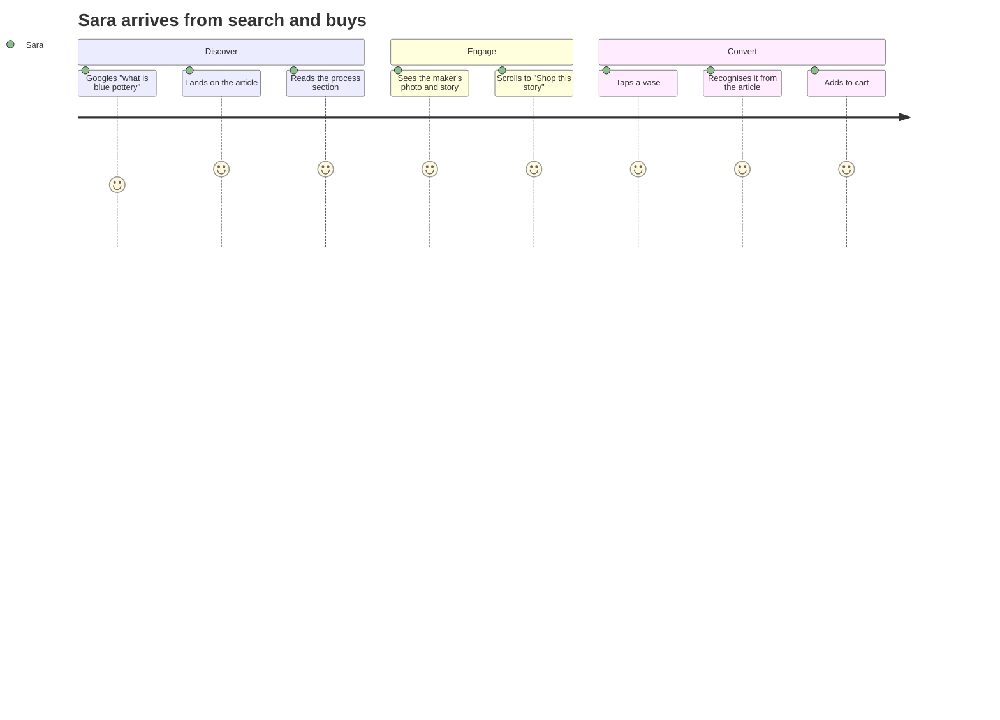
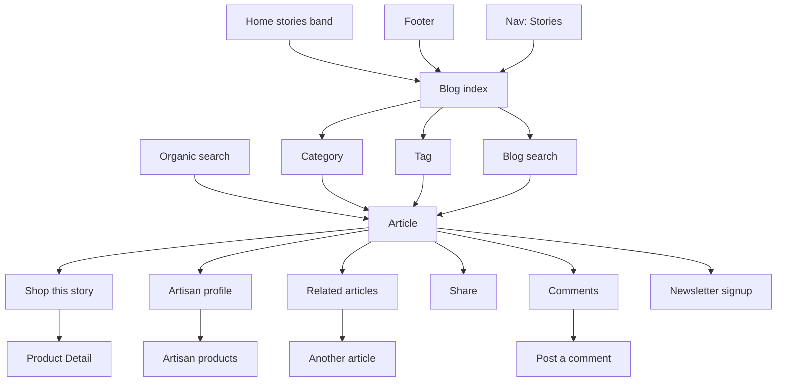
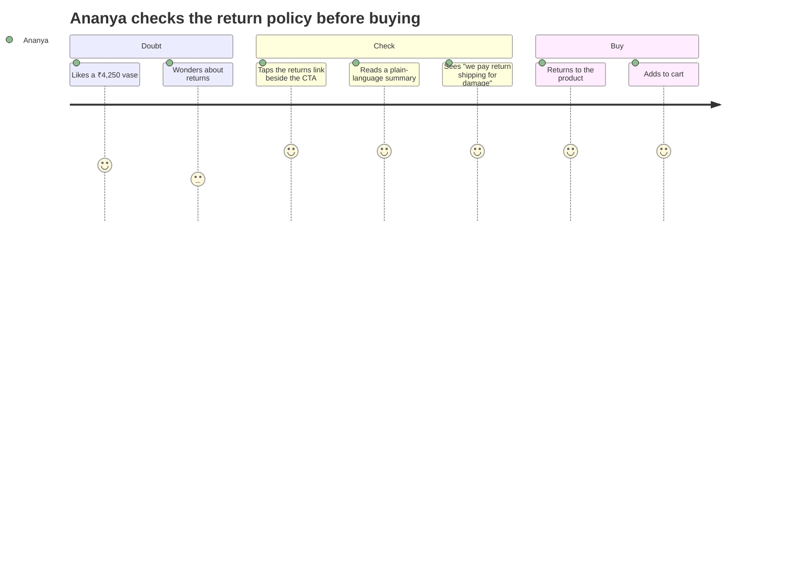
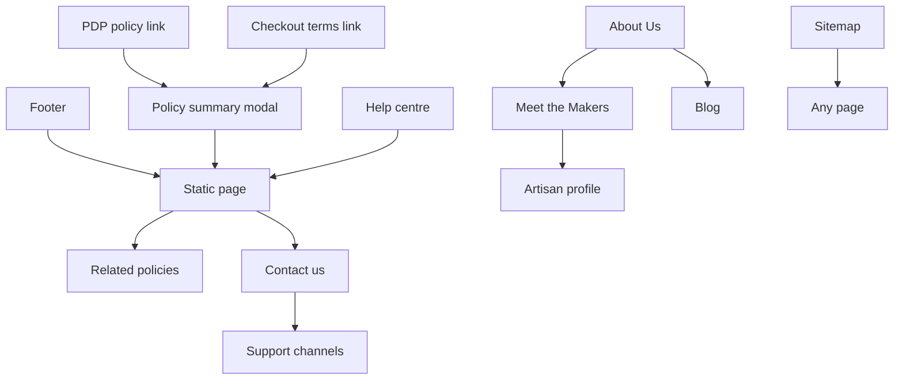

# Modules 18–19 — Blog & Static Pages

Enterprise Handicraft E-Commerce Platform · Customer Website UI/UX Specification

---
---

# MODULE 18 · BLOG

## 18.1 Business Goal

For a handicraft brand, content is not a side channel — it is the mechanism by which a ₹1,250 vase becomes worth ₹1,250. Craft stories, technique explainers, artisan profiles and care guides drive organic acquisition, justify price, and give returning shoppers a reason to visit between purchases. Target: organic traffic +40% YoY; blog → product click ≥18%; blog-attributed revenue ≥6% of total.

## 18.2 Purpose

Publish and surface editorial content — craft stories, maker profiles, care guides, gifting guides, festival explainers — in a format that reads beautifully, ranks well, and routes readers into the catalogue without feeling like an advertisement.

## 18.3 Customer Journey



## 18.4 Navigation Flow



## 18.5 Complete Screen List

| ID | Screen / Overlay | Route | Type |
|----|------------------|-------|------|
| PG-18-01 | Blog index | `/blog` | Page |
| PG-18-02 | Article | `/blog/{slug}` | Page |
| PG-18-03 | Category | `/blog/category/{slug}` | Page |
| PG-18-04 | Tag | `/blog/tag/{slug}` | Page |
| PG-18-05 | Author / Artisan contributor | `/blog/author/{slug}` | Page |
| PG-18-06 | Blog search results | `/blog/search?q=` | Page |
| MOD-18-01 | Image lightbox | — | Full overlay |
| MOD-18-02 | Video lightbox | — | Full overlay |
| MOD-18-03 | Share | — | Popover / sheet |
| MOD-18-04 | Comment form | — | Inline / modal |
| MOD-18-05 | Report a comment | — | Modal SM |
| DRW-18-01 | Table of contents (mobile) | — | Sheet |
| SHT-18-01 | Share sheet | — | Sheet |
| SHT-18-02 | Filter sheet | — | Sheet |

## 18.6 Information Architecture

```
Blog
├── Index
│   ├── Featured article (hero)
│   ├── Category filter chips
│   ├── Article grid
│   └── Newsletter band
├── Categories
│   ├── Craft Stories
│   ├── Meet the Makers
│   ├── Care & Keeping
│   ├── Gifting Guides
│   ├── Festivals & Traditions
│   └── Behind the Scenes
├── Article
│   ├── Hero (cover, title, meta)
│   ├── Body (rich content)
│   ├── Shop this story (embedded products)
│   ├── Artisan card (where relevant)
│   ├── Share
│   ├── Related articles
│   ├── Comments
│   └── Newsletter
└── Author pages
```

## 18.7 Screen Hierarchy

```
Article (PG-18-02)
├── Breadcrumb
├── Hero: category chip, title (H1), excerpt, author, date, reading time, cover image
├── Body with a sticky TOC rail (desktop)
│   ├── Rich text, images, pull quotes, videos
│   └── Inline product embeds
├── Shop this story band
├── Artisan card
├── Share + tags
├── Author bio
├── Related articles (3)
├── Comments
└── Newsletter band
```

## 18.8 Desktop Layout

Index: `SL-01` — featured hero (full width), then a 3-column article grid. Article: `SL-08` (8/4) — content column max 680 for readability, right rail with a sticky TOC, share buttons and a "Shop this story" summary card.

## 18.9 Tablet Layout

Index grid 2-up. Article: content full width (max 680, centred), TOC as a collapsible disclosure beneath the hero, share as a horizontal row.

## 18.10 Mobile Layout

Index: single-column cards with the featured article first. Article: full-width cover, content at 16 px margins, TOC in a sheet triggered by a floating button, share as a sticky bottom bar after 30% scroll, inline product embeds as full-width cards.

## 18.11 Wireframe Description

### Blog index

```
┌──────────────────────────────────────────────────────────────────┐
│ Stories from the Workshop                                         │
│ Craft, makers and the things they make                            │
├──────────────────────────────────────────────────────────────────┤
│ ┌──────────────────────────────────────────────────────────────┐ │
│ │                                                               │ │
│ │        [ full-width cover image 16:9 ]                        │ │
│ │                                                               │ │
│ │  CRAFT STORIES                                                │ │
│ │  The Art of Jaipur Blue Pottery                               │ │
│ │  A craft with no clay in it at all — and nine steps that      │ │
│ │  have barely changed in 400 years.                            │ │
│ │  Vikram Rao · 12 Jun 2026 · 6 min read      [ Read Story → ]  │ │
│ └──────────────────────────────────────────────────────────────┘ │
├──────────────────────────────────────────────────────────────────┤
│ [All] [Craft Stories] [Meet the Makers] [Care & Keeping]          │
│ [Gifting Guides] [Festivals] [Behind the Scenes]      [⌕ Search]  │
├──────────────────────────────────────────────────────────────────┤
│ ┌──────────────┐ ┌──────────────┐ ┌──────────────┐               │
│ │ [cover 16:9] │ │ [cover 16:9] │ │ [cover 16:9] │               │
│ │ MEET THE     │ │ CARE &       │ │ GIFTING      │               │
│ │ MAKERS       │ │ KEEPING      │ │ GUIDES       │               │
│ │ Ram Prasad   │ │ How to care  │ │ 12 handmade  │               │
│ │ has thrown   │ │ for brass    │ │ gifts under  │               │
│ │ 40,000 pots  │ │ without…     │ │ ₹1,500       │               │
│ │ Vikram · 5m  │ │ Nisha · 3m   │ │ Nisha · 4m   │               │
│ └──────────────┘ └──────────────┘ └──────────────┘               │
│ ┌──────────────┐ ┌──────────────┐ ┌──────────────┐               │
│ │      …       │ │      …       │ │      …       │               │
│ └──────────────┘ └──────────────┘ └──────────────┘               │
│                     [ Load More ]                                 │
├──────────────────────────────────────────────────────────────────┤
│ Join the Karigar circle — one story a week, no noise               │
│ [ your@email.com                    ] [ Subscribe ]               │
└──────────────────────────────────────────────────────────────────┘
```

### Article

```
┌──────────────────────────────────────────┬───────────────────────┐
│ Home / Stories / Craft Stories           │                       │
│                                          │ ON THIS PAGE          │
│ CRAFT STORIES                            │ ● Where the blue      │
│ The Art of Jaipur Blue Pottery           │   comes from          │
│                                          │ ○ The nine steps      │
│ A craft with no clay in it at all — and  │ ○ Why no two are      │
│ nine steps that have barely changed in   │   the same            │
│ 400 years.                               │ ○ Caring for it       │
│                                          │                       │
│ ┌────┐ Vikram Rao                        │ SHARE                 │
│ │ 40 │ 12 Jun 2026 · 6 min read          │ [💬][f][X][🔗]        │
│ └────┘                                   │                       │
│                                          │ ┌───────────────────┐ │
│ [ cover image 16:9 ]                     │ │ SHOP THIS STORY   │ │
│ Caption: Ram Prasad at his wheel, Jaipur │ │ [img] Blue Vase   │ │
│                                          │ │       ₹1,250      │ │
│ In the narrow lanes of Jaipur's old      │ │ [img] Bowl Set    │ │
│ city, a craft that travelled from Persia │ │       ₹2,100      │ │
│ in the 14th century is still practised   │ │ [ View all 6 → ]  │ │
│ by fewer than 200 families…              │ └───────────────────┘ │
│                                          │                       │
│ ## Where the blue comes from             │                       │
│ The colour is cobalt oxide, ground by…   │                       │
│                                          │                       │
│ ┌──────────────────────────────────────┐ │                       │
│ │ "If the quartz is wrong, everything  │ │                       │
│ │  after it is wrong."                 │ │                       │
│ │  — Ram Prasad Sharma                 │ │                       │
│ └──────────────────────────────────────┘ │                       │
│                                          │                       │
│ [ image: hands shaping ]                 │                       │
│                                          │                       │
│ ## The nine steps                        │                       │
│ 1. Preparing the dough…                  │                       │
│                                          │                       │
│ ┌─ 🛍 SHOP THIS STORY ─────────────────┐ │                       │
│ │ [card] [card] [card]                 │ │                       │
│ │ Blue Vase  Bowl Set  Diya            │ │                       │
│ │ ₹1,250     ₹2,100    ₹450            │ │                       │
│ └──────────────────────────────────────┘ │                       │
│                                          │                       │
│ ┌─ 🤲 MEET THE MAKER ──────────────────┐ │                       │
│ │ [photo] Ram Prasad Sharma            │ │                       │
│ │         Blue Pottery · Jaipur        │ │                       │
│ │         [Read his story] [Shop]      │ │                       │
│ └──────────────────────────────────────┘ │                       │
│                                          │                       │
│ Tags: (blue pottery)(jaipur)(ceramics)   │                       │
├──────────────────────────────────────────┴───────────────────────┤
│ Related stories                                                   │
│ [card] [card] [card]                                              │
├──────────────────────────────────────────────────────────────────┤
│ Comments (12)                                        [ Sign in ]  │
│ [comment thread]                                                  │
├──────────────────────────────────────────────────────────────────┤
│ NEWSLETTER BAND                                                   │
└──────────────────────────────────────────────────────────────────┘
```

## 18.12 Header

Standard site header with "Stories" in the primary navigation.

## 18.13 Mega Menu / Navigation

Standard. The blog has its own category chip navigation on the index and category pages.

## 18.14 Footer

Full footer.

## 18.15 Breadcrumb

```
Home / Stories
Home / Stories / Craft Stories
Home / Stories / Craft Stories / The Art of Jaipur Blue Pottery
```
Emits BreadcrumbList structured data. Articles also emit Article structured data with author, publish date, modified date and cover image.

## 18.16 Search

Blog search matches title, excerpt, body and tags with typo tolerance. Results show the article card plus a matched snippet. Zero results offers popular articles and a link to product search.

## 18.17 Filters

Index: category chips (single-select), tag pages, author pages. No multi-facet filtering — editorial content does not need it.

## 18.18 Sorting

Newest first (default). Category pages may pin one editorially featured article to the top.

## 18.19 Cards

Article card (SM/MD/LG/Feature), product card (inside "Shop this story"), artisan card, author card, comment card, related-article card.

## 18.20 Widgets

| Widget | Spec |
|--------|------|
| Featured hero | One article, full-width cover, category chip, title, excerpt, author, date, reading time, CTA |
| Category chips | Horizontally scrollable, single-select, with counts |
| Table of contents | Auto-generated from H2s, sticky with scroll-spy (desktop), sheet (mobile) |
| Reading progress | 3 px bar at the top of the viewport, fills as the reader scrolls |
| Shop this story | Product embeds — inline cards mid-article and a summary card in the rail; attributed for revenue tracking |
| Pull quote | Large serif quote with attribution, used sparingly |
| Artisan card | Photo, name, craft, cluster, links to profile and products |
| Share | WhatsApp, Facebook, X, Pinterest, copy link, native share; sticky on mobile after 30% scroll |
| Tags | Chip row linking to tag pages |
| Author bio | Photo, name, role, short bio, other articles |
| Related articles | 3, by tag and category overlap |
| Comments | Threaded one level, sign-in required, moderated |
| Newsletter band | End of every article |

## 18.21 Forms & Fields

| Form | Field | Type | Required | Notes |
|------|-------|------|----------|-------|
| Comment | Comment | Textarea | Yes | 10–1000, counter |
| Comment | Name | Text | Yes if signed out | — |
| Comment | Email | Email | Yes if signed out | Not published |
| Comment | Notify me of replies | Checkbox | No | — |
| Blog search | Query | Search | Yes | — |
| Newsletter | Email | Email | Yes | — |
| Newsletter | Consent | Checkbox | Yes where mandated | Unticked |

## 18.22 Validation Rules

| Rule | Message |
|------|---------|
| Comment length | "Write at least 10 characters" / "Comments are limited to 1,000 characters" |
| Comment links | "Links aren't allowed in comments" |
| Comment profanity | "Please rephrase — we can't publish this language" |
| Comment rate limit | "You've commented several times recently. Try again in a few minutes." |
| Name required | "Enter your name" |
| Email valid | "Enter a valid email address" |
| Newsletter duplicate | "You're already subscribed — thank you!" (treated as success) |
| Search min length | Silent below 2 characters |

## 18.23 Action Buttons

| Button | Type | Placement |
|--------|------|-----------|
| Read Story | Primary MD | Featured hero |
| Load More | Outline LG | Index and category pages |
| Share | Ghost icons / sticky bar | Article |
| Copy link | Ghost | Share menu |
| View all products | Link | Shop this story |
| Read his/her story | Outline MD | Artisan card |
| Shop this maker | Outline MD | Artisan card |
| Post comment | Primary MD | Comment form |
| Reply | Ghost SM | Each comment |
| Report | Ghost SM | Each comment |
| Subscribe | Primary MD | Newsletter band |
| Contents | Floating button | Article (mobile) |

## 18.24 Icons

`newspaper` blog · `clock` reading time · `user-round` author · `tag` tags · `share-2` · `link` copy · `message-circle` comments · `shopping-bag` shop this story · `hand-heart` artisan · `list` table of contents · `chevron-right` related.

## 18.25 Typography & Spacing

| Element | Style |
|---------|-------|
| Article title | `display-xl` (Fraunces) desktop / `display-lg` mobile |
| Article excerpt | `body-xl` |
| Body | `body-lg`, line-height 1.7, max 680 |
| H2 | `heading-lg` (Fraunces) |
| H3 | `heading-md` |
| Pull quote | `display-lg` (Fraunces), `text-craft` |
| Caption | `caption`, `text-tertiary` |
| Author meta | `body-sm` |
| Category chip | `label-sm` |
| Paragraph spacing | 24 |
| Heading top margin | 48 |
| Image margin | 40 vertical |
| Section gap | 64 / 48 |

## 18.26 Images / Video / Carousels

Cover images 1600×900 (also the OG image), ≤80 KB, eager on the article page (**cover is the LCP element**). In-body images up to 1200 px wide, lazy, always with captions and alt text. Full-bleed images may break the content column on desktop for visual rhythm. Video embeds are lazy-loaded with a poster and captions. Image galleries within articles use a lightbox. No autoplaying media.

## 18.27 Pagination

Index and category: 12 articles per page with Load More and a crawlable numbered fallback. Comments: 10 with Load More. Related: fixed at 3.

## 18.28 Empty State

| Case | Treatment |
|------|-----------|
| No articles in a category | "No stories here yet" + browse all + newsletter signup |
| Blog search zero results | "No stories match '{query}'" + popular articles + "Search products instead" |
| No comments | "No comments yet — be the first to share your thoughts" |
| Comments disabled | Section omitted entirely |

## 18.29 Loading State & Skeleton

Index: featured hero skeleton + 6 card skeletons. Article: title and meta render server-side; cover shows a ratio box; body shows 8 line skeletons; TOC builds after content. Comments: 3 skeletons. Shop-this-story: 3 product-card skeletons.

## 18.30 Success State

| Event | Treatment |
|-------|-----------|
| Comment posted | Comment appears optimistically with a "Pending review" chip if moderated; toast confirms |
| Newsletter subscribed | Form replaced by a confirmation with the welcome code |
| Link copied | Toast "Link copied" |
| Shared | Native share sheet or channel opens |

## 18.31 Error State

| Error | Treatment |
|-------|-----------|
| Article not found | 404 with related articles and a blog search field |
| Article fails to load | Error state with Retry |
| Comments fail | Section shows "Couldn't load comments" + Retry; the article is unaffected |
| Comment post fails | Text preserved; inline error; Retry |
| Product embed fails | Embed hidden rather than showing a broken card |
| Newsletter fails | Inline error; email retained |
| Image fails | Placeholder with the caption retained |

## 18.32 Confirmation Dialogs

| Dialog | Content |
|--------|---------|
| Report a comment | Reason radio (Spam, Offensive, Off-topic, Other) + optional detail · Cancel / Report |
| Delete own comment | "Delete your comment?" · Cancel / Delete |
| Leave with unsent comment | "You have an unsent comment." · Stay / Leave |

## 18.33 Notifications

| Trigger | Type | Message |
|---------|------|---------|
| Comment reply | Email + in-app | "Someone replied to your comment" |
| Comment approved | Email | "Your comment is now live" |
| New article (subscribers) | Email | Weekly digest, one story |
| Featured article | Push (opt-in) | "New story: The Art of Jaipur Blue Pottery" |

## 18.34 Micro-interactions & Animation

Reading-progress bar fills smoothly · TOC active item highlights via scroll-spy with a sliding indicator · Images fade in as they enter the viewport · Pull quotes fade and rise on scroll · Product embeds lift on hover · Share sticky bar slides up after 30% scroll on mobile · Comment posts with a brief highlight · Category chips animate their active state · Related-article cards lift on hover.

## 18.35 Accessibility

- One H1 per article; heading hierarchy is strictly maintained and drives the TOC.
- The TOC links are real anchors with visible focus.
- The reading-progress bar is decorative and hidden from assistive technology.
- Images have descriptive alt text; captions are associated with their images.
- Pull quotes use proper blockquote semantics with attribution.
- Product embeds are labelled as products with prices in their accessible names.
- Video embeds have captions and a transcript link.
- Comment threading is announced by nesting level.
- Share buttons name the destination and state that they open externally.
- Article content is fully readable at 400% zoom in single-column reflow.

## 18.36 Responsive Behaviour

| Element | Desktop | Tablet | Mobile |
|---------|---------|--------|--------|
| Index grid | 3-up | 2-up | 1-up |
| Featured hero | Full-width overlay | Full-width | Stacked (image, then text) |
| Article layout | 8/4 with TOC rail | Centred with TOC disclosure | Full-width with TOC sheet |
| Content width | 680 | 680 | Full − 32 |
| Share | Rail (sticky) | Horizontal row | Sticky bottom bar after 30% |
| Product embeds | 3-up cards | 2-up | Full-width stacked |
| Comments | Full | Full | Condensed |
| Category chips | Inline | Scrollable | Scrollable |

## 18.37 Prototype Flow (SP-09 segment)

Home stories band → blog index → category chip → article → scroll (progress bar, TOC follows) → open an in-body image lightbox → close → Shop this story → PDP → back → artisan card → artisan profile → back → share → copy link → newsletter subscribe.

## 18.38 Figma Components & Variants

**Required:** `CMP-CNT-ArticleCard`, `CMP-CNT-Toc`, `CMP-PRD-Card`, `CMP-PRD-ArtisanCard`, `CMP-MED-Image`, `CMP-MED-Lightbox`, `CMP-MED-VideoPlayer`, `CMP-CNT-NewsletterForm`, `CMP-NAV-ChipNav`, `CMP-NAV-Breadcrumb`, `CMP-ACT-ShareMenu`, `CMP-FBK-EmptyState`.

**New to build:**

| Component | Variants |
|-----------|----------|
| `CMP-BLG-FeaturedHero` | Layout (Overlay/Split/Stacked) × Category (6) |
| `CMP-BLG-ArticleHeader` | Cover (Y/N) × Author (Y/N) × Category (6) |
| `CMP-BLG-PullQuote` | Attribution (Y/N) × Size (MD/LG) |
| `CMP-BLG-ShopThisStory` | Layout (Inline band/Rail card) × Products (2/3/4/6) |
| `CMP-BLG-ReadingProgress` | Progress (0/25/50/75/100) |
| `CMP-BLG-AuthorBio` | Size (Compact/Full) |
| `CMP-BLG-CommentCard` | Depth (Top/Reply) × Status (Published/Pending) × Own (Y/N) |
| `CMP-BLG-ShareBar` | Placement (Rail/Row/Sticky) × Channels (4/5/6) |
| `CMP-BLG-InBodyImage` | Width (Column/Wide/Full-bleed) × Caption (Y/N) |

## 18.39 Auto Layout Structure

```
Frame: Article — Desktop 1440 (V, Fill × Hug, gap 0)
├── Shell
├── Instance: ReadingProgress (Fill × 3)   [Fixed top]
├── Instance: Breadcrumb
├── Frame: Body (H, Fill × Hug, gap 40, padding 40, align top)
│   ├── Frame: Content (680 max, V, gap 24)
│   │   ├── Instance: BLG-ArticleHeader
│   │   ├── Instance: MED-Image / Cover (16:9)
│   │   ├── n × rich content blocks
│   │   ├── Instance: BLG-ShopThisStory [Inline band]
│   │   ├── Instance: PRD-ArtisanCard
│   │   └── Frame: Tags (H wrap, gap 8)
│   └── Frame: Rail (300 fixed, V, gap 24)   [Sticky]
│       ├── Instance: CNT-Toc
│       ├── Instance: BLG-ShareBar [Rail]
│       └── Instance: BLG-ShopThisStory [Rail card]
├── Instance: BLG-AuthorBio (Fill × Hug)
├── Frame: Related (H, Fill × Hug, gap 24) → 3 × ArticleCard
├── Frame: Comments (V, Fill × Hug, max 680 centred)
├── Instance: NewsletterForm (Fill × Hug)
└── Footer
```

## 18.40 UX Guidelines · Developer Notes · Analytics · Scalability

### UX Guidelines

| ID | Guideline |
|----|-----------|
| BL-01 | Reading comes first — content width, type size and line height are optimised for reading, not for cramming in products |
| BL-02 | Product embeds appear where they are contextually relevant, not bolted on at the end alone |
| BL-03 | "Shop this story" is honest merchandising, clearly labelled, never disguised as editorial |
| BL-04 | Every article that features a maker links to their profile and products |
| BL-05 | Reading time is shown and accurate |
| BL-06 | Photo credits are given to artisans and photographers |
| BL-07 | Comments are moderated but visible, including critical ones |
| BL-08 | The newsletter ask appears once per article, at the end |
| BL-09 | No pop-ups interrupt reading |
| BL-10 | Articles are fully readable without JavaScript |

### Developer Notes

1. The cover image is the LCP element — server-rendered with a preload hint and `fetchpriority=high`.
2. The TOC is generated from H2 elements at build or render time, not client-side after paint.
3. Product embeds fetch live price and stock; if a product becomes unavailable the embed hides rather than showing a stale card.
4. Attribution: clicks from blog product embeds carry a source parameter feeding a 7-day attribution window.
5. Article structured data includes author, dates, cover image and word count.
6. Comments are rate-limited, moderated by rules plus human review, and support one level of threading only.
7. Content is CMS-managed with a block model; the front end must render unknown block types gracefully by ignoring them.
8. RSS and sitemap entries are generated automatically.

### Analytics Events

`article_view` (slug, category, author) · `article_scroll_depth` (25/50/75/100) · `article_read_complete` (time on page > estimated read time) · `toc_click` (heading) · `product_embed_view` / `_click` (item_id, position) · `artisan_card_click` · `share` (channel, article) · `comment_post` · `related_article_click` · `newsletter_subscribe` (source=blog) · `blog_search` (query, results).

### Future Scalability

Video-first stories and reels · audio versions of long-form articles · artisan-authored posts · seasonal content hubs (Diwali guide, wedding season) · content personalisation by browsing history · shoppable video · reader collections and saved articles · comment reactions · translated articles per locale.

---
---

# MODULE 19 · STATIC PAGES

## 19.1 Business Goal

Static pages carry legal compliance, trust and support deflection. Policy pages are read at the exact moment a shopper is deciding whether to risk a purchase, so their clarity directly affects conversion. "About Us" and the artisan story pages carry the brand's entire differentiation. Target: policy pages viewed by ≥22% of first-time buyers; support contacts about policies reduced by 30%; zero compliance gaps.

## 19.2 Purpose

Publish clear, findable, legally sound and human-readable information about the business, its policies and how to reach it.

## 19.3 Customer Journey



**Key insight:** policy pages are read *during* the purchase decision, not after. They must therefore load fast, open in context where possible, lead with a plain-language summary, and offer a one-tap route back to the product.

## 19.4 Navigation Flow



## 19.5 Complete Screen List

| ID | Screen / Overlay | Route | Type |
|----|------------------|-------|------|
| PG-19-01 | About Us | `/pages/about-us` | Page |
| PG-19-02 | Contact Us | `/contact` | Page |
| PG-19-03 | FAQ | `/pages/faq` | Page |
| PG-19-04 | Privacy Policy | `/pages/privacy-policy` | Page |
| PG-19-05 | Terms & Conditions | `/pages/terms` | Page |
| PG-19-06 | Shipping Policy | `/pages/shipping-policy` | Page |
| PG-19-07 | Return Policy | `/pages/return-policy` | Page |
| PG-19-08 | Refund Policy | `/pages/refund-policy` | Page |
| PG-19-09 | Cookie Policy | `/pages/cookie-policy` | Page |
| PG-19-10 | Sitemap | `/sitemap` | Page |
| PG-19-11 | Meet the Makers | `/artisans` | Page |
| PG-19-12 | Artisan Profile | `/artisans/{slug}` | Page |
| MOD-19-01 | Policy summary (in context) | — | Modal MD |
| MOD-19-02 | Cookie preferences | — | Modal MD |
| MOD-19-03 | Contact form success | — | Modal SM |
| MOD-19-04 | Store locator (future) | — | Modal LG |
| SHT-19-01 | Policy sheet | — | Sheet |
| SHT-19-02 | Cookie preferences sheet | — | Sheet |

## 19.6 Information Architecture

```
Static Pages
├── Brand
│   ├── About Us (story, values, impact, team)
│   ├── Meet the Makers (artisan directory)
│   └── Artisan Profile
├── Support
│   ├── Contact Us
│   └── FAQ
├── Policies (all share one template)
│   ├── Privacy Policy
│   ├── Terms & Conditions
│   ├── Shipping Policy
│   ├── Return Policy
│   ├── Refund Policy
│   └── Cookie Policy
└── Utility
    └── Sitemap
```

## 19.7 Screen Hierarchy

```
Policy page (shared template)
├── Breadcrumb
├── Title + last updated date
├── Plain-language summary card (the key facts in 4 bullets)
├── Table of contents (sticky rail / sheet)
├── Sections (H2 with anchors)
├── Related policies
├── "Still have questions?" support card
└── Footer
```

## 19.8 Desktop Layout

Policies and FAQ: `SL-08` (8/4) — content max 680 with a sticky TOC rail. About Us: `SL-01` full-bleed editorial bands. Contact: `SL-11` split — form on the left, channels and details on the right. Meet the Makers: `SL-01` with a filterable artisan grid. Artisan profile: cover image, then `SL-08`.

## 19.9 Tablet Layout

Content full width (max 680, centred), TOC as a disclosure. About Us bands stack. Contact form above the channel cards. Artisan grid 2-up.

## 19.10 Mobile Layout

Policies: summary card first, TOC in a sheet, sections as accordions (expanded by default for SEO but collapsible for scanning). Contact: channels first, form below — most mobile shoppers want WhatsApp, not a form. Artisan grid single column.

## 19.11 Wireframe Description

### Policy page (shared template)

```
┌──────────────────────────────────────────┬───────────────────────┐
│ Home / Return Policy                     │ ON THIS PAGE          │
│                                          │ ● The short version   │
│ Return Policy                            │ ○ What you can return │
│ Last updated 12 June 2026                │ ○ What you can't      │
│                                          │ ○ How to return       │
│ ┌──────────────────────────────────────┐ │ ○ Refund timing       │
│ │ THE SHORT VERSION                    │ │ ○ Damaged items       │
│ │ ✓ 7 days to return, from delivery    │ │ ○ Contact us          │
│ │ ✓ Free pickup — we arrange it        │ │                       │
│ │ ✓ We pay return shipping if the item │ │ RELATED               │
│ │   arrived damaged or wrong           │ │ • Refund Policy       │
│ │ ✗ Made-to-order and personalised     │ │ • Shipping Policy     │
│ │   pieces can't be returned           │ │ • Terms & Conditions  │
│ │                                      │ │                       │
│ │ Full details below.                  │ │ ┌───────────────────┐ │
│ └──────────────────────────────────────┘ │ │ Still have a      │ │
│                                          │ │ question?         │ │
│ ## What you can return                   │ │ [💬 WhatsApp]     │ │
│ Most items can be returned within 7 days │ │ [✉ Email us]      │ │
│ of delivery, provided they are unused…   │ └───────────────────┘ │
│                                          │                       │
│ ## What you can't return                 │                       │
│ Because each piece is made by hand to    │                       │
│ order, the following can't be returned…  │                       │
│                                          │                       │
│ ## How to return something               │                       │
│ 1. Open the order in your account…       │                       │
│ [ Start a Return ]                       │                       │
│                                          │                       │
│ ## Refund timing                         │                       │
│ …                                        │                       │
├──────────────────────────────────────────┴───────────────────────┤
│ FOOTER                                                            │
└──────────────────────────────────────────────────────────────────┘
```

**The "short version" card is the most important element on every policy page.** It answers the question the shopper actually has, in four bullets, before the legal text begins.

### About Us

```
┌──────────────────────────────────────────────────────────────────┐
│ ╔══════════════════════════════════════════════════════════════╗ │
│ ║  [ full-bleed photograph: artisan hands at a wheel ]          ║ │
│ ║  We sell things made by people whose names we know            ║ │
│ ╚══════════════════════════════════════════════════════════════╝ │
├──────────────────────────────────────────────────────────────────┤
│ Karigar began in a Jaipur courtyard in 2019, when we bought      │
│ eleven blue pottery vases from a man whose family had been       │
│ making them for four generations — and discovered he was         │
│ earning less than the shipping cost.                             │
│                                            [ Read our full story ]│
├──────────────────────────────────────────────────────────────────┤
│  240              18                 ₹4.2 Cr           68%        │
│  artisans      craft clusters      paid to makers    women makers │
├──────────────────────────────────────────────────────────────────┤
│ WHAT WE BELIEVE                                                   │
│ ┌──────────────┐ ┌──────────────┐ ┌──────────────┐               │
│ │ 🤲 Fair pay  │ │ 🌿 Natural   │ │ 📖 Named     │               │
│ │ Makers set   │ │ materials    │ │ makers       │               │
│ │ their prices │ │ Nothing      │ │ Every piece  │               │
│ │              │ │ synthetic    │ │ is credited  │               │
│ └──────────────┘ └──────────────┘ └──────────────┘               │
├──────────────────────────────────────────────────────────────────┤
│ MEET SOME OF OUR MAKERS                            View all →     │
│ [artisan card] [artisan card] [artisan card] [artisan card]       │
├──────────────────────────────────────────────────────────────────┤
│ [ video: how a piece reaches you, 2:40 ]                          │
├──────────────────────────────────────────────────────────────────┤
│ NEWSLETTER BAND                                                   │
└──────────────────────────────────────────────────────────────────┘
```

### Contact Us

```
┌────────────────────────────────────────┬─────────────────────────┐
│ Send us a message                      │ Talk to us              │
│                                        │ ┌─────────────────────┐ │
│ What's this about? *                   │ │ 💬 WhatsApp         │ │
│ [ Choose a topic                    ▾] │ │ Fastest reply       │ │
│                                        │ │ [ Chat now ]        │ │
│ Your name *                            │ └─────────────────────┘ │
│ [                                    ] │ ┌─────────────────────┐ │
│                                        │ │ 📞 +91 98765 43210  │ │
│ Email *                                │ │ Mon–Sat, 10am–7pm   │ │
│ [                                    ] │ └─────────────────────┘ │
│                                        │ ┌─────────────────────┐ │
│ Order number (optional)                │ │ ✉ care@karigar.com  │ │
│ [                                    ] │ │ We reply within 24h │ │
│                                        │ └─────────────────────┘ │
│ Message *                       0/2000 │                         │
│ [                                    ] │ Visit us                │
│ [                                    ] │ Karigar Crafts Pvt Ltd  │
│                                        │ 42 Amber Road           │
│ [📎 Attach a file]                     │ Jaipur, Rajasthan 302002│
│                                        │ [ View on map ]         │
│ [        Send Message        ]         │                         │
│                                        │ GSTIN 08AABCU9603R1ZM   │
└────────────────────────────────────────┴─────────────────────────┘
```

### Artisan profile

```
┌──────────────────────────────────────────────────────────────────┐
│ [ cover photograph: the workshop, 3:1 ]                           │
│                                                                   │
│ ┌────────┐  Ram Prasad Sharma                                     │
│ │ photo  │  Blue Pottery · Jaipur, Rajasthan                      │
│ │ 120    │  ★ 4.8 · 212 pieces · Working since 2006               │
│ └────────┘  [ Shop his work ]                                     │
├──────────────────────────────────────────────────────────────────┤
│ "My grandfather taught my father, my father taught me. The clay   │
│  hasn't changed. Only the hands."                                 │
├──────────────────────────────────────────────────────────────────┤
│ Ram Prasad is a third-generation potter working in the walled     │
│ city of Jaipur. He learned the craft at nine…                     │
├──────────────────────────────────────────────────────────────────┤
│ THE CRAFT                                                         │
│ [process images: 4 steps with captions]                           │
├──────────────────────────────────────────────────────────────────┤
│ HIS PIECES                                                 ‹  ›   │
│ [product rail]                                                    │
├──────────────────────────────────────────────────────────────────┤
│ MORE FROM JAIPUR                                                  │
│ [artisan cards]                                                   │
└──────────────────────────────────────────────────────────────────┘
```

## 19.12 Header

Standard site header on all static pages. Policy modals opened in context (from PDP or checkout) sit above the current page without navigation.

## 19.13 Mega Menu / Navigation

Standard. "Artisans" is a primary navigation item; policies live in the footer and the help centre.

## 19.14 Footer

Full footer. Policy links are grouped under "Policies" and are always one tap away.

## 19.15 Breadcrumb

```
Home / About Us
Home / Return Policy
Home / Artisans
Home / Artisans / Ram Prasad Sharma
Home / Sitemap
```

## 19.16 Search

The FAQ page has its own search, shared with the help centre index. The sitemap page is a structured list, not searchable. Artisan directory has search by name, craft and region.

## 19.17 Filters

Artisan directory: craft, region/cluster, and "has products in stock". FAQ: category chips.

## 19.18 Sorting

Artisan directory: featured (default), name A–Z, most products, highest rated.

## 19.19 Cards

Policy summary card, FAQ accordion item, value card (About), stat block, artisan card, channel card, related-policy card, support card.

## 19.20 Widgets

| Widget | Spec |
|--------|------|
| Plain-language summary | 3–5 bullets with ✓/✗ markers, at the top of every policy page; also used as the content of in-context policy modals |
| Last updated | Date beneath the title on every policy page; a change log link for material changes |
| Table of contents | Auto-generated from H2s, sticky rail (desktop) / sheet (mobile) |
| Related policies | Cross-links between shipping, returns and refunds — shoppers rarely need only one |
| Support card | WhatsApp, email and phone, placed at the foot of every policy page |
| Impact stats | Artisans, clusters, amount paid to makers, share of women makers — updated from real data |
| Values grid | Three to four brand commitments with icons |
| Artisan directory | Filterable grid with search |
| Artisan profile | Cover, portrait, quote, story, process, product rail, cluster peers |
| Cookie preferences | Category toggles with descriptions; Essential locked |
| Sitemap | Grouped links to every indexable section |
| Map | Embedded, lazy-loaded, with a text address alternative |

## 19.21 Forms & Fields

### Contact form

| Field | Type | Required | Notes |
|-------|------|----------|-------|
| Topic | Select | Yes | Order issue, Return/refund, Product question, Bulk enquiry, Press, Partnership, Careers, Other |
| Name | Text | Yes | `name` |
| Email | Email | Yes | `email` |
| Phone | Phone | No | `tel` |
| Order number | Text | No | Shown when the topic is order-related |
| Message | Textarea | Yes | 20–2000, counter |
| Attachment | File | No | Up to 3, ≤10 MB |
| Consent | Checkbox | Yes where mandated | "I agree to Karigar contacting me about this enquiry" |

### Cookie preferences

Essential (locked on), Analytics, Marketing, Personalisation — each a toggle with a plain-language description and a link to the cookie policy.

## 19.22 Validation Rules

| Rule | Message |
|------|---------|
| Topic required | "Choose what this is about" |
| Name required | "Enter your name" |
| Email valid | "Enter a valid email address" |
| Message length | "Tell us a bit more (at least 20 characters)" |
| Message max | "Messages are limited to 2,000 characters" |
| Attachment size | "Each file must be under 10 MB" |
| Attachment count | "You can attach up to 3 files" |
| Order number format | "Order numbers look like HC-2026-000482" |
| Consent required | "Please tick the box so we can reply" |
| Rate limit | "You've sent several messages recently. We'll reply to those first." |

## 19.23 Action Buttons

| Button | Type | Placement |
|--------|------|-----------|
| Send Message | Primary XL | Contact form |
| Chat now (WhatsApp) | Primary MD | Contact channels, policy support card |
| Email us | Outline MD | Channels |
| Call us | Outline MD | Channels (tel:) |
| Start a Return | Primary MD | Return policy, "How to return" section |
| Read our full story | Outline LG | About Us |
| Shop his/her work | Primary MD | Artisan profile |
| View all makers | Outline MD | About Us |
| View on map | Link | Contact |
| Manage cookies | Link | Footer, cookie policy |
| Save preferences | Primary MD | Cookie modal |
| Accept all / Reject all | Primary / Outline (equal weight) | Cookie banner |

## 19.24 Icons

`info` about · `phone` · `mail` · WhatsApp brand mark · `map-pin` address · `file-text` policy · `shield-check` privacy · `truck` shipping · `undo-2` returns · `banknote-arrow-down` refunds · `cookie` cookies · `scale` terms · `list-tree` sitemap · `hand-heart` artisans · `check`/`x` summary markers · `calendar` last updated.

## 19.25 Typography & Spacing

| Element | Style |
|---------|-------|
| Page title | `heading-xl` (Fraunces) |
| Last updated | `body-sm`, `text-tertiary` |
| Summary card heading | `overline` |
| Summary bullet | `body-md` |
| Policy H2 | `heading-lg` |
| Policy body | `body-lg`, line-height 1.7, max 680 |
| About headline | `display-xl` |
| Stat number | `display-lg` tabular |
| Stat label | `body-sm` |
| Artisan quote | `display-lg` (Fraunces), `text-craft` |
| Section gap | 64 / 48 |
| Paragraph spacing | 20 |

## 19.26 Images / Video / Carousels

About Us hero 2400×1000, ≤120 KB, eager. Artisan cover 1920×640, portrait 800×800. Process images 600×600. Contact map is lazy-loaded. About Us video ≤3 min with captions, poster frame, never autoplay. Policy pages carry no imagery — they must be fast and scannable.

## 19.27 Pagination

Artisan directory: 24 per page with Load More. FAQ: all items within a category. Sitemap: full listing, no pagination.

## 19.28 Empty State

| Case | Treatment |
|------|-----------|
| No artisans match a filter | "No makers match these filters" + Clear filters |
| Artisan has no products in stock | Profile still shown with "Currently no pieces available · [Notify me]" |
| FAQ category empty | Category hidden |
| Contact form success | Replaces the form with a confirmation (see §19.30) |

## 19.29 Loading State & Skeleton

Policy pages are server-rendered and need no skeleton — they are static content and must be instant. Artisan directory: 8 card skeletons. Artisan profile: cover ratio box, portrait circle, 6 text lines. Contact map: placeholder with the address until loaded.

## 19.30 Success State

| Event | Treatment |
|-------|-----------|
| Contact form submitted | Form replaced by a confirmation: reference number, expected response time, "We've emailed you a copy", and channel alternatives if it is urgent |
| Cookie preferences saved | Banner dismisses with a toast "Preferences saved" |
| Newsletter subscribed (About page) | Inline confirmation |

## 19.31 Error State

| Error | Treatment |
|-------|-----------|
| Page not found | 404 with a search field and popular links |
| Content fails to load | Error with Retry; policy pages fall back to a cached version with a notice |
| Contact submit fails | Form preserved; inline error; Retry; WhatsApp offered as an alternative |
| Attachment fails | Per-file retry |
| Map fails | Address text remains; map area hidden |
| Artisan not found | "This maker's page isn't available" + directory link |

## 19.32 Confirmation Dialogs

| Dialog | Content |
|--------|---------|
| Leave contact form | "You have an unsent message." · Stay / Leave |
| Reject all cookies | No confirmation — respected immediately |
| Policy change acknowledgement | For material changes, a one-time banner: "We've updated our {policy}. [See what changed]" |

## 19.33 Notifications

| Trigger | Type | Message |
|---------|------|---------|
| Contact form submitted | Email + in-app | "We've got your message · reference SUP-4821" |
| Policy updated (material) | Email to registered customers + in-app banner | "We've updated our Return Policy" |
| Artisan restock (notify me) | Email | "Ram Prasad has new pieces available" |

## 19.34 Micro-interactions & Animation

Summary card check and cross marks draw in on first view · TOC scroll-spy slides the active indicator · About Us stat numbers count up once on scroll into view · Value cards lift on hover · Artisan cards zoom their portrait slightly on hover · Quote blocks fade and rise on scroll · Cookie banner slides up from the bottom without shifting layout · Contact form success cross-fades in place.

## 19.35 Accessibility

- Policy pages use strict heading hierarchy with anchored H2s; the TOC links are real anchors.
- The summary card's ✓/✗ markers include text ("Included" / "Not included"), never symbols alone.
- Last-updated dates are in text, machine-readable via `<time>`.
- The contact form has correct autocomplete, labels and error association.
- The map has a full text alternative (address, hours, directions link).
- Cookie categories have plain-language descriptions; Accept and Reject are equally prominent and equally reachable by keyboard.
- Artisan quotes use blockquote semantics with attribution.
- Video has captions and a transcript.
- Policy content is readable at 400% zoom in single-column reflow.
- Every policy page is reachable from the footer within one tab sequence.

## 19.36 Responsive Behaviour

| Element | Desktop | Tablet | Mobile |
|---------|---------|--------|--------|
| Policy layout | 8/4 with TOC rail | Centred + TOC disclosure | Full-width + TOC sheet |
| Summary card | Full width of the content column | Full | Full |
| Policy sections | Open | Open | Accordions (expanded by default) |
| About bands | Full-bleed | Full-bleed | Stacked |
| Stats | 4-up | 2×2 | 2×2 |
| Contact | Split 6/6 | Stacked, form first | Stacked, channels first |
| Artisan grid | 4-up | 2-up | 1-up |
| Artisan profile | Cover + 8/4 | Stacked | Stacked |

## 19.37 Prototype Flow

PDP → returns link → policy summary modal → "Read full policy" → return policy page → summary card → "How to return" → Start a Return → account order → back. Second flow: footer → About Us → stats → Meet the Makers → artisan profile → Shop his work → PLP.

## 19.38 Figma Components & Variants

**Required:** `CMP-CNT-Toc`, `CMP-CNT-FaqItem`, `CMP-CNT-Table`, `CMP-PRD-ArtisanCard`, `CMP-PRD-Rail`, `CMP-SUP-ChannelCard`, `CMP-INP-*`, `CMP-INP-FileUpload`, `CMP-OVL-CookieConsent`, `CMP-OVL-Modal`, `CMP-FBK-SuccessState`, `CMP-MED-Hero`.

**New to build:**

| Component | Variants |
|-----------|----------|
| `CMP-STA-PolicySummary` | Items (3/4/5) × Tone (Neutral/Positive/Mixed) |
| `CMP-STA-PolicyPage` | TOC (Rail/Disclosure/Sheet) × Sections (5/8/12) |
| `CMP-STA-LastUpdated` | With change log (Y/N) |
| `CMP-STA-ValueCard` | Count (3/4) × Icon set |
| `CMP-STA-StatBlock` | Stats (3/4) × Layout (Row/Grid) |
| `CMP-STA-ArtisanDirectoryCard` | State (Default/Hover) × Stock (Available/None) |
| `CMP-STA-ArtisanProfileHeader` | Cover (Y/N) × Rating (Y/N) |
| `CMP-STA-ContactChannels` | Channels (3/4) × Layout (Column/Row) |
| `CMP-STA-SitemapGroup` | Links (5/10/20) |
| `CMP-STA-PolicyModal` | Policy (6) × Length (Summary/Full) |

## 19.39 Auto Layout Structure

```
Frame: Policy Page — Desktop 1440 (V, Fill × Hug, gap 0)
├── Shell
├── Instance: Breadcrumb
├── Frame: Body (H, Fill × Hug, gap 40, padding 40, align top)
│   ├── Frame: Content (680 max, V, gap 32)
│   │   ├── Frame: Header (V, gap 8) → Title, LastUpdated
│   │   ├── Instance: STA-PolicySummary (Fill × Hug)
│   │   └── n × Frame: Section (V, Fill × Hug, gap 16)
│   │       ├── txt / H2 (with anchor)
│   │       └── txt / Body
│   └── Frame: Rail (300 fixed, V, gap 24)  [Sticky]
│       ├── Instance: CNT-Toc
│       ├── Frame: Related policies
│       └── Instance: SUP-ChannelCard / compact
└── Footer
```

## 19.40 UX Guidelines · Developer Notes · Analytics · Scalability

### UX Guidelines

| ID | Guideline |
|----|-----------|
| ST-01 | Every policy page opens with a plain-language summary before the legal text |
| ST-02 | Policy links near a conversion action open a summary modal, not a full navigation away |
| ST-03 | Last-updated dates are always visible; material changes get a change log |
| ST-04 | Shipping, returns and refunds cross-link — shoppers rarely need only one |
| ST-05 | Every policy page ends with a route to a human |
| ST-06 | About Us leads with a real story and real numbers, not marketing abstraction |
| ST-07 | Artisan profiles are first-class pages with their own products — they are the brand's proof |
| ST-08 | Contact prioritises WhatsApp on mobile, the form on desktop |
| ST-09 | Cookie consent gives Accept and Reject equal prominence; nothing non-essential is pre-ticked |
| ST-10 | Policy pages carry no imagery and no scripts that slow them — they are read under time pressure |

### Developer Notes

1. Policy pages are CMS-managed with versioning; every version is retained and the change log is generated from it.
2. Policy summaries are a distinct CMS field so the same content can render in the in-context modal.
3. Material policy changes trigger an email to registered customers and a one-time site banner.
4. Static pages are cached aggressively at the edge with a short revalidation window.
5. Contact form submissions create support tickets with the same reference scheme as Module 14.
6. Artisan profiles pull live product data; profiles with no available products still render.
7. Cookie consent is enforced before any non-essential script loads; the choice is honoured server-side where relevant.
8. Sitemap is generated from the CMS and catalogue, and also exists as XML for crawlers.

### Analytics Events

`static_page_view` (page) · `policy_summary_view` (policy, source: modal/page) · `policy_section_view` (section) · `policy_to_action` (page → start return / contact) · `contact_form_submit` (topic) · `contact_channel_click` (channel) · `artisan_directory_view` · `artisan_profile_view` (artisan) · `artisan_shop_click` · `cookie_consent` (choice, categories) · `sitemap_click` (destination).

### Future Scalability

Multi-language policy versions with jurisdiction-specific variants · interactive policy tools (a returns eligibility checker rather than prose) · artisan profiles with video introductions and live workshop schedules · impact reporting page with verified data · store locator for physical experience centres · careers section · press kit · B2B/bulk enquiry landing page · accessibility statement with a conformance report.
