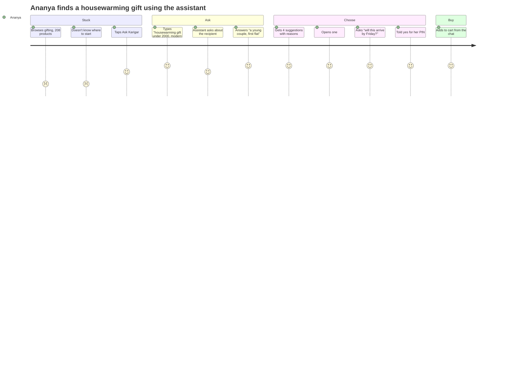
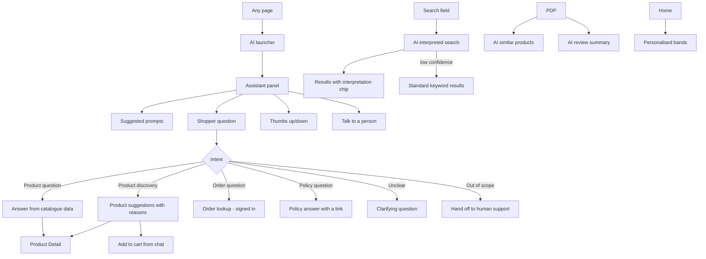

# Module 20 — AI Shopping Features

Enterprise Handicraft E-Commerce Platform · Customer Website UI/UX Specification

---

## 20.1 Business Goal

Handicraft is hard to shop by keyword. Shoppers arrive with intent expressed as occasion, room, feeling or budget — "something for a housewarming, under ₹2,000, not too traditional" — and a conventional filter tree cannot serve that. AI features exist to close the gap between how people describe what they want and how the catalogue is structured, and to compress the research phase for considered purchases.

Target: AI-assisted sessions convert 1.6× baseline; AI search reduces zero-result rate from 3% to under 1%; AI recommendation click-through ≥14%; assistant containment (resolved without human support) ≥55% for product questions.

**Constraint that shapes every decision in this module:** AI is an accelerant, never a gate. Every AI surface has a deterministic fallback, and no purchase path depends on a model responding.

## 20.2 Purpose

Provide five AI-powered capabilities that make a craft catalogue navigable in natural language:

1. **AI Search** — understand intent, not just keywords
2. **AI Shopping Assistant** — conversational help with product context
3. **AI Product Recommendations** — personalised and contextual suggestions
4. **AI Similar Products** — visual and attribute similarity
5. **AI Review Summary** — synthesise what customers actually say
6. **AI Personalised Home** — reorder and select home content per shopper

## 20.3 Customer Journey



**What makes this work:** the assistant explains *why* each piece was suggested ("Clean lines, brass but understated, ₹1,850"), can answer factual questions from the catalogue, and hands off to the real delivery service for the date — it does not guess.

## 20.4 Navigation Flow



## 20.5 Complete Screen List

| ID | Screen / Overlay | Route | Type |
|----|------------------|-------|------|
| PG-20-01 | AI Search results | `/search?q=&ai=1` | Page |
| PG-20-02 | Visual search results | `/search/visual` | Page |
| PG-20-03 | AI Assistant full page (mobile deep link) | `/assistant` | Page |
| PG-20-04 | AI gift finder | `/gift-finder` | Page |
| SEC-20-01 | AI recommendation band (home) | — | Band |
| SEC-20-02 | AI similar products (PDP) | — | Rail |
| SEC-20-03 | AI review summary (PDP) | — | Card |
| SEC-20-04 | AI complete-the-look (PDP/cart) | — | Rail |
| SEC-20-05 | AI search interpretation chip (PLP) | — | Component |
| DRW-20-01 | AI Assistant panel | — | Drawer 420 |
| DRW-20-02 | Visual search upload | — | Drawer |
| DRW-20-03 | AI explain-this-recommendation | — | Drawer 360 |
| SHT-20-01 | AI Assistant sheet (mobile) | — | Sheet 92% |
| SHT-20-02 | Visual search sheet | — | Sheet |
| SHT-20-03 | Voice input sheet | — | Sheet |
| SHT-20-04 | Feedback sheet | — | Sheet |
| MOD-20-01 | AI disclosure / how it works | — | Modal MD |
| MOD-20-02 | Visual search upload | — | Modal MD |
| MOD-20-03 | Voice input | — | Modal SM |
| MOD-20-04 | Feedback on a response | — | Modal SM |
| MOD-20-05 | Report an AI response | — | Modal SM |
| MOD-20-06 | Personalisation settings | — | Modal MD |
| MOD-20-07 | Clear AI history | — | Modal XS |
| MOD-20-08 | AI unavailable | — | Modal SM |

## 20.6 Information Architecture

```
AI Features
├── AI Search
│   ├── Natural-language interpretation
│   ├── Interpretation chip (editable, removable)
│   ├── Extracted filters shown as normal filter chips
│   └── Fallback to keyword search
├── AI Shopping Assistant
│   ├── Launcher (persistent, hidden in checkout)
│   ├── Panel: messages, suggestions, composer
│   ├── Context: current page, cart, PIN, order (signed in)
│   ├── Capabilities: discover, compare, answer, check delivery, track order
│   └── Handoff to human support
├── AI Recommendations
│   ├── Home personalised bands
│   ├── PDP complete-the-look
│   ├── Cart cross-sell
│   └── Post-purchase suggestions
├── AI Similar Products
│   ├── Attribute similarity
│   └── Visual similarity
├── AI Review Summary
│   ├── Themes (positive and negative)
│   └── Links to filtered reviews
└── Controls
    ├── AI disclosure on every surface
    ├── Feedback per response
    ├── Personalisation on/off
    └── Clear AI history
```

## 20.7 Screen Hierarchy

```
AI Assistant (DRW-20-01)
├── Header: title, AI disclosure chip, close
├── Context bar: current page / cart / order (removable)
├── Message list
│   ├── Assistant messages (text, product cards, comparisons)
│   ├── Shopper messages
│   └── System messages (handoff, errors)
├── Suggested prompts (contextual)
├── Composer: text, voice, image
└── Footer disclaimer
```

## 20.8 Desktop Layout

Assistant: right drawer 420 px, full height minus the header, `elevation-3`. Launcher: a pill button bottom-right (16 px inset) reading "✨ Ask Karigar", collapsing to a 56 px circular FAB after first interaction.

AI search results use the standard PLP layout with an interpretation chip row above the toolbar. Similar products and review summary are standard PDP sections.

## 20.9 Tablet Layout

Assistant drawer at 60vw. Launcher FAB. Gift finder as a centred wizard.

## 20.10 Mobile Layout

Assistant opens as a bottom sheet at 92% height with a grab handle, keyboard-aware so the composer stays above the keyboard. Launcher is a FAB above the bottom tab bar, hidden during checkout and while a bottom sheet is open. Voice and image inputs open their own sheets.

## 20.11 Wireframe Description

### AI Assistant panel

```
┌─ ✨ Ask Karigar ─────────────── [ⓘ] [×] ┐
│ AI assistant · answers may not be perfect │
├───────────────────────────────────────────┤
│ Looking at: Blue Pottery Vase      [×]    │
├───────────────────────────────────────────┤
│                                           │
│  ┌──────────────────────────────────────┐ │
│  │ Hi! I can help you find something,   │ │
│  │ answer questions about a piece, or   │ │
│  │ check your order.                    │ │
│  └──────────────────────────────────────┘ │
│                                           │
│  ( Find a gift under ₹2,000 )             │
│  ( What's the difference between blue     │
│    pottery and ceramic? )                 │
│  ( Where's my order? )                    │
│                                           │
│              ┌──────────────────────────┐ │
│              │ Housewarming gift under  │ │
│              │ 2000, modern not         │ │
│              │ traditional              │ │
│              └──────────────────────────┘ │
│                                           │
│  ┌──────────────────────────────────────┐ │
│  │ Happy to help. Is this for a couple, │ │
│  │ a family, or someone living alone?   │ │
│  └──────────────────────────────────────┘ │
│                                           │
│              ┌──────────────────────────┐ │
│              │ A young couple, first    │ │
│              │ flat                     │ │
│              └──────────────────────────┘ │
│                                           │
│  ┌──────────────────────────────────────┐ │
│  │ Here are four pieces that suit a     │ │
│  │ modern first home:                   │ │
│  │                                      │ │
│  │ ┌────────────────────────────────┐   │ │
│  │ │[img] Brass Urli Bowl   ₹1,850  │   │ │
│  │ │ Clean lines, brass but under-  │   │ │
│  │ │ stated. Works as a centrepiece.│   │ │
│  │ │ [ View ]  [ Add to Cart ]      │   │ │
│  │ └────────────────────────────────┘   │ │
│  │ ┌────────────────────────────────┐   │ │
│  │ │[img] Terracotta Planter ₹680   │   │ │
│  │ │ Matte finish, no ornament —    │   │ │
│  │ │ good with plants.              │   │ │
│  │ └────────────────────────────────┘   │ │
│  │ [ See all 12 matches → ]             │ │
│  │                                      │ │
│  │ 👍 👎   Why these?                   │ │
│  └──────────────────────────────────────┘ │
├───────────────────────────────────────────┤
│ [📷] [🎤] [ Ask anything…            ] [→]│
│ AI can make mistakes — check details      │
│ before ordering. [Talk to a person]       │
└───────────────────────────────────────────┘
```

### AI search interpretation on the results page

```
┌──────────────────────────────────────────────────────────────────┐
│ [ ⌕ blue vase under 2000 for a small table              ×  ]     │
├──────────────────────────────────────────────────────────────────┤
│ 18 results                                                        │
│ ✨ We read this as:  (Vases ×) (Colour: Blue ×) (Under ₹2,000 ×)  │
│    (Height under 25 cm ×)                    Search exactly instead│
├──────────────────────────────────────────────────────────────────┤
│ [ standard PLP with filters, sort and grid ]                      │
└──────────────────────────────────────────────────────────────────┘
```

**Every extracted filter becomes a normal, removable filter chip.** The shopper can see exactly what the AI did and undo any part of it. "Search exactly instead" runs a literal keyword search.

### AI review summary (PDP)

```
┌────────────────────────────────────────────────────────┐
│ ✨ What customers say              AI-generated summary │
├────────────────────────────────────────────────────────┤
│ Customers consistently praise the depth of the blue     │
│ and the visible brush strokes. Several note it is       │
│ smaller than they expected — check the dimensions       │
│ before ordering.                                        │
│                                                         │
│ 👍 Loved                                                │
│ ( colour 42 ) ( craftsmanship 38 ) ( packaging 24 )     │
│                                                         │
│ 👎 Mentioned                                            │
│ ( smaller than expected 12 ) ( delivery time 6 )        │
│                                                         │
│ Based on 128 reviews · updated 2 days ago               │
│ Tap a theme to read those reviews.                      │
└────────────────────────────────────────────────────────┘
```

### AI similar products (PDP)

```
┌──────────────────────────────────────────────────────────────────┐
│ ✨ Similar pieces                                          ‹  ›  │
│ Matched on shape, material and price                              │
│ [card]      [card]      [card]      [card]      [card]            │
│ Similar     Same maker  Lighter,    Same shape, Bigger, brass     │
│ shape,      different   ₹400 less   in white                      │
│ ₹200 less   glaze                                                 │
└──────────────────────────────────────────────────────────────────┘
```

Each card carries a one-line reason. Reasons are what make AI recommendations feel intelligent rather than random.

### Gift finder (guided)

```
┌──────────────────────────────────────────────────┐
│ ✨ Find the right gift                            │
│ ●───○───○───○   Step 1 of 4                       │
│                                                   │
│ Who is it for?                                    │
│ ┌──────────┐ ┌──────────┐ ┌──────────┐            │
│ │ Partner  │ │ Parent   │ │ Friend   │            │
│ └──────────┘ └──────────┘ └──────────┘            │
│ ┌──────────┐ ┌──────────┐ ┌──────────┐            │
│ │ Colleague│ │ New home │ │ Wedding  │            │
│ └──────────┘ └──────────┘ └──────────┘            │
│                                                   │
│ [ Skip and browse gifting ]                       │
└──────────────────────────────────────────────────┘
```

Four steps: recipient → occasion → budget → style. Every step is skippable, and the escape hatch to normal browsing is always visible.

## 20.12 Header

The AI launcher is not in the header — it is a floating element so it does not compete with core navigation. The header search field carries the AI capability invisibly; there is no separate "AI search" toggle, because shoppers should not have to choose a search mode.

## 20.13 Mega Menu / Navigation

Unchanged. The gift finder appears as an entry in the Gifting mega-menu panel and on the Gifting category page.

## 20.14 Footer

Unchanged, plus an "How we use AI" link under About, pointing to the disclosure page.

## 20.15 Breadcrumb

AI search results use the standard search breadcrumb. The gift finder uses `Home / Gifting / Gift Finder`.

## 20.16 Search

### AI Search Behaviour

| Aspect | Rule |
|--------|------|
| Trigger | Automatic on every search; no mode toggle |
| Interpretation | Natural-language queries are parsed into structured filters (category, attribute, price, size, occasion, recipient, style) |
| Confidence gate | Interpretation is applied only above a confidence threshold; below it, standard keyword search runs with no AI chip shown |
| Transparency | Every extracted filter renders as a normal removable chip under a "We read this as:" label |
| Escape hatch | "Search exactly instead" always present when interpretation was applied |
| Latency budget | 400 ms; if exceeded, keyword results render first and AI refinement is applied without a layout shift |
| Failure | Silent fallback to keyword search — the shopper never sees an AI error on search |
| Zero results | AI proposes relaxations in plain language ("There's nothing blue under ₹1,000 — here are blue pieces under ₹1,500") |
| Vernacular | Handles transliterated Hindi and regional craft terms |
| Voice | Transcribes then runs the same pipeline |
| Image | Visual similarity search against the catalogue |

## 20.17 Filters

AI does not replace filters — it **populates** them. Extracted constraints appear in the normal filter rail as selected values, so the shopper can adjust them with the tools they already understand. This is the single most important design decision in this module.

## 20.18 Sorting

AI-influenced relevance is the default sort on AI-interpreted searches, labelled "Best match". All standard sort options remain available and, once chosen, switch off AI re-ranking for that result set with a note.

## 20.19 Cards

| Card | Usage |
|------|-------|
| AI suggestion card | In-chat product card with a reason line, View and Add to Cart |
| AI similar card | Standard product card plus a reason line |
| AI recommendation card | Standard product card with a `✨` marker and a reason on hover/tap |
| AI review summary card | Themes with counts, linked to filtered reviews |
| AI comparison table | In-chat side-by-side of 2–3 products |
| Explain card | "Why these?" drawer content listing the signals used |

## 20.20 Widgets

| Widget | Spec |
|--------|------|
| AI launcher | Pill → FAB; `✨` icon; pulses once on first visit only; hidden during checkout and payment |
| AI disclosure chip | `✨ AI-generated` on every AI surface; non-dismissible; links to the disclosure page |
| Context bar | Shows what the assistant can see (current product, cart, PIN, order); each item removable |
| Suggested prompts | 3 contextual chips per surface (home, PLP, PDP, cart, order) |
| Message composer | Text, voice, image; character limit 500; send on Enter, newline on Shift+Enter |
| Streaming response | Token-by-token with a typing indicator; Stop button available |
| Feedback | Thumbs up/down per response; thumbs-down opens a short reason picker |
| "Why these?" | Drawer explaining the signals used (browsing, cart, stated preferences, product attributes) — never exposing other shoppers' data |
| Handoff | "Talk to a person" always visible in the composer footer; carries the conversation into the support channel |
| Personalisation toggle | In account preferences: turn personalised recommendations off; the site then shows editorially curated content |
| Clear AI history | Deletes stored conversations and personalisation signals |

## 20.21 Forms & Fields

| Form | Field | Type | Required | Notes |
|------|-------|------|----------|-------|
| Assistant composer | Message | Textarea (auto-grow, 1–4 rows) | Yes | ≤500 chars |
| Assistant composer | Image | File / camera | No | ≤10 MB, JPG/PNG/WEBP |
| Assistant composer | Voice | Audio capture | No | ≤60 s |
| Gift finder | Recipient | Card select | No (skippable) | 6 options + "Someone else" |
| Gift finder | Occasion | Card select | No | 8 options |
| Gift finder | Budget | Range/preset | No | Under ₹1,000 / ₹1,000–2,500 / ₹2,500–5,000 / Above ₹5,000 |
| Gift finder | Style | Multi-select chips | No | Traditional, Contemporary, Minimal, Colourful, Rustic |
| Feedback | Rating | Thumbs | Yes | — |
| Feedback | Reason | Radio | No | Not relevant, Wrong information, Didn't understand me, Unhelpful tone, Other |
| Feedback | Detail | Textarea | No | ≤300 |
| Report | Reason | Radio | Yes | Incorrect, Inappropriate, Unsafe, Other |

## 20.22 Validation Rules

| Rule | Message |
|------|---------|
| Message empty | Send disabled; no error |
| Message too long | "Keep it under 500 characters" with a live counter from 450 |
| Image size | "Image is too large. Maximum 10 MB." |
| Image type | "Use a JPG, PNG or WEBP image" |
| Voice permission denied | "We need microphone access. [Type instead]" |
| Voice no speech | "We didn't catch that. [Try again] or [Type instead]" |
| Rate limit | "You've asked a lot of questions — take a breath and try again in a minute." |
| Out of scope | "I can help with products, orders and policies. For anything else, [talk to a person]." |
| Low confidence | Assistant asks a clarifying question rather than guessing |
| Unavailable | "The assistant isn't available right now. [Search] or [talk to a person]." |
| Signed-out order query | "Sign in and I can look up your order." |
| Sensitive request | Refuses payment-detail collection or account changes; routes to the secure flow |

## 20.23 Action Buttons

| Button | Type | Placement |
|--------|------|-----------|
| Ask Karigar | Launcher pill / FAB | Floating, all pages except checkout |
| Send | Icon button | Composer |
| Stop generating | Ghost SM | During streaming |
| Voice input | Icon | Composer |
| Image input | Icon | Composer |
| Suggested prompt | Chip | Message list |
| View | Ghost SM | Suggestion card |
| Add to Cart | Primary SM | Suggestion card |
| See all matches | Link | After suggestions |
| Why these? | Link | Below suggestions |
| 👍 / 👎 | Ghost icons | Each assistant response |
| Talk to a person | Link | Composer footer |
| Search exactly instead | Link | AI interpretation chip row |
| Clear conversation | Ghost | Panel `⋮` |
| How this works | Icon `ⓘ` | Panel header |

## 20.24 Icons

`sparkles` AI (used consistently and exclusively for AI surfaces) · `message-circle` assistant · `mic` voice · `camera` image · `send` · `square` stop · `thumbs-up`/`thumbs-down` feedback · `circle-help` disclosure · `flag` report · `user-round` human handoff · `wand-sparkles` gift finder · `image-search` visual search · `trash-2` clear history.

**Rule:** `sparkles` is reserved for AI. It is never used decoratively anywhere else in the product, so shoppers learn to read it as "this was generated".

## 20.25 Typography & Spacing

| Element | Style |
|---------|-------|
| Panel title | `heading-sm` |
| Disclosure line | `body-xs`, `text-tertiary` |
| Assistant message | `body-md`, line-height 1.6 |
| Shopper message | `body-md` |
| Suggestion reason | `body-sm`, `text-secondary`, italic |
| Suggested prompt chip | `label-md` |
| Composer input | `body-md` |
| Footer disclaimer | `body-xs`, `text-tertiary` |
| Message max width | 85% of the panel |
| Message gap | 16 |
| Panel padding | 16 |
| Bubble padding | 12×16 |
| Bubble radius | `radius-lg` with a 4 px corner on the sender side |

## 20.26 Images / Video / Carousels

In-chat product cards use 64×64 thumbnails. Visual search shows the uploaded image at 120 px as a removable chip. Similar-product rails use standard card images. No video in AI surfaces. Uploaded images are compressed client-side to ≤1600 px before sending.

## 20.27 Pagination

Assistant suggestions cap at 4 per response with "See all N matches" routing to a real PLP. Conversation history loads 20 messages with infinite scroll upward. Similar products cap at 12.

## 20.28 Empty State

| Case | Treatment |
|------|-----------|
| First open | Greeting + capability summary + 3 contextual suggested prompts |
| No suggestions found | "I couldn't find anything matching that. Want to try a wider budget, or [browse gifting]?" |
| Visual search no match | "I couldn't find anything close to that image. [Try another photo] or [describe it instead]" |
| No personalisation data | Home shows editorially curated bands; no empty AI band ever renders |
| Not enough reviews for a summary | Summary card omitted below 10 reviews |
| Conversation cleared | Back to the greeting state |

## 20.29 Loading State & Skeleton

| Surface | Treatment |
|---------|-----------|
| Assistant thinking | Typing indicator (three animated dots) with "Looking through the catalogue…" after 2 s |
| Streaming | Text appears token by token; a Stop button is available throughout |
| Suggestion cards | Skeleton cards appear before the products resolve |
| AI search | Results render from keyword search first; the AI chip appears when interpretation completes, without shifting layout |
| Similar products | 5 card skeletons |
| Review summary | 3 text-line skeletons with the label already visible |
| Visual search | Uploaded image shown with "Finding similar pieces…" and a progress indicator |
| Personalised home bands | Reserved height with a skeleton so no layout shift occurs when they resolve |

## 20.30 Success State

| Event | Treatment |
|-------|-----------|
| Suggestions delivered | Cards animate in with a 60 ms stagger, each with its reason |
| Added to cart from chat | Card shows an "In your cart" chip; cart badge pops; a toast confirms |
| Question answered | Answer plus a link to the source (product page or policy) |
| Order looked up | Compact order card with status and a Track action |
| Feedback given | Thumbs fills; "Thanks — this helps" appears inline |
| Gift finder complete | Results page with the selected criteria shown as removable chips |

## 20.31 Error State

| Error | Treatment |
|-------|-----------|
| AI service unavailable | Launcher hidden or disabled with a tooltip; search silently falls back to keyword; recommendation bands fall back to bestsellers. **No AI error is ever shown on a purchase path.** |
| Response timeout | "That's taking longer than expected. [Try again] or [talk to a person]." |
| Response failed mid-stream | Partial text retained with "Something went wrong. [Regenerate]" |
| Rate limited | Friendly message with a wait time |
| Image processing failed | "I couldn't read that image. [Try another] or [describe it]" |
| Voice failed | "I didn't catch that. [Try again] or [type instead]" |
| Hallucination reported | Response marked with a correction notice after review; the shopper who reported it is thanked |
| Out-of-scope request | Clear boundary statement with the human handoff |
| Signed-out for order lookup | Sign-in prompt inline; the conversation is preserved through sign-in |

## 20.32 Confirmation Dialogs

| Dialog | Content |
|--------|---------|
| Clear conversation | "Clear this conversation? Your cart and account aren't affected." · Cancel / Clear |
| Clear AI history & personalisation | "Delete your AI history and personalisation data? Recommendations will reset to general ones." · Cancel / Delete |
| Turn off personalisation | "Turn off personalised recommendations? You'll see the same content as everyone else." · Cancel / Turn Off |
| Report a response | Reason radio + optional detail + "We'll review this" · Cancel / Report |

## 20.33 Notifications

AI features generate no push or email notifications by default. The only exception is an opt-in "we found something you might like" weekly email, which is a marketing message governed by Module 17 preferences and is off by default.

## 20.34 Micro-interactions & Animation

Launcher pulses once on first visit, never again · Panel slides in 350 ms with the composer focused · Typing indicator dots animate in sequence · Response text streams in with a soft cursor · Suggestion cards stagger in at 60 ms intervals · Thumbs fill on tap with a small scale pop · The AI disclosure chip has a subtle shimmer on first render only · Search interpretation chips animate into the filter bar so the connection between AI and filters is visually explicit · Reserved-height personalised bands cross-fade from skeleton to content · Stop button appears immediately when streaming begins.

## 20.35 Accessibility

- The assistant panel is a labelled dialog with focus trapped and returned on close.
- The message list is a polite live region; each new assistant message is announced once, not per token.
- Streaming responses announce only when complete, to avoid unusable screen-reader output.
- The typing indicator is announced once as "Assistant is typing".
- Every AI surface carries the disclosure in **text**, not only as an icon.
- Suggestion cards expose the reason in their accessible name ("Brass Urli Bowl, one thousand eight hundred and fifty rupees, suggested because it has clean lines and works as a centrepiece").
- Feedback buttons are labelled with the response they refer to.
- Voice input announces its state changes; a text alternative is always present.
- Image input has a text-description alternative.
- The interpretation chip row is announced with the extracted filters and the escape hatch.
- The Stop button is keyboard reachable during streaming.
- Reduced motion disables streaming animation (text appears in complete blocks) and all shimmer.

## 20.36 Responsive Behaviour

| Element | Desktop | Tablet | Mobile |
|---------|---------|--------|--------|
| Launcher | Pill bottom-right → FAB | FAB | FAB above the tab bar |
| Assistant | Right drawer 420 | Right drawer 60vw | Bottom sheet 92% |
| Composer | Single row, grows to 4 | Same | Keyboard-aware, sticky above the keyboard |
| Suggestion cards | 1-up in panel | 1-up | 1-up, full width |
| Similar products | 5 across | 3.5 | 2.2 swipe |
| Review summary | Full card | Full card | Full card, themes wrap |
| Gift finder | Centred wizard 720 | Centred | Full-page steps |
| Visual search | Modal | Modal | Sheet with camera |
| Interpretation chips | Inline row | Inline row | Scrollable row |

## 20.37 Prototype Flow (SP-09)

Home → launcher → panel opens with prompts → tap "Find a gift under ₹2,000" → assistant asks a clarifying question → answer → suggestions with reasons stream in → tap "Why these?" → explanation drawer → back → Add to Cart from a card → toast + badge → ask "will it arrive by Friday?" → delivery answer → "See all matches" → PLP with interpretation chips → remove one chip → results update.

Second flow: PDP → review summary → tap a negative theme → filtered reviews → back → similar products rail → open a suggestion.

## 20.38 Figma Components & Variants

**Required:** `CMP-AI-Launcher`, `CMP-AI-ChatPanel`, `CMP-AI-Message`, `CMP-AI-Suggestion`, `CMP-AI-Disclosure`, `CMP-PRD-Card`, `CMP-PRD-Rail`, `CMP-REV-AiSummary`, `CMP-OVL-Drawer`, `CMP-OVL-BottomSheet`, `CMP-FLT-Chip`, `CMP-FBK-Skeleton`.

**New to build:**

| Component | Variants |
|-----------|----------|
| `CMP-AI-LauncherPill` | State (Pill/FAB) × Attention (Idle/Pulse) × Breakpoint |
| `CMP-AI-MessageBubble` | Sender (Assistant/Shopper/System) × Content (Text/Products/Comparison/Order/Error) × State (Streaming/Complete) |
| `CMP-AI-SuggestionCard` | Reason (Y/N) × Actions (View/View+Cart) × State (Default/In cart/Unavailable) |
| `CMP-AI-TypingIndicator` | State (Thinking/Searching/Long wait) |
| `CMP-AI-ContextBar` | Context (Product/Cart/Order/PIN/Multiple) × Removable |
| `CMP-AI-PromptChips` | Count (2/3/4) × Surface (Home/PLP/PDP/Cart/Order) |
| `CMP-AI-InterpretationChips` | Filters (1/2/3/4) × Confidence (High/Medium) |
| `CMP-AI-FeedbackRow` | State (Unrated/Up/Down/Reason open) |
| `CMP-AI-ExplainDrawer` | Signals (2/3/4) |
| `CMP-AI-ReviewSummary` | Themes (Positive only/Both) × Length (Short/Long) |
| `CMP-AI-VisualSearch` | State (Empty/Uploading/Processing/Results/No match/Error) |
| `CMP-AI-GiftFinderStep` | Step (1/2/3/4) × Options (3/6/8) |
| `CMP-AI-UnavailableState` | Surface (Assistant/Search/Recommendations) |

## 20.39 Auto Layout Structure

```
Component: AI-ChatPanel (V, 420 × Fill, gap 0, elevation-3)
├── Frame: Header (H, Fill × 64, padding 16, space-between)
│   ├── Frame: Title (H, gap 8) → icon sparkles, txt Title
│   └── Frame: Actions (H, gap 8) → IconButton ⓘ, IconButton ×
├── txt / Disclosure line (Fill × Hug, padding 0 16 8)
├── Instance: AI-ContextBar (Fill × 40)          [conditional]
├── Frame: Messages (V, Fill × Fill, gap 16, padding 16, scroll)
│   ├── n × Instance: AI-MessageBubble (Hug max 85%)
│   ├── Instance: AI-PromptChips (Fill × Hug)     [conditional]
│   └── Instance: AI-TypingIndicator              [conditional]
└── Frame: Composer (V, Fill × Hug, gap 8, padding 12 16 16)
    ├── Frame: Input row (H, Fill × Hug, gap 8)
    │   ├── IconButton camera
    │   ├── IconButton mic
    │   ├── Textarea (Fill, auto-grow 1–4 rows)
    │   └── IconButton send
    └── txt / Footer disclaimer + "Talk to a person"
```

## 20.40 UX Guidelines · Developer Notes · Analytics · Scalability

### UX Guidelines

| ID | Guideline |
|----|-----------|
| AI-01 | **AI is never a gate.** Every purchase path works fully with AI disabled or unavailable |
| AI-02 | Every AI-generated surface is labelled in text with `✨ AI-generated`; the label is not dismissible |
| AI-03 | The `sparkles` icon is reserved exclusively for AI and never used decoratively |
| AI-04 | AI search populates real, removable filters — the shopper sees and controls what was inferred |
| AI-05 | "Search exactly instead" is always available when interpretation was applied |
| AI-06 | Recommendations always carry a reason; a suggestion without an explanation is not shipped |
| AI-07 | The review summary must include negative themes when they exist — a purely positive summary is a trust failure |
| AI-08 | The assistant never collects payment details, changes account settings or places an order without the shopper going through the normal flow |
| AI-09 | "Talk to a person" is visible at all times, never buried behind failed attempts |
| AI-10 | The assistant asks a clarifying question rather than guessing when confidence is low |
| AI-11 | Factual claims (price, stock, delivery date, policy) come from the system of record, never from the model's memory |
| AI-12 | The launcher is hidden during checkout and payment — nothing may distract from completion |
| AI-13 | Personalisation is disclosed, explainable and switchable off, with history deletable |
| AI-14 | Failures degrade silently on conversion surfaces and explicitly only inside the assistant |
| AI-15 | Feedback is collected on every response and visibly acted upon |

### Developer Notes

1. **Grounding is mandatory.** The assistant answers product, price, stock, delivery and policy questions only from retrieved catalogue and CMS data, with the source linked. Ungrounded generation on factual questions is prohibited.
2. Delivery dates, stock and prices are fetched live at answer time from the same services used by PDP and checkout — never cached in the model context beyond the request.
3. Streaming responses must be cancellable; the Stop button aborts the request server-side.
4. Latency budgets: search interpretation 400 ms (else fall back), first assistant token 1.5 s, similar products 600 ms, review summary is pre-computed and cached.
5. The review summary is generated as a batch job, cached, and regenerated when review volume changes by 10% or after 7 days; the "updated" date shown is real.
6. Personalisation signals are stored per account (or per device for guests), are listable and deletable, and are excluded when personalisation is off.
7. Rate limiting per session and per account, with a friendly message rather than a raw error.
8. All AI interactions are logged with the prompt, response, grounding sources and feedback, for quality review and for responding to reports.
9. Prompt-injection defence: content retrieved from reviews or CMS is treated as data, never as instructions.
10. The assistant must refuse and route to secure flows for: payment details, password changes, address changes affecting a dispatched order, and anything involving another customer's data.
11. Guest conversations are stored for 30 days on the device; signed-in conversations sync and appear in data exports.
12. Feature flags allow every AI surface to be disabled independently without a release.

### Analytics Events

`ai_launcher_view` / `ai_launcher_click` (source page) · `ai_session_start` · `ai_message_sent` (length, has_image, has_voice) · `ai_response` (intent, latency, grounded, suggestion_count) · `ai_suggestion_click` (item_id, position) · `ai_add_to_cart` (item_id) · `ai_feedback` (rating, reason) · `ai_handoff_human` (turn_count) · `ai_search_interpreted` (filters_extracted, confidence) · `ai_search_exact_fallback` · `ai_similar_click` (item_id, source_item) · `ai_review_summary_view` / `_theme_click` (theme, sentiment) · `ai_personalised_band_view` / `_click` · `ai_visual_search` (success) · `ai_gift_finder_step` / `_complete` · `ai_unavailable` (surface) · `ai_report` (reason).

**Quality metrics tracked continuously:** grounding rate, hallucination reports per 1,000 responses, containment rate, suggestion click-through, thumbs-down rate by intent, and fallback frequency.

### Future Scalability

Multimodal room-photo styling ("what would go with this room?") · AR placement combined with recommendations · voice-first shopping in Hindi and regional languages · proactive assistance (offering help when a shopper stalls on a PDP for 90 seconds) · AI-assisted size and scale guidance from a photo · generative gift-message writing · artisan-matching ("find me a maker whose work looks like this") · AI-drafted review summaries per theme cluster · agentic reordering for consumables · post-purchase care assistant answering "how do I clean this?" from the order.
