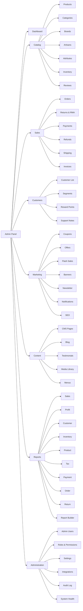

# 01 — Product Foundations

Enterprise Handicraft E-Commerce Platform · UI/UX Design Specification

---

## 1. Business Context

### 1.1 What This Platform Sells

Handmade and artisan-crafted goods: home décor, textiles, pottery, metalwork, woodcraft, jewellery, festive/ritual items, and gifting collections. Products carry attributes that mass retail does not: **artisan attribution, craft technique, material provenance, country/region of origin, natural variation disclaimers, and made-to-order lead times**.

### 1.2 Commercial Objectives

| ID | Objective | UX Implication |
|----|-----------|----------------|
| BG-01 | Reduce catalog time-to-publish from days to under 20 minutes per product | Guided product wizard, bulk import, image auto-processing, template cloning |
| BG-02 | Achieve <2% order-processing error rate | Strong order state machine UI, mandatory checkpoints, print-verify flows |
| BG-03 | Keep stockouts on bestsellers below 3% | Low-stock widgets, reorder alerts, threshold config, purchase entry flow |
| BG-04 | Increase repeat purchase rate via targeted promotions | Coupons, offers, flash sales, newsletter segments, reward points |
| BG-05 | Support festival-driven demand spikes (Diwali, Christmas, Eid, Navratri) | Scheduled offers/banners, flash sale scheduler, bulk price update, capacity dashboards |
| BG-06 | Preserve artisan story as a conversion asset | Artisan entity, craft cluster grouping, storytelling fields, media-rich product pages |
| BG-07 | Full financial auditability (GST, tax, refunds) | Immutable invoice numbering, refund audit trail, tax reports, settlement reconciliation |
| BG-08 | Operate with a small team across many roles | Role-based UI, saved views, bulk actions, keyboard-first design |

### 1.3 Success Metrics (Design-Owned)

| Metric | Target |
|--------|--------|
| Time to create a simple product | ≤ 3 min |
| Time to create a variant product (12 variants) | ≤ 12 min |
| Clicks to fulfil a standard order | ≤ 6 |
| Time to locate any order by any identifier | ≤ 10 s |
| Admin task success rate (unmoderated test) | ≥ 95% |
| SUS score | ≥ 80 |
| WCAG 2.1 AA automated pass rate | 100% |

---

## 2. Personas

### 2.1 Persona Cards

#### P-01 · Super Admin — "Ravi, Owner-Operator"
- **Context:** Owns the business. Logs in 3–5×/day, often on tablet or phone.
- **Needs:** Financial truth at a glance, exception alerts, ability to unblock anyone.
- **Frustrations:** Reports that don't reconcile; having to ask staff for numbers.
- **Design response:** Executive dashboard, profit widgets, drill-through everywhere, mobile-first dashboard, global impersonation & override.

#### P-02 · Admin — "Priya, Operations Head"
- **Context:** Runs day-to-day. 8h/day at a 1440px desktop.
- **Needs:** Cross-module oversight, user administration, settings control.
- **Design response:** Dense tables, saved views, bulk actions, audit log access.

#### P-03 · Product Manager — "Anand, Catalog Lead"
- **Context:** Adds 20–60 products/week, manages photography handoff.
- **Needs:** Fast repeated data entry, cloning, bulk edit, media management, SEO fields.
- **Frustrations:** Re-typing shared attributes; losing work on long forms.
- **Design response:** Product wizard + tabbed editor, "Save & Add Another", clone, autosave, bulk import with dry-run.

#### P-04 · Inventory Manager — "Sunita, Warehouse"
- **Context:** On a warehouse floor terminal + handheld scanner. Gloves, poor lighting.
- **Needs:** Barcode-driven flows, large tap targets, minimal typing, offline-tolerant messaging.
- **Design response:** Scan-first screens, 48px targets, high-contrast mode, big numeric steppers, audible/visual scan feedback.

#### P-05 · Order Manager — "Karan, Fulfilment"
- **Context:** Processes 150–400 orders/day. Lives in one screen.
- **Needs:** Queue view, keyboard shortcuts, batch print, status transitions, exception handling.
- **Design response:** Order queue with sticky filters, split-pane quick view, bulk status change, batch label/invoice print, shortcut palette.

#### P-06 · Marketing Manager — "Nisha, Growth"
- **Context:** Campaign bursts around festivals.
- **Needs:** Scheduling, previews, coupon performance, segment building.
- **Design response:** Scheduler with timeline view, device previews, campaign performance widgets, audience builder.

#### P-07 · Finance Manager — "Deepak, Accounts"
- **Context:** Month-end close, GST filing.
- **Needs:** Exportable, reconcilable, immutable records.
- **Design response:** Report builder, export queue, settlement reconciliation, refund approval workflow, locked periods.

#### P-08 · Customer Support — "Meera, CX"
- **Context:** On a call with a customer; needs answers in seconds.
- **Needs:** Universal search, 360° customer view, order timeline, safe limited actions.
- **Design response:** Global omni-search (order ID / phone / email / AWB), customer 360 drawer, read-mostly permissions with request-approval escalation.

#### P-09 · Content Manager — "Vikram, Content"
- **Context:** CMS pages, blog, testimonials, review moderation.
- **Needs:** Rich editor, media library, preview, scheduled publish, revision history.
- **Design response:** Block/rich editor with live preview, media picker, version history diff, publish scheduler.

### 2.2 Persona × Module Heat Map

| Module | Ravi | Priya | Anand | Sunita | Karan | Nisha | Deepak | Meera | Vikram |
|--------|:----:|:-----:|:-----:|:------:|:-----:|:-----:|:------:|:-----:|:------:|
| Dashboard | ●●● | ●●● | ●● | ●● | ●● | ●● | ●● | ● | ● |
| Users | ●● | ●●● | – | – | – | – | – | ● | – |
| Products | ● | ●● | ●●● | ●● | ● | ●● | – | ● | ● |
| Categories | – | ●● | ●●● | – | – | ●● | – | – | ● |
| Inventory | ● | ●● | ●● | ●●● | ●● | – | ● | ● | – |
| Orders | ●● | ●●● | – | ●● | ●●● | – | ●● | ●●● | – |
| Payments | ●● | ●● | – | – | ●● | – | ●●● | ●● | – |
| Shipping | ● | ●● | – | ●● | ●●● | – | ● | ●● | – |
| Coupons | ● | ●● | ● | – | – | ●●● | ● | ● | – |
| Offers | ● | ●● | ●● | – | – | ●●● | ● | – | – |
| Banners | ● | ● | – | – | – | ●●● | – | – | ●● |
| CMS | – | ● | – | – | – | ●● | – | – | ●●● |
| Blog | – | ● | – | – | – | ●● | – | – | ●●● |
| Reviews | ● | ●● | ●● | – | – | ●● | – | ●● | ●●● |
| Testimonials | – | ● | – | – | – | ●● | – | – | ●●● |
| Newsletter | – | ● | – | – | – | ●●● | – | – | ●● |
| Notifications | ● | ●●● | – | ● | ●● | ●● | – | ●● | – |
| Reports | ●●● | ●●● | ●● | ●● | ●● | ●● | ●●● | ● | – |
| SEO | – | ● | ●● | – | – | ●●● | – | – | ●●● |
| Settings | ●●● | ●●● | – | – | – | ● | ●● | – | – |

● Occasional ●● Regular ●●● Primary

---

## 3. Information Architecture

### 3.1 Top-Level Navigation Tree



### 3.2 Sidebar Grouping (Final, Build This)

| Group | Order | Items | Icon |
|-------|-------|-------|------|
| — (ungrouped) | 1 | Dashboard | `layout-dashboard` |
| **CATALOG** | 2 | Products, Categories, Brands, Artisans, Attributes, Inventory, Reviews | `package` |
| **SALES** | 3 | Orders, Returns, Payments, Refunds, Shipping, Invoices | `shopping-cart` |
| **CUSTOMERS** | 4 | Customers, Segments, Reward Points | `users` |
| **MARKETING** | 5 | Coupons, Offers, Flash Sales, Banners, Newsletter, Notifications, SEO | `megaphone` |
| **CONTENT** | 6 | CMS Pages, Blog, Testimonials, Media Library, Menus | `file-text` |
| **REPORTS** | 7 | All Reports, Report Builder, Scheduled Exports | `bar-chart-3` |
| **ADMINISTRATION** | 8 | Admin Users, Roles & Permissions, Settings, Integrations, Audit Log, System Health | `settings` |

**Rules**
- Group headers are non-clickable labels (11px, uppercase, letter-spacing 0.08em, `--color-text-tertiary`).
- Groups render only if the role has ≥1 visible child.
- Max 2 levels of nesting. Level-3 navigation lives in page tabs, never in the sidebar.
- Active item: 3px left accent bar + tinted background + `--color-text-brand` label.
- Parent auto-expands when a child is active; expansion state persists per user in localStorage.

### 3.3 URL Map (Prototype Link Targets)

| Area | Route |
|------|-------|
| Dashboard | `/admin` |
| Products | `/admin/products` |
| Product Create | `/admin/products/create` |
| Product Edit | `/admin/products/{id}/edit` |
| Categories | `/admin/categories` |
| Inventory | `/admin/inventory` |
| Orders | `/admin/orders` |
| Order Detail | `/admin/orders/{id}` |
| Payments | `/admin/payments` |
| Shipping | `/admin/shipping/zones` |
| Coupons | `/admin/coupons` |
| Offers | `/admin/offers` |
| Banners | `/admin/banners` |
| CMS | `/admin/cms/pages` |
| Blog | `/admin/blog/posts` |
| Reviews | `/admin/reviews` |
| Testimonials | `/admin/testimonials` |
| Newsletter | `/admin/newsletter/subscribers` |
| Notifications | `/admin/notifications/templates` |
| Reports | `/admin/reports` |
| SEO | `/admin/seo/meta` |
| Settings | `/admin/settings/company` |
| Profile | `/admin/profile` |
| Login | `/admin/login` |

---

## 4. The Application Shell

### 4.1 Shell Anatomy (Desktop ≥1280px)

```
┌──────────────────────────────────────────────────────────────────────────────────┐
│ TOP BAR  h=64                                                                    │
│ [☰] [LOGO 132×28]   [ ⌕ Search everything…  ⌘K  520px ]   [🌐][🌙][🔔3][⚙][👤▾] │
├────────────────┬─────────────────────────────────────────────────────────────────┤
│                │  BREADCRUMB BAR  h=44                                           │
│  SIDEBAR       │  Dashboard / Catalog / Products / Edit                          │
│  w=264         ├─────────────────────────────────────────────────────────────────┤
│  (collapsed 72)│  PAGE HEADER  h=auto (min 72)                                   │
│                │  ◀ Title 24/32 semibold        [Secondary][Secondary][PRIMARY]  │
│  ▸ Dashboard   │  Subtitle 14 · muted                                            │
│                ├─────────────────────────────────────────────────────────────────┤
│  CATALOG       │                                                                 │
│   Products     │  WORKSPACE                                                      │
│   Categories   │  padding 24  ·  max-width 1600  ·  bg --color-bg-canvas          │
│   Brands       │                                                                 │
│   Artisans     │  ┌───────────────────────────────────────────────────────────┐  │
│   Inventory    │  │ Toolbar (search / filters / view / bulk)         h=56     │  │
│   Reviews      │  ├───────────────────────────────────────────────────────────┤  │
│                │  │ Content surface (table / cards / form / detail)           │  │
│  SALES         │  │                                                           │  │
│   Orders       │  └───────────────────────────────────────────────────────────┘  │
│   …            │                                                                 │
│                ├─────────────────────────────────────────────────────────────────┤
│  [«] Collapse  │  FOOTER h=48   © 2026 · v1.0.0 · Help · Docs · Status ● Online   │
└────────────────┴─────────────────────────────────────────────────────────────────┘
```

### 4.2 Shell Region Specifications

| Region | Height/Width | Background | Border | Elevation | Sticky |
|--------|-------------|------------|--------|-----------|--------|
| Top Bar | 64px | `--color-bg-surface` | bottom 1px `--color-border-subtle` | `--elevation-1` | Yes (z 1030) |
| Sidebar | 264px expanded / 72px collapsed | `--color-bg-sidebar` | right 1px `--color-border-subtle` | none | Yes (z 1020) |
| Breadcrumb bar | 44px | `--color-bg-canvas` | bottom 1px `--color-border-subtle` | none | Yes (z 1010) |
| Page header | min 72px, auto | `--color-bg-canvas` | none | none | Optional sticky on scroll (compacts to 56px) |
| Workspace | fluid | `--color-bg-canvas` | none | none | No |
| Sticky action bar | 72px | `--color-bg-surface` | top 1px `--color-border-default` | `--elevation-3` (upward) | Yes, bottom (forms only) |
| Footer | 48px | `--color-bg-canvas` | top 1px `--color-border-subtle` | none | No |

### 4.3 Top Bar Contents

| Slot | Element | Behaviour |
|------|---------|-----------|
| 1 | Sidebar toggle (hamburger) | Toggles expanded/collapsed on desktop; opens off-canvas drawer on tablet/mobile |
| 2 | Logo + wordmark | Links to `/admin`. Collapses to mark-only below 1024px |
| 3 | Global search | 520px input, `⌘K`/`Ctrl+K`. Opens command palette overlay |
| 4 | Environment badge | Shown only in Staging/UAT: amber pill "STAGING" |
| 5 | Language switcher | Flag + code. Dropdown listing enabled locales |
| 6 | Theme toggle | Sun/Moon; cycles Light → Dark → System |
| 7 | Notification bell | Badge count (99+ cap). Opens Notification Drawer |
| 8 | Quick create `+` | Dropdown: New Product, New Order, New Coupon, New Blog Post, New Customer |
| 9 | Help `?` | Dropdown: Documentation, Keyboard Shortcuts, What's New, Contact Support |
| 10 | User menu | Avatar + name + role chip. Dropdown: My Profile, My Activity, Preferences, Switch Role (if multi-role), Sign Out |

### 4.4 Global Command Palette (`⌘K`)

| Property | Spec |
|----------|------|
| Overlay | Full-screen scrim `rgba(15,23,42,0.55)`, backdrop blur 4px |
| Panel | 640×max 520px, centred, top offset 15vh, radius `--radius-lg`, `--elevation-4` |
| Input | 56px, 16px font, search icon left, `ESC` hint right |
| Result groups | Recent · Navigation · Records (Orders/Products/Customers) · Actions · Settings |
| Result row | 44px: icon 20 · primary label · secondary meta right-aligned · `↵` hint on hover |
| Keyboard | ↑↓ navigate, ↵ open, ⌘↵ open in new tab, ESC close, Tab cycles group filters |
| Empty | "No results for '{query}'" + 3 suggested actions |
| Loading | 3 skeleton rows, 240ms debounce before query |
| Scoping | Typing `>` restricts to Actions; `#` to Orders; `@` to Customers; `/` to Navigation |

### 4.5 Notification Drawer

| Property | Spec |
|----------|------|
| Position | Right, width 400px, full height minus top bar |
| Header | "Notifications" + unread count chip + "Mark all read" text button + close |
| Tabs | All · Unread · Orders · Inventory · System |
| Item | 72px: status dot (unread) · icon 32 in tinted circle · title 14 semibold · body 13 muted 2-line clamp · relative time · overflow menu |
| Item actions | Mark read/unread, Pin, Dismiss, Open target |
| Grouping | Sticky date headers: Today, Yesterday, This Week, Earlier |
| Footer | "View all notifications" → `/admin/notifications/inbox` |
| Empty | Bell illustration + "You're all caught up" |
| Realtime | New item slides in from top with 200ms ease-out + badge pulse |

### 4.6 Responsive Shell Behaviour

| Breakpoint | Sidebar | Top bar | Page header actions | Tables |
|------------|---------|---------|--------------------|--------|
| ≥1440 (XL) | Expanded 264 | Full | Inline, all visible | Full columns |
| 1280–1439 (LG) | Expanded 264 | Full | Inline, tertiary → overflow | Full columns |
| 1024–1279 (MD) | Collapsed 72 (icons + tooltip) | Search shrinks to 320 | Primary inline, rest → overflow | Priority columns; horizontal scroll |
| 768–1023 (SM) | Off-canvas drawer | Search → icon opens full-width overlay | Primary inline, rest → overflow | Priority columns + horizontal scroll |
| <768 (XS) | Off-canvas drawer + optional bottom tab bar | Logo mark, search icon, bell, avatar | Primary becomes sticky bottom bar or FAB | Card list (no table) |

**Mobile bottom tab bar** (XS only, height 60px, 5 slots, safe-area padded):
Dashboard · Orders · Products · Inventory · More

---

## 5. Global Interaction Model

### 5.1 Keyboard Shortcuts (Global)

| Key | Action |
|-----|--------|
| `⌘K` / `Ctrl+K` | Command palette |
| `/` | Focus page search |
| `G` then `D` | Go to Dashboard |
| `G` then `O` | Go to Orders |
| `G` then `P` | Go to Products |
| `G` then `I` | Go to Inventory |
| `G` then `C` | Go to Customers |
| `G` then `R` | Go to Reports |
| `N` | New record in current module |
| `E` | Edit focused record |
| `S` | Save (in forms) |
| `⌘S` / `Ctrl+S` | Save (in forms) |
| `⌘↵` | Save and close |
| `ESC` | Close top-most overlay / cancel |
| `?` | Keyboard shortcuts sheet |
| `[` / `]` | Previous / next record in detail view |
| `⌥1..9` | Switch tab within tabbed screens |
| `X` | Toggle selection of focused table row |
| `⇧+Click` | Range-select rows |
| `⌘A` | Select all rows on page |

### 5.2 Focus & Selection Model

- Focus ring: 2px `--color-focus-ring` offset 2px, radius follows element. Always visible on `:focus-visible`.
- Table rows are focusable (roving tabindex). Focused row gets a 2px inset left border.
- Modals trap focus; on close, focus returns to the invoking element.
- Skip link "Skip to main content" is the first tab stop.

### 5.3 Unsaved Changes Guard

Triggered by: sidebar navigation, breadcrumb click, browser back, tab close, modal close, row click that navigates.

```
┌─────────────────────────────────────────────┐
│ ⚠  Discard unsaved changes?                 │
│                                             │
│ You have 4 unsaved changes on this page.    │
│ If you leave now, they will be lost.        │
│                                             │
│         [ Keep Editing ]  [ Discard ]  [Save & Leave] │
└─────────────────────────────────────────────┘
```
- `Keep Editing` = tertiary, default focus
- `Discard` = danger-outline
- `Save & Leave` = primary (hidden if form is invalid)

### 5.4 Optimistic vs Pessimistic Updates

| Operation type | Model |
|----------------|-------|
| Toggle (publish, featured, active) | Optimistic + rollback toast on failure |
| Inline cell edit | Optimistic + cell error badge on failure |
| Row delete | Pessimistic (confirm → spinner on row → remove) |
| Bulk operations | Pessimistic with progress modal |
| Form save | Pessimistic with button spinner |
| Reorder (drag) | Optimistic, persists on drop, snapback + toast on failure |

### 5.5 Autosave

Applies to: Product form, Blog post, CMS page, Email campaign, Report builder.
- Interval: 30s after last keystroke, or on tab/panel switch.
- Indicator in page header: `Saving…` (spinner 14px) → `Saved 12:04 PM` (check icon, fades to muted after 3s) → `Save failed — Retry` (danger text + retry link).
- Drafts recoverable from a "Restore draft" banner on next open.

---

## 6. Content & Microcopy Standards

### 6.1 Voice

Clear, calm, specific. Second person ("You"). Active voice. No jargon in user-facing text. No exclamation marks except in success celebrations (max one per screen).

### 6.2 Capitalisation

| Element | Style | Example |
|---------|-------|---------|
| Page titles | Sentence case | "Product management" → **Use Title Case for module names**: "Products" |
| Buttons | Title Case | "Save Changes", "Add Product" |
| Field labels | Sentence case | "Cost price" |
| Table headers | Title Case | "Order Number" |
| Toast titles | Sentence case | "Product published" |
| Menu items | Title Case | "Export to CSV" |
| Tabs | Title Case | "Media & Gallery" |

### 6.3 Button Label Rules

- Use verb + noun: "Save Product", not "Submit" or "OK".
- Confirmations echo the action: "Delete Product", not "Yes".
- Cancel is always "Cancel".
- Never use "Click here".

### 6.4 Message Templates

| Type | Template | Example |
|------|----------|---------|
| Success toast | `{Entity} {past-tense verb}` | "Order cancelled" |
| Success with undo | `{Entity} {verb}. [Undo]` | "3 products archived. [Undo]" |
| Error toast | `Couldn't {verb} {entity}. {Reason}.` | "Couldn't publish product. 2 required fields are empty." |
| Field required | `{Label} is required.` | "SKU is required." |
| Field format | `Enter a valid {thing}.` | "Enter a valid email address." |
| Field range | `{Label} must be between {min} and {max}.` | "Discount must be between 0 and 100." |
| Uniqueness | `This {thing} is already in use.` | "This SKU is already in use." |
| Permission | `You don't have permission to {action}. Contact your administrator.` | — |
| Empty (no data) | `No {entities} yet` + supporting line + primary CTA | "No products yet" |
| Empty (filtered) | `No {entities} match your filters` + "Clear filters" | — |
| Destructive confirm | `Delete {name}?` + consequence + irreversibility | — |

### 6.5 Number, Date & Currency Formatting

| Type | Format | Example |
|------|--------|---------|
| Currency (default INR) | `₹` + Indian grouping + 2 decimals | ₹1,24,500.00 |
| Currency (compact, widgets) | `₹1.24L`, `₹12.4K`, `₹1.2Cr` | Tooltip shows full value |
| Percentage | 1 decimal, sign for deltas | +12.4% |
| Quantity | Integer, thousands grouped | 1,240 |
| Weight | 3 decimals + unit | 0.850 kg |
| Dimensions | `L × W × H unit` | 30 × 20 × 15 cm |
| Date | `DD MMM YYYY` | 03 Aug 2026 |
| Date + time | `DD MMM YYYY, hh:mm A` | 03 Aug 2026, 04:15 PM |
| Relative time | `<60s` → "Just now"; `<60m` → "12 min ago"; `<24h` → "4 hours ago"; `<7d` → "3 days ago"; else absolute |
| Duration | `2d 4h`, `4h 12m`, `12m 30s` |
| Order number | `#HC-2026-000123` (monospace) |
| SKU | Uppercase monospace |
| Null / not set | Em dash `—` in `--color-text-tertiary` |

### 6.6 Truncation

- Single-line: CSS ellipsis + native tooltip with full value.
- Multi-line: 2-line clamp for descriptions in cards, 3-line in list rows.
- Names in tables: max 40 chars before ellipsis.
- Never truncate: currency values, SKUs, order numbers, dates, status labels.

---

## 7. Responsive Strategy

### 7.1 Breakpoints (Bootstrap 5 aligned)

| Token | Name | Range | Container max | Gutter | Columns |
|-------|------|-------|---------------|--------|---------|
| `xs` | Mobile | 0–575 | fluid | 16 | 4 |
| `sm` | Mobile L | 576–767 | 540 | 16 | 4 |
| `md` | Tablet | 768–991 | 720 | 24 | 8 |
| `lg` | Tablet L / Small laptop | 992–1199 | 960 | 24 | 12 |
| `xl` | Desktop | 1200–1399 | 1140 | 24 | 12 |
| `xxl` | Large desktop | ≥1400 | 1320 (workspace max 1600) | 32 | 12 |

### 7.2 Reflow Rules

| Pattern | Desktop | Tablet | Mobile |
|---------|---------|--------|--------|
| KPI grid | 4 across | 2 across | 1 across (or 2 compact) |
| Data table | Full table | Priority columns + h-scroll | Card list |
| Form (2-col) | 2 columns | 2 columns (narrower) | 1 column |
| Form + side panel | 8/4 split | Stacked, panel below | Stacked, panel in accordion |
| Detail + timeline | 8/4 split | 7/5 split | Tabs: Details / Activity |
| Filters | Inline chips + bar | Filter button → drawer | Filter button → full-screen sheet |
| Modal | Centred, max 720 | Centred, max 90vw | Full-screen sheet |
| Drawer | Right 400–560 | Right 80vw | Bottom sheet 90vh |
| Tabs | Horizontal | Horizontal scroll | Horizontal scroll or select |
| Wizard steps | Horizontal stepper | Horizontal compact | "Step 2 of 5" + progress bar |
| Action buttons | Inline right | Inline right, overflow | Sticky bottom bar |

### 7.3 Table → Card Transformation (Mobile)

Each table row becomes a card:
```
┌──────────────────────────────────────────┐
│ [IMG 56]  Primary Identifier      [ ⋮ ]  │
│           Secondary line · muted         │
│           ● Status Chip     ₹12,500.00   │
├──────────────────────────────────────────┤
│ Label: Value   ·   Label: Value          │
└──────────────────────────────────────────┘
```
- Card height min 96px, padding 16, gap 12.
- Tap card = open detail. `⋮` = row actions sheet.
- Selection: long-press enters multi-select mode with checkboxes.

### 7.4 Touch Targets

- Minimum 44×44px on tablet, 48×48px on mobile and warehouse terminals.
- Minimum 8px spacing between adjacent targets.
- Destructive actions require 12px separation from their neighbours.

---

## 8. Global Accessibility Requirements

### 8.1 Compliance Target

WCAG 2.1 Level AA across all screens. Level AAA for text contrast in the warehouse/Inventory module (high-contrast operating environment).

### 8.2 Non-Negotiable Rules

| ID | Rule |
|----|------|
| A11Y-01 | Text contrast ≥ 4.5:1 (normal), ≥ 3:1 (≥18.66px or ≥14px bold) |
| A11Y-02 | Non-text UI (borders, icons, focus rings, chart series) ≥ 3:1 against adjacent colour |
| A11Y-03 | All interactive elements reachable and operable by keyboard alone |
| A11Y-04 | Visible focus indicator on every focusable element; never `outline: none` without replacement |
| A11Y-05 | Colour is never the sole carrier of meaning — pair with icon, text or pattern |
| A11Y-06 | Every input has a persistent visible label (placeholder is not a label) |
| A11Y-07 | Errors announced via live region; error text programmatically linked to its field |
| A11Y-08 | All images have alt text; decorative images are marked decorative |
| A11Y-09 | Charts have an accessible table alternative ("View as table" toggle) |
| A11Y-10 | Modals trap focus, are labelled, and restore focus on close |
| A11Y-11 | Toasts announced politely; destructive/error toasts announced assertively |
| A11Y-12 | Motion respects reduced-motion preference — transforms become opacity fades ≤100ms |
| A11Y-13 | No time-limited actions without extend/dismiss option (session timeout excepted, with 2-min warning) |
| A11Y-14 | Page title updates on route change; heading hierarchy never skips a level |
| A11Y-15 | Zoom to 200% must not lose content or function; 400% must remain usable in single-column reflow |
| A11Y-16 | Data tables use proper header association; sortable headers announce sort state |
| A11Y-17 | Drag-and-drop always has a keyboard/menu equivalent ("Move to position…") |
| A11Y-18 | Minimum text size 12px; 12px reserved for meta/captions only, body is 14px |

### 8.3 Screen Reader Announcement Map

| Event | Announcement |
|-------|-------------|
| Page load | "{Page title}, {N} results" |
| Filter applied | "Filtered. {N} results." |
| Sort changed | "Sorted by {column}, {ascending/descending}." |
| Row selected | "{Name} selected. {N} of {M} selected." |
| Save success | "{Entity} saved." |
| Save error | "Save failed. {N} errors. First error: {message}." |
| Modal open | "{Modal title} dialog." |
| Modal close | "Dialog closed." |
| Async load start | "Loading {content}." |
| Async load end | "{Content} loaded, {N} items." |
| Bulk progress | "Processing {n} of {total}." |

---

## 9. Global Data States

Every data-bearing surface must have all six states designed:

| State | When | Design |
|-------|------|--------|
| **Loading (initial)** | First fetch | Skeleton matching final layout, shimmer 1.4s |
| **Loading (refresh)** | Re-fetch with existing data | Keep data, 2px top progress bar + 60% opacity overlay after 400ms |
| **Empty (no data)** | Zero records ever | Illustration 160px + heading + supporting line + primary CTA + optional "Learn more" |
| **Empty (filtered)** | Zero results from filters | Icon 64px + "No results match your filters" + active filter chips + "Clear all filters" |
| **Error** | Request failed | Icon 64px + "Couldn't load {entity}" + reason + "Try Again" + "Report Issue" + error code (monospace, copyable) |
| **Partial / degraded** | Some sub-resource failed | Data shown + inline amber banner naming what failed + retry for that region |
| **No permission** | Role lacks read access | Lock icon + "You don't have access to {module}" + "Request Access" button |

---

## 10. Security & Trust UX

| Requirement | UI Treatment |
|-------------|--------------|
| Session timeout | Warning modal at 2 min remaining: countdown + "Stay Signed In" / "Sign Out". Auto-save draft on timeout. |
| Re-authentication | Required for: changing own password, changing another user's role, payment gateway keys, refund approval > threshold, bulk delete > 50. Modal with password field only. |
| Two-factor | Setup wizard in Profile → Security. TOTP QR + 10 backup codes (downloadable). Enforced by role policy. |
| Sensitive value masking | API keys, gateway secrets, customer phone (partial) masked by default with a reveal toggle; reveal is audit-logged and toasts "Value revealed — this action was logged." |
| Audit visibility | Every record detail page has an "Activity" tab showing who/what/when/before→after. |
| Impersonation | Super Admin only. Persistent orange banner: "You are viewing as {user}. [Exit impersonation]". All actions audit-tagged. |
| Locked financial periods | Closed accounting periods render controls disabled with tooltip "Period closed on {date}. Contact Finance Manager." |
| IP/device alerts | New-device login shows a dismissible info banner on next login + email. |

---

## 11. Notification & Alert Taxonomy

| Severity | Colour token | Icon | Channel | Dismissal | Example |
|----------|-------------|------|---------|-----------|---------|
| Critical | `--color-danger-600` | `alert-octagon` | Banner + toast + bell + email | Manual only | "Payment gateway offline" |
| Error | `--color-danger-500` | `alert-circle` | Toast + bell | Manual or 8s | "Refund failed" |
| Warning | `--color-warning-500` | `alert-triangle` | Toast + bell | Manual or 6s | "12 products low on stock" |
| Success | `--color-success-500` | `check-circle` | Toast | Auto 4s | "Order shipped" |
| Info | `--color-info-500` | `info` | Toast or inline | Auto 5s | "Export queued" |
| Neutral/System | `--color-neutral-600` | `bell` | Bell only | Manual | "Nightly sync completed" |

**Stacking:** max 3 toasts visible; older collapse into "+N more". Position: top-right desktop, bottom-centre mobile (above bottom bar).

---

## 12. Localisation & Internationalisation

| Aspect | Requirement |
|--------|-------------|
| Launch locales | en-IN (default), hi-IN, en-US |
| Text expansion | Design for +35% string length; buttons must not fix width |
| RTL readiness | All layouts mirror-safe; use logical spacing; icons that imply direction have RTL variants |
| Number systems | Indian grouping (lakh/crore) for INR; Western for other currencies |
| Multi-currency | Storefront supports display currencies; admin always shows base currency with a converted value in a tooltip |
| Date locale | Follows admin user preference, defaults to store locale |
| Content translation | CMS/Blog/Product have a locale switcher tab strip; untranslated fields show an amber "Not translated" chip |
| Timezone | All timestamps rendered in the user's preferred timezone with the abbreviation shown on hover |

---

## 13. Performance Budgets (Design-Impacting)

| Surface | Budget | Design consequence |
|---------|--------|--------------------|
| Any list first paint | ≤ 1.2s | Skeletons mandatory; default page size 25 |
| Table row render | ≤ 16ms | Max 12 visible columns; virtualise beyond 100 rows |
| Image thumbnails | ≤ 40KB each | 80×80 and 160×160 derivatives; lazy-load below fold |
| Dashboard | ≤ 2.0s to interactive | Widgets load independently with own skeletons; no blocking |
| Chart data points | ≤ 500 per series | Aggregate/bucket beyond that; offer "Download full data" |
| Modal open | ≤ 150ms | Pre-render shell, lazy-load content with skeleton |
| Autocomplete | 240ms debounce, ≤ 400ms response | Show inline spinner in field after 300ms |

---

## 14. Print & Export Design

| Artefact | Format | Notes |
|----------|--------|-------|
| Invoice | A4 PDF | Company header, GSTIN, HSN codes, itemised tax, totals in words, terms, signature block |
| Shipping label | 4×6 in thermal | Barcode (Code128 AWB), QR, from/to blocks, weight, COD amount band |
| Packing slip | A4 | Item list with bin locations, no prices, handling notes for fragile crafts |
| Purchase order | A4 PDF | Artisan/supplier block, line items, terms |
| Report export | CSV / XLSX / PDF | Applied filters printed in header; generated-at timestamp; page numbers |
| Barcode sheet | A4 label grid (Avery 3×8) | SKU + name + price |

**Print stylesheet rules:** hide shell chrome, expand collapsed content, force light theme, page-break-avoid inside table rows, repeat table headers per page.

---

## 15. Future Scalability Considerations

| Capability | Reserved UI affordance |
|------------|-----------------------|
| Multi-vendor marketplace | Vendor column reserved in product/order tables; vendor filter placeholder in filter registry |
| Multi-warehouse | Warehouse selector already present in Inventory; extend to order routing |
| B2B / wholesale pricing | Price tiers tab stub on product form |
| Subscriptions / gifting boxes | Order type field on order entity |
| Marketplace channel sync (Amazon/Etsy) | "Channels" tab reserved on product; sync status chip in list |
| AI product description | "Generate" affordance reserved next to Description field |
| Mobile admin app | All primary flows already validated at 375px |
| Advanced RBAC (field-level) | Permission matrix schema supports field-scoped rules |
| Workflow engine | Order status machine defined as data, not hardcoded UI |
