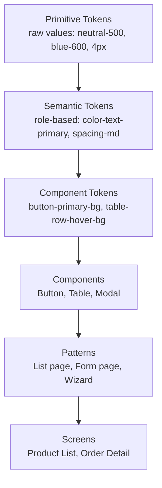

# 02 — Design System Foundations

Enterprise Handicraft E-Commerce Platform · UI/UX Design Specification
**Design System Name:** `Chamunda DS`

---

## 1. Design System Overview

### 1.1 Layers



**Rule:** Components consume **semantic** tokens only. A component may never reference a primitive directly. Theme switching (light/dark) is achieved by remapping semantic → primitive; no component changes.

### 1.2 Token Naming Convention

```
--{category}-{role}-{variant}-{state}

Examples:
--color-text-primary
--color-bg-surface-raised
--color-border-danger-strong
--color-action-primary-bg-hover
--spacing-md
--radius-lg
--elevation-2
--font-size-body-md
--duration-fast
```

In Figma, these are **Variables** in collections: `Primitives`, `Semantic/Light`, `Semantic/Dark`, `Spacing`, `Typography`, `Radius`, `Effects`, `Breakpoints`.

---

## 2. Colour System

### 2.1 Brand Rationale

The palette is derived from Indian handicraft materials: **indigo dye** (primary), **terracotta clay** (secondary/accent), **brass** (highlight), against warm-neutral greys evoking handmade paper. Indigo is chosen as primary because it is culturally resonant, reads as trustworthy/enterprise, and provides safe contrast at both light and dark ends.

### 2.2 Primitive Palette — Brand Indigo (Primary)

| Token | Hex | Usage |
|-------|-----|-------|
| `indigo-25` | `#F5F7FF` | Subtlest tint background |
| `indigo-50` | `#EEF2FF` | Selected row, hover tint |
| `indigo-100` | `#E0E7FF` | Badge background, chip fill |
| `indigo-200` | `#C7D2FE` | Disabled primary, borders |
| `indigo-300` | `#A5B4FC` | Dark-theme text accent |
| `indigo-400` | `#818CF8` | Dark-theme primary action |
| `indigo-500` | `#6366F1` | Illustrations, charts |
| `indigo-600` | `#4F46E5` | **Primary action (light theme)** |
| `indigo-700` | `#4338CA` | Primary hover |
| `indigo-800` | `#3730A3` | Primary active/pressed |
| `indigo-900` | `#312E81` | Deep accents, sidebar (dark) |
| `indigo-950` | `#1E1B4B` | Darkest brand surface |

### 2.3 Primitive Palette — Terracotta (Secondary / Craft Accent)

| Token | Hex | Usage |
|-------|-----|-------|
| `terracotta-50` | `#FDF3EF` | Craft-story panel background |
| `terracotta-100` | `#FAE3DA` | Artisan badge fill |
| `terracotta-200` | `#F4C7B5` | Borders on craft panels |
| `terracotta-300` | `#EDA88C` | Chart series 2 |
| `terracotta-400` | `#E28B67` | Secondary emphasis |
| `terracotta-500` | `#D4714C` | **Secondary action** |
| `terracotta-600` | `#B85B3A` | Secondary hover |
| `terracotta-700` | `#95482E` | Secondary active |
| `terracotta-800` | `#733825` | — |
| `terracotta-900` | `#57291B` | — |

### 2.4 Primitive Palette — Brass (Tertiary Highlight)

| Token | Hex | Usage |
|-------|-----|-------|
| `brass-50` | `#FDF8EC` | Featured/premium background |
| `brass-100` | `#F9EFD1` | Bestseller badge fill |
| `brass-200` | `#F2DDA3` | — |
| `brass-300` | `#E8C86E` | Star rating fill |
| `brass-400` | `#DDB244` | Featured icon |
| `brass-500` | `#C99A28` | Premium/VIP indicator |
| `brass-600` | `#A87D1D` | — |
| `brass-700` | `#845F17` | — |

### 2.5 Semantic Status Colours

#### Success (Emerald)
| Token | Hex | Usage |
|-------|-----|-------|
| `success-50` | `#ECFDF5` | Toast bg, banner bg |
| `success-100` | `#D1FAE5` | Chip fill |
| `success-200` | `#A7F3D0` | Border |
| `success-400` | `#34D399` | Dark-theme text |
| `success-500` | `#10B981` | Icon, chart |
| `success-600` | `#059669` | **Text on light, button** |
| `success-700` | `#047857` | Hover |
| `success-800` | `#065F46` | Active |

#### Warning (Amber)
| Token | Hex | Usage |
|-------|-----|-------|
| `warning-50` | `#FFFBEB` | Banner bg |
| `warning-100` | `#FEF3C7` | Chip fill |
| `warning-200` | `#FDE68A` | Border |
| `warning-400` | `#FBBF24` | Dark-theme text/icon |
| `warning-500` | `#F59E0B` | Icon |
| `warning-600` | `#D97706` | **Text on light** |
| `warning-700` | `#B45309` | Hover |
| `warning-800` | `#92400E` | Active |

#### Danger (Rose-Red)
| Token | Hex | Usage |
|-------|-----|-------|
| `danger-50` | `#FEF2F2` | Banner bg |
| `danger-100` | `#FEE2E2` | Chip fill |
| `danger-200` | `#FECACA` | Border |
| `danger-400` | `#F87171` | Dark-theme text |
| `danger-500` | `#EF4444` | Icon, chart |
| `danger-600` | `#DC2626` | **Button, text on light** |
| `danger-700` | `#B91C1C` | Hover |
| `danger-800` | `#991B1B` | Active |

#### Info (Sky)
| Token | Hex | Usage |
|-------|-----|-------|
| `info-50` | `#F0F9FF` | Banner bg |
| `info-100` | `#E0F2FE` | Chip fill |
| `info-200` | `#BAE6FD` | Border |
| `info-400` | `#38BDF8` | Dark-theme text |
| `info-500` | `#0EA5E9` | Icon |
| `info-600` | `#0284C7` | **Text on light** |
| `info-700` | `#0369A1` | Hover |

### 2.6 Neutral Scale (Warm-tinted Slate)

| Token | Hex | Usage |
|-------|-----|-------|
| `neutral-0` | `#FFFFFF` | Surface (light) |
| `neutral-25` | `#FCFCFD` | Raised surface |
| `neutral-50` | `#F8FAFC` | Canvas (light) |
| `neutral-100` | `#F1F5F9` | Subtle fill, table header |
| `neutral-200` | `#E2E8F0` | Default border |
| `neutral-300` | `#CBD5E1` | Strong border, disabled text on light |
| `neutral-400` | `#94A3B8` | Placeholder, tertiary text |
| `neutral-500` | `#64748B` | Secondary text, icons |
| `neutral-600` | `#475569` | Body text (alt) |
| `neutral-700` | `#334155` | Headings (alt) |
| `neutral-800` | `#1E293B` | Primary text (light theme) |
| `neutral-900` | `#0F172A` | Max contrast text |
| `neutral-950` | `#020617` | Canvas (dark theme) |

### 2.7 Semantic Token Map — Light Theme

| Semantic Token | Value | Contrast vs. its bg |
|----------------|-------|---------------------|
| `--color-bg-canvas` | `neutral-50` | — |
| `--color-bg-surface` | `neutral-0` | — |
| `--color-bg-surface-raised` | `neutral-0` | — |
| `--color-bg-subtle` | `neutral-100` | — |
| `--color-bg-sidebar` | `neutral-0` | — |
| `--color-bg-topbar` | `neutral-0` | — |
| `--color-bg-overlay` | `rgba(15,23,42,0.55)` | — |
| `--color-bg-inverse` | `neutral-900` | — |
| `--color-bg-selected` | `indigo-50` | — |
| `--color-bg-hover` | `neutral-100` | — |
| `--color-text-primary` | `neutral-800` | 14.1:1 |
| `--color-text-secondary` | `neutral-600` | 8.2:1 |
| `--color-text-tertiary` | `neutral-400` | 3.6:1 (meta only, ≥12px) |
| `--color-text-placeholder` | `neutral-400` | 3.6:1 |
| `--color-text-disabled` | `neutral-300` | — |
| `--color-text-inverse` | `neutral-0` | — |
| `--color-text-brand` | `indigo-600` | 6.9:1 |
| `--color-text-link` | `indigo-600` | 6.9:1 |
| `--color-text-success` | `success-700` | 5.4:1 |
| `--color-text-warning` | `warning-700` | 5.1:1 |
| `--color-text-danger` | `danger-600` | 5.9:1 |
| `--color-text-info` | `info-700` | 5.6:1 |
| `--color-border-subtle` | `neutral-100` | — |
| `--color-border-default` | `neutral-200` | 1.5:1 (decorative) |
| `--color-border-strong` | `neutral-300` | 3.0:1 |
| `--color-border-brand` | `indigo-600` | — |
| `--color-border-danger` | `danger-500` | — |
| `--color-focus-ring` | `indigo-600` | 3.1:1 vs surface |
| `--color-action-primary-bg` | `indigo-600` | text on it 7.1:1 |
| `--color-action-primary-bg-hover` | `indigo-700` | — |
| `--color-action-primary-bg-active` | `indigo-800` | — |
| `--color-action-danger-bg` | `danger-600` | — |
| `--color-action-success-bg` | `success-600` | — |

### 2.8 Semantic Token Map — Dark Theme

| Semantic Token | Value |
|----------------|-------|
| `--color-bg-canvas` | `neutral-950` `#020617` |
| `--color-bg-surface` | `#0F172A` |
| `--color-bg-surface-raised` | `#1E293B` |
| `--color-bg-subtle` | `#1E293B` |
| `--color-bg-sidebar` | `#0B1120` |
| `--color-bg-topbar` | `#0F172A` |
| `--color-bg-overlay` | `rgba(2,6,23,0.72)` |
| `--color-bg-inverse` | `neutral-100` |
| `--color-bg-selected` | `rgba(99,102,241,0.16)` |
| `--color-bg-hover` | `rgba(148,163,184,0.10)` |
| `--color-text-primary` | `#F1F5F9` |
| `--color-text-secondary` | `#CBD5E1` |
| `--color-text-tertiary` | `#94A3B8` |
| `--color-text-placeholder` | `#64748B` |
| `--color-text-disabled` | `#475569` |
| `--color-text-inverse` | `#0F172A` |
| `--color-text-brand` | `indigo-400` `#818CF8` |
| `--color-text-link` | `indigo-400` |
| `--color-text-success` | `success-400` |
| `--color-text-warning` | `warning-400` |
| `--color-text-danger` | `danger-400` |
| `--color-text-info` | `info-400` |
| `--color-border-subtle` | `rgba(148,163,184,0.12)` |
| `--color-border-default` | `rgba(148,163,184,0.20)` |
| `--color-border-strong` | `rgba(148,163,184,0.34)` |
| `--color-focus-ring` | `indigo-400` |
| `--color-action-primary-bg` | `indigo-500` |
| `--color-action-primary-bg-hover` | `indigo-400` |
| `--color-action-primary-bg-active` | `indigo-600` |

**Dark theme rules**
- Never pure black background; `#020617` avoids halation.
- Elevation in dark = lighter surface, not stronger shadow. Shadows are retained but at 60% opacity.
- Brand colour lightens by 2 steps for text; buttons keep saturated fill with white text.
- Images/product photos get a 1px `--color-border-default` frame to prevent bleed into dark canvas.
- Status chips use 16% alpha fills of the 400-step colour, with 400-step text.

### 2.9 Status Colour Semantics (Business Mapping)

| Domain | Status | Chip style | Colour |
|--------|--------|-----------|--------|
| Order | New / Pending | Solid subtle | Info |
| Order | Confirmed | Solid subtle | Indigo |
| Order | Processing | Solid subtle | Warning |
| Order | Packed | Solid subtle | Brass |
| Order | Shipped | Solid subtle | Indigo |
| Order | Out for Delivery | Solid subtle | Indigo (pulsing dot) |
| Order | Delivered | Solid subtle | Success |
| Order | Cancelled | Solid subtle | Neutral |
| Order | Returned | Solid subtle | Danger-soft |
| Order | Refunded | Solid subtle | Neutral-strong |
| Order | Failed | Solid subtle | Danger |
| Order | On Hold | Solid subtle | Warning-strong |
| Payment | Paid | Success |
| Payment | Pending | Warning |
| Payment | Partially Paid | Brass |
| Payment | Failed | Danger |
| Payment | Refunded | Neutral |
| Payment | Chargeback | Danger-strong |
| Stock | In Stock | Success |
| Stock | Low Stock | Warning |
| Stock | Out of Stock | Danger |
| Stock | Backorder | Info |
| Stock | Discontinued | Neutral |
| Publish | Published / Active | Success |
| Publish | Draft | Neutral |
| Publish | Scheduled | Info |
| Publish | Unpublished / Inactive | Neutral |
| Publish | Archived | Neutral-strong |
| Moderation | Pending Review | Warning |
| Moderation | Approved | Success |
| Moderation | Rejected | Danger |
| Moderation | Reported | Danger-strong |
| User | Active | Success |
| User | Invited | Info |
| User | Blocked | Danger |
| User | Suspended | Warning |

### 2.10 Data Visualisation Palette

Ordered categorical series — colour-blind safe, distinguishable in greyscale by luminance stepping.

| # | Name | Light hex | Dark hex |
|---|------|-----------|----------|
| 1 | Indigo | `#4F46E5` | `#818CF8` |
| 2 | Terracotta | `#D4714C` | `#E28B67` |
| 3 | Teal | `#0D9488` | `#2DD4BF` |
| 4 | Brass | `#C99A28` | `#E8C86E` |
| 5 | Violet | `#7C3AED` | `#A78BFA` |
| 6 | Sky | `#0284C7` | `#38BDF8` |
| 7 | Rose | `#E11D48` | `#FB7185` |
| 8 | Lime | `#65A30D` | `#A3E635` |

- **Sequential** (heatmaps, density): `indigo-50 → indigo-900`, 7 stops.
- **Diverging** (profit vs loss, variance): `danger-600 ← neutral-200 → success-600`, 9 stops, neutral midpoint anchored at zero.
- Series >8 → switch to a single-hue sequential ramp plus direct labelling.
- Every series also carries a shape/dash pattern for line charts (solid, dashed, dotted, dash-dot) so charts survive greyscale printing.

### 2.11 Colour Usage Rules

| Rule | Detail |
|------|--------|
| CU-01 | Primary indigo is reserved for the single primary action and active navigation. Never use it for decoration. |
| CU-02 | Terracotta is used for craft/artisan storytelling surfaces and the secondary action only. |
| CU-03 | Red is reserved exclusively for destructive/error. Never for "low" metrics unless those metrics are genuinely bad. |
| CU-04 | Green is reserved for success/positive delta. Never for "Go/Next" buttons. |
| CU-05 | Status chips always pair colour + text label; icon optional. |
| CU-06 | Maximum 3 accent colours visible in one viewport (excluding data viz and status chips). |
| CU-07 | Product imagery is never tinted or filtered — craft colour fidelity is a commercial requirement. |
| CU-08 | Backgrounds behind product images are `neutral-0` or `neutral-50` only. |

---

## 3. Typography

### 3.1 Typefaces

| Role | Family | Fallback stack | Weights used |
|------|--------|----------------|--------------|
| UI / Body | **Inter** | system-ui, Segoe UI, Roboto, Helvetica Neue, Arial | 400, 500, 600, 700 |
| Numeric / Tabular | **Inter** with tabular figures | as above | 400, 500, 600 |
| Code / IDs / SKUs | **JetBrains Mono** | ui-monospace, SFMono-Regular, Consolas | 400, 500 |
| Display (marketing surfaces, login art, empty states) | **Fraunces** (optional, craft character) | Georgia, serif | 500, 600 |
| Devanagari (hi-IN) | **Noto Sans Devanagari** | — | 400, 500, 600, 700 |

**Rules:** Inter is loaded with `font-feature-settings` for tabular numerals in all numeric contexts (tables, KPIs, currency). Fraunces is used sparingly — login page, empty-state headings, and the artisan story panel only.

### 3.2 Type Scale

Base 16px, ratio 1.20 (minor third) with pragmatic rounding.

| Token | Size | Line height | Weight | Letter spacing | Usage |
|-------|------|-------------|--------|----------------|-------|
| `display-lg` | 40 | 48 | 700 | -0.02em | Login hero, 404/500 page |
| `display-md` | 32 | 40 | 700 | -0.02em | Report cover, empty-state hero |
| `heading-xl` | 28 | 36 | 600 | -0.01em | Dashboard page title |
| `heading-lg` | 24 | 32 | 600 | -0.01em | **Page title (standard)** |
| `heading-md` | 20 | 28 | 600 | -0.005em | Section title, modal title (large) |
| `heading-sm` | 18 | 26 | 600 | 0 | Card title, modal title (standard) |
| `heading-xs` | 16 | 24 | 600 | 0 | Sub-section, form group title |
| `body-lg` | 16 | 24 | 400 | 0 | Long-form reading, CMS editor |
| `body-md` | 14 | 20 | 400 | 0 | **Default UI body, table cells, inputs** |
| `body-sm` | 13 | 18 | 400 | 0 | Dense tables, secondary lines |
| `label-lg` | 14 | 20 | 500 | 0 | Form labels |
| `label-md` | 13 | 18 | 500 | 0 | Table headers, tabs |
| `label-sm` | 12 | 16 | 500 | 0.01em | Chips, badges |
| `caption` | 12 | 16 | 400 | 0 | Help text, meta, timestamps |
| `overline` | 11 | 16 | 600 | 0.08em UPPERCASE | Sidebar group headers, KPI labels |
| `numeric-xl` | 32 | 38 | 600 | -0.01em tabular | KPI hero value |
| `numeric-lg` | 24 | 30 | 600 | -0.01em tabular | Widget value |
| `numeric-md` | 16 | 22 | 500 | 0 tabular | Table currency |
| `mono-md` | 13 | 20 | 400 | 0 | SKU, order no., API keys |
| `mono-sm` | 12 | 18 | 400 | 0 | Error codes, hashes |

### 3.3 Typographic Rules

| Rule | Detail |
|------|--------|
| TY-01 | Maximum 3 type sizes per screen region. |
| TY-02 | Body copy line length 60–80 characters; CMS editor content column max 720px. |
| TY-03 | Never use weight 700 below 14px — use 600. |
| TY-04 | All currency and quantity values use tabular figures so columns align. |
| TY-05 | Headings never wrap to more than 2 lines; truncate with tooltip beyond. |
| TY-06 | Never centre-align body text longer than one line. |
| TY-07 | Numeric table columns are right-aligned; text left-aligned; status/actions centre or right per column spec. |
| TY-08 | Link text is underlined on hover and always distinguishable by colour + underline in body copy. |
| TY-09 | Minimum font size anywhere is 11px (overline only); functional text minimum 12px. |
| TY-10 | Hindi/Devanagari line-height increases by 4px at every scale step. |

### 3.4 Text Colour Application

| Context | Token |
|---------|-------|
| Page/section headings | `--color-text-primary` |
| Body, table cells | `--color-text-primary` |
| Secondary line, descriptions | `--color-text-secondary` |
| Meta, timestamps, counts | `--color-text-tertiary` |
| Placeholder | `--color-text-placeholder` |
| Disabled | `--color-text-disabled` |
| Links, brand emphasis | `--color-text-link` |
| On coloured fills | `--color-text-inverse` |
| Error text | `--color-text-danger` |
| Help text | `--color-text-secondary` |
| Required asterisk | `--color-text-danger` |

---

## 4. Spacing System

### 4.1 Base Unit

**4px base grid.** Every dimension, padding, margin and gap is a multiple of 4. Exceptions: 1px/2px borders and hairlines, and 2px focus offsets.

### 4.2 Spacing Scale

| Token | Value | Typical usage |
|-------|-------|---------------|
| `space-0` | 0 | Reset |
| `space-3xs` | 2px | Icon-to-label micro gap, badge inset |
| `space-2xs` | 4px | Chip padding-y, dense gap |
| `space-xs` | 8px | Icon gap, tight stack, chip padding-x |
| `space-sm` | 12px | Input padding-x, list item gap |
| `space-md` | 16px | **Default gap, card padding (compact)** |
| `space-lg` | 24px | **Card padding, page padding, section gap** |
| `space-xl` | 32px | Major section separation |
| `space-2xl` | 40px | Page block separation |
| `space-3xl` | 48px | Empty-state vertical rhythm |
| `space-4xl` | 64px | Hero/system page spacing |
| `space-5xl` | 96px | Login/marketing spacing |

### 4.3 Applied Spacing Rules

| Context | Value |
|---------|-------|
| Workspace padding (desktop) | 24 |
| Workspace padding (tablet) | 20 |
| Workspace padding (mobile) | 16 |
| Card padding (standard) | 24 |
| Card padding (compact/widget) | 16 |
| Card gap in grid | 24 (desktop) / 16 (mobile) |
| Form section gap | 32 |
| Form field vertical gap | 20 |
| Form field horizontal gap (2-col) | 24 |
| Label → input gap | 6 |
| Input → help/error gap | 6 |
| Button group gap | 12 |
| Icon → label gap in button | 8 |
| Table cell padding (comfortable) | 16 × 16 |
| Table cell padding (standard) | 12 × 16 |
| Table cell padding (compact) | 8 × 12 |
| Modal padding | 24 (header 20/24, body 24, footer 16/24) |
| Drawer padding | 24 |
| Toast padding | 16 |
| Sidebar item padding | 10 × 12 |
| Sidebar group gap | 16 |
| Chip padding | 4 × 10 |
| Tooltip padding | 8 × 12 |
| Dropdown item padding | 10 × 12 |

---

## 5. Grid & Layout

### 5.1 Column Grid

| Breakpoint | Columns | Gutter | Margin | Max content width |
|------------|---------|--------|--------|-------------------|
| xs (<576) | 4 | 16 | 16 | fluid |
| sm (576–767) | 4 | 16 | 24 | 540 |
| md (768–991) | 8 | 24 | 24 | 720 |
| lg (992–1199) | 12 | 24 | 24 | 960 |
| xl (1200–1399) | 12 | 24 | 32 | 1140 |
| xxl (≥1400) | 12 | 32 | 40 | 1320 (workspace cap 1600) |

### 5.2 Canonical Layout Templates

| ID | Name | Structure (12-col) | Used by |
|----|------|--------------------|---------|
| `L-01` | Full width | 12 | List pages, tables |
| `L-02` | Main + Sidebar | 8 / 4 | Product form, Order detail, Blog editor |
| `L-03` | Main + Narrow rail | 9 / 3 | Settings, Reports with filter rail |
| `L-04` | Split pane | 5 / 7 | Order queue + quick view, Media library |
| `L-05` | Centred narrow | 6 centred (max 720) | Simple forms, wizards, single settings |
| `L-06` | Centred wide | 10 centred (max 1120) | Multi-step wizard, checkout-like flows |
| `L-07` | Dashboard grid | 12 with 3/4/6/12 widget spans | Dashboard, report dashboards |
| `L-08` | Two-column form | 6 / 6 within L-02 main | All standard forms |
| `L-09` | Master-detail-detail | 3 / 4 / 5 | Category tree + list + editor |
| `L-10` | Blank / system | centred 4–6 | Login, 404, 500, Maintenance |

### 5.3 Vertical Rhythm

- Page header bottom margin: 24
- Between major cards/sections: 24
- Inside card, between blocks: 20
- Sticky elements: top bar (z1030) > sidebar (z1020) > breadcrumb (z1010) > table header (z100) > sticky footer bar (z900)

### 5.4 Z-Index Scale

| Layer | z-index |
|-------|---------|
| Base content | 0 |
| Sticky table header | 100 |
| Sticky first column | 110 |
| Sticky form action bar | 900 |
| Breadcrumb bar | 1010 |
| Sidebar | 1020 |
| Top bar | 1030 |
| Dropdown / select menu | 1050 |
| Tooltip | 1070 |
| Drawer scrim | 1080 |
| Drawer | 1090 |
| Modal scrim | 1100 |
| Modal | 1110 |
| Command palette | 1150 |
| Toast | 1200 |
| Global banner (critical) | 1250 |

---

## 6. Elevation & Shadows

| Token | Shadow (light) | Shadow (dark) | Usage |
|-------|----------------|---------------|-------|
| `elevation-0` | none | none | Flat surfaces, canvas |
| `elevation-1` | `0 1px 2px rgba(15,23,42,0.06), 0 1px 3px rgba(15,23,42,0.10)` | `0 1px 3px rgba(0,0,0,0.5)` | Cards, top bar |
| `elevation-2` | `0 2px 4px rgba(15,23,42,0.06), 0 4px 8px rgba(15,23,42,0.08)` | `0 4px 8px rgba(0,0,0,0.5)` | Hover cards, dropdowns |
| `elevation-3` | `0 4px 8px rgba(15,23,42,0.06), 0 8px 16px rgba(15,23,42,0.10)` | `0 8px 16px rgba(0,0,0,0.55)` | Popovers, drawers |
| `elevation-4` | `0 8px 16px rgba(15,23,42,0.08), 0 16px 32px rgba(15,23,42,0.12)` | `0 16px 32px rgba(0,0,0,0.6)` | Modals, command palette |
| `elevation-5` | `0 16px 32px rgba(15,23,42,0.10), 0 24px 48px rgba(15,23,42,0.14)` | `0 24px 48px rgba(0,0,0,0.65)` | Toasts, critical overlays |
| `elevation-inset` | `inset 0 1px 2px rgba(15,23,42,0.06)` | `inset 0 1px 2px rgba(0,0,0,0.4)` | Pressed states, input wells |

**Rule:** In dark theme, elevation is primarily communicated by surface lightening (`--color-bg-surface-raised`), with shadow as a secondary cue.

---

## 7. Border Radius

| Token | Value | Applied to |
|-------|-------|-----------|
| `radius-none` | 0 | Table cells, full-bleed images |
| `radius-xs` | 4px | Chips, badges, small tags, checkbox |
| `radius-sm` | 6px | Inputs, buttons (small), dropdown items |
| `radius-md` | 8px | **Buttons, inputs (default), tooltips** |
| `radius-lg` | 12px | Cards, modals, drawers, panels |
| `radius-xl` | 16px | Feature cards, media tiles, empty-state illustration frames |
| `radius-2xl` | 24px | Hero panels, onboarding cards |
| `radius-full` | 9999px | Avatars, pills, status dots, toggle knobs, FAB |

---

## 8. Border Widths

| Token | Value | Usage |
|-------|-------|-------|
| `border-hairline` | 1px | Default borders, dividers, table lines |
| `border-thick` | 2px | Focus ring, active tab indicator, selected card |
| `border-accent` | 3px | Active sidebar item, timeline rail, alert left bar |
| `border-heavy` | 4px | Progress track, drag-drop zone (dashed) |

---

## 9. Motion & Animation

### 9.1 Duration Tokens

| Token | Value | Usage |
|-------|-------|-------|
| `duration-instant` | 80ms | Colour/opacity micro-changes, hover |
| `duration-fast` | 150ms | Buttons, chips, checkbox, tooltip show |
| `duration-normal` | 240ms | Dropdown, accordion, tab switch, toast |
| `duration-slow` | 320ms | Modal, drawer, page transition |
| `duration-slower` | 480ms | Complex reveals, onboarding |
| `duration-shimmer` | 1400ms | Skeleton shimmer loop |

### 9.2 Easing Tokens

| Token | Curve | Usage |
|-------|-------|-------|
| `ease-standard` | `cubic-bezier(0.2, 0, 0, 1)` | Default for most transitions |
| `ease-decelerate` | `cubic-bezier(0, 0, 0, 1)` | Entering elements |
| `ease-accelerate` | `cubic-bezier(0.3, 0, 1, 1)` | Exiting elements |
| `ease-emphasis` | `cubic-bezier(0.2, 0, 0, 1.2)` | Success confirmations, subtle overshoot |
| `ease-linear` | `linear` | Progress bars, spinners, shimmer |

### 9.3 Motion Patterns

| Pattern | Spec |
|---------|------|
| Modal enter | Scrim fade 0→1 (240ms); panel scale 0.96→1 + translateY 8→0 + fade (320ms, decelerate) |
| Modal exit | Reverse, 240ms accelerate |
| Drawer enter | translateX 100%→0, 320ms decelerate; scrim fade 240ms |
| Dropdown | scale 0.96→1 + fade, transform-origin at trigger edge, 150ms |
| Toast enter | translateX 24→0 + fade, 240ms decelerate |
| Toast exit | fade + translateX 24, 200ms accelerate |
| Accordion | height auto-animate 240ms standard; chevron rotate 180° same duration |
| Tab switch | Indicator slides 240ms standard; panel cross-fades 150ms |
| Row hover | bg colour 80ms |
| Button press | scale 0.98, 80ms |
| Checkbox check | Path draw 150ms + box fill 100ms |
| Toggle | Knob translate 150ms standard; track colour 150ms |
| Skeleton | Gradient sweep left→right, 1400ms linear infinite |
| Number count-up | KPI values animate 0→value over 600ms ease-out, only on first load |
| Progress bar | Width transitions 240ms; indeterminate bar sweeps 1200ms linear infinite |
| Drag lift | scale 1.02 + elevation-3, 150ms |
| Drop | snap 240ms ease-emphasis |
| Success check | Circle draw 300ms + check draw 200ms + scale pop 1→1.06→1 |
| Page transition | Content fade+translateY 8→0, 240ms (no full-page transitions) |
| Reduced motion | All transforms → opacity-only ≤100ms; shimmer → static 8% grey; count-up disabled |

---

## 10. Iconography

### 10.1 Icon Library

**Primary set:** Lucide (outline, 24×24 grid, 2px stroke, round caps/joins).
**Secondary:** Custom craft icons (pottery, loom, woodwork, metalwork, jewellery, festival lamp) drawn on the same grid for category iconography.

### 10.2 Icon Sizes

| Token | Size | Stroke | Usage |
|-------|------|--------|-------|
| `icon-xs` | 12 | 1.5 | Inline text markers, chip icons |
| `icon-sm` | 16 | 1.5 | Buttons (sm), inputs, table row actions, menu items |
| `icon-md` | 20 | 2 | **Default** — buttons, sidebar, top bar |
| `icon-lg` | 24 | 2 | Page headers, card headers, widget icons |
| `icon-xl` | 32 | 2 | Feature tiles, notification items |
| `icon-2xl` | 48 | 2 | Empty states (secondary), error blocks |
| `icon-3xl` | 64 | 2 | Empty states (primary), system pages |

### 10.3 Canonical Icon Mapping

| Action / Concept | Icon | Notes |
|------------------|------|-------|
| Add / Create | `plus` | Always with label on primary buttons |
| Edit | `pencil` / `square-pen` | Row action |
| Delete | `trash-2` | Always danger-coloured |
| View / Preview | `eye` | |
| Hide | `eye-off` | |
| Duplicate / Clone | `copy` | |
| Save | `check` (in button label) | |
| Cancel / Close | `x` | |
| Search | `search` | |
| Filter | `sliders-horizontal` | Badge shows active count |
| Sort | `arrow-up-down` / `arrow-up` / `arrow-down` | |
| More actions | `more-vertical` | Row-level |
| More (page) | `more-horizontal` | Page-level |
| Download / Export | `download` | |
| Upload / Import | `upload` | |
| Print | `printer` | |
| Refresh | `refresh-cw` | Spins during load |
| Settings | `settings` | |
| Notifications | `bell` | |
| Help | `circle-help` | |
| Info | `info` | |
| Warning | `triangle-alert` | |
| Error | `circle-alert` | |
| Critical | `octagon-alert` | |
| Success | `circle-check` | |
| Dashboard | `layout-dashboard` | |
| Products | `package` | |
| Category | `folder-tree` | |
| Brand | `tag` | |
| Artisan | `hand-heart` (custom) | |
| Inventory | `warehouse` | |
| Orders | `shopping-cart` | |
| Returns | `undo-2` | |
| Payments | `credit-card` | |
| Refund | `banknote-arrow-down` | |
| Shipping | `truck` | |
| Tracking | `map-pin` | |
| Coupon | `ticket-percent` | |
| Offer | `badge-percent` | |
| Flash sale | `zap` | |
| Banner | `image` | |
| CMS Page | `file-text` | |
| Blog | `newspaper` | |
| Review | `message-square-quote` | |
| Rating | `star` | Filled brass-300 |
| Testimonial | `quote` | |
| Newsletter | `mail` | |
| SMS | `message-square` | |
| WhatsApp | `whatsapp` (brand) | |
| Push | `smartphone` | |
| Reports | `chart-column` | |
| SEO | `search-check` | |
| Users | `users` | |
| Role | `shield-check` | |
| Permission | `key` | |
| Audit log | `scroll-text` | |
| Customer | `user-round` | |
| Address | `map-pinned` | |
| Wishlist | `heart` | |
| Reward points | `gem` | |
| Block | `ban` | |
| Barcode | `scan-barcode` | |
| QR | `qr-code` | |
| Invoice | `receipt-indian-rupee` | |
| Currency | `indian-rupee` | |
| Tax / GST | `percent` | |
| Calendar / Date | `calendar` | |
| Time | `clock` | |
| Attachment | `paperclip` | |
| Link | `link` | |
| External link | `external-link` | Always after link text |
| Drag handle | `grip-vertical` | |
| Expand | `chevron-down` | |
| Collapse | `chevron-up` | |
| Next | `chevron-right` | |
| Previous | `chevron-left` | |
| First/Last page | `chevrons-left` / `chevrons-right` | |
| Lock | `lock` | |
| Unlock | `lock-open` | |
| Archive | `archive` | |
| Restore | `archive-restore` | |
| Send | `send` | |
| Schedule | `calendar-clock` | |
| Activity | `activity` | |
| Trend up | `trending-up` | Success colour |
| Trend down | `trending-down` | Danger colour (context-dependent) |
| Low stock | `package-minus` | |
| Out of stock | `package-x` | |
| Featured | `sparkles` | Brass |
| Bestseller | `award` | Brass |
| New arrival | `badge-plus` | Info |
| Trending | `flame` | Terracotta |

### 10.4 Icon Rules

| Rule | Detail |
|------|--------|
| IC-01 | One icon = one meaning across the entire product. No re-use for different concepts. |
| IC-02 | Icon-only buttons must have a tooltip and an accessible label. |
| IC-03 | Icons inherit text colour unless conveying status. |
| IC-04 | Never use icon-only for destructive actions in primary positions; only in row overflow menus. |
| IC-05 | Icons are optically centred, not mathematically — 24px frame with 20px live area. |
| IC-06 | Brand/payment logos (Razorpay, Stripe, UPI, Visa, etc.) are full-colour assets, never restyled. |

---

## 11. Imagery & Media Standards

### 11.1 Product Image Specification

| Derivative | Size | Aspect | Usage |
|------------|------|--------|-------|
| Micro | 40×40 | 1:1 | Order line items, search results |
| Thumb | 80×80 | 1:1 | Table rows, pickers |
| Card | 320×320 | 1:1 | Product grid cards |
| Detail | 800×800 | 1:1 | Product page main |
| Zoom | 2000×2000 | 1:1 | Zoom/lightbox |
| Banner desktop | 1920×640 | 3:1 | Homepage slider |
| Banner tablet | 1024×480 | 2.13:1 | |
| Banner mobile | 750×750 | 1:1 | |
| Popup banner | 800×600 | 4:3 | |
| Category tile | 480×360 | 4:3 | |
| Blog cover | 1200×630 | 1.91:1 | Also OG image |
| Artisan portrait | 600×600 | 1:1 | |
| Testimonial avatar | 200×200 | 1:1 | |

**Rules:** Products photographed on `#FFFFFF` or `#F8FAFC`. Minimum 1 image, recommended 6. First image = thumbnail unless overridden. 360° sets require 24 or 36 frames. Video max 60s, MP4 H.264, poster frame required.

### 11.2 Image Placeholders

| Case | Treatment |
|------|-----------|
| No image | `neutral-100` fill, centred `image` icon `icon-lg` in `neutral-400`, radius matches container |
| Loading | Skeleton block with shimmer |
| Broken | `neutral-100` fill + `image-off` icon + tooltip "Image failed to load" |
| Processing | Skeleton + centred spinner + "Processing…" caption |

### 11.3 Aspect Ratio Enforcement

All image containers use a fixed aspect ratio box with `object-fit: cover` behaviour and a 1px inner border in `--color-border-subtle` (light) or `--color-border-default` (dark).

---

## 12. Theming

### 12.1 Theme Modes

| Mode | Behaviour |
|------|-----------|
| Light | Default |
| Dark | Full parity, every screen must be designed in both |
| System | Follows OS preference, live-updates |
| High contrast (Inventory/warehouse) | Optional per-user: borders → `border-strong`, text → `neutral-900`/`neutral-0`, focus ring 3px, chip fills solid not tinted |

### 12.2 Theme Switching Rules

- Toggle lives in the top bar; also in Profile → Preferences.
- Transition: 150ms colour cross-fade on background/text only (no layout animation).
- Persisted per user (server-side preference + local fallback).
- Charts, illustrations and empty-state artwork have dedicated dark variants.
- Product photography is never altered by theme.

### 12.3 Figma Theming Approach

- Two Variable Modes on the `Semantic` collection: `Light` and `Dark`.
- All components bound to semantic variables → theme toggles by switching the mode on the top-level frame.
- Illustration components use a `Theme` variant property (`Light`/`Dark`).

---

## 13. Density Modes

| Mode | Table row height | Cell padding | Font | Where |
|------|-----------------|--------------|------|-------|
| Comfortable | 64px | 16×16 | body-md 14 | Default for detail-heavy lists (Products, Customers) |
| Standard | 52px | 12×16 | body-md 14 | Default globally |
| Compact | 40px | 8×12 | body-sm 13 | Power-user lists (Orders queue, Inventory, Audit log) |

Density is user-selectable via a toolbar control and persisted per module per user.

---

## 14. Accessibility Foundations

### 14.1 Contrast Verification Table (Light Theme)

| Pair | Ratio | Verdict |
|------|-------|---------|
| `text-primary` on `bg-surface` | 14.1:1 | AAA |
| `text-secondary` on `bg-surface` | 8.2:1 | AAA |
| `text-tertiary` on `bg-surface` | 3.6:1 | AA (≥18.66px / meta only) |
| White on `action-primary-bg` | 7.1:1 | AAA |
| White on `action-danger-bg` | 5.9:1 | AA |
| White on `action-success-bg` | 4.6:1 | AA |
| `text-danger` on `danger-50` | 6.4:1 | AAA |
| `text-warning` on `warning-50` | 6.1:1 | AAA |
| `text-success` on `success-50` | 5.9:1 | AA |
| `border-strong` on `bg-surface` | 3.0:1 | AA (non-text) |
| `focus-ring` on `bg-surface` | 3.1:1 | AA (non-text) |

### 14.2 Focus State Specification

| Element | Focus treatment |
|---------|-----------------|
| Button | 2px ring `--color-focus-ring`, 2px offset, radius +2 |
| Input | Border → `--color-border-brand` 1px + 3px ring at 20% alpha |
| Checkbox / Radio | 2px ring, 2px offset |
| Toggle | 2px ring around track |
| Link | 2px ring, 2px offset, radius-xs |
| Table row | 2px inset ring + 3px left accent bar |
| Card (clickable) | 2px ring, 2px offset |
| Tab | 2px ring inside tab bounds |
| Menu item | 2px inset ring + `--color-bg-hover` |
| Icon button | 2px ring, 2px offset, radius-full if circular |

### 14.3 Hover State Specification

| Element | Hover treatment |
|---------|-----------------|
| Primary button | bg → `-hover` token |
| Secondary/outline button | bg → `--color-bg-hover`, border → `border-strong` |
| Ghost button | bg → `--color-bg-hover` |
| Danger button | bg → `danger-700` |
| Table row | bg → `--color-bg-hover`; row actions fade in 80ms |
| Card (clickable) | elevation-1 → elevation-2, translateY -1px |
| Link | underline appears |
| Menu item | bg → `--color-bg-hover` |
| Sidebar item | bg → `--color-bg-hover` |
| Chip (removable) | remove icon → `danger-600` |
| Image tile | overlay scrim 20% + action icons fade in |

### 14.4 Disabled State Specification

- Opacity 0.5 **or** explicit disabled tokens (preferred for text-heavy elements).
- `cursor: not-allowed`.
- No hover/active response.
- **Always** paired with a tooltip explaining why, when the reason is non-obvious (permissions, prerequisites, locked periods).
- Disabled elements remain in the tab order only if they carry an explanatory tooltip; otherwise removed.

---

## 15. Sound & Haptics (Warehouse / Mobile)

| Event | Sound | Haptic |
|-------|-------|--------|
| Barcode scan success | Short 880Hz beep, 80ms | Light tap |
| Barcode scan failure | Two-tone descending, 200ms | Error double-buzz |
| Order picked complete | Ascending 2-note | Success tap |
| Critical alert | Repeating 3-tone until acknowledged | Long buzz |

All sounds are user-mutable in Preferences and off by default outside the Inventory module.

---

## 16. Design System Governance

| Aspect | Rule |
|--------|------|
| New component proposal | Must prove 3 distinct use cases before entering the library |
| Deprecation | Marked with a `⚠ Deprecated` badge in Figma for one release before removal |
| Overrides | Detaching a library component is prohibited; request a variant instead |
| Contribution | Any new pattern must ship with: all states, both themes, all breakpoints, a11y notes, dev notes |
| Versioning | Semantic (MAJOR.MINOR.PATCH). Token renames = MAJOR |
| Review cadence | Fortnightly design-system review; monthly a11y audit |
