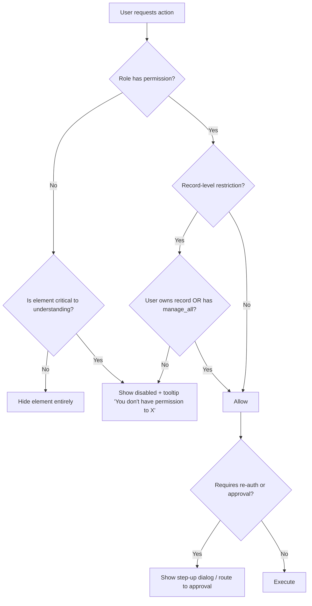

# 05 — User Roles & Permission Matrix

Enterprise Handicraft E-Commerce Platform · UI/UX Design Specification

---

## 1. Role Model

### 1.1 Role Definitions

| ID | Role | Scope | Typical count | Default landing page |
|----|------|-------|---------------|----------------------|
| R1 | **Super Admin** | Unrestricted. Can manage roles, impersonate, access system health, override locks. Cannot be deleted; at least one must always exist. | 1–2 | `/admin` (Executive Dashboard) |
| R2 | **Admin** | Everything except role/permission definition, system health, impersonation, and gateway secret reveal. | 2–4 | `/admin` (Operations Dashboard) |
| R3 | **Product Manager** | Full catalog: products, categories, brands, artisans, attributes, media, product SEO. Read-only inventory & orders. | 2–6 | `/admin/products` |
| R4 | **Inventory Manager** | Full inventory: stock, warehouses, purchase entry, adjustments, damage, returns-to-stock, barcodes. Read-only products & orders. | 2–8 | `/admin/inventory` |
| R5 | **Order Manager** | Full order lifecycle, shipping, invoices, labels, returns processing. Read-only products, customers, payments. Refunds require approval. | 3–10 | `/admin/orders` |
| R6 | **Marketing Manager** | Coupons, offers, flash sales, banners, newsletter, notifications, SEO, blog promotion. Read-only catalog & reports. | 1–3 | `/admin/marketing` (Marketing Dashboard) |
| R7 | **Finance Manager** | Payments, refunds (approve), settlements, tax, invoices, all financial reports, currency & tax settings. Read-only orders & customers. | 1–2 | `/admin/reports/sales` |
| R8 | **Customer Support** | Customer 360, order view + limited actions (add note, change address pre-dispatch, request cancel/refund), review moderation queue, ticket notes. | 3–12 | `/admin/support` (Support Dashboard) |
| R9 | **Content Manager** | CMS pages, blog, testimonials, media library, reviews moderation, menus. Read-only catalog. | 1–3 | `/admin/cms/pages` |

### 1.2 Permission Verbs

| Verb | Meaning | UI consequence |
|------|---------|----------------|
| `view` | Can open the list and read records | Module appears in sidebar |
| `create` | Can create new records | "Add" buttons visible |
| `edit` | Can modify existing records | Edit actions & editable fields enabled |
| `delete` | Can soft-delete records | Delete action visible (danger) |
| `publish` | Can change visibility/live state | Publish toggles enabled |
| `approve` | Can approve items awaiting decision | Approve/Reject actions visible |
| `export` | Can export data | Export menu enabled |
| `import` | Can bulk import | Import button visible |
| `configure` | Can change module settings | Settings tab visible |
| `manage_all` | Can act on other users' records | "Owner" filter unlocked |

### 1.3 Permission Resolution Rules



**UI rules**
- **Hide** navigation items, page-level primary actions and whole tabs the role cannot use.
- **Disable with tooltip** row-level actions and form fields, so the user understands the record's full shape.
- Never render a control that fails silently.
- A user landing on a forbidden URL sees the **403 / No Permission** state with a "Request Access" action that raises a notification to Admins.

---

## 2. Master Permission Matrix

Legend: **F** = Full (view/create/edit/delete) · **E** = View + Edit · **V** = View only · **A** = Approve/moderate only · **–** = No access · **C** = Configure

| Module | Super Admin | Admin | Product Mgr | Inventory Mgr | Order Mgr | Marketing Mgr | Finance Mgr | Support | Content Mgr |
|--------|:-----------:|:-----:|:-----------:|:-------------:|:---------:|:-------------:|:-----------:|:-------:|:-----------:|
| **1. Dashboard** | F | F | V (catalog KPIs) | V (stock KPIs) | V (order KPIs) | V (campaign KPIs) | V (finance KPIs) | V (support KPIs) | V (content KPIs) |
| **2.1 Admin Users** | F | F (no role edit) | – | – | – | – | – | – | – |
| **2.2 Roles & Permissions** | F | V | – | – | – | – | – | – | – |
| **2.3 Login History / Audit** | F | V | – | – | – | – | V (financial only) | – | – |
| **2.4 Customers** | F | F | – | – | V | V | V | E (no delete) | – |
| **2.5 Customer Block/Unblock** | F | F | – | – | – | – | – | A (request only) | – |
| **2.6 Reward Points** | F | F | – | – | – | E | E | V | – |
| **3. Products** | F | F | F | V | V | V | – | V | V |
| **3.1 Product Pricing** | F | F | E | – | – | E (offer price) | V | – | – |
| **3.2 Product Cost Price** | F | F | V | E | – | – | V | – | – |
| **3.3 Product Media** | F | F | F | – | – | E | – | – | E |
| **3.4 Product Variants** | F | F | F | E (stock only) | – | – | – | – | – |
| **3.5 Product Publish** | F | F | F | – | – | – | – | – | – |
| **4. Categories** | F | F | F | V | V | V | – | – | V |
| **5. Inventory** | F | F | V | F | V | – | V | V | – |
| **5.1 Stock Adjustment** | F | F | – | F | – | – | V | – | – |
| **5.2 Purchase Entry** | F | F | – | F | – | – | V | – | – |
| **5.3 Warehouses** | F | F | – | E | – | – | – | – | – |
| **6. Orders** | F | F | V | V | F | V | V | E (limited) | – |
| **6.1 Order Status Change** | F | F | – | – | F | – | – | A (request) | – |
| **6.2 Order Cancel** | F | F | – | – | F | – | – | A (request) | – |
| **6.3 Returns / RMA** | F | F | – | E (restock) | F | – | V | A (initiate) | – |
| **6.4 Invoice** | F | F | – | – | E | – | F | V | – |
| **7. Payments** | F | F | – | – | V | – | F | V | – |
| **7.1 Refund Initiate** | F | F | – | – | A (request) | – | F | A (request) | – |
| **7.2 Refund Approve** | F | F | – | – | – | – | F | – | – |
| **7.3 Gateway Config** | F | C (no secret reveal) | – | – | – | – | V | – | – |
| **8. Shipping** | F | F | – | V | F | – | V | V | – |
| **8.1 Shipping Zones/Rates** | F | F | – | – | E | – | V | – | – |
| **8.2 Courier Integration** | F | C | – | – | E | – | – | – | – |
| **9. Coupons** | F | F | V | – | V | F | V | V | – |
| **10. Offers** | F | F | E | – | V | F | V | – | – |
| **11. Banners** | F | F | – | – | – | F | – | – | E |
| **12. CMS** | F | F | – | – | – | V | – | V | F |
| **13. Blog** | F | F | – | – | – | E | – | – | F |
| **14. Reviews** | F | F | V | – | – | V | – | A | F |
| **15. Testimonials** | F | F | – | – | – | E | – | – | F |
| **16. Newsletter** | F | F | – | – | – | F | – | V | E |
| **17. Notifications** | F | F | V | V | V | F | – | V | – |
| **17.1 Notification Templates** | F | F | – | – | – | F | – | – | E |
| **18. Reports — Sales** | F | F | V | – | V | V | F | – | – |
| **18.1 Reports — Profit** | F | F | – | – | – | – | F | – | – |
| **18.2 Reports — Inventory** | F | F | V | F | – | – | V | – | – |
| **18.3 Reports — Customer** | F | F | – | – | – | F | V | V | – |
| **18.4 Reports — Tax** | F | F | – | – | – | – | F | – | – |
| **18.5 Reports — Product** | F | F | F | V | – | V | V | – | – |
| **18.6 Reports — Return** | F | F | V | V | F | – | V | V | – |
| **19. SEO** | F | F | E (product SEO) | – | – | F | – | – | F |
| **20. Settings — Company** | F | E | – | – | – | – | V | – | – |
| **20.1 Settings — GST/Tax** | F | E | – | – | – | – | F | – | – |
| **20.2 Settings — Currency** | F | E | – | – | – | – | E | – | – |
| **20.3 Settings — Email/SMS** | F | C | – | – | – | E | – | – | – |
| **20.4 Settings — Payment GW** | F | C | – | – | – | – | V | – | – |
| **20.5 Settings — Website** | F | E | – | – | – | E | – | – | E |
| **20.6 Settings — Social** | F | E | – | – | – | F | – | – | E |
| **System Health** | F | V | – | – | – | – | – | – | – |
| **Impersonation** | F | – | – | – | – | – | – | – | – |

---

## 3. Role-Based Navigation Rendering

### 3.1 Sidebar Per Role

| Role | Visible sidebar groups |
|------|------------------------|
| Super Admin | All 8 groups, all items |
| Admin | All 8 groups; hides Roles & Permissions (view-only entry), System Health (view-only) |
| Product Manager | Dashboard · CATALOG (Products, Categories, Brands, Artisans, Attributes, Inventory-view, Reviews-view) · REPORTS (Product, Inventory, Sales-view) |
| Inventory Manager | Dashboard · CATALOG (Products-view, Inventory) · SALES (Orders-view, Returns) · REPORTS (Inventory, Return) |
| Order Manager | Dashboard · SALES (Orders, Returns, Shipping, Invoices, Payments-view) · CUSTOMERS (view) · CATALOG (Products-view, Inventory-view) · REPORTS (Order, Sales, Return) |
| Marketing Manager | Dashboard · MARKETING (all) · CONTENT (Blog, Banners) · CATALOG (view) · CUSTOMERS (Segments) · REPORTS (Sales, Customer, Product) |
| Finance Manager | Dashboard · SALES (Payments, Refunds, Invoices, Orders-view) · REPORTS (all financial) · ADMINISTRATION (Settings → Tax, Currency) |
| Customer Support | Dashboard · SALES (Orders-limited, Returns-initiate) · CUSTOMERS (all) · CATALOG (Products-view, Inventory-view) · CONTENT (Reviews moderation) |
| Content Manager | Dashboard · CONTENT (all) · MARKETING (SEO, Banners) · CATALOG (Products-view for linking) |

### 3.2 Role-Specific Dashboards

Each role's dashboard is a distinct widget composition (see Module 1 §4).

| Role | Dashboard variant | Key widgets |
|------|-------------------|-------------|
| Super Admin / Admin | Executive | Revenue, Profit, Orders, Customers, Sales trend, Top products, Low stock, Recent orders, Visitors, Alerts |
| Product Manager | Catalog | Products by status, Drafts pending, Missing images/SEO, New arrivals performance, Top/bottom products, Category coverage |
| Inventory Manager | Warehouse | Stock value, Low stock, Out of stock, Pending purchase entries, Adjustments today, Damage log, Reorder suggestions |
| Order Manager | Fulfilment | Orders by status funnel, SLA breaches, Pending pickups, Today's shipments, Returns queue, Courier performance |
| Marketing Manager | Growth | Campaign performance, Coupon usage, Active offers, Traffic sources, Conversion funnel, Newsletter stats, Top landing pages |
| Finance Manager | Finance | Revenue vs target, Profit margin, Pending settlements, Refunds pending approval, Tax liability, Payment method split, AOV |
| Customer Support | Support | Open queries, Orders needing attention, Recent customer activity, Pending review moderation, Escalations, Response SLA |
| Content Manager | Content | Published/draft counts, Scheduled posts, Pending reviews, Pending testimonials, Top blog posts, Broken links, SEO health score |

---

## 4. Field-Level Permission Rules

Fields that are hidden or read-only depending on role:

| Field | Hidden from | Read-only for | Notes |
|-------|-------------|---------------|-------|
| Cost Price | Support, Content, Marketing | Product Manager, Finance | Drives margin; sensitive |
| Profit / Margin columns | Product Mgr, Inventory, Order Mgr, Support, Content, Marketing | — | Finance & Admin only |
| Customer phone (full) | — | Support sees masked with reveal (audited) | Privacy |
| Customer email (full) | — | Support sees masked with reveal (audited) | Privacy |
| Payment gateway secret keys | All except Super Admin | Admin sees masked, cannot reveal | Security |
| Customer payment card meta | All | Finance sees last-4 only | PCI scope |
| Supplier/artisan payout terms | All except Finance, Admin, Super Admin | — | Commercial |
| Internal order notes | Customers never; all admin roles see | Support can add only | — |
| Refund amount override | All except Finance, Admin, Super Admin | — | Requires re-auth |
| Tax rate configuration | All except Finance, Admin, Super Admin | Admin editable | Compliance |
| Role field on Admin User | All except Super Admin | Admin sees read-only | Privilege escalation guard |

---

## 5. Approval & Escalation Workflows

### 5.1 Actions Requiring Approval

| Action | Requester | Approver | UI |
|--------|-----------|----------|-----|
| Refund > ₹10,000 | Order Mgr, Support | Finance Mgr / Admin | "Request Refund" → approval queue → approver sees a Refund Approval modal with full order context |
| Order cancellation after dispatch | Order Mgr, Support | Admin | Confirmation with a reason field → routed for approval |
| Customer block | Support | Admin | "Request Block" with reason |
| Price change > 30% | Product Mgr | Admin | Inline warning + approval routing |
| Bulk delete > 50 records | Any | Admin | Re-auth + Admin approval |
| Coupon with >50% discount | Marketing Mgr | Finance Mgr | Approval before activation |
| Stock adjustment > 100 units or > ₹50,000 value | Inventory Mgr | Admin | Approval before commit |
| Publishing a CMS legal page (Privacy, T&C) | Content Mgr | Admin | Approval before publish |

### 5.2 Approval Queue UI

Location: top bar bell + a dedicated page `/admin/approvals`.

```
┌───────────────────────────────────────────────────────────────────────┐
│ Approvals                                     [Pending 4] [History]   │
├───────────────────────────────────────────────────────────────────────┤
│ ⚠  Refund Request — ₹14,500                            2 hours ago    │
│    Order #HC-2026-000412 · Requested by Karan (Order Manager)         │
│    Reason: "Product damaged in transit, customer sent photos"         │
│    [View Order]                          [Reject]  [Approve Refund]   │
├───────────────────────────────────────────────────────────────────────┤
│ ⚠  Stock Adjustment — −140 units                       5 hours ago    │
│    SKU HC-POT-10241 · Requested by Sunita (Inventory Manager)         │
│    Reason: "Breakage during shelf collapse — photos attached"         │
│    [View Details]                        [Reject]  [Approve]          │
└───────────────────────────────────────────────────────────────────────┘
```

- Reject requires a reason (min 10 chars) which is sent back to the requester as a notification.
- Approve on financial items requires re-authentication.
- Every decision is written to the audit log with actor, timestamp, reason and before/after values.

---

## 6. Permission-Aware Component Behaviour

| Component | No-permission rendering |
|-----------|------------------------|
| Sidebar item | Hidden |
| Page primary action | Hidden |
| Row action icon | Disabled + tooltip |
| Row overflow item | Disabled + tooltip |
| Bulk action | Hidden from the bulk bar |
| Form field | Read-only style, lock icon in the trailing slot, tooltip |
| Tab | Hidden (if entirely inaccessible) |
| Widget | Replaced by a "No permission" widget state with a lock icon |
| Table column | Hidden (e.g. Cost Price, Margin) |
| Export menu item | Disabled + tooltip |
| Toggle | Disabled, with the current state still visible |
| Detail page | 403 state with Request Access |

---

## 7. Session, Login & Security Screens

| Screen ID | Screen | Notes |
|-----------|--------|-------|
| SCR-SYS-01 | Login | Email/username + password, Remember me (30 days), Forgot password, brand craft imagery panel on the right (hidden <768) |
| SCR-SYS-02 | Two-Factor Verification | 6-digit OTP input (auto-advance), 30s resend timer, "Use backup code" |
| SCR-SYS-03 | Forgot Password | Email input → success state "If an account exists, we've sent a link" |
| SCR-SYS-04 | Reset Password | New + confirm with strength meter and requirement checklist |
| SCR-SYS-05 | Account Locked | After 5 failed attempts; 15-min countdown + contact admin |
| SCR-SYS-06 | Password Expired | Forced change on next login (90-day policy) |
| SCR-SYS-07 | First-Time Setup | Set password, enable 2FA, accept policy, choose preferences |
| SCR-SYS-08 | Session Timeout Warning | Modal at 2 min remaining with countdown |
| SCR-SYS-09 | Session Expired | Full-page, with a "Sign In" CTA and a note that unsaved work was drafted |
| SCR-SYS-10 | 403 Forbidden | Lock illustration + Request Access |
| SCR-SYS-11 | 404 Not Found | Craft illustration + search + suggested links |
| SCR-SYS-12 | 500 Server Error | Error reference code + Retry + Report |
| SCR-SYS-13 | 503 Maintenance | Countdown + expected return time + status page link |
| SCR-SYS-14 | Offline | Detected connectivity loss banner + queued-actions notice |

### 7.1 Login Screen Layout

```
┌──────────────────────────────────┬───────────────────────────────────┐
│                                  │                                   │
│        [LOGO 160×36]             │                                   │
│                                  │      Full-bleed craft             │
│        Welcome back              │      photography with a           │
│        Sign in to continue       │      subtle indigo gradient       │
│                                  │      overlay and a rotating       │
│  Email or username               │      artisan story quote          │
│  [                            ]  │                                   │
│                                  │      "Every piece carries         │
│  Password                        │       the hands that made it."    │
│  [                        👁 ]  │       — Karigar Collective        │
│                                  │                                   │
│  ☐ Remember me   Forgot password?│                                   │
│                                  │                                   │
│  [        Sign In        ]       │                                   │
│                                  │                                   │
│  Need help? Contact support      │                                   │
└──────────────────────────────────┴───────────────────────────────────┘
   520px fixed                          fills remaining (hidden <768)
```

**States:** Default · Focus · Loading (button spinner, fields disabled) · Invalid credentials (form-level danger alert, fields keep values, password cleared) · Locked · Network error · 2FA required.

**Validation**
| Field | Rule | Message |
|-------|------|---------|
| Email/username | Required | "Enter your email or username." |
| Password | Required | "Enter your password." |
| Both | Invalid pair | "The email or password is incorrect. 3 attempts remaining." |
| Rate limit | 5 failures | "Too many attempts. Try again in 15 minutes or reset your password." |

---

## 8. Audit Log UI

| Element | Spec |
|---------|------|
| Route | `/admin/audit` |
| Columns | Timestamp · Actor (avatar + name + role) · Action · Module · Entity (link) · IP · Device · Result · Details |
| Filters | Date range, Actor, Role, Module, Action type, Result (Success/Fail), Severity |
| Detail | Row expands to a before → after diff panel with changed fields highlighted |
| Retention | 24 months visible; older available via export request |
| Export | CSV/XLSX, capped at 100k rows per export, queued with an email link |
| Immutability | No edit/delete actions exist anywhere in this UI |
| Density | Compact by default |

---

## 9. Permission Matrix Maintenance

- The matrix in §2 is the design contract; any new module/feature must add its row before UI design starts.
- Roles are data-driven: the Roles & Permissions screen renders this matrix as an editable grid (Super Admin only) with module rows, verb columns, and tri-state checkboxes (None / Partial / Full) plus a "Copy from role" action.
- Custom roles are supported: "Create Role" clones an existing role's matrix as a starting point.
