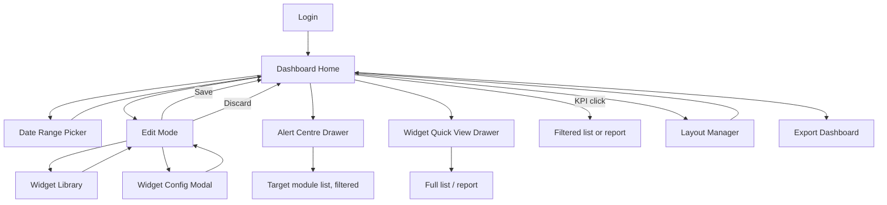
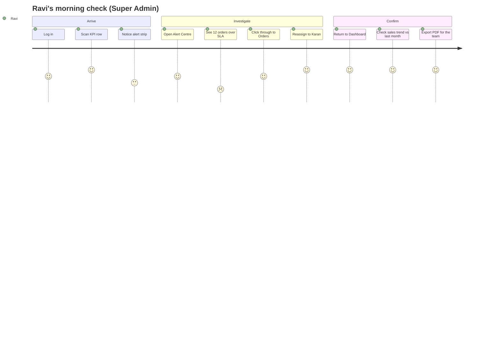
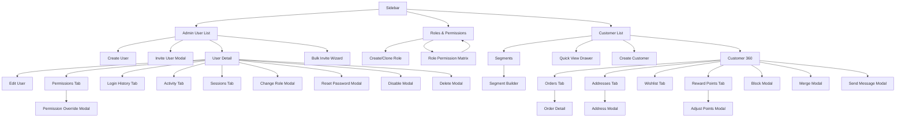
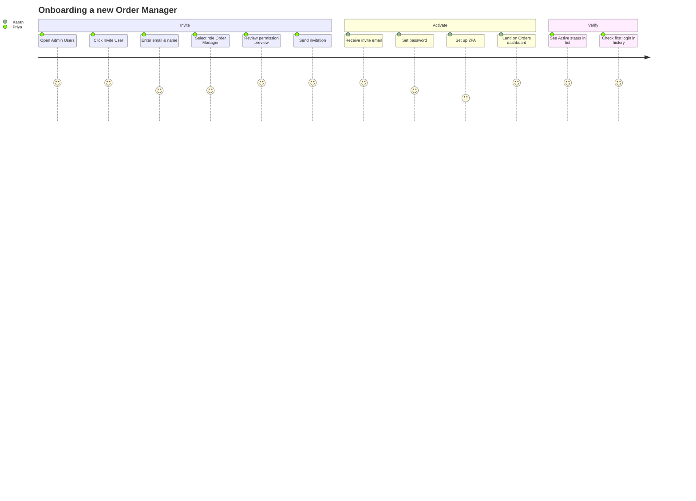

# Modules 01–02 — Dashboard & User Management

Enterprise Handicraft E-Commerce Platform · UI/UX Design Specification

---
---

# MODULE 01 · DASHBOARD

## 1.1 Business Goal

Give every role a 10-second answer to "Is the business healthy, and what needs me right now?" The dashboard is the most-visited screen in the product; it must reduce the need to open reports for routine questions, and route exceptions (low stock, failed payments, SLA breaches) to the right person before they become losses.

## 1.2 Purpose

- Surface the commercial state of the business (sales, revenue, profit, orders, customers)
- Surface operational exceptions requiring action
- Provide fast drill-through into the source records behind every number
- Adapt its widget composition to the signed-in role

## 1.3 Features

| # | Feature |
|---|---------|
| F-01 | Role-specific default dashboard layouts (9 variants) |
| F-02 | Global date range selector with comparison periods |
| F-03 | 16 configurable widgets (KPI, chart, list, alert types) |
| F-04 | Drag-and-drop dashboard customisation (Edit Mode) |
| F-05 | Per-widget refresh, configure, export, hide |
| F-06 | Real-time updates for orders, payments and stock alerts |
| F-07 | Drill-through from any metric to a filtered list or report |
| F-08 | Metric definition tooltips on every KPI |
| F-09 | Alert centre with prioritised action items |
| F-10 | Multiple saved dashboard layouts per user |
| F-11 | Goal/target tracking against monthly revenue targets |
| F-12 | Export dashboard as PDF snapshot |

## 1.4 Complete Screen List

| ID | Screen | Route | Type |
|----|--------|-------|------|
| SCR-01-01 | Dashboard Home (role-adaptive) | `/admin` | Page |
| SCR-01-02 | Dashboard Edit Mode | `/admin?edit=1` | Page state |
| SCR-01-03 | Widget Library / Add Widget | `/admin/widgets` | Page (or full modal) |
| SCR-01-04 | Dashboard Layout Manager | `/admin/dashboards` | Page |
| MOD-01-01 | Widget Configuration | — | Modal MD |
| MOD-01-02 | Date Range Picker (with compare) | — | Popover |
| MOD-01-03 | Metric Definition Info | — | Popover |
| MOD-01-04 | Export Dashboard | — | Modal SM |
| MOD-01-05 | Save Layout / Save As | — | Modal SM |
| MOD-01-06 | Reset Dashboard Confirm | — | Modal XS (destructive) |
| DRW-01-01 | Alert Centre | — | Drawer 480 |
| DRW-01-02 | Widget Data Detail (quick view) | — | Drawer 560 |
| WID-01-01 | Total Sales KPI | — | Widget |
| WID-01-02 | Today's Sales KPI | — | Widget |
| WID-01-03 | Monthly Sales KPI | — | Widget |
| WID-01-04 | Total Orders KPI | — | Widget |
| WID-01-05 | Pending Orders KPI | — | Widget |
| WID-01-06 | Cancelled Orders KPI | — | Widget |
| WID-01-07 | Customers KPI | — | Widget |
| WID-01-08 | Revenue KPI | — | Widget |
| WID-01-09 | Profit KPI | — | Widget |
| WID-01-10 | Sales Trend Chart | — | Widget |
| WID-01-11 | Best Selling Products | — | Widget (list) |
| WID-01-12 | Low Stock Alert | — | Widget (list) |
| WID-01-13 | Out of Stock | — | Widget (list) |
| WID-01-14 | Recent Orders | — | Widget (table) |
| WID-01-15 | Notifications / Activity | — | Widget (feed) |
| WID-01-16 | Website Visitors | — | Widget (chart + funnel) |

## 1.5 Navigation Flow



## 1.6 Screen Hierarchy

```
Dashboard Home (SCR-01-01)
├── Header: title, role chip, date range, compare toggle, actions
├── Alert strip (conditional)
├── KPI Row (4–6 widgets)
├── Primary chart row (Sales Trend, span 8 + Visitors span 4)
├── Operational row (Recent Orders span 8 + Low Stock span 4)
├── Insight row (Best Sellers span 4 + Out of Stock span 4 + Activity span 4)
└── Modals/Drawers
    ├── Date Range (MOD-01-02)
    ├── Alert Centre (DRW-01-01)
    ├── Widget Quick View (DRW-01-02)
    ├── Export (MOD-01-04)
    └── Edit Mode (SCR-01-02) → Widget Library (SCR-01-03) → Widget Config (MOD-01-01)
```

## 1.7 Desktop Layout (≥1280)

12-column widget grid, 24px gutter, row height 8px units with widget spans:

| Row | Widgets | Spans |
|-----|---------|-------|
| Alert strip | Alert banner (conditional) | 12 |
| 1 | Total Sales · Revenue · Orders · Customers | 3 / 3 / 3 / 3 |
| 2 | Today's Sales · Monthly Sales · Pending Orders · Cancelled Orders | 3 / 3 / 3 / 3 |
| 3 | Sales Trend chart · Website Visitors | 8 / 4 |
| 4 | Recent Orders table · Low Stock list | 8 / 4 |
| 5 | Best Selling Products · Out of Stock · Notifications feed | 4 / 4 / 4 |
| 6 | Profit widget (Finance/Admin only) · Goal gauge | 6 / 6 |

Widget heights: KPI 140, chart 400, list 400, table 440, feed 400.

## 1.8 Tablet Layout (768–1279)

- KPI widgets: 2 per row (span 6).
- Sales Trend: full width (12), height 320.
- Recent Orders: full width, priority columns only.
- Low Stock / Out of Stock / Best Sellers: 2 per row (span 6).
- Date range control moves below the title.

## 1.9 Mobile Layout (<768)

- KPIs: single column, height 108 (compact variant), or a horizontally swipeable carousel of 2-up cards with dots.
- Charts: full width, height 240, simplified axes, legend below as a 2-column list.
- Lists: max 5 items with "View all".
- Recent Orders: card list, 5 items.
- Sticky "Alerts (3)" pill under the header opening the Alert Centre sheet.
- Date range opens as a bottom sheet with preset chips.

## 1.10 Wireframe Description

### Desktop

```
┌──────────────────────────────────────────────────────────────────────────────────┐
│ Good morning, Ravi 👋                    [Last 30 Days ▾] [Compare ▾] [⋮] [Edit]  │
│ Here's how your store is performing.      Updated 2 min ago  ↻                    │
├──────────────────────────────────────────────────────────────────────────────────┤
│ ⚠ 3 items need attention: 24 low stock · 5 pending refunds · 2 failed payments    │
│                                                              [View All Alerts →]  │
├────────────────────┬────────────────────┬────────────────────┬───────────────────┤
│ TOTAL SALES     ⓘ │ REVENUE         ⓘ │ ORDERS          ⓘ │ CUSTOMERS      ⓘ │
│ ₹42,18,500         │ ₹38,94,200         │ 1,482              │ 3,214             │
│ ▲ 12.4% vs prev    │ ▲ 9.8% vs prev     │ ▲ 6.2% vs prev     │ ▲ 14.1% vs prev   │
│ ▁▂▄▆█▇▅            │ ▁▃▄▅█▆▅            │ ▂▃▅▄▆█▇            │ ▁▂▃▄▅▆█           │
├────────────────────┼────────────────────┼────────────────────┼───────────────────┤
│ TODAY'S SALES      │ THIS MONTH         │ PENDING ORDERS     │ CANCELLED         │
│ ₹1,24,800          │ ₹12,45,300         │ 47                 │ 12                │
│ ▲ 8.2% vs yest.    │ 78% of ₹16L target │ 12 over SLA ⚠      │ ▼ 3.1% vs prev ✓  │
│                    │ ████████░░ 78%     │                    │                   │
├────────────────────┴────────────────────┴───────┬────────────────────────────────┤
│ Sales Trend                     [D][W][M][Y] ⋮ │ Website Visitors            ⋮ │
│  ₹                                              │  Sessions      12,482          │
│  15L ┤                        ╭───              │  ▲ 18.2%                       │
│  10L ┤         ╭────╮   ╭─────╯                 │                                │
│   5L ┤ ╭───╮───╯    ╰───╯                       │  Visitors  ████████ 12,482     │
│    0 ┼─┴───┴───┴───┴───┴───┴───┴──               │  Product   ██████   8,214      │
│      1  5  10  15  20  25  30                   │  Cart      ███      3,102      │
│  ● This period  ○ Previous period                │  Checkout  ██       1,880      │
│                              [View as table]     │  Order     █        1,482      │
│                                                  │  CR 11.9%   [View Report →]    │
├──────────────────────────────────────────────────┴────────────────────────────────┤
│ Recent Orders                              ⋮ │ Low Stock                       ⋮ │
│ #HC-2026-000482 · Meera S. · ₹4,250 · ● New  │ [img] Brass Diya Set      3 left  │
│ #HC-2026-000481 · Arjun K. · ₹1,890 · ● Pack │ [img] Kantha Cushion      5 left  │
│ #HC-2026-000480 · Nisha P. · ₹12,400 · ● Ship│ [img] Blue Pottery Vase   6 left  │
│ #HC-2026-000479 · Rahul M. · ₹890 · ● Deliv  │ [img] Wooden Elephant     8 left  │
│ #HC-2026-000478 · Sara T. · ₹6,120 · ● New   │ [img] Pashmina Shawl      9 left  │
│                          [View All Orders →] │           [View Inventory →]      │
├──────────────────────┬───────────────────────┴────────────┬──────────────────────┤
│ Best Selling      ⋮ │ Out of Stock                    ⋮ │ Recent Activity   ⋮ │
│ 1 Blue Pottery  248  │ [img] Terracotta Planter  0 · 12d │ ● Anand published…   │
│ 2 Brass Diya    194  │ [img] Jute Rug            0 ·  4d │ ● Karan shipped…     │
│ 3 Kantha Cushion 176 │ [img] Silver Anklet       0 ·  2d │ ● New order #482     │
│ 4 Wooden Elephant 142│                                    │ ● Sunita adjusted…   │
│ 5 Pashmina Shawl 118 │        [Restock All →]            │      [View All →]    │
└──────────────────────┴────────────────────────────────────┴──────────────────────┘
```

### Mobile

```
┌──────────────────────────────┐
│ ☰  Dashboard        🔔3  👤 │
├──────────────────────────────┤
│ Good morning, Ravi           │
│ [Last 30 Days ▾]             │
├──────────────────────────────┤
│ ⚠ 3 alerts          [View →] │
├──────────────────────────────┤
│ ┌──────────────────────────┐ │
│ │ TOTAL SALES              │ │
│ │ ₹42,18,500               │ │
│ │ ▲ 12.4%   ▁▂▄▆█          │ │
│ └──────────────────────────┘ │
│ ┌──────────────────────────┐ │
│ │ ORDERS         1,482     │ │
│ └──────────────────────────┘ │
│   ● ● ○ ○  (swipe for more)  │
├──────────────────────────────┤
│ Sales Trend        [M ▾]     │
│ [compact chart 240h]         │
├──────────────────────────────┤
│ Recent Orders                │
│ [order card ×3]              │
│ [ View All Orders ]          │
├──────────────────────────────┤
│ 🏠  🛒  📦  🏭  ⋯           │
└──────────────────────────────┘
```

## 1.11 Header

| Element | Spec |
|---------|------|
| Greeting | "Good morning/afternoon/evening, {First Name}" + waving emoji; `heading-xl` |
| Subtitle | Role-specific: "Here's how your store is performing." / "Here's your fulfilment queue." |
| Date range | Date Range Picker with presets; default "Last 30 Days"; persists per user |
| Compare toggle | "Compare to: Previous period / Same period last year / None" |
| Last updated | "Updated 2 min ago" + refresh icon button (spins while loading) |
| Actions | `⋮` menu: Export as PDF, Email this dashboard, Manage layouts, Reset to default · `Edit Dashboard` button (permission-gated) |
| Real-time indicator | Green pulsing dot + "Live" when websocket-connected; amber "Reconnecting…" otherwise |

## 1.12 Sidebar

Dashboard is the first item, ungrouped, always visible to all roles, `layout-dashboard` icon, active state on this route. No sub-items.

## 1.13 Breadcrumb

Dashboard is the root — breadcrumb bar shows only `Dashboard` (non-clickable) or is hidden entirely on this screen. In Edit Mode: `Dashboard / Editing layout`.

## 1.14 Toolbar

The dashboard has no list toolbar. Its equivalent is the header control cluster (date range + compare + refresh + edit). In Edit Mode, a toolbar appears:

```
┌──────────────────────────────────────────────────────────────────────────┐
│ Editing "Executive Dashboard"   [+ Add Widget] [Reset] │ [Cancel] [Save]  │
└──────────────────────────────────────────────────────────────────────────┘
```

## 1.15 Action Buttons

| Button | Type | Location | Permission | Behaviour |
|--------|------|----------|------------|-----------|
| Edit Dashboard | Secondary | Header | All roles (own layout) | Enters Edit Mode |
| Add Widget | Primary | Edit toolbar | All | Opens Widget Library |
| Save | Primary | Edit toolbar | All | Persists layout, toast "Dashboard saved" |
| Cancel | Ghost | Edit toolbar | All | Unsaved-changes guard |
| Reset to Default | Danger Outline | `⋮` / Edit toolbar | All | Destructive confirm |
| Export as PDF | Menu item | `⋮` | All | Opens Export modal |
| Email Dashboard | Menu item | `⋮` | Admin+ | Opens recipient modal with schedule option |
| Manage Layouts | Menu item | `⋮` | All | Opens Layout Manager |
| Refresh | Icon button | Header | All | Re-fetches all widgets |
| View All Alerts | Link button | Alert strip | All | Opens Alert Centre drawer |
| Widget `⋮` | Icon button | Each widget | All | Refresh / Configure / Export / View full / Hide |

## 1.16 Search

No dedicated dashboard search. Global search (`⌘K`) is always available from the top bar. Individual list widgets (Recent Orders, Low Stock) do not include search — they link to their full module list instead.

## 1.17 Filters

| Filter | Type | Default | Scope | Notes |
|--------|------|---------|-------|-------|
| Date range | Date range with presets | Last 30 Days | Global (all widgets) | Presets incl. This Financial Year (Apr–Mar) |
| Comparison | Select | Previous period | Global | None / Previous period / Same period last year |
| Warehouse | Multi-select | All | Global (if multi-warehouse enabled) | Filters stock & fulfilment widgets |
| Sales channel | Multi-select | All | Global (future) | Reserved for marketplace channels |
| Widget-level period | Segmented (D/W/M/Y) | Inherits global | Per widget | Overrides global for that widget only, shown with an "override" dot |
| Widget-level category | Select | All | Best Sellers, Low Stock | — |

Rule: changing the global range re-fetches all widgets with a staggered skeleton (100ms cascade) rather than a single blocking spinner.

## 1.18 Sorting

| Widget | Sort |
|--------|------|
| Best Selling Products | By units sold desc (default) / revenue desc / margin desc — selectable in widget config |
| Low Stock | By units remaining asc |
| Out of Stock | By days out of stock desc |
| Recent Orders | By order date desc (fixed) |
| Activity feed | By time desc (fixed) |

## 1.19 Bulk Actions

Not applicable at the dashboard level. The Low Stock widget offers a single bulk shortcut: **"Restock All"** → opens Purchase Entry pre-filled with all listed low-stock SKUs. Out of Stock offers **"Create Purchase Order"** similarly.

## 1.20 Cards / Tables / Widgets

### 1.20.1 KPI Widget Specification

| Widget | Metric definition | Format | Positive direction | Drill-through |
|--------|-------------------|--------|--------------------|---------------|
| WID-01-01 Total Sales | Sum of order totals (incl. tax, excl. cancelled/returned) in range | ₹ compact | Up | `/admin/reports/sales` with range |
| WID-01-02 Today's Sales | Same, restricted to today, compared to yesterday | ₹ full | Up | `/admin/orders?date=today` |
| WID-01-03 Monthly Sales | Current calendar month to date + target progress bar | ₹ compact + % | Up | `/admin/reports/sales?period=month` |
| WID-01-04 Orders | Count of orders placed in range | Integer | Up | `/admin/orders?range=` |
| WID-01-05 Pending Orders | Orders in New/Confirmed/Processing | Integer + "n over SLA" | Down | `/admin/orders?status=pending` |
| WID-01-06 Cancelled Orders | Orders cancelled in range + cancellation rate % | Integer + % | Down | `/admin/orders?status=cancelled` |
| WID-01-07 Customers | Distinct customers with ≥1 order in range; secondary "n new" | Integer | Up | `/admin/customers?range=` |
| WID-01-08 Revenue | Net revenue = sales − discounts − returns − refunds (excl. tax & shipping) | ₹ compact | Up | `/admin/reports/sales` |
| WID-01-09 Profit | Revenue − COGS − shipping cost − payment fees | ₹ compact + margin % | Up | `/admin/reports/profit` (Finance/Admin only) |

Each KPI card contains: overline label, info tooltip with the exact definition and formula, value (`numeric-xl`), delta chip (arrow + % + "vs {comparison label}"), 7/30-point sparkline, optional secondary metric line, and a full-card click target.

### 1.20.2 Sales Trend Chart (WID-01-10)

| Aspect | Spec |
|--------|------|
| Type | Line with optional area fill; comparison series dashed |
| Granularity | Auto by range: ≤2d hourly, ≤31d daily, ≤120d weekly, else monthly; overridable via D/W/M/Y segmented control |
| Series | Sales (primary), Orders (secondary axis, toggleable), Previous period (dashed) |
| Annotations | Vertical markers for flash sales, festival offers and campaign launches with hover detail |
| Tooltip | Date, sales, orders, AOV, delta vs comparison |
| Actions | View as table, Download CSV/PNG, Full screen |
| Empty | "No sales in this period" + Change Date Range |

### 1.20.3 Website Visitors (WID-01-16)

Composite widget: sessions KPI + delta, plus a conversion funnel (Visitors → Product Views → Add to Cart → Checkout Started → Order Placed) with counts, stage-to-stage conversion %, and drop-off highlighted in `danger` when a stage drop exceeds its 30-day average by >10pp. Footer: "Conversion rate 11.9%" + "View Report →". Data source: analytics integration; if not configured, the widget shows a "Not configured" empty state with a "Connect Analytics" CTA.

### 1.20.4 Recent Orders (WID-01-14)

| Column | Width | Align | Cell type |
|--------|-------|-------|-----------|
| Order # | 150 | left | Mono link |
| Customer | flex | left | Avatar + name (truncate 22) |
| Items | 60 | right | Integer |
| Amount | 110 | right | Currency |
| Payment | 100 | centre | Status chip |
| Status | 130 | centre | Status chip |
| Time | 100 | right | Relative time |
| — | 40 | right | `chevron-right` |

10 rows; new orders arrive in real-time, sliding in at the top with a 2s `info-50` highlight and a count badge on the widget header.

### 1.20.5 Low Stock (WID-01-12) & Out of Stock (WID-01-13)

List rows: 48px thumbnail · product name (2-line clamp) · SKU (mono, caption) · right side: units remaining in a warning/danger chip + reorder level as caption. Out of Stock adds "Out for {n} days" and an estimated lost-revenue figure. Row action on hover: "Restock". Footer: "View Inventory →" / "Create Purchase Order →". Threshold source: per-product reorder level, falling back to a global default from Settings.

### 1.20.6 Best Selling Products (WID-01-11)

Ranked list with position number, thumbnail, name, category caption, units sold, revenue and a mini bar showing relative share. Config options: metric (units/revenue/margin), period, category filter, count (5/10/20).

### 1.20.7 Notifications / Activity (WID-01-15)

Compact activity feed, 8 entries, filterable by All / Orders / Inventory / System, each linking to the source record.

### 1.20.8 Alert Strip & Alert Centre (DRW-01-01)

The strip shows an aggregated count and the top 3 alert categories. The drawer lists prioritised, actionable alerts:

| Priority | Alert | Action |
|----------|-------|--------|
| Critical | Payment gateway offline | Open Settings → Payment |
| Critical | Orders past SLA (>24h unprocessed) | Open filtered order list |
| High | Out-of-stock bestsellers | Open Purchase Entry |
| High | Failed payments awaiting reconciliation | Open Payments |
| High | Refunds pending approval | Open Approvals |
| Medium | Low stock items | Open Inventory |
| Medium | Reviews pending moderation | Open Reviews |
| Medium | Products missing images / SEO | Open filtered Products |
| Low | Expiring coupons (7 days) | Open Coupons |
| Low | Draft products older than 14 days | Open filtered Products |

Each alert row: severity icon, title, count, one-line context, timestamp, primary action button, snooze menu (1h / 1d / 1w / Dismiss).

## 1.21 Forms & Fields

Only two forms exist in this module.

### Widget Configuration Modal (MOD-01-01)

| Field | Type | Required | Default | Notes |
|-------|------|----------|---------|-------|
| Widget title | Text | Yes | Widget default | Max 40 chars |
| Metric | Select | Yes | Per widget | Only for configurable widgets |
| Period override | Select | No | Inherit global | Inherit / Today / 7d / 30d / 90d / This month / This year |
| Comparison | Select | No | Inherit | None / Previous / Last year |
| Category filter | Multi-select | No | All | List widgets only |
| Warehouse filter | Multi-select | No | All | Stock widgets only |
| Row count | Segmented | No | 5 | 5 / 10 / 20 |
| Chart type | Segmented | No | Line | Line / Bar / Area (chart widgets) |
| Show comparison series | Switch | No | On | — |
| Show sparkline | Switch | No | On | KPI widgets |
| Colour accent | Colour select | No | Brand | 6 preset options |

### Layout Manager / Save Layout (MOD-01-05)

| Field | Type | Required | Validation |
|-------|------|----------|------------|
| Layout name | Text | Yes | 3–40 chars, unique per user — "You already have a layout with this name." |
| Set as default | Checkbox | No | — |
| Share with role | Multi-select | No | Admin+ only |

## 1.22 Validation Rules

| Field | Rule | Message |
|-------|------|---------|
| Date range · start | Required when Custom | "Select a start date." |
| Date range · end | ≥ start | "End date must be after the start date." |
| Date range · span | ≤ 366 days | "Select a range of 366 days or less." |
| Date range · future | Start ≤ today | "Start date can't be in the future." |
| Widget title | Required, ≤40 | "Widget title is required." / "Widget title must be 40 characters or fewer." |
| Layout name | Required, 3–40, unique | "Layout name is required." / "You already have a layout with this name." |
| Email dashboard · recipients | ≥1 valid email | "Add at least one recipient." / "'{value}' is not a valid email address." |
| Export · format | Required | "Choose an export format." |
| Widget count | ≤ 20 per layout | "You can add up to 20 widgets. Remove one first." |

## 1.23 Dropdowns & Data Sources

| Dropdown | Source | Notes |
|----------|--------|-------|
| Date range presets | Static | Includes Indian financial year |
| Comparison | Static | 3 options |
| Warehouse | `GET /api/warehouses?active=true` | Hidden if only one warehouse |
| Category (widget filter) | `GET /api/categories/tree` | Hierarchical multi-select |
| Metric selector | Static per widget type | — |
| Layout selector | `GET /api/dashboards?userId=` | Personal + shared |
| Email recipients | `GET /api/admin-users?active=true` + free email entry | Combobox |

## 1.24 Icons

| Element | Icon |
|---------|------|
| Dashboard nav | `layout-dashboard` |
| Total sales / revenue | `indian-rupee` |
| Orders | `shopping-cart` |
| Pending | `clock` |
| Cancelled | `circle-x` |
| Customers | `users` |
| Profit | `trending-up` |
| Low stock | `package-minus` |
| Out of stock | `package-x` |
| Visitors | `globe` |
| Best sellers | `award` |
| Activity | `activity` |
| Alerts | `triangle-alert` |
| Edit dashboard | `layout-grid` |
| Add widget | `plus` |
| Widget menu | `more-vertical` |
| Refresh | `refresh-cw` |
| Export | `download` |
| Info tooltip | `circle-help` |
| Delta up | `trending-up` / `arrow-up` |
| Delta down | `trending-down` / `arrow-down` |
| Drag handle | `grip-vertical` |

## 1.25 Pagination

Not used. Widgets are capped lists (5/10/20 configurable) with "View all →" links. The Alert Centre drawer uses infinite scroll with a "Load more" button after 50 items.

## 1.26 Notifications & Toasts

| Trigger | Type | Message | Actions |
|---------|------|---------|---------|
| Layout saved | Success | "Dashboard saved" | — |
| Layout reset | Success | "Dashboard reset to default" | Undo (8s) |
| Widget added | Success | "{Widget} added" | Undo |
| Widget removed | Success | "{Widget} removed" | Undo |
| Export queued | Info | "Preparing your PDF…" | — |
| Export ready | Success | "Dashboard PDF ready" | Download |
| Email sent | Success | "Dashboard sent to {n} recipients" | — |
| Widget load failed | Error (inline, not toast) | Widget error state | Retry |
| All widgets failed | Error | "Couldn't load dashboard data" | Try Again |
| Real-time connected | — (silent) | Live indicator turns green | — |
| Real-time lost | Warning | "Live updates paused. Reconnecting…" | — |
| New order (live) | Info | "New order #HC-2026-000483 · ₹4,250" | View |
| Stock hit zero (live) | Warning | "{Product} is now out of stock" | View |
| Payment failed (live) | Error | "Payment failed for order #…" | View |
| Target achieved | Success | "🎉 Monthly sales target reached" | View Report |

## 1.27 Dialogs

| Dialog | Type | Title | Body | Buttons |
|--------|------|-------|------|---------|
| Reset dashboard (MOD-01-06) | Destructive | "Reset dashboard to default?" | "Your custom widget layout for '{layout}' will be replaced with the default layout for your role. This can't be undone." | Cancel · Reset Dashboard |
| Discard layout changes | Warning | "Discard layout changes?" | "You've made changes to this dashboard that haven't been saved." | Keep Editing · Discard · Save & Exit |
| Remove widget | Simple confirm | "Remove {widget}?" | "You can add it back from the widget library at any time." | Cancel · Remove Widget |
| Export dashboard (MOD-01-04) | Form | "Export dashboard" | Format (PDF/PNG), page size, include filters, include comparison | Cancel · Export |
| Email dashboard | Form | "Email dashboard" | Recipients, subject, message, schedule (once/daily/weekly/monthly), time | Cancel · Send |
| Widget load error | Inline error | — | "Couldn't load {widget}. {reason}" | Retry |
| Delete layout | Destructive | "Delete layout '{name}'?" | "This layout will be removed for you{and everyone it's shared with}." | Cancel · Delete Layout |

## 1.28 Permission Matrix (Module 01)

| Action | Super Admin | Admin | Product | Inventory | Order | Marketing | Finance | Support | Content |
|--------|:-----------:|:-----:|:-------:|:---------:|:-----:|:---------:|:-------:|:-------:|:-------:|
| View dashboard | ✔ | ✔ | ✔ | ✔ | ✔ | ✔ | ✔ | ✔ | ✔ |
| See Revenue KPI | ✔ | ✔ | ✖ | ✖ | ✖ | ✔ | ✔ | ✖ | ✖ |
| See Profit KPI | ✔ | ✔ | ✖ | ✖ | ✖ | ✖ | ✔ | ✖ | ✖ |
| See Cost/Margin data | ✔ | ✔ | ✖ | ✖ | ✖ | ✖ | ✔ | ✖ | ✖ |
| See Customer PII in widgets | ✔ | ✔ | ✖ | ✖ | ✔ | ✖ | ✔ | ✔ | ✖ |
| Customise own layout | ✔ | ✔ | ✔ | ✔ | ✔ | ✔ | ✔ | ✔ | ✔ |
| Share layout with role | ✔ | ✔ | ✖ | ✖ | ✖ | ✖ | ✖ | ✖ | ✖ |
| Export dashboard | ✔ | ✔ | ✔ | ✔ | ✔ | ✔ | ✔ | ✖ | ✔ |
| Email/schedule dashboard | ✔ | ✔ | ✖ | ✖ | ✖ | ✔ | ✔ | ✖ | ✖ |
| Set store-wide default layout | ✔ | ✔ | ✖ | ✖ | ✖ | ✖ | ✖ | ✖ | ✖ |
| Snooze/dismiss alerts | ✔ | ✔ | ✔ | ✔ | ✔ | ✔ | ✔ | ✔ | ✔ |

Widgets a role cannot see are never rendered — they are removed from the layout, and the grid reflows (no empty gaps).

## 1.29 User Journey



**Narrative:** Ravi opens the admin at 9:05 AM. The KPI row confirms sales are up 12.4%. The alert strip flags 3 issues. He opens the Alert Centre, sees 12 orders past SLA, clicks through to a pre-filtered order list, bulk-assigns them, and returns via breadcrumb — the dashboard refreshes and the alert count drops to 2. Total elapsed: under 3 minutes.

## 1.30 UX Guidelines

| ID | Guideline |
|----|-----------|
| DG-01 | Never show a metric without its comparison context and its definition tooltip |
| DG-02 | Every number is clickable and lands on the exact records behind it — no dead numbers |
| DG-03 | Widgets load independently; one failure never blocks the page |
| DG-04 | Colour on deltas is semantic to the metric, not to direction |
| DG-05 | Do not exceed 12 widgets in a default layout — cognitive load beats completeness |
| DG-06 | Alerts must be actionable; informational-only items belong in the notification feed, not the alert strip |
| DG-07 | Real-time updates must never re-order or re-flow content the user is reading; new items enter at the top with a highlight |
| DG-08 | Currency uses compact notation in widgets with the full value in the tooltip |
| DG-09 | The dashboard is read-only apart from Edit Mode, snoozing alerts and widget-level shortcuts |
| DG-10 | Preserve the user's date range and layout across sessions |

## 1.31 Accessibility

- Each widget is a landmark region with an accessible name matching its title.
- KPI cards expose a combined accessible label: "Total sales, 42 lakh 18 thousand 500 rupees, up 12.4 percent versus previous period."
- Every chart has a "View as table" toggle rendering a proper data table.
- Delta direction is conveyed by an arrow icon and the words "up/down", not colour alone.
- The alert strip uses a polite live region; critical alerts use assertive.
- Real-time row insertion is announced: "New order added to recent orders."
- Edit Mode drag-and-drop has a keyboard equivalent: focus a widget, press `Space` to lift, arrows to move, `Space` to drop, `Esc` to cancel; positions announced ("Moved to row 2, column 1").
- All widget menus are keyboard reachable in DOM order matching the visual grid.
- Sparklines are decorative and hidden from screen readers (the delta carries the meaning).

## 1.32 Micro-interactions

| Interaction | Behaviour |
|-------------|-----------|
| First load | KPI values count up from 0 over 600ms ease-out (once only, never on refresh) |
| Refresh | Refresh icon spins; widgets show a 2px top progress line, data cross-fades |
| Widget hover | Elevation 1→2, `⋮` and drill-through chevron fade in |
| KPI hover | Sparkline points become visible; card lifts 1px |
| Chart hover | Crosshair line + tooltip follow the cursor; the hovered point enlarges to 6px |
| Legend click | Series fades to 15% opacity; axis rescales over 240ms |
| New live order | Row slides in from the top, `info-50` background fading over 2s; widget header count increments with a pulse |
| Stock crossing threshold | The stock chip pulses once and changes tone |
| Alert dismissed | Row collapses; the strip count decrements with a number roll |
| Target reached | Progress bar fills to 100% and a brief confetti burst plays (once per period, reduced-motion: static badge) |
| Edit Mode enter | Widgets gain a dashed outline and drag handle with a 240ms fade; a grid overlay appears at 8% opacity |
| Widget drag | Widget lifts (scale 1.02, elevation-3), others animate to make space, a drop placeholder outlines the target cell |
| Widget resize | Live grid snapping with a size label ("6 × 2") |

## 1.33 Loading / Empty / Error States

| State | Design |
|-------|--------|
| Initial load | Full skeleton: header controls render enabled, KPI skeletons (4), chart skeleton, list skeletons; staggered 100ms cascade |
| Widget loading | Individual skeleton inside the widget frame; header remains visible |
| Refresh | Existing data stays, 2px indeterminate bar at the widget top |
| No data (new store) | Onboarding dashboard variant: "Welcome to your store" + a 5-step setup checklist (Add products → Set up payments → Configure shipping → Add banners → Go live) with progress, replacing the KPI row |
| No data (period) | Per widget: "No data for this period" + "Change date range" |
| Widget error | `circle-alert` + "Couldn't load {widget}" + reason + Retry link + error reference |
| All widgets error | Page-level error state with Try Again |
| No permission (widget) | Lock icon + "Not available for your role" — but preferably the widget is simply absent |
| Analytics not configured | Visitors widget shows "Connect analytics to see visitor data" + "Connect" CTA |
| Offline | Global banner + widgets show "Last updated {time}" in their headers |

## 1.34 API & Database Dependencies

### API Endpoints

| Method | Endpoint | Purpose |
|--------|----------|---------|
| GET | `/api/dashboard/summary?from&to&compare&warehouse` | All KPI values in one call |
| GET | `/api/dashboard/sales-trend?from&to&granularity&compare` | Trend series |
| GET | `/api/dashboard/best-sellers?from&to&metric&limit&categoryId` | Ranked products |
| GET | `/api/dashboard/low-stock?threshold&limit&warehouseId` | Low stock list |
| GET | `/api/dashboard/out-of-stock?limit&warehouseId` | Out of stock list |
| GET | `/api/dashboard/recent-orders?limit` | Recent orders |
| GET | `/api/dashboard/activity?limit&type` | Activity feed |
| GET | `/api/dashboard/visitors?from&to` | Analytics + funnel |
| GET | `/api/dashboard/alerts` | Prioritised alerts |
| POST | `/api/dashboard/alerts/{id}/snooze` | Snooze alert |
| GET | `/api/dashboards` | User's saved layouts |
| POST | `/api/dashboards` | Create layout |
| PUT | `/api/dashboards/{id}` | Update layout |
| DELETE | `/api/dashboards/{id}` | Delete layout |
| POST | `/api/dashboards/{id}/export` | Queue PDF export |
| POST | `/api/dashboards/{id}/email` | Send/schedule email |
| WS | `/hub/dashboard` | Real-time orders, stock, payments |

### Database Entities (read)

`Orders`, `OrderItems`, `OrderStatusHistory`, `Payments`, `Refunds`, `Products`, `ProductVariants`, `Inventory`, `InventoryTransactions`, `Customers`, `Categories`, `Warehouses`, `AuditLog`, `AnalyticsSessions`, `DashboardLayouts`, `DashboardWidgets`, `UserPreferences`, `Targets`.

### Performance Notes

- KPI summary must be a single aggregate query hitting pre-computed daily rollup tables (`DailySalesSummary`, `DailyInventorySummary`), not live scans.
- Rollups refresh every 15 minutes; "Today" figures read live.
- The dashboard must render within 2.0s to interactive; each widget endpoint has a 3s timeout with graceful per-widget failure.

## 1.35 Figma Build Notes

### Components Required

`CMP-SRF-StatCard`, `CMP-WID-Frame`, `CMP-CHT-Line`, `CMP-CHT-Funnel`, `CMP-CHT-Sparkline`, `CMP-CHT-Gauge`, `CMP-DAT-Table` (compact), `CMP-DSP-ActivityFeed`, `CMP-FBK-Alert`, `CMP-OVL-Drawer`, `CMP-INP-DateRange`, `CMP-NAV-PageHeader`, `CMP-FBK-Skeleton` (KPI, chart, list presets), `CMP-FBK-EmptyState`, `CMP-IND-StatusChip`, `CMP-ACT-Button`, `CMP-NAV-Menu`.

### New Components to Build for This Module

| Component | Notes |
|-----------|-------|
| `CMP-WID-KPICard` | KPI-specific stat card with sparkline slot, target progress variant |
| `CMP-WID-ListWidget` | Ranked/alert list rows with thumbnail, metric and action slot |
| `CMP-WID-AlertStrip` | Aggregated alert banner with count and category summary |
| `CMP-WID-AlertRow` | Alert Centre row with severity, action and snooze menu |
| `CMP-WID-EditOverlay` | Edit Mode dashed outline + handle + resize grips |
| `CMP-WID-OnboardingChecklist` | New-store setup checklist |

### Auto Layout Structure

```
Frame: Dashboard (V, Fill × Hug, gap 24, padding 24)
├── Instance: PageHeader — Dashboard (Fill × Hug)
├── Instance: AlertStrip (Fill × Hug)              [conditional]
├── Frame: Grid Row 1 (H, Fill × 140, gap 24)
│   └── 4 × Instance: KPICard (Fill)
├── Frame: Grid Row 2 (H, Fill × 140, gap 24)
│   └── 4 × Instance: KPICard (Fill)
├── Frame: Grid Row 3 (H, Fill × 400, gap 24)
│   ├── Instance: WidgetFrame / Sales Trend (Fill, 8 cols → set width 66.6%)
│   └── Instance: WidgetFrame / Visitors (Fill, 4 cols → 33.3%)
├── Frame: Grid Row 4 (H, Fill × 440, gap 24)
│   ├── Instance: WidgetFrame / Recent Orders (66.6%)
│   └── Instance: WidgetFrame / Low Stock (33.3%)
└── Frame: Grid Row 5 (H, Fill × 400, gap 24)
    └── 3 × Instance: WidgetFrame (33.3% each)
```

Use a 12-column layout grid style on the frame and set widget widths as percentages so tablet/mobile reflow is a simple wrap change.

### Variants to Produce

| Component | Variants |
|-----------|----------|
| KPICard | Metric type (9) × State (Loaded/Loading/Error/No-Permission) × Trend (Up/Down/Flat/None) × Sparkline (On/Off) × Target (On/Off) |
| WidgetFrame | Span (3/4/6/8/12) × Height (SM/MD/LG) × State (Loaded/Loading/Empty/Error) × Header (Title/Title+Filter/Title+Actions) |
| ListWidget row | Type (Ranked/Low Stock/Out of Stock/Order/Activity) × State (Default/Hover) |
| AlertRow | Severity (Critical/High/Medium/Low) × State (Default/Hover/Snoozed) |

### Prototype Flow (PT-10 segment)

Dashboard → click KPI → filtered Orders list → back (state preserved) → Alert Centre drawer → click alert → Inventory filtered → back → Edit Mode → Add Widget → configure → Save → toast.

### Developer Notes

1. All widget endpoints are independent and must fail independently.
2. The grid is a 12-column CSS grid; widget spans are stored as `{x, y, w, h}` per widget in `DashboardLayouts`.
3. Currency compaction thresholds: ≥1,00,00,000 → Cr, ≥1,00,000 → L, ≥1,000 → K.
4. The delta chip's semantic direction is a widget property (`positiveDirection: up|down`), not derived from the sign.
5. Real-time uses SignalR; on disconnect, fall back to 60s polling and show the amber "Reconnecting" indicator.
6. Date range and layout preferences persist server-side under `UserPreferences`.
7. Target values come from `Targets` (monthly revenue target per store); if absent, hide the progress bar entirely.

### Future Scalability

- Multi-store/multi-channel selector in the header (reserved slot to the left of the date range).
- Widget marketplace for custom KPIs defined via the Report Builder.
- AI insight widget: "Sales dipped 18% on Tuesdays — investigate" (reserved 12-span slot at the top).
- Goal-setting UI per role and per module.
- Comparative benchmarking against category averages.

---
---

# MODULE 02 · USER MANAGEMENT

## 2.1 Business Goal

Enable safe delegation. The business must be able to grow its team without granting excessive access, must be able to prove who did what, and must manage the customer base (the revenue source) with a complete 360° view that supports both service and marketing.

## 2.2 Purpose

**Admin Users:** create, invite, configure, and audit internal staff accounts and their permissions.
**Customers:** view and manage the customer base — profiles, orders, addresses, wishlists, reward points, and account status.

## 2.3 Features

### Admin Users
| # | Feature |
|---|---------|
| AU-01 | Invite-based user creation with email activation |
| AU-02 | Direct creation with a temporary password |
| AU-03 | Role assignment (single primary role + optional additional roles) |
| AU-04 | Granular permission overrides on top of the role |
| AU-05 | Enable/disable/suspend accounts |
| AU-06 | Force password reset, force sign-out of all sessions |
| AU-07 | Two-factor enforcement per role |
| AU-08 | Login history & active session management |
| AU-09 | Per-user activity/audit trail |
| AU-10 | Department, reporting manager, employee ID metadata |
| AU-11 | Warehouse/branch scoping for Inventory and Order roles |
| AU-12 | Bulk invite via CSV |
| AU-13 | Role management: create, clone, edit and delete custom roles |
| AU-14 | Permission matrix editor |

### Customers
| # | Feature |
|---|---------|
| CU-01 | Customer list with rich filtering and segmentation |
| CU-02 | Customer 360 profile (orders, addresses, wishlist, reviews, points, tickets) |
| CU-03 | Manual customer creation and edit |
| CU-04 | Block/unblock with reason and audit |
| CU-05 | Reward points adjustment with reason |
| CU-06 | Address book management |
| CU-07 | Customer notes (internal) |
| CU-08 | Merge duplicate customers |
| CU-09 | Export customers (GDPR-aware) |
| CU-10 | Delete/anonymise customer data (right to be forgotten) |
| CU-11 | Customer segments (dynamic, rule-based) |
| CU-12 | Lifetime value, AOV, order frequency, churn-risk indicators |
| CU-13 | Impersonate customer on storefront (Super Admin) |
| CU-14 | Send email/SMS to a customer from the profile |

## 2.4 Complete Screen List

| ID | Screen | Route | Type |
|----|--------|-------|------|
| SCR-02-01 | Admin User List | `/admin/users` | Page |
| SCR-02-02 | Admin User Create | `/admin/users/create` | Page |
| SCR-02-03 | Admin User Detail | `/admin/users/{id}` | Page (tabs) |
| SCR-02-04 | Admin User Edit | `/admin/users/{id}/edit` | Page |
| SCR-02-05 | Roles & Permissions List | `/admin/roles` | Page |
| SCR-02-06 | Role Create / Edit (Permission Matrix) | `/admin/roles/{id}/edit` | Page |
| SCR-02-07 | Login History | `/admin/users/login-history` | Page |
| SCR-02-08 | Customer List | `/admin/customers` | Page |
| SCR-02-09 | Customer Detail (360) | `/admin/customers/{id}` | Page (tabs) |
| SCR-02-10 | Customer Create / Edit | `/admin/customers/create` `/{id}/edit` | Page |
| SCR-02-11 | Customer Segments | `/admin/customers/segments` | Page |
| SCR-02-12 | Segment Builder | `/admin/customers/segments/{id}` | Page |
| TAB-02-01 | User Detail · Overview | — | Tab |
| TAB-02-02 | User Detail · Permissions | — | Tab |
| TAB-02-03 | User Detail · Login History | — | Tab |
| TAB-02-04 | User Detail · Activity | — | Tab |
| TAB-02-05 | User Detail · Sessions | — | Tab |
| TAB-02-06 | Customer · Overview | — | Tab |
| TAB-02-07 | Customer · Orders | — | Tab |
| TAB-02-08 | Customer · Addresses | — | Tab |
| TAB-02-09 | Customer · Wishlist | — | Tab |
| TAB-02-10 | Customer · Reward Points | — | Tab |
| TAB-02-11 | Customer · Reviews | — | Tab |
| TAB-02-12 | Customer · Notes & Tickets | — | Tab |
| TAB-02-13 | Customer · Activity | — | Tab |
| MOD-02-01 | Invite User | — | Modal MD |
| MOD-02-02 | Bulk Invite (CSV) | — | Modal LG (wizard) |
| MOD-02-03 | Change Role | — | Modal SM |
| MOD-02-04 | Reset Password | — | Modal SM |
| MOD-02-05 | Force Sign-Out | — | Modal XS |
| MOD-02-06 | Disable User | — | Modal SM (destructive) |
| MOD-02-07 | Delete User | — | Modal SM (guarded destructive) |
| MOD-02-08 | Enable 2FA Requirement | — | Modal SM |
| MOD-02-09 | Permission Override | — | Modal LG |
| MOD-02-10 | Create/Clone Role | — | Modal MD |
| MOD-02-11 | Delete Role | — | Modal SM (guarded) |
| MOD-02-12 | Block Customer | — | Modal MD |
| MOD-02-13 | Unblock Customer | — | Modal SM |
| MOD-02-14 | Adjust Reward Points | — | Modal MD |
| MOD-02-15 | Add/Edit Address | — | Modal MD |
| MOD-02-16 | Delete Address | — | Modal XS |
| MOD-02-17 | Merge Customers | — | Modal LG |
| MOD-02-18 | Anonymise Customer (GDPR) | — | Modal MD (guarded) |
| MOD-02-19 | Send Message to Customer | — | Modal MD |
| MOD-02-20 | Add Customer Note | — | Modal SM |
| MOD-02-21 | Export Users / Customers | — | Modal MD |
| MOD-02-22 | Impersonate Customer Confirm | — | Modal SM |
| DRW-02-01 | Customer Quick View | — | Drawer 560 |
| DRW-02-02 | Admin User Quick View | — | Drawer 480 |
| DRW-02-03 | Advanced Filters | — | Drawer 400 |

## 2.5 Navigation Flow



## 2.6 Screen Hierarchy

```
User Management
├── Admin Users
│   ├── List (SCR-02-01)
│   │   ├── Invite modal, Bulk invite wizard, Export modal, Filters drawer, Quick view drawer
│   ├── Create (SCR-02-02)
│   ├── Detail (SCR-02-03)
│   │   ├── Overview · Permissions · Login History · Activity · Sessions
│   │   └── Modals: Change Role, Reset Password, Force Sign-Out, Disable, Delete, 2FA, Override
│   └── Edit (SCR-02-04)
├── Roles & Permissions
│   ├── List (SCR-02-05) → Create/Clone modal, Delete modal
│   └── Matrix Editor (SCR-02-06)
├── Login History (SCR-02-07)
└── Customers
    ├── List (SCR-02-08) → Quick view, Filters, Export, Bulk actions
    ├── Detail 360 (SCR-02-09) — 8 tabs
    ├── Create/Edit (SCR-02-10)
    └── Segments (SCR-02-11) → Segment Builder (SCR-02-12)
```

## 2.7 Desktop Layout

- **Admin User List:** L-01 full-width table with status tabs (All / Active / Invited / Disabled).
- **User Detail:** L-02 — left 8 cols tabs content, right 4 cols rail (profile card, role card, security card, quick actions).
- **Role Matrix Editor:** L-01 full width, sticky first column (module names) and sticky header (verb columns), with a role summary bar at the top.
- **Customer List:** L-01 with a segment selector rail option (L-03 9/3) when segments are enabled.
- **Customer 360:** L-02 — left 8 cols tabbed content, right 4 cols rail (profile card, lifetime stats, tags/segments, quick actions, recent activity).

## 2.8 Tablet Layout

- Tables show priority 1–2 columns; the rest scroll horizontally with a sticky name column.
- Detail pages stack: rail content moves below the tab content, except the profile card which stays at the top full-width.
- Role matrix becomes horizontally scrollable with a sticky module column; a "Jump to module" select is added.

## 2.9 Mobile Layout

- Lists become card lists. Customer cards show avatar, name, email, order count, LTV and status.
- Customer 360 tabs become a horizontally scrolling strip; the profile card is a full-width header block.
- Role matrix is not editable on mobile — read-only accordion by module with an "Edit on a larger screen" notice.
- Invite user is a full-screen sheet.

## 2.10 Wireframe Description

### SCR-02-01 · Admin User List (Desktop)

```
┌────────────────────────────────────────────────────────────────────────────────────┐
│ Dashboard / Administration / Admin Users                                            │
├────────────────────────────────────────────────────────────────────────────────────┤
│ Admin Users                            [Bulk Invite] [Export] [+ Invite User]       │
│ 14 users · 12 active · 1 invited · 1 disabled                                       │
├────────────────────────────────────────────────────────────────────────────────────┤
│ All (14) │ Active (12) │ Invited (1) │ Disabled (1) │ 2FA Not Set (3)               │
├────────────────────────────────────────────────────────────────────────────────────┤
│ [⌕ Search name, email, employee ID]  [Role ▾][Status ▾][Department ▾] [+ More] [⚙] │
├────────────────────────────────────────────────────────────────────────────────────┤
│ [☐] User                    Role            Department   2FA  Last Login    ●   ⋮  │
│ ────────────────────────────────────────────────────────────────────────────────── │
│ [☐] 👤 Ravi Menon           Super Admin     Management   ✓    2 min ago     ●   ⋮  │
│        ravi@company.com                                                             │
│ [☐] 👤 Priya Sharma         Admin           Operations   ✓    1 hour ago    ●   ⋮  │
│        priya@company.com                                                            │
│ [☐] 👤 Anand Iyer           Product Manager Catalog      ✗    3 hours ago   ●   ⋮  │
│        anand@company.com                                    ⚠ 2FA not set           │
│ [☐] 👤 Sunita Devi          Inventory Mgr   Warehouse    ✓    Yesterday     ●   ⋮  │
│        sunita@company.com                   Warehouse: Jaipur                       │
│ [☐] 👤 Meera Nair           Support         CX           ✓    Never         ◐   ⋮  │
│        meera@company.com                                    Invited 2 days ago      │
├────────────────────────────────────────────────────────────────────────────────────┤
│ Showing 1–14 of 14                                                                  │
└────────────────────────────────────────────────────────────────────────────────────┘
```

### SCR-02-03 · Admin User Detail

```
┌────────────────────────────────────────────────────────────────────────────────────┐
│ ◀ Priya Sharma  [● Active]                    [Reset Password] [⋮] [Edit User]     │
│   Admin · Operations · Last login 1 hour ago              ‹ 2 of 14 ›              │
├────────────────────────────────────────────────────────────────────────────────────┤
│ Overview │ Permissions │ Login History │ Activity │ Sessions (2)                    │
├──────────────────────────────────────────────────┬─────────────────────────────────┤
│ ┌─ Account Information ────────────────────────┐ │ ┌─ Profile ──────────────────┐  │
│ │ Full name        Priya Sharma                │ │ │      [ avatar 80 ]         │  │
│ │ Email            priya@company.com  ✓verified│ │ │      Priya Sharma          │  │
│ │ Phone            +91 98765 43210             │ │ │      Admin                 │  │
│ │ Employee ID      EMP-0042                    │ │ │      [● Active]            │  │
│ │ Department       Operations                  │ │ │  [Message] [Edit]          │  │
│ │ Reports to       Ravi Menon                  │ │ └────────────────────────────┘  │
│ │ Warehouse scope  All warehouses              │ │ ┌─ Security ─────────────────┐  │
│ │ Created          12 Jan 2024 by Ravi Menon   │ │ │ 2FA          ● Enabled     │  │
│ │ Last updated     03 Aug 2026 by Priya Sharma │ │ │ Password age 24 days       │  │
│ └──────────────────────────────────────────────┘ │ │ Failed logins 0            │  │
│ ┌─ Role & Access ──────────────────────────────┐ │ │ Sessions     2 active      │  │
│ │ Primary role    Admin            [Change]    │ │ │ [Force Sign-Out All]       │  │
│ │ Extra roles     —                            │ │ └────────────────────────────┘  │
│ │ Overrides       2 custom permissions [View]  │ │ ┌─ Quick Actions ────────────┐  │
│ │ Modules         18 of 20 accessible          │ │ │ Reset password             │  │
│ └──────────────────────────────────────────────┘ │ │ Require 2FA                │  │
│ ┌─ Recent Activity ────────────────────────────┐ │ │ Disable account            │  │
│ │ ● Updated product HC-POT-10241     2h ago    │ │ │ Delete account             │  │
│ │ ● Approved refund ₹4,250           3h ago    │ │ └────────────────────────────┘  │
│ │                          [View all →]        │ │                                 │
│ └──────────────────────────────────────────────┘ │                                 │
└──────────────────────────────────────────────────┴─────────────────────────────────┘
```

### SCR-02-06 · Role Permission Matrix

```
┌────────────────────────────────────────────────────────────────────────────────────┐
│ ◀ Edit Role: Order Manager                            [Cancel] [Save Role]          │
│   8 users have this role · Based on: Custom                                         │
├────────────────────────────────────────────────────────────────────────────────────┤
│ [⌕ Filter modules]   [Expand all] [Collapse all]  [Copy from role ▾]  Preset: [▾]  │
├──────────────────────┬──────┬──────┬──────┬──────┬───────┬────────┬──────┬─────────┤
│ Module               │ View │Create│ Edit │Delete│Publish│Approve │Export│ Config  │
├──────────────────────┼──────┼──────┼──────┼──────┼───────┼────────┼──────┼─────────┤
│ ▾ CATALOG            │  ◐   │  ☐   │  ◐   │  ☐   │   ☐   │   ☐    │  ☑   │   ☐     │
│    Products          │  ☑   │  ☐   │  ☐   │  ☐   │   ☐   │   ☐    │  ☑   │   ☐     │
│    Categories        │  ☑   │  ☐   │  ☐   │  ☐   │   ☐   │   ☐    │  ☐   │   ☐     │
│    Inventory         │  ☑   │  ☐   │  ☑   │  ☐   │   ☐   │   ☐    │  ☑   │   ☐     │
│ ▾ SALES              │  ☑   │  ☑   │  ☑   │  ◐   │   ☐   │   ◐    │  ☑   │   ◐     │
│    Orders            │  ☑   │  ☑   │  ☑   │  ☐   │   ☐   │   ☐    │  ☑   │   ☐     │
│    Returns           │  ☑   │  ☑   │  ☑   │  ☐   │   ☐   │   ☑    │  ☑   │   ☐     │
│    Payments          │  ☑   │  ☐   │  ☐   │  ☐   │   ☐   │   ☐    │  ☐   │   ☐     │
│    Shipping          │  ☑   │  ☑   │  ☑   │  ☑   │   ☐   │   ☐    │  ☑   │   ☑     │
│ ▸ CUSTOMERS          │  ☑   │  ☐   │  ☐   │  ☐   │   ☐   │   ☐    │  ☐   │   ☐     │
│ ▸ MARKETING          │  ☐   │  ☐   │  ☐   │  ☐   │   ☐   │   ☐    │  ☐   │   ☐     │
├────────────────────────────────────────────────────────────────────────────────────┤
│ ⚠ Changing this role affects 8 users immediately.        [Cancel] [Save Role]       │
└────────────────────────────────────────────────────────────────────────────────────┘
```
Group rows show a tri-state checkbox (☑ all / ◐ partial / ☐ none) that cascades to children.

### SCR-02-09 · Customer 360

```
┌────────────────────────────────────────────────────────────────────────────────────┐
│ ◀ Meera Nair  [● Active] [VIP]                  [Send Message] [⋮] [Edit Customer]  │
│   meera@example.com · +91 98765 12345 · Customer since Mar 2024                     │
├────────────────────────────────────────────────────────────────────────────────────┤
│ Overview │ Orders (18) │ Addresses (3) │ Wishlist (12) │ Points │ Reviews (4) │ … │
├──────────────────────────────────────────────────┬─────────────────────────────────┤
│ ┌─ Lifetime Summary ───────────────────────────┐ │ ┌─ Customer ─────────────────┐  │
│ │  ₹1,42,800    18       ₹7,933    42 days     │ │ │     [ avatar 80 ]          │  │
│ │  Lifetime     Orders   Avg order  Since last │ │ │     Meera Nair             │  │
│ │  value                            order      │ │ │     [● Active] [VIP]       │  │
│ └──────────────────────────────────────────────┘ │ │  meera@example.com  [copy] │  │
│ ┌─ Recent Orders ──────────────────────────────┐ │ │  +91 98765 12345    [copy] │  │
│ │ #HC-2026-000412 · 12 Jun · ₹4,250 · Delivered│ │ │  Bengaluru, KA             │  │
│ │ #HC-2026-000388 · 02 Jun · ₹8,900 · Delivered│ │ │  [Impersonate] [Message]   │  │
│ │ #HC-2026-000341 · 18 May · ₹1,200 · Returned │ │ └────────────────────────────┘  │
│ │                          [View all 18 →]     │ │ ┌─ Engagement ───────────────┐  │
│ └──────────────────────────────────────────────┘ │ │ Reward points     2,480    │  │
│ ┌─ Purchase Behaviour ─────────────────────────┐ │ │ Newsletter        Subscribed│ │
│ │ Top category   Home Décor (8 orders)         │ │ │ Reviews written   4        │  │
│ │ Favourite      Blue Pottery (3 purchases)    │ │ │ Wishlist items    12       │  │
│ │ Return rate    5.6% (1 of 18)                │ │ │ Segments          VIP, Repeat│ │
│ │ Churn risk     ● Low                         │ │ │ Tags              [+ Add]  │  │
│ └──────────────────────────────────────────────┘ │ └────────────────────────────┘  │
│ ┌─ Internal Notes ─────────────────────────────┐ │ ┌─ Quick Actions ────────────┐  │
│ │ 💬 Prefers weekend delivery — Meera (CX)     │ │ │ Adjust reward points       │  │
│ │    12 Jun 2026                               │ │ │ Add note                   │  │
│ │                              [+ Add Note]    │ │ │ Merge duplicate            │  │
│ └──────────────────────────────────────────────┘ │ │ Block customer             │  │
│                                                  │ │ Anonymise data (GDPR)      │  │
│                                                  │ └────────────────────────────┘  │
└──────────────────────────────────────────────────┴─────────────────────────────────┘
```

## 2.11 Header

| Screen | Title | Subtitle | Actions |
|--------|-------|----------|---------|
| Admin User List | "Admin Users" | "{n} users · {n} active · {n} invited · {n} disabled" | Bulk Invite, Export, **+ Invite User** |
| Admin User Detail | "{Full Name}" + status chip | "{Role} · {Department} · Last login {relative}" + record nav | Reset Password, `⋮`, **Edit User** |
| Roles List | "Roles & Permissions" | "{n} roles · {n} custom" | **+ Create Role** |
| Role Editor | "Edit Role: {name}" | "{n} users have this role · Based on: {base}" | Cancel, **Save Role** |
| Customer List | "Customers" | "{n} customers · {n} active this month · ₹{LTV avg} avg lifetime value" | Export, Segments, **+ Add Customer** |
| Customer Detail | "{Full Name}" + status + segment chips | "{email} · {phone} · Customer since {month year}" | Send Message, `⋮`, **Edit Customer** |
| Segments | "Customer Segments" | "{n} segments · {n} dynamic" | **+ Create Segment** |

## 2.12 Sidebar

- Admin Users, Roles & Permissions, Audit Log live under **ADMINISTRATION**.
- Customers, Segments, Reward Points live under **CUSTOMERS**.
- Admin Users shows a badge count of pending invitations.
- Customers shows no badge.

## 2.13 Breadcrumb

```
Dashboard / Administration / Admin Users
Dashboard / Administration / Admin Users / Priya Sharma
Dashboard / Administration / Admin Users / Priya Sharma / Edit
Dashboard / Administration / Roles & Permissions / Order Manager
Dashboard / Customers / Customer List
Dashboard / Customers / Customer List / Meera Nair
Dashboard / Customers / Segments / VIP Customers
```
Record names truncate at 32 chars with a tooltip.

## 2.14 Toolbar

### Admin User List
| Slot | Control |
|------|---------|
| Search | "Search name, email, employee ID" |
| Filter 1 | Role (multi-select) |
| Filter 2 | Status (multi-select: Active, Invited, Disabled, Locked) |
| Filter 3 | Department (multi-select) |
| More | 2FA status, Warehouse scope, Created date, Last login range, Created by |
| Right | Saved views, Column manager, Density, Refresh |

### Customer List
| Slot | Control |
|------|---------|
| Search | "Search name, email, phone, customer ID" |
| Filter 1 | Status (Active, Blocked, Guest, Unverified) |
| Filter 2 | Segment (multi-select) |
| Filter 3 | Orders (None, 1, 2–5, 6–10, 10+) |
| More | Registration date, Last order date, Lifetime value range, City/State, Newsletter status, Reward points range, Has reviews, Churn risk, Acquisition source, Tags |
| Right | Saved views, Column manager, Density, Refresh |

## 2.15 Action Buttons

### Admin Users
| Action | Type | Location | Permission | Confirmation |
|--------|------|----------|------------|--------------|
| Invite User | Primary | List header | Super Admin, Admin | — |
| Bulk Invite | Secondary | List header | Super Admin, Admin | — |
| Export | Outline | List header | Super Admin, Admin | Export modal |
| Edit User | Primary | Detail header | Super Admin, Admin | — |
| Change Role | Menu | Detail `⋮` + row `⋮` | Super Admin only | Modal + re-auth |
| Reset Password | Secondary | Detail header | Super Admin, Admin | Modal |
| Force Sign-Out | Menu | Detail `⋮` | Super Admin, Admin | Confirm |
| Require 2FA | Menu | Detail `⋮` | Super Admin, Admin | Confirm |
| Resend Invitation | Menu | Row `⋮` (invited only) | Super Admin, Admin | Toast |
| Cancel Invitation | Menu | Row `⋮` (invited only) | Super Admin, Admin | Confirm |
| Disable User | Menu (danger) | Detail `⋮` | Super Admin, Admin | Destructive modal |
| Enable User | Menu | Detail `⋮` | Super Admin, Admin | Confirm |
| Delete User | Menu (danger) | Detail `⋮` | Super Admin only | Guarded destructive + re-auth |
| Impersonate | Menu | Detail `⋮` | Super Admin only | Confirm modal |
| View Audit | Menu | Detail `⋮` | Super Admin, Admin | Navigates |

### Customers
| Action | Type | Location | Permission | Confirmation |
|--------|------|----------|------------|--------------|
| Add Customer | Primary | List header | Admin+ | — |
| Export | Outline | List header | Admin+, Marketing, Finance | Export modal (PII warning) |
| Edit Customer | Primary | Detail header | Admin+, Support | — |
| Send Message | Secondary | Detail header | Admin+, Support, Marketing | Modal |
| Adjust Points | Menu | Detail `⋮` | Admin+, Finance, Marketing | Modal + reason |
| Add Note | Menu | Detail `⋮` | All with customer view | Modal |
| Merge Duplicate | Menu | Detail `⋮` | Admin+ | Modal (guarded) |
| Block Customer | Menu (danger) | Detail `⋮` | Admin+ (Support: request) | Modal + reason |
| Unblock Customer | Menu | Detail `⋮` | Admin+ | Confirm |
| Impersonate on Storefront | Menu | Detail `⋮` | Super Admin | Confirm + audit banner |
| Anonymise (GDPR) | Menu (danger) | Detail `⋮` | Super Admin | Guarded + re-auth |
| Resend Verification | Menu | Detail `⋮` | Admin+, Support | Toast |
| Create Order For | Menu | Detail `⋮` | Admin+, Support | Navigates to order create |

## 2.16 Search

| Screen | Searchable fields | Behaviour |
|--------|------------------|-----------|
| Admin Users | Full name, email, phone, employee ID | Debounce 300ms, min 2 chars, highlight match |
| Customers | Full name, email, phone, customer ID, order number (returns the customer who owns it) | Debounce 300ms; exact phone/email match ranks first; order-number search shows an "Order match" badge |
| Roles | Role name, description | Client-side (small set) |
| Login History | User name, IP address | Server-side |
| Permission matrix | Module/permission name | Client-side filter, highlights matches and expands their groups |

## 2.17 Filters

### Admin Users
| Filter | Type | Options | Default |
|--------|------|---------|---------|
| Role | Multi-select | 9 system roles + custom | All |
| Status | Multi-select | Active, Invited, Disabled, Locked, Password Expired | All |
| Department | Multi-select | From settings-managed list | All |
| 2FA | Segmented | Any / Enabled / Not set | Any |
| Warehouse scope | Multi-select | Warehouse list | All |
| Last login | Date range + presets | Today, 7d, 30d, 90d, Never | All |
| Created date | Date range | — | All |
| Created by | Select (admin users) | — | All |

### Customers
| Filter | Type | Options | Default |
|--------|------|---------|---------|
| Status | Multi-select | Active, Blocked, Unverified, Guest | Active |
| Segment | Multi-select | Dynamic segment list | All |
| Order count | Segmented/range | 0, 1, 2–5, 6–10, 10+ | All |
| Lifetime value | Numeric range (₹) | — | All |
| Registration date | Date range | — | All |
| Last order date | Date range + "Never" | — | All |
| City / State | Multi-select cascading | Indian states → cities | All |
| Country | Multi-select | — | All |
| Newsletter | Segmented | Any / Subscribed / Unsubscribed | Any |
| Reward points | Numeric range | — | All |
| Has reviews | Toggle | — | Off |
| Churn risk | Multi-select | Low / Medium / High | All |
| Acquisition source | Multi-select | Organic, Paid, Social, Referral, Direct | All |
| Tags | Tag multi-select | — | All |

## 2.18 Sorting

| List | Sortable columns | Default |
|------|-----------------|---------|
| Admin Users | Name, Role, Department, Last Login, Created | Last Login desc |
| Roles | Name, Users count, Created | Name asc (system roles first) |
| Login History | Timestamp, User, IP, Result | Timestamp desc |
| Customers | Name, Registered, Last Order, Orders, Lifetime Value, Reward Points | Registered desc |
| Customer Orders tab | Date, Amount, Status | Date desc |
| Addresses | — (default first) | Default address first |
| Wishlist | Added date, Price, Availability | Added desc |
| Points ledger | Date, Points, Type | Date desc |

## 2.19 Bulk Actions

### Admin Users
| Action | Confirmation | Notes |
|--------|--------------|-------|
| Change department | Simple confirm | — |
| Require 2FA | Simple confirm | Sends notification emails |
| Disable users | Destructive confirm, count stated | Excludes self and last Super Admin |
| Enable users | Simple confirm | — |
| Resend invitations | Toast only | Invited users only |
| Export selected | Export modal | — |
| Delete users | Guarded destructive + re-auth | Super Admin only; blocks self and last Super Admin |

### Customers
| Action | Confirmation | Notes |
|--------|--------------|-------|
| Add to segment | Simple confirm | Static segments only |
| Remove from segment | Simple confirm | — |
| Add tag / Remove tag | Simple confirm | — |
| Send email campaign | Opens campaign composer pre-filtered | Marketing+ |
| Adjust reward points | Modal with amount + reason | Applies to all selected; warns on total impact |
| Subscribe/Unsubscribe newsletter | Confirm with consent warning | Compliance note shown |
| Block customers | Destructive + reason | Admin+ |
| Export selected | Export modal with PII warning | — |
| Delete/anonymise | Guarded destructive + re-auth | Super Admin only |

## 2.20 Cards / Tables / Widgets

### 2.20.1 Admin User List — Columns

| Key | Label | Width | Align | Sortable | Priority | Cell type |
|-----|-------|-------|-------|----------|----------|-----------|
| select | — | 48 | centre | no | 1 | Checkbox |
| user | User | flex min 260 | left | yes (name) | 1 | Avatar 40 + name (600) + email (caption) |
| role | Role | 160 | left | yes | 1 | Role chip |
| department | Department | 140 | left | yes | 2 | Text |
| warehouseScope | Warehouse | 140 | left | no | 3 | Text or "All" |
| twoFactor | 2FA | 70 | centre | no | 2 | Check/cross icon + tooltip |
| lastLogin | Last Login | 140 | right | yes | 1 | Relative time, "Never" in tertiary |
| createdAt | Created | 120 | right | yes | 4 | Date |
| status | Status | 120 | centre | yes | 1 | Status chip |
| actions | — | 96 | right | no | 1 | Row actions |

Row actions: View, Edit, Reset Password, `⋮` (Change Role, Force Sign-Out, Resend Invite, Disable, Delete).

### 2.20.2 Customer List — Columns

| Key | Label | Width | Align | Sortable | Priority | Cell type |
|-----|-------|-------|-------|----------|----------|-----------|
| select | — | 48 | centre | no | 1 | Checkbox |
| customer | Customer | flex min 260 | left | yes | 1 | Avatar + name + email |
| phone | Phone | 150 | left | no | 2 | Masked with reveal (audited) |
| location | Location | 160 | left | no | 3 | City, State |
| orders | Orders | 90 | right | yes | 1 | Integer link → orders filtered |
| lifetimeValue | Lifetime Value | 140 | right | yes | 1 | Currency |
| lastOrder | Last Order | 130 | right | yes | 1 | Relative date |
| points | Points | 100 | right | yes | 3 | Integer |
| segments | Segments | 180 | left | no | 3 | Tag list (+N overflow) |
| source | Source | 120 | left | yes | 4 | Text |
| registered | Registered | 130 | right | yes | 2 | Date |
| status | Status | 110 | centre | yes | 1 | Status chip |
| actions | — | 96 | right | no | 1 | Row actions |

### 2.20.3 Customer 360 Widgets

| Widget | Contents |
|--------|----------|
| Lifetime summary | LTV, orders, AOV, days since last order (4-up stat strip) |
| Purchase behaviour | Top category, favourite product, return rate, churn-risk chip with explanation tooltip |
| Recent orders | 3–5 order rows with status chips |
| Engagement | Reward points, newsletter status, review count, wishlist count, segments, tags |
| Internal notes | Note feed with author, timestamp and add action |
| Addresses summary | Default billing/shipping cards |

### 2.20.4 Login History Table — Columns

Timestamp · User (avatar + name) · IP address · Location (geo-IP) · Device/Browser · Method (Password / 2FA / SSO) · Result (Success / Failed / Blocked) · Session duration · Actions (View details, Force sign-out).

Failed rows are tinted `danger-50` with a `danger` left border. Consecutive failures from the same IP group into a single expandable row: "5 failed attempts from 103.21.x.x".

### 2.20.5 Sessions Tab

Card per active session: device icon, browser + OS, IP, location, "Current session" badge, started at, last active, and a "Sign Out" button. Header action: "Sign Out All Other Sessions".

### 2.20.6 Reward Points Tab

Header stat strip: Current balance · Lifetime earned · Lifetime redeemed · Expiring soon (with date).
Ledger table: Date · Type (Earned / Redeemed / Adjusted / Expired) · Points (+/− coloured) · Balance after · Reference (order link) · Reason · By (admin name for adjustments).

## 2.21 Forms & Fields

### 2.21.1 Invite User (MOD-02-01) / Create User (SCR-02-02)

| Field | Type | Required | Placeholder / Default | Help text |
|-------|------|----------|----------------------|-----------|
| Email address | Email | Yes | name@company.com | "The invitation will be sent here." |
| Full name | Text | Yes | — | — |
| Phone | Phone (+91 prefix) | No | 98765 43210 | "Used for SMS alerts and 2FA." |
| Employee ID | Text | No | EMP-0000 | — |
| Primary role | Select | Yes | — | "Determines what this user can access." + "Compare roles" link |
| Additional roles | Multi-select | No | — | "Permissions are combined (most permissive wins)." |
| Department | Select + create | No | — | — |
| Reports to | Combobox (admin users) | No | — | — |
| Warehouse scope | Multi-select | Conditional (Inventory/Order roles) | All warehouses | "Limits this user to specific warehouses." |
| Require 2FA | Switch | No | On for Admin/Super Admin/Finance | Locked on for roles where policy mandates it |
| Send welcome email | Switch | No | On | — |
| Set password manually | Switch | No | Off | Reveals password fields; disables invitation flow |
| Temporary password | Password + generate | Conditional | — | "The user must change this at first sign-in." |
| Access expires on | Date | No | — | "Useful for contractors and seasonal staff." |
| Personal message | Textarea | No | — | Max 300 chars, included in the invitation email |

Role selection shows a live **permission preview panel**: "This role can: view and manage orders, view products, …" with a "See full permissions" link.

### 2.21.2 Customer Create / Edit (SCR-02-10)

| Section | Field | Type | Required | Validation notes |
|---------|-------|------|----------|------------------|
| Personal | First name | Text | Yes | 2–50 chars, letters/spaces/hyphens |
| | Last name | Text | Yes | 2–50 chars |
| | Email | Email | Yes | Unique |
| | Phone | Phone | Yes | Unique, 10 digits with country code |
| | Alternate phone | Phone | No | — |
| | Date of birth | Date | No | Age ≥ 13; used for birthday offers |
| | Gender | Select | No | Female / Male / Other / Prefer not to say |
| Account | Customer status | Select | Yes | Active / Blocked / Unverified |
| | Email verified | Switch | No | Admin override |
| | Phone verified | Switch | No | Admin override |
| | Customer group | Select | No | Retail / Wholesale / VIP (future B2B) |
| | Tags | Tag input | No | — |
| | Segments | Read-only chips | — | Dynamic segments shown as computed |
| | Acquisition source | Select | No | — |
| Preferences | Newsletter subscription | Switch | No | Consent timestamp recorded |
| | SMS notifications | Switch | No | — |
| | WhatsApp notifications | Switch | No | — |
| | Preferred language | Select | No | Defaults to store language |
| | Preferred currency | Select | No | Multi-currency stores |
| Address (default) | Address label | Select/Text | No | Home / Work / Other |
| | Full name (recipient) | Text | Yes | — |
| | Phone | Phone | Yes | — |
| | Address line 1 | Text | Yes | 5–100 chars |
| | Address line 2 | Text | No | — |
| | Landmark | Text | No | — |
| | PIN code | Text | Yes | 6 digits; auto-fills city/state |
| | City | Text/Select | Yes | Auto-filled, editable |
| | State | Select | Yes | Auto-filled |
| | Country | Select | Yes | Default India |
| | Address type | Radio | No | Billing / Shipping / Both |
| | Set as default | Checkbox | No | — |
| Internal | Internal note | Textarea | No | Never customer-visible; label states so |

### 2.21.3 Adjust Reward Points (MOD-02-14)

| Field | Type | Required | Notes |
|-------|------|----------|-------|
| Adjustment type | Radio cards | Yes | Add points / Deduct points / Set balance |
| Points | Number | Yes | 1–100,000; live preview "New balance: 3,480" |
| Reason | Select | Yes | Compensation, Promotion, Correction, Loyalty bonus, Manual redemption, Other |
| Reason detail | Textarea | Conditional (Other) | Min 10 chars |
| Expiry | Date | No | Defaults to policy expiry |
| Notify customer | Switch | No | Default on; shows the email preview link |

### 2.21.4 Block Customer (MOD-02-12)

| Field | Type | Required | Notes |
|-------|------|----------|-------|
| Reason | Select | Yes | Fraudulent activity, Payment abuse, Excessive returns, Abusive behaviour, Duplicate account, Customer request, Other |
| Details | Textarea | Yes | Min 20 chars; internal only |
| Block scope | Checkbox group | Yes | ☑ Prevent new orders ☑ Prevent sign-in ☐ Cancel pending orders ☐ Unsubscribe from marketing |
| Notify customer | Switch | No | Default off; shows the email template preview if on |
| Block until | Date | No | Empty = indefinite |

Consequence panel: "This customer has 2 open orders (₹8,900). Blocking will not cancel them unless you select that option."

### 2.21.5 Merge Customers (MOD-02-17)

Two-column comparison of the primary and duplicate record with a radio per conflicting field to choose the surviving value; a summary of what transfers (orders, addresses, points, reviews, wishlist); and a warning that the merge is irreversible. Requires typing the duplicate's email to confirm.

## 2.22 Validation Rules

### Admin User
| Field | Rule | Message |
|-------|------|---------|
| Email | Required | "Email address is required." |
| Email | Valid format | "Enter a valid email address." |
| Email | Unique among admin users | "An admin user with this email already exists." |
| Email | Domain allow-list (if configured) | "Only company email addresses are allowed." |
| Full name | Required, 2–100 | "Full name is required." |
| Phone | Valid 10-digit + country code | "Enter a valid 10-digit mobile number." |
| Phone | Unique when 2FA by SMS is required | "This phone number is already registered to another user." |
| Employee ID | Unique if provided | "This employee ID is already in use." |
| Primary role | Required | "Select a role for this user." |
| Primary role | Cannot assign Super Admin unless actor is Super Admin | "Only a Super Admin can assign the Super Admin role." |
| Warehouse scope | Required for Inventory Manager | "Select at least one warehouse for this role." |
| Temporary password | 12+ chars, upper, lower, number, symbol | "Password must be at least 12 characters and include upper case, lower case, a number and a symbol." |
| Access expiry | Future date | "Choose a date in the future." |
| Self-modification | Cannot change own role | "You can't change your own role. Ask another Super Admin." |
| Last Super Admin | Cannot disable/delete/demote | "This is the only Super Admin. Assign the role to someone else first." |

### Customer
| Field | Rule | Message |
|-------|------|---------|
| First/Last name | Required, 2–50, letters/spaces/hyphens/apostrophes | "First name is required." / "Names can only contain letters, spaces, hyphens and apostrophes." |
| Email | Required, valid, unique | "A customer with this email already exists. [View customer]" |
| Phone | Required, valid, unique | "A customer with this phone number already exists. [View customer]" |
| Date of birth | Age ≥13 and ≤120 | "Customers must be at least 13 years old." |
| PIN code | 6 digits, exists in the serviceability list | "Enter a valid 6-digit PIN code." / "We don't deliver to this PIN code yet." |
| Address line 1 | Required, 5–100 | "Address is required." |
| City/State/Country | Required | "{Label} is required." |
| Reward points | Integer 1–100,000 | "Enter a whole number between 1 and 100,000." |
| Reward points deduct | ≤ current balance | "Customer only has 2,480 points available." |
| Block reason detail | Min 20 chars | "Add at least 20 characters explaining the reason." |
| Merge | Cannot merge into self | "Choose a different customer to merge." |
| Merge confirm | Typed email must match | "The email doesn't match." |
| GDPR anonymise | Typed "ANONYMISE" required | "Type ANONYMISE to confirm." |

### Role
| Field | Rule | Message |
|-------|------|---------|
| Role name | Required, 3–50, unique | "A role with this name already exists." |
| Permissions | At least one View permission | "Give this role access to at least one module." |
| System roles | Cannot rename/delete | "System roles can't be renamed or deleted. Duplicate it instead." |
| Delete role | No users assigned | "12 users have this role. Reassign them before deleting." |
| Dependency | Edit without View auto-enables View | Inline note: "Edit access requires View access — we've enabled it." |

## 2.23 Dropdowns & Data Sources

| Dropdown | Source | Dependency |
|----------|--------|-----------|
| Primary/additional role | `GET /api/roles` | — |
| Department | `GET /api/settings/departments` (+ inline create) | — |
| Reports to | `GET /api/admin-users?active=true` | Excludes self |
| Warehouse scope | `GET /api/warehouses?active=true` | Shown only for scoped roles |
| Customer status | Static enum | — |
| Customer group | `GET /api/customer-groups` | — |
| Segment | `GET /api/segments` | — |
| Tags | `GET /api/tags?type=customer` (+ create) | — |
| Country | Static ISO list | — |
| State | `GET /api/geo/states?country=` | Depends on country |
| City | `GET /api/geo/cities?state=` or PIN lookup | Depends on state / PIN |
| PIN → City/State | `GET /api/geo/pincode/{pin}` | Auto-fill on 6 digits |
| Points reason | Static enum | — |
| Block reason | Static enum | — |
| Acquisition source | `GET /api/settings/acquisition-sources` | — |
| Language | `GET /api/settings/locales` | — |
| Currency | `GET /api/settings/currencies` | — |

## 2.24 Icons

| Element | Icon |
|---------|------|
| Admin Users nav | `users` |
| Roles | `shield-check` |
| Permissions | `key` |
| Customers nav | `user-round` |
| Segments | `filter` |
| Invite | `user-plus` |
| Bulk invite | `users-round` |
| Reset password | `key-round` |
| 2FA enabled | `shield-check` (success) |
| 2FA missing | `shield-alert` (warning) |
| Sessions | `monitor-smartphone` |
| Force sign-out | `log-out` |
| Disable | `user-x` |
| Enable | `user-check` |
| Block customer | `ban` |
| Impersonate | `venetian-mask` |
| Merge | `merge` |
| Anonymise | `user-round-x` |
| Login history | `history` |
| Reward points | `gem` |
| Wishlist | `heart` |
| Address | `map-pinned` |
| Notes | `sticky-note` |
| Verified | `badge-check` |
| VIP | `crown` |
| Churn risk | `trending-down` |

## 2.25 Pagination

- Admin Users: numbered, 25/page default (rarely exceeds one page).
- Customers: numbered, 25/page default, options 10/25/50/100/200; jump-to-page for large bases; count "Showing 1–25 of 3,214".
- Login History: numbered, 50/page default, compact density.
- Customer Orders tab: 10/page, simple pager.
- Points ledger: 25/page.
- Wishlist: infinite scroll (grid).

## 2.26 Notifications & Toasts

| Trigger | Type | Message | Action |
|---------|------|---------|--------|
| Invitation sent | Success | "Invitation sent to {email}" | Resend |
| Bulk invitations sent | Success | "{n} invitations sent · {m} failed" | View Report |
| User created | Success | "{Name} added as {Role}" | View User |
| User updated | Success | "Changes saved" | — |
| Role changed | Success | "{Name}'s role changed to {Role}" | Undo (8s) |
| Password reset sent | Success | "Password reset link sent to {email}" | — |
| Temporary password set | Success | "Temporary password set. Share it securely." | Copy Password |
| Forced sign-out | Success | "{Name} signed out of {n} sessions" | — |
| User disabled | Success | "{Name} disabled" | Undo |
| User enabled | Success | "{Name} enabled" | — |
| User deleted | Success | "{Name} deleted" | — (no undo; audit only) |
| Invitation expired | Warning (inline chip) | "Invitation expired {n} days ago" | Resend |
| Last Super Admin block | Error | "You can't remove the only Super Admin" | — |
| Self-role change block | Error | "You can't change your own role" | — |
| Role saved | Success | "Role saved. {n} users affected." | View Users |
| Customer created | Success | "Customer {Name} created" | View Customer |
| Customer blocked | Success | "{Name} blocked" | Undo |
| Customer unblocked | Success | "{Name} unblocked" | — |
| Points adjusted | Success | "{±n} points. New balance {n}." | View Ledger |
| Customers merged | Success | "Customers merged. 18 orders transferred." | View Customer |
| Data anonymised | Success | "Customer data anonymised" | — |
| Export with PII | Warning | "Export contains personal data. Handle according to your privacy policy." | — |
| Duplicate detected (live) | Warning inline | "A customer with this email already exists. [View]" | — |
| Impersonation started | Info (persistent banner) | "You are viewing the storefront as {Name}" | Exit |

## 2.27 Dialogs

| Dialog | Type | Title | Key content | Buttons |
|--------|------|-------|-------------|---------|
| MOD-02-03 Change Role | Warning + re-auth | "Change role for {Name}?" | Current → New role diff showing gained/lost modules; "This takes effect immediately and signs the user out of active sessions." | Cancel · Change Role |
| MOD-02-04 Reset Password | Form | "Reset password for {Name}?" | Radio: Send reset link / Set temporary password; option "Sign out of all sessions" | Cancel · Reset Password |
| MOD-02-05 Force Sign-Out | Simple confirm | "Sign {Name} out everywhere?" | "This ends {n} active sessions. They'll need to sign in again." | Cancel · Sign Out |
| MOD-02-06 Disable User | Destructive | "Disable {Name}'s account?" | "They won't be able to sign in. Their records and history are kept. You can re-enable at any time." + open-work summary ("assigned to 4 open orders") | Cancel · Disable Account |
| MOD-02-07 Delete User | Guarded destructive | "Delete {Name}?" | Consequence list: audit history retained, assigned records reassigned to {select}, cannot be undone. Type full name to confirm. Re-auth required. | Cancel · Delete User |
| MOD-02-08 Require 2FA | Simple confirm | "Require two-factor authentication?" | "{Name} will be asked to set up 2FA at their next sign-in." | Cancel · Require 2FA |
| MOD-02-11 Delete Role | Guarded destructive | "Delete role '{name}'?" | Blocked if users assigned, with a "Reassign users" link; otherwise type role name | Cancel · Delete Role |
| MOD-02-12 Block Customer | Destructive form | "Block {Name}?" | Reason, details, scope checkboxes, open-order warning, notify toggle | Cancel · Block Customer |
| MOD-02-13 Unblock | Simple confirm | "Unblock {Name}?" | "They'll be able to sign in and place orders again." + blocked-on/by/reason summary | Cancel · Unblock |
| MOD-02-14 Adjust Points | Form | "Adjust reward points" | Type, amount, reason, live new-balance preview | Cancel · Apply Adjustment |
| MOD-02-17 Merge | Guarded form | "Merge customers" | Field-by-field survivor selection, transfer summary, irreversibility warning, typed confirm | Cancel · Merge Customers |
| MOD-02-18 Anonymise | Guarded destructive | "Anonymise {Name}'s data?" | What is removed (name, email, phone, addresses) vs retained (order totals, tax records — legal requirement). Type ANONYMISE. Re-auth. | Cancel · Anonymise Data |
| MOD-02-19 Send Message | Form | "Send message to {Name}" | Channel (Email/SMS/WhatsApp), template select, subject, body with merge tags, preview, send/schedule | Cancel · Send |
| MOD-02-22 Impersonate | Warning | "View storefront as {Name}?" | "Actions you take will be recorded against your account and are visible in the audit log. Don't place orders unless the customer asked you to." | Cancel · Start Impersonation |
| Success — Invitation | Success dialog | "Invitation sent" | Email, role, expiry (7 days), copy invite link | Invite Another · Done |
| Error — Email exists | Error inline | — | "An admin user with this email already exists." + View User link | — |

## 2.28 Permission Matrix (Module 02)

| Action | Super Admin | Admin | Product | Inventory | Order | Marketing | Finance | Support | Content |
|--------|:-----------:|:-----:|:-------:|:---------:|:-----:|:---------:|:-------:|:-------:|:-------:|
| View admin users | ✔ | ✔ | ✖ | ✖ | ✖ | ✖ | ✖ | ✖ | ✖ |
| Invite/create admin user | ✔ | ✔ | ✖ | ✖ | ✖ | ✖ | ✖ | ✖ | ✖ |
| Edit admin user | ✔ | ✔ | ✖ | ✖ | ✖ | ✖ | ✖ | ✖ | ✖ |
| Change role | ✔ | ✖ | ✖ | ✖ | ✖ | ✖ | ✖ | ✖ | ✖ |
| Disable admin user | ✔ | ✔ | ✖ | ✖ | ✖ | ✖ | ✖ | ✖ | ✖ |
| Delete admin user | ✔ | ✖ | ✖ | ✖ | ✖ | ✖ | ✖ | ✖ | ✖ |
| Reset another's password | ✔ | ✔ | ✖ | ✖ | ✖ | ✖ | ✖ | ✖ | ✖ |
| Force sign-out | ✔ | ✔ | ✖ | ✖ | ✖ | ✖ | ✖ | ✖ | ✖ |
| View/edit roles | ✔ | view | ✖ | ✖ | ✖ | ✖ | ✖ | ✖ | ✖ |
| Create custom role | ✔ | ✖ | ✖ | ✖ | ✖ | ✖ | ✖ | ✖ | ✖ |
| View login history | ✔ | ✔ | ✖ | ✖ | ✖ | ✖ | ✖ | ✖ | ✖ |
| Impersonate admin | ✔ | ✖ | ✖ | ✖ | ✖ | ✖ | ✖ | ✖ | ✖ |
| View customers | ✔ | ✔ | ✖ | ✖ | ✔ | ✔ | ✔ | ✔ | ✖ |
| View customer PII (unmasked) | ✔ | ✔ | ✖ | ✖ | ✔ | ✖ | ✔ | reveal+audit | ✖ |
| Create/edit customer | ✔ | ✔ | ✖ | ✖ | ✖ | ✖ | ✖ | ✔ | ✖ |
| Delete/anonymise customer | ✔ | ✖ | ✖ | ✖ | ✖ | ✖ | ✖ | ✖ | ✖ |
| Block/unblock customer | ✔ | ✔ | ✖ | ✖ | ✖ | ✖ | ✖ | request | ✖ |
| Adjust reward points | ✔ | ✔ | ✖ | ✖ | ✖ | ✔ | ✔ | ✖ | ✖ |
| Merge customers | ✔ | ✔ | ✖ | ✖ | ✖ | ✖ | ✖ | ✖ | ✖ |
| Manage segments | ✔ | ✔ | ✖ | ✖ | ✖ | ✔ | ✖ | ✖ | ✖ |
| Export customers | ✔ | ✔ | ✖ | ✖ | ✖ | ✔ | ✔ | ✖ | ✖ |
| Impersonate customer | ✔ | ✖ | ✖ | ✖ | ✖ | ✖ | ✖ | ✖ | ✖ |
| Send message to customer | ✔ | ✔ | ✖ | ✖ | ✖ | ✔ | ✖ | ✔ | ✖ |

## 2.29 User Journey

### Journey A — Priya onboards a new Order Manager



### Journey B — Meera resolves a customer complaint

1. Customer calls about a delayed order.
2. Meera presses `⌘K`, types the phone number → the customer appears under Customers.
3. Opens Customer 360; the Recent Orders card shows the order stuck in "Processing" for 3 days.
4. Clicks the order → order detail shows a courier pickup failure.
5. Returns to the customer, adds an internal note, and uses Quick Actions → Adjust Reward Points (+200, reason "Compensation").
6. Sends an apology message from Send Message using the "Delay Apology" template.
7. Total time under 3 minutes; every step is audit-logged.

## 2.30 UX Guidelines

| ID | Guideline |
|----|-----------|
| UM-01 | Never expose a permission control to a role that cannot grant that permission |
| UM-02 | Always show the consequence of a role change as a gained/lost module diff, not just a name change |
| UM-03 | Customer PII is masked by default for Support; revealing is one click and always audited with a toast confirming the log |
| UM-04 | The customer 360 must answer "who is this and what's wrong" above the fold — never require scrolling for identity and order status |
| UM-05 | Blocking a customer must always state the impact on open orders |
| UM-06 | Deleting an admin user must never orphan records — force reassignment in the dialog |
| UM-07 | Invitations expire in 7 days; expired invitations are visually distinct and one-click resendable |
| UM-08 | The permission matrix must be filterable and support keyboard-only completion |
| UM-09 | Segment membership is computed, never hand-edited — show "Dynamic" chips as read-only with a "View rules" link |
| UM-10 | Any destructive action on people (users or customers) requires a reason that is stored and visible in the audit trail |

## 2.31 Accessibility

- The permission matrix is a proper data table with row and column headers; each checkbox has an accessible label of the form "{Module}, {Permission}".
- Tri-state group checkboxes announce "mixed" and describe what they cascade to.
- Status chips include text, not only colour.
- Masked PII reveal buttons announce "Reveal phone number, this action is logged".
- The Customer 360 tab strip is a proper tablist with arrow-key navigation and count announcements.
- The 2FA warning icon in the user list has an accessible description "Two-factor authentication not set up".
- Modals with typed verification announce match/mismatch state politely as the user types.
- Bulk selection announces the exact scope, distinguishing "12 on this page" from "all 3,214 matching".
- Login history failure rows are announced with "Failed sign-in attempt" rather than relying on the red tint.

## 2.32 Micro-interactions

| Interaction | Behaviour |
|-------------|-----------|
| Role select | Permission preview panel cross-fades in 240ms with a count-up of accessible modules |
| Permission checkbox | Check draw 150ms; dependent permissions auto-enable with a brief `info-50` flash on the affected cells |
| Group tri-state | Cascading children animate in a 40ms stagger |
| Copy email/phone | Icon morphs to a check for 1.5s + toast |
| Reveal PII | Value cross-fades from dots to text; a small `eye` icon persists showing it is revealed |
| Points adjustment | New-balance preview animates as the user types |
| Block customer | On confirm, the status chip cross-fades to Blocked and the profile card gains a subtle danger left border |
| Invitation resend | Button shows a spinner then a check with "Sent" for 2s |
| Session sign-out | Session card collapses out of the list |
| Merge preview | Selecting a survivor value highlights the winning column in `success-50` |
| Churn risk chip | Hover reveals a popover with contributing factors |
| Avatar upload | Circular crop preview updates live |

## 2.33 Loading / Empty / Error States

| Screen | Loading | Empty | Error |
|--------|---------|-------|-------|
| Admin User List | Table skeleton, 8 rows | "Only you so far — invite teammates and give them the right access." + Invite User | "Couldn't load users" + Retry |
| Roles List | Card skeletons | Never empty (system roles exist) | Retry |
| Role Matrix | Matrix skeleton (module column + 8 checkbox columns) | — | Retry |
| Login History | Table skeleton | "No sign-in activity in this period" + Change date range | Retry |
| Customer List | Table skeleton | "No customers yet — customer profiles are created automatically on first order." + Add Customer | Retry |
| Customer 360 | Header + tab skeletons, rail card skeletons | Per tab: "No orders yet", "No addresses saved", "Wishlist is empty", "No reviews yet", "No points activity", "No notes yet" | Per-tab retry |
| Segments | Card grid skeleton | "No segments yet — group customers by behaviour to target them." + Create Segment | Retry |
| Filtered empty | — | "No customers match your filters" + chips + Clear all | — |
| No permission | — | Lock + "You don't have access to User Management" + Request Access | — |

## 2.34 API & Database Dependencies

### API Endpoints — Admin Users & Roles

| Method | Endpoint |
|--------|----------|
| GET | `/api/admin-users?search&role&status&department&2fa&page&size&sort` |
| GET | `/api/admin-users/{id}` |
| POST | `/api/admin-users` |
| POST | `/api/admin-users/invite` |
| POST | `/api/admin-users/invite/bulk` |
| POST | `/api/admin-users/{id}/resend-invite` |
| PUT | `/api/admin-users/{id}` |
| PATCH | `/api/admin-users/{id}/role` |
| PATCH | `/api/admin-users/{id}/status` |
| POST | `/api/admin-users/{id}/reset-password` |
| POST | `/api/admin-users/{id}/force-signout` |
| POST | `/api/admin-users/{id}/require-2fa` |
| DELETE | `/api/admin-users/{id}` |
| GET | `/api/admin-users/{id}/sessions` |
| DELETE | `/api/admin-users/{id}/sessions/{sessionId}` |
| GET | `/api/admin-users/{id}/activity` |
| GET | `/api/login-history?userId&from&to&result&page` |
| GET | `/api/roles` · `/api/roles/{id}` |
| POST | `/api/roles` · `/api/roles/{id}/clone` |
| PUT | `/api/roles/{id}` |
| DELETE | `/api/roles/{id}` |
| GET | `/api/permissions/matrix` |
| POST | `/api/admin-users/export` |

### API Endpoints — Customers

| Method | Endpoint |
|--------|----------|
| GET | `/api/customers?search&status&segment&orders&ltv&city&page&size&sort` |
| GET | `/api/customers/{id}` |
| GET | `/api/customers/{id}/orders` · `/addresses` · `/wishlist` · `/reviews` · `/points` · `/notes` · `/activity` |
| POST | `/api/customers` |
| PUT | `/api/customers/{id}` |
| PATCH | `/api/customers/{id}/status` |
| POST | `/api/customers/{id}/block` · `/unblock` |
| POST | `/api/customers/{id}/points/adjust` |
| POST | `/api/customers/{id}/notes` |
| POST | `/api/customers/{id}/addresses` · PUT/DELETE `/addresses/{addressId}` |
| POST | `/api/customers/merge` |
| POST | `/api/customers/{id}/anonymise` |
| POST | `/api/customers/{id}/message` |
| POST | `/api/customers/{id}/impersonate` |
| POST | `/api/customers/export` |
| GET | `/api/segments` · POST/PUT/DELETE |
| POST | `/api/segments/{id}/preview` |

### Database Entities

`AdminUsers`, `Roles`, `Permissions`, `RolePermissions`, `UserRoles`, `UserPermissionOverrides`, `UserSessions`, `LoginHistory`, `Departments`, `UserWarehouseScope`, `Invitations`, `AuditLog`, `Customers`, `CustomerAddresses`, `CustomerNotes`, `CustomerTags`, `Segments`, `SegmentRules`, `SegmentMembers`, `RewardPoints`, `RewardPointTransactions`, `Wishlists`, `WishlistItems`, `Orders`, `Reviews`, `NewsletterSubscribers`, `ConsentLog`.

### Key Constraints

- `AdminUsers.Email` unique; `Customers.Email` and `Customers.Phone` unique (soft-deleted records excluded).
- Deleting an admin user is a soft delete; `AuditLog` retains the actor snapshot (name + role at time of action).
- Customer anonymisation nulls PII columns and writes a `ConsentLog` entry; order financial totals and tax records are retained for statutory periods.
- Reward point transactions are append-only; balance is derived, never directly editable.

## 2.35 Figma Build Notes

### Components Required

`CMP-DAT-Table`, `CMP-DAT-FilterBar`, `CMP-DAT-BulkBar`, `CMP-DAT-Pagination`, `CMP-IND-Avatar`, `CMP-IND-ProfileCard` (Admin + Customer variants), `CMP-IND-StatusChip`, `CMP-IND-Tag`, `CMP-NAV-Tabs`, `CMP-OVL-Modal`, `CMP-OVL-Drawer`, `CMP-INP-*` (all form controls), `CMP-DSP-Timeline`, `CMP-DSP-ActivityFeed`, `CMP-DSP-DescriptionList`, `CMP-FBK-EmptyState`, `CMP-FBK-Alert`.

### New Components to Build

| Component | Notes |
|-----------|-------|
| `CMP-USR-PermissionMatrix` | Sticky-header/column grid with tri-state group rows |
| `CMP-USR-PermissionPreview` | Role summary panel showing gained/lost modules |
| `CMP-USR-RoleChip` | Colour-coded per role with an icon |
| `CMP-USR-SessionCard` | Device, IP, location, current-session badge, sign-out |
| `CMP-USR-LoginHistoryRow` | Success/failure states with grouped-failure expansion |
| `CMP-CUS-LifetimeStrip` | 4-up lifetime stat strip |
| `CMP-CUS-MergeCompare` | Two-column survivor selection rows |
| `CMP-CUS-PointsLedgerRow` | Signed points with balance-after |
| `CMP-CUS-ChurnChip` | Risk chip with a factors popover |
| `CMP-CUS-MaskedValue` | Masked PII with an audited reveal toggle |

### Auto Layout Structure — Customer 360

```
Frame: Customer Detail (V, Fill × Hug, gap 24, padding 24)
├── Instance: PageHeader (Fill × Hug)  [Type: With Back + Status + Meta, Actions: 3]
├── Instance: Tabs (Fill × 44)
└── Frame: Columns (H, Fill × Hug, gap 24, align top)
    ├── Frame: Main (V, Fill × Hug, gap 24)
    │   ├── Instance: LifetimeStrip
    │   ├── Instance: Card / Recent Orders
    │   ├── Instance: Card / Purchase Behaviour
    │   └── Instance: Card / Internal Notes
    └── Frame: Rail (V, 360 fixed × Hug, gap 24)
        ├── Instance: ProfileCard [Type: Customer]
        ├── Instance: Card / Engagement
        └── Instance: Card / Quick Actions
```

### Variants to Produce

| Component | Variants |
|-----------|----------|
| RoleChip | 9 system roles + Custom × Size (SM/MD) |
| PermissionMatrix cell | State (Checked/Unchecked/Mixed/Disabled/Inherited) × Focus |
| ProfileCard | Type (Admin/Customer/Artisan) × Size (Compact/Standard) × Status (Active/Blocked/Invited/Disabled) |
| MaskedValue | Type (Phone/Email/ID) × State (Masked/Revealed) |
| LoginHistoryRow | Result (Success/Failed/Blocked) × Grouped (Yes/No) |
| SessionCard | Current (Yes/No) × Device (Desktop/Mobile/Tablet) |

### Prototype Flow (PT-06)

Admin Users list → Invite User modal → fill → role select (permission preview updates) → Send → success dialog → list shows Invited status → row `⋮` → Resend → toast → user detail → Permissions tab → Override modal → Save → Activity tab shows the change.

### Developer Notes

1. Role changes invalidate the user's auth token immediately; the UI must state this in the confirmation.
2. Permission checks are enforced server-side on every endpoint; the UI treatment is a usability layer, never the security boundary.
3. PII reveal calls a dedicated endpoint that writes an audit entry before returning the value.
4. Customer merge runs as a background job for customers with >100 orders, with a progress dialog and completion notification.
5. Segment membership is materialised nightly and refreshed on demand from the Segment Builder's "Refresh" action; the UI shows "Last calculated {time}".
6. `Last Super Admin` protection must be enforced server-side; the UI mirrors it by disabling the control with a tooltip.
7. Invitation tokens expire after 7 days; expired invites are filterable and bulk-resendable.

### Future Scalability

- SSO / SAML / Azure AD integration (reserved "Sign-in method" column and an "SSO" role chip).
- Field-level permission overrides (the matrix schema already supports a third dimension).
- Approval workflows configurable per action (Settings → Workflows).
- Customer loyalty tiers replacing flat reward points (the ledger already supports typed transactions).
- Multi-language customer communication templates.
- B2B: company accounts with multiple contacts under one buyer organisation.
