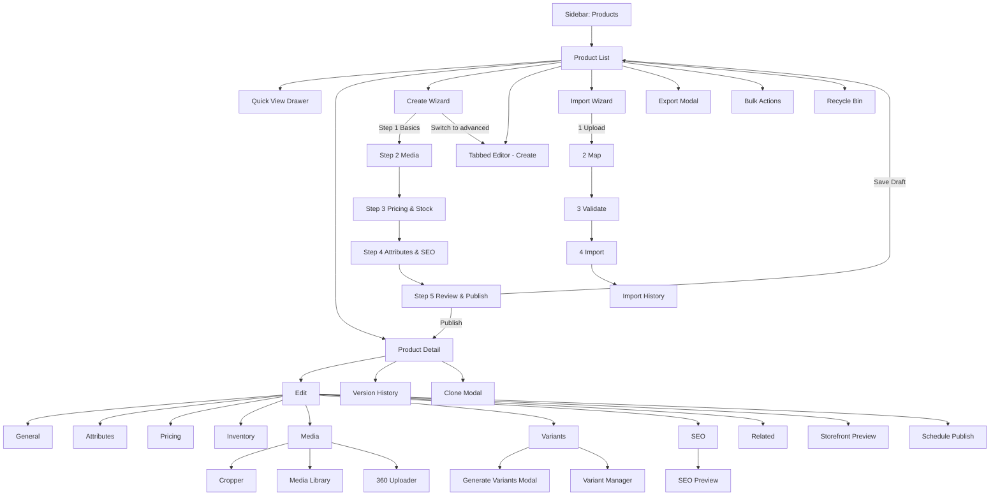
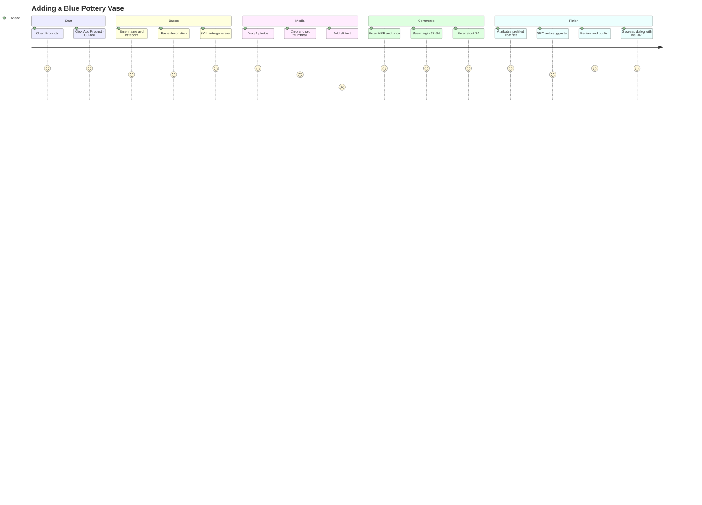

# Module 03 · Product Management

Enterprise Handicraft E-Commerce Platform · UI/UX Design Specification

---

## 3.1 Business Goal

The catalog is the storefront. This module must let a small catalog team publish craft products at speed while capturing the attributes that make handicraft sell — artisan, technique, material, origin, and honest variation disclosure — without turning data entry into a chore. Target: a simple product live in under 3 minutes, a 12-variant product in under 12 minutes, with zero products going live missing images, price or SEO.

## 3.2 Purpose

- Create, edit, organise, publish and retire products and their variants
- Manage rich media: images, zoom sets, 360° spins, video
- Control commercial attributes: price, discount, cost, tax class, stock linkage
- Control merchandising flags: featured, new arrival, bestseller, trending
- Control discoverability: category, tags, SEO metadata, URL
- Support bulk operations at scale: import, export, bulk edit, clone

## 3.3 Features

| # | Feature |
|---|---------|
| P-01 | Product CRUD with tabbed editor and guided wizard modes |
| P-02 | Simple, Variable, Bundle/Combo, Made-to-Order and Digital product types |
| P-03 | Variant matrix generator (Size × Colour × Material × Finish) |
| P-04 | Per-variant SKU, barcode, price difference, stock, image, weight |
| P-05 | Auto SKU/product-code generation with configurable patterns |
| P-06 | Barcode generation (EAN-13 / Code128) and label printing |
| P-07 | Multi-image upload with cropper, reorder, alt text, thumbnail selection |
| P-08 | Zoom image set, 360° spin set (24/36 frames), product video |
| P-09 | Artisan attribution and craft cluster linkage |
| P-10 | Handicraft attributes: material, technique, weight, dimensions, colour, style, origin, care instructions, variation disclaimer |
| P-11 | Pricing: MRP, selling price, cost price, discount (flat/%), tax class, margin display |
| P-12 | Scheduled price changes and scheduled publishing |
| P-13 | SEO tab: meta title/description, slug, canonical, OG image, schema preview, SERP preview |
| P-14 | Merchandising flags with scheduling |
| P-15 | Related products, cross-sell, up-sell, "complete the look" |
| P-16 | Bulk import/export with dry-run validation and rollback |
| P-17 | Bulk edit: price, category, tags, flags, status, brand, artisan |
| P-18 | Clone product (with/without media, with/without variants) |
| P-19 | Product completeness score with a fix-it checklist |
| P-20 | Version history and restore |
| P-21 | Storefront preview (desktop/mobile) before publishing |
| P-22 | Archive / restore / permanent delete with Recycle Bin |

## 3.4 Complete Screen List

| ID | Screen | Route | Type |
|----|--------|-------|------|
| SCR-03-01 | Product List | `/admin/products` | Page |
| SCR-03-02 | Product Create — Wizard | `/admin/products/create?mode=guided` | Page (5 steps) |
| SCR-03-03 | Product Create/Edit — Tabbed Editor | `/admin/products/create` · `/{id}/edit` | Page (8 tabs) |
| SCR-03-04 | Product Detail (read-only view) | `/admin/products/{id}` | Page |
| SCR-03-05 | Variant Manager | `/admin/products/{id}/variants` | Page |
| SCR-03-06 | Media Manager (product) | `/admin/products/{id}/media` | Page |
| SCR-03-07 | Bulk Import Wizard | `/admin/products/import` | Page (4 steps) |
| SCR-03-08 | Import History | `/admin/products/import/history` | Page |
| SCR-03-09 | Brands List | `/admin/brands` | Page |
| SCR-03-10 | Brand Create/Edit | `/admin/brands/create` · `/{id}/edit` | Page |
| SCR-03-11 | Artisans List | `/admin/artisans` | Page |
| SCR-03-12 | Artisan Create/Edit + Profile | `/admin/artisans/{id}` | Page |
| SCR-03-13 | Attributes & Attribute Sets | `/admin/attributes` | Page |
| SCR-03-14 | Recycle Bin (Products) | `/admin/products/recycle-bin` | Page |
| TAB-03-01 | Editor · General | — | Tab |
| TAB-03-02 | Editor · Attributes & Craft | — | Tab |
| TAB-03-03 | Editor · Pricing | — | Tab |
| TAB-03-04 | Editor · Inventory | — | Tab |
| TAB-03-05 | Editor · Media & Gallery | — | Tab |
| TAB-03-06 | Editor · Variants | — | Tab |
| TAB-03-07 | Editor · SEO | — | Tab |
| TAB-03-08 | Editor · Related & Merchandising | — | Tab |
| TAB-03-09 | Detail · Activity / History | — | Tab |
| MOD-03-01 | Quick Add Product | — | Modal MD |
| MOD-03-02 | Clone Product | — | Modal SM |
| MOD-03-03 | Bulk Edit — Choose Fields | — | Modal MD |
| MOD-03-04 | Bulk Edit — Apply Values | — | Modal LG |
| MOD-03-05 | Bulk Price Update | — | Modal MD |
| MOD-03-06 | Bulk Category Change | — | Modal SM |
| MOD-03-07 | Bulk Tag Add/Remove | — | Modal SM |
| MOD-03-08 | Bulk Status Change | — | Modal SM |
| MOD-03-09 | Bulk Delete/Archive | — | Modal SM (guarded) |
| MOD-03-10 | Generate Variants | — | Modal LG |
| MOD-03-11 | Edit Single Variant | — | Modal MD |
| MOD-03-12 | Delete Variant | — | Modal XS |
| MOD-03-13 | Image Cropper | — | Modal LG |
| MOD-03-14 | Alt Text Editor (bulk) | — | Modal MD |
| MOD-03-15 | 360° Spin Uploader | — | Modal LG |
| MOD-03-16 | Video Upload / Embed | — | Modal MD |
| MOD-03-17 | Select from Media Library | — | Modal XL |
| MOD-03-18 | Product Preview (storefront) | — | Modal Full |
| MOD-03-19 | SEO Preview (SERP + Social) | — | Modal MD |
| MOD-03-20 | Schedule Publish | — | Modal SM |
| MOD-03-21 | Schedule Price Change | — | Modal MD |
| MOD-03-22 | Related Products Picker | — | Modal LG |
| MOD-03-23 | Export Products | — | Modal MD |
| MOD-03-24 | Print Barcodes | — | Modal MD |
| MOD-03-25 | Version History / Restore | — | Modal LG |
| MOD-03-26 | Unpublish Warning | — | Modal SM |
| DRW-03-01 | Product Quick View | — | Drawer 560 |
| DRW-03-02 | Advanced Filters | — | Drawer 400 |
| DRW-03-03 | Completeness Checklist | — | Drawer 400 |
| DRW-03-04 | Media Detail | — | Drawer 480 |

## 3.5 Navigation Flow



## 3.6 Screen Hierarchy

```
Product Management
├── Product List (SCR-03-01)
│   ├── Filters drawer · Quick view drawer · Export · Print barcodes
│   ├── Bulk: Edit, Price, Category, Tags, Status, Delete
│   └── Recycle Bin (SCR-03-14)
├── Create
│   ├── Guided Wizard (SCR-03-02) — 5 steps
│   └── Tabbed Editor (SCR-03-03) — 8 tabs
├── Product Detail (SCR-03-04)
│   ├── Overview / Variants / Media / Inventory / Pricing / SEO / Related / Activity
│   └── Actions: Edit, Clone, Preview, Schedule, Archive, Delete, History
├── Variant Manager (SCR-03-05)
├── Media Manager (SCR-03-06)
├── Import (SCR-03-07) → Import History (SCR-03-08)
├── Brands (SCR-03-09, SCR-03-10)
├── Artisans (SCR-03-11, SCR-03-12)
└── Attributes & Sets (SCR-03-13)
```

## 3.7 Desktop Layout (≥1280)

| Screen | Template | Composition |
|--------|----------|-------------|
| Product List | L-01 | Status tabs → toolbar → bulk bar → table → pagination. Optional grid view (L-01 with 5-col card grid) |
| Tabbed Editor | L-02 (8/4) | Left: tab panels in cards. Right rail: Status, Organisation, Completeness, Preview thumb, Quick stats. Sticky bottom action bar |
| Create Wizard | L-06 | Centred max 1120, horizontal stepper, step content, footer nav |
| Product Detail | L-02 (8/4) | Left: gallery + details + variants table. Right: status, stock, pricing summary, artisan card, activity |
| Variant Manager | L-01 | Full-width editable matrix table with sticky first column and totals row |
| Media Manager | L-04 (5/7) | Left: folder tree + filters. Right: media grid + detail drawer |
| Import Wizard | L-06 | Centred, 4 steps |
| Brands / Artisans | L-01 | Card grid (brands) / table (artisans) |
| Attributes | L-09 (3/4/5) | Attribute set list → attribute list → attribute editor |

## 3.8 Tablet Layout (768–1279)

- Product List: priority columns (image, name+SKU, price, stock, status, actions); filters collapse to a "Filters (n)" drawer; grid view switches to 3 columns.
- Tabbed Editor: right rail moves below the tab content; the Status card is pinned to the top of the content area instead. Tabs scroll horizontally.
- Variant Manager: horizontal scroll with sticky variant-name column; inline editing retained.
- Media Manager: folder tree becomes a select; grid at 4 columns.
- Wizard: stepper compacts to icons + current label.

## 3.9 Mobile Layout (<768)

- Product List: card list (thumbnail 72, name, SKU, price, stock chip, status chip, `⋮`); FAB for Add Product; filters in a full-screen sheet; sort in a bottom sheet.
- Editor: tabs become a horizontally scrolling strip; one field per row; sticky bottom bar with `Save` primary and `⋮` for other actions; the completeness checklist opens as a bottom sheet.
- Variants: card per variant, not a matrix; "Edit variant" opens a full-screen sheet.
- Media: 2-column grid; long-press to reorder; cropper is full screen.
- Wizard: "Step 2 of 5 — Media" + progress bar; Back/Next docked at the bottom.
- Import is blocked on mobile with a message: "Product import needs a larger screen. Open this on a desktop."

## 3.10 Wireframe Description

### SCR-03-01 · Product List (Desktop)

```
┌─────────────────────────────────────────────────────────────────────────────────────┐
│ Dashboard / Catalog / Products                                                       │
├─────────────────────────────────────────────────────────────────────────────────────┤
│ Products                        [Import] [Export] [Print Barcodes] [+ Add Product ▾]│
│ 1,482 products · 1,401 published · 6 drafts · 24 low stock · 3 out of stock          │
├─────────────────────────────────────────────────────────────────────────────────────┤
│ All (1482) │ Published (1401) │ Draft (6) │ Scheduled (2) │ Low Stock (24) │ Out (3) │
├─────────────────────────────────────────────────────────────────────────────────────┤
│ [⌕ Search name, SKU, barcode, code]  [Category ▾][Brand ▾][Status ▾][Stock ▾]        │
│ [+ More Filters (2)]         [My Products ▾] [⊞|☰] [⚙ Columns] [▤] [↻]              │
│ Active: (Category: Home Décor ×) (Stock: Low ×)                        Clear all     │
├─────────────────────────────────────────────────────────────────────────────────────┤
│ ✓ 12 selected · Select all 1,482    [Edit][Price][Publish][Export][⋮]        [×]     │
├─────────────────────────────────────────────────────────────────────────────────────┤
│[☐]│IMG│ Product ⇅              │ SKU ⇅      │Category  │ Price ⇅ │Stock⇅│ ● │ ⋮ │
│───┼───┼───────────────────────┼────────────┼──────────┼─────────┼──────┼───┼───│
│[☐]│▣ │ Blue Pottery Vase      │HC-POT-10241│Home Décor│ ₹1,250  │  24  │ ● │ ⋮ │
│   │   │ Jaipur Blue Pottery ·  │            │> Vases   │ MRP 1,600│ Low │Pub│   │
│   │   │ 3 variants · ⚠ No SEO  │            │          │ −22%    │      │   │   │
│[☐]│▣ │ Brass Diya Set of 5    │HC-MET-10088│Festive   │ ₹450    │   3  │ ● │ ⋮ │
│[☐]│▣ │ Kantha Cushion Cover   │HC-TEX-20117│Home Décor│ ₹890    │ 142  │ ● │ ⋮ │
│[☐]│▢ │ Terracotta Planter     │HC-POT-10310│Garden    │ ₹680    │   0  │ ○ │ ⋮ │
│   │   │ ⚠ No images            │            │          │         │ Out  │Drf│   │
├─────────────────────────────────────────────────────────────────────────────────────┤
│ Showing 1–25 of 1,482        [25 ▾]           ‹‹ ‹ 1 2 3 … 60 › ››   Go to [   ]    │
└─────────────────────────────────────────────────────────────────────────────────────┘
```

### SCR-03-03 · Tabbed Editor — General Tab

```
┌─────────────────────────────────────────────────────────────────────────────────────┐
│ ◀ Blue Pottery Vase  [● Published]   [Preview] [Clone] [⋮]  [Save] [Save & Close ▾] │
│   HC-POT-10241 · Updated 2 hours ago by Anand · Saved 12:04 PM ✓                     │
├─────────────────────────────────────────────────────────────────────────────────────┤
│ General │ Attributes │ Pricing │ Inventory │ Media (6) │ Variants (3) │ SEO ⚠ │ Related│
├───────────────────────────────────────────────────┬─────────────────────────────────┤
│ ┌─ Basic Information ───────────────────────────┐ │ ┌─ Status ─────────────────────┐│
│ │ Product Name *                                │ │ │ ⦿ Published  ○ Draft         ││
│ │ [Blue Pottery Vase — Jaipur                 ] │ │ │ ○ Scheduled  [date] [time]   ││
│ │ 28 / 150                                      │ │ │ Visible on storefront ●      ││
│ │                                               │ │ │ [Preview on Storefront →]    ││
│ │ Product Type *                                │ │ └──────────────────────────────┘│
│ │ [⦿ Simple] [○ Variable] [○ Bundle] [○ MTO]    │ │ ┌─ Organisation ───────────────┐│
│ │                                               │ │ │ Category *                   ││
│ │ Short Description                             │ │ │ [Home Décor > Vases       ▾] ││
│ │ [Hand-painted Jaipur blue pottery vase…     ] │ │ │ Additional categories        ││
│ │ 96 / 300                                      │ │ │ [Gifting ×] [+ Add]          ││
│ │                                               │ │ │ Brand                        ││
│ │ Full Description *                            │ │ │ [Jaipur Blue Pottery      ▾] ││
│ │ ┌───────────────────────────────────────────┐ │ │ │ Artisan / Handmade By        ││
│ │ │ B I U │ H2 H3 │ • ≡ │ 🔗 🖼 │ ⋯          │ │ │ │ [Ram Prasad Sharma       ▾]  ││
│ │ ├───────────────────────────────────────────┤ │ │ │ Craft Cluster: Jaipur, RJ    ││
│ │ │ Each vase is hand-thrown and painted…     │ │ │ │ Tags                         ││
│ │ │                                           │ │ │ │ [pottery ×][blue ×][+ Add]   ││
│ │ └───────────────────────────────────────────┘ │ │ └──────────────────────────────┘│
│ │ 842 words · ~4 min read                       │ │ ┌─ Completeness ───────────────┐│
│ │                                               │ │ │ ████████░░  82%              ││
│ │ Care Instructions                             │ │ │ ✓ Basics  ✓ Media  ✓ Price   ││
│ │ [Wipe with a dry cloth. Avoid direct sun.   ] │ │ │ ⚠ SEO description missing    ││
│ │                                               │ │ │ ⚠ Alt text on 2 images       ││
│ │ ☑ Show handmade variation disclaimer          │ │ │           [Fix Issues →]     ││
│ └───────────────────────────────────────────────┘ │ └──────────────────────────────┘│
│ ┌─ Identifiers ─────────────────────────────────┐ │ ┌─ Quick Stats ────────────────┐│
│ │ SKU *            Product Code    Barcode      │ │ │ Views (30d)      1,204       ││
│ │ [HC-POT-10241 ]  [PRD-0241   ]  [8901234…  ] │ │ │ Units sold (30d)    48       ││
│ │ ✓ Available      Auto ⓘ         [Generate]   │ │ │ Revenue (30d)  ₹60,000       ││
│ │ HSN Code                                      │ │ │ Conversion        3.9%       ││
│ │ [6913 ▾] Ceramic ornamental articles          │ │ │ Avg rating    ★4.6 (24)      ││
│ └───────────────────────────────────────────────┘ │ └──────────────────────────────┘│
├───────────────────────────────────────────────────┴─────────────────────────────────┤
│ Saved 12:04 PM ✓          [Cancel]  [Save as Draft]  [Save]  [Save & Publish ▾]     │
└─────────────────────────────────────────────────────────────────────────────────────┘
```

### TAB-03-06 · Variants Tab / SCR-03-05 · Variant Manager

```
┌─────────────────────────────────────────────────────────────────────────────────────┐
│ Variants (12)                     [Generate Variants] [Bulk Edit] [+ Add Variant]    │
│ Options: Size (3) · Colour (2) · Finish (2)                       [Manage Options]   │
├─────────────────────────────────────────────────────────────────────────────────────┤
│ [☐]│Img│ Variant ⇅            │ SKU          │ Price   │ +/−    │Stock│Weight│ ● │⋮ │
│────┼───┼─────────────────────┼──────────────┼─────────┼────────┼─────┼──────┼───┼──│
│ [☐]│▣ │ Small / Blue / Matte│HC-POT-10241-A│ ₹1,050  │ −₹200  │  12 │0.60kg│ ● │⋮ │
│ [☐]│▣ │ Small / Blue / Gloss│HC-POT-10241-B│ ₹1,150  │ −₹100  │   8 │0.60kg│ ● │⋮ │
│ [☐]│▣ │ Medium/ Blue / Matte│HC-POT-10241-C│ ₹1,250  │  Base  │  24 │0.85kg│ ● │⋮ │
│ [☐]│▢ │ Large / White/ Matte│HC-POT-10241-K│ ₹1,650  │ +₹400  │   0 │1.20kg│ ○ │⋮ │
│    │   │                     │              │         │        │ Out │      │   │  │
├─────────────────────────────────────────────────────────────────────────────────────┤
│ TOTAL                                                    Stock 148 · Value ₹1,84,200 │
└─────────────────────────────────────────────────────────────────────────────────────┘
```
Cells for Price, +/−, Stock and Weight are inline-editable (double-click or `Enter`), with `Tab` committing and moving right.

### TAB-03-05 · Media Tab

```
┌─────────────────────────────────────────────────────────────────────────────────────┐
│ Media & Gallery                    [From Library] [+ Upload Images] [⋮]              │
│ 6 images · 1 video · 360° set (24 frames) · Recommended: 6+ images, 1000×1000 min    │
├─────────────────────────────────────────────────────────────────────────────────────┤
│ ┌──────────┐ ┌──────────┐ ┌──────────┐ ┌──────────┐ ┌──────────┐ ┌──────────┐       │
│ │ ★ THUMB  │ │          │ │          │ │ ⚠ ALT    │ │ ⚠ ALT    │ │    +     │       │
│ │  [img]   │ │  [img]   │ │  [img]   │ │  [img]   │ │  [img]   │ │  Add     │       │
│ │ ⠿ 👁✎🗑  │ │ ⠿ 👁✎🗑  │ │          │ │          │ │          │ │          │       │
│ │ 1200×1200│ │ 1200×1200│ │ 1200×1200│ │  800×800 │ │ 1200×1200│ │          │       │
│ └──────────┘ └──────────┘ └──────────┘ └──────────┘ └──────────┘ └──────────┘       │
├─────────────────────────────────────────────────────────────────────────────────────┤
│ 360° Spin                                                       [Upload Spin Set]    │
│ ┌────────────────────────────────────────────────────────────────┐                  │
│ │ [◀] frame 12 of 24  ▮▮▮▮▮▮▮▮▮▮▮▯▯▯▯▯▯▯▯▯▯▯▯▯  [▶]  [Preview]  │                  │
│ └────────────────────────────────────────────────────────────────┘                  │
├─────────────────────────────────────────────────────────────────────────────────────┤
│ Video                                                     [Upload] [Embed URL]       │
│ ┌──────────┐  making-of-blue-pottery.mp4 · 0:48 · 12.4 MB                            │
│ │ ▶ poster │  Poster frame: 00:04  [Change]                    [Replace] [Remove]    │
│ └──────────┘                                                                         │
└─────────────────────────────────────────────────────────────────────────────────────┘
```

### TAB-03-07 · SEO Tab

```
┌───────────────────────────────────────────────┬─────────────────────────────────────┐
│ ┌─ Search Engine Listing ────────────────────┐│ ┌─ SERP Preview ───────────────────┐│
│ │ Meta Title *                               ││ │ 🔍 Google                        ││
│ │ [Blue Pottery Vase — Handmade Jaipur…    ] ││ │ example.com › products › blue-…  ││
│ │ 54 / 60  ████████████░░ Good               ││ │ Blue Pottery Vase — Handmade …   ││
│ │                                            ││ │ Hand-painted Jaipur blue pottery ││
│ │ Meta Description *                         ││ │ vase. Each piece unique. Free…   ││
│ │ [Hand-painted Jaipur blue pottery vase…  ] ││ └──────────────────────────────────┘│
│ │ 142 / 160 ███████████░░ Good               ││ ┌─ Social Preview ─────────────────┐│
│ │                                            ││ │ [OG image 1200×630]              ││
│ │ URL Slug *                                 ││ │ Blue Pottery Vase — Jaipur       ││
│ │ example.com/products/[blue-pottery-vase  ] ││ │ example.com                      ││
│ │ ✓ Available                                ││ └──────────────────────────────────┘│
│ │ ⚠ Changing this breaks existing links.     ││ ┌─ SEO Score ──────────────────────┐│
│ │   ☑ Create 301 redirect from the old URL   ││ │ 82 / 100  ● Good                 ││
│ │                                            ││ │ ✓ Title length                   ││
│ │ Focus Keyword                              ││ │ ✓ Description length             ││
│ │ [blue pottery vase                       ] ││ │ ✓ Keyword in title               ││
│ │ Appears in: title ✓ description ✓ slug ✓   ││ │ ✓ Keyword in first paragraph     ││
│ │            H2 ✗ image alt ✓                ││ │ ✗ Keyword in an H2 heading       ││
│ │                                            ││ │ ⚠ 2 images missing alt text      ││
│ │ Canonical URL     [                      ] ││ │ ✓ Internal links (3)             ││
│ │ Robots  ☑ Index  ☑ Follow                  ││ │           [How to improve →]     ││
│ └────────────────────────────────────────────┘│ └──────────────────────────────────┘│
└───────────────────────────────────────────────┴─────────────────────────────────────┘
```

### SCR-03-02 · Create Wizard (Guided)

```
┌─────────────────────────────────────────────────────────────────────────────────────┐
│ Add Product                                                    [Switch to Advanced] │
├─────────────────────────────────────────────────────────────────────────────────────┤
│  ①────────②────────③────────④────────⑤                                              │
│ Basics   Media   Pricing  Details  Review                                            │
│  ✓        ✓        ●        ○        ○                                               │
├─────────────────────────────────────────────────────────────────────────────────────┤
│                        Pricing & Stock                                               │
│         Set what customers pay and how much you have.                                │
│                                                                                      │
│         MRP (₹) *                    Selling Price (₹) *                              │
│         [ 1,600.00        ]          [ 1,250.00        ]                              │
│                                       Discount: 21.9% off                             │
│                                                                                      │
│         Cost Price (₹)               Tax Class *                                      │
│         [   780.00        ]          [ GST 12% — Handicraft ▾]                       │
│         Margin: ₹470 (37.6%) ●       HSN 6913                                        │
│                                                                                      │
│         Opening Stock *              Low Stock Alert At                               │
│         [ 24             ]           [ 5              ]                               │
│                                                                                      │
│         ☑ Track inventory   ☐ Allow backorders   ☐ Made to order (lead time)          │
├─────────────────────────────────────────────────────────────────────────────────────┤
│ [Back]                          Step 3 of 5           [Save & Exit]  [Next: Details] │
└─────────────────────────────────────────────────────────────────────────────────────┘
```

### Mobile — Product List

```
┌──────────────────────────────┐
│ ☰   Products      ⌕   ⋮      │
├──────────────────────────────┤
│ [All ▾] [Filters 2] [Sort ▾] │
│ (Home Décor ×) (Low ×)       │
├──────────────────────────────┤
│ ┌──────────────────────────┐ │
│ │ ┌────┐ Blue Pottery Vase │ │
│ │ │IMG │ HC-POT-10241    ⋮ │ │
│ │ │ 72 │ ₹1,250  MRP1,600  │ │
│ │ └────┘ ● Published       │ │
│ │        Stock 24 · Low ⚠  │ │
│ └──────────────────────────┘ │
│ ┌──────────────────────────┐ │
│ │ ┌────┐ Brass Diya Set    │ │
│ │ …                        │ │
│ └──────────────────────────┘ │
│        [ Load More ]         │
│                       ( + )  │
├──────────────────────────────┤
│ 🏠  🛒  📦  🏭  ⋯           │
└──────────────────────────────┘
```

## 3.11 Header

| Screen | Title | Subtitle / Meta | Actions |
|--------|-------|-----------------|---------|
| Product List | "Products" | "{n} products · {n} published · {n} drafts · {n} low stock · {n} out of stock" (each count is a filter link) | Import · Export · Print Barcodes · **+ Add Product** (split: Guided / Advanced / Quick Add) |
| Editor (create) | "Add Product" | "Fields marked * are required" | Cancel · Save as Draft · **Save & Publish** (split: Save & Add Another / Save & Close) |
| Editor (edit) | "{Product Name}" + status chip | "{SKU} · Updated {relative} by {user} · Autosave status" + record nav `‹ 3 of 42 ›` | Preview · Clone · `⋮` · Save · **Save & Close** |
| Product Detail | "{Product Name}" + status + flags chips | "{SKU} · {Category} · ★{rating} ({n})" | Preview · Clone · `⋮` · **Edit Product** |
| Variant Manager | "Variants — {Product Name}" | "{n} variants · Total stock {n} · Stock value ₹{n}" | Generate Variants · Bulk Edit · **+ Add Variant** |
| Import | "Import Products" | "Step {n} of 4" | Cancel · Download Template |
| Brands | "Brands" | "{n} brands · {n} active" | **+ Add Brand** |
| Artisans | "Artisans" | "{n} artisans across {n} craft clusters" | **+ Add Artisan** |
| Recycle Bin | "Recycle Bin" | "{n} items · deleted items are removed permanently after 30 days" | Empty Recycle Bin (danger) |

`⋮` menu on the editor: Preview on Storefront · Duplicate · Schedule Publish · Schedule Price Change · Print Barcode · View on Storefront · Version History · Export This Product · Archive · Delete.

## 3.12 Sidebar

`CATALOG` group: **Products** (active), Categories, Brands, Artisans, Attributes, Inventory, Reviews. Products shows a badge with the count of drafts older than 14 days when >0 (Product Manager and Admin only).

## 3.13 Breadcrumb

```
Dashboard / Catalog / Products
Dashboard / Catalog / Products / Add Product
Dashboard / Catalog / Products / Blue Pottery Vase
Dashboard / Catalog / Products / Blue Pottery Vase / Edit
Dashboard / Catalog / Products / Blue Pottery Vase / Variants
Dashboard / Catalog / Products / Import
Dashboard / Catalog / Brands / Jaipur Blue Pottery
Dashboard / Catalog / Artisans / Ram Prasad Sharma
```
The back chevron on the editor returns to the list with filters, sort, page and scroll position preserved.

## 3.14 Toolbar

| Slot | Control | Detail |
|------|---------|--------|
| Search | Text field with scope select | Scopes: All fields / Name / SKU / Barcode / Product code / Description |
| Filter 1 | Category | Hierarchical tree multi-select + "Include sub-categories" toggle |
| Filter 2 | Brand | Multi-select with search |
| Filter 3 | Status | Multi-select: Published, Draft, Scheduled, Archived |
| Filter 4 | Stock | Segmented: Any / In stock / Low / Out / Backorder |
| More Filters | Drawer | See §3.17 |
| Saved views | Menu | System views: All, My Drafts, Low Stock, Missing Images, Missing SEO, New Arrivals, Bestsellers, Unpublished > 14 days |
| View toggle | Segmented | Table / Grid |
| Columns | Popover | Column manager |
| Density | Segmented | Comfortable / Standard / Compact |
| Refresh | Icon | — |

## 3.15 Action Buttons

| Action | Type | Location | Permission | Confirmation |
|--------|------|----------|------------|--------------|
| Add Product (split) | Primary | List header | create | — |
| ↳ Guided | Menu item | | | — |
| ↳ Advanced editor | Menu item | | | — |
| ↳ Quick add | Menu item | | | Modal |
| Import | Secondary | List header | import | Wizard |
| Export | Outline | List header | export | Modal |
| Print Barcodes | Outline / bulk | List header, bulk bar | view | Modal |
| Edit | Row action + detail | edit | — |
| Quick view | Row action | view | Drawer |
| Duplicate | Row `⋮` | create | Modal |
| Publish / Unpublish | Row `⋮`, toggle | publish | Unpublish warning if it has open orders |
| Feature toggle | Row `⋮`, detail rail | edit | Toast + undo |
| Archive | Row `⋮` (danger) | delete | Destructive confirm |
| Delete | Row `⋮` (danger) | delete | Guarded destructive |
| Restore | Recycle Bin row | delete | Confirm |
| Delete permanently | Recycle Bin row (danger) | Super Admin/Admin | Guarded + typed name |
| Save | Primary | Editor sticky bar | create/edit | — |
| Save & Publish (split) | Primary | Editor sticky bar | publish | Blocked with a checklist if incomplete |
| Save as Draft | Secondary | Editor | create/edit | — |
| Save & Add Another | Menu | Editor | create | — |
| Preview on Storefront | Secondary | Editor/Detail | view | Opens full-screen preview modal |
| Schedule Publish | `⋮` | publish | Modal |
| Schedule Price Change | `⋮` | edit price | Modal |
| Version History | `⋮` | view | Modal |
| Generate Variants | Primary | Variants tab | edit | Modal |
| Add Variant | Secondary | Variants tab | edit | Modal |
| Upload Images | Primary | Media tab | edit | — |
| From Library | Secondary | Media tab | edit | Modal |
| Upload Spin Set | Secondary | Media tab | edit | Modal |
| Set as Thumbnail | Tile action | edit | Toast |
| Crop | Tile action | edit | Modal |
| Edit Alt Text | Tile action | edit | Inline/modal |

## 3.16 Search

| Aspect | Spec |
|--------|------|
| Fields | Name, SKU, variant SKU, barcode, product code, short description, tags, brand, artisan |
| Behaviour | 300ms debounce, min 2 chars, server-side |
| Ranking | Exact SKU/barcode → starts-with name → contains name → tag → description |
| Highlighting | Matched substring in `--color-text-brand`, 600 weight |
| Barcode input | If the query is 8–14 digits and matches a barcode exactly, jump straight to that product (with a toast "Opened by barcode match") |
| Scanner | A "scan" icon opens the camera/handheld capture on touch devices |
| Empty | "No products match '{query}'" + "Clear search" + "Search all fields instead" |

## 3.17 Filters

| Filter | Type | Options | Default |
|--------|------|---------|---------|
| Category | Tree multi-select | Full category tree | All |
| Include sub-categories | Toggle | — | On |
| Brand | Multi-select + search | Brand list | All |
| Artisan | Combobox multi | Artisan list | All |
| Craft cluster | Multi-select | Cluster list | All |
| Status | Multi-select | Published, Draft, Scheduled, Archived | All except Archived |
| Stock status | Segmented | Any, In stock, Low, Out, Backorder | Any |
| Stock quantity | Numeric range | — | — |
| Price range | Numeric range (₹) | — | — |
| Discount | Segmented + range | Any / Discounted / Not discounted / >{n}% | Any |
| Product type | Multi-select | Simple, Variable, Bundle, Made-to-order, Digital | All |
| Material | Multi-select | Attribute values | All |
| Colour | Colour swatch multi-select | Attribute values | All |
| Size | Multi-select | Attribute values | All |
| Tags | Tag multi-select | — | All |
| Flags | Checkbox group | Featured, New Arrival, Bestseller, Trending | — |
| Created date | Date range | — | All |
| Updated date | Date range | — | All |
| Created by | Select | Admin users | All |
| Has images | Segmented | Any / Yes / No | Any |
| Has SEO | Segmented | Any / Complete / Incomplete | Any |
| Has variants | Segmented | Any / Yes / No | Any |
| Completeness | Range slider | 0–100% | All |
| Rating | Star selector | ≥1…≥5 | All |
| Country of origin | Multi-select | — | All |
| Warehouse | Multi-select | Warehouse list | All |

Filter interdependencies: selecting a Category narrows the Material/Colour/Size value lists to those present in that category (counts shown per option); selecting Product type = Simple hides variant-specific filters.

## 3.18 Sorting

| Column | Directions | Notes |
|--------|-----------|-------|
| Product name | A→Z, Z→A | Locale-aware |
| SKU | A→Z, Z→A | — |
| Price | Low→High, High→Low | Uses selling price; variable products use the minimum variant price |
| Stock | Low→High, High→Low | Sum across variants |
| Created | Newest, Oldest | — |
| Updated | Newest, Oldest | **Default: Newest** |
| Units sold (30d) | High→Low | — |
| Revenue (30d) | High→Low | — |
| Rating | High→Low | Products with <3 ratings sort last |
| Completeness | Low→High | Useful for catalog clean-up |
| Category | A→Z | Sorts by full path |

Secondary sort is always `Updated desc` to keep ordering stable.

## 3.19 Bulk Actions

| Action | Modal | Details |
|--------|-------|---------|
| Bulk Edit (fields) | MOD-03-03 → MOD-03-04 | Step 1: choose fields to change (checkbox list). Step 2: set values, each with a mode (Set / Clear / Append for lists). Preview table of first 5 affected rows. |
| Bulk Price Update | MOD-03-05 | Mode radio cards: Increase by % · Decrease by % · Increase by ₹ · Decrease by ₹ · Set to ₹ · Set discount %. Apply to: MRP / Selling / Cost / All. Rounding rule select (none, nearest 1, 9, 10, 99). Live preview table showing old → new for 5 samples + count of products whose margin would go negative (blocked with a warning). |
| Bulk Category Change | MOD-03-06 | Replace primary category or add/remove additional categories. |
| Bulk Tag Add/Remove | MOD-03-07 | Tag input with Add/Remove mode. |
| Bulk Status Change | MOD-03-08 | Publish / Unpublish / Draft / Schedule. Publishing validates completeness and lists blockers per product. |
| Bulk Flags | Menu | Set/clear Featured, New Arrival, Bestseller, Trending. |
| Bulk Brand / Artisan | Menu | Reassign. |
| Bulk Stock Update | Menu | Set / Increase / Decrease with a reason (writes inventory transactions). |
| Print Barcodes | MOD-03-24 | Label template, copies per SKU, start position on the sheet. |
| Export selected | MOD-03-23 | — |
| Archive | MOD-03-09 | Destructive, count stated, undo for 8s. |
| Delete | MOD-03-09 | Guarded destructive; blocked for products on open orders with an explanation and a "View affected orders" link. |

Bulk publish rule: products failing validation are skipped, not silently published; the results modal lists each blocked product with its reason and a direct "Fix" link.

## 3.20 Cards / Tables / Widgets

### 3.20.1 Product List — Column Definitions

| Key | Label | Width | Align | Sortable | Priority | Cell type | Permission |
|-----|-------|-------|-------|----------|----------|-----------|------------|
| select | — | 48 | centre | no | 1 | Checkbox | — |
| image | — | 64 | centre | no | 1 | Thumbnail 48, placeholder if none | — |
| name | Product | flex min 280 | left | yes | 1 | Name (600, truncate 42) + secondary line: brand · variant count · warning chips | — |
| sku | SKU | 150 | left | yes | 1 | Mono, copyable | — |
| barcode | Barcode | 150 | left | no | 4 | Mono | — |
| category | Category | 180 | left | yes | 2 | Path with parent in tertiary | — |
| brand | Brand | 140 | left | yes | 3 | Text | — |
| artisan | Artisan | 160 | left | yes | 3 | Avatar 24 + name | — |
| price | Price | 130 | right | yes | 1 | Selling price (600) + MRP struck + discount % chip | — |
| costPrice | Cost | 110 | right | yes | 4 | Currency | Admin/Finance/Product |
| margin | Margin | 110 | right | yes | 4 | % with tone (danger <10%, warning <20%, success ≥20%) | Admin/Finance |
| stock | Stock | 100 | right | yes | 1 | Quantity + stock chip | — |
| sold30 | Sold (30d) | 100 | right | yes | 3 | Integer | — |
| revenue30 | Revenue (30d) | 130 | right | yes | 4 | Currency | Admin/Finance/Marketing |
| rating | Rating | 110 | left | yes | 3 | Stars + count | — |
| flags | Flags | 120 | centre | no | 3 | Icon chips (featured/new/bestseller/trending) | — |
| completeness | Complete | 110 | left | yes | 4 | Progress bar + % | — |
| updatedAt | Updated | 130 | right | yes | 2 | Relative time + tooltip absolute | — |
| createdAt | Created | 120 | right | yes | 4 | Date | — |
| status | Status | 120 | centre | yes | 1 | Status chip | — |
| actions | — | 96 | right | no | 1 | Edit · View · `⋮` | — |

Row warning chips (in the secondary line): `⚠ No images`, `⚠ No SEO`, `⚠ No price`, `⚠ Out of stock`, `⚠ Draft 21 days`.

### 3.20.2 Product Grid Card (grid view)

280×360 card: square image with hover overlay (Quick view / Edit), status chip top-left, flags top-right, name (2-line clamp), SKU caption, price row (selling + struck MRP + discount chip), stock chip, and a footer row with rating and `⋮`.

### 3.20.3 Variant Matrix Table — Columns

Select · Image (32) · Variant name (option combination) · SKU · Barcode · Price · Price difference vs base · Cost · Stock · Reserved · Available · Weight · Dimensions · Status toggle · Actions. Totals row pinned at the bottom: total stock, total stock value, count of out-of-stock variants.

### 3.20.4 Right-Rail Cards (Editor)

| Card | Contents |
|------|----------|
| Status | Radio: Published / Draft / Scheduled (+ date-time), storefront visibility indicator, preview link |
| Organisation | Primary category, additional categories, brand, artisan (+ craft cluster read-out), tags |
| Completeness | Progress bar, per-section check list, "Fix Issues" opening DRW-03-03 |
| Quick Stats | Views, units sold, revenue, conversion, rating (edit mode only) |
| Publishing checklist | Shown when Save & Publish is blocked |

### 3.20.5 Completeness Score Definition

| Criterion | Weight |
|-----------|--------|
| Name, category, description present | 20 |
| ≥3 images, all with alt text | 20 |
| Thumbnail set | 5 |
| Selling price + tax class | 15 |
| Stock or made-to-order lead time | 10 |
| Meta title + description + slug | 15 |
| ≥3 attributes filled (material, dimensions, weight) | 10 |
| Artisan assigned | 5 |

Score bands: <50 red, 50–79 amber, ≥80 green. Publishing requires ≥ the mandatory subset (name, category, price, ≥1 image, SKU), not a score threshold — the score is guidance, the checklist is enforcement.

## 3.21 Forms & Fields

### 3.21.1 General Tab

| Field | Type | Required | Constraints | Help |
|-------|------|----------|-------------|------|
| Product name | Text | Yes | 3–150 | Shown to customers; include the craft and material |
| Product type | Radio cards | Yes | Simple / Variable / Bundle / Made-to-Order / Digital | Cannot change from Variable to Simple once variants exist |
| Short description | Textarea | No | ≤300, counter | Appears in listings and search results |
| Full description | Rich text | Yes | ≥50 words recommended | Word count + reading time shown |
| Care instructions | Textarea | No | ≤500 | Displayed on the product page |
| Variation disclaimer | Switch + textarea | No | Default on for handmade; default copy provided and editable | "Each piece is handmade and may vary slightly in colour and finish." |
| SKU | Text + auto | Yes | 3–50, `A-Z0-9-_`, unique, uppercase-normalised | Auto-generated from a pattern; editable until first order |
| Product code | Text + auto | No | Unique | Internal reference |
| Barcode | Text + generate | No | EAN-13 (13 digits with check) or Code128 | "Generate" creates the next in sequence |
| HSN code | Combobox | Yes (India) | From HSN master | Drives GST rate suggestion |
| Country of origin | Select | Yes | Default India | Required for compliance |
| Lead time (days) | Number | Conditional (Made-to-Order) | 1–120 | Shown on the product page as dispatch time |

### 3.21.2 Attributes & Craft Tab

| Field | Type | Required | Notes |
|-------|------|----------|-------|
| Attribute set | Select | No | Pre-fills the relevant attribute fields |
| Material | Multi-select + create | Yes | Ceramic, Brass, Terracotta, Cotton, Silk, Jute, Wood, Marble, Silver, Bamboo, Wool… |
| Secondary material | Multi-select | No | — |
| Craft technique | Select + create | No | Blue pottery, Kantha, Dhokra, Block print, Bandhani, Channapatna, Warli, Pattachitra, Kani weave… |
| Colour | Colour multi-select with swatches | Yes | Maps to storefront filters |
| Style | Select | No | Traditional, Contemporary, Fusion, Tribal, Minimalist |
| Finish | Select | No | Matte, Glossy, Antique, Distressed, Polished, Natural |
| Pattern | Select | No | — |
| Weight | Number + unit select | Yes | g / kg; drives shipping cost |
| Dimensions | 3 numbers + unit | Yes | L × W × H, cm/inch; shown as "30 × 20 × 15 cm" |
| Package dimensions | 3 numbers + unit | No | Defaults to product dimensions + padding |
| Capacity / Volume | Number + unit | No | For vessels |
| Set quantity | Number | No | "Set of 5" |
| Assembly required | Switch | No | — |
| Fragile | Switch | No | Adds a packing-note flag on orders |
| Handmade by (Artisan) | Combobox | No | Links to the artisan profile; shows cluster + region |
| Craft cluster | Read-only | — | Derived from the artisan |
| Year of craft origin / GI tag | Text / Select | No | Geographical Indication tag if applicable |
| Custom attributes | Repeatable key/value | No | Up to 20 pairs |

### 3.21.3 Pricing Tab

| Field | Type | Required | Notes |
|-------|------|----------|-------|
| MRP | Currency | Yes | Must be ≥ selling price |
| Selling price | Currency | Yes | The customer-facing price |
| Discount type | Segmented | No | None / Percentage / Flat |
| Discount value | Number | Conditional | Live computes the effective price |
| Effective price | Read-only | — | Large display with "You save ₹{n} ({p}%)" |
| Cost price | Currency | No | Permission-gated; drives margin |
| Margin | Read-only | — | ₹ and % with tone; warns if <10% |
| Tax class | Select | Yes | GST 0/5/12/18/28 with HSN-based suggestion |
| Tax inclusive | Switch | Yes | Store default; overrides per product |
| Price per unit label | Text | No | e.g. "per set of 5" |
| Minimum order quantity | Number | No | Default 1 |
| Maximum order quantity | Number | No | Prevents hoarding on scarce craft items |
| Wholesale price tiers | Repeatable (qty from → price) | No | Reserved for B2B |
| Scheduled price change | Button → modal | No | New price + start date-time + optional end (auto-revert) |

### 3.21.4 Inventory Tab

| Field | Type | Required | Notes |
|-------|------|----------|-------|
| Track inventory | Switch | Yes | Off for made-to-order/digital |
| Stock quantity | Number | Conditional | Editable only on create; afterwards changes go through Inventory adjustments (link provided) |
| Warehouse allocation | Repeatable (warehouse → qty) | Conditional | Multi-warehouse stores |
| Low stock threshold | Number | No | Falls back to the global default |
| Allow backorders | Switch | No | Reveals "Backorder lead time" |
| Out-of-stock behaviour | Radio | Yes | Hide product / Show as out of stock / Allow backorder |
| Reserved stock | Read-only | — | From open orders |
| Available stock | Read-only | — | On hand − reserved |
| Bin / rack location | Text | No | Warehouse picking aid |
| Reorder quantity | Number | No | Suggested purchase quantity |
| Supplier / Artisan lead time | Number | No | Days |

### 3.21.5 Variants Tab / Generate Variants (MOD-03-10)

| Field | Type | Required | Notes |
|-------|------|----------|-------|
| Option 1 name | Select + create | Yes | Size / Colour / Material / Finish / custom |
| Option 1 values | Tag input with suggestions | Yes | Max 30 values |
| Option 2 / 3 | Same | No | Max 3 options total |
| Generation preview | Read-only table | — | "This will create 12 variants" with a warning above 100 |
| Base price behaviour | Radio | Yes | Same as parent / Set per variant / Price difference |
| SKU pattern | Text with tokens | Yes | `{PARENT}-{OPT1}-{OPT2}`, live preview |
| Stock behaviour | Radio | Yes | Zero / Same for all / Set per variant |
| Image per variant | Switch | No | Enables the per-variant image slot |
| Skip existing combinations | Switch | Yes (default on) | Prevents duplicates on re-generation |

Per-variant editable fields: SKU, barcode, price, price difference, cost, stock, weight, dimensions, image, active toggle.

### 3.21.6 Media Tab

| Field | Type | Required | Constraints |
|-------|------|----------|-------------|
| Images | Multi image upload | ≥1 to publish | JPG/PNG/WEBP/AVIF, ≤5 MB each, ≥800×800 (warn), ≤20 images, square recommended |
| Thumbnail | Selection | Yes | Defaults to the first image |
| Alt text per image | Text | Required to publish | ≤125 chars; bulk editor available |
| Caption per image | Text | No | — |
| Image order | Drag | — | Keyboard alternative in the tile menu |
| 360° spin set | Zip or multi-file | No | 24 or 36 frames, consistent dimensions, named sequentially |
| Video | File or embed | No | MP4 ≤100 MB / YouTube / Vimeo URL; poster frame selectable |
| Zoom images | Auto-derived | — | Generated from source ≥2000px; a warning appears if the source is too small |

### 3.21.7 SEO Tab

| Field | Type | Required | Constraints |
|-------|------|----------|-------------|
| Meta title | Text | Yes | 30–60 chars with a quality meter; defaults from the product name |
| Meta description | Textarea | Yes | 120–160 chars with a meter |
| URL slug | Text | Yes | Lowercase, hyphens, unique; change warning + 301 redirect checkbox |
| Focus keyword | Text | No | Drives the SEO analysis checklist |
| Canonical URL | URL | No | Defaults to self |
| Robots — index | Checkbox | No | Default on |
| Robots — follow | Checkbox | No | Default on |
| OG title / description / image | Text / Textarea / Image | No | Fallback to meta + thumbnail |
| Twitter card type | Select | No | Summary large image (default) |
| Structured data | Read-only preview | — | Product schema with price, availability, rating, brand, GTIN |

### 3.21.8 Related & Merchandising Tab

| Field | Type | Notes |
|-------|------|-------|
| Featured | Switch + optional date range | Appears in homepage featured rails |
| New arrival | Switch + auto-expire days | Auto-clears after N days (setting) |
| Bestseller | Switch (auto/manual) | Auto mode derives from 30-day sales rank |
| Trending | Switch | Marketing-controlled |
| Related products | Product picker (max 12) | Manual + "Suggest" button using category/tags |
| Cross-sell | Product picker (max 8) | Shown in cart |
| Up-sell | Product picker (max 4) | Shown on the product page |
| Complete the look | Product picker (max 6) | Craft-specific merchandising |
| Frequently bought together | Read-only auto list | Override allowed |
| Product badges | Multi-select | Handmade, GI Tagged, Limited Edition, Eco-friendly, Gift Ready |
| Display order | Number | Manual ordering within its category |

## 3.22 Validation Rules

| Field | Rule | Message |
|-------|------|---------|
| Product name | Required | "Product name is required." |
| Product name | 3–150 chars | "Product name must be between 3 and 150 characters." |
| Product name | Duplicate warning (non-blocking) | "A product with a similar name already exists. [View]" |
| SKU | Required | "SKU is required." |
| SKU | Pattern `^[A-Z0-9][A-Z0-9-_]{2,49}$` | "SKU can only contain letters, numbers, hyphens and underscores." |
| SKU | Unique across products and variants | "This SKU is already used by {product}. [View]" |
| SKU | Locked after first sale | "SKU can't be changed after a product has been ordered." |
| Barcode | EAN-13 check digit | "This isn't a valid EAN-13 barcode." |
| Barcode | Unique | "This barcode is already assigned to {product}." |
| HSN code | Required for India | "HSN code is required for GST compliance." |
| Category | Required | "Select a category." |
| Category | Must be a leaf or allow-parent setting | "Choose a specific sub-category." |
| Full description | Required to publish | "Add a description before publishing." |
| MRP | Required, > 0 | "MRP is required." / "MRP must be greater than 0." |
| Selling price | Required, > 0 | "Selling price is required." |
| Selling price | ≤ MRP | "Selling price can't be higher than the MRP." |
| Cost price | ≥ 0 | "Cost price can't be negative." |
| Cost price | < selling price (warning) | "Cost price is higher than the selling price — this product would sell at a loss." |
| Margin | <10% warning | "Margin is only 6.2%. Continue?" |
| Discount % | 0–100 | "Discount must be between 0 and 100." |
| Discount flat | < selling price | "Discount can't be more than the selling price." |
| Tax class | Required | "Select a tax class." |
| Stock | ≥ 0, integer | "Stock must be a whole number of 0 or more." |
| Low stock threshold | ≥ 0, < stock (warning) | "Threshold is higher than current stock." |
| Min order qty | ≥ 1, ≤ max | "Minimum quantity must be at least 1." |
| Max order qty | ≥ min | "Maximum quantity must be greater than the minimum." |
| Weight | Required, > 0 | "Weight is required for shipping calculations." |
| Dimensions | Each > 0 when any is entered | "Enter all three dimensions." |
| Images | ≥1 to publish | "Add at least one image before publishing." |
| Image size | ≤5 MB | "Image is too large. Maximum size is 5 MB." |
| Image dimensions | ≥800×800 (warning) | "This image is smaller than 800×800 and may look blurry." |
| Image type | JPG/PNG/WEBP/AVIF | "Unsupported format. Use JPG, PNG, WEBP or AVIF." |
| Alt text | Required to publish | "Add alt text to all images before publishing." |
| Alt text | ≤125 chars | "Alt text must be 125 characters or fewer." |
| 360 set | 24 or 36 frames | "A 360° set needs exactly 24 or 36 images." |
| 360 set | Consistent dimensions | "All 360° frames must have the same dimensions." |
| Video | ≤100 MB, MP4 | "Video must be an MP4 under 100 MB." |
| Video URL | Valid YouTube/Vimeo | "Enter a valid YouTube or Vimeo URL." |
| Meta title | Required to publish, ≤60 | "Meta title is required." / "Meta title should be 60 characters or fewer." |
| Meta description | Required to publish, ≤160 | "Meta description is required." |
| Slug | Required, unique, pattern | "URL slug is required." / "This URL is already in use." / "Use only lowercase letters, numbers and hyphens." |
| Slug change | Warning | "Changing the URL will break existing links unless you create a redirect." |
| Variants | Max 3 options | "You can use up to 3 options per product." |
| Variants | Max 30 values per option | "You can add up to 30 values per option." |
| Variants | Max 200 combinations | "This would create 240 variants. Reduce the options — the limit is 200." |
| Variants | Unique combination | "This combination already exists." |
| Variant price | Required per variant | "Set a price for every variant." |
| Related products | Cannot include self | "A product can't be related to itself." |
| Related products | Max 12 | "You can add up to 12 related products." |
| Schedule publish | Future date-time | "Scheduled time must be in the future." |
| Scheduled price | End after start | "End date must be after the start date." |
| Publish (form-level) | Completeness blockers | "This product can't be published yet: 3 issues need fixing. [Review]" |
| Delete | Has open orders | "This product is on 4 open orders and can't be deleted. Archive it instead." |
| Type change | Variable → Simple with variants | "Delete all variants before changing the product type." |

## 3.23 Dropdowns & Data Sources

| Dropdown | Source | Dependency |
|----------|--------|-----------|
| Category | `GET /api/categories/tree?activeOnly=true` | — |
| Additional categories | Same | Excludes the primary |
| Brand | `GET /api/brands?active=true` + inline create | — |
| Artisan | `GET /api/artisans?search=` (combobox) + inline create | — |
| Craft cluster | Derived from the selected artisan | Artisan |
| Attribute set | `GET /api/attribute-sets` | — |
| Material / Technique / Style / Finish / Pattern | `GET /api/attributes/{code}/values` + inline create | Attribute set |
| Colour | `GET /api/attributes/colour/values` (with hex) | — |
| Tax class | `GET /api/tax-classes` | HSN suggests a default |
| HSN code | `GET /api/hsn?search=` | — |
| Country of origin | Static ISO list | — |
| Warehouse | `GET /api/warehouses?active=true` | Multi-warehouse only |
| Tags | `GET /api/tags?type=product` + create | — |
| Related/cross-sell/up-sell | `GET /api/products?search=` (picker modal) | Excludes self |
| Badges | Static enum | — |
| Product type | Static enum | — |
| Unit (weight/dimension) | Static | Store default from Settings |
| Import mapping targets | `GET /api/products/import/fields` | — |
| Barcode label template | `GET /api/settings/label-templates` | — |

## 3.24 Icons

| Element | Icon |
|---------|------|
| Products nav | `package` |
| Add product | `plus` |
| Variants | `git-branch` |
| Media | `images` |
| Pricing | `indian-rupee` |
| Inventory | `warehouse` |
| SEO | `search-check` |
| Related | `link-2` |
| Attributes | `list-checks` |
| Artisan | `hand-heart` |
| Brand | `tag` |
| Barcode | `scan-barcode` |
| Generate | `wand-sparkles` |
| Clone | `copy` |
| Preview | `eye` |
| Publish | `globe` |
| Unpublish | `globe-lock` |
| Schedule | `calendar-clock` |
| Featured | `sparkles` |
| New arrival | `badge-plus` |
| Bestseller | `award` |
| Trending | `flame` |
| Thumbnail set | `star` |
| Crop | `crop` |
| 360 spin | `rotate-3d` |
| Video | `video` |
| Import | `upload` |
| Export | `download` |
| Version history | `history` |
| Completeness | `circle-gauge` |
| Low stock | `package-minus` |
| Out of stock | `package-x` |
| Archive | `archive` |
| Recycle bin | `trash-2` |

## 3.25 Pagination

- Table view: numbered pager, default 25, options 10/25/50/100/200, jump-to-page, "Showing X–Y of Z".
- Grid view: same pager, 24 per page (multiple of 4/6).
- Variant matrix: no pagination up to 200 variants (virtualised); beyond that a warning is shown at creation time.
- Media grid: no pagination (max 20 images).
- Import validation preview: first 50 rows with "Showing first 50 of {n} rows".
- Mobile: infinite scroll with a "Load More" button after each page.
- Selection persists across pages; the bulk bar states the scope explicitly.

## 3.26 Notifications & Toasts

| Trigger | Type | Message | Actions |
|---------|------|---------|---------|
| Product created (draft) | Success | "Product saved as draft" | View · Add Another |
| Product published | Success | "'{name}' is now live" | View on Storefront |
| Product unpublished | Success | "'{name}' removed from the storefront" | Undo |
| Product scheduled | Success | "'{name}' will publish on {date} at {time}" | Change Schedule |
| Changes saved | Success | "Changes saved" | — |
| Autosave | Silent | Sticky bar: "Saved 12:04 PM" | — |
| Autosave failed | Error | "Couldn't autosave. Your changes are kept locally." | Retry |
| Product cloned | Success | "Product duplicated as '{name} (Copy)'" | Edit Copy |
| Variants generated | Success | "12 variants created" | View Variants |
| Variant deleted | Success | "Variant deleted" | Undo |
| Images uploaded | Success | "{n} images uploaded" | — |
| Image upload failed | Error | "{filename} couldn't be uploaded. {reason}" | Retry |
| Image processing | Info | "Generating zoom images…" | — |
| Thumbnail changed | Success | "Thumbnail updated" | — |
| 360 set uploaded | Success | "360° spin set added (24 frames)" | Preview |
| Bulk price updated | Success | "Prices updated for {n} products" | Undo (8s) · View Report |
| Bulk publish partial | Warning | "{n} published · {m} skipped" | View Report |
| Bulk delete | Success | "{n} products moved to the Recycle Bin" | Undo |
| Import started | Info | "Import started. This may take a few minutes." | View Progress |
| Import complete | Success | "{n} products imported · {m} updated · {k} skipped" | Download Report |
| Import failed | Error | "Import failed at row {n}. No changes were made." | Download Errors |
| Export queued | Info | "Preparing your export…" | — |
| Export ready | Success | "Your export is ready" | Download |
| Barcode labels queued | Info | "Generating {n} labels…" | — |
| SKU duplicate (live) | Error inline | "This SKU is already used by {product}." | View |
| Slug taken (live) | Error inline | "This URL is already in use." | — |
| Low margin (live) | Warning inline | "Margin is only 6.2%." | — |
| Price below cost | Error inline | "Selling price is below cost price." | — |
| Concurrent edit | Warning | "{user} is also editing this product." | View Changes |
| Version conflict | Error dialog | "This product was changed while you were editing." | Review · Overwrite |
| Product restored | Success | "'{name}' restored" | View |
| Version restored | Success | "Restored to version from {date}" | Undo |

## 3.27 Dialogs

| Dialog | Type | Title | Content | Buttons |
|--------|------|-------|---------|---------|
| MOD-03-01 Quick Add | Form | "Quick add product" | Name, category, price, stock, SKU (auto), 1 image. Creates a draft. | Cancel · Save Draft · Save & Open Editor |
| MOD-03-02 Clone | Form | "Duplicate '{name}'?" | New name (pre-filled "{name} (Copy)"), new SKU (auto), checkboxes: copy images, copy variants, copy SEO, copy related, copy stock (default off), status (always Draft) | Cancel · Duplicate |
| MOD-03-05 Bulk Price | Form | "Update prices for {n} products" | Mode cards, value, apply-to, rounding, preview table, negative-margin warning count | Cancel · Preview · Update Prices |
| MOD-03-09 Bulk Delete | Guarded destructive | "Delete {n} products?" | Consequences: removed from storefront, kept on past orders, stock released, restorable for 30 days. Blocked list for products on open orders. Type DELETE. | Cancel · Delete {n} Products |
| MOD-03-10 Generate Variants | Form (wide) | "Generate variants" | Options builder, preview count, SKU pattern with live sample, price/stock behaviour, skip-existing toggle | Cancel · Generate {n} Variants |
| MOD-03-12 Delete Variant | Destructive | "Delete this variant?" | "Stock of 12 units will be released. This variant is on 2 open orders." | Cancel · Delete Variant |
| MOD-03-13 Cropper | Form (large) | "Crop image" | Aspect presets (1:1 locked for product), zoom slider, rotate, flip, reset, live previews at 3 sizes | Cancel · Apply Crop |
| MOD-03-18 Preview | Full-screen | "Storefront preview" | Device toggle (Desktop/Tablet/Mobile), theme toggle, live render, "Open in new tab" | Close · Edit · Publish |
| MOD-03-20 Schedule Publish | Form | "Schedule publishing" | Date, time, timezone note, "Also schedule social post" (future), summary line | Cancel · Schedule |
| MOD-03-21 Schedule Price | Form | "Schedule a price change" | New price, start date-time, optional end date-time with auto-revert, affected variants list | Cancel · Schedule Change |
| MOD-03-25 Version History | List + diff | "Version history" | Version list (date, author, change summary), side-by-side diff, restore action | Close · Restore This Version |
| MOD-03-26 Unpublish Warning | Warning | "Unpublish '{name}'?" | "This product is on 4 open orders and in 12 customer wishlists. It will no longer be visible or purchasable." | Cancel · Unpublish |
| Publish blocked | Error dialog | "This product can't be published yet" | Checklist of blockers, each with a "Fix" link that focuses the offending field/tab | Close · Fix First Issue |
| Discard changes | Warning | "Discard unsaved changes?" | "{n} unsaved changes on this page." | Keep Editing · Discard · Save & Leave |
| Conflict | Error | "This product was changed by {user}" | Field-level diff of their changes vs yours | Review Changes · Overwrite · Reload |
| Success — published | Success dialog | "'{name}' is live" | Storefront URL with copy, thumbnail, quick stats placeholder | View on Storefront · Add Another Product · Done |

## 3.28 Permission Matrix (Module 03)

| Action | Super Admin | Admin | Product | Inventory | Order | Marketing | Finance | Support | Content |
|--------|:-----------:|:-----:|:-------:|:---------:|:-----:|:---------:|:-------:|:-------:|:-------:|
| View products | ✔ | ✔ | ✔ | ✔ | ✔ | ✔ | ✖ | ✔ | ✔ |
| Create product | ✔ | ✔ | ✔ | ✖ | ✖ | ✖ | ✖ | ✖ | ✖ |
| Edit product (general) | ✔ | ✔ | ✔ | ✖ | ✖ | ✖ | ✖ | ✖ | ✖ |
| Edit description/content | ✔ | ✔ | ✔ | ✖ | ✖ | ✖ | ✖ | ✖ | ✔ |
| Edit selling price | ✔ | ✔ | ✔ | ✖ | ✖ | ✔ | ✖ | ✖ | ✖ |
| View cost price / margin | ✔ | ✔ | ✔ | ✔ | ✖ | ✖ | ✔ | ✖ | ✖ |
| Edit cost price | ✔ | ✔ | ✖ | ✔ | ✖ | ✖ | ✖ | ✖ | ✖ |
| Edit stock | ✔ | ✔ | ✖ | ✔ | ✖ | ✖ | ✖ | ✖ | ✖ |
| Manage media | ✔ | ✔ | ✔ | ✖ | ✖ | ✔ | ✖ | ✖ | ✔ |
| Manage variants | ✔ | ✔ | ✔ | stock only | ✖ | ✖ | ✖ | ✖ | ✖ |
| Edit SEO | ✔ | ✔ | ✔ | ✖ | ✖ | ✔ | ✖ | ✖ | ✔ |
| Publish / Unpublish | ✔ | ✔ | ✔ | ✖ | ✖ | ✖ | ✖ | ✖ | ✖ |
| Set merchandising flags | ✔ | ✔ | ✔ | ✖ | ✖ | ✔ | ✖ | ✖ | ✖ |
| Bulk edit | ✔ | ✔ | ✔ | stock only | ✖ | price only | ✖ | ✖ | ✖ |
| Import | ✔ | ✔ | ✔ | ✖ | ✖ | ✖ | ✖ | ✖ | ✖ |
| Export | ✔ | ✔ | ✔ | ✔ | ✔ | ✔ | ✖ | ✖ | ✖ |
| Archive | ✔ | ✔ | ✔ | ✖ | ✖ | ✖ | ✖ | ✖ | ✖ |
| Delete | ✔ | ✔ | ✖ | ✖ | ✖ | ✖ | ✖ | ✖ | ✖ |
| Empty Recycle Bin | ✔ | ✔ | ✖ | ✖ | ✖ | ✖ | ✖ | ✖ | ✖ |
| Manage brands/artisans | ✔ | ✔ | ✔ | ✖ | ✖ | ✖ | ✖ | ✖ | ✖ |
| Manage attributes | ✔ | ✔ | ✔ | ✖ | ✖ | ✖ | ✖ | ✖ | ✖ |
| Print barcodes | ✔ | ✔ | ✔ | ✔ | ✖ | ✖ | ✖ | ✖ | ✖ |

## 3.29 User Journey

### Journey A — Anand adds a new product (guided)



### Journey B — Nisha runs a festival price drop

Marketing needs 120 Diwali products at 25% off from 6 PM on 15 Oct.
1. Products list → filter Tags = "diwali" → 120 results.
2. Select all matching → Bulk Price Update.
3. Mode "Decrease by %", value 25, apply to Selling Price, rounding "nearest 9".
4. Preview shows 5 samples old → new plus "0 products would fall below cost".
5. Instead of applying now, she opens Schedule Price Change and sets start 15 Oct 18:00, end 25 Oct 23:59 with auto-revert.
6. Confirmation dialog states exactly what happens and when; a scheduled-change chip appears on each affected product.

### Journey C — Anand fixes an incomplete catalog

Saved view "Missing SEO" → 42 products → selects all → Bulk Edit → chooses Meta Description with an "Append template" mode → previews → applies. Remaining blockers appear in the results modal with direct fix links.

## 3.30 UX Guidelines

| ID | Guideline |
|----|-----------|
| PM-01 | Never block saving as a draft — validation gates publishing, not saving |
| PM-02 | Auto-generate SKU, slug and meta fields from the name; let the user override, never force typing |
| PM-03 | Show the margin the instant cost and price both exist — pricing decisions need immediate feedback |
| PM-04 | The completeness checklist must link directly to the offending field, not just name it |
| PM-05 | Media is the product — put the Media tab second, never last, and make upload possible by drag anywhere on the tab |
| PM-06 | Variant generation must always preview the count and SKUs before creating anything |
| PM-07 | Never allow a price change to silently produce a negative margin — warn with numbers |
| PM-08 | Handicraft attributes (artisan, technique, material, origin) are first-class, not "custom fields" |
| PM-09 | Changing a URL slug must always offer the 301 redirect, checked by default |
| PM-10 | Bulk operations always preview and always report per-record outcomes |
| PM-11 | Keep the editor's right rail stable — status and organisation never move between tabs |
| PM-12 | Support "Save & Add Another" everywhere repeated entry happens |

## 3.31 Accessibility

- The tabbed editor is a proper tablist; tabs with validation errors expose "3 errors" in their accessible name and show a danger dot.
- The variant matrix is a data table with row and column headers; inline-edit cells announce "editable, press Enter to edit".
- Image tiles are a listbox with reorder support: `Space` to lift, arrows to move, `Space` to drop, with position announcements.
- The image cropper offers numeric inputs for crop x/y/width/height as a keyboard alternative to dragging.
- The rich text editor toolbar is a proper toolbar with roving tabindex and documented shortcuts.
- Colour swatch selection includes the colour name as text, never colour alone.
- Completeness progress is announced as "82 percent complete, 2 issues remaining".
- Price/margin warnings are announced politely on change, not on every keystroke (debounced 800ms).
- The SERP preview is marked as a decorative preview and duplicated as plain text for screen readers.
- Drag-to-reorder in related products has a "Move up/Move down" menu equivalent.
- Uploads announce progress at 25% intervals rather than continuously.

## 3.32 Micro-interactions

| Interaction | Behaviour |
|-------------|-----------|
| SKU auto-generate | Field fills character-by-character over 200ms, then shows a green "Available" tick after the uniqueness check |
| Price entry | Discount %, effective price and margin all update live with a 240ms cross-fade |
| Margin tone change | Chip colour transitions when crossing 10%/20% thresholds |
| Image drop | Dropzone border pulses brand colour, tiles appear immediately with an upload progress ring |
| Image upload complete | Ring completes and fades, the image cross-fades in, and a subtle scale 0.98→1 pop plays |
| Set thumbnail | A star badge animates onto the tile; the previous thumbnail's badge fades out |
| Reorder images | Tiles shift with a 200ms spring; the drop target shows a 2px brand outline |
| Variant generation | Count preview animates as options are typed; the generate button label updates live ("Generate 12 Variants") |
| Inline cell edit | Cell expands 2px with a brand border; on commit it flashes `success-50` for 600ms |
| Completeness change | Progress bar animates; a completed checklist item strikes through and turns green |
| Tab with errors | The tab's danger dot pulses once when validation runs |
| Publish | Button shows a spinner → check → the status chip cross-fades to Published with a subtle glow |
| Autosave | "Saving…" spinner → "Saved 12:04 PM" with a check that fades to muted after 3s |
| Slug edit | The URL preview updates live with the changed segment briefly highlighted |
| SEO meters | Bars fill and shift colour band as the user types |
| Bulk selection | The bulk bar slides up 240ms; the count rolls when it changes |
| Barcode generate | A short scan-line animation sweeps the field |

## 3.33 Loading / Empty / Error States

| Surface | Loading | Empty | Error |
|---------|---------|-------|-------|
| Product list | Table skeleton, 8 rows with realistic column widths | "No products yet — add your first product to start selling your crafts." + Add Product + Import CSV + "Learn about products" | "Couldn't load products" + Retry + error ref |
| Product grid | 8 card skeletons | Same as list | Same |
| Editor | Field skeletons per card; tabs render immediately | Create mode is never empty | "Couldn't load this product" + Retry + Back to Products |
| Variants tab | Matrix skeleton | "No variants yet — add options like size or colour to create variants." + Generate Variants | Retry |
| Media tab | 6 tile skeletons | "No images yet — products with 6+ photos sell better." + Upload Images + From Library | "Some images failed to load" + Retry |
| SEO tab | Skeleton + preview placeholder | Auto-populated from the name, never truly empty | — |
| Related tab | List skeleton | "No related products — suggest some based on this category." + Suggest | Retry |
| Import validation | Progress bar with row counter | — | "Validation failed" + Download Errors |
| Import history | Table skeleton | "No imports yet" | Retry |
| Brands | Card grid skeleton | "No brands yet — group products by the workshop or house that makes them." + Add Brand | Retry |
| Artisans | Table skeleton | "No artisans yet — add the makers behind your products." + Add Artisan | Retry |
| Recycle Bin | Table skeleton | "Nothing deleted — deleted products appear here for 30 days." | Retry |
| Filtered empty | — | "No products match your filters" + chips + Clear all filters | — |
| Search empty | — | "No products match '{query}'" + Clear search + "Search all fields" | — |
| No permission | — | Lock + "You don't have access to Products" + Request Access | — |
| Storefront preview unavailable | Spinner | "Preview isn't available for drafts without images." | Retry |

## 3.34 API & Database Dependencies

### API Endpoints

| Method | Endpoint |
|--------|----------|
| GET | `/api/products?search&category&brand&artisan&status&stock&price&tags&flags&page&size&sort&view` |
| GET | `/api/products/{id}` |
| GET | `/api/products/{id}/summary-stats` |
| POST | `/api/products` |
| PUT | `/api/products/{id}` |
| PATCH | `/api/products/{id}/status` |
| PATCH | `/api/products/{id}/flags` |
| POST | `/api/products/{id}/clone` |
| POST | `/api/products/{id}/schedule-publish` |
| POST | `/api/products/{id}/schedule-price` |
| DELETE | `/api/products/{id}` (soft) |
| POST | `/api/products/{id}/restore` |
| DELETE | `/api/products/{id}/permanent` |
| GET | `/api/products/{id}/versions` · POST `/versions/{v}/restore` |
| GET | `/api/products/check-sku?sku=` · `/check-slug?slug=` |
| POST | `/api/products/generate-sku` · `/generate-barcode` |
| GET | `/api/products/{id}/variants` |
| POST | `/api/products/{id}/variants/generate` |
| POST/PUT/DELETE | `/api/products/{id}/variants/{variantId}` |
| POST | `/api/products/{id}/media` (multipart) |
| PUT | `/api/products/{id}/media/order` · `/media/{mediaId}` |
| DELETE | `/api/products/{id}/media/{mediaId}` |
| POST | `/api/products/{id}/media/360` · `/media/video` |
| POST | `/api/products/bulk/price` · `/bulk/status` · `/bulk/category` · `/bulk/tags` · `/bulk/flags` · `/bulk/delete` |
| POST | `/api/products/import/upload` · `/import/validate` · `/import/commit` · `/import/{id}/rollback` |
| GET | `/api/products/import/history` · `/import/template` |
| POST | `/api/products/export` |
| POST | `/api/products/barcodes/print` |
| GET | `/api/brands` · POST/PUT/DELETE |
| GET | `/api/artisans` · POST/PUT/DELETE |
| GET | `/api/attributes` · `/attribute-sets` · POST/PUT/DELETE |
| GET | `/api/products/{id}/preview-token` |

### Database Entities

`Products`, `ProductVariants`, `ProductOptions`, `ProductOptionValues`, `ProductMedia`, `ProductMedia360Frames`, `ProductVideos`, `ProductAttributes`, `ProductAttributeValues`, `AttributeSets`, `Attributes`, `AttributeValues`, `Categories`, `ProductCategories`, `Brands`, `Artisans`, `CraftClusters`, `Tags`, `ProductTags`, `TaxClasses`, `HsnCodes`, `Inventory`, `InventoryTransactions`, `ProductPricing`, `ScheduledPriceChanges`, `ProductRelations`, `ProductVersions`, `ProductImports`, `ProductImportRows`, `SeoMeta`, `UrlRedirects`, `Reviews`, `OrderItems`.

### Key Constraints & Notes

- `Products.Sku` and `ProductVariants.Sku` share a unique index across both tables.
- `SeoMeta.Slug` is unique per entity type; changing it writes a `UrlRedirects` row when the redirect option is checked.
- Deletion is soft (`IsDeleted`, `DeletedAt`, `DeletedBy`) with a 30-day purge job.
- Stock is never written directly by the product form after creation — all changes flow through `InventoryTransactions`.
- Image derivatives (40/80/320/800/2000) are generated asynchronously; the UI shows a "Processing" tile state until ready.
- `ProductVersions` stores a JSON snapshot on every save; retention is the last 50 versions per product.
- Import commits run in a transaction per batch of 500 rows with a rollback token valid for 24 hours.

## 3.35 Figma Build Notes

### Components Required

`CMP-DAT-Table` (+ all cell types), `CMP-DAT-FilterBar`, `CMP-DAT-BulkBar`, `CMP-DAT-Pagination`, `CMP-DAT-ColumnManager`, `CMP-DAT-SavedView`, `CMP-NAV-Tabs`, `CMP-NAV-Stepper`, `CMP-NAV-PageHeader`, `CMP-SRF-Card`, `CMP-INP-*` (all), `CMP-INP-RichText`, `CMP-INP-ImageUpload`, `CMP-MED-Gallery`, `CMP-MED-Tile`, `CMP-MED-Lightbox`, `CMP-OVL-Modal`, `CMP-OVL-Drawer`, `CMP-FBK-*`, `CMP-IND-StatusChip`, `CMP-IND-Tag`, `CMP-IND-Rating`, `CMP-DSP-ActivityFeed`.

### New Components to Build

| Component | Notes |
|-----------|-------|
| `CMP-PRD-ListRow` | Product row with thumbnail, dual-line identity, warning chips |
| `CMP-PRD-GridCard` | Grid-view product card with hover actions |
| `CMP-PRD-CompletenessCard` | Progress + checklist with fix links |
| `CMP-PRD-PriceBlock` | MRP/price/discount/margin composite with live tones |
| `CMP-PRD-VariantMatrixRow` | Inline-editable variant row with totals support |
| `CMP-PRD-VariantOptionBuilder` | Option name + value tag input with count preview |
| `CMP-PRD-MediaTile` | Thumbnail badge, alt-warning badge, hover actions, upload states |
| `CMP-PRD-SpinPreview` | 360° frame scrubber |
| `CMP-PRD-SerpPreview` | Google result preview |
| `CMP-PRD-SocialPreview` | OG card preview |
| `CMP-PRD-SeoScoreCard` | Score + criteria checklist |
| `CMP-PRD-ArtisanCard` | Artisan avatar, cluster, region, product count |
| `CMP-PRD-ImportMapperRow` | File column ↔ system field with confidence indicator |
| `CMP-PRD-ValidationPreviewCell` | Cell with error/warning markers |
| `CMP-PRD-PublishChecklist` | Blockers list with fix links |
| `CMP-PRD-VersionDiff` | Side-by-side field diff |

### Auto Layout Structure — Tabbed Editor

```
Frame: Product Editor (V, Fill × Hug, gap 0)
├── Instance: PageHeader [With Back + Status + Meta + Actions 4] (Fill × Hug)
├── Instance: Tabs [8 tabs, badges] (Fill × 44)
├── Frame: Content (H, Fill × Hug, padding 24, gap 24, align top)
│   ├── Frame: Main (V, Fill × Hug, gap 24)
│   │   ├── Instance: Card / Basic Information (Fill × Hug)
│   │   │   └── Frame: Fields (V, Fill × Hug, gap 20)
│   │   └── Instance: Card / Identifiers (Fill × Hug)
│   │       └── Frame: Row (H, Fill × Hug, gap 24) → 3 × Field (Fill)
│   └── Frame: Rail (V, 360 fixed × Hug, gap 24)
│       ├── Instance: Card / Status
│       ├── Instance: Card / Organisation
│       ├── Instance: CompletenessCard
│       └── Instance: Card / Quick Stats
└── Instance: StickyActionBar (Fill × 72, fixed to bottom)
```

### Variants to Produce

| Component | Variants |
|-----------|----------|
| PRD-ListRow | State (Default/Hover/Selected/Focused) × Warnings (None/Images/SEO/Price/Stock/Multiple) × Status (Published/Draft/Scheduled/Archived) × HasVariants (Y/N) |
| PRD-GridCard | State (Default/Hover/Selected) × Status × Flags (0–4) × Image (Present/Missing) |
| PRD-MediaTile | State (Empty/Uploading/Processing/Uploaded/Error/Hover/Selected) × Badge (None/Thumbnail/Video/360/AltMissing) × Size (SM/MD/LG) |
| PRD-VariantMatrixRow | State (Default/Hover/Editing/Error/Disabled) × Stock (In/Low/Out) |
| PRD-PriceBlock | Discount (None/Percent/Flat) × Margin tone (Good/Warning/Danger/Hidden) |
| PRD-CompletenessCard | Band (Low/Medium/High/Complete) |
| PRD-SeoScoreCard | Score band (Poor/Fair/Good/Excellent) |
| Tabs | Per tab: Error (Y/N), Badge count |

### Prototype Flow (PT-01)

Products list → Add Product (Guided) → Step 1 Basics (validation demo on empty name) → Step 2 Media (drag upload → cropper → set thumbnail → alt text) → Step 3 Pricing (margin appears live) → Step 4 Details & SEO (SERP preview updates) → Step 5 Review (edit links back to steps) → Publish → Success dialog → Product Detail → Edit → Variants tab → Generate Variants modal → matrix with inline edit → Save → toast.

Secondary flow: list → select 12 → Bulk Price Update → preview → apply → progress dialog → results modal.

### Developer Notes

1. The editor must support deep-linking to a tab and a field: `/admin/products/{id}/edit#seo.metaTitle` — used by every "Fix" link in the completeness checklist.
2. Draft autosave writes to `ProductVersions` with `IsDraft=true`; a "Restore draft" banner appears if a newer draft exists on open.
3. Uniqueness checks (SKU, slug, barcode) are debounced 500ms and must be re-validated server-side on submit.
4. Variant generation is a server-side operation returning the full variant list; the UI must handle up to 200 rows with virtualisation.
5. Image uploads are direct-to-storage with a signed URL; the UI tracks per-file progress and retries individual failures without restarting the batch.
6. The 360° uploader accepts a ZIP or multi-select and must validate frame count and dimension consistency client-side before upload.
7. Publishing is gated by a server-side validation endpoint returning a structured blocker list — the UI renders it verbatim, never hardcodes the rules.
8. Concurrent editing uses an ETag/rowversion; a 409 response drives the conflict dialog.
9. Bulk operations return a job ID; progress is polled or pushed over SignalR, and the results file is stored for 7 days.
10. Currency, weight and dimension units come from Settings and must render consistently across list, editor and print.

### Future Scalability

- Channel tab (Amazon, Etsy, Flipkart) with per-channel price, title and sync status chips — reserve the ninth tab position.
- AI-assisted description and alt-text generation — reserve a "Generate" affordance beside the Description and Alt Text fields.
- Product bundles/kits builder with component stock deduction rules.
- Made-to-order capacity calendar per artisan.
- B2B price tiers and MOQ per customer group (fields already stubbed in Pricing).
- Digital products (craft patterns, workshops) with file delivery.
- Multi-language product content with a locale tab strip and "Not translated" chips.
- Automated image background removal and craft-colour fidelity checks.
