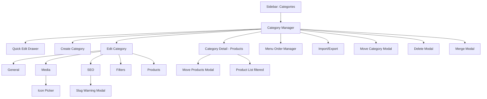
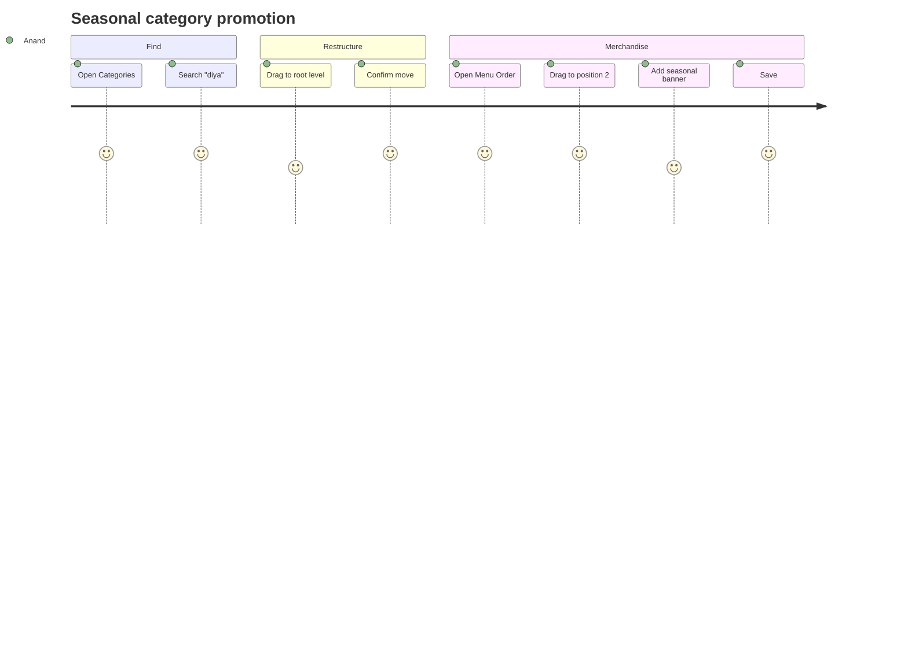
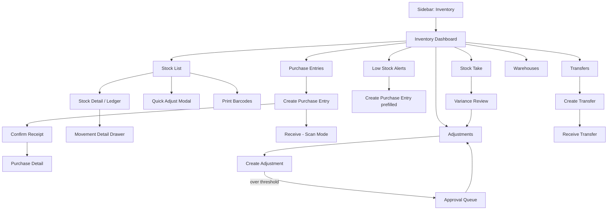
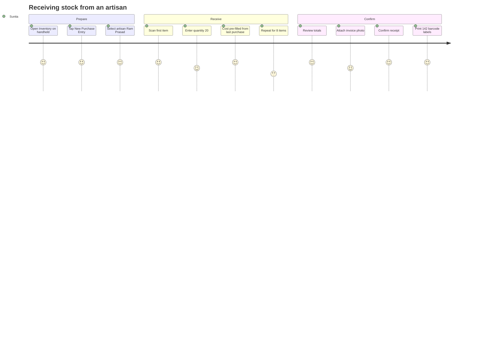

# Modules 04–05 — Category Management & Inventory

Enterprise Handicraft E-Commerce Platform · UI/UX Design Specification

---
---

# MODULE 04 · CATEGORY MANAGEMENT

## 4.1 Business Goal

Category structure is the customer's map of the catalog and the site's SEO backbone. A clean, shallow, well-named hierarchy directly increases product discovery, average pages per session and organic traffic. This module must make restructuring safe and instant — including menu ordering, SEO URLs, imagery and icons — without breaking existing links.

## 4.2 Purpose

Create and maintain the category tree (max 3 levels), control storefront menu ordering and visibility, manage per-category SEO and media, and reassign products between categories in bulk.

## 4.3 Features

| # | Feature |
|---|---------|
| C-01 | Hierarchical category tree (Category → Sub-category → Sub-sub-category, max depth 3) |
| C-02 | Drag-and-drop reorder and re-parenting with keyboard equivalents |
| C-03 | Menu ordering independent of alphabetical order, per menu location |
| C-04 | Category icon (SVG/craft icon set) and banner/tile image |
| C-05 | Per-category SEO: slug, meta title/description, canonical, OG image |
| C-06 | Automatic 301 redirects on slug change |
| C-07 | Show/hide in menu, show/hide on storefront, feature on homepage |
| C-08 | Product count per category (direct and inclusive of children) |
| C-09 | Bulk move products between categories |
| C-10 | Category-level default attribute set |
| C-11 | Category landing page content block (rich text, for SEO) |
| C-12 | Category-level filter configuration (which attributes appear as storefront filters) |
| C-13 | Import/export category tree |
| C-14 | Merge categories |

## 4.4 Complete Screen List

| ID | Screen | Route | Type |
|----|--------|-------|------|
| SCR-04-01 | Category Manager (tree + list) | `/admin/categories` | Page |
| SCR-04-02 | Category Create | `/admin/categories/create` | Page |
| SCR-04-03 | Category Edit | `/admin/categories/{id}/edit` | Page (tabs) |
| SCR-04-04 | Category Detail (products in category) | `/admin/categories/{id}` | Page |
| SCR-04-05 | Menu Order Manager | `/admin/categories/menu-order` | Page |
| SCR-04-06 | Category Import/Export | `/admin/categories/import` | Page |
| TAB-04-01 | Edit · General | — | Tab |
| TAB-04-02 | Edit · Media & Icon | — | Tab |
| TAB-04-03 | Edit · SEO | — | Tab |
| TAB-04-04 | Edit · Filters & Attributes | — | Tab |
| TAB-04-05 | Edit · Products | — | Tab |
| MOD-04-01 | Quick Add Category | — | Modal MD |
| MOD-04-02 | Move / Re-parent Category | — | Modal SM |
| MOD-04-03 | Delete Category | — | Modal MD (guarded) |
| MOD-04-04 | Merge Categories | — | Modal MD |
| MOD-04-05 | Move Products to Category | — | Modal MD |
| MOD-04-06 | Icon Picker | — | Modal LG |
| MOD-04-07 | Slug Change Warning | — | Modal SM |
| MOD-04-08 | Reorder (keyboard) — Move to Position | — | Modal XS |
| MOD-04-09 | Bulk Status Change | — | Modal SM |
| MOD-04-10 | Import Categories | — | Modal LG (wizard) |
| DRW-04-01 | Category Quick Edit | — | Drawer 480 |
| DRW-04-02 | Category Preview (storefront) | — | Drawer 560 |

## 4.5 Navigation Flow



## 4.6 Screen Hierarchy

```
Category Management
├── Category Manager (SCR-04-01) — split view: tree (left 4) + selected category panel (right 8)
│   ├── Quick Edit drawer · Move modal · Delete modal · Merge modal
├── Create (SCR-04-02)
├── Edit (SCR-04-03) — 5 tabs
├── Category Detail (SCR-04-04) — product list scoped to the category
├── Menu Order Manager (SCR-04-05)
└── Import/Export (SCR-04-06)
```

## 4.7 Desktop Layout

**Category Manager** uses L-09 (master-detail): left column 4 cols = tree with search and add; right 8 cols = selected category summary panel (details, stats, quick actions, recent products). Full-width toolbar above both.

**Category Edit** uses L-02 (8/4): tabs on the left, right rail with Status, Parent & Position, Preview thumbnail, and Stats.

**Menu Order Manager** uses L-01: menu location selector at the top, then a nested drag list showing the storefront menu as customers see it, with a live preview panel on the right (4 cols).

## 4.8 Tablet Layout

- Category Manager: tree collapses to a full-width list with expand/collapse; selecting a category pushes to a detail view with a back chevron (master → detail navigation instead of split view).
- Edit: rail moves below tabs.
- Menu Order: preview panel moves below the list.

## 4.9 Mobile Layout

- Tree becomes an accordion list, 48px rows, indent 16px per level.
- Drag reorder is replaced by a `⋮` → "Move" flow (Move up / Move down / Move to…) because precise dragging is unreliable at this size.
- Create/Edit are full-screen forms with a sticky bottom Save.
- Menu Order is read-only on mobile with a notice: "Reorder the menu on a larger screen."

## 4.10 Wireframe Description

### SCR-04-01 · Category Manager (Desktop)

```
┌──────────────────────────────────────────────────────────────────────────────────────┐
│ Dashboard / Catalog / Categories                                                      │
├──────────────────────────────────────────────────────────────────────────────────────┤
│ Categories                            [Import] [Export] [Menu Order] [+ Add Category] │
│ 42 categories · 3 levels · 1,482 products categorised · 4 uncategorised ⚠             │
├──────────────────────────────────────────────────────────────────────────────────────┤
│ [⌕ Search categories]  [Status ▾] [Level ▾]     [Expand All][Collapse All] [↻]        │
├────────────────────────────────────┬─────────────────────────────────────────────────┤
│ ⠿ ▾ 🏺 Home Décor          312  ● │ ┌─ Home Décor ────────────────────────────────┐ │
│      ⠿ ▸ Vases              84  ● │ │ [banner image 16:9]                          │ │
│      ⠿ ▸ Wall Art          102  ● │ │                                              │ │
│      ⠿ ▾ Lamps & Lighting   68  ● │ │ 🏺 Home Décor          [● Active] [In menu] │ │
│           ⠿ Table Lamps     31  ● │ │ /categories/home-decor                       │ │
│           ⠿ Hanging Lamps   37  ○ │ │ Level 1 · 6 sub-categories · Position 1      │ │
│      ⠿ ▸ Decorative Bowls   58  ● │ ├──────────────────────────────────────────────┤ │
│ ⠿ ▾ 🪔 Festive & Ritual     186  ● │ │ Products     312 direct · 312 including subs │ │
│      ⠿ ▸ Diyas & Lamps      74  ● │ │ Published    298                             │ │
│      ⠿ ▸ Puja Thali         42  ● │ │ Out of stock   4                             │ │
│      ⠿ ▸ Idols              70  ● │ │ Revenue 30d  ₹8,42,100                       │ │
│ ⠿ ▸ 🧵 Textiles             248  ● │ ├──────────────────────────────────────────────┤ │
│ ⠿ ▸ 🪵 Woodcraft            164  ● │ │ Description                                  │ │
│ ⠿ ▸ 💍 Jewellery            212  ● │ │ Handcrafted décor pieces from across India…  │ │
│ ⠿ ▸ 🎁 Gifting              208  ● │ ├──────────────────────────────────────────────┤ │
│ ⠿ ▸ 🌿 Garden & Outdoor     152  ○ │ │ [Edit] [View Products] [Add Sub-category] [⋮]│ │
│                                    │ └──────────────────────────────────────────────┘ │
│ [+ Add Root Category]              │                                                  │
└────────────────────────────────────┴─────────────────────────────────────────────────┘
```

Tree row anatomy: drag handle `⠿` · expand chevron · icon 20 · name · product count (tertiary, right-aligned before the status) · status dot · hover actions (Edit, Add child, `⋮`).

### SCR-04-03 · Category Edit — General

```
┌──────────────────────────────────────────────┬───────────────────────────────────────┐
│ ┌─ Basic Information ────────────────────┐   │ ┌─ Status ──────────────────────────┐ │
│ │ Category Name *                         │   │ │ ⦿ Active  ○ Inactive             │ │
│ │ [Vases                               ]  │   │ │ ☑ Show in navigation menu        │ │
│ │ Display Name (storefront)               │   │ │ ☑ Show on storefront             │ │
│ │ [Handcrafted Vases                   ]  │   │ │ ☐ Feature on homepage            │ │
│ │ Description                             │   │ └───────────────────────────────────┘ │
│ │ [Rich text editor…                   ]  │   │ ┌─ Hierarchy ───────────────────────┐ │
│ │ Short Description (menu tooltip)        │   │ │ Parent category                   │ │
│ │ [Ceramic, brass and terracotta vases ]  │   │ │ [Home Décor                    ▾] │ │
│ │ 42 / 120                                │   │ │ Level 2 · Path: Home Décor > Vases│ │
│ └─────────────────────────────────────────┘   │ │ Menu position                     │ │
│ ┌─ Landing Page Content (SEO) ────────────┐   │ │ [1 ▾] of 6                        │ │
│ │ [Rich text editor — appears below the   │   │ └───────────────────────────────────┘ │
│ │  product grid on the category page]     │   │ ┌─ Statistics ──────────────────────┐ │
│ └─────────────────────────────────────────┘   │ │ Products             84           │ │
│                                                │ │ Published            81           │ │
│                                                │ │ Sub-categories        0           │ │
│                                                │ │ Views (30d)       4,218           │ │
│                                                │ └───────────────────────────────────┘ │
├────────────────────────────────────────────────┴───────────────────────────────────────┤
│                              [Cancel]  [Save]  [Save & Add Another]                    │
└────────────────────────────────────────────────────────────────────────────────────────┘
```

### SCR-04-05 · Menu Order Manager

```
┌───────────────────────────────────────────────┬────────────────────────────────────────┐
│ Menu location: [Main Navigation ▾]            │  Live Preview                          │
├───────────────────────────────────────────────┤  ┌──────────────────────────────────┐ │
│ ⠿ 1  🏺 Home Décor              ▸ 6 items  ●  │  │ HOME DÉCOR ▾ FESTIVE ▾ TEXTILES ▾│ │
│ ⠿ 2  🪔 Festive & Ritual        ▸ 3 items  ●  │  │ ┌──────────────────────────────┐ │ │
│ ⠿ 3  🧵 Textiles                ▸ 5 items  ●  │  │ │ Vases                        │ │ │
│ ⠿ 4  🪵 Woodcraft               ▸ 4 items  ●  │  │ │ Wall Art                     │ │ │
│ ⠿ 5  💍 Jewellery               ▸ 6 items  ●  │  │ │ Lamps & Lighting             │ │ │
│ ⠿ 6  🎁 Gifting                 ▸ 2 items  ●  │  │ └──────────────────────────────┘ │ │
│ ⠿ 7  🌿 Garden & Outdoor        ▸ 3 items  ○  │  └──────────────────────────────────┘ │
│      (hidden from menu)                        │  [Desktop] [Tablet] [Mobile]         │
├───────────────────────────────────────────────┴────────────────────────────────────────┤
│ Changes apply to the storefront immediately.        [Reset Order]  [Save Menu Order]    │
└─────────────────────────────────────────────────────────────────────────────────────────┘
```

## 4.11 Header

| Screen | Title | Subtitle | Actions |
|--------|-------|----------|---------|
| Category Manager | "Categories" | "{n} categories · {levels} levels · {n} products categorised · {n} uncategorised" | Import · Export · Menu Order · **+ Add Category** |
| Create | "Add Category" | "Parent: {name}" or "Top-level category" | Cancel · Save · **Save & Add Another** |
| Edit | "{Category Name}" + status chip | "{full path} · {n} products · Level {n}" | Preview · `⋮` · **Save** |
| Category Detail | "{Category Name}" | "{n} products · {n} published · ₹{revenue} in 30 days" | Add Product · Move Products · **Edit Category** |
| Menu Order | "Menu Order" | "Drag to reorder. Changes apply immediately." | Reset Order · **Save Menu Order** |

## 4.12 Sidebar

`CATALOG` → Categories (second item). Shows a warning dot when uncategorised products exist.

## 4.13 Breadcrumb

```
Dashboard / Catalog / Categories
Dashboard / Catalog / Categories / Home Décor
Dashboard / Catalog / Categories / Home Décor / Vases
Dashboard / Catalog / Categories / Home Décor / Vases / Edit
Dashboard / Catalog / Categories / Menu Order
```
The category breadcrumb mirrors the tree path exactly, so users learn the hierarchy through navigation.

## 4.14 Toolbar

| Slot | Control |
|------|---------|
| Search | "Search categories" — matches name, slug, description; matching nodes auto-expand and highlight |
| Filter · Status | Active / Inactive / All |
| Filter · Level | 1 / 2 / 3 / All |
| Filter · Visibility | In menu / Hidden from menu / Featured |
| Filter · Content | Missing image / Missing SEO / Empty (0 products) |
| Expand All / Collapse All | Buttons |
| View toggle | Tree / Flat table |
| Refresh | Icon |

## 4.15 Action Buttons

| Action | Type | Location | Permission | Confirmation |
|--------|------|----------|------------|--------------|
| Add Category | Primary | Header | create | — |
| Add Sub-category | Row hover / detail | create | — |
| Edit | Row hover / detail | edit | — |
| Quick Edit | Row `⋮` | edit | Drawer |
| Move / Re-parent | Row `⋮` | edit | Modal |
| Move Up / Move Down | Row `⋮` | edit | Immediate + toast |
| Move to Position… | Row `⋮` | edit | Modal (keyboard path) |
| Activate / Deactivate | Row `⋮` toggle | edit | Confirm if it has children |
| Show/Hide in menu | Toggle | edit | Toast + undo |
| Merge | Row `⋮` | edit | Modal (guarded) |
| Delete | Row `⋮` (danger) | delete | Guarded destructive |
| View Products | Row `⋮` / detail | view | Navigates |
| Move Products | Detail | edit | Modal |
| Preview on Storefront | Detail / edit | view | Drawer/new tab |
| Import / Export | Header | import/export | Wizard/Modal |

## 4.16 Search

Tree search filters the tree in place: non-matching nodes hide, matching nodes and their ancestors remain with the match highlighted and a count "3 categories match". Clearing the search restores the previous expansion state. Flat-table view uses standard list search.

## 4.17 Filters

| Filter | Type | Options | Default |
|--------|------|---------|---------|
| Status | Segmented | All / Active / Inactive | All |
| Level | Multi-select | 1 / 2 / 3 | All |
| Menu visibility | Segmented | All / In menu / Hidden | All |
| Featured | Toggle | — | Off |
| Has products | Segmented | All / With products / Empty | All |
| Missing image | Toggle | — | Off |
| Missing SEO | Toggle | — | Off |
| Created / Updated | Date range | — | All |

## 4.18 Sorting

Tree view is ordered by **menu position** (manual) and cannot be re-sorted — sorting is a property of the tree, not a view. Flat-table view supports sorting by Name, Level, Product count, Position, Updated. Category Detail (products) inherits the product list's sorting.

## 4.19 Bulk Actions

Available in flat-table view and via multi-select in the tree:

| Action | Notes |
|--------|-------|
| Activate / Deactivate | Warns when deactivating parents with active children ("This will hide 6 sub-categories and 312 products.") |
| Show / Hide in menu | Immediate |
| Change parent | Blocked if it would exceed depth 3 or create a cycle |
| Feature / Unfeature | — |
| Export selected | — |
| Delete | Guarded; blocked when categories contain products unless a reassignment target is chosen in the dialog |

## 4.20 Cards / Tables / Widgets

### 4.20.1 Tree Node

| Element | Spec |
|---------|------|
| Row height | 44 (level 1), 40 (level 2–3) |
| Indent | 24px per level, with 1px connector guides |
| Drag handle | `grip-vertical` 16, visible on hover/focus |
| Expand chevron | 16, rotates 90° on expand, hidden for leaves |
| Icon | 20px category icon or default `folder` |
| Name | `body-md`, 500 for level 1 |
| Product count | `caption` `text-tertiary`, right-aligned; shows "84" or "84 (312)" where the bracket is inclusive of children |
| Status dot | 8px, success/neutral |
| Warning chips | `No image`, `No SEO`, `Empty` |
| Hover actions | Edit · Add child · `⋮` |
| Drop indicators | 2px brand line between rows = sibling; full-row `bg-selected` = child of |

### 4.20.2 Flat Table Columns

Select · Icon · Name (with path prefix in tertiary) · Level · Parent · Products (direct/inclusive) · Position · In Menu (boolean icon) · Featured · SEO complete · Updated · Status · Actions.

### 4.20.3 Category Summary Panel

Banner image (16:9), icon + name + status chips, slug link, level/children/position line, stat grid (products, published, out of stock, 30-day revenue, 30-day views, conversion), description excerpt, action row.

## 4.21 Forms & Fields

| Tab | Field | Type | Required | Notes |
|-----|-------|------|----------|-------|
| General | Category name | Text | Yes | 2–60, unique among siblings |
| General | Display name | Text | No | Storefront override |
| General | Parent category | Tree select | No | Empty = top level; blocked beyond depth 3 |
| General | Menu position | Number/select | No | Among siblings; auto-appends if empty |
| General | Description | Rich text | No | Shown on the category page header |
| General | Short description | Text | No | ≤120, used as the menu tooltip |
| General | Landing page content | Rich text | No | SEO content block below the grid |
| General | Default attribute set | Select | No | Pre-fills attributes for products created here |
| Media | Category icon | Icon picker / SVG upload | No | 24×24 line icon; craft icon set provided |
| Media | Tile image | Image upload 4:3 | No | 480×360, used in category grids |
| Media | Banner image | Image upload 3:1 | No | 1920×640 desktop + 750×750 mobile variant |
| Media | Banner overlay text | Text | No | ≤60 |
| Media | Banner text colour | Colour picker | No | Contrast warning if <4.5:1 against the image's average luminance |
| Media | Alt text (each image) | Text | Yes if image present | ≤125 |
| SEO | URL slug | Text | Yes | Unique, lowercase-hyphen; change → redirect option |
| SEO | Meta title | Text | No | ≤60 with meter; defaults to the name |
| SEO | Meta description | Textarea | No | ≤160 with meter |
| SEO | Canonical URL | URL | No | — |
| SEO | Robots index/follow | Checkboxes | No | Default on |
| SEO | OG image | Image | No | Falls back to the banner |
| Filters | Storefront filters | Multi-select of attributes | No | Which attributes appear as filters on this category page; drag to order |
| Filters | Default sort | Select | No | Relevance / New / Price low-high / Price high-low / Bestselling |
| Filters | Products per page | Select | No | 12 / 24 / 36 / 48 |
| Status | Active | Radio | Yes | — |
| Status | Show in menu | Checkbox | No | — |
| Status | Show on storefront | Checkbox | No | — |
| Status | Feature on homepage | Checkbox | No | Max 8 featured categories, enforced with a message |

## 4.22 Validation Rules

| Field | Rule | Message |
|-------|------|---------|
| Category name | Required, 2–60 | "Category name is required." |
| Category name | Unique among siblings | "A category with this name already exists under {parent}." |
| Parent | Cannot be self or a descendant | "A category can't be moved inside itself." |
| Parent | Depth ≤3 | "Categories can only be 3 levels deep." |
| Parent | Move with children within depth | "Moving this category would make its sub-categories 4 levels deep." |
| Slug | Required, unique, pattern | "URL slug is required." / "This URL is already in use." / "Use lowercase letters, numbers and hyphens only." |
| Slug change | Warning | "Changing this URL will break existing links. Create a 301 redirect?" (checked by default) |
| Meta title | ≤60 | "Meta title should be 60 characters or fewer." |
| Meta description | ≤160 | "Meta description should be 160 characters or fewer." |
| Tile/banner image | ≤2 MB, ratio tolerance ±5% | "Image is too large. Maximum size is 2 MB." / "This image isn't 4:3 and will be cropped." |
| Alt text | Required when an image exists | "Add alt text for this image." |
| Featured limit | ≤8 | "You can feature up to 8 categories. Unfeature one first." |
| Deactivate with children | Confirm | "This will also hide 6 sub-categories and 312 products." |
| Delete with products | Blocked unless reassigned | "This category has 84 products. Choose where to move them." |
| Delete with children | Blocked unless handled | "This category has 6 sub-categories. Move or delete them first." |
| Merge | Different categories | "Choose a different category to merge into." |
| Menu position | Integer within sibling range | "Position must be between 1 and {n}." |

## 4.23 Dropdowns & Data Sources

| Dropdown | Source |
|----------|--------|
| Parent category | `GET /api/categories/tree` (excludes self + descendants) |
| Menu position | Computed from sibling count |
| Attribute set | `GET /api/attribute-sets` |
| Storefront filter attributes | `GET /api/attributes?filterable=true` |
| Default sort | Static enum |
| Icon picker | Lucide set + custom craft icon set (`GET /api/icons/craft`) |
| Menu location | `GET /api/menus` (Main, Footer, Mobile, Mega-menu) |
| Move-products target | `GET /api/categories/tree` |

## 4.24 Icons

Categories `folder-tree` · Add `folder-plus` · Sub-category `corner-down-right` · Move `move` · Merge `merge` · Menu order `list-ordered` · Drag `grip-vertical` · Expand `chevron-right` · Icon picker `shapes` · Tile image `image` · Banner `panel-top` · Featured `star` · Hidden `eye-off` · Empty category `folder-x` · Craft category icons: pottery `amphora`, textiles `spool`, wood `tree-pine`, metal `hammer`, jewellery `gem`, festive `flame`, garden `flower`, gifting `gift`.

## 4.25 Pagination

Tree view: no pagination — the full tree loads (max ~200 nodes) and virtualises beyond 100. Flat table: 50/page. Category Detail products: standard product pagination (25/page).

## 4.26 Notifications & Toasts

| Trigger | Type | Message | Action |
|---------|------|---------|--------|
| Category created | Success | "'{name}' created" | View · Add Another |
| Category updated | Success | "Changes saved" | — |
| Reordered | Success | "Menu order updated" | Undo (8s) |
| Re-parented | Success | "'{name}' moved to '{parent}'" | Undo |
| Activated/Deactivated | Success | "'{name}' {activated/deactivated}" | Undo |
| Hidden from menu | Success | "'{name}' hidden from the menu" | Undo |
| Deleted | Success | "'{name}' deleted · 84 products moved to '{target}'" | Undo |
| Merged | Success | "Merged into '{target}' · 84 products moved" | — |
| Products moved | Success | "{n} products moved to '{category}'" | Undo |
| Slug changed | Info | "URL changed. A redirect from the old URL was created." | View Redirect |
| Depth exceeded | Error | "Categories can only be 3 levels deep." | — |
| Reorder failed | Error | "Couldn't save the new order." | Retry |
| Menu order saved | Success | "Menu order saved. The storefront is updated." | View Storefront |
| Import complete | Success | "{n} categories imported · {m} updated" | Download Report |

## 4.27 Dialogs

| Dialog | Type | Title | Content | Buttons |
|--------|------|-------|---------|---------|
| MOD-04-02 Move | Form | "Move '{name}'" | Tree select for the new parent (invalid targets disabled with tooltips), position select, preview of the resulting path, warning if children move too | Cancel · Move Category |
| MOD-04-03 Delete | Guarded destructive | "Delete '{name}'?" | Blockers: children count, product count. Required: "Move products to" category select. Consequences: URL will 404 unless redirected (redirect checkbox), removed from menus. Type the category name to confirm. | Cancel · Delete Category |
| MOD-04-04 Merge | Form (guarded) | "Merge '{source}' into…" | Target tree select, transfer summary (products, sub-categories, SEO redirect), warning that the source is deleted, typed confirm | Cancel · Merge Categories |
| MOD-04-05 Move Products | Form | "Move {n} products" | Target category select, radio: Replace primary category / Add as additional category, "Keep in current category" checkbox | Cancel · Move Products |
| MOD-04-06 Icon Picker | Picker | "Choose an icon" | Search, tabs (Craft / General / Uploaded), 8-column grid, live preview at 20/24/32px, upload SVG option | Cancel · Use Icon |
| MOD-04-07 Slug Warning | Warning | "Change the category URL?" | Old → new URL, "3 pages link here", redirect checkbox (default on) | Cancel · Change URL |
| MOD-04-08 Move to Position | Form | "Move '{name}'" | Parent select + position number, "Currently 3 of 6" | Cancel · Move |
| Deactivate with children | Warning | "Deactivate '{name}'?" | "This also hides 6 sub-categories and 312 products from the storefront." | Cancel · Deactivate |

## 4.28 Permission Matrix (Module 04)

| Action | Super Admin | Admin | Product | Inventory | Order | Marketing | Finance | Support | Content |
|--------|:-----------:|:-----:|:-------:|:---------:|:-----:|:---------:|:-------:|:-------:|:-------:|
| View categories | ✔ | ✔ | ✔ | ✔ | ✔ | ✔ | ✖ | ✖ | ✔ |
| Create category | ✔ | ✔ | ✔ | ✖ | ✖ | ✖ | ✖ | ✖ | ✖ |
| Edit category | ✔ | ✔ | ✔ | ✖ | ✖ | ✖ | ✖ | ✖ | ✖ |
| Edit category content/SEO | ✔ | ✔ | ✔ | ✖ | ✖ | ✔ | ✖ | ✖ | ✔ |
| Reorder / menu order | ✔ | ✔ | ✔ | ✖ | ✖ | ✔ | ✖ | ✖ | ✖ |
| Activate/Deactivate | ✔ | ✔ | ✔ | ✖ | ✖ | ✖ | ✖ | ✖ | ✖ |
| Move products between categories | ✔ | ✔ | ✔ | ✖ | ✖ | ✖ | ✖ | ✖ | ✖ |
| Merge categories | ✔ | ✔ | ✔ | ✖ | ✖ | ✖ | ✖ | ✖ | ✖ |
| Delete category | ✔ | ✔ | ✖ | ✖ | ✖ | ✖ | ✖ | ✖ | ✖ |
| Import/Export | ✔ | ✔ | ✔ | ✖ | ✖ | ✖ | ✖ | ✖ | ✖ |

## 4.29 User Journey

**Anand restructures for Diwali.** He opens Categories, searches "diya", and finds "Diyas & Lamps" under Festive & Ritual with 74 products. He decides it deserves top-level prominence for the season. He drags it to the root — a drop indicator shows the target — releases, and a confirmation toast appears with Undo. He then opens Menu Order, drags it to position 2, and the live preview updates instantly. Finally he opens Edit → Media, sets a Diwali banner and an amber overlay text, and saves. The storefront reflects the change immediately; a redirect was not needed because the slug did not change.



## 4.30 UX Guidelines

| ID | Guideline |
|----|-----------|
| CT-01 | Never allow a structural change that would break the storefront silently — always show the product/child impact first |
| CT-02 | Depth is capped at 3; disable invalid drop targets rather than rejecting after the drop |
| CT-03 | Every slug change offers a redirect, checked by default |
| CT-04 | Product counts must distinguish direct from inclusive-of-children |
| CT-05 | Menu ordering is a separate, purpose-built screen with a live preview — never buried in a form field |
| CT-06 | Deleting a category must never orphan products; force a destination |
| CT-07 | Category icons and imagery are merchandising assets — surface "missing image" as a visible warning chip |
| CT-08 | Keyboard users must be able to do everything drag-and-drop does |

## 4.31 Accessibility

- The tree is a proper tree widget: `↑↓` moves, `→` expands/enters, `←` collapses/exits, `Home/End` jump, type-ahead selects, `Space` selects.
- Reordering by keyboard: focus a node, `⌘↑/⌘↓` to move within siblings, `⌘←/⌘→` to outdent/indent, each announcing the new path and position.
- Every tree node announces "level {n}, {position} of {total}, {expanded/collapsed}, {n} products".
- Drop targets are announced during keyboard move mode; invalid targets announce why.
- Status is conveyed by chip text, not the dot alone.
- The menu-order live preview is marked decorative; the ordered list itself is the accessible source of truth.
- Contrast warnings on banner overlay text are announced when the colour changes.

## 4.32 Micro-interactions

| Interaction | Behaviour |
|-------------|-----------|
| Expand/collapse | Chevron rotates 90° in 240ms; children reveal with a height animation and 30ms stagger |
| Drag start | Node lifts (scale 1.02, elevation-3); siblings part to show a gap |
| Drag over valid target | 2px brand drop line (sibling) or full-row tint (child); target row's chevron auto-expands after 600ms hover |
| Drag over invalid target | Cursor "not-allowed", row shows a subtle danger tint, tooltip explains |
| Drop | Snap 240ms with slight overshoot; the moved row flashes `success-50` for 800ms |
| Search | Non-matching rows fade to 0 height over 200ms; matches highlight with a brand background on the matched substring |
| Product count update | Number rolls when products are moved |
| Menu preview | Reordering updates the preview with a 200ms cross-fade |
| Icon picker | Hovering an icon shows it live in the category row behind the modal (if visible) |
| Toggle "show in menu" | Row dims to 60% opacity when hidden |

## 4.33 Loading / Empty / Error States

| Surface | Loading | Empty | Error |
|---------|---------|-------|-------|
| Tree | 8 node skeletons with staggered indents | "No categories yet — organise your catalog so customers can browse easily." + Add Category + Import | "Couldn't load categories" + Retry |
| Summary panel | Skeleton (banner, title, stat grid) | "Select a category to see details" (illustration + hint) | Retry |
| Category detail products | Product table skeleton | "No products in this category yet" + Add Product + Move Products Here | Retry |
| Menu order | List skeleton + preview skeleton | "No categories in this menu" + Add | Retry |
| Search empty | — | "No categories match '{query}'" + Clear search | — |
| Uncategorised warning | — | Banner: "4 products have no category. [Assign now]" | — |

## 4.34 API & Database Dependencies

| Method | Endpoint |
|--------|----------|
| GET | `/api/categories/tree?status&level&includeCounts=true` |
| GET | `/api/categories?flat=true&search&page&size&sort` |
| GET | `/api/categories/{id}` · `/api/categories/{id}/stats` |
| POST | `/api/categories` |
| PUT | `/api/categories/{id}` |
| PATCH | `/api/categories/{id}/status` · `/menu-visibility` · `/featured` |
| POST | `/api/categories/{id}/move` (parentId, position) |
| POST | `/api/categories/reorder` (bulk order payload) |
| POST | `/api/categories/{id}/merge` |
| DELETE | `/api/categories/{id}?moveProductsTo=` |
| POST | `/api/categories/{id}/move-products` |
| GET | `/api/categories/check-slug?slug=&excludeId=` |
| GET/POST | `/api/menus/{location}/order` |
| POST | `/api/categories/import` · `/export` |
| GET | `/api/categories/{id}/preview-token` |

**Entities:** `Categories`, `CategoryTranslations`, `ProductCategories`, `CategoryMedia`, `CategoryFilters`, `Menus`, `MenuItems`, `SeoMeta`, `UrlRedirects`, `AttributeSets`, `Products`.

**Notes:** the tree uses a materialised path (`Path`, `Depth`, `Position`) so reorder and re-parent are single updates plus a subtree path rewrite. Category deletion is a hard delete only when empty; otherwise it is blocked at the API level. Slug uniqueness is global across categories and products to avoid storefront routing collisions.

## 4.35 Figma Build Notes

**Components required:** `CMP-DSP-Tree`, `CMP-DAT-Table`, `CMP-SRF-Card`, `CMP-NAV-Tabs`, `CMP-OVL-Modal`, `CMP-OVL-Drawer`, `CMP-INP-*`, `CMP-INP-ImageUpload`, `CMP-INP-RichText`, `CMP-FBK-EmptyState`, `CMP-IND-StatusChip`.

**New components:** `CMP-CAT-TreeNode` (level × state × warnings × drag states), `CMP-CAT-DropIndicator` (sibling/child variants), `CMP-CAT-SummaryPanel`, `CMP-CAT-MenuOrderRow`, `CMP-CAT-MenuPreview` (desktop/tablet/mobile variants), `CMP-CAT-IconPicker`, `CMP-CAT-PathBadge`.

**Auto layout:** Category Manager = H stack (Tree column 4 fixed 360 / Panel Fill). Tree = V stack of TreeNode instances with left padding driven by a `Level` variant (0/24/48). Menu Order = H stack (List Fill / Preview 400 fixed).

**Variants:** TreeNode — `Level` (1/2/3) × `State` (Default/Hover/Selected/Focused/Dragging/DropTargetSibling/DropTargetChild/Disabled) × `Expanded` (Y/N/Leaf) × `Status` (Active/Inactive) × `Warning` (None/NoImage/NoSEO/Empty).

**Prototype:** Categories → drag node → drop → toast → Edit → Media tab → Icon picker → SEO tab → slug change → warning modal → Save → Menu Order → drag → preview updates → Save.

**Dev notes:** (1) Reorder posts the full sibling order array, not individual deltas, to avoid race conditions. (2) The tree must render optimistically on drop and roll back with a snapback animation on failure. (3) Product counts are cached and refreshed on category mutation and nightly. (4) Slug changes must create the redirect in the same transaction.

**Future scalability:** category-level commission rules (multi-vendor), seasonal auto-activation windows, per-category landing-page templates, AI-suggested category assignment for uncategorised products, and localisation of category names and slugs.

---
---

# MODULE 05 · INVENTORY

## 5.1 Business Goal

Stock accuracy is cash accuracy. For handicraft, where items are often one-of-a-kind or produced in small artisan lots, overselling damages trust and understocking loses festival revenue. This module must keep on-hand, reserved and available quantities correct across warehouses, make receiving and adjustment fast on a warehouse floor, and give buyers reorder signals before a bestseller runs dry.

## 5.2 Purpose

Track stock at variant × warehouse level; record every movement with a reason and an audit trail; support purchase receiving from artisans and suppliers; handle damage, loss and returns-to-stock; drive low-stock alerts and reorder suggestions; and enable barcode-driven operations.

## 5.3 Features

| # | Feature |
|---|---------|
| I-01 | Stock overview by product/variant/warehouse with on-hand, reserved, available, incoming |
| I-02 | Multi-warehouse support with per-warehouse thresholds |
| I-03 | Purchase Entry (goods receipt) against a purchase order or ad hoc, with artisan/supplier attribution and lot costing |
| I-04 | Stock Adjustment with mandatory reason codes and approval above thresholds |
| I-05 | Damage & loss recording with photo evidence |
| I-06 | Return-to-stock from customer returns with a condition grade |
| I-07 | Stock transfer between warehouses with in-transit tracking |
| I-08 | Stock take / physical count with variance report |
| I-09 | Low-stock and out-of-stock alerts with configurable thresholds |
| I-10 | Reorder suggestions based on velocity and lead time |
| I-11 | Barcode scanning for receive, count, adjust and pick |
| I-12 | Barcode/label generation and printing |
| I-13 | Complete stock ledger (movement history) per SKU |
| I-14 | Stock valuation (weighted average cost) and inventory value reporting |
| I-15 | Bin/rack location management |
| I-16 | Bulk stock update via CSV |
| I-17 | Warehouse management (create, edit, deactivate, set default) |

## 5.4 Complete Screen List

| ID | Screen | Route | Type |
|----|--------|-------|------|
| SCR-05-01 | Inventory Dashboard | `/admin/inventory` | Page |
| SCR-05-02 | Stock List (all SKUs) | `/admin/inventory/stock` | Page |
| SCR-05-03 | Stock Detail / Ledger (per SKU) | `/admin/inventory/stock/{variantId}` | Page |
| SCR-05-04 | Purchase Entry List | `/admin/inventory/purchases` | Page |
| SCR-05-05 | Purchase Entry Create/Edit | `/admin/inventory/purchases/create` | Page |
| SCR-05-06 | Purchase Entry Detail | `/admin/inventory/purchases/{id}` | Page |
| SCR-05-07 | Stock Adjustment List | `/admin/inventory/adjustments` | Page |
| SCR-05-08 | Stock Adjustment Create | `/admin/inventory/adjustments/create` | Page |
| SCR-05-09 | Damage & Loss Register | `/admin/inventory/damage` | Page |
| SCR-05-10 | Stock Transfer List / Create | `/admin/inventory/transfers` | Page |
| SCR-05-11 | Stock Take / Physical Count | `/admin/inventory/stock-take` | Page |
| SCR-05-12 | Warehouses | `/admin/inventory/warehouses` | Page |
| SCR-05-13 | Low Stock Alerts | `/admin/inventory/alerts` | Page |
| SCR-05-14 | Barcode Print | `/admin/inventory/barcodes` | Page |
| WID-05-01..04 | Dashboard widgets (Stock value, Low stock, Pending receipts, Movement today) | — | Widgets |
| MOD-05-01 | Quick Stock Adjust | — | Modal MD |
| MOD-05-02 | Receive Items (scan mode) | — | Modal LG |
| MOD-05-03 | Add Purchase Line | — | Modal MD |
| MOD-05-04 | Record Damage | — | Modal MD |
| MOD-05-05 | Return to Stock | — | Modal MD |
| MOD-05-06 | Create Transfer | — | Modal LG |
| MOD-05-07 | Receive Transfer | — | Modal MD |
| MOD-05-08 | Start Stock Take | — | Modal MD |
| MOD-05-09 | Stock Take Variance Review | — | Modal XL |
| MOD-05-10 | Set Reorder Level | — | Modal SM |
| MOD-05-11 | Bulk Stock Update (CSV) | — | Modal LG (wizard) |
| MOD-05-12 | Print Barcode Labels | — | Modal MD |
| MOD-05-13 | Warehouse Create/Edit | — | Modal MD |
| MOD-05-14 | Deactivate Warehouse | — | Modal MD (guarded) |
| MOD-05-15 | Adjustment Approval | — | Modal MD |
| MOD-05-16 | Scan Error | — | Modal SM |
| MOD-05-17 | Confirm Purchase Receipt | — | Modal MD |
| MOD-05-18 | Assign Bin Location | — | Modal SM |
| DRW-05-01 | Stock Quick View | — | Drawer 480 |
| DRW-05-02 | Advanced Filters | — | Drawer 400 |
| DRW-05-03 | Movement Detail | — | Drawer 480 |

## 5.5 Navigation Flow



## 5.6 Screen Hierarchy

```
Inventory
├── Dashboard (SCR-05-01) — widgets + quick actions
├── Stock
│   ├── Stock List (SCR-05-02)
│   └── Stock Detail / Ledger (SCR-05-03)
├── Receiving
│   ├── Purchase Entry List (SCR-05-04)
│   ├── Create (SCR-05-05) — with scan mode
│   └── Detail (SCR-05-06)
├── Adjustments (SCR-05-07, SCR-05-08)
├── Damage & Loss (SCR-05-09)
├── Transfers (SCR-05-10)
├── Stock Take (SCR-05-11)
├── Alerts (SCR-05-13)
├── Barcodes (SCR-05-14)
└── Warehouses (SCR-05-12)
```

## 5.7 Desktop Layout

- **Inventory Dashboard:** L-07 widget grid — 4 KPI widgets (stock value, low stock count, out of stock count, pending receipts), a movement chart (span 8), an alerts list (span 4), a recent movements table (span 12).
- **Stock List:** L-01 full-width table, warehouse selector in the toolbar, status tabs (All / In stock / Low / Out / Backorder / Discontinued).
- **Stock Detail:** L-02 — left: current stock by warehouse table + movement ledger; right rail: product card, thresholds, valuation, reorder suggestion, quick actions.
- **Purchase Entry Create:** L-02 — left: supplier/artisan header fields + line items table with a scan bar; right rail: totals, costs, attachments, status.
- **Stock Take:** L-01 with a count-entry table and a live variance summary bar.

## 5.8 Tablet Layout

Tables show priority columns with a sticky SKU column. The purchase-entry line table becomes horizontally scrollable while the scan bar stays fixed at the top. Warehouse selector moves into the filter drawer.

## 5.9 Mobile Layout (Warehouse-Optimised)

This module has the strongest mobile requirement — warehouse staff use handhelds.

- **Scan-first screens:** a persistent scan bar (56px) at the top with a camera button; scanning a barcode immediately loads the SKU card.
- Controls use 48px minimum targets and 56px numeric steppers.
- High-contrast mode available (thicker borders, solid chips, larger type).
- Stock list is a card list with large quantity numerals (`numeric-lg`).
- Quick Adjust and Receive are full-screen sheets with a numeric keypad focus.
- Offline tolerance: scans queue locally with a "3 pending sync" chip; a banner explains the state.
- Audible + haptic feedback on scan success/failure.

```
┌──────────────────────────────┐
│ ☰   Receive Stock       ⋮    │
├──────────────────────────────┤
│ ┌──────────────────────────┐ │
│ │ ⌗ Scan or type barcode   │ │
│ │                    [📷]  │ │
│ └──────────────────────────┘ │
│  ✓ Last: HC-POT-10241 +5     │
├──────────────────────────────┤
│ Blue Pottery Vase            │
│ HC-POT-10241 · Medium/Blue   │
│ ┌──────────────────────────┐ │
│ │  On hand    24           │ │
│ │  Receiving               │ │
│ │  ┌────┬────────┬────┐    │ │
│ │  │ −  │   12   │ +  │    │ │
│ │  └────┴────────┴────┘    │ │
│ │  New total   36          │ │
│ └──────────────────────────┘ │
│ Bin location [A-12-3    ▾]   │
│                              │
│ [    Add to Receipt     ]    │
├──────────────────────────────┤
│ Receipt: 8 items · 142 units │
│ [ Review & Confirm ]         │
└──────────────────────────────┘
```

## 5.10 Wireframe Description

### SCR-05-02 · Stock List (Desktop)

```
┌──────────────────────────────────────────────────────────────────────────────────────┐
│ Inventory / Stock                                                                     │
├──────────────────────────────────────────────────────────────────────────────────────┤
│ Stock                    [Bulk Update] [Print Barcodes] [Export] [+ Purchase Entry]   │
│ 1,842 SKUs · ₹42,18,500 stock value · 24 low · 3 out of stock                         │
├──────────────────────────────────────────────────────────────────────────────────────┤
│ All (1842) │ In Stock (1815) │ Low (24) │ Out (3) │ Backorder (0) │ Discontinued (12) │
├──────────────────────────────────────────────────────────────────────────────────────┤
│ Warehouse: [All Warehouses ▾]  [⌕ Scan or search SKU/barcode] [Category▾][Status▾][+] │
├──────────────────────────────────────────────────────────────────────────────────────┤
│[☐]│IMG│ Product / Variant       │ SKU        │Bin   │ On Hand│Resv│Avail│Incom│ ● │⋮ │
│───┼───┼────────────────────────┼────────────┼──────┼────────┼────┼─────┼─────┼───┼──│
│[☐]│▣ │ Blue Pottery Vase      │HC-POT-10241│A-12-3│    24  │  6 │  18 │  0  │ ● │⋮ │
│   │   │ Medium / Blue / Matte  │            │      │        │    │     │     │Low│  │
│[☐]│▣ │ Brass Diya Set of 5    │HC-MET-10088│B-04-1│     3  │  2 │   1 │ 50  │ ● │⋮ │
│   │   │ — · Reorder at 10      │            │      │        │    │     │15Aug│Low│  │
│[☐]│▣ │ Terracotta Planter     │HC-POT-10310│C-01-7│     0  │  0 │   0 │  0  │ ● │⋮ │
│   │   │ ⚠ Out for 12 days      │            │      │        │    │     │     │Out│  │
├──────────────────────────────────────────────────────────────────────────────────────┤
│ TOTALS                                        1,842 SKUs · 18,412 units · ₹42,18,500  │
└──────────────────────────────────────────────────────────────────────────────────────┘
```

### SCR-05-03 · Stock Detail / Ledger

```
┌──────────────────────────────────────────────────┬───────────────────────────────────┐
│ ◀ Blue Pottery Vase — Medium/Blue/Matte  [● Low] │ ┌─ Product ────────────────────┐ │
│   HC-POT-10241 · Home Décor > Vases              │ │ [image 120]                  │ │
├──────────────────────────────────────────────────┤ │ Blue Pottery Vase            │ │
│ ┌─ Stock by Warehouse ─────────────────────────┐ │ │ Medium / Blue / Matte        │ │
│ │ Warehouse    On Hand  Reserved  Avail  Bin   │ │ │ [View Product →]             │ │
│ │ Jaipur (Main)    18        6      12  A-12-3 │ │ └──────────────────────────────┘ │
│ │ Delhi Hub         6        0       6  D-02-1 │ │ ┌─ Thresholds ─────────────────┐ │
│ │ ─────────────────────────────────────────────│ │ │ Reorder level      10  [Edit] │ │
│ │ TOTAL            24        6      18         │ │ │ Reorder quantity   50         │ │
│ └──────────────────────────────────────────────┘ │ │ Lead time      12 days        │ │
│ ┌─ Movement Ledger ────────────────────────────┐ │ │ Status         ● Low stock    │ │
│ │ Date       Type        Qty  Bal  Ref    By   │ │ └──────────────────────────────┘ │
│ │ 03 Aug 10:24 Sale      −2   24  #482  System │ │ ┌─ Valuation ──────────────────┐ │
│ │ 02 Aug 16:10 Receipt  +20   26  PE-91 Sunita │ │ │ Avg cost      ₹780.00        │ │
│ │ 01 Aug 09:02 Damage    −3    6  DM-14 Sunita │ │ │ Stock value ₹18,720.00       │ │
│ │ 28 Jul 14:33 Return    +1    9  RT-08 Karan  │ │ │ Retail value ₹30,000.00      │ │
│ │ 26 Jul 11:15 Sale      −4    8  #441  System │ │ │ Potential margin  37.6%      │ │
│ │                        [View all 128 →]      │ │ └──────────────────────────────┘ │
│ └──────────────────────────────────────────────┘ │ ┌─ Quick Actions ──────────────┐ │
│ ┌─ 90-Day Movement ────────────────────────────┐ │ │ Adjust stock                 │ │
│ │ [line chart: on-hand over time with reorder  │ │ │ Record damage                │ │
│ │  level as a dashed reference line]           │ │ │ Create purchase entry        │ │
│ └──────────────────────────────────────────────┘ │ │ Transfer stock               │ │
│                                                  │ │ Print barcode                │ │
│                                                  │ └──────────────────────────────┘ │
└──────────────────────────────────────────────────┴───────────────────────────────────┘
```

### SCR-05-05 · Purchase Entry Create

```
┌──────────────────────────────────────────────────────────────────────────────────────┐
│ ◀ New Purchase Entry                              [Save Draft] [Confirm Receipt]      │
├──────────────────────────────────────────────────┬───────────────────────────────────┤
│ ┌─ Receipt Details ────────────────────────────┐ │ ┌─ Summary ────────────────────┐ │
│ │ Supplier / Artisan *                          │ │ │ Items            8            │ │
│ │ [Ram Prasad Sharma — Jaipur Cluster       ▾] │ │ │ Total units    142            │ │
│ │ Reference / Invoice No.   Receipt Date *      │ │ │ Subtotal  ₹1,10,760           │ │
│ │ [INV-2026-0412         ]  [03 Aug 2026    ]  │ │ │ Freight      ₹2,400           │ │
│ │ Warehouse *               Payment Terms       │ │ │ Other        ₹  400           │ │
│ │ [Jaipur (Main)        ▾]  [Net 30         ▾] │ │ │ ─────────────────────         │ │
│ │ Notes                                         │ │ │ Total     ₹1,13,560           │ │
│ │ [Diwali lot — 3 pieces damaged in transit ]  │ │ └──────────────────────────────┘ │
│ └───────────────────────────────────────────────┘ │ ┌─ Attachments ────────────────┐ │
│ ┌─ Items ───────────────────────────────────────┐ │ │ 📎 invoice-0412.pdf          │ │
│ │ [⌗ Scan barcode or search SKU…       ] [+ Add]│ │ │ 📎 delivery-note.jpg         │ │
│ ├───────────────────────────────────────────────┤ │ │ [+ Add Attachment]           │ │
│ │ SKU          Product        Qty  Cost   Total │ │ └──────────────────────────────┘ │
│ │ HC-POT-10241 Blue Vase M/B   20  ₹780 ₹15,600 │ │ ┌─ Status ─────────────────────┐ │
│ │ HC-POT-10242 Blue Vase L/B   12  ₹980 ₹11,760 │ │ │ ○ Draft  ⦿ Ready to confirm  │ │
│ │ HC-MET-10088 Brass Diya      50  ₹280 ₹14,000 │ │ │ Confirming updates stock     │ │
│ │ …                                             │ │ │ immediately and can't be     │ │
│ │                                    [8 items]  │ │ │ undone.                      │ │
│ └───────────────────────────────────────────────┘ │ └──────────────────────────────┘ │
└──────────────────────────────────────────────────┴───────────────────────────────────┘
```

## 5.11 Header

| Screen | Title | Subtitle | Actions |
|--------|-------|----------|---------|
| Inventory Dashboard | "Inventory" | "{n} SKUs · ₹{value} stock value · {n} low · {n} out of stock" | Stock Take · Transfer · **+ Purchase Entry** |
| Stock List | "Stock" | Same counts | Bulk Update · Print Barcodes · Export · **+ Purchase Entry** |
| Stock Detail | "{Product} — {Variant}" + stock chip | "{SKU} · {category path}" + record nav | Adjust Stock · `⋮` · **Create Purchase Entry** |
| Purchase Entries | "Purchase Entries" | "{n} entries · {n} draft · ₹{value} received this month" | Export · **+ Purchase Entry** |
| Purchase Create | "New Purchase Entry" | "Draft · not yet affecting stock" | Save Draft · **Confirm Receipt** |
| Adjustments | "Stock Adjustments" | "{n} adjustments · {n} pending approval" | Export · **+ New Adjustment** |
| Damage Register | "Damage & Loss" | "{n} records · ₹{value} written off this month" | Export · **+ Record Damage** |
| Transfers | "Stock Transfers" | "{n} in transit · {n} pending receipt" | **+ New Transfer** |
| Stock Take | "Stock Take" | "{status} · {n} of {m} SKUs counted" | Pause · **Complete Count** |
| Warehouses | "Warehouses" | "{n} warehouses · {n} active" | **+ Add Warehouse** |
| Alerts | "Stock Alerts" | "{n} low · {n} out · {n} overdue receipts" | Configure Thresholds · **Create Purchase Entry** |

## 5.12 Sidebar

`CATALOG` → Inventory, with a danger badge showing the count of out-of-stock SKUs (or low-stock if none are out). Sub-items appear as page tabs, not sidebar children, except Warehouses which is reachable from the Inventory dashboard and Settings.

## 5.13 Breadcrumb

```
Dashboard / Catalog / Inventory
Dashboard / Catalog / Inventory / Stock
Dashboard / Catalog / Inventory / Stock / HC-POT-10241
Dashboard / Catalog / Inventory / Purchase Entries / PE-2026-0091
Dashboard / Catalog / Inventory / Adjustments / New
Dashboard / Catalog / Inventory / Warehouses / Jaipur (Main)
```

## 5.14 Toolbar

| Slot | Control | Notes |
|------|---------|-------|
| Warehouse selector | Select | Persistent across inventory screens; "All Warehouses" aggregates |
| Search / Scan | Text field with a scan icon | Accepts SKU, barcode, product name; barcode match jumps straight to the SKU |
| Filter · Category | Tree multi-select | — |
| Filter · Stock status | Segmented | Any / In / Low / Out / Backorder |
| Filter · Supplier/Artisan | Multi-select | — |
| More filters | Drawer | Bin location, value range, last movement date, days out of stock, velocity band, has reorder level |
| Right | Saved views, Columns, Density (Compact default), Refresh | Compact is the default density here |

## 5.15 Action Buttons

| Action | Type | Location | Permission | Confirmation |
|--------|------|----------|------------|--------------|
| Purchase Entry | Primary | Multiple headers | create purchase | — |
| Confirm Receipt | Primary | Purchase create | create purchase | Confirmation modal (irreversible) |
| Save Draft | Secondary | Purchase create | create purchase | — |
| Adjust Stock | Secondary / row `⋮` | adjust | Modal; approval if over threshold |
| Record Damage | Menu | damage | Modal with photo upload |
| Return to Stock | From returns module | adjust | Modal with condition grade |
| Transfer Stock | Menu / header | transfer | Modal |
| Receive Transfer | Row action | transfer | Modal |
| Start Stock Take | Header | stocktake | Modal (scope selection) |
| Complete Count | Primary | Stock take | Variance review modal |
| Set Reorder Level | Row `⋮` / rail | edit | Modal |
| Print Barcodes | Header / bulk | view | Modal |
| Bulk Update | Header | adjust | Wizard |
| Export | Header | export | Modal |
| Add Warehouse | Header | configure | Modal |
| Deactivate Warehouse | Row `⋮` (danger) | configure | Guarded (blocked if stock > 0) |
| Assign Bin | Row `⋮` | edit | Modal |
| Approve/Reject Adjustment | Approval queue | approve | Modal + re-auth for high value |

## 5.16 Search

Scan-aware search is central. Behaviour:

1. Input receives keyboard-wedge scanner data (fast burst ending in Enter) and treats it as a barcode.
2. Exact barcode match → immediately opens the SKU card / adds the line, with a success beep and a green flash.
3. No match → error beep, red flash, and MOD-05-16 Scan Error with options: "Search manually", "Create product", "Skip".
4. Manual typing searches SKU, barcode, product name, variant name and bin location with a 300ms debounce.
5. The last 5 scans are shown as a recent strip for quick re-selection.

## 5.17 Filters

| Filter | Type | Options | Default |
|--------|------|---------|---------|
| Warehouse | Select | All + list | All |
| Stock status | Segmented | Any / In stock / Low / Out / Backorder / Discontinued | Any |
| Category | Tree multi-select | — | All |
| Brand / Artisan | Multi-select | — | All |
| Supplier | Multi-select | — | All |
| Bin location | Text/select | — | All |
| Quantity range | Numeric range | — | — |
| Stock value range | Numeric range | — | — |
| Days out of stock | Numeric range | — | — |
| Velocity | Segmented | Fast / Medium / Slow / Dead (no sale in 90d) | All |
| Has reorder level | Toggle | — | Off |
| Last movement | Date range | — | All |
| Incoming stock | Toggle | Has incoming | Off |
| Purchase status (PE list) | Multi-select | Draft / Confirmed / Partially received / Cancelled | All |
| Adjustment reason | Multi-select | Reason codes | All |
| Adjustment approval | Segmented | All / Pending / Approved / Rejected | All |

## 5.18 Sorting

| List | Sortable | Default |
|------|----------|---------|
| Stock | SKU, Product, On hand, Reserved, Available, Incoming, Stock value, Last movement, Days out | Available asc (surfacing problems first) |
| Purchase entries | Date, Supplier, Total, Status, Items | Date desc |
| Adjustments | Date, SKU, Quantity, Reason, By, Status | Date desc |
| Damage | Date, SKU, Quantity, Value, By | Date desc |
| Transfers | Created, From, To, Items, Status | Created desc |
| Ledger | Date, Type, Quantity | Date desc |
| Warehouses | Name, SKUs, Units, Value | Name asc (default warehouse first) |

## 5.19 Bulk Actions

| Action | Notes |
|--------|-------|
| Bulk stock adjust | Set / Increase / Decrease with a single reason applied to all; preview table of resulting quantities; blocked if any result would be negative |
| Set reorder level | Apply one value, or a formula (e.g. "30 days of average sales") to all selected |
| Assign bin location | Applies to the selected warehouse |
| Transfer selected | Pre-fills a transfer with the selected SKUs |
| Print barcodes | Copies per SKU, template, start position |
| Export selected | — |
| Mark discontinued | Confirm; hides from reorder suggestions and storefront when stock reaches 0 |
| Bulk update via CSV | Wizard: upload → map → validate (shows current vs new) → commit; creates one adjustment record per row with a shared batch reference |

## 5.20 Cards / Tables / Widgets

### 5.20.1 Stock List — Columns

| Key | Label | Width | Align | Sortable | Priority | Cell |
|-----|-------|-------|-------|----------|----------|------|
| select | — | 48 | centre | no | 1 | Checkbox |
| image | — | 56 | centre | no | 2 | Thumb 40 |
| product | Product / Variant | flex 260 | left | yes | 1 | Name + variant line + warning chip |
| sku | SKU | 150 | left | yes | 1 | Mono, copyable |
| barcode | Barcode | 140 | left | no | 4 | Mono |
| warehouse | Warehouse | 140 | left | yes | 3 | Text (hidden when a single warehouse is selected) |
| bin | Bin | 90 | left | yes | 3 | Mono |
| onHand | On Hand | 90 | right | yes | 1 | Integer, 600 weight |
| reserved | Reserved | 90 | right | yes | 2 | Integer, tertiary |
| available | Available | 90 | right | yes | 1 | Integer with tone (danger 0, warning ≤ reorder) |
| incoming | Incoming | 100 | right | yes | 2 | Integer + ETA caption |
| reorderLevel | Reorder At | 100 | right | yes | 3 | Integer |
| avgCost | Avg Cost | 110 | right | yes | 4 | Currency (permission-gated) |
| stockValue | Stock Value | 130 | right | yes | 3 | Currency (permission-gated) |
| velocity | Velocity | 110 | left | yes | 4 | Chip: Fast/Medium/Slow/Dead |
| lastMovement | Last Movement | 130 | right | yes | 3 | Relative |
| status | Status | 110 | centre | yes | 1 | Stock chip |
| actions | — | 96 | right | no | 1 | Adjust · View · `⋮` |

Sticky totals row: SKU count, total units, total stock value.

### 5.20.2 Movement Ledger — Columns

Date-time · Type (Receipt / Sale / Return / Adjustment / Damage / Transfer In / Transfer Out / Stock Take / Reservation / Release) · Quantity (signed, coloured) · Balance after · Warehouse · Reference (linked: order, purchase entry, transfer, adjustment) · Reason · Performed by · Note. Row click opens DRW-05-03 with full detail and any attachments.

### 5.20.3 Inventory Dashboard Widgets

| Widget | Contents |
|--------|----------|
| WID-05-01 Stock Value | Total valuation, delta vs last month, breakdown by category donut |
| WID-05-02 Stock Health | Donut: In stock / Low / Out / Dead stock, with counts and click-through |
| WID-05-03 Pending Receipts | List of confirmed-but-not-received purchase entries with ETA and overdue flags |
| WID-05-04 Movement Today | Received / Sold / Adjusted / Damaged counts with a sparkline |
| Low Stock Alerts | Ranked list by urgency (days of cover remaining) |
| Reorder Suggestions | SKU, current stock, 30-day velocity, lead time, suggested quantity, "Add to purchase entry" action |
| Dead Stock | SKUs with no movement in 90 days and their tied-up value |

### 5.20.4 Reorder Suggestion Logic (displayed to the user)

`Suggested quantity = (average daily sales × (lead time + safety days)) − available − incoming`, rounded up to the supplier's minimum order quantity. The UI shows this formula in a tooltip with the actual numbers substituted, so buyers can trust or override it.

### 5.20.5 Stock Take Table

SKU · Product · Expected · Counted (input) · Variance (auto, coloured) · Variance value · Recount flag · Notes. A live summary bar shows counted/total, total variance units and variance value. Variances beyond a configurable tolerance are flagged for recount before completion.

## 5.21 Forms & Fields

### 5.21.1 Purchase Entry

| Field | Type | Required | Notes |
|-------|------|----------|-------|
| Supplier / Artisan | Combobox | Yes | Shows cluster and region; inline create |
| Reference / Invoice no. | Text | No | Unique per supplier (warning if duplicate) |
| Receipt date | Date | Yes | Cannot be in the future; cannot be in a closed accounting period |
| Warehouse | Select | Yes | Defaults to the user's scoped warehouse |
| Payment terms | Select | No | — |
| Expected delivery date | Date | No | For pending receipts |
| Notes | Textarea | No | — |
| Attachments | File upload | No | Invoice PDF, delivery note, photos; ≤10 files, 10 MB each |
| **Line items** | | | |
| SKU | Scan/combobox | Yes | — |
| Quantity | Number | Yes | >0 |
| Unit cost | Currency | Yes | Defaults to the last purchase cost; a variance >20% shows a warning |
| Discount | Currency/% | No | — |
| Tax | Select | No | — |
| Line total | Read-only | — | — |
| Bin location | Text/select | No | — |
| Lot / batch | Text | No | For traceability |
| Expiry | Date | No | Rarely used; for organic/natural products |
| **Totals** | | | |
| Freight | Currency | No | Allocated across lines by value |
| Other charges | Currency | No | — |
| Grand total | Read-only | — | — |

### 5.21.2 Stock Adjustment

| Field | Type | Required | Notes |
|-------|------|----------|-------|
| Warehouse | Select | Yes | — |
| SKU | Scan/combobox | Yes | Multi-line supported |
| Adjustment type | Radio | Yes | Increase / Decrease / Set to |
| Quantity | Number | Yes | Live preview "24 → 18 (−6)" |
| Reason code | Select | Yes | Damaged, Lost, Theft, Found, Counting error, Sample/Photography, Gift/Donation, Quality rejection, Expired, Artisan return, Correction |
| Reason detail | Textarea | Conditional | Required for Theft, Lost, Correction and any quantity >50; min 20 chars |
| Cost impact | Read-only | — | Units × average cost |
| Attachments | Image upload | Conditional | Required for Damaged and Theft |
| Adjustment date | Date | Yes | Defaults today |
| Requires approval | Read-only indicator | — | Shown when over threshold |

### 5.21.3 Record Damage

Adds to the adjustment form: Damage category (Transit / Handling / Manufacturing defect / Storage / Customer return), Responsible party (Supplier / Courier / Internal / Unknown), Claim reference, Recoverable amount, Photos (min 1, max 6).

### 5.21.4 Stock Transfer

| Field | Type | Required |
|-------|------|----------|
| From warehouse | Select | Yes |
| To warehouse | Select | Yes (≠ from) |
| Transfer date | Date | Yes |
| Expected arrival | Date | No |
| Carrier / transport | Text | No |
| Tracking reference | Text | No |
| Line items (SKU, quantity) | Table | Yes, ≥1 |
| Notes | Textarea | No |

On confirm, stock moves to "In transit" (deducted from source, not yet added to destination). The destination warehouse receives it via MOD-05-07 with a discrepancy field.

### 5.21.5 Warehouse

Name, Code (unique), Type (Main / Hub / Store / Artisan workshop / 3PL), Address block, Contact person, Phone, Email, Operating hours, Is default, Is active, Allow negative stock (off by default), Default bin prefix, Serviceable PIN codes (bulk paste), Priority for order allocation.

### 5.21.6 Stock Take

Scope selection: Full warehouse / By category / By bin range / By selected SKUs / Cycle count (random N). Options: freeze stock during count (blocks sales-driven deductions), tolerance %, blind count (hides expected quantities to avoid bias — recommended default).

## 5.22 Validation Rules

| Field | Rule | Message |
|-------|------|---------|
| Quantity | Integer > 0 | "Enter a whole number greater than 0." |
| Decrease quantity | ≤ available | "Only 18 units are available. Reserved stock can't be adjusted." |
| Resulting stock | ≥ 0 unless the warehouse allows negative | "This would make stock negative. Check the quantity." |
| Unit cost | ≥ 0 | "Cost can't be negative." |
| Unit cost variance | >20% vs last | "This cost is 34% higher than the last purchase (₹780). Continue?" |
| Receipt date | Not future | "Receipt date can't be in the future." |
| Receipt date | Not in a closed period | "This accounting period was closed on {date}. Contact Finance." |
| Line items | ≥1 | "Add at least one item." |
| Duplicate SKU line | Merge prompt | "This SKU is already on the receipt. Add {n} to the existing line?" |
| Reason code | Required | "Select a reason for this adjustment." |
| Reason detail | Required for high-impact | "Explain this adjustment in at least 20 characters." |
| Photos | Required for damage/theft | "Add at least one photo as evidence." |
| Approval threshold | >100 units or >₹50,000 | "This adjustment needs approval. It will be sent to an administrator." |
| Transfer warehouses | Different | "Choose a different destination warehouse." |
| Transfer quantity | ≤ available at source | "Only 12 units are available at {warehouse}." |
| Stock take variance | > tolerance | "Variance of 24 units exceeds the 5% tolerance. Recount required." |
| Warehouse code | Unique, 2–10 alphanumeric | "This warehouse code is already in use." |
| Deactivate warehouse | Stock must be 0 | "This warehouse holds 412 units. Transfer them before deactivating." |
| Deactivate warehouse | No pending transfers | "2 transfers are in progress to this warehouse." |
| Reorder level | ≥0, integer | "Reorder level must be 0 or more." |
| Reorder level | < max stock (warning) | "Reorder level is higher than your typical stock." |
| Bin location | Pattern per warehouse | "Bin must match the format {A-00-0}." |
| Barcode scan | Known SKU | "No product found for barcode {value}." |
| CSV bulk update | Valid SKUs, numeric quantities | Row-level errors listed in the validation step |

## 5.23 Dropdowns & Data Sources

| Dropdown | Source |
|----------|--------|
| Warehouse | `GET /api/warehouses?active=true` (scoped to the user) |
| SKU / product | `GET /api/inventory/search?q=` (returns variant-level rows with stock) |
| Supplier / Artisan | `GET /api/suppliers` + `GET /api/artisans` (unified combobox with type chips) |
| Reason code | `GET /api/inventory/reason-codes` (configurable in Settings) |
| Damage category | Static enum |
| Bin location | `GET /api/warehouses/{id}/bins` + free text |
| Payment terms | `GET /api/settings/payment-terms` |
| Tax | `GET /api/tax-classes` |
| Label template | `GET /api/settings/label-templates` |
| Transfer carrier | `GET /api/couriers` + free text |
| Stock take scope | Category tree / bin list / SKU picker |

## 5.24 Icons

Inventory `warehouse` · Stock `boxes` · Purchase entry `package-plus` · Adjustment `sliders-horizontal` · Damage `package-x` · Transfer `arrow-left-right` · In transit `truck` · Stock take `clipboard-list` · Variance `git-compare-arrows` · Barcode `scan-barcode` · Scan camera `scan-line` · Bin `map-pin` · Reorder `repeat` · Low stock `package-minus` · Out of stock `package-x` · Dead stock `hourglass` · Reserved `lock` · Incoming `package-open` · Supplier `truck` · Artisan `hand-heart` · Approve `check-check` · Value `indian-rupee` · Velocity `gauge`.

## 5.25 Pagination

Stock list: 50/page default (compact density), options 25/50/100/200. Ledger: 25/page with "Load more". Purchase entries and adjustments: 25/page. Stock take: no pagination — virtualised full list so counting is uninterrupted, with a sticky progress bar. Mobile: infinite scroll everywhere.

## 5.26 Notifications & Toasts

| Trigger | Type | Message | Action |
|---------|------|---------|--------|
| Scan success | Silent + beep | Green flash on the field; "HC-POT-10241 · +5" strip | — |
| Scan failure | Error + beep | "No product found for barcode {value}" | Search Manually |
| Stock adjusted | Success | "Stock updated: {SKU} 24 → 18" | Undo (8s, if not yet consumed by an order) |
| Adjustment needs approval | Info | "Adjustment sent for approval" | View Request |
| Adjustment approved | Success | "Adjustment approved. Stock updated." | View |
| Adjustment rejected | Warning | "Adjustment rejected: {reason}" | View |
| Purchase entry saved | Success | "Purchase entry saved as draft" | View |
| Receipt confirmed | Success | "142 units received across 8 items" | View Entry · Print Labels |
| Damage recorded | Success | "3 units written off · ₹2,340 value" | View Record |
| Transfer created | Success | "Transfer created · 42 units in transit to {warehouse}" | View |
| Transfer received | Success | "Transfer received · 42 units added to {warehouse}" | — |
| Transfer discrepancy | Warning | "Received 40 of 42 units. A discrepancy adjustment was created." | Review |
| Stock take started | Info | "Stock take started for {scope}. Stock is frozen." | — |
| Stock take completed | Success | "Count complete · {n} SKUs · variance {±n} units (₹{value})" | View Report |
| Low stock (realtime) | Warning | "{Product} is low on stock ({n} left)" | Create Purchase Entry |
| Out of stock (realtime) | Error | "{Product} is now out of stock" | View |
| Overselling prevented | Error | "Order couldn't reserve stock for {SKU}" | View Order |
| Bulk update complete | Success | "{n} SKUs updated · {m} skipped" | Download Report |
| Offline scan queued | Info | "Saved offline · will sync when you reconnect" | View Queue |
| Sync complete | Success | "{n} offline actions synced" | — |
| Negative stock blocked | Error | "This would make stock negative" | — |

## 5.27 Dialogs

| Dialog | Type | Title | Content | Buttons |
|--------|------|-------|---------|---------|
| MOD-05-01 Quick Adjust | Form | "Adjust stock — {SKU}" | Current stock read-out, type radio, quantity stepper, live "24 → 18 (−6)" preview, reason, detail, photo (conditional), approval notice | Cancel · Adjust Stock |
| MOD-05-02 Receive (scan) | Form (large) | "Receive items" | Persistent scan field, running list of scanned lines with quantity steppers, totals bar, undo last scan | Cancel · Add to Receipt |
| MOD-05-04 Record Damage | Form | "Record damage or loss" | SKU, quantity, damage category, responsible party, photos (min 1), cost impact, claim reference | Cancel · Record Damage |
| MOD-05-05 Return to Stock | Form | "Return items to stock" | Order reference, items with condition grade (Sellable / Minor defect / Damaged / Unsellable), destination (Stock / Damage / Discard), auto quantity split | Cancel · Return to Stock |
| MOD-05-07 Receive Transfer | Form | "Receive transfer {ref}" | Expected vs received quantity per line, discrepancy auto-calculated with a reason field, photos | Cancel · Receive Transfer |
| MOD-05-08 Start Stock Take | Form | "Start a stock take" | Scope radio cards, blind-count toggle (default on), freeze-stock toggle, tolerance %, estimated SKU count | Cancel · Start Count |
| MOD-05-09 Variance Review | Table (XL) | "Review variances" | Table of variances with expected/counted/difference/value, recount flags, per-line accept/recount, summary totals | Recount Flagged · Cancel · Accept & Adjust |
| MOD-05-14 Deactivate Warehouse | Guarded | "Deactivate {warehouse}?" | Blockers: stock units, open transfers, assigned users. Type the warehouse code. | Cancel · Deactivate |
| MOD-05-15 Adjustment Approval | Form | "Approve stock adjustment?" | Full context: SKU, quantity, reason, detail, photos, requester, cost impact, current stock. Reject requires a reason. | Reject · Approve |
| MOD-05-16 Scan Error | Error | "Barcode not recognised" | The scanned value in mono, suggestions (similar SKUs), actions | Search Manually · Create Product · Skip |
| MOD-05-17 Confirm Receipt | Destructive-ish confirm | "Confirm this receipt?" | "This adds 142 units to {warehouse} and updates average costs. Confirmed receipts can't be edited — only reversed with an adjustment." Summary table. | Cancel · Confirm Receipt |
| Negative stock | Error | "Not enough stock" | "You're trying to remove 24 units but only 18 are available. 6 units are reserved for open orders." | View Reservations · OK |
| Success — Receipt | Success dialog | "Receipt confirmed" | 142 units · 8 items · ₹1,13,560 · warehouse. Next actions. | Print Labels · New Receipt · Done |

## 5.28 Permission Matrix (Module 05)

| Action | Super Admin | Admin | Product | Inventory | Order | Marketing | Finance | Support | Content |
|--------|:-----------:|:-----:|:-------:|:---------:|:-----:|:---------:|:-------:|:-------:|:-------:|
| View stock | ✔ | ✔ | ✔ | ✔ | ✔ | ✖ | ✔ | ✔ | ✖ |
| View cost/valuation | ✔ | ✔ | ✖ | ✔ | ✖ | ✖ | ✔ | ✖ | ✖ |
| Adjust stock | ✔ | ✔ | ✖ | ✔ | ✖ | ✖ | ✖ | ✖ | ✖ |
| Approve adjustment | ✔ | ✔ | ✖ | ✖ | ✖ | ✖ | ✔ | ✖ | ✖ |
| Create purchase entry | ✔ | ✔ | ✖ | ✔ | ✖ | ✖ | ✖ | ✖ | ✖ |
| Confirm receipt | ✔ | ✔ | ✖ | ✔ | ✖ | ✖ | ✖ | ✖ | ✖ |
| Record damage | ✔ | ✔ | ✖ | ✔ | ✖ | ✖ | ✖ | ✖ | ✖ |
| Return to stock | ✔ | ✔ | ✖ | ✔ | ✔ | ✖ | ✖ | ✖ | ✖ |
| Create transfer | ✔ | ✔ | ✖ | ✔ | ✖ | ✖ | ✖ | ✖ | ✖ |
| Stock take | ✔ | ✔ | ✖ | ✔ | ✖ | ✖ | ✖ | ✖ | ✖ |
| Set reorder levels | ✔ | ✔ | ✔ | ✔ | ✖ | ✖ | ✖ | ✖ | ✖ |
| Manage warehouses | ✔ | ✔ | ✖ | ✔ (edit) | ✖ | ✖ | ✖ | ✖ | ✖ |
| Print barcodes | ✔ | ✔ | ✔ | ✔ | ✖ | ✖ | ✖ | ✖ | ✖ |
| Export inventory | ✔ | ✔ | ✔ | ✔ | ✖ | ✖ | ✔ | ✖ | ✖ |
| Bulk update | ✔ | ✔ | ✖ | ✔ | ✖ | ✖ | ✖ | ✖ | ✖ |

Warehouse scoping: an Inventory Manager scoped to Jaipur sees only Jaipur stock, and the warehouse selector is locked to their scope with a tooltip.

## 5.29 User Journey

### Journey A — Sunita receives a Diwali lot



### Journey B — Karan discovers an oversell risk

An order for 8 units of a bestseller fails to reserve stock. The order detail shows "Insufficient stock". Karan opens the SKU from the order line, sees on-hand 24 but reserved 22 (available 2), checks the ledger and finds a stock take variance from yesterday. He creates a purchase entry from the reorder suggestion (which shows 12-day lead time and suggests 50 units), and marks the order as "On hold — awaiting stock" with a customer notification.

### Journey C — Monthly stock take

Priya starts a blind cycle count for the Home Décor category. Stock is frozen. Two staff count on handhelds. The variance review shows 6 SKUs outside tolerance; 4 are recounted and reconciled, 2 remain as genuine shrinkage. Accepting the variance auto-creates adjustment records with reason "Counting variance", each linked to the stock take reference, and unfreezes stock.

## 5.30 UX Guidelines

| ID | Guideline |
|----|-----------|
| IN-01 | Available stock (on hand − reserved) is the number that matters — display it most prominently, never just on-hand |
| IN-02 | Every stock change requires a reason; no silent mutations anywhere in the product |
| IN-03 | Confirmed receipts are immutable — reversal is by adjustment, and the UI must say so before confirming |
| IN-04 | Scan-first on every warehouse screen; typing is the fallback, not the default |
| IN-05 | Warehouse-facing screens use compact density, 48px targets and high-contrast options |
| IN-06 | Never let a UI action produce negative stock without an explicit warehouse setting allowing it |
| IN-07 | Show the reorder formula's actual numbers, not just its output — buyers must be able to sanity-check |
| IN-08 | Blind counts are the default for stock takes to prevent confirmation bias |
| IN-09 | Offline actions must queue visibly and never be silently lost |
| IN-10 | Cost and valuation are permission-gated but stock quantities are broadly visible — operations need them |

## 5.31 Accessibility

- Scan feedback is multi-modal: colour flash + sound + haptic + a text status line, so no single channel is required.
- Quantity steppers expose the current value and limits; `↑↓` adjust, `Shift+↑` by 10.
- The ledger table announces signed quantities as "plus 20" / "minus 3", not just the symbol.
- Stock status chips include text; the low/out distinction is never colour-only.
- The stock take table supports full keyboard entry with `Enter` committing and moving to the next row.
- High-contrast mode is a documented user preference affecting borders, chip fills and focus-ring width.
- Camera-based scanning has a manual-entry alternative on every screen where it appears.
- Variance figures are announced with their direction and value when the count field is committed.

## 5.32 Micro-interactions

| Interaction | Behaviour |
|-------------|-----------|
| Scan success | Field flashes `success-50` for 400ms, 880Hz beep, light haptic, the scanned row highlights and scrolls into view |
| Scan failure | Field flashes `danger-50`, two-tone descending beep, error haptic, the error modal opens after 300ms |
| Quantity stepper | Value rolls; the resulting total updates live below in a muted line |
| Stock crossing a threshold | Chip cross-fades tone and pulses once |
| Adjustment preview | "24 → 18" animates the arrow and colours the delta |
| Receipt confirm | Button spinner → success dialog with a check-draw animation |
| Ledger row hover | Reference link underlines; the row shows a "View detail" chevron |
| Transfer in transit | Truck icon animates a subtle 3px horizontal drift loop (reduced-motion: static) |
| Stock take progress | Progress bar and "142 of 318 counted" update on each commit |
| Variance flag | Rows exceeding tolerance animate in a danger left border |
| Offline queue | The pending-count chip pulses when it increments |
| Sync | Chip shows a spinner then a check, then fades out |

## 5.33 Loading / Empty / Error States

| Surface | Loading | Empty | Error |
|---------|---------|-------|-------|
| Inventory dashboard | Widget skeletons, staggered | New store: "No stock records yet — stock appears here once you add products or record a purchase." + Purchase Entry | Per-widget retry |
| Stock list | Table skeleton (compact, 12 rows) | "No stock records" + Purchase Entry + Import | "Couldn't load stock" + Retry |
| Stock detail | Header + table + chart skeletons | "No movements yet for this SKU" | Retry |
| Purchase entries | Table skeleton | "No purchase entries yet — record what you receive from artisans and suppliers." + New Purchase Entry | Retry |
| Purchase create | — | "No items yet — scan a barcode or search for a product." | Line-level error markers |
| Adjustments | Table skeleton | "No adjustments recorded" | Retry |
| Damage register | Table skeleton | "No damage or loss recorded — that's good news." | Retry |
| Transfers | Table skeleton | "No transfers yet" + New Transfer | Retry |
| Stock take | Table skeleton | "No stock take in progress" + Start Stock Take | Retry |
| Warehouses | Card skeletons | "Only one warehouse — add more to track stock by location." + Add Warehouse | Retry |
| Alerts | List skeleton | "No stock alerts — everything is above its reorder level." (success-toned empty state) | Retry |
| Scanner unavailable | — | "Camera access is blocked. Use a handheld scanner or type the barcode." | — |
| Offline | — | Banner: "You're offline. Scans are saved and will sync automatically." | — |
| Warehouse not permitted | — | Lock + "You don't have access to {warehouse}" | — |

## 5.34 API & Database Dependencies

| Method | Endpoint |
|--------|----------|
| GET | `/api/inventory/summary?warehouseId` |
| GET | `/api/inventory/stock?warehouseId&status&category&search&page&size&sort` |
| GET | `/api/inventory/stock/{variantId}?warehouseId` |
| GET | `/api/inventory/stock/{variantId}/ledger?from&to&type&page` |
| GET | `/api/inventory/search?q=` (scan/lookup) |
| POST | `/api/inventory/adjustments` |
| GET | `/api/inventory/adjustments?status&reason&from&to` |
| POST | `/api/inventory/adjustments/{id}/approve` · `/reject` |
| POST | `/api/inventory/damage` |
| POST | `/api/inventory/returns-to-stock` |
| GET/POST | `/api/inventory/purchases` |
| GET | `/api/inventory/purchases/{id}` |
| PUT | `/api/inventory/purchases/{id}` (draft only) |
| POST | `/api/inventory/purchases/{id}/confirm` |
| POST | `/api/inventory/purchases/{id}/cancel` |
| GET/POST | `/api/inventory/transfers` |
| POST | `/api/inventory/transfers/{id}/receive` |
| POST | `/api/inventory/stock-take/start` · `/{id}/count` · `/{id}/complete` · `/{id}/variance` |
| GET/POST/PUT | `/api/warehouses` · `/api/warehouses/{id}` |
| POST | `/api/warehouses/{id}/deactivate` |
| PATCH | `/api/inventory/reorder-level` (bulk) |
| POST | `/api/inventory/bulk-update` (CSV) |
| POST | `/api/inventory/barcodes/print` |
| GET | `/api/inventory/reorder-suggestions?warehouseId` |
| GET | `/api/inventory/alerts` |
| POST | `/api/inventory/sync-offline` (batch of queued actions) |
| WS | `/hub/inventory` (stock changes, alerts) |

**Entities:** `Inventory` (variantId × warehouseId → onHand, reserved, incoming, reorderLevel, binLocation, avgCost), `InventoryTransactions` (append-only ledger), `PurchaseEntries`, `PurchaseEntryLines`, `StockAdjustments`, `StockAdjustmentLines`, `DamageRecords`, `StockTransfers`, `StockTransferLines`, `StockTakes`, `StockTakeLines`, `Warehouses`, `WarehouseBins`, `Suppliers`, `Artisans`, `ReasonCodes`, `Approvals`, `OfflineQueue`.

**Critical notes:**
1. `Reserved` is derived from open order lines — never edited directly.
2. `InventoryTransactions` is append-only and is the single source of truth; `Inventory.onHand` is a materialised balance updated in the same transaction.
3. Average cost recalculates on every receipt: `newAvg = (oldQty×oldAvg + recvQty×recvCost) / (oldQty + recvQty)`.
4. Confirming a receipt is transactional across all lines — partial commits are not permitted.
5. Stock take freezing sets a flag that causes order reservation attempts to fail with a clear message.
6. Offline queue entries carry a client-generated idempotency key so re-sync cannot double-apply.

## 5.35 Figma Build Notes

**Components required:** `CMP-DAT-Table` (compact), `CMP-DAT-FilterBar`, `CMP-DAT-BulkBar`, `CMP-INP-Number` (XL warehouse variant), `CMP-INP-Combobox`, `CMP-INP-FileUpload`, `CMP-INP-ImageUpload`, `CMP-OVL-Modal`, `CMP-OVL-Drawer`, `CMP-WID-Frame`, `CMP-CHT-Line`, `CMP-CHT-Donut`, `CMP-DSP-Timeline`, `CMP-FBK-*`, `CMP-IND-StatusChip`.

**New components:**

| Component | Notes |
|-----------|-------|
| `CMP-INV-ScanBar` | Persistent scan field with camera button, last-scan strip, success/error states |
| `CMP-INV-StockCell` | On hand / reserved / available composite with tone |
| `CMP-INV-QuantityStepper-XL` | 56px warehouse-grade stepper |
| `CMP-INV-LedgerRow` | Signed quantity, balance, typed reference link |
| `CMP-INV-ReorderCard` | Suggestion with formula breakdown tooltip |
| `CMP-INV-VarianceRow` | Expected/counted/variance with tolerance flag |
| `CMP-INV-PurchaseLineRow` | SKU, qty, cost, total with cost-variance warning |
| `CMP-INV-WarehouseCard` | Warehouse summary with units, value, default badge |
| `CMP-INV-TransferStatusBar` | From → in transit → received progress |
| `CMP-INV-OfflineChip` | Pending sync count with states |
| `CMP-INV-BarcodeLabel` | Print label component (4×6 and Avery grid) |

**Auto layout — Purchase Entry Create:**
```
Frame: Purchase Entry (V, Fill × Hug, gap 24, padding 24)
├── Instance: PageHeader [With Back, Actions 2]
└── Frame: Columns (H, Fill × Hug, gap 24)
    ├── Frame: Main (V, Fill × Hug, gap 24)
    │   ├── Instance: Card / Receipt Details → Frame: Fields (V, gap 20)
    │   └── Instance: Card / Items
    │       ├── Instance: ScanBar (Fill × 56)
    │       └── Instance: Table / Purchase Lines (Fill × Hug)
    └── Frame: Rail (V, 360 fixed × Hug, gap 24)
        ├── Instance: Card / Summary
        ├── Instance: Card / Attachments
        └── Instance: Card / Status
```

**Variants:** ScanBar — `State` (Idle/Focused/Scanning/Success/Error/Offline) × `Breakpoint` (Desktop/Mobile). StockCell — `Status` (In/Low/Out/Backorder/Discontinued) × `HasIncoming` (Y/N). QuantityStepper-XL — `State` (Default/Focus/Min/Max/Error/Disabled). LedgerRow — `Type` (10 movement types) × `Direction` (In/Out).

**Prototype (PT-04):** Inventory dashboard → Low stock widget → Alerts → "Create Purchase Entry" (pre-filled) → scan simulation (3 scans with success feedback) → totals update → attach invoice → Confirm Receipt modal → success dialog → Print Labels modal → barcode sheet preview. Mobile variant of the same flow at 375px.

**Dev notes:**
1. The scan field must retain focus at all times on warehouse screens; clicking elsewhere returns focus after 2s idle.
2. Scanner input detection: keystrokes arriving <30ms apart ending in Enter are treated as a scan, not typing.
3. All quantity mutations post an idempotency key to survive retries and offline replay.
4. Stock values in the list must be computed server-side; the client never sums costs.
5. Real-time stock updates arrive over SignalR and update visible rows with a highlight rather than re-sorting the list.
6. Warehouse scoping is enforced server-side; the selector renders only permitted warehouses.

**Future scalability:** serialised inventory (unique piece tracking for one-of-a-kind crafts), FIFO/FEFO lot costing, supplier portal for artisans to confirm dispatch, demand forecasting with seasonality, automated purchase order generation and approval, 3PL/WMS integration, RFID support, and per-artisan production capacity planning.
