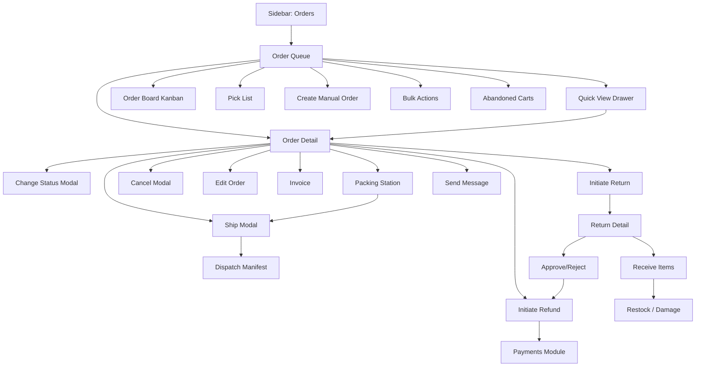
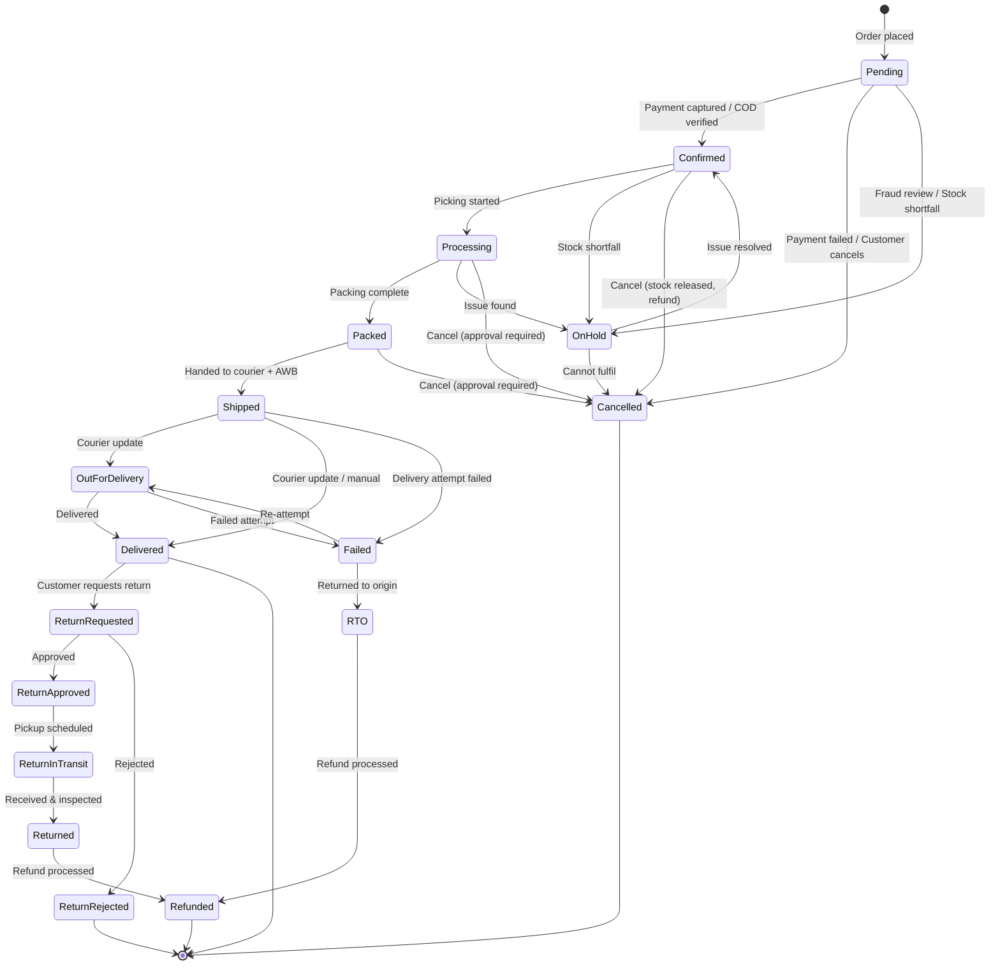
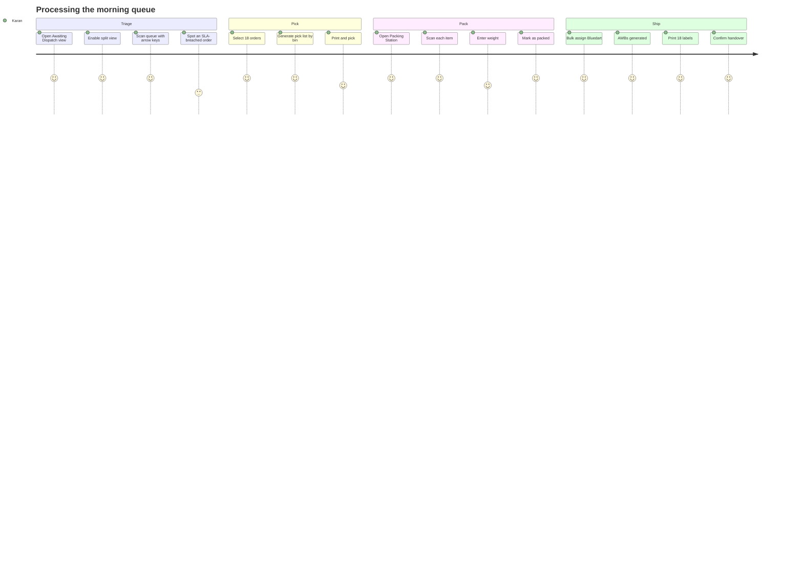

# Module 06 · Order Management

Enterprise Handicraft E-Commerce Platform · UI/UX Design Specification

---

## 6.1 Business Goal

Orders are where revenue becomes obligation. This module must let a small fulfilment team process 150–400 orders a day with under a 2% error rate, keep customers informed automatically at every state change, and handle the exceptions that handicraft creates — fragile goods, made-to-order lead times, one-of-a-kind items that cannot be substituted, and higher-than-average return handling for gifting.

## 6.2 Purpose

Receive, verify, process, pack, ship, deliver, and close orders; handle cancellations, returns, exchanges and refunds; produce invoices, packing slips and shipping labels; and give every other role a reliable, auditable view of order state.

## 6.3 Features

| # | Feature |
|---|---------|
| O-01 | Unified order queue with status tabs, saved views and SLA indicators |
| O-02 | Full order state machine with guarded transitions and reason capture |
| O-03 | Split-pane quick view for rapid triage without leaving the queue |
| O-04 | Order detail with items, customer, payment, shipping, timeline and internal notes |
| O-05 | Edit order before dispatch: items, quantities, address, shipping method, discounts |
| O-06 | Manual/phone order creation on behalf of a customer |
| O-07 | Partial fulfilment and split shipments |
| O-08 | Bulk status change, bulk invoice print, bulk label print, bulk courier assignment |
| O-09 | Pick list and packing slip generation with bin locations |
| O-10 | Invoice generation with immutable sequential numbering and GST breakdown |
| O-11 | Shipping label generation and courier handover manifest |
| O-12 | Tracking number capture and automatic status sync from courier webhooks |
| O-13 | Cancellation with reason, stock release and refund initiation |
| O-14 | Returns / RMA workflow with condition grading and restocking |
| O-15 | Exchange workflow (return + replacement order linkage) |
| O-16 | Refund initiation and status tracking (full, partial, item-level) |
| O-17 | Order tags, priority flags and assignment to a team member |
| O-18 | Customer communication log (email/SMS/WhatsApp sent per order) |
| O-19 | Fraud/risk indicators on high-value or unusual orders |
| O-20 | Gift orders: gift message, gift wrap, hidden pricing on the packing slip |
| O-21 | Made-to-order tracking with production status and promised dispatch date |
| O-22 | Order-level audit trail |

## 6.4 Complete Screen List

| ID | Screen | Route | Type |
|----|--------|-------|------|
| SCR-06-01 | Order Queue / List | `/admin/orders` | Page |
| SCR-06-02 | Order Detail | `/admin/orders/{id}` | Page |
| SCR-06-03 | Order Create (manual) | `/admin/orders/create` | Page (wizard) |
| SCR-06-04 | Order Edit | `/admin/orders/{id}/edit` | Page |
| SCR-06-05 | Pick List | `/admin/orders/pick-list` | Page |
| SCR-06-06 | Packing Station | `/admin/orders/{id}/pack` | Page |
| SCR-06-07 | Dispatch / Handover Manifest | `/admin/orders/dispatch` | Page |
| SCR-06-08 | Returns / RMA List | `/admin/returns` | Page |
| SCR-06-09 | Return Detail | `/admin/returns/{id}` | Page |
| SCR-06-10 | Return Create (initiate) | `/admin/returns/create` | Page (wizard) |
| SCR-06-11 | Invoices List | `/admin/invoices` | Page |
| SCR-06-12 | Invoice Detail / Preview | `/admin/invoices/{id}` | Page |
| SCR-06-13 | Order Board (Kanban) | `/admin/orders/board` | Page |
| SCR-06-14 | Abandoned Carts | `/admin/orders/abandoned` | Page |
| TAB-06-01 | Detail · Items | — | Tab |
| TAB-06-02 | Detail · Customer & Addresses | — | Tab |
| TAB-06-03 | Detail · Payment | — | Tab |
| TAB-06-04 | Detail · Shipping & Tracking | — | Tab |
| TAB-06-05 | Detail · Returns & Refunds | — | Tab |
| TAB-06-06 | Detail · Communications | — | Tab |
| TAB-06-07 | Detail · Notes | — | Tab |
| TAB-06-08 | Detail · Activity / Timeline | — | Tab |
| MOD-06-01 | Change Order Status | — | Modal MD |
| MOD-06-02 | Confirm Order | — | Modal SM |
| MOD-06-03 | Mark as Packed | — | Modal MD |
| MOD-06-04 | Ship Order (courier + AWB) | — | Modal MD |
| MOD-06-05 | Mark as Delivered | — | Modal SM |
| MOD-06-06 | Cancel Order | — | Modal MD (guarded) |
| MOD-06-07 | Put Order On Hold | — | Modal SM |
| MOD-06-08 | Edit Order Items | — | Modal LG |
| MOD-06-09 | Edit Shipping Address | — | Modal MD |
| MOD-06-10 | Change Shipping Method | — | Modal MD |
| MOD-06-11 | Apply Discount / Adjustment | — | Modal MD |
| MOD-06-12 | Split Shipment | — | Modal LG |
| MOD-06-13 | Assign to Team Member | — | Modal SM |
| MOD-06-14 | Add Order Tag | — | Modal SM |
| MOD-06-15 | Add Internal Note | — | Modal SM |
| MOD-06-16 | Send Message to Customer | — | Modal MD |
| MOD-06-17 | Generate Invoice | — | Modal SM |
| MOD-06-18 | Print Documents | — | Modal MD |
| MOD-06-19 | Initiate Return | — | Modal LG (wizard) |
| MOD-06-20 | Receive Returned Items | — | Modal LG |
| MOD-06-21 | Approve / Reject Return | — | Modal MD |
| MOD-06-22 | Initiate Refund | — | Modal MD |
| MOD-06-23 | Create Exchange | — | Modal LG |
| MOD-06-24 | Bulk Status Change | — | Modal MD |
| MOD-06-25 | Bulk Assign Courier | — | Modal MD |
| MOD-06-26 | Bulk Print | — | Modal MD |
| MOD-06-27 | Export Orders | — | Modal MD |
| MOD-06-28 | Fraud Review | — | Modal MD |
| MOD-06-29 | Gift Options | — | Modal SM |
| MOD-06-30 | Stock Shortfall Resolution | — | Modal MD |
| DRW-06-01 | Order Quick View | — | Drawer 560 |
| DRW-06-02 | Advanced Filters | — | Drawer 400 |
| DRW-06-03 | Customer Mini-Profile | — | Drawer 480 |
| DRW-06-04 | Tracking Timeline | — | Drawer 480 |

## 6.5 Navigation Flow



### 6.5.1 Order State Machine



**Transition rules exposed in the UI**
- Forward transitions are one click from the detail header's primary action, which always shows the *next* logical action ("Confirm Order" → "Start Processing" → "Mark as Packed" → "Ship Order" → "Mark as Delivered").
- Backward transitions are permitted only from the status modal, require a reason, and are audit-logged.
- Cancellation after Packed requires Admin approval.
- Skipping states is allowed only for Admin+, via the status modal, with a reason.

## 6.6 Screen Hierarchy

```
Order Management
├── Order Queue (SCR-06-01) — status tabs, SLA view, saved views
│   ├── Quick View drawer · Filters drawer · Bulk actions · Export
│   └── Order Board (SCR-06-13) — Kanban alternative
├── Order Detail (SCR-06-02) — 8 tabs + status header + timeline
│   └── 20+ action modals
├── Create Manual Order (SCR-06-03) — 4-step wizard
├── Edit Order (SCR-06-04)
├── Fulfilment
│   ├── Pick List (SCR-06-05)
│   ├── Packing Station (SCR-06-06)
│   └── Dispatch Manifest (SCR-06-07)
├── Returns
│   ├── Returns List (SCR-06-08)
│   ├── Return Detail (SCR-06-09)
│   └── Initiate Return (SCR-06-10)
├── Invoices (SCR-06-11, SCR-06-12)
└── Abandoned Carts (SCR-06-14)
```

## 6.7 Desktop Layout (≥1280)

| Screen | Template | Composition |
|--------|----------|-------------|
| Order Queue | L-01 or L-04 | Default: full-width table. "Split view" toggle switches to 5/7 list + quick view pane for triage |
| Order Detail | L-02 (8/4) | Left: status progress bar, items table, tab panels. Right rail: customer card, payment summary, shipping summary, totals, tags/assignment, quick actions |
| Order Board | L-01 | Horizontally scrolling Kanban columns per status with WIP counts |
| Pick List | L-01 | Grouped by bin location; print-optimised |
| Packing Station | L-06 | Centred, scan-driven, large item checklist with weight/dimension capture |
| Dispatch Manifest | L-01 | Grouped by courier with handover confirmation |
| Return Detail | L-02 (8/4) | Left: returned items, condition grading, inspection notes. Right: original order summary, refund summary, timeline |
| Invoice Detail | L-05 | Centred A4 preview with an action bar |

## 6.8 Tablet Layout

- Queue: priority columns (Order #, Customer, Amount, Payment, Status, Age, Actions); the rest scroll; the split view is disabled below 1024.
- Detail: rail moves below the main content; the status progress bar stays sticky at the top.
- Packing Station is fully usable — it is designed for a 10" warehouse tablet as the primary device.
- Kanban shows 3 columns at a time with horizontal scroll and column snapping.

## 6.9 Mobile Layout

- Queue: card list with order number, customer, amount, payment chip, status chip, age chip and `⋮`.
- Sticky filter chips row; sort in a bottom sheet.
- Detail: status progress becomes a compact stepper; tabs scroll horizontally; the primary next action is a full-width sticky bottom button; other actions in a `⋮` sheet.
- Item list becomes cards with thumbnail, name, variant, quantity and line total.
- Packing and picking are supported on mobile with scan-first flows and 48px targets.
- Printing on mobile offers "Send to printer" (network print) or "Email PDF" rather than a browser print dialog.

## 6.10 Wireframe Description

### SCR-06-01 · Order Queue (Desktop)

```
┌──────────────────────────────────────────────────────────────────────────────────────┐
│ Dashboard / Sales / Orders                                                            │
├──────────────────────────────────────────────────────────────────────────────────────┤
│ Orders                       [Pick List] [Dispatch] [Export] [⊞ Board] [+ New Order]  │
│ 1,482 orders · 47 pending · 12 over SLA ⚠ · ₹8,42,100 today                           │
├──────────────────────────────────────────────────────────────────────────────────────┤
│ All │ New (18) │ Confirmed (29) │ Processing (24) │ Packed (11) │ Shipped (86) │ … │  │
├──────────────────────────────────────────────────────────────────────────────────────┤
│ [⌕ Order #, customer, phone, email, AWB]  [Status▾][Payment▾][Courier▾][Date▾]        │
│ [+ More Filters (1)]      [Awaiting Dispatch ▾] [⊟ Split] [⚙][▤][↻]                  │
│ Active: (SLA: Breached ×)                                              Clear all      │
├──────────────────────────────────────────────────────────────────────────────────────┤
│ ✓ 6 selected  Select all 47   [Status][Courier][Print][Assign][⋮]              [×]    │
├──────────────────────────────────────────────────────────────────────────────────────┤
│[☐]│ Order #        │ Customer       │Items│ Amount  │Payment│ Status  │Age │Courier│⋮│
│───┼────────────────┼────────────────┼─────┼─────────┼───────┼─────────┼────┼───────┼─│
│[☐]│#HC-2026-000482 │ Meera Nair     │  3  │ ₹4,250  │● Paid │● New    │ 12m│  —    │⋮│
│   │ 🎁 Gift · ⚡Priority          │Bengaluru       │     │Razorpay│        │    │       │ │
│[☐]│#HC-2026-000481 │ Arjun Kapoor   │  1  │ ₹1,890  │● COD  │● Packed │ 4h │Bluedart│⋮│
│[☐]│#HC-2026-000480 │ Nisha Patel    │  5  │₹12,400  │● Paid │● Shipped│ 1d │Delhivery│⋮│
│   │ AWB BD1234567890                │Mumbai          │     │       │         │    │       │ │
│[☐]│#HC-2026-000479 │ Rahul Mehta    │  2  │   ₹890  │● Paid │⚠ On Hold│ 3d │  —    │⋮│
│   │ ⚠ Stock shortfall: 1 item        │                │     │       │         │SLA!│       │ │
├──────────────────────────────────────────────────────────────────────────────────────┤
│ Showing 1–25 of 1,482    [25 ▾]              ‹‹ ‹ 1 2 3 … 60 › ››                     │
└──────────────────────────────────────────────────────────────────────────────────────┘
```

### SCR-06-02 · Order Detail (Desktop)

```
┌──────────────────────────────────────────────────────────────────────────────────────┐
│ ◀ Order #HC-2026-000482   [● Confirmed]  [🎁 Gift] [⚡ Priority]                       │
│   Placed 03 Aug 2026, 10:24 AM · Meera Nair · ₹4,250        ‹ 3 of 47 ›               │
│                          [Print ▾] [Send Message] [⋮]  [ Start Processing ]           │
├──────────────────────────────────────────────────────────────────────────────────────┤
│  ●────────●────────◉────────○────────○────────○                                       │
│  Placed  Confirmed Processing Packed  Shipped  Delivered                              │
│  10:24    10:25     —          —       —        —                                     │
├──────────────────────────────────────────────────────────────────────────────────────┤
│ Items │ Customer │ Payment │ Shipping │ Returns │ Communications │ Notes │ Activity   │
├────────────────────────────────────────────────┬─────────────────────────────────────┤
│ ┌─ Items (3) ────────────────────────────────┐ │ ┌─ Customer ──────────────────────┐│
│ │ [img] Blue Pottery Vase          ₹1,250 ×1 │ │ │ 👤 Meera Nair          [VIP]    ││
│ │       HC-POT-10241 · Medium/Blue           │ │ │ meera@example.com      [copy]   ││
│ │       Bin A-12-3 · ✓ In stock      ₹1,250  │ │ │ +91 98765 12345        [copy]   ││
│ │ ─────────────────────────────────────────── │ │ │ 18 orders · ₹1,42,800 lifetime  ││
│ │ [img] Brass Diya Set of 5          ₹450 ×2 │ │ │ [View Customer →]               ││
│ │       HC-MET-10088                         │ │ └─────────────────────────────────┘│
│ │       Bin B-04-1 · ⚠ Only 1 in stock ₹900  │ │ ┌─ Shipping Address ──────────────┐│
│ │ ─────────────────────────────────────────── │ │ │ Meera Nair                      ││
│ │ [img] Kantha Cushion Cover        ₹890 ×2  │ │ │ 402, Rosewood Apartments        ││
│ │       HC-TEX-20117 · Indigo                │ │ │ 12th Main, Indiranagar          ││
│ │       Bin C-08-2 · ✓ In stock      ₹1,780  │ │ │ Bengaluru, KA 560038            ││
│ │                                            │ │ │ 📞 +91 98765 12345              ││
│ │ ⚠ 1 item has insufficient stock  [Resolve] │ │ │ [Edit] [Verify PIN ✓]           ││
│ └────────────────────────────────────────────┘ │ └─────────────────────────────────┘│
│ ┌─ Gift Options ─────────────────────────────┐ │ ┌─ Payment ───────────────────────┐│
│ │ 🎁 Gift wrap: Traditional (₹99)            │ │ │ Method      Razorpay (UPI)      ││
│ │ Message: "Happy Diwali, Amma! — Meera"     │ │ │ Status      ● Paid              ││
│ │ ☑ Hide prices on the packing slip          │ │ │ Txn ID      pay_NxK2… [copy]    ││
│ └────────────────────────────────────────────┘ │ │ Paid at     03 Aug, 10:25 AM    ││
│                                                 │ │ [View Payment →]                ││
│                                                 │ └─────────────────────────────────┘│
│                                                 │ ┌─ Order Summary ─────────────────┐│
│                                                 │ │ Subtotal          ₹3,930.00     ││
│                                                 │ │ Gift wrap            ₹99.00     ││
│                                                 │ │ Discount (DIWALI10) −₹393.00    ││
│                                                 │ │ Shipping             ₹99.00     ││
│                                                 │ │ GST 12%             ₹455.00     ││
│                                                 │ │ ─────────────────────────────   ││
│                                                 │ │ TOTAL             ₹4,250.00     ││
│                                                 │ │ Paid              ₹4,250.00     ││
│                                                 │ │ Balance               ₹0.00     ││
│                                                 │ └─────────────────────────────────┘│
│                                                 │ ┌─ Assignment & Tags ─────────────┐│
│                                                 │ │ Assigned to  [Karan M.      ▾]  ││
│                                                 │ │ Tags  [Fragile ×][Gift ×][+]    ││
│                                                 │ │ Priority  ⚡ High               ││
│                                                 │ └─────────────────────────────────┘│
└─────────────────────────────────────────────────┴─────────────────────────────────────┘
```

### SCR-06-06 · Packing Station

```
┌──────────────────────────────────────────────────────────────────────────────────────┐
│ Packing — #HC-2026-000482                                      [Skip] [Report Issue]  │
├──────────────────────────────────────────────────────────────────────────────────────┤
│ ┌─ Scan each item to verify ────────────────────────────────────────────────────────┐ │
│ │ ⌗ Scan barcode…                                                            [📷]  │ │
│ └───────────────────────────────────────────────────────────────────────────────────┘ │
│                                                                                       │
│  ✓ Blue Pottery Vase            HC-POT-10241  1 of 1  ✓ Scanned    ⚠ FRAGILE          │
│  ◐ Brass Diya Set of 5          HC-MET-10088  1 of 2    Scan 1 more                   │
│  ○ Kantha Cushion Cover         HC-TEX-20117  0 of 2    Not scanned                   │
│                                                                                       │
│  Progress ████████░░░░░░░░  2 of 5 items                                              │
├──────────────────────────────────────────────────────────────────────────────────────┤
│ ┌─ Package Details ─────────────────┐  ┌─ Handling Notes ──────────────────────────┐  │
│ │ Box type   [Medium (30×20×15) ▾]  │  │ ⚠ Contains fragile pottery — bubble wrap  │  │
│ │ Weight     [ 1.850    ] kg        │  │ 🎁 Gift wrap: Traditional                 │  │
│ │ L×W×H  [30]×[20]×[15] cm          │  │ 📝 "Happy Diwali, Amma! — Meera"          │  │
│ │ ☑ Fragile sticker                 │  │ ☑ Hide prices on the packing slip         │  │
│ └───────────────────────────────────┘  └───────────────────────────────────────────┘  │
├──────────────────────────────────────────────────────────────────────────────────────┤
│                    [Print Packing Slip]     [ Mark as Packed & Continue ]              │
└──────────────────────────────────────────────────────────────────────────────────────┘
```

### DRW-06-01 · Order Quick View

```
┌─ #HC-2026-000482 ──────────────── ‹ 3 of 47 › [×] ┐
│ [● Confirmed]  [🎁] [⚡]                           │
│ Meera Nair · Bengaluru · 12 min ago                │
├────────────────────────────────────────────────────┤
│ 3 items · ₹4,250 · Razorpay ● Paid                 │
│ ┌────────────────────────────────────────────────┐ │
│ │ [img] Blue Pottery Vase       ×1     ₹1,250    │ │
│ │ [img] Brass Diya Set          ×2       ₹900    │ │
│ │ [img] Kantha Cushion Cover    ×2     ₹1,780    │ │
│ └────────────────────────────────────────────────┘ │
│ Ship to: 402 Rosewood Apts, Indiranagar,           │
│ Bengaluru, KA 560038                               │
├────────────────────────────────────────────────────┤
│ Timeline                                            │
│ ● Placed          10:24 AM                          │
│ ● Payment confirmed 10:25 AM                        │
├────────────────────────────────────────────────────┤
│ [Open Full Order]        [ Start Processing ]       │
└────────────────────────────────────────────────────┘
```

### SCR-06-08 · Returns List / SCR-06-09 · Return Detail (condensed)

```
Returns                                          [Export] [+ Initiate Return]
All │ Requested (8) │ Approved (5) │ In Transit (3) │ Received (2) │ Refunded │ Rejected
┌──────────────────────────────────────────────────────────────────────────────────────┐
│[☐]│ RMA #      │ Order #        │ Customer   │Items│ Value  │ Reason      │Status │⋮ │
│[☐]│ RMA-000124 │#HC-2026-000412 │ Meera Nair │  1  │ ₹1,250 │ Damaged     │● Req  │⋮ │
│[☐]│ RMA-000123 │#HC-2026-000388 │ Arjun K.   │  2  │ ₹1,780 │ Wrong item  │● Appr │⋮ │
└──────────────────────────────────────────────────────────────────────────────────────┘

Return Detail:
◀ RMA-000124 [● Requested]   Order #HC-2026-000412 · Meera Nair · Requested 2 days ago
                                            [Reject Return] [ Approve Return ]
┌─ Returned Items ──────────────────────────┐ ┌─ Refund Estimate ──────────────────┐
│ [img] Blue Pottery Vase   ×1     ₹1,250   │ │ Item value        ₹1,250.00        │
│ Reason: Damaged in transit                │ │ Shipping refund      ₹99.00        │
│ Customer photos: [img][img]               │ │ Restocking fee        ₹0.00        │
│ Condition: [Not yet inspected        ▾]   │ │ ──────────────────────────────     │
│ Restock to: [—                       ▾]   │ │ Total refund      ₹1,349.00        │
└───────────────────────────────────────────┘ │ Method: Original (Razorpay UPI)    │
                                               └────────────────────────────────────┘
```

## 6.11 Header

| Screen | Title | Subtitle | Actions |
|--------|-------|----------|---------|
| Order Queue | "Orders" | "{n} orders · {n} pending · {n} over SLA · ₹{today} today" (each is a filter link) | Pick List · Dispatch · Export · Board toggle · **+ New Order** |
| Order Detail | "Order #{number}" + status chip + flag chips | "Placed {date} · {customer} · ₹{total}" + record nav | Print ▾ · Send Message · `⋮` · **{Next Action}** |
| Order Edit | "Edit Order #{number}" | "Changes apply immediately and notify the customer" | Cancel · **Save Changes** |
| Create Order | "New Order" | "Step {n} of 4" | Cancel · Save Draft · **Next** |
| Pick List | "Pick List" | "{n} orders · {n} items · grouped by bin" | Print · **Mark All Picked** |
| Packing Station | "Packing — #{number}" | "{n} of {m} items verified" | Skip · Report Issue · **Mark as Packed** |
| Dispatch | "Dispatch" | "{n} packages ready · {n} couriers" | Print Manifest · **Confirm Handover** |
| Returns | "Returns" | "{n} open · ₹{value} pending refund" | Export · **+ Initiate Return** |
| Return Detail | "RMA-{number}" + status | "Order #{order} · {customer} · requested {relative}" | Print Label · `⋮` · **Approve Return** |
| Invoices | "Invoices" | "{n} invoices · ₹{value} this month" | Export · Bulk Print |

The detail header's primary button is **state-aware** and always the next forward transition; it is disabled with an explanatory tooltip when blockers exist (e.g. stock shortfall).

## 6.12 Sidebar

`SALES` group: **Orders** (badge = count of New + Confirmed awaiting action, danger tone when any breach SLA), Returns (badge = open RMAs), Payments, Refunds, Shipping, Invoices.

## 6.13 Breadcrumb

```
Dashboard / Sales / Orders
Dashboard / Sales / Orders / #HC-2026-000482
Dashboard / Sales / Orders / #HC-2026-000482 / Edit
Dashboard / Sales / Orders / #HC-2026-000482 / Pack
Dashboard / Sales / Orders / Pick List
Dashboard / Sales / Returns / RMA-000124
Dashboard / Sales / Invoices / INV-2026-00841
```

## 6.14 Toolbar

| Slot | Control | Notes |
|------|---------|-------|
| Search | Omni-search | Order number, customer name, email, phone, AWB, transaction ID, product SKU within the order |
| Filter 1 | Status | Multi-select, all 15 states |
| Filter 2 | Payment status | Paid, Pending, Failed, Partially paid, COD, Refunded |
| Filter 3 | Courier | Multi-select from configured couriers |
| Filter 4 | Date | Range with presets (Today, Yesterday, 7d, 30d, This month) |
| More filters | Drawer | See §6.17 |
| Saved views | Menu | System views: Awaiting Dispatch, Over SLA, COD to Verify, On Hold, High Value, Gift Orders, Made to Order, My Assigned |
| Split view | Toggle | Enables the list + quick view pane (≥1280 only) |
| Board | Toggle | Switches to Kanban |
| Columns / Density / Refresh | Standard | Compact density is the default |

## 6.15 Action Buttons

| Action | Type | Location | Permission | Confirmation |
|--------|------|----------|------------|--------------|
| New Order | Primary | Queue header | create | Wizard |
| Confirm Order | Primary (state) | Detail | edit | Modal if COD or risk-flagged |
| Start Processing | Primary (state) | Detail | edit | Immediate + toast |
| Mark as Packed | Primary (state) | Detail / Packing | edit | Modal (weight/dimensions) |
| Ship Order | Primary (state) | Detail | edit | Modal (courier + AWB) |
| Mark as Delivered | Primary (state) | Detail | edit | Modal (date, receiver, POD) |
| Change Status | Menu | Detail `⋮` | edit | Modal with reason |
| Put On Hold | Menu | Detail `⋮` | edit | Modal with reason |
| Cancel Order | Menu (danger) | Detail `⋮` | cancel | Guarded modal; approval after Packed |
| Edit Order | Menu | Detail `⋮` | edit | Blocked after Shipped |
| Edit Address | Inline | Detail rail | edit | Modal; blocked after Shipped |
| Apply Discount/Adjustment | Menu | Detail `⋮` | Admin+ | Modal + reason |
| Split Shipment | Menu | Detail `⋮` | edit | Modal |
| Assign | Rail select | Detail | edit | Immediate |
| Add Tag | Rail | Detail | edit | Inline |
| Add Note | Tab action | Detail | view | Modal |
| Send Message | Secondary | Detail header | edit | Modal |
| Print (split) | Secondary | Detail header | view | Invoice / Packing Slip / Shipping Label / All |
| Generate Invoice | Menu | Detail `⋮` | invoice | Modal |
| Initiate Return | Menu | Detail `⋮` | return | Wizard |
| Initiate Refund | Menu (danger-ish) | Detail `⋮` | refund or request | Modal; approval over threshold |
| Create Exchange | Menu | Detail `⋮` | return | Modal |
| Resolve Stock Shortfall | Inline alert | Detail items | edit | Modal |
| Approve/Reject Return | Primary/Outline | Return detail | approve | Modal |
| Receive Returned Items | Primary | Return detail | return | Modal |
| Confirm Handover | Primary | Dispatch | edit | Modal |

## 6.16 Search

| Aspect | Spec |
|--------|------|
| Fields | Order number (with or without `#HC-`), customer name, email, phone, AWB/tracking, payment transaction ID, product name/SKU inside the order, coupon code |
| Behaviour | 300ms debounce; exact identifier matches jump straight to the order detail with a toast "Opened by exact match" |
| Partial order number | Typing `482` matches `#HC-2026-000482` |
| Phone | Normalised (strips spaces, +91, leading 0) |
| Result badges | Each result shows what matched ("AWB match", "Item match") |
| Empty | "No orders match '{query}'" + suggestions (check the number, search by phone, widen the date range) |

## 6.17 Filters

| Filter | Type | Options | Default |
|--------|------|---------|---------|
| Status | Multi-select | 15 states | All (tab-driven) |
| Payment status | Multi-select | Paid, Pending, Failed, Partial, Refunded, COD pending | All |
| Payment method | Multi-select | Razorpay, Stripe, UPI, Net banking, Card, Wallet, COD | All |
| Fulfilment | Segmented | All / Unfulfilled / Partially fulfilled / Fulfilled | All |
| Courier | Multi-select | Configured couriers | All |
| Date placed | Range + presets | — | Last 30 days |
| Date shipped / delivered | Range | — | All |
| Amount | Numeric range (₹) | — | All |
| Item count | Numeric range | — | All |
| SLA | Segmented | All / Within SLA / At risk (<4h) / Breached | All |
| Age | Segmented | <1h / <24h / 1–3d / >3d | All |
| Assigned to | Multi-select | Team members + Unassigned | All |
| Tags | Multi-select | Order tags | All |
| Priority | Segmented | All / Normal / High / Urgent | All |
| Order type | Multi-select | Standard, Gift, Made-to-order, Exchange, Manual/phone | All |
| Customer type | Segmented | All / New / Returning / VIP | All |
| City / State / PIN | Multi-select / text | — | All |
| Has return | Toggle | — | Off |
| Has refund | Toggle | — | Off |
| Risk flag | Segmented | All / Flagged / Cleared | All |
| Coupon used | Multi-select | Coupon codes | All |
| Warehouse | Multi-select | — | All |
| Product / SKU in order | Combobox | — | All |

## 6.18 Sorting

| Column | Directions | Notes |
|--------|-----------|-------|
| Order date | Newest / Oldest | **Default: Newest** |
| Order number | Asc / Desc | — |
| Customer | A→Z / Z→A | — |
| Amount | High→Low / Low→High | — |
| Item count | High→Low | — |
| Status | Workflow order | Sorts by state machine position, not alphabetically |
| Age | Oldest first | Default in the "Awaiting Dispatch" view |
| SLA remaining | Least first | Default in the "Over SLA" view |
| Promised dispatch date | Soonest | Made-to-order view |
| Delivery date | Newest | — |

## 6.19 Bulk Actions

| Action | Modal | Rules |
|--------|-------|-------|
| Change status | MOD-06-24 | Only transitions valid for **every** selected order are offered; invalid ones are listed with reasons and excluded. Reason required for backward moves. |
| Assign courier | MOD-06-25 | Courier + service level; generates AWBs in bulk via the courier API with per-order results |
| Print invoices | MOD-06-26 | Generates a single merged PDF; orders without invoices are generated first |
| Print packing slips | MOD-06-26 | Grouped, one per page |
| Print shipping labels | MOD-06-26 | 4×6 labels, one per page; requires AWB |
| Assign to team member | MOD-06-13 | — |
| Add / remove tag | MOD-06-14 | — |
| Set priority | Menu | — |
| Export | MOD-06-27 | Respects filters/selection; includes item-level option |
| Cancel orders | Guarded | Blocked for Shipped+; requires reason; triggers refund initiation per order |
| Mark as delivered | Modal | For COD reconciliation; requires date |

Bulk results always open a results modal listing per-order outcome with a downloadable CSV.

## 6.20 Cards / Tables / Widgets

### 6.20.1 Order Queue — Column Definitions

| Key | Label | Width | Align | Sortable | Priority | Cell |
|-----|-------|-------|-------|----------|----------|------|
| select | — | 48 | centre | no | 1 | Checkbox |
| orderNumber | Order # | 170 | left | yes | 1 | Mono link + flag chips (gift/priority/made-to-order/risk) on a second line |
| customer | Customer | flex 200 | left | yes | 1 | Name + city caption; hover shows the mini-profile drawer trigger |
| items | Items | 60 | right | yes | 2 | Integer; hover popover lists items with thumbnails |
| amount | Amount | 120 | right | yes | 1 | Currency, 600 weight |
| payment | Payment | 120 | centre | yes | 1 | Status chip + method caption |
| status | Status | 140 | centre | yes | 1 | Status chip (clickable → status menu if permitted) |
| age | Age | 90 | right | yes | 1 | Relative + SLA tone (danger if breached, warning if <4h) |
| slaRemaining | SLA | 100 | right | yes | 3 | Countdown or "Breached 6h ago" |
| courier | Courier | 130 | left | yes | 2 | Logo 16 + name; AWB on a second line (copyable) |
| assignedTo | Assigned | 130 | left | yes | 3 | Avatar + name or "Unassigned" |
| tags | Tags | 160 | left | no | 4 | Tag chips + overflow |
| placedAt | Placed | 140 | right | yes | 2 | Date-time |
| shippedAt | Shipped | 140 | right | yes | 4 | Date-time |
| deliveredAt | Delivered | 140 | right | yes | 4 | Date-time |
| warehouse | Warehouse | 130 | left | yes | 4 | Text |
| actions | — | 96 | right | no | 1 | Quick action (state-aware) · View · `⋮` |

Row tones: On Hold rows get a warning left border; Cancelled/Failed rows render at 70% opacity with a neutral tone; SLA-breached rows get a danger left border.

### 6.20.2 Order Items Table (detail)

Thumbnail 56 · Product name + variant + SKU + bin location · Unit price · Quantity (with fulfilled/pending split when partially fulfilled) · Discount · Tax · Line total · Stock indicator · Row actions (Remove, Change quantity, Refund this item, View product).

Special rows: gift wrap as a line item; shipping as a summary line; made-to-order items show a production status chip and promised date.

### 6.20.3 Status Progress Bar

Horizontal timeline in the detail header with 6 primary nodes (Placed, Confirmed, Processing, Packed, Shipped, Delivered), each showing its timestamp when complete. Exception states (On Hold, Cancelled, Returned) replace the bar with a full-width status banner explaining the state, who set it, when and why, plus recovery actions.

### 6.20.4 Right Rail Cards

Customer (avatar, name, VIP/segment chips, contact with copy, order count, lifetime value, link) · Shipping address (with edit and PIN serviceability check) · Billing address (if different) · Payment (method, status, transaction ID, paid at, link to payment) · Order summary (subtotal, gift wrap, discount with coupon code, shipping, tax breakdown by rate, total, paid, balance) · Assignment & tags · Fraud/risk (score, reasons, review action) when flagged.

### 6.20.5 Order Board (Kanban)

Columns: New · Confirmed · Processing · Packed · Shipped. Card: order number, customer, item count, amount, age chip, assignee avatar, flag icons. Column headers show count and total value, with an optional WIP limit that turns the header amber when exceeded. Drag between columns triggers the corresponding status modal.

### 6.20.6 Pick List

Grouped by bin location ascending (walk path), each row: bin, SKU, product, variant, quantity to pick, orders it belongs to, checkbox. Sticky summary: total items, total orders, estimated pick time. Print layout is optimised for a warehouse clipboard with large checkboxes.

### 6.20.7 Dispatch Manifest

Grouped by courier: courier logo, service, package count, total weight, list of AWBs with order numbers and destinations, plus a signature block for handover. "Confirm Handover" transitions all listed orders to Shipped in one action.

## 6.21 Forms & Fields

### 6.21.1 Manual Order Creation (4-step wizard)

| Step | Fields |
|------|--------|
| 1 · Customer | Search existing customer (combobox) **or** create new (name, email, phone); shipping address (existing address select or new address form with PIN auto-fill and serviceability check); billing address (same-as-shipping checkbox) |
| 2 · Items | Product search/scan combobox with stock display; line rows (product, variant, quantity, unit price with override permission, discount); running subtotal; stock warnings inline; "Add custom line item" for bespoke commissions |
| 3 · Shipping & Discounts | Shipping method select with computed rates; delivery date estimate; coupon code entry with validation; manual discount (amount/%, reason); gift options (wrap, message, hide prices); order notes; priority; assign to |
| 4 · Payment & Review | Payment method (Record as paid / Send payment link / COD / Bank transfer with reference); full review summary with edit links; terms note; "Send confirmation to customer" toggle |

### 6.21.2 Ship Order (MOD-06-04)

| Field | Type | Required | Notes |
|-------|------|----------|-------|
| Courier | Select | Yes | Shows configured couriers with serviceability for the destination PIN |
| Service level | Select | Yes | Standard / Express / Same-day, with rate and ETA |
| Tracking / AWB number | Text | Yes | Auto-filled when generated via the courier API; manual entry allowed |
| Generate AWB automatically | Switch | No | Default on when the courier is integrated |
| Package weight | Number (kg) | Yes | Pre-filled from packing |
| Package dimensions | 3 numbers | Yes | Pre-filled |
| Number of packages | Number | Yes | Default 1; >1 opens the split-shipment path |
| Dispatch date | Date-time | Yes | Default now |
| Expected delivery | Date | No | Auto-estimated from the courier |
| Notify customer | Switch | No | Default on; shows which channels (email/SMS/WhatsApp) |
| Shipping notes | Textarea | No | — |

### 6.21.3 Cancel Order (MOD-06-06)

| Field | Type | Required | Notes |
|-------|------|----------|-------|
| Cancellation reason | Select | Yes | Customer request, Out of stock, Payment failed, Fraud suspected, Duplicate order, Undeliverable address, Pricing error, Artisan cannot fulfil, Other |
| Reason detail | Textarea | Conditional | Required for Other, Fraud, Pricing error; min 15 chars |
| Cancel scope | Radio | Yes | Entire order / Selected items (reveals an item checklist) |
| Restock items | Switch | Yes | Default on; off for damaged/lost goods |
| Refund | Radio | Yes (if paid) | Full refund / Partial (amount) / No refund (requires justification) |
| Refund method | Select | Conditional | Original method / Bank transfer / Store credit / Reward points |
| Cancellation fee | Currency | No | Admin+ only |
| Notify customer | Switch | No | Default on with a template preview |
| Internal note | Textarea | No | — |

Consequence panel: "This releases 5 units of stock, initiates a ₹4,250 refund to Razorpay (5–7 business days), and cancels shipping label BD1234567890."

### 6.21.4 Initiate Return (MOD-06-19, wizard)

| Step | Fields |
|------|--------|
| 1 · Items | Item checklist with quantity steppers (max = delivered quantity minus already returned); per-item reason select (Damaged, Defective, Wrong item sent, Not as described, Size/fit issue, Changed mind, Late delivery, Duplicate); per-item comment; customer photo upload |
| 2 · Method | Return method radio (Customer ships back / Courier pickup / Drop-off); pickup address (defaults to delivery address, editable); preferred pickup date; return shipping paid by (Customer / Store) |
| 3 · Resolution | Radio: Refund / Exchange / Store credit / Repair (craft-specific); refund estimate breakdown (item value, shipping refund policy, restocking fee); exchange item picker when applicable |
| 4 · Review | Summary, policy check result ("Within the 7-day return window ✓"), approval requirement notice, notify-customer toggle |

### 6.21.5 Receive Returned Items (MOD-06-20)

Per item: expected quantity, received quantity, condition grade (Sellable / Minor defect / Damaged / Unsellable / Not received), inspection notes, photos, destination (Restock to warehouse / Damage register / Discard / Return to artisan). Summary: refund adjustment based on condition, with a warning when the refund differs from the estimate.

### 6.21.6 Edit Order Items (MOD-06-08)

Editable rows with quantity steppers, remove action, add-item search, unit price override (permission-gated with a reason field), discount per line. Live recalculation panel showing old vs new totals and the resulting balance (amount to collect or refund). Warning banner: "This order is already Confirmed. Changes will update the invoice and notify the customer."

## 6.22 Validation Rules

| Field / Action | Rule | Message |
|----------------|------|---------|
| Manual order · customer | Required | "Select or create a customer." |
| Manual order · items | ≥1 line | "Add at least one item to the order." |
| Item quantity | ≥1, ≤ available stock (unless backorder allowed) | "Only 1 unit is available. Reduce the quantity or allow a backorder." |
| Unit price override | ≥0; variance >20% warns | "This price is 35% below the list price. Add a reason." |
| Price override reason | Required when overridden | "Explain why this price was changed." |
| Shipping address | All required fields | "{Label} is required." |
| PIN code | 6 digits, serviceable | "Enter a valid 6-digit PIN code." / "No courier delivers to 560038 for this order's weight. Choose another method." |
| Phone | Valid 10-digit | "Enter a valid 10-digit mobile number." |
| Coupon code | Valid, active, applicable | "This coupon has expired." / "This coupon doesn't apply to the items in this order." / "This coupon has reached its usage limit." |
| Manual discount | ≤ subtotal; >30% needs approval | "Discount can't exceed the order subtotal." / "Discounts over 30% need approval." |
| Confirm order | Payment captured or COD | "Payment hasn't been received yet. Confirm anyway?" |
| Start processing | Stock available for all items | "1 item doesn't have enough stock. [Resolve]" |
| Mark as packed | All items verified (when scan verification is on) | "Scan all items before marking as packed. 2 items remaining." |
| Package weight | >0, ≤ courier limit | "Weight is required." / "This exceeds Bluedart's 30 kg limit for this service." |
| Ship order | AWB required | "Enter or generate a tracking number." |
| AWB format | Courier-specific pattern | "This doesn't look like a valid Bluedart AWB." |
| AWB uniqueness | Not used on another order | "This tracking number is already assigned to #HC-2026-000431." |
| Mark delivered | Date not in the future | "Delivery date can't be in the future." |
| Cancel after packed | Approval required | "Cancelling a packed order needs approval from an administrator." |
| Cancel reason | Required | "Select a cancellation reason." |
| Edit after shipped | Blocked | "Shipped orders can't be edited. Create a return instead." |
| Return quantity | ≤ delivered − already returned | "Only 1 unit of this item can be returned." |
| Return window | Within policy days | "This order was delivered 21 days ago, outside the 7-day return window. Override?" (Admin+ only) |
| Return reason | Required per item | "Select a reason for each returned item." |
| Return photos | Required for Damaged/Defective | "Add at least one photo for damaged items." |
| Refund amount | ≤ paid − already refunded | "You can refund up to ₹4,250. ₹0 has been refunded so far." |
| Refund over threshold | Approval | "Refunds over ₹10,000 need approval from Finance." |
| Invoice generation | Order must be Confirmed+ | "Generate the invoice after the order is confirmed." |
| Invoice number | Immutable, sequential | (System-enforced; UI shows it as read-only) |
| Split shipment | Each package ≥1 item | "Each package must contain at least one item." |
| Status transition | Must be valid in the state machine | "You can't move an order from Delivered back to Processing." |
| Bulk status | Uniform validity | "3 of 12 orders can't move to Shipped: they aren't packed yet." |

## 6.23 Dropdowns & Data Sources

| Dropdown | Source |
|----------|--------|
| Status | `GET /api/orders/statuses` (state machine aware — returns only valid next states for the order) |
| Payment method | `GET /api/payment-methods?active=true` |
| Courier | `GET /api/couriers?pincode={pin}&weight={kg}` (serviceability-filtered) |
| Service level | Derived from the selected courier |
| Cancellation reason | `GET /api/settings/reason-codes?type=cancellation` |
| Return reason | `GET /api/settings/reason-codes?type=return` |
| Condition grade | Static enum |
| Refund method | Derived from the original payment method + store policy |
| Assign to | `GET /api/admin-users?role=OrderManager,Admin` |
| Tags | `GET /api/tags?type=order` + inline create |
| Customer | `GET /api/customers?search=` |
| Address | `GET /api/customers/{id}/addresses` |
| Product | `GET /api/products/search?q=&includeStock=true` |
| Coupon | `GET /api/coupons/validate?code=&orderContext=` |
| Warehouse | `GET /api/warehouses?active=true` |
| Box type | `GET /api/settings/box-types` |
| Message template | `GET /api/notification-templates?entity=order` |
| Gift wrap option | `GET /api/settings/gift-wraps` |

## 6.24 Icons

Orders `shopping-cart` · New order `plus` · Confirm `check` · Processing `loader` · Packed `package-check` · Ship `truck` · Delivered `package-check` · Out for delivery `bike` · On hold `pause-circle` · Cancelled `circle-x` · Returned `undo-2` · Refunded `banknote-arrow-down` · RTO `corner-up-left` · Failed `triangle-alert` · Invoice `receipt-indian-rupee` · Packing slip `clipboard-list` · Shipping label `tag` · Pick list `list-checks` · Dispatch `send` · Tracking `map-pin` · Gift `gift` · Fragile `glass-water` · Priority `zap` · Made to order `hammer` · Risk `shield-alert` · Assign `user-plus` · Split `split` · Exchange `repeat-2` · Communication `message-circle` · Timeline `history` · SLA `timer` · COD `banknote` · Print `printer` · Scan `scan-barcode`.

## 6.25 Pagination

Queue: 25/page default, options 10/25/50/100/200; numbered with jump-to. Compact density fits ~30 rows per screen at 1440×900. Selection persists across pages. Board: each column lazy-loads 20 cards with "Load more". Returns: 25/page. Invoices: 50/page. Timeline: last 20 entries with "Show all". Communications: 25/page. Mobile: infinite scroll.

## 6.26 Notifications & Toasts

| Trigger | Type | Message | Action |
|---------|------|---------|--------|
| New order (realtime) | Info | "New order #{n} · ₹{amount}" | View |
| Order confirmed | Success | "Order #{n} confirmed. Customer notified." | — |
| Processing started | Success | "Order #{n} moved to Processing" | Undo (8s) |
| Marked packed | Success | "Order #{n} packed · 1.85 kg" | Print Label |
| Shipped | Success | "Order #{n} shipped via {courier} · AWB {awb}" | Copy AWB · Print Label |
| Delivered | Success | "Order #{n} marked as delivered" | — |
| Cancelled | Success | "Order #{n} cancelled · ₹{amount} refund initiated · 5 units restocked" | View Refund |
| On hold | Warning | "Order #{n} put on hold: {reason}" | — |
| Status change failed | Error | "Couldn't update the order. {reason}" | Try Again |
| Bulk status | Success/Warning | "{n} orders updated · {m} skipped" | View Report |
| AWB generated | Success | "Tracking number generated: {awb}" | Copy · Print Label |
| AWB generation failed | Error | "Couldn't generate a tracking number. {courier error}" | Retry · Enter Manually |
| Invoice generated | Success | "Invoice {number} generated" | Download · Print |
| Print queued | Info | "Preparing {n} documents…" | — |
| Print ready | Success | "{n} documents ready" | Download PDF |
| Address updated | Success | "Shipping address updated. Customer notified." | — |
| Address change blocked | Error | "This order has already shipped. Address can't be changed." | — |
| Stock shortfall | Warning (persistent inline) | "1 item doesn't have enough stock" | Resolve |
| Return initiated | Success | "Return RMA-{n} created. Customer notified." | View Return |
| Return approved | Success | "Return approved. Pickup scheduled for {date}." | — |
| Return received | Success | "{n} items received · {m} restocked · {k} to damage" | View |
| Refund initiated | Success | "Refund of ₹{amount} initiated" | View Payment |
| Refund needs approval | Info | "Refund sent for approval" | View Request |
| Refund failed | Error | "Refund failed: {gateway reason}" | Retry · Record Manual Refund |
| Message sent | Success | "Message sent to {customer} by {channel}" | View |
| SLA breach (realtime) | Warning | "Order #{n} has breached its SLA" | View |
| Courier webhook update | Info (silent in list, toast in detail) | "Tracking updated: Out for delivery" | — |
| Fraud flag | Warning | "Order #{n} flagged for review: {reason}" | Review |
| Concurrent edit | Warning | "{user} is also viewing this order" | — |
| Assignment | Success | "Order assigned to {name}" | — |

## 6.27 Dialogs

| Dialog | Type | Title | Key content | Buttons |
|--------|------|-------|-------------|---------|
| MOD-06-01 Change Status | Form | "Change order status" | Current → new status select (valid transitions only, invalid ones disabled with reasons), reason select + detail, notify-customer toggle with template preview, consequence panel | Cancel · Change Status |
| MOD-06-02 Confirm Order | Confirm | "Confirm order #{n}?" | Payment status summary, stock availability check, "This reserves stock and notifies the customer." COD orders show a verification checklist. | Cancel · Confirm Order |
| MOD-06-03 Mark as Packed | Form | "Mark as packed" | Item verification summary, box type, weight, dimensions, fragile flag, handling notes | Cancel · Mark as Packed |
| MOD-06-04 Ship Order | Form | "Ship order #{n}" | Courier, service, AWB (generate/manual), packages, weight, dispatch date, expected delivery, notify toggle | Cancel · Ship Order |
| MOD-06-05 Mark Delivered | Form | "Mark as delivered" | Delivery date-time, received by, proof-of-delivery upload, COD amount collected (COD orders) | Cancel · Mark as Delivered |
| MOD-06-06 Cancel Order | Guarded destructive | "Cancel order #{n}?" | Reason, scope, restock toggle, refund options, consequence panel with exact amounts and stock, fee field, notify toggle. Approval notice when past Packed. | Keep Order · Cancel Order |
| MOD-06-07 On Hold | Form | "Put order on hold" | Reason select (Stock shortfall, Fraud review, Customer request, Address issue, Payment verification, Artisan delay), detail, expected resolution date, notify toggle | Cancel · Put On Hold |
| MOD-06-08 Edit Items | Form (large) | "Edit order items" | Editable item rows, add item, recalculation panel (old vs new), balance to collect/refund, warning banner | Cancel · Save Changes |
| MOD-06-09 Edit Address | Form | "Edit shipping address" | Full address form, PIN serviceability check result, "This may change shipping cost and delivery estimate" notice, notify toggle | Cancel · Update Address |
| MOD-06-12 Split Shipment | Form (large) | "Split into multiple shipments" | Package builder: drag items into packages, per-package weight/dimensions/courier/AWB, validation that all items are assigned | Cancel · Create {n} Shipments |
| MOD-06-19 Initiate Return | Wizard | "Initiate a return" | 4 steps per §6.21.4 | Cancel · Back · Next · Create Return |
| MOD-06-20 Receive Items | Form (large) | "Receive returned items" | Per-item condition grading, photos, destination, refund adjustment summary | Cancel · Receive Items |
| MOD-06-21 Approve Return | Form | "Approve this return?" | Items, reason, policy check, refund estimate, return shipping cost, "Schedule pickup" toggle. Reject path requires a reason shown to the customer. | Reject · Approve Return |
| MOD-06-22 Initiate Refund | Form | "Refund order #{n}" | Refund type (Full / Partial / Item-level with checklist), amount with max indicator, include shipping toggle, restocking fee, method, reason, notify toggle, approval notice | Cancel · Initiate Refund |
| MOD-06-23 Create Exchange | Form (large) | "Create an exchange" | Returned items, replacement item picker, price difference calculation (collect or refund), new order preview | Cancel · Create Exchange |
| MOD-06-28 Fraud Review | Form | "Review flagged order" | Risk score, triggered rules (velocity, address mismatch, high value, new customer, failed attempts), customer history, decision radio (Approve / Cancel / Request verification), note | Cancel · Submit Decision |
| MOD-06-30 Stock Shortfall | Form | "Resolve stock shortfall" | Per-item options: Wait for stock (with ETA) / Substitute item / Remove item and refund / Split shipment / Cancel order. Impact summary. | Cancel · Apply Resolution |
| Success — Shipped | Success dialog | "Order shipped" | Order number, courier, AWB (copyable), expected delivery, notification confirmation | Print Label · Next Order · Done |
| Success — Packed | Success dialog | "Order packed" | Weight, dimensions, next order in the queue preview | Print Slip · Pack Next Order · Done |

## 6.28 Permission Matrix (Module 06)

| Action | Super Admin | Admin | Product | Inventory | Order | Marketing | Finance | Support | Content |
|--------|:-----------:|:-----:|:-------:|:---------:|:-----:|:---------:|:-------:|:-------:|:-------:|
| View orders | ✔ | ✔ | ✔ | ✔ | ✔ | ✔ | ✔ | ✔ | ✖ |
| View customer PII on order | ✔ | ✔ | ✖ | partial | ✔ | ✖ | ✔ | ✔ | ✖ |
| Create manual order | ✔ | ✔ | ✖ | ✖ | ✔ | ✖ | ✖ | ✔ | ✖ |
| Confirm order | ✔ | ✔ | ✖ | ✖ | ✔ | ✖ | ✖ | ✖ | ✖ |
| Change status (forward) | ✔ | ✔ | ✖ | packed only | ✔ | ✖ | ✖ | ✖ | ✖ |
| Change status (backward) | ✔ | ✔ | ✖ | ✖ | ✖ | ✖ | ✖ | ✖ | ✖ |
| Edit order items | ✔ | ✔ | ✖ | ✖ | ✔ | ✖ | ✖ | ✖ | ✖ |
| Edit address (pre-dispatch) | ✔ | ✔ | ✖ | ✖ | ✔ | ✖ | ✖ | ✔ | ✖ |
| Apply manual discount | ✔ | ✔ | ✖ | ✖ | ≤10% | ✖ | ✔ | ✖ | ✖ |
| Override unit price | ✔ | ✔ | ✖ | ✖ | ✖ | ✖ | ✖ | ✖ | ✖ |
| Cancel order (pre-packed) | ✔ | ✔ | ✖ | ✖ | ✔ | ✖ | ✖ | request | ✖ |
| Cancel order (post-packed) | ✔ | ✔ | ✖ | ✖ | request | ✖ | ✖ | request | ✖ |
| Pack / pick | ✔ | ✔ | ✖ | ✔ | ✔ | ✖ | ✖ | ✖ | ✖ |
| Ship / assign AWB | ✔ | ✔ | ✖ | ✔ | ✔ | ✖ | ✖ | ✖ | ✖ |
| Mark delivered | ✔ | ✔ | ✖ | ✖ | ✔ | ✖ | ✖ | ✖ | ✖ |
| Generate invoice | ✔ | ✔ | ✖ | ✖ | ✔ | ✖ | ✔ | ✖ | ✖ |
| Print documents | ✔ | ✔ | ✖ | ✔ | ✔ | ✖ | ✔ | ✔ | ✖ |
| Initiate return | ✔ | ✔ | ✖ | ✖ | ✔ | ✖ | ✖ | ✔ | ✖ |
| Approve/reject return | ✔ | ✔ | ✖ | ✖ | ✔ | ✖ | ✖ | ✖ | ✖ |
| Receive returned items | ✔ | ✔ | ✖ | ✔ | ✔ | ✖ | ✖ | ✖ | ✖ |
| Initiate refund | ✔ | ✔ | ✖ | ✖ | request | ✖ | ✔ | request | ✖ |
| Approve refund | ✔ | ✔ | ✖ | ✖ | ✖ | ✖ | ✔ | ✖ | ✖ |
| Add internal note | ✔ | ✔ | ✖ | ✔ | ✔ | ✖ | ✔ | ✔ | ✖ |
| Send message to customer | ✔ | ✔ | ✖ | ✖ | ✔ | ✔ | ✖ | ✔ | ✖ |
| Assign orders | ✔ | ✔ | ✖ | ✖ | ✔ | ✖ | ✖ | ✖ | ✖ |
| Export orders | ✔ | ✔ | ✖ | ✔ | ✔ | ✔ | ✔ | ✖ | ✖ |
| Fraud review | ✔ | ✔ | ✖ | ✖ | ✖ | ✖ | ✔ | ✖ | ✖ |
| View margin/cost on order | ✔ | ✔ | ✖ | ✖ | ✖ | ✖ | ✔ | ✖ | ✖ |

## 6.29 User Journey

### Journey A — Karan's fulfilment run



**Detail:** Karan opens the "Awaiting Dispatch" saved view (Confirmed + Processing, sorted by age). Split view lets him arrow through orders reading the quick view pane without page loads. He selects 18 orders, generates a pick list grouped by bin, and picks. At the packing station each item is scanned against the order — an incorrect scan produces an error beep and a red flash, preventing a mispack. Weight is captured, the order is marked packed, and the station auto-advances to the next order. He then bulk-assigns a courier: AWBs are generated via API, 18 labels print as one PDF, and confirming the handover moves all 18 to Shipped with customer notifications sent.

### Journey B — Meera handles a damaged-delivery complaint

Customer calls: a vase arrived cracked. Meera searches the phone number in `⌘K`, opens the order, sees Delivered 2 days ago. She uses `⋮` → Initiate Return, selects the vase, reason "Damaged in transit", uploads the customer's photos, chooses "Courier pickup", resolution "Refund". The policy check confirms it is within the 7-day window. Because the value is ₹1,349 (under the ₹10,000 threshold) no approval is needed, but Support has request-only refund rights, so the return is created and routed to Karan, who approves it. The customer receives an automatic RMA email with a pickup date.

### Journey C — Stock shortfall on a confirmed order

An order includes 2 Brass Diya Sets but only 1 is available (the second was consumed by a concurrent order). The order detail shows a persistent warning on the items card. Karan clicks "Resolve" and chooses "Split shipment": ship the available items now, hold the remaining item with an ETA from the incoming purchase entry. The customer is notified of the partial dispatch, and the order status becomes "Partially fulfilled".

## 6.30 UX Guidelines

| ID | Guideline |
|----|-----------|
| OM-01 | The primary action always reflects the next state — the operator should never have to think about which button to press |
| OM-02 | Never allow a state change that the state machine forbids; disable with a tooltip explaining the prerequisite |
| OM-03 | Every state change that affects the customer states, before confirmation, exactly what the customer will receive |
| OM-04 | Money is never changed silently — refunds, discounts and price overrides all require a reason and appear in the timeline |
| OM-05 | Stock impact is always shown numerically before cancelling or returning |
| OM-06 | Scan verification is the default at packing; disabling it is a store-level setting, not a per-order shortcut |
| OM-07 | SLA state must be visible in the list, not only in the detail |
| OM-08 | Fragile and gift flags must be visible at every fulfilment touchpoint: queue, pick list, packing, label |
| OM-09 | The timeline is the source of truth for "what happened" — every action writes to it with actor, time and reason |
| OM-10 | Bulk operations never partially apply without reporting exactly which records failed and why |
| OM-11 | Keyboard-first: `↑↓` through the queue, `Enter` to open, `Space` to select, shortcut keys for the top three actions |
| OM-12 | Never lose the operator's place — returning from a detail restores the queue position and scroll |

## 6.31 Accessibility

- The status progress bar is an ordered list with each node's state and timestamp in its accessible name; the current step carries `aria-current`.
- Status changes are announced assertively: "Order status changed to Shipped."
- The Kanban board provides a keyboard move flow: focus card, `Space` to lift, `←/→` to change column, `Space` to drop, with confirmation modals identical to drag.
- The packing station announces scan results with text as well as sound and colour ("Item verified, 2 of 5").
- Item tables use proper header association; quantity steppers announce min/max and current value.
- The timeline is a list with time elements; relative times include an absolute value in the accessible name.
- Print previews are supplementary; all document data is available as accessible HTML before printing.
- Order flag chips (gift, fragile, priority) include text in their accessible names, never icon-only.
- SLA countdowns update politely at most once per minute to avoid announcement spam.
- Modals that change money state require explicit confirmation focus order: reason field → cancel → confirm.

## 6.32 Micro-interactions

| Interaction | Behaviour |
|-------------|-----------|
| New order arrives | Row slides in at the top with a 2s `info-50` highlight; the tab count increments with a pulse; an optional sound plays if enabled |
| Status change | Chip cross-fades to the new state; the progress bar node fills with a check-draw and the connector animates left-to-right |
| Split view navigation | Arrow keys move the highlighted row; the pane content cross-fades in 150ms |
| Scan verified | Item row turns success-tinted with a check-draw; progress bar advances; beep + haptic |
| Scan mismatch | Field flashes danger, error beep, a modal names the expected item |
| SLA countdown | Turns amber under 4h, danger at breach with a single pulse at the moment of breach |
| AWB generation | Button spinner → the AWB appears with a brief highlight and a copy affordance |
| Print | Button shows a spinner then a printer icon; a toast confirms readiness |
| Cancel order | The consequence panel updates live as refund/restock options change |
| Refund amount | The max indicator bar fills as the amount is typed; exceeding max shakes the field |
| Assign | The avatar cross-fades into the assignment slot |
| Drag on board | Card lifts, target column tints, invalid columns dim to 40% |
| Timeline entry added | New entry slides in from the top with a success tint |
| Bulk selection | The bulk bar slides up; the count rolls; invalid-action buttons dim with tooltips |

## 6.33 Loading / Empty / Error States

| Surface | Loading | Empty | Error |
|---------|---------|-------|-------|
| Order queue | Table skeleton, 12 compact rows | "No orders yet — orders will appear here as soon as customers start buying." + View Storefront + Create Manual Order | "Couldn't load orders" + Retry + error ref |
| Filtered queue | — | "No orders match your filters" + chips + Clear all | — |
| Status tab | — | Per tab: "No new orders", "Nothing awaiting dispatch — you're all caught up 🎉" (success-toned) | — |
| Order detail | Header + progress + card skeletons | — | "Couldn't load this order" + Retry + Back to Orders |
| Items tab | Row skeletons | — | "Couldn't load items" + Retry |
| Timeline | 5 node skeletons | "No activity recorded yet" | Retry |
| Communications | List skeleton | "No messages sent for this order yet" + Send Message | Retry |
| Returns list | Table skeleton | "No returns — nothing has been sent back." | Retry |
| Return detail | Card skeletons | — | Retry |
| Pick list | Table skeleton | "No orders selected for picking" + Select Orders | Retry |
| Packing station | Item skeletons | — | "Couldn't load this order for packing" + Retry · Skip |
| Dispatch | Group skeletons | "No packages ready for dispatch" | Retry |
| Invoices | Table skeleton | "No invoices yet" | Retry |
| Abandoned carts | Table skeleton | "No abandoned carts in this period" | Retry |
| Courier API down | — | Inline warning: "Courier service is unavailable. You can enter tracking numbers manually." | Retry |
| Payment gateway down | — | Banner: "Refunds are temporarily unavailable. {gateway} is not responding." | Retry |
| No permission | — | Lock + "You don't have access to Orders" + Request Access | — |
| Realtime disconnected | — | Amber chip in the header: "Live updates paused" | Reconnect |

## 6.34 API & Database Dependencies

| Method | Endpoint |
|--------|----------|
| GET | `/api/orders?search&status&payment&courier&date&sla&assigned&tags&page&size&sort` |
| GET | `/api/orders/{id}` · `/items` · `/timeline` · `/communications` · `/notes` |
| GET | `/api/orders/counts` (tab badges) |
| POST | `/api/orders` (manual) |
| PUT | `/api/orders/{id}` |
| PATCH | `/api/orders/{id}/status` |
| GET | `/api/orders/{id}/allowed-transitions` |
| POST | `/api/orders/{id}/confirm` · `/process` · `/pack` · `/ship` · `/deliver` · `/hold` · `/cancel` |
| PUT | `/api/orders/{id}/items` · `/address` · `/shipping-method` |
| POST | `/api/orders/{id}/discount` · `/adjustment` |
| POST | `/api/orders/{id}/split-shipment` |
| POST | `/api/orders/{id}/assign` · `/tags` · `/notes` · `/message` |
| POST | `/api/orders/{id}/invoice` · GET `/invoice/pdf` |
| GET | `/api/orders/{id}/packing-slip` · `/shipping-label` |
| POST | `/api/orders/bulk/status` · `/bulk/courier` · `/bulk/print` · `/bulk/assign` · `/bulk/tags` · `/bulk/cancel` |
| POST | `/api/orders/pick-list` |
| GET/POST | `/api/orders/dispatch` · `/dispatch/confirm` |
| POST | `/api/orders/export` |
| GET/POST | `/api/returns` · `/api/returns/{id}` |
| POST | `/api/returns/{id}/approve` · `/reject` · `/receive` · `/schedule-pickup` |
| POST | `/api/returns/{id}/refund` |
| POST | `/api/orders/{id}/exchange` |
| GET | `/api/orders/{id}/risk` · POST `/risk/decision` |
| GET | `/api/invoices?...` · `/api/invoices/{id}` |
| GET | `/api/orders/abandoned` · POST `/abandoned/{id}/recover` |
| POST | `/api/couriers/{code}/awb` (generate) |
| POST | `/webhooks/courier/{code}` (inbound tracking updates) |
| WS | `/hub/orders` (new orders, status changes, SLA breaches) |

**Entities:** `Orders`, `OrderItems`, `OrderItemFulfilments`, `OrderStatusHistory`, `OrderAddresses`, `OrderDiscounts`, `OrderTaxes`, `OrderTags`, `OrderNotes`, `OrderCommunications`, `OrderAssignments`, `Shipments`, `ShipmentPackages`, `TrackingEvents`, `Invoices`, `InvoiceSequences`, `Returns`, `ReturnItems`, `ReturnInspections`, `Refunds`, `Exchanges`, `Payments`, `Customers`, `CustomerAddresses`, `Products`, `ProductVariants`, `Inventory`, `InventoryTransactions`, `Couriers`, `ShippingRates`, `RiskAssessments`, `AbandonedCarts`, `AuditLog`.

**Critical notes:**
1. Status transitions are validated server-side against the state machine; the UI fetches allowed transitions rather than hardcoding them.
2. Stock reservation happens at Confirmed and releases on Cancel; `InventoryTransactions` records both.
3. Invoice numbers come from `InvoiceSequences` with a database-level lock — gapless and immutable. Cancelled invoices are voided, never deleted or renumbered.
4. Every mutation writes to `OrderStatusHistory` and `AuditLog` with actor, timestamp, before/after and reason.
5. Courier webhooks update `TrackingEvents` and may auto-advance status (Shipped → Out for Delivery → Delivered) per a per-courier mapping configuration.
6. Refunds are initiated here but executed and reconciled in the Payments module; the order shows refund status by polling/subscribing to `Refunds`.
7. Order edits after invoicing generate a credit note rather than altering the original invoice.
8. Concurrency uses row versioning; a stale save returns 409 and drives the conflict dialog.

## 6.35 Figma Build Notes

### Components Required

`CMP-DAT-Table` (compact), `CMP-DAT-FilterBar`, `CMP-DAT-BulkBar`, `CMP-DAT-SavedView`, `CMP-NAV-Tabs`, `CMP-NAV-PageHeader`, `CMP-NAV-Stepper`, `CMP-DSP-Timeline`, `CMP-DSP-Kanban`, `CMP-DSP-DescriptionList`, `CMP-OVL-Modal` (all sizes), `CMP-OVL-Drawer`, `CMP-IND-StatusChip`, `CMP-IND-Avatar`, `CMP-IND-Tag`, `CMP-INP-*`, `CMP-FBK-*`, `CMP-PRN-Header`.

### New Components to Build

| Component | Notes |
|-----------|-------|
| `CMP-ORD-QueueRow` | Order row with flag chips, SLA tone, dual-line customer/AWB |
| `CMP-ORD-StatusProgress` | 6-node horizontal progress with timestamps + exception banner variant |
| `CMP-ORD-ItemRow` | Item with thumbnail, variant, bin, stock indicator, fulfilment split |
| `CMP-ORD-SummaryPanel` | Totals block with tax breakdown and balance |
| `CMP-ORD-QuickViewPane` | Split-view pane content |
| `CMP-ORD-SLAChip` | Countdown / breached states |
| `CMP-ORD-FlagChip` | Gift / Fragile / Priority / Made-to-order / Risk |
| `CMP-ORD-CourierBadge` | Logo + name + AWB with copy |
| `CMP-ORD-PackingItemRow` | Scan verification states |
| `CMP-ORD-ScanVerifyBar` | Packing scan input with progress |
| `CMP-ORD-KanbanCard` | Board card |
| `CMP-ORD-ConsequencePanel` | "This will…" list used in cancel/refund/status modals |
| `CMP-ORD-RefundAmountField` | Amount with max indicator bar |
| `CMP-ORD-ReturnItemRow` | Condition grading + destination |
| `CMP-ORD-Invoice` | A4 invoice document template |
| `CMP-ORD-PackingSlip` | A4 packing slip (with hide-prices variant) |
| `CMP-ORD-ShippingLabel` | 4×6 label with barcode and COD band variant |
| `CMP-ORD-PickListRow` | Bin-grouped pick row |
| `CMP-ORD-DispatchGroup` | Courier group with handover block |

### Auto Layout Structure — Order Detail

```
Frame: Order Detail (V, Fill × Hug, gap 0)
├── Instance: PageHeader [Back + Status + Flags + Meta + Actions 4] (Fill × Hug)
├── Instance: StatusProgress (Fill × 88)
├── Instance: Tabs [8 tabs] (Fill × 44)
└── Frame: Content (H, Fill × Hug, padding 24, gap 24, align top)
    ├── Frame: Main (V, Fill × Hug, gap 24)
    │   ├── Instance: Card / Items
    │   │   ├── Instance: Alert / Stock shortfall  [conditional]
    │   │   └── Frame: Item rows (V, Fill × Hug, gap 0, divider between)
    │   └── Instance: Card / Gift Options  [conditional]
    └── Frame: Rail (V, 360 fixed × Hug, gap 24)
        ├── Instance: Card / Customer
        ├── Instance: Card / Shipping Address
        ├── Instance: Card / Payment
        ├── Instance: SummaryPanel
        └── Instance: Card / Assignment & Tags
```

### Variants to Produce

| Component | Variants |
|-----------|----------|
| StatusChip (order) | 15 states × Style (Soft/Solid) × Size (SM/MD) |
| ORD-QueueRow | Status (15) × SLA (OK/AtRisk/Breached) × Flags (0–5 combos, use booleans) × State (Default/Hover/Selected/Focused) |
| ORD-StatusProgress | Current step (1–6) × Exception (None/OnHold/Cancelled/Returned) × Breakpoint (Desktop/Mobile) |
| ORD-ItemRow | Stock (OK/Low/Insufficient) × Fulfilment (Pending/Partial/Fulfilled/Returned) × Type (Standard/Gift wrap/Custom/Made-to-order) |
| ORD-PackingItemRow | Scan state (NotScanned/Partial/Verified/Mismatch) × Fragile (Y/N) |
| ORD-KanbanCard | Status (5) × Priority (Normal/High/Urgent) × Assigned (Y/N) |
| ORD-FlagChip | Type (Gift/Fragile/Priority/MTO/Risk/Exchange) × Size |
| ORD-ShippingLabel | Courier (4) × COD (Y/N) × Fragile (Y/N) |

### Prototype Flow (PT-02 & PT-03)

**PT-02 Fulfilment:** Queue (Awaiting Dispatch view) → split view arrow navigation → select 18 → Pick List → print preview → Packing Station → 3 scan interactions (2 success, 1 mismatch showing the error) → weight entry → Mark as Packed → success dialog → auto-advance → bulk Assign Courier → AWB generation progress → Print Labels → Dispatch manifest → Confirm Handover → success.

**PT-03 Return & Refund:** Order Detail (Delivered) → `⋮` → Initiate Return wizard (4 steps) → RMA created → Returns list → Return Detail → Approve → Receive Items (condition grading) → refund adjustment → Initiate Refund → approval routing → Finance approval modal → refund success.

### Developer Notes

1. `GET /allowed-transitions` drives every status control — never hardcode transitions in the view.
2. The primary header button is computed from the current state; if blocked, render it disabled with the blocker reason as a tooltip and surface the same reason inline near its cause.
3. Split view must not re-fetch the list on selection change; only the pane fetches.
4. The packing scan input must retain focus and use the same wedge-scanner detection as Inventory.
5. Bulk print merges server-side into one PDF; the client shows progress and downloads once.
6. Courier serviceability and rate lookups are called on address change and on the ship modal open, with caching per PIN+weight for 10 minutes.
7. Realtime: new orders and status changes push over SignalR; rows update in place with a highlight and never re-sort while the user is interacting.
8. All money fields render from server-computed values; the client never recalculates totals for display, only for optimistic previews clearly labelled "Estimated".
9. Invoice, packing slip and label templates are server-rendered PDFs; the Figma document components are the visual contract for those templates.
10. Support role gets a reduced action set — build the detail header with an `Actions` variant per role to validate the reduced states in design.

### Future Scalability

- Multi-warehouse order routing with automatic warehouse selection and split-source shipments.
- Subscription and recurring gift-box orders.
- In-app courier rate shopping at pack time (compare rates, pick cheapest/fastest).
- Automated fraud scoring with a configurable rules engine UI.
- Customer self-service returns portal mirroring the RMA states shown here.
- Made-to-order production board per artisan with capacity and promised-date management.
- Marketplace channel orders (Amazon/Etsy) merged into the same queue with a channel column and channel-specific fulfilment rules.
- Delivery slot booking and hyperlocal same-day dispatch.
