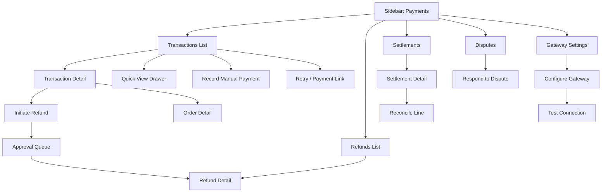
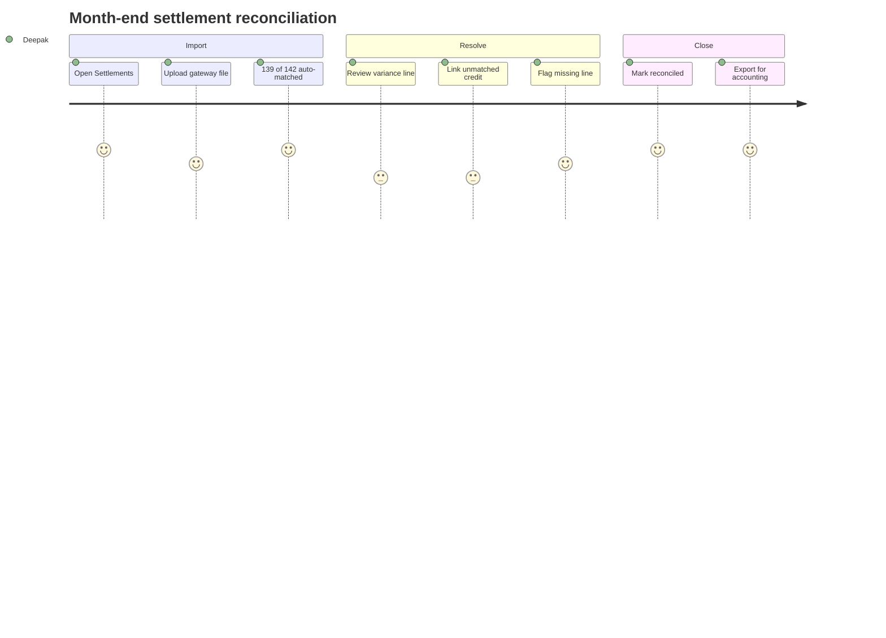
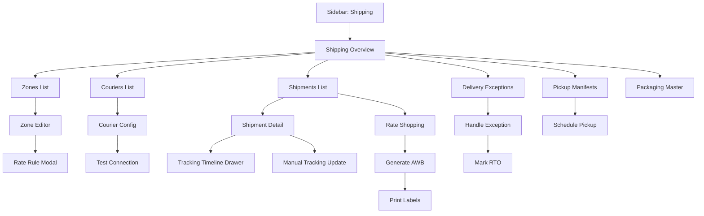
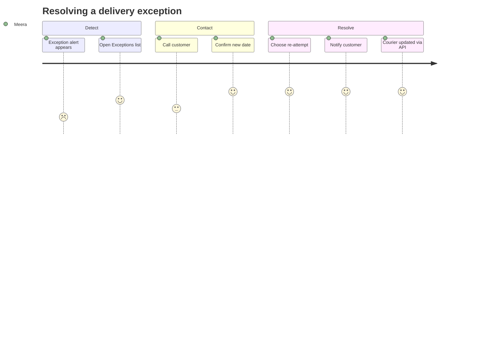

# Modules 07–08 — Payment Management & Shipping

Enterprise Handicraft E-Commerce Platform · UI/UX Design Specification

---
---

# MODULE 07 · PAYMENT MANAGEMENT

## 7.1 Business Goal

Every rupee collected must be traceable from checkout to bank settlement, and every rupee returned must be justified, approved and reconciled. This module protects margin (failed-payment recovery, chargeback defence), protects trust (fast, visible refunds), and makes month-end close a reporting exercise rather than an investigation.

## 7.2 Purpose

Record and monitor all payment transactions across gateways and methods; manage refunds end to end with approval controls; reconcile gateway settlements against orders; and configure payment gateways and methods safely.

## 7.3 Features

| # | Feature |
|---|---------|
| PY-01 | Unified transaction ledger across Razorpay, Stripe, UPI, net banking, cards, wallets and COD |
| PY-02 | Payment status tracking with automatic gateway webhook reconciliation |
| PY-03 | Failed payment list with retry/payment-link recovery |
| PY-04 | Refund initiation (full, partial, item-level) with approval workflow |
| PY-05 | Refund status tracking through to gateway completion |
| PY-06 | Manual/offline payment recording (bank transfer, cash, cheque) |
| PY-07 | COD collection tracking and courier remittance reconciliation |
| PY-08 | Settlement reconciliation: gateway payout vs orders vs fees |
| PY-09 | Chargeback/dispute register with evidence upload and deadlines |
| PY-10 | Payment link generation and sending |
| PY-11 | Gateway configuration with masked secrets, test mode and health checks |
| PY-12 | Payment method availability rules (by amount, PIN code, product type) |
| PY-13 | Transaction fee tracking and net revenue calculation |
| PY-14 | Payment reports and exports for accounting |

## 7.4 Complete Screen List

| ID | Screen | Route | Type |
|----|--------|-------|------|
| SCR-07-01 | Payments / Transactions List | `/admin/payments` | Page |
| SCR-07-02 | Transaction Detail | `/admin/payments/{id}` | Page |
| SCR-07-03 | Refunds List | `/admin/refunds` | Page |
| SCR-07-04 | Refund Detail | `/admin/refunds/{id}` | Page |
| SCR-07-05 | Settlements / Reconciliation | `/admin/payments/settlements` | Page |
| SCR-07-06 | Settlement Detail | `/admin/payments/settlements/{id}` | Page |
| SCR-07-07 | Disputes & Chargebacks | `/admin/payments/disputes` | Page |
| SCR-07-08 | Payment Gateway Settings | `/admin/settings/payment-gateways` | Page |
| MOD-07-01 | Record Manual Payment | — | Modal MD |
| MOD-07-02 | Initiate Refund | — | Modal MD |
| MOD-07-03 | Approve / Reject Refund | — | Modal MD |
| MOD-07-04 | Retry Payment | — | Modal SM |
| MOD-07-05 | Send Payment Link | — | Modal MD |
| MOD-07-06 | Mark COD Collected | — | Modal MD |
| MOD-07-07 | Reconcile Settlement Line | — | Modal MD |
| MOD-07-08 | Upload Settlement File | — | Modal MD |
| MOD-07-09 | Respond to Dispute | — | Modal LG |
| MOD-07-10 | Configure Gateway | — | Modal LG |
| MOD-07-11 | Test Gateway Connection | — | Modal SM |
| MOD-07-12 | Reveal Secret Key | — | Modal SM (re-auth) |
| DRW-07-01 | Transaction Quick View | — | Drawer 480 |
| DRW-07-02 | Advanced Filters | — | Drawer 400 |

## 7.5 Navigation Flow



## 7.6 Screen Hierarchy

```
Payment Management
├── Transactions (SCR-07-01) → Detail (SCR-07-02)
├── Refunds (SCR-07-03) → Detail (SCR-07-04) → Approval
├── Settlements (SCR-07-05) → Detail (SCR-07-06) → Reconcile
├── Disputes (SCR-07-07) → Respond
└── Gateway Settings (SCR-07-08) → Configure / Test / Reveal
```

## 7.7 Desktop Layout

- **Transactions List:** L-01 with status tabs (All / Successful / Pending / Failed / Refunded / Disputed) and a KPI strip above the table (Collected today, Pending, Failed, Refunded, Net after fees).
- **Transaction Detail:** L-02 (8/4) — left: transaction summary, gateway response, related order items, refund history, webhook log; right rail: order card, customer card, amount breakdown (gross, fee, tax on fee, net), actions.
- **Settlements:** L-01 with a summary bar (payout amount, expected, variance) and an expandable per-order reconciliation table.
- **Gateway Settings:** L-03 (9/3) — gateway cards on the left, help/status rail on the right.

## 7.8 Tablet Layout

KPI strip becomes 2×3. Table shows priority columns (Transaction, Order, Amount, Method, Status, Date). Detail rail moves below. Settlement reconciliation table scrolls horizontally with a sticky order column.

## 7.9 Mobile Layout

Transaction cards showing amount (large), method, status chip, order number, customer and time. Filters in a sheet. Detail becomes a stacked page with the amount breakdown first. Refund initiation is available but approval actions are desktop-preferred (allowed on mobile with re-auth). Gateway configuration is read-only on mobile with the message "Configure gateways on a desktop for security."

## 7.10 Wireframe Description

### SCR-07-01 · Transactions List

```
┌──────────────────────────────────────────────────────────────────────────────────────┐
│ Payments                                    [Record Payment] [Export] [Settlements]   │
│ ₹8,42,100 collected today · ₹12,400 pending · 6 failed · ₹4,250 refunded              │
├──────────────────────────────────────────────────────────────────────────────────────┤
│ ┌────────────┬────────────┬────────────┬────────────┬────────────┐                    │
│ │ COLLECTED  │ PENDING    │ FAILED     │ REFUNDED   │ NET (fees) │                    │
│ │ ₹8,42,100  │ ₹12,400    │ 6 · ₹8,900 │ ₹4,250     │ ₹8,20,455  │                    │
│ │ ▲ 12.4%    │ 3 orders   │ ▼ 2 vs yest│ 2 refunds  │ fees ₹17,395│                   │
│ └────────────┴────────────┴────────────┴────────────┴────────────┘                    │
├──────────────────────────────────────────────────────────────────────────────────────┤
│ All │ Successful (1,402) │ Pending (3) │ Failed (6) │ Refunded (24) │ Disputed (1)    │
├──────────────────────────────────────────────────────────────────────────────────────┤
│ [⌕ Txn ID, order #, customer, UTR] [Gateway▾][Method▾][Status▾][Date▾] [+More] [⚙][↻]│
├──────────────────────────────────────────────────────────────────────────────────────┤
│[☐]│ Transaction ID │ Order #        │ Customer   │ Method   │ Amount  │ Fee  │ ● │⋮ │
│───┼────────────────┼────────────────┼────────────┼──────────┼─────────┼──────┼───┼──│
│[☐]│ pay_NxK2mQ8… ⧉│#HC-2026-000482 │ Meera Nair │ UPI      │ ₹4,250  │ ₹42  │ ● │⋮ │
│   │ Razorpay · 10:25 AM                                              │      │Paid│  │
│[☐]│ pay_NxJ9pL2… ⧉│#HC-2026-000481 │ Arjun K.   │ COD      │ ₹1,890  │  —   │ ◐ │⋮ │
│   │ Cash on delivery · pending collection                            │      │Pend│  │
│[☐]│ pay_NxH4tR6… ⧉│#HC-2026-000476 │ Rahul M.   │ Card     │ ₹8,900  │ ₹196 │ ● │⋮ │
│   │ Razorpay · Insufficient funds · 3 attempts                       │      │Fail│  │
├──────────────────────────────────────────────────────────────────────────────────────┤
│ Showing 1–25 of 1,436                                     [25 ▾]  ‹ 1 2 3 … 58 ›      │
└──────────────────────────────────────────────────────────────────────────────────────┘
```

### SCR-07-02 · Transaction Detail

```
┌──────────────────────────────────────────────────┬───────────────────────────────────┐
│ ◀ pay_NxK2mQ8vT3 [● Successful]  [Refund] [⋮]    │ ┌─ Order ─────────────────────┐  │
│   Razorpay · UPI · 03 Aug 2026, 10:25 AM         │ │ #HC-2026-000482             │  │
├──────────────────────────────────────────────────┤ │ 3 items · ₹4,250            │  │
│ ┌─ Amount Breakdown ───────────────────────────┐ │ │ [● Confirmed]               │  │
│ │ Gross amount              ₹4,250.00          │ │ │ [View Order →]              │  │
│ │ Gateway fee (2.0%)          −₹85.00          │ │ └─────────────────────────────┘  │
│ │ GST on fee (18%)            −₹15.30          │ │ ┌─ Customer ──────────────────┐  │
│ │ ────────────────────────────────────         │ │ │ 👤 Meera Nair    [VIP]      │  │
│ │ Net settlement            ₹4,149.70          │ │ │ meera@example.com           │  │
│ │ Expected payout           05 Aug 2026        │ │ │ 18 orders · ₹1,42,800 LTV   │  │
│ └──────────────────────────────────────────────┘ │ │ [View Customer →]           │  │
│ ┌─ Payment Details ────────────────────────────┐ │ └─────────────────────────────┘  │
│ │ Gateway          Razorpay                    │ │ ┌─ Actions ───────────────────┐  │
│ │ Method           UPI (meera@okhdfcbank)      │ │ │ Initiate refund             │  │
│ │ Gateway txn ID   pay_NxK2mQ8vT3         [⧉] │ │ │ Download receipt            │  │
│ │ UTR / RRN        432109876543           [⧉] │ │ │ View in Razorpay ↗          │  │
│ │ Authorised at    03 Aug 2026, 10:25:04       │ │ │ Resend receipt              │  │
│ │ Captured at      03 Aug 2026, 10:25:06       │ │ └─────────────────────────────┘  │
│ │ Settlement       Pending (05 Aug)            │ │                                  │
│ └──────────────────────────────────────────────┘ │                                  │
│ ┌─ Refund History ─────────────────────────────┐ │                                  │
│ │ No refunds for this transaction              │ │                                  │
│ └──────────────────────────────────────────────┘ │                                  │
│ ┌─ Gateway Events ─────────────────────────────┐ │                                  │
│ │ ● payment.authorized   10:25:04              │ │                                  │
│ │ ● payment.captured     10:25:06              │ │                                  │
│ │ ○ payment.settled      pending               │ │                                  │
│ │                            [View raw JSON]   │ │                                  │
│ └──────────────────────────────────────────────┘ │                                  │
└──────────────────────────────────────────────────┴───────────────────────────────────┘
```

### SCR-07-05 · Settlement Reconciliation

```
┌──────────────────────────────────────────────────────────────────────────────────────┐
│ ◀ Settlement RZP-2026-08-05  [⚠ Variance ₹340]     [Upload File] [Mark Reconciled]    │
│   Razorpay · 05 Aug 2026 · 142 transactions                                           │
├──────────────────────────────────────────────────────────────────────────────────────┤
│ Expected ₹6,84,220  │  Received ₹6,83,880  │  Fees ₹13,684  │  Variance −₹340 ⚠      │
├──────────────────────────────────────────────────────────────────────────────────────┤
│ All (142) │ Matched (139) │ Unmatched (2) │ Variance (1) │ Missing (0)                │
├──────────────────────────────────────────────────────────────────────────────────────┤
│ Order #        │ Txn ID      │ Expected │ Received │ Fee   │ Diff  │ Status      │ ⋮ │
│ #HC-2026-000482│ pay_NxK2… │ ₹4,149.70│ ₹4,149.70│ ₹100.30│  ₹0   │ ● Matched   │ ⋮ │
│ #HC-2026-000476│ pay_NxH4… │ ₹8,704.00│ ₹8,364.00│ ₹196.00│ −₹340 │ ⚠ Variance  │ ⋮ │
│ —              │ pay_NxG1… │    —     │ ₹1,240.00│  ₹28.00│ +₹1,240│ ⚠ Unmatched │ ⋮ │
└──────────────────────────────────────────────────────────────────────────────────────┘
```

### SCR-07-08 · Gateway Settings

```
┌──────────────────────────────────────────────────────────────────────────────────────┐
│ Payment Gateways                                              [+ Add Gateway]         │
├──────────────────────────────────────────────────────────────────────────────────────┤
│ ┌─────────────────────────────────┐ ┌─────────────────────────────────┐              │
│ │ [Razorpay logo]     [● Live]    │ │ [Stripe logo]      [○ Disabled] │              │
│ │ UPI · Cards · Net Banking       │ │ International cards             │              │
│ │ Key ID  rzp_live_••••••••4821 👁│ │ Not configured                  │              │
│ │ Webhook ● Healthy · 2 min ago   │ │                                 │              │
│ │ Fee 2.0% + GST                  │ │                                 │              │
│ │ [Test Connection] [Configure]   │ │ [Configure]                     │              │
│ └─────────────────────────────────┘ └─────────────────────────────────┘              │
│ ┌─────────────────────────────────┐ ┌─────────────────────────────────┐              │
│ │ 💵 Cash on Delivery [● Enabled] │ │ 🏦 Bank Transfer   [● Enabled]  │              │
│ │ Max order ₹15,000               │ │ Manual verification             │              │
│ │ Fee ₹49 · 2,140 PIN codes       │ │ Account ••••4821                │              │
│ │ [Configure]                     │ │ [Configure]                     │              │
│ └─────────────────────────────────┘ └─────────────────────────────────┘              │
└──────────────────────────────────────────────────────────────────────────────────────┘
```

## 7.11 Header

| Screen | Title | Subtitle | Actions |
|--------|-------|----------|---------|
| Transactions | "Payments" | "₹{today} collected today · ₹{pending} pending · {n} failed · ₹{refunded} refunded" | Record Payment · Export · Settlements |
| Transaction Detail | "{txn id}" + status chip | "{gateway} · {method} · {date-time}" + record nav | Refund · `⋮` |
| Refunds | "Refunds" | "{n} pending approval · ₹{amount} in progress · ₹{amount} completed this month" | Export · **+ Initiate Refund** |
| Refund Detail | "REF-{number}" + status | "Order #{n} · {customer} · ₹{amount}" | `⋮` · **Approve Refund** |
| Settlements | "Settlements" | "{n} settlements · ₹{amount} received this month · {n} unreconciled" | Upload File · Export |
| Settlement Detail | "{settlement ref}" + variance chip | "{gateway} · {date} · {n} transactions" | Upload File · **Mark Reconciled** |
| Disputes | "Disputes & Chargebacks" | "{n} open · ₹{amount} at risk · {n} due this week" | Export |
| Gateway Settings | "Payment Gateways" | "{n} active · {n} methods available to customers" | **+ Add Gateway** |

## 7.12 Sidebar

`SALES` group: Payments (badge = failed count in danger tone), Refunds (badge = pending approvals). Settlements and Disputes are tabs within Payments. Gateway settings live under ADMINISTRATION → Settings but are cross-linked from here.

## 7.13 Breadcrumb

```
Dashboard / Sales / Payments
Dashboard / Sales / Payments / pay_NxK2mQ8vT3
Dashboard / Sales / Payments / Settlements / RZP-2026-08-05
Dashboard / Sales / Refunds / REF-000412
Dashboard / Sales / Payments / Disputes / DSP-000004
Dashboard / Administration / Settings / Payment Gateways
```

## 7.14 Toolbar

Search (transaction ID, order number, customer name/email/phone, UTR/RRN, payment link ID) · Gateway filter · Method filter · Status filter · Date range · More filters drawer · Saved views (Failed Today, Pending COD, Awaiting Settlement, Refunds Pending Approval, High Value) · Columns · Density · Refresh.

## 7.15 Action Buttons

| Action | Type | Location | Permission | Confirmation |
|--------|------|----------|------------|--------------|
| Record Payment | Secondary | Transactions header | record | Modal |
| Initiate Refund | Primary/danger-adjacent | Transaction & order detail | refund or request | Modal; approval over threshold |
| Approve Refund | Primary | Refund detail / approvals | approve | Modal + re-auth |
| Reject Refund | Outline danger | Refund detail | approve | Modal with reason |
| Retry Payment | Secondary | Failed transaction | edit | Modal |
| Send Payment Link | Secondary | Failed/pending transaction | edit | Modal |
| Mark COD Collected | Primary | COD transaction | record | Modal |
| Download Receipt | Menu | Transaction | view | Immediate |
| Resend Receipt | Menu | Transaction | edit | Toast |
| View in Gateway | Menu (external) | Transaction | view | New tab |
| Upload Settlement File | Secondary | Settlements | reconcile | Modal |
| Reconcile Line | Row action | Settlement detail | reconcile | Modal |
| Mark Reconciled | Primary | Settlement detail | reconcile | Confirm; blocked while variance ≠ 0 unless a reason is given |
| Respond to Dispute | Primary | Dispute detail | dispute | Modal with evidence upload |
| Accept Dispute | Outline danger | Dispute detail | dispute | Guarded confirm |
| Configure Gateway | Primary | Gateway card | configure | Modal + re-auth |
| Test Connection | Secondary | Gateway card | configure | Modal with live result |
| Reveal Secret | Icon | Gateway config | Super Admin | Re-auth modal; audited |
| Enable/Disable Gateway | Toggle | Gateway card | configure | Confirm with impact statement |

## 7.16 Search

Matches transaction ID (exact and partial), order number, customer name/email/phone, UTR/RRN/ARN, refund reference, payment link ID and settlement reference. Exact gateway-ID matches open the transaction directly. Results show a "matched on" badge. Amount search is supported via the filter, not free text, to avoid ambiguity.

## 7.17 Filters

| Filter | Type | Options | Default |
|--------|------|---------|---------|
| Status | Multi-select | Successful, Pending, Failed, Refunded, Partially refunded, Disputed, Cancelled | All |
| Gateway | Multi-select | Razorpay, Stripe, COD, Bank transfer, Manual | All |
| Method | Multi-select | UPI, Card, Net banking, Wallet, EMI, COD, Cash, Cheque, Bank transfer | All |
| Date | Range + presets | — | Last 30 days |
| Amount | Numeric range | — | All |
| Settlement status | Segmented | All / Settled / Pending / Unreconciled | All |
| Refund status | Segmented | All / Has refund / Fully refunded / Partially refunded | All |
| Failure reason | Multi-select | Insufficient funds, Card declined, Authentication failed, Timeout, Cancelled by user, Gateway error | All |
| Customer | Combobox | — | All |
| Card network | Multi-select | Visa, Mastercard, RuPay, Amex | All |
| Bank | Multi-select | — | All |
| Currency | Multi-select | INR + others | All |
| Has dispute | Toggle | — | Off |
| Approval status (refunds) | Segmented | All / Pending / Approved / Rejected | All |
| Requested by (refunds) | Multi-select | Admin users | All |

## 7.18 Sorting

Date (default desc), Amount, Fee, Net, Status (workflow order), Gateway, Customer, Settlement date, Refund age (refunds list: oldest pending first — default in the approvals view), Dispute deadline (soonest first — default in disputes).

## 7.19 Bulk Actions

| Action | Notes |
|--------|-------|
| Export selected | With column and format options |
| Mark COD collected | For a courier remittance batch; asks for the remittance reference and date |
| Retry failed payments | Sends payment links in bulk; per-record results |
| Send payment reminders | Template-based, per-record results |
| Reconcile matched lines | Settlement detail only; bulk-accepts all zero-variance lines |
| Download receipts | Merged PDF |

Refund approval is deliberately **not** a bulk action — each refund must be reviewed individually.

## 7.20 Cards / Tables / Widgets

### 7.20.1 Transactions — Columns

| Key | Label | Width | Align | Sortable | Priority | Cell | Permission |
|-----|-------|-------|-------|----------|----------|------|------------|
| select | — | 48 | centre | no | 1 | Checkbox |  |
| transactionId | Transaction ID | 200 | left | no | 1 | Mono + copy; second line: gateway · time |  |
| orderNumber | Order # | 165 | left | yes | 1 | Mono link |  |
| customer | Customer | 180 | left | yes | 2 | Name + email caption |  |
| method | Method | 130 | left | yes | 1 | Icon + method; second line: instrument (masked) |  |
| amount | Amount | 120 | right | yes | 1 | Currency 600 |  |
| fee | Fee | 90 | right | yes | 3 | Currency | Finance/Admin |
| net | Net | 120 | right | yes | 3 | Currency | Finance/Admin |
| status | Status | 130 | centre | yes | 1 | Status chip; failed shows the reason as a caption |  |
| settlementStatus | Settlement | 130 | centre | yes | 3 | Chip: Settled / Pending / Unreconciled |  |
| refunded | Refunded | 110 | right | yes | 3 | Currency or `—` |  |
| createdAt | Date | 150 | right | yes | 1 | Date-time |  |
| actions | — | 96 | right | no | 1 | View · `⋮` |  |

### 7.20.2 Refunds — Columns

Refund ref · Order # · Customer · Amount · Type (Full/Partial/Item) · Reason · Requested by · Requested at · Approval status · Gateway status · Completed at · Actions.

Rows pending approval beyond 24h show a warning left border and an age chip.

### 7.20.3 Settlement Reconciliation Table

Order # · Transaction ID · Expected net · Received · Fee · Difference (signed, coloured) · Match status (Matched / Variance / Unmatched / Missing) · Actions (Reconcile, Link to order, Mark as fee adjustment).

Sticky summary bar: expected total, received total, fee total, variance with tone.

### 7.20.4 KPI Strip

Collected (period), Pending, Failed (count + value), Refunded, Net after fees, plus optional Dispute exposure. Each is click-through-filtered.

### 7.20.5 Gateway Card

Logo, display name, status chip (Live / Test / Disabled / Error), supported methods, masked key with reveal, webhook health indicator with last-received time, fee structure, transaction volume (30d), and actions.

## 7.21 Forms & Fields

### 7.21.1 Record Manual Payment (MOD-07-01)

| Field | Type | Required | Notes |
|-------|------|----------|-------|
| Order | Combobox | Yes | Searchable; shows balance due |
| Payment method | Select | Yes | Bank transfer, Cash, Cheque, UPI (manual), Store credit, Other |
| Amount | Currency | Yes | Defaults to the balance due; cannot exceed it without an over-payment reason |
| Payment date | Date | Yes | Not future; not in a closed period |
| Reference number | Text | Conditional | UTR for bank transfer, cheque number for cheque |
| Bank / instrument | Text | No | — |
| Proof of payment | File upload | No | Screenshot, receipt, deposit slip |
| Notes | Textarea | No | — |
| Mark order as paid | Switch | No | Default on when the amount clears the balance |
| Notify customer | Switch | No | Default on |

### 7.21.2 Initiate Refund (MOD-07-02)

| Field | Type | Required | Notes |
|-------|------|----------|-------|
| Refund type | Radio cards | Yes | Full refund / Partial amount / Specific items |
| Items | Checklist with quantities | Conditional | Shows per-item refundable amount |
| Refund amount | Currency | Yes | Max indicator: "Up to ₹4,250 (₹0 already refunded)" |
| Include shipping | Switch | No | Default per store policy; shows the amount |
| Restocking fee | Currency/% | No | Admin+; deducted with an explanation shown to the customer |
| Refund method | Select | Yes | Original method (default) / Bank transfer / Store credit / Reward points |
| Bank details | Address-style block | Conditional | For bank transfers; account, IFSC, name |
| Reason | Select | Yes | Item returned, Damaged, Wrong item, Cancelled order, Price adjustment, Goodwill, Duplicate payment, Failed delivery, Other |
| Reason detail | Textarea | Conditional | Required for Goodwill, Other and any amount over ₹5,000; min 15 chars |
| Restock items | Switch | Conditional | When item-level |
| Notify customer | Switch | No | Default on with a template preview |
| Internal note | Textarea | No | — |

Live summary panel: refund amount, method, expected time to reflect ("5–7 business days for UPI"), remaining refundable balance, and an approval notice when over threshold.

### 7.21.3 Gateway Configuration (MOD-07-10)

| Field | Type | Required | Notes |
|-------|------|----------|-------|
| Gateway | Read-only | — | — |
| Mode | Segmented | Yes | Test / Live — switching to Live requires confirmation |
| Key ID / Publishable key | Text | Yes | Shown masked once saved |
| Secret key | Password | Yes | Write-only; reveal requires re-auth and is audited |
| Webhook URL | Read-only + copy | — | Generated; with a "Regenerate secret" action |
| Webhook secret | Password | Yes | — |
| Enabled methods | Checkbox group | Yes | UPI, Cards, Net banking, Wallets, EMI, Pay later |
| Minimum order amount | Currency | No | — |
| Maximum order amount | Currency | No | — |
| Fee structure | Read-only/text | No | For net calculation display |
| Auto-capture | Switch | Yes | Default on |
| Refund window (days) | Number | No | — |
| Display name (checkout) | Text | No | — |
| Display order | Number | No | — |
| Enabled | Switch | Yes | Disabling shows the impact ("UPI, Cards and Net Banking will disappear from checkout") |

### 7.21.4 COD Configuration

Enabled, max order amount, COD fee (flat/%), serviceable PIN codes (bulk paste/upload with validation), excluded categories, advance payment percentage option, verification required (OTP call), auto-cancel after N failed verification attempts.

### 7.21.5 Dispute Response (MOD-07-09)

Dispute reason (read-only from gateway), amount, deadline countdown, evidence checklist (order confirmation, delivery proof, tracking, customer communication, refund policy, product description, signed POD), file uploads per item, narrative textarea (min 100 chars), and an "Accept dispute" alternative with its financial consequence stated.

## 7.22 Validation Rules

| Field | Rule | Message |
|-------|------|---------|
| Manual payment · order | Required | "Select an order." |
| Manual payment · amount | >0, ≤ balance (unless over-payment allowed) | "Amount must be greater than 0." / "This exceeds the balance due of ₹1,890. Record an over-payment?" |
| Payment date | Not future | "Payment date can't be in the future." |
| Payment date | Not in a closed period | "This accounting period was closed on {date}." |
| Reference number | Required for bank/cheque | "Enter the transaction reference." |
| Reference number | Unique | "This reference has already been recorded on order #{n}." |
| Refund amount | >0 | "Refund amount must be greater than 0." |
| Refund amount | ≤ paid − already refunded | "You can refund up to ₹4,250." |
| Refund amount | Not exceeding item value when item-level | "Refund exceeds the value of the selected items." |
| Refund reason | Required | "Select a reason for this refund." |
| Refund reason detail | Required over ₹5,000 / Goodwill / Other | "Explain this refund in at least 15 characters." |
| Refund approval | Over ₹10,000 | "Refunds over ₹10,000 need approval from Finance." |
| Refund method | Original unavailable | "The original payment method can't be refunded after 180 days. Choose bank transfer or store credit." |
| Bank details | IFSC format `^[A-Z]{4}0[A-Z0-9]{6}$` | "Enter a valid IFSC code." |
| Bank details | Account number 9–18 digits | "Enter a valid account number." |
| COD collection | Amount matches order total | "Collected amount doesn't match the order total of ₹1,890. Record a short collection?" |
| Settlement variance | Must be 0 or explained | "There's a variance of ₹340. Add an explanation before reconciling." |
| Settlement file | Correct gateway format | "This file doesn't match Razorpay's settlement format." |
| Gateway keys | Non-empty, format per gateway | "Enter a valid Razorpay key ID (starts with rzp_)." |
| Gateway live mode | Test transaction required | "Run a test transaction before switching to Live mode." |
| Gateway disable | Not the last enabled method | "This is your only payment method. Enable another before disabling this one." |
| COD PIN codes | Valid 6-digit list | "{n} of {m} PIN codes are invalid: {examples}" |
| Dispute response | Before deadline | "The response deadline passed on {date}." |
| Dispute evidence | ≥1 file | "Attach at least one piece of evidence." |
| Dispute narrative | ≥100 chars | "Explain your case in at least 100 characters." |

## 7.23 Dropdowns & Data Sources

| Dropdown | Source |
|----------|--------|
| Gateway | `GET /api/payment-gateways` |
| Payment method | `GET /api/payment-methods?gateway=` |
| Refund reason | `GET /api/settings/reason-codes?type=refund` |
| Refund method | Derived from the original payment + policy rules |
| Order (manual payment) | `GET /api/orders?search=&hasBalance=true` |
| Customer | `GET /api/customers?search=` |
| Settlement file format | Static per gateway |
| Dispute reason | From the gateway payload (read-only) |
| Bank list | `GET /api/banks` |
| Currency | `GET /api/settings/currencies` |

## 7.24 Icons

Payments `credit-card` · UPI `smartphone-nfc` · Card `credit-card` · Net banking `landmark` · Wallet `wallet` · COD `banknote` · Cheque `scroll` · Bank transfer `building-2` · Refund `banknote-arrow-down` · Settlement `arrow-down-to-line` · Reconcile `git-compare-arrows` · Dispute `gavel` · Chargeback `shield-alert` · Gateway `plug` · Webhook `webhook` · Test mode `flask-conical` · Live `circle-check` · Retry `refresh-cw` · Payment link `link` · Receipt `receipt-indian-rupee` · Fee `percent` · Net `equal` · Reveal `eye` · Approval `check-check`.

## 7.25 Pagination

Transactions 25/page (options to 200); Refunds 25/page; Settlements 25/page with the detail table showing all lines virtualised; Disputes 25/page; Gateway events 20 with "Load more". Financial exports over 10,000 rows are queued and emailed.

## 7.26 Notifications & Toasts

| Trigger | Type | Message | Action |
|---------|------|---------|--------|
| Payment received (realtime) | Success | "Payment received: ₹{amount} for #{order}" | View |
| Payment failed (realtime) | Error | "Payment failed for #{order}: {reason}" | Retry · Send Link |
| Manual payment recorded | Success | "Payment of ₹{amount} recorded" | View Order |
| Refund initiated | Success | "Refund of ₹{amount} initiated" | View Refund |
| Refund needs approval | Info | "Refund sent to Finance for approval" | View Request |
| Refund approved | Success | "Refund approved and sent to {gateway}" | — |
| Refund rejected | Warning | "Refund rejected: {reason}" | View |
| Refund completed | Success | "Refund of ₹{amount} completed" | — |
| Refund failed | Error | "Refund failed: {gateway reason}" | Retry · Record Manual Refund |
| Payment link sent | Success | "Payment link sent to {customer}" | Copy Link |
| COD collected | Success | "COD of ₹{amount} marked as collected" | — |
| COD short collection | Warning | "Collected ₹{a} of ₹{b}. A shortfall record was created." | Review |
| Settlement received | Info | "Settlement {ref} received: ₹{amount}" | Reconcile |
| Settlement variance | Warning | "Settlement {ref} has a variance of ₹{amount}" | Review |
| Settlement reconciled | Success | "Settlement {ref} reconciled" | — |
| Dispute opened | Error (critical) | "Chargeback opened on #{order} · ₹{amount} · respond by {date}" | Respond |
| Dispute deadline near | Warning | "{n} disputes need a response within 48 hours" | View |
| Dispute won/lost | Success/Error | "Dispute {ref} {won/lost}" | View |
| Gateway offline | Critical banner | "{Gateway} is not responding. Customers can't pay by {methods}." | Check Status |
| Gateway restored | Success | "{Gateway} is back online" | — |
| Webhook failure | Warning | "{n} webhook events failed to process" | View Log |
| Secret revealed | Info | "Secret key revealed — this action was logged" | — |
| Test connection success | Success | "Connection successful. Test payment of ₹1 completed." | — |
| Test connection failed | Error | "Connection failed: {reason}" | View Details |

## 7.27 Dialogs

| Dialog | Type | Title | Content | Buttons |
|--------|------|-------|---------|---------|
| MOD-07-02 Initiate Refund | Form | "Refund payment" | Per §7.21.2 with a live summary panel and approval notice | Cancel · Initiate Refund |
| MOD-07-03 Approve Refund | Form + re-auth | "Approve refund of ₹{amount}?" | Full context: order, customer, items, reason, requester, refund history for this customer, gateway balance check. Reject requires a reason. | Reject · Approve Refund |
| MOD-07-04 Retry Payment | Confirm | "Retry this payment?" | Previous failure reason, attempt count, "The customer will be asked to pay again." | Cancel · Retry |
| MOD-07-05 Payment Link | Form | "Send a payment link" | Amount, expiry (24h/48h/7d), channels (Email/SMS/WhatsApp), message, link preview with copy | Cancel · Send Link |
| MOD-07-06 COD Collected | Form | "Mark COD as collected" | Expected amount, collected amount, collection date, courier remittance reference, shortfall handling | Cancel · Mark Collected |
| MOD-07-07 Reconcile Line | Form | "Reconcile transaction" | Expected vs received, difference, resolution select (Fee adjustment / Partial settlement / Gateway error / Manual match to order), note | Cancel · Reconcile |
| MOD-07-09 Dispute Response | Form (large) | "Respond to dispute {ref}" | Deadline countdown, dispute reason, evidence checklist with uploads, narrative, preview of the submission | Save Draft · Cancel · Submit Response |
| MOD-07-10 Configure Gateway | Form + re-auth | "Configure {gateway}" | Per §7.21.3; live-mode switch requires a successful test | Cancel · Save Configuration |
| MOD-07-12 Reveal Secret | Re-auth | "Confirm your password" | "Revealing this key is recorded in the audit log." Password field only. | Cancel · Reveal Key |
| Disable gateway | Warning | "Disable {gateway}?" | "Customers will no longer see UPI, Cards and Net Banking at checkout. {n} orders used this method in the last 7 days." | Cancel · Disable Gateway |
| Accept dispute | Guarded destructive | "Accept this chargeback?" | "You will lose ₹{amount} plus a ₹{fee} chargeback fee. This can't be reversed." Typed confirm. | Cancel · Accept Chargeback |
| Refund success | Success dialog | "Refund initiated" | Amount, method, expected timeline, reference | View Refund · Done |

## 7.28 Permission Matrix (Module 07)

| Action | Super Admin | Admin | Product | Inventory | Order | Marketing | Finance | Support | Content |
|--------|:-----------:|:-----:|:-------:|:---------:|:-----:|:---------:|:-------:|:-------:|:-------:|
| View transactions | ✔ | ✔ | ✖ | ✖ | ✔ | ✖ | ✔ | ✔ | ✖ |
| View fees / net | ✔ | ✔ | ✖ | ✖ | ✖ | ✖ | ✔ | ✖ | ✖ |
| Record manual payment | ✔ | ✔ | ✖ | ✖ | ✔ | ✖ | ✔ | ✖ | ✖ |
| Initiate refund | ✔ | ✔ | ✖ | ✖ | request | ✖ | ✔ | request | ✖ |
| Approve refund | ✔ | ✔ | ✖ | ✖ | ✖ | ✖ | ✔ | ✖ | ✖ |
| Retry payment / send link | ✔ | ✔ | ✖ | ✖ | ✔ | ✖ | ✔ | ✔ | ✖ |
| Mark COD collected | ✔ | ✔ | ✖ | ✖ | ✔ | ✖ | ✔ | ✖ | ✖ |
| Reconcile settlements | ✔ | ✔ | ✖ | ✖ | ✖ | ✖ | ✔ | ✖ | ✖ |
| Respond to disputes | ✔ | ✔ | ✖ | ✖ | ✖ | ✖ | ✔ | ✖ | ✖ |
| Accept chargeback | ✔ | ✔ | ✖ | ✖ | ✖ | ✖ | ✔ | ✖ | ✖ |
| Configure gateways | ✔ | ✔ (no secret reveal) | ✖ | ✖ | ✖ | ✖ | view | ✖ | ✖ |
| Reveal gateway secrets | ✔ | ✖ | ✖ | ✖ | ✖ | ✖ | ✖ | ✖ | ✖ |
| Export payments | ✔ | ✔ | ✖ | ✖ | ✔ | ✖ | ✔ | ✖ | ✖ |

## 7.29 User Journey

**Deepak's month-end close.** On the 1st, Deepak opens Settlements, uploads Razorpay's settlement CSV for the month, and the system auto-matches 139 of 142 lines. Three exceptions remain: one variance of ₹340 (a partial refund settled separately), one unmatched credit (a payment link paid outside an order), and one missing line. He reconciles the variance with the resolution "Partial settlement", links the unmatched credit to the correct order, and flags the missing line for gateway follow-up. He then exports the reconciled ledger to XLSX for the accountant. Everything he touched is audit-logged with his name and reason.



**Meera's refund request.** A customer reports a damaged item worth ₹1,349. Meera has request-only rights, so "Initiate Refund" creates a request routed to Finance. Deepak sees it in Approvals with the full context — order, photos from the return, the customer's refund history (1 previous in 18 orders) — and approves. The gateway processes it; the customer gets an automatic notification; the order timeline and the customer's profile both reflect the refund.

## 7.30 UX Guidelines

| ID | Guideline |
|----|-----------|
| PY-G01 | Never show a net amount without showing gross and fee — finance users must see the arithmetic |
| PY-G02 | Every refund states, before confirmation, the exact amount, method and expected time to reflect |
| PY-G03 | Secrets are write-only by default; revealing is a deliberate, audited, re-authenticated action |
| PY-G04 | Gateway outages are surfaced as a critical global banner, not a quiet chip — they stop revenue |
| PY-G05 | Refund approval is never bulk — every approval is an individual decision with full context |
| PY-G06 | Reconciliation variance must be explained, never silently accepted |
| PY-G07 | Dispute deadlines are shown as countdowns, and dispute notifications escalate as the deadline nears |
| PY-G08 | Manual payments require a reference — untraceable money entries are prohibited by the form |
| PY-G09 | Transaction identifiers are always copyable in one click |
| PY-G10 | COD is a first-class method throughout, not an afterthought — it dominates Indian handicraft orders |

## 7.31 Accessibility

- Amount breakdowns are description lists with programmatic label/value association, not visual columns only.
- Signed variances announce "minus three hundred and forty rupees", never relying on colour or a symbol.
- Countdown timers for dispute deadlines update politely at most once per minute and expose the absolute deadline in their accessible name.
- Masked values announce "hidden, activate to reveal; this action is logged".
- Status chips carry text; failure reasons are in the accessible name, not only a tooltip.
- Re-authentication modals move focus to the password field and announce why re-auth is required.
- Settlement tables use row and column headers with a caption summarising totals and variance.
- Gateway health indicators pair colour with text ("Healthy · last event 2 minutes ago").

## 7.32 Micro-interactions

| Interaction | Behaviour |
|-------------|-----------|
| Copy transaction ID | Icon morphs to a check for 1.5s + toast |
| Refund amount entry | Max indicator bar fills; exceeding max shakes the field and disables the submit |
| Refund summary | Method/timeline text cross-fades as options change |
| Approval decision | Approve button shows a spinner → check; the row cross-fades to the approved state and leaves the pending list with a collapse |
| Reveal secret | Value cross-fades from dots to text with a persistent "revealed" eye icon and a countdown to auto-hide after 30s |
| Test connection | Inline stepper animates: Connecting → Authenticating → Test payment → Success/Failure |
| Webhook health | Pulsing dot when events arrive; turns amber after 15 minutes of silence |
| Settlement auto-match | Rows resolve one by one with a brief success tint (staggered 20ms) |
| Variance resolution | Line's difference cell animates to ₹0 and the summary bar variance decrements |
| Payment received (live) | Row slides in with a success tint; the Collected KPI value rolls up |
| Dispute deadline <48h | The countdown chip pulses once per page load |

## 7.33 Loading / Empty / Error States

| Surface | Loading | Empty | Error |
|---------|---------|-------|-------|
| Transactions | KPI + table skeleton | "No payments yet — payment records appear after your first order." | "Couldn't load payments" + Retry |
| Transaction detail | Card skeletons | — | Retry + Back |
| Refunds | Table skeleton | "No refunds — nothing has been refunded yet." | Retry |
| Approvals | List skeleton | "No refunds waiting for approval 🎉" | Retry |
| Settlements | Table skeleton | "No settlements yet — they appear after your gateway pays out." | Retry |
| Settlement detail | Table skeleton + summary skeleton | "No transactions in this settlement" | Retry |
| Disputes | Table skeleton | "No disputes — good news." (success-toned) | Retry |
| Gateways | Card skeletons | "No payment gateways configured — customers can't pay yet." + Add Gateway (danger-toned empty state) | Retry |
| Gateway events | List skeleton | "No events received yet" | Retry |
| Gateway down | — | Global critical banner + inline card error state | Check Status · Retry |
| No permission | — | Lock + "You don't have access to Payments" | Request Access |

## 7.34 API & Database Dependencies

| Method | Endpoint |
|--------|----------|
| GET | `/api/payments?search&status&gateway&method&date&amount&page&size&sort` |
| GET | `/api/payments/summary?from&to` |
| GET | `/api/payments/{id}` · `/events` |
| POST | `/api/payments/manual` |
| POST | `/api/payments/{id}/retry` · `/payment-link` · `/receipt/resend` |
| POST | `/api/payments/{id}/cod-collected` |
| GET/POST | `/api/refunds` · `/api/refunds/{id}` |
| POST | `/api/refunds/{id}/approve` · `/reject` · `/retry` |
| GET | `/api/settlements` · `/api/settlements/{id}` |
| POST | `/api/settlements/upload` · `/api/settlements/{id}/reconcile` · `/{id}/lines/{lineId}/resolve` |
| GET | `/api/disputes` · `/api/disputes/{id}` |
| POST | `/api/disputes/{id}/respond` · `/accept` |
| GET/PUT | `/api/payment-gateways` · `/api/payment-gateways/{code}` |
| POST | `/api/payment-gateways/{code}/test` · `/reveal-secret` (re-auth) · `/rotate-webhook-secret` |
| POST | `/webhooks/payments/{gateway}` (inbound) |
| POST | `/api/payments/export` |
| WS | `/hub/payments` |

**Entities:** `Payments`, `PaymentEvents`, `PaymentMethods`, `PaymentGateways`, `GatewayCredentials` (encrypted), `Refunds`, `RefundApprovals`, `Settlements`, `SettlementLines`, `Disputes`, `DisputeEvidence`, `PaymentLinks`, `CodCollections`, `Orders`, `Customers`, `AuditLog`.

**Critical notes:**
1. Gateway secrets are encrypted at rest and never returned by list endpoints; reveal is a separate audited endpoint requiring re-authentication.
2. Webhooks are the source of truth for payment state; the UI must reflect webhook-driven changes in real time and never assume success from a client action.
3. All money values are stored in the smallest currency unit (paise) as integers; the UI formats but never computes authoritative totals.
4. Refunds are idempotent by request key to prevent double refunds on retry.
5. Settlement matching runs server-side with configurable tolerance; unmatched lines require manual resolution before a settlement can be marked reconciled.
6. Closed accounting periods block new payment/refund records with a dated message.

## 7.35 Figma Build Notes

**New components:** `CMP-PAY-KpiStrip`, `CMP-PAY-TransactionRow` (method icon + masked instrument), `CMP-PAY-AmountBreakdown` (gross/fee/tax/net), `CMP-PAY-MethodBadge` (10 methods with brand logos), `CMP-PAY-GatewayCard` (Live/Test/Disabled/Error), `CMP-PAY-WebhookHealth`, `CMP-PAY-MaskedSecret` (masked/revealed/countdown), `CMP-PAY-RefundAmountField` (max indicator), `CMP-PAY-SettlementLine` (matched/variance/unmatched/missing), `CMP-PAY-VarianceSummary`, `CMP-PAY-DisputeCountdown`, `CMP-PAY-ApprovalCard`, `CMP-PAY-EventTimeline`.

**Auto layout — Transaction Detail:** V stack → PageHeader → H stack (Main Fill: AmountBreakdown card, PaymentDetails card, RefundHistory card, GatewayEvents card | Rail 360: Order card, Customer card, Actions card).

**Variants:** TransactionRow — Status (7) × Method (10) × Settlement (3) × State (4). GatewayCard — Gateway (5) × Status (4). SettlementLine — Match status (4) × Resolved (Y/N).

**Prototype:** Payments → failed transaction → Send Payment Link → toast → Transaction detail → Initiate Refund → approval routing → Approvals → Approve (re-auth) → success → Settlements → upload file → auto-match animation → resolve variance → Mark Reconciled.

**Dev notes:** never render an amount the client computed as authoritative; show the fee/net columns only when the role permits; the reveal-secret flow must auto-hide after 30 seconds and re-mask on navigation; dispute deadlines must be computed server-side in the store timezone.

**Future scalability:** multi-currency settlement, split payments to artisans (marketplace payouts), EMI and BNPL method support, automated dunning for failed subscriptions, tokenised card vault management, and reconciliation against bank statements in addition to gateway files.

---
---

# MODULE 08 · SHIPPING

## 8.1 Business Goal

Shipping cost and speed decide both conversion and margin. For fragile, low-volume handicraft, the right courier per lane matters more than a single flat rate. This module must let the business define exactly where it ships and what it charges, integrate couriers for label and tracking automation, and give customers accurate delivery promises.

## 8.2 Purpose

Define shipping zones and rates; configure and monitor courier integrations; generate AWBs and labels; track shipments to delivery; manage delivery exceptions and RTO; and expose serviceability and delivery estimates to checkout.

## 8.3 Features

| # | Feature |
|---|---------|
| SH-01 | Shipping zones by country/state/PIN ranges with priority ordering |
| SH-02 | Rate rules per zone: flat, weight-based, price-based, item-count, free-above-threshold |
| SH-03 | Per-category and per-product shipping overrides (fragile surcharge, oversize) |
| SH-04 | Free shipping rules with conditions and promotional windows |
| SH-05 | COD availability and fee by zone |
| SH-06 | Courier integrations (Bluedart, Delhivery, DTDC, India Post, Shiprocket aggregator) |
| SH-07 | Automatic AWB generation and label printing |
| SH-08 | Rate shopping: compare courier rates/ETA at dispatch |
| SH-09 | Tracking number capture with webhook status sync |
| SH-10 | Shipment tracking timeline visible to admin and customer |
| SH-11 | Delivery exception handling (failed attempts, NDR, RTO) |
| SH-12 | Pickup scheduling and manifest generation |
| SH-13 | Serviceability check by PIN code with delivery estimate |
| SH-14 | Shipping performance reporting by courier and lane |
| SH-15 | Packaging/box master with dimensional weight calculation |

## 8.4 Complete Screen List

| ID | Screen | Route | Type |
|----|--------|-------|------|
| SCR-08-01 | Shipping Overview / Dashboard | `/admin/shipping` | Page |
| SCR-08-02 | Shipping Zones List | `/admin/shipping/zones` | Page |
| SCR-08-03 | Zone Create/Edit (with rates) | `/admin/shipping/zones/{id}` | Page |
| SCR-08-04 | Couriers List | `/admin/shipping/couriers` | Page |
| SCR-08-05 | Courier Configuration | `/admin/shipping/couriers/{code}` | Page |
| SCR-08-06 | Shipments List / Tracking | `/admin/shipping/shipments` | Page |
| SCR-08-07 | Shipment Detail / Tracking Timeline | `/admin/shipping/shipments/{id}` | Page |
| SCR-08-08 | Delivery Exceptions (NDR) | `/admin/shipping/exceptions` | Page |
| SCR-08-09 | Pickup Manifests | `/admin/shipping/manifests` | Page |
| SCR-08-10 | Packaging / Box Master | `/admin/shipping/packaging` | Page |
| MOD-08-01 | Add / Edit Zone | — | Modal LG |
| MOD-08-02 | Add / Edit Rate Rule | — | Modal MD |
| MOD-08-03 | Delete Zone / Rate | — | Modal SM (guarded) |
| MOD-08-04 | Configure Courier | — | Modal LG |
| MOD-08-05 | Test Courier Connection | — | Modal SM |
| MOD-08-06 | Rate Shopping / Compare | — | Modal LG |
| MOD-08-07 | Generate AWB | — | Modal MD |
| MOD-08-08 | Print Labels | — | Modal MD |
| MOD-08-09 | Schedule Pickup | — | Modal MD |
| MOD-08-10 | Update Tracking Manually | — | Modal SM |
| MOD-08-11 | Handle Delivery Exception | — | Modal MD |
| MOD-08-12 | Mark RTO Received | — | Modal MD |
| MOD-08-13 | PIN Serviceability Check | — | Modal SM |
| MOD-08-14 | Import PIN Codes | — | Modal MD |
| MOD-08-15 | Add / Edit Box Type | — | Modal SM |
| DRW-08-01 | Shipment Quick View | — | Drawer 480 |
| DRW-08-02 | Tracking Timeline | — | Drawer 480 |

## 8.5 Navigation Flow



## 8.6 Screen Hierarchy

```
Shipping
├── Overview (SCR-08-01) — KPIs, courier performance, exceptions summary
├── Zones (SCR-08-02) → Zone Editor with rate rules (SCR-08-03)
├── Couriers (SCR-08-04) → Configuration (SCR-08-05)
├── Shipments (SCR-08-06) → Detail + Tracking (SCR-08-07)
├── Exceptions / NDR (SCR-08-08)
├── Manifests (SCR-08-09)
└── Packaging (SCR-08-10)
```

## 8.7 Desktop Layout

- **Overview:** L-07 widget grid — KPIs (shipments today, in transit, delivered, exceptions, avg delivery days, shipping cost vs collected), courier performance table, exception list, zone coverage map placeholder.
- **Zones:** L-01 list with an expandable rate table per zone; drag to reorder priority.
- **Zone Editor:** L-02 (8/4) — left: zone definition (regions, PIN ranges) + rate rules table; right: summary (orders served, average cost), test calculator.
- **Shipments:** L-01 with status tabs (All / Ready / In Transit / Out for Delivery / Delivered / Exception / RTO).
- **Shipment Detail:** L-02 — left: tracking timeline, package contents, courier events; right: order card, address, courier card, cost breakdown.

## 8.8 Tablet Layout

Zone rate tables scroll horizontally. Courier cards go 2-up. Shipment list shows priority columns. The tracking timeline stays full-width and readable.

## 8.9 Mobile Layout

Shipment cards with AWB, courier, status chip and last event. Tracking timeline is a vertical list optimised for narrow width. Zone and rate configuration is read-only on mobile with "Edit on a larger screen". Label printing offers email/PDF instead of direct print.

## 8.10 Wireframe Description

### SCR-08-03 · Zone Editor with Rates

```
┌──────────────────────────────────────────────────┬───────────────────────────────────┐
│ ◀ Zone: South India                    [Save]    │ ┌─ Zone Summary ──────────────┐  │
├──────────────────────────────────────────────────┤ │ Orders (30d)        482      │  │
│ ┌─ Zone Definition ────────────────────────────┐ │ │ Avg shipping cost   ₹94     │  │
│ │ Zone name *      [South India             ]  │ │ │ Avg collected       ₹99     │  │
│ │ Priority         [2 ▾] (checked after Metro) │ │ │ Margin              +₹5     │  │
│ │ Countries        [India ×]                   │ │ │ Avg delivery      3.2 days  │  │
│ │ States           [Karnataka ×][Tamil Nadu ×] │ │ └─────────────────────────────┘  │
│ │                  [Kerala ×][Telangana ×][+]  │ │ ┌─ Rate Calculator ───────────┐  │
│ │ PIN ranges       [560001–560110         ]    │ │ │ Test a shipment:            │  │
│ │                  [+ Add range] [Import CSV]  │ │ │ PIN    [560038          ]   │  │
│ │ Exclusions       [+ Add excluded PIN]        │ │ │ Weight [1.850       ] kg    │  │
│ │ ☑ COD available   COD fee [₹49        ]      │ │ │ Value  [4,250       ]       │  │
│ └──────────────────────────────────────────────┘ │ │ ────────────────────────    │  │
│ ┌─ Rate Rules ─────────────────── [+ Add Rule] ┐ │ │ Rate: ₹99 (Standard)        │  │
│ │ ⠿ 1  Free shipping above ₹2,000       ₹0   ⋮ │ │ │ ETA: 3–4 days               │  │
│ │ ⠿ 2  Standard · 0–1 kg               ₹79   ⋮ │ │ │ COD: Available (+₹49)       │  │
│ │ ⠿ 3  Standard · 1–3 kg               ₹99   ⋮ │ │ │        [Recalculate]        │  │
│ │ ⠿ 4  Standard · 3–5 kg              ₹149   ⋮ │ │ └─────────────────────────────┘  │
│ │ ⠿ 5  Express · any weight       ₹99 + ₹40/kg⋮│ │                                  │
│ │ ⠿ 6  Fragile surcharge               +₹49  ⋮ │ │                                  │
│ │ First matching rule wins (top to bottom)     │ │                                  │
│ └──────────────────────────────────────────────┘ │                                  │
└──────────────────────────────────────────────────┴───────────────────────────────────┘
```

### SCR-08-07 · Shipment Detail / Tracking

```
┌──────────────────────────────────────────────────┬───────────────────────────────────┐
│ ◀ BD1234567890  [● Out for Delivery]  [⋮]        │ ┌─ Order ─────────────────────┐  │
│   Bluedart Express · Order #HC-2026-000480       │ │ #HC-2026-000480             │  │
├──────────────────────────────────────────────────┤ │ 5 items · ₹12,400           │  │
│ ┌─ Tracking Timeline ──────────────────────────┐ │ │ [View Order →]              │  │
│ │ ●  Out for delivery        04 Aug, 08:12 AM  │ │ └─────────────────────────────┘  │
│ │ │  Bengaluru Hub · Rider: Suresh K.          │ │ ┌─ Deliver To ────────────────┐  │
│ │ ●  Reached destination hub 04 Aug, 06:40 AM  │ │ │ Nisha Patel                 │  │
│ │ │  Bengaluru Hub                             │ │ │ 88, Sea Breeze, Bandra W    │  │
│ │ ●  In transit              03 Aug, 22:15 PM  │ │ │ Mumbai, MH 400050           │  │
│ │ │  Departed Jaipur Hub                       │ │ │ 📞 +91 98765 22222          │  │
│ │ ●  Picked up               03 Aug, 17:30 PM  │ │ └─────────────────────────────┘  │
│ │ │  Jaipur · Manifest MF-0042                 │ │ ┌─ Courier ───────────────────┐  │
│ │ ●  Label generated         03 Aug, 16:02 PM  │ │ │ [Bluedart logo]             │  │
│ │    by Karan M.                               │ │ │ Express · Prepaid           │  │
│ │ ○  Delivered               Expected 04 Aug   │ │ │ AWB BD1234567890      [⧉]   │  │
│ │                       [Refresh from courier] │ │ │ [Track on Bluedart ↗]       │  │
│ └──────────────────────────────────────────────┘ │ └─────────────────────────────┘  │
│ ┌─ Package ────────────────────────────────────┐ │ ┌─ Cost ──────────────────────┐  │
│ │ Box       Medium (30×20×15 cm)               │ │ │ Charged to customer  ₹99    │  │
│ │ Weight    1.850 kg (dim. weight 1.800 kg)    │ │ │ Courier cost         ₹112   │  │
│ │ Contents  5 items · ⚠ Fragile · 🎁 Gift      │ │ │ Margin              −₹13 ⚠  │  │
│ │ [View packing slip] [Reprint label]          │ │ └─────────────────────────────┘  │
│ └──────────────────────────────────────────────┘ │                                  │
└──────────────────────────────────────────────────┴───────────────────────────────────┘
```

### SCR-08-08 · Delivery Exceptions (NDR)

```
┌──────────────────────────────────────────────────────────────────────────────────────┐
│ Delivery Exceptions                       12 open · 4 need action today               │
├──────────────────────────────────────────────────────────────────────────────────────┤
│ All (12) │ Customer unavailable (5) │ Address issue (3) │ Refused (2) │ Damaged (2)   │
├──────────────────────────────────────────────────────────────────────────────────────┤
│ AWB          │ Order #        │ Customer  │ Reason           │Attempts│ Age │ Action  │
│ BD1234567891 │#HC-2026-000471 │ Rahul M.  │ Customer unavail.│  2 of 3│ 2d  │[Resolve]│
│ DL9876543210 │#HC-2026-000465 │ Sara T.   │ Incomplete address│ 1 of 3│ 1d  │[Resolve]│
│ BD1234567888 │#HC-2026-000452 │ Amit S.   │ Refused delivery │  1 of 1│ 3d  │[Resolve]│
└──────────────────────────────────────────────────────────────────────────────────────┘
```

## 8.11 Header

| Screen | Title | Subtitle | Actions |
|--------|-------|----------|---------|
| Overview | "Shipping" | "{n} shipments today · {n} in transit · {n} exceptions · avg {n} days to deliver" | Schedule Pickup · **+ Add Zone** |
| Zones | "Shipping Zones" | "{n} zones · {n} PIN codes covered · {n} rate rules" | Import PINs · **+ Add Zone** |
| Zone Editor | "Zone: {name}" | "{n} states · {n} PIN ranges · {n} orders in 30 days" | Delete · **Save Zone** |
| Couriers | "Couriers" | "{n} active · {n} integrated" | **+ Add Courier** |
| Courier Config | "{Courier name}" + status | "{n} shipments in 30 days · {n}% on-time" | Test Connection · **Save** |
| Shipments | "Shipments" | "{n} in transit · {n} out for delivery · {n} exceptions" | Print Labels · Manifest · Export |
| Shipment Detail | "{AWB}" + status chip | "{courier} {service} · Order #{n}" | `⋮` · Refresh Tracking |
| Exceptions | "Delivery Exceptions" | "{n} open · {n} need action today" | Export |
| Manifests | "Pickup Manifests" | "{n} scheduled · {n} handed over today" | **+ Schedule Pickup** |
| Packaging | "Packaging" | "{n} box types" | **+ Add Box Type** |

## 8.12 Sidebar

`SALES` group → Shipping, with a badge showing open delivery exceptions (warning tone).

## 8.13 Breadcrumb

```
Dashboard / Sales / Shipping
Dashboard / Sales / Shipping / Zones / South India
Dashboard / Sales / Shipping / Couriers / Bluedart
Dashboard / Sales / Shipping / Shipments / BD1234567890
Dashboard / Sales / Shipping / Exceptions
Dashboard / Sales / Shipping / Manifests / MF-0042
```

## 8.14 Toolbar

Shipments list: search (AWB, order #, customer, PIN) · Courier filter · Status filter · Date range · Zone filter · More filters (service level, exception reason, attempts, weight range, COD/prepaid, warehouse) · Saved views (Out for Delivery, Exceptions, Undelivered >3 days, RTO in transit, High-value in transit) · Columns · Density · Refresh.

## 8.15 Action Buttons

| Action | Type | Location | Permission | Confirmation |
|--------|------|----------|------------|--------------|
| Add Zone | Primary | Zones header | configure | Modal/page |
| Add Rate Rule | Secondary | Zone editor | configure | Modal |
| Reorder rules | Drag | Zone editor | configure | Auto-save + toast |
| Delete zone/rule | Menu (danger) | Zone editor | configure | Guarded (blocked if it is the only zone covering a PIN) |
| Import PIN codes | Secondary | Zones | configure | Modal with validation |
| Test rate calculator | Inline | Zone editor | view | Immediate |
| Configure Courier | Primary | Courier card | configure | Modal + re-auth for API keys |
| Test Connection | Secondary | Courier config | configure | Modal with live steps |
| Enable/Disable Courier | Toggle | Courier card | configure | Confirm with impact |
| Compare Rates | Secondary | Ship modal / shipment | view | Modal |
| Generate AWB | Primary | Shipment / order | ship | Modal |
| Print Labels | Secondary | Shipments / bulk | ship | Modal |
| Schedule Pickup | Primary | Manifests | ship | Modal |
| Print Manifest | Secondary | Manifest | ship | PDF |
| Refresh Tracking | Icon | Shipment detail | view | Pulls from courier API |
| Update Tracking Manually | Menu | Shipment detail | ship | Modal |
| Resolve Exception | Primary | Exceptions row | ship | Modal |
| Mark RTO Received | Primary | RTO shipment | ship | Modal with restock |
| Cancel Shipment / Void AWB | Menu (danger) | Shipment detail | ship | Guarded |
| Add Box Type | Primary | Packaging | configure | Modal |

## 8.16 Search

Shipments: AWB (exact match jumps to the shipment), order number, customer name/phone, destination PIN or city. Zones: zone name, state, PIN code (finds which zone covers a PIN — a frequent support question, so PIN search shows "560038 is covered by South India, ₹99 standard"). Couriers: name, code.

## 8.17 Filters

| Filter | Type | Options | Default |
|--------|------|---------|---------|
| Status | Multi-select | Ready to ship, Picked up, In transit, Out for delivery, Delivered, Exception, RTO in transit, RTO delivered, Cancelled | All |
| Courier | Multi-select | Configured couriers | All |
| Service level | Multi-select | Standard, Express, Same-day, Economy | All |
| Payment type | Segmented | All / Prepaid / COD | All |
| Zone | Multi-select | Zones | All |
| Destination state/city/PIN | Multi-select / text | — | All |
| Ship date | Range | — | Last 30 days |
| Delivery date | Range | — | All |
| Days in transit | Numeric range | — | All |
| Exception reason | Multi-select | NDR reason codes | All |
| Delivery attempts | Segmented | 1 / 2 / 3+ | All |
| Weight | Numeric range | — | All |
| Value | Numeric range | — | All |
| Fragile | Toggle | — | Off |
| Margin | Segmented | All / Profitable / Loss-making | All |
| Warehouse | Multi-select | — | All |

## 8.18 Sorting

Shipments: Ship date (default desc), Delivery date, Days in transit (default in the "Undelivered" view), AWB, Courier, Value, Weight, Exception age. Zones: Priority (manual, drag-ordered — not sortable), with a flat view sortable by name, order volume and average cost. Couriers: Name, volume, on-time %, average cost, exception rate.

## 8.19 Bulk Actions

| Action | Notes |
|--------|-------|
| Generate AWBs | Bulk API call with per-order results and failure reasons |
| Print labels | Merged 4×6 PDF |
| Print manifest | Grouped by courier |
| Assign courier | Re-assigns for shipments not yet handed over |
| Schedule pickup | Creates one manifest per courier |
| Update status manually | For couriers without API integration |
| Export | With cost and performance columns |
| Cancel/void AWBs | Guarded; only for shipments not yet picked up |

## 8.20 Cards / Tables / Widgets

### 8.20.1 Shipments — Columns

AWB (mono, copyable, links to detail) · Order # · Customer + destination city · Courier (logo + service) · Payment type chip (Prepaid/COD with amount) · Weight · Shipping charged · Courier cost · Margin (permission-gated, tone) · Ship date · Expected delivery · Days in transit · Attempts · Status chip · Last event caption · Actions.

### 8.20.2 Rate Rule Row

Drag handle · Priority number · Rule name · Condition summary ("Weight 1–3 kg, order value any") · Rate ("₹99" or "₹99 + ₹40/kg") · Service level · Active toggle · Actions. A note under the table states "First matching rule wins (top to bottom)".

### 8.20.3 Courier Card

Logo, name, status chip (Active / Test / Disabled / API error), integration type (API / Manual), services offered, serviceable PIN count, 30-day volume, on-time delivery %, exception rate, average cost per shipment, API health with last sync time, and actions.

### 8.20.4 Courier Performance Table (Overview)

Courier · Shipments (30d) · On-time % (with target bar) · Avg delivery days · Exception rate · RTO rate · Damage claims · Avg cost · Cost per kg · Rating. Rows are colour-toned when a metric breaches its threshold, with a tooltip stating the threshold.

### 8.20.5 Tracking Timeline

Vertical timeline with courier events: status, location, timestamp, courier remark, and admin annotations. Pending future steps show as outline nodes with expected dates. A "Refresh from courier" action pulls the latest events and shows when it last synced.

### 8.20.6 Overview Widgets

Shipments today · In transit · Out for delivery · Delivered today · Open exceptions · Avg delivery days · Shipping revenue vs cost (with margin) · On-time delivery gauge · Courier split donut · Zone volume bar chart · Exception reason breakdown.

## 8.21 Forms & Fields

### 8.21.1 Zone

Zone name (required, unique), Priority (number, drag-orderable), Countries (multi-select), States (multi-select, dependent on country), Cities (optional multi-select), PIN ranges (repeatable from–to with validation and overlap detection), Excluded PINs (list), COD available (switch), COD fee (currency), COD max order value (currency), Active (switch), Notes.

### 8.21.2 Rate Rule

| Field | Type | Required | Notes |
|-------|------|----------|-------|
| Rule name | Text | Yes | — |
| Service level | Select | Yes | Standard / Express / Same-day / Economy |
| Rate type | Radio cards | Yes | Flat / Per kg / Weight slab / Order value slab / Item count / Free |
| Base rate | Currency | Conditional | — |
| Per-unit rate | Currency | Conditional | Per kg or per item beyond the base |
| Weight from / to | Numbers (kg) | Conditional | Non-overlapping within the same service level (warning on overlap) |
| Order value from / to | Currency | Conditional | — |
| Item count from / to | Numbers | Conditional | — |
| Free above order value | Currency | No | Creates an implicit free rule |
| Fragile surcharge | Currency | No | Applied when any item is flagged fragile |
| Oversize surcharge | Currency | No | Applied above dimension thresholds |
| Handling fee | Currency | No | — |
| Delivery estimate (days) | Range (min–max) | Yes | Shown to customers at checkout |
| Cut-off time | Time | No | Orders after this add a day to the estimate |
| Active | Switch | Yes | — |
| Valid from / to | Dates | No | For promotional shipping |

### 8.21.3 Courier Configuration

Courier (read-only), Integration type (API / Manual), API key / secret / account ID (masked, re-auth to reveal), Pickup location(s) mapped to warehouses, Services enabled with per-service label format, Default service, Weight limits, Dimension limits, COD supported (switch) with COD remittance cycle, Insurance option, Label format (4×6 thermal / A4), Auto-generate AWB on pack (switch), Webhook URL (read-only, copyable), Tracking URL pattern, Priority for rate shopping, Active (switch).

### 8.21.4 Handle Delivery Exception (MOD-08-11)

Exception reason (read-only from courier), Attempt count, Customer contact result (Reached / Not reachable / No answer), Resolution radio: Re-attempt delivery (with preferred date) / Update address (opens address form, may incur a fee) / Hold at hub for pickup / Return to origin / Cancel and refund. Customer notification toggle with template. Internal note (required for RTO and Cancel).

### 8.21.5 Box Type

Name, internal dimensions (L×W×H cm), max weight, empty weight, cost per unit, active. Dimensional weight divisor is a store setting shown alongside with a live example.

## 8.22 Validation Rules

| Field | Rule | Message |
|-------|------|---------|
| Zone name | Required, unique | "A zone with this name already exists." |
| Zone regions | ≥1 country or state or PIN range | "Add at least one region to this zone." |
| PIN range | from ≤ to, 6 digits | "Enter a valid 6-digit PIN range." / "The start PIN must be lower than the end PIN." |
| PIN overlap | Warning across zones | "PIN 560001–560110 is also covered by 'Metro Cities' (priority 1), which will match first." |
| PIN coverage | Warning on delete | "Deleting this zone leaves 1,240 PIN codes with no shipping rate. Customers there won't be able to check out." |
| Rate rule | ≥1 rule per zone | "Add at least one rate rule so customers can check out." |
| Weight slabs | No gaps within a service | "There's no rate for 3–5 kg on Standard service. Orders in that range will fail at checkout." |
| Weight slabs | Overlap warning | "This overlaps rule #3 (1–3 kg). The higher rule wins." |
| Base rate | ≥0 | "Rate can't be negative." |
| Delivery estimate | min ≤ max, 1–30 | "Minimum days must be less than maximum days." |
| COD fee | ≥0, ≤ COD max | "COD fee can't be negative." |
| Courier API key | Required for API integration | "Enter your {courier} API credentials." |
| Courier test | Required before enabling | "Run a successful test before enabling this courier." |
| Disable courier | Not the only active one | "This is your only active courier. Enable another before disabling this one." |
| Disable courier | No shipments in transit | "42 shipments are in transit with this courier. They'll continue to track, but no new AWBs can be created." (warning, allows proceed) |
| AWB generation | Weight and dimensions present | "Enter package weight before generating a tracking number." |
| AWB generation | Serviceable destination | "{Courier} doesn't deliver to 560038 for this weight. Choose another courier." |
| AWB uniqueness | Not reused | "This AWB is already assigned to order #{n}." |
| Manual tracking | Valid format per courier | "This doesn't look like a valid {courier} tracking number." |
| Void AWB | Not yet picked up | "This shipment has already been picked up and can't be voided." |
| Exception resolution | Reason required for RTO/Cancel | "Explain why this shipment is being returned." |
| Re-attempt | Attempts < max | "This shipment has used all 3 delivery attempts. Choose another resolution." |
| Box dimensions | All >0 | "Enter all three dimensions." |
| Box max weight | >0 | "Maximum weight is required." |
| Pickup schedule | Future date-time, within courier cut-off | "Pickup must be scheduled before today's 4:00 PM cut-off." |

## 8.23 Dropdowns & Data Sources

| Dropdown | Source |
|----------|--------|
| Country / State / City | `GET /api/geo/*` |
| PIN validation | `GET /api/geo/pincode/{pin}` |
| Courier | `GET /api/couriers` |
| Service level | Derived from the selected courier |
| Warehouse (pickup location) | `GET /api/warehouses` |
| Box type | `GET /api/shipping/box-types` |
| Exception reason | From courier NDR codes, mapped to internal reasons |
| Rate shopping results | `POST /api/shipping/rates` (live courier quotes) |
| Label format | Static per courier |
| Manifest | `GET /api/shipping/manifests?date=` |

## 8.24 Icons

Shipping `truck` · Zone `map` · Rate `indian-rupee` · Courier `truck` (with brand logos) · AWB `barcode` · Label `tag` · Manifest `clipboard-list` · Pickup `package-open` · In transit `truck` · Out for delivery `bike` · Delivered `package-check` · Exception `triangle-alert` · NDR `phone-off` · RTO `corner-up-left` · Tracking `map-pin` · Serviceability `map-pinned` · Box `box` · Weight `weight` · Dimensions `ruler` · Fragile `glass-water` · COD `banknote` · On-time `timer` · Refresh tracking `refresh-cw`.

## 8.25 Pagination

Shipments 25/page (options to 200); Zones show all (typically <30) with rules nested; Couriers show all as cards; Exceptions 25/page sorted by age desc; Manifests 25/page; Tracking events show all for a shipment.

## 8.26 Notifications & Toasts

| Trigger | Type | Message | Action |
|---------|------|---------|--------|
| Zone saved | Success | "Zone '{name}' saved · covers {n} PIN codes" | — |
| Rate rule added | Success | "Rate rule added" | Undo |
| Rules reordered | Success | "Rule order updated" | Undo |
| PIN coverage gap | Warning | "{n} PIN codes have no shipping rate" | Review |
| Courier connected | Success | "{Courier} connected successfully" | — |
| Courier test failed | Error | "Connection failed: {reason}" | View Details · Retry |
| AWB generated | Success | "AWB {number} generated" | Copy · Print Label |
| Bulk AWB | Success/Warning | "{n} AWBs generated · {m} failed" | View Report |
| AWB failed | Error | "Couldn't generate AWB: {courier reason}" | Retry · Choose Another Courier |
| Label printed | Success | "{n} labels ready" | Download |
| Pickup scheduled | Success | "Pickup scheduled for {date} · manifest {ref}" | Print Manifest |
| Tracking updated (webhook) | Info (in detail) | "Status updated: Out for delivery" | — |
| Delivered (realtime) | Success | "Order #{n} delivered" | View |
| Delivery exception (realtime) | Warning | "Delivery failed for #{n}: {reason}" | Resolve |
| Exception resolved | Success | "Re-attempt scheduled for {date}" | — |
| RTO initiated | Warning | "Shipment {awb} is returning to origin" | View |
| RTO received | Success | "RTO received · {n} items restocked" | View |
| Shipment delayed | Warning | "{n} shipments are overdue for delivery" | View |
| Courier API down | Critical banner | "{Courier} API is not responding. Generate AWBs manually or use another courier." | — |
| Negative shipping margin | Warning (inline) | "Courier cost exceeds what you charged by ₹13" | — |
| Manifest handed over | Success | "{n} shipments handed to {courier}" | Print Copy |

## 8.27 Dialogs

| Dialog | Type | Title | Content | Buttons |
|--------|------|-------|---------|---------|
| MOD-08-02 Rate Rule | Form | "Add rate rule" | Per §8.21.2 with a live example calculation ("A 2 kg order to 560038 would cost ₹99") | Cancel · Add Rule |
| MOD-08-03 Delete Zone | Guarded destructive | "Delete zone '{name}'?" | Coverage impact ("1,240 PIN codes will have no rate"), affected order volume, typed confirm | Cancel · Delete Zone |
| MOD-08-06 Rate Shopping | Comparison table | "Compare shipping rates" | Courier × service rows with cost, ETA, on-time %, COD support, and a "Recommended" badge on the best value; radio selection | Cancel · Use Selected |
| MOD-08-07 Generate AWB | Form | "Generate tracking number" | Courier, service, weight, dimensions, insurance, COD amount, pickup location, "Print label after generating" toggle | Cancel · Generate AWB |
| MOD-08-09 Schedule Pickup | Form | "Schedule a pickup" | Courier, pickup date/time slot, location, shipment count and weight summary, contact person, special instructions | Cancel · Schedule Pickup |
| MOD-08-11 Handle Exception | Form | "Resolve delivery exception" | Per §8.21.4 with the exception history and courier remarks shown | Cancel · Apply Resolution |
| MOD-08-12 Mark RTO Received | Form | "Receive returned shipment" | Item checklist with condition grading, restock destination, damage recording, refund trigger option | Cancel · Receive RTO |
| MOD-08-13 Serviceability | Info form | "Check PIN serviceability" | PIN input, results table: courier × service × ETA × COD × rate | Close |
| Void AWB | Guarded | "Void AWB {number}?" | "This cancels the shipment with {courier}. A new AWB will be needed to ship this order." | Cancel · Void AWB |
| Success — Pickup | Success dialog | "Pickup scheduled" | Courier, date, shipment count, manifest reference | Print Manifest · Done |

## 8.28 Permission Matrix (Module 08)

| Action | Super Admin | Admin | Product | Inventory | Order | Marketing | Finance | Support | Content |
|--------|:-----------:|:-----:|:-------:|:---------:|:-----:|:---------:|:-------:|:-------:|:-------:|
| View shipping config | ✔ | ✔ | ✖ | ✔ | ✔ | ✖ | ✔ | ✔ | ✖ |
| Manage zones & rates | ✔ | ✔ | ✖ | ✖ | ✔ | ✖ | ✖ | ✖ | ✖ |
| Configure couriers | ✔ | ✔ | ✖ | ✖ | ✔ (no API keys) | ✖ | ✖ | ✖ | ✖ |
| View courier API keys | ✔ | masked | ✖ | ✖ | ✖ | ✖ | ✖ | ✖ | ✖ |
| View shipments | ✔ | ✔ | ✖ | ✔ | ✔ | ✖ | ✔ | ✔ | ✖ |
| Generate AWB | ✔ | ✔ | ✖ | ✔ | ✔ | ✖ | ✖ | ✖ | ✖ |
| Print labels/manifests | ✔ | ✔ | ✖ | ✔ | ✔ | ✖ | ✖ | ✖ | ✖ |
| Schedule pickup | ✔ | ✔ | ✖ | ✔ | ✔ | ✖ | ✖ | ✖ | ✖ |
| Update tracking manually | ✔ | ✔ | ✖ | ✖ | ✔ | ✖ | ✖ | ✖ | ✖ |
| Resolve exceptions | ✔ | ✔ | ✖ | ✖ | ✔ | ✖ | ✖ | ✔ (contact only) | ✖ |
| Mark RTO received | ✔ | ✔ | ✖ | ✔ | ✔ | ✖ | ✖ | ✖ | ✖ |
| Void AWB | ✔ | ✔ | ✖ | ✖ | ✔ | ✖ | ✖ | ✖ | ✖ |
| View shipping cost/margin | ✔ | ✔ | ✖ | ✖ | ✔ | ✖ | ✔ | ✖ | ✖ |
| Export shipping data | ✔ | ✔ | ✖ | ✔ | ✔ | ✖ | ✔ | ✖ | ✖ |

## 8.29 User Journey

**Karan sets up festival shipping.** Volume triples for Diwali and the default courier's on-time rate drops. On the Shipping Overview, the courier performance table shows Bluedart at 78% on-time versus Delhivery at 94% for South India. Karan opens the South India zone, adds a promotional rule "Free shipping above ₹2,000, valid 10–25 Oct", and reorders it to priority 1. He then changes the rate-shopping priority so Delhivery is preferred for that zone. At dispatch, the Compare Rates modal now recommends Delhivery, and the label prints in one step.

**Meera handles an NDR.** A shipment failed delivery — "customer unavailable, attempt 2 of 3". Meera opens Exceptions, clicks Resolve, records that she reached the customer, selects "Re-attempt delivery" with a preferred date of tomorrow, and enables customer notification. The courier is notified via API, the shipment returns to "In transit", and the exception closes with her note in the timeline.



## 8.30 UX Guidelines

| ID | Guideline |
|----|-----------|
| SH-G01 | Rate rules are evaluated top-to-bottom — the UI must state this and make ordering physical (drag) |
| SH-G02 | Never let a configuration change silently create a checkout dead zone; warn on PIN coverage gaps and weight-slab gaps |
| SH-G03 | Always show the rate calculator alongside the rules so the effect of a change is immediately testable |
| SH-G04 | Shipping margin (charged vs actual cost) must be visible per shipment and per zone — it is a silent margin leak |
| SH-G05 | Exceptions are time-sensitive; sort by age, show attempts remaining, and escalate visually as attempts run out |
| SH-G06 | Tracking timelines must show both courier events and admin actions in one chronological view |
| SH-G07 | Courier API failures must degrade to manual entry, never block dispatch |
| SH-G08 | Serviceability answers must be reachable in one step from anywhere — it is the most common support question |
| SH-G09 | Fragile handling must propagate from product → order → packing → label |
| SH-G10 | Never generate an AWB without weight and dimensions — it guarantees a billing dispute later |

## 8.31 Accessibility

- Rate rule priority is announced ("Rule 2 of 6") and reorderable by keyboard with position announcements.
- The rate calculator announces its result on recalculation via a polite live region.
- Tracking timeline nodes expose status, location and absolute timestamp in their accessible names.
- Courier performance thresholds are conveyed with text ("78% on-time, below the 90% target"), not colour alone.
- Exception rows announce attempts remaining ("Attempt 2 of 3").
- PIN range inputs validate on blur with clear, specific messages rather than a generic invalid state.
- Map placeholders (zone coverage) always have an equivalent list of covered regions.
- Label previews are images with descriptive alt text; the underlying data is available as text.

## 8.32 Micro-interactions

| Interaction | Behaviour |
|-------------|-----------|
| Drag rate rule | Row lifts; others part; priority numbers renumber live |
| Rate calculator | Result cross-fades on recalculation with a brief highlight |
| PIN overlap detected | The conflicting zone name appears inline with a warning icon fade-in |
| Coverage gap | A warning banner slides down listing affected PIN counts |
| AWB generation | Button spinner → the AWB appears with a highlight and copy affordance; the label preview thumbnail fades in |
| Rate shopping | Courier rows populate progressively as quotes return, with the recommended row highlighted last |
| Tracking refresh | Icon spins; new events slide in at the top with a success tint |
| Delivered | Timeline's final node fills with a check-draw and the status chip cross-fades |
| Exception age | Chip escalates tone at 24h and 48h with a single pulse |
| Courier health | Dot pulses on each successful sync; turns amber after 15 minutes of silence |
| Margin negative | The margin value flashes danger once on load |

## 8.33 Loading / Empty / Error States

| Surface | Loading | Empty | Error |
|---------|---------|-------|-------|
| Overview | Widget skeletons | "Set up shipping to start selling — define where you deliver and what you charge." + Add Zone | Per-widget retry |
| Zones | List skeleton | "No shipping zones — customers can't check out until you add one." (danger-toned) + Add Zone | Retry |
| Zone editor | Field + table skeletons | "No rate rules yet — add one so customers in this zone can check out." + Add Rule | Retry |
| Couriers | Card skeletons | "No couriers configured — add one to generate labels and track shipments." + Add Courier | Retry |
| Shipments | Table skeleton | "No shipments yet — they appear once you ship your first order." | Retry |
| Shipment detail | Timeline + card skeletons | — | Retry + Back |
| Tracking | Timeline skeleton | "No tracking events yet — the courier hasn't scanned this shipment." + Refresh | "Couldn't reach {courier}. Showing the last known status from {time}." + Retry |
| Exceptions | Table skeleton | "No delivery exceptions 🎉" (success-toned) | Retry |
| Manifests | Table skeleton | "No pickups scheduled" + Schedule Pickup | Retry |
| Packaging | Card skeletons | "No box types — add them to calculate dimensional weight." + Add Box Type | Retry |
| Courier API error | — | Inline card error + global banner if all couriers are down | Retry · Enter Manually |
| Rate shopping failure | Spinner then partial | "Only 2 of 4 couriers responded" with the failures listed | Retry Failed |

## 8.34 API & Database Dependencies

| Method | Endpoint |
|--------|----------|
| GET | `/api/shipping/overview` |
| GET/POST/PUT/DELETE | `/api/shipping/zones` · `/zones/{id}` |
| POST | `/api/shipping/zones/reorder` · `/zones/{id}/rates` · `/zones/import-pins` |
| PUT/DELETE | `/api/shipping/zones/{id}/rates/{ruleId}` |
| POST | `/api/shipping/rates/calculate` (test calculator + checkout) |
| GET | `/api/shipping/serviceability?pin=&weight=&value=` |
| GET/PUT | `/api/couriers` · `/api/couriers/{code}` |
| POST | `/api/couriers/{code}/test` · `/reveal-credentials` (re-auth) |
| POST | `/api/shipping/rates/shop` (live multi-courier quotes) |
| GET/POST | `/api/shipping/shipments` · `/shipments/{id}` |
| POST | `/api/shipping/shipments/{id}/awb` · `/label` · `/void` · `/refresh-tracking` · `/manual-update` |
| POST | `/api/shipping/shipments/bulk/awb` · `/bulk/label` |
| GET/POST | `/api/shipping/manifests` · `/manifests/{id}/handover` |
| GET | `/api/shipping/exceptions` |
| POST | `/api/shipping/exceptions/{id}/resolve` |
| POST | `/api/shipping/shipments/{id}/rto-received` |
| GET/POST/PUT/DELETE | `/api/shipping/box-types` |
| POST | `/webhooks/courier/{code}` (inbound tracking) |
| POST | `/api/shipping/export` |
| WS | `/hub/shipping` |

**Entities:** `ShippingZones`, `ZoneRegions`, `ZonePinRanges`, `ShippingRates`, `Couriers`, `CourierCredentials` (encrypted), `CourierServices`, `CourierServiceability`, `Shipments`, `ShipmentPackages`, `ShipmentItems`, `TrackingEvents`, `DeliveryExceptions`, `Manifests`, `ManifestShipments`, `BoxTypes`, `Orders`, `Warehouses`, `AuditLog`.

**Critical notes:**
1. Rate calculation must be identical on the admin calculator and at checkout — one shared server-side service, never duplicated logic.
2. Zone matching evaluates by priority ascending, first match wins; PIN-level rules beat state-level rules within the same zone.
3. Dimensional weight = (L×W×H)/divisor, with the divisor as a store setting; billable weight = max(actual, dimensional) and the UI must show both.
4. Courier webhooks map external status codes to internal statuses via a configurable mapping table so new couriers do not require code changes.
5. AWB generation is idempotent per shipment to prevent duplicate labels on retry.
6. Serviceability data is refreshed from courier APIs on a schedule and cached; the UI shows the last refresh time.

## 8.35 Figma Build Notes

**New components:** `CMP-SHP-ZoneRow`, `CMP-SHP-RateRuleRow` (drag, condition summary, rate display), `CMP-SHP-RateCalculator`, `CMP-SHP-CourierCard` (4 states), `CMP-SHP-CourierPerformanceRow` (threshold tones), `CMP-SHP-ShipmentRow`, `CMP-SHP-TrackingTimeline` (courier + admin events), `CMP-SHP-ExceptionRow` (attempts, age escalation), `CMP-SHP-RateCompareRow` (with Recommended badge), `CMP-SHP-ShippingLabel` (4×6 with barcode, COD band, fragile band), `CMP-SHP-Manifest` (A4 with signature block), `CMP-SHP-BoxTypeCard`, `CMP-SHP-PinCoverageWarning`.

**Auto layout — Zone Editor:** V stack → PageHeader → H stack (Main Fill: ZoneDefinition card, RateRules card with a V stack of RateRuleRow | Rail 360: ZoneSummary card, RateCalculator card).

**Variants:** RateRuleRow — RateType (6) × State (Default/Hover/Dragging/Disabled/Error). CourierCard — Courier (5) × Status (Active/Test/Disabled/Error). ShipmentRow — Status (9) × Payment (Prepaid/COD) × Margin (Positive/Negative/Hidden). TrackingTimeline node — State (Complete/Current/Pending/Exception) × Source (Courier/Admin).

**Prototype:** Shipping Overview → courier performance → Zones → South India → add promotional rate rule → drag to priority 1 → rate calculator recalculates → Shipments → select 12 → Compare Rates → choose Delhivery → Generate AWBs (progress) → Print Labels → Schedule Pickup → manifest → Confirm Handover. Second flow: Exceptions → Resolve → re-attempt → toast.

**Dev notes:** the admin rate calculator must call the same endpoint checkout uses; never let a zone be saved with an unreachable weight range without an explicit warning acknowledgement; label previews render from the server-generated PDF so design and print never diverge; courier logos are supplied brand assets and must not be restyled.

**Future scalability:** hyperlocal and same-day delivery slots, multi-piece shipments with per-piece tracking, carbon-footprint display per shipment (a natural fit for artisan/eco positioning), automated courier selection rules by lane performance, international shipping with customs documentation (HS codes already captured on products), returns-label pre-generation, and a customer-facing branded tracking page.
