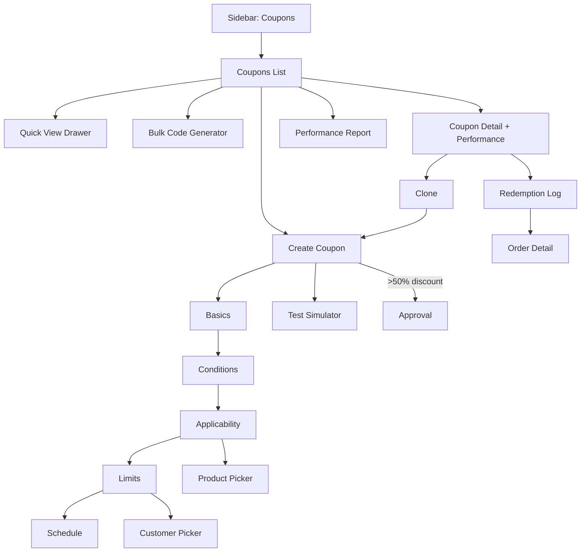
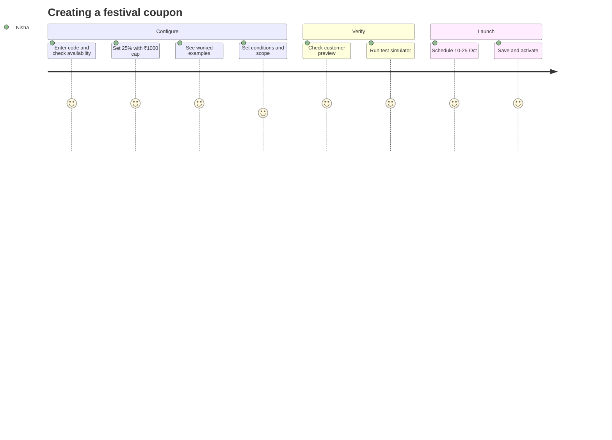
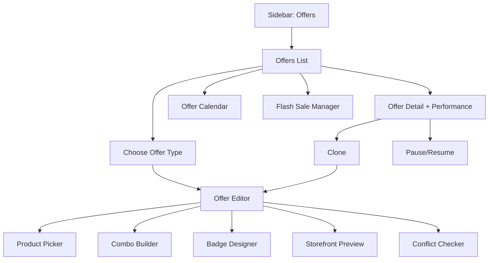
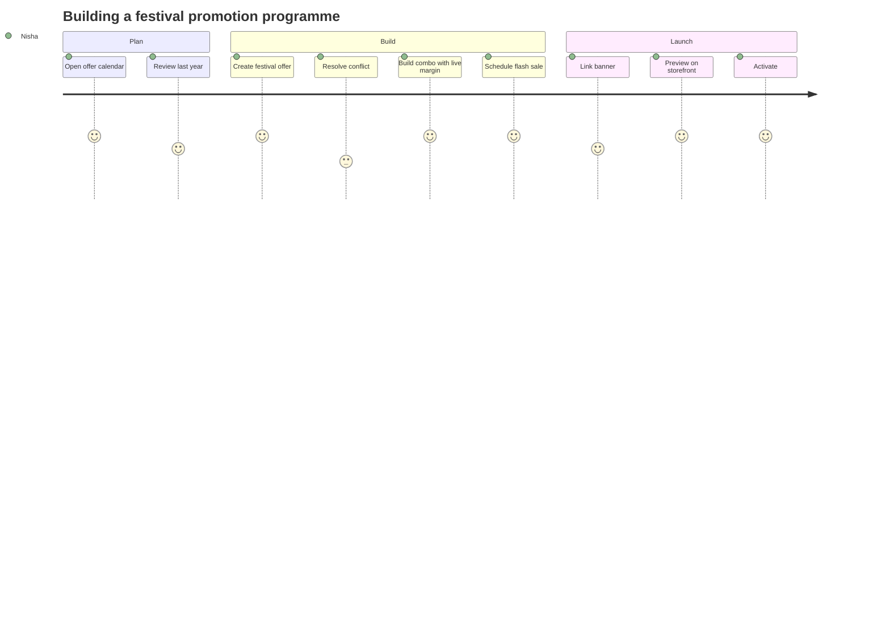
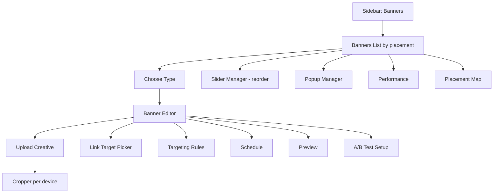
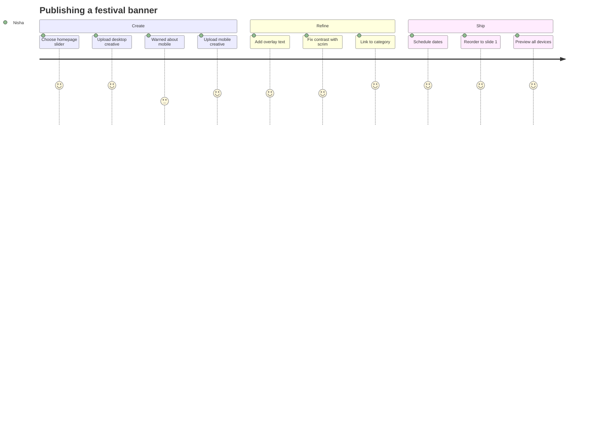

# Modules 09–11 — Coupons, Offers & Banners

Enterprise Handicraft E-Commerce Platform · UI/UX Design Specification

---
---

# MODULE 09 · COUPON MODULE

## 9.1 Business Goal

Coupons buy specific behaviours: first purchase, cart recovery, repeat orders, festival spikes and influencer attribution. They also leak margin when misconfigured. This module must make a correct coupon fast to create, an incorrect one impossible to publish, and every rupee of discount attributable to a campaign.

## 9.2 Purpose

Create, schedule, distribute, restrict and measure discount codes; enforce eligibility and usage limits; and report on redemption and revenue impact.

## 9.3 Features

| # | Feature |
|---|---------|
| CP-01 | Coupon CRUD with code generation (single, bulk unique codes) |
| CP-02 | Discount types: percentage, flat amount, free shipping, buy-X-get-Y, free gift |
| CP-03 | Maximum discount cap on percentage coupons |
| CP-04 | Minimum order value / minimum quantity conditions |
| CP-05 | Validity window with date and time, timezone-aware |
| CP-06 | Usage limits: total, per customer, per day |
| CP-07 | Eligibility: all customers, new customers only, specific customers, segments, first order only |
| CP-08 | Applicability: all products, specific products/categories/brands/artisans, exclusions |
| CP-09 | Stacking rules: combinable with offers/other coupons or exclusive |
| CP-10 | Auto-apply coupons (no code needed) |
| CP-11 | Bulk unique code generation for influencer/print campaigns with CSV export |
| CP-12 | Coupon performance analytics: uses, revenue, discount given, AOV lift, new vs repeat |
| CP-13 | Redemption log with order drill-through |
| CP-14 | Clone coupon, extend expiry, deactivate |
| CP-15 | Approval workflow for high-value discounts |

## 9.4 Complete Screen List

| ID | Screen | Route | Type |
|----|--------|-------|------|
| SCR-09-01 | Coupons List | `/admin/coupons` | Page |
| SCR-09-02 | Coupon Create/Edit | `/admin/coupons/create` · `/{id}/edit` | Page (tabbed) |
| SCR-09-03 | Coupon Detail & Performance | `/admin/coupons/{id}` | Page |
| SCR-09-04 | Redemption Log | `/admin/coupons/{id}/redemptions` | Page |
| SCR-09-05 | Bulk Code Generator | `/admin/coupons/bulk-generate` | Page (wizard) |
| SCR-09-06 | Coupon Performance Report | `/admin/coupons/performance` | Page |
| TAB-09-01 | Editor · Basics & Discount | — | Tab |
| TAB-09-02 | Editor · Conditions | — | Tab |
| TAB-09-03 | Editor · Applicability | — | Tab |
| TAB-09-04 | Editor · Limits & Eligibility | — | Tab |
| TAB-09-05 | Editor · Schedule & Stacking | — | Tab |
| MOD-09-01 | Quick Create Coupon | — | Modal MD |
| MOD-09-02 | Generate Code | — | Modal SM |
| MOD-09-03 | Product / Category Picker | — | Modal LG |
| MOD-09-04 | Customer / Segment Picker | — | Modal LG |
| MOD-09-05 | Clone Coupon | — | Modal SM |
| MOD-09-06 | Extend Expiry | — | Modal SM |
| MOD-09-07 | Deactivate Coupon | — | Modal SM |
| MOD-09-08 | Delete Coupon | — | Modal SM (guarded) |
| MOD-09-09 | Preview Coupon (checkout) | — | Modal MD |
| MOD-09-10 | Test Coupon (simulator) | — | Modal MD |
| MOD-09-11 | Export Codes | — | Modal SM |
| MOD-09-12 | Approval Request / Decision | — | Modal MD |
| DRW-09-01 | Coupon Quick View | — | Drawer 480 |
| DRW-09-02 | Advanced Filters | — | Drawer 400 |

## 9.5 Navigation Flow



## 9.6 Screen Hierarchy

```
Coupons
├── List (SCR-09-01) — status tabs, filters, bulk actions
├── Create/Edit (SCR-09-02) — 5 tabs + right rail (status, preview, simulator)
├── Detail & Performance (SCR-09-03) — KPIs, usage chart, redemption preview
├── Redemption Log (SCR-09-04)
├── Bulk Code Generator (SCR-09-05) — 3-step wizard
└── Performance Report (SCR-09-06)
```

## 9.7 Desktop Layout

- **List:** L-01 with status tabs (All / Active / Scheduled / Expired / Exhausted / Draft / Pending Approval) and a KPI strip (active coupons, redemptions this month, discount given, revenue influenced).
- **Editor:** L-02 (8/4) — left: tabbed forms; right rail: Status card, live coupon preview card (as the customer sees it at checkout), Test Simulator card, Summary card ("15% off, max ₹500, min order ₹1,500, 200 uses").
- **Detail:** L-02 — left: performance KPIs, usage-over-time chart, top products redeemed, recent redemptions; right rail: coupon summary, conditions digest, quick actions.

## 9.8 Tablet Layout

KPI strip 2×2. Editor rail moves below tabs but the live preview card is pinned above the tabs so the effect stays visible. Pickers become full-width modals.

## 9.9 Mobile Layout

Coupon cards showing code (mono, large, copyable), discount summary, validity, usage progress bar and status chip. Editor is single-column with a step-like tab strip; the preview card collapses into an expandable panel. Bulk generation is desktop-only with a notice.

## 9.10 Wireframe Description

### SCR-09-01 · Coupons List

```
┌──────────────────────────────────────────────────────────────────────────────────────┐
│ Coupons                                    [Bulk Generate] [Export] [+ Create Coupon] │
│ 18 active · 2,412 redemptions this month · ₹1,84,200 discount given                   │
├──────────────────────────────────────────────────────────────────────────────────────┤
│ All (42) │ Active (18) │ Scheduled (4) │ Expired (16) │ Exhausted (3) │ Draft (1)     │
├──────────────────────────────────────────────────────────────────────────────────────┤
│ [⌕ Search code or name] [Type▾][Status▾][Validity▾] [+More] [⚙][▤][↻]                │
├──────────────────────────────────────────────────────────────────────────────────────┤
│[☐]│ Code ⇅       │ Name              │ Discount     │ Used / Limit │ Valid To   │●│⋮│
│───┼──────────────┼───────────────────┼──────────────┼──────────────┼────────────┼─┼─│
│[☐]│ DIWALI25  ⧉ │ Diwali Festival   │ 25% max ₹1000│ 842 / 2000   │ 25 Oct 2026│●│⋮│
│   │              │ Min order ₹1,500  │              │ ████████░░42%│ 83 days    │A│ │
│[☐]│ WELCOME10 ⧉ │ First order       │ 10% max ₹300 │ 1,204 / ∞    │ No expiry  │●│⋮│
│   │              │ New customers only│              │              │            │A│ │
│[☐]│ FREESHIP  ⧉ │ Free shipping     │ Free shipping│ 366 / 500    │ 31 Aug 2026│●│⋮│
│   │              │ Min order ₹999    │              │ ███████░░73% │ 28 days    │A│ │
│[☐]│ FLASH50   ⧉ │ Flash sale 50%    │ 50% max ₹2000│ 500 / 500    │ 02 Aug 2026│○│⋮│
│   │              │ ⚠ Exhausted       │              │ ██████████   │ Ended      │E│ │
└──────────────────────────────────────────────────────────────────────────────────────┘
```

### SCR-09-02 · Coupon Editor

```
┌──────────────────────────────────────────────────┬───────────────────────────────────┐
│ ◀ DIWALI25                     [Test] [Save]     │ ┌─ Status ────────────────────┐  │
│ Basics │ Conditions │ Applicability │ Limits │ Schedule                             │  │
├──────────────────────────────────────────────────┤ │ ⦿ Active ○ Draft ○ Scheduled│  │
│ ┌─ Coupon Details ─────────────────────────────┐ │ │ ☐ Auto-apply (no code)      │  │
│ │ Coupon Code *                                 │ │ └─────────────────────────────┘  │
│ │ [DIWALI25              ] [Generate] ✓Available│ │ ┌─ Customer Preview ──────────┐  │
│ │ Internal Name *                               │ │ │  ┌───────────────────────┐  │  │
│ │ [Diwali Festival 2026                       ]│ │ │  │ 🎟 DIWALI25           │  │  │
│ │ Description (shown to customer)               │ │ │  │ 25% OFF up to ₹1,000  │  │  │
│ │ [Get 25% off on all Diwali collections      ]│ │ │  │ Min order ₹1,500      │  │  │
│ │                                               │ │ │  │ Valid till 25 Oct     │  │  │
│ │ Discount Type *                               │ │ │  └───────────────────────┘  │  │
│ │ ┌──────────┬──────────┬──────────┬──────────┐│ │ └─────────────────────────────┘  │
│ │ │ ⦿ Percent│ ○ Flat ₹ │○Free ship│○ Buy X Y ││ │ ┌─ Test Simulator ────────────┐  │
│ │ └──────────┴──────────┴──────────┴──────────┘│ │ │ Cart value [2,400        ]  │  │
│ │ Discount Value *      Maximum Discount        │ │ │ Customer  [New ▾]           │  │
│ │ [25          ] %      [1,000            ] ₹  │ │ │ Products  [Diwali ×]        │  │
│ │ ℹ A ₹2,400 order gets ₹600 off               │ │ │ ──────────────────────────  │  │
│ │   A ₹8,000 order gets ₹1,000 off (capped)    │ │ │ ✓ Coupon applies            │  │
│ └───────────────────────────────────────────────┘ │ │ Discount: ₹600              │  │
│ ┌─ Conditions (tab 2) ─────────────────────────┐ │ │ Total: ₹1,800               │  │
│ │ Minimum order value  [1,500            ] ₹   │ │ │        [Run Test]           │  │
│ │ Minimum quantity     [1               ]      │ │ └─────────────────────────────┘  │
│ │ ☐ Exclude already-discounted products         │ │ ┌─ Summary ───────────────────┐  │
│ │ ☐ Exclude shipping from discount calculation  │ │ │ 25% off, max ₹1,000         │  │
│ └───────────────────────────────────────────────┘ │ │ Min order ₹1,500            │  │
│                                                   │ │ 2,000 total uses            │  │
│                                                   │ │ 1 per customer              │  │
│                                                   │ │ 10–25 Oct 2026              │  │
│                                                   │ └─────────────────────────────┘  │
├───────────────────────────────────────────────────┴──────────────────────────────────┤
│                        [Cancel]  [Save as Draft]  [Save & Activate]                   │
└──────────────────────────────────────────────────────────────────────────────────────┘
```

### SCR-09-03 · Coupon Detail & Performance

```
┌──────────────────────────────────────────────────────────────────────────────────────┐
│ ◀ DIWALI25  [● Active]                    [Extend] [Clone] [⋮] [Edit Coupon]         │
│   Diwali Festival 2026 · Valid 10–25 Oct 2026 · 83 days remaining                     │
├────────────────┬────────────────┬────────────────┬────────────────┬──────────────────┤
│ REDEMPTIONS    │ DISCOUNT GIVEN │ REVENUE        │ AVG ORDER      │ NEW CUSTOMERS    │
│ 842 / 2,000    │ ₹4,84,200      │ ₹18,42,100     │ ₹2,188         │ 312 (37%)        │
│ ████████░░ 42% │ 26% of revenue │ ▲ vs no coupon │ ▲ ₹412 lift    │                  │
├────────────────┴────────────────┴────────────────┴────────────────┴──────────────────┤
│ Redemptions over time                                    [D][W][M]  [View as table]   │
│  120 ┤        ╭──╮                                                                    │
│   80 ┤    ╭───╯  ╰──╮                                                                 │
│   40 ┤ ╭──╯         ╰────╮                                                            │
│    0 ┼─┴────────────────────────────────────────                                      │
├──────────────────────────────────────────────────────────────────────────────────────┤
│ Recent Redemptions                                              [View all 842 →]      │
│ #HC-2026-000482 · Meera Nair · ₹4,250 · ₹600 off · 03 Aug 10:24                       │
│ #HC-2026-000478 · Sara Thomas · ₹6,120 · ₹1,000 off · 03 Aug 09:12                    │
└──────────────────────────────────────────────────────────────────────────────────────┘
```

## 9.11 Header

| Screen | Title | Subtitle | Actions |
|--------|-------|----------|---------|
| List | "Coupons" | "{n} active · {n} redemptions this month · ₹{amount} discount given" | Bulk Generate · Export · **+ Create Coupon** |
| Editor | "{Code}" or "Create Coupon" | "{internal name} · {status}" | Test · Cancel · Save as Draft · **Save & Activate** |
| Detail | "{Code}" + status chip | "{name} · Valid {from}–{to} · {n} days remaining" | Extend · Clone · `⋮` · **Edit Coupon** |
| Redemption Log | "Redemptions — {code}" | "{n} redemptions · ₹{amount} discount given" | Export |
| Bulk Generator | "Generate Coupon Codes" | "Step {n} of 3" | Cancel · **Next** |

## 9.12 Sidebar

`MARKETING` group → Coupons (first item). Badge shows coupons expiring within 7 days (info tone) and pending approvals (warning tone) for approvers.

## 9.13 Breadcrumb

```
Dashboard / Marketing / Coupons
Dashboard / Marketing / Coupons / Create
Dashboard / Marketing / Coupons / DIWALI25
Dashboard / Marketing / Coupons / DIWALI25 / Edit
Dashboard / Marketing / Coupons / DIWALI25 / Redemptions
Dashboard / Marketing / Coupons / Bulk Generate
```

## 9.14 Toolbar

Search (code, internal name, description) · Type filter (Percentage, Flat, Free shipping, BXGY, Free gift) · Status filter · Validity filter (Active now, Scheduled, Expired, Expiring in 7 days) · More filters · Saved views (Active, Expiring Soon, Exhausted, High Discount, My Coupons) · Columns · Density · Refresh.

## 9.15 Action Buttons

| Action | Type | Location | Permission | Confirmation |
|--------|------|----------|------------|--------------|
| Create Coupon | Primary | List header | create | — |
| Bulk Generate | Secondary | List header | create | Wizard |
| Quick Create | Menu | List header split | create | Modal |
| Edit | Row/detail | edit | Warning if active with redemptions |
| Clone | Row `⋮` | create | Modal |
| Test Coupon | Secondary | Editor | view | Modal simulator |
| Preview | Menu | Editor | view | Modal |
| Activate / Deactivate | Toggle | Row/detail | publish | Confirm with impact |
| Extend Expiry | Row `⋮` | edit | Modal |
| Export Codes | Row `⋮` | export | Modal (bulk-generated coupons only) |
| Export Redemptions | Detail | export | Modal |
| Delete | Row `⋮` (danger) | delete | Guarded; blocked if redeemed (offer deactivate instead) |
| Request Approval | Primary | Editor | create | When >50% or >₹5,000 discount |
| Approve/Reject | Approvals | approve | Modal |

## 9.16 Search

Matches code (exact match ranks first and is case-insensitive), internal name, customer-facing description and campaign tag. Searching a code that does not exist offers "Create coupon '{code}'". Redemption log search matches order number, customer name and email.

## 9.17 Filters

| Filter | Type | Options | Default |
|--------|------|---------|---------|
| Status | Multi-select | Active, Scheduled, Expired, Exhausted, Draft, Disabled, Pending approval | All |
| Discount type | Multi-select | Percentage, Flat, Free shipping, BXGY, Free gift | All |
| Validity | Segmented | All / Active now / Scheduled / Expired / Expiring in 7 days | All |
| Usage | Segmented | All / Unused / Partially used / Exhausted | All |
| Discount value | Numeric range | — | All |
| Eligibility | Multi-select | All customers, New only, Segments, Specific customers | All |
| Applies to | Multi-select | All products, Categories, Products, Brands, Artisans | All |
| Auto-apply | Toggle | — | Off |
| Created by | Select | Admin users | All |
| Created / Valid date | Range | — | All |
| Campaign tag | Multi-select | — | All |

## 9.18 Sorting

Code (A→Z), Name, Discount value, Redemptions (default desc on the performance view), Usage %, Discount given, Revenue influenced, Valid from, Valid to (default asc for "Expiring Soon"), Created (default desc on the list).

## 9.19 Bulk Actions

Activate · Deactivate · Extend expiry (adds N days to each) · Add campaign tag · Export · Delete (guarded, blocked for redeemed coupons which are offered deactivation instead).

## 9.20 Cards / Tables / Widgets

### 9.20.1 Coupons — Columns

Select · Code (mono, 600, copy icon) · Name + condition summary caption · Discount (formatted: "25% max ₹1,000") · Used/Limit with a progress bar · Eligibility chip · Applies to (chip: All / {n} categories / {n} products) · Valid from · Valid to + days-remaining caption · Redemption revenue (permission-gated) · Status chip · Actions.

Rows nearing exhaustion (>90%) or expiry (<7 days) show a warning left border.

### 9.20.2 Coupon Preview Card

Renders exactly as the customer sees it at checkout: ticket-shaped card with a dashed left edge, code in mono, headline discount, condition line, validity line and a "Terms" expander. Two variants: available and applied.

### 9.20.3 Test Simulator Card

Inputs: cart value, item count, customer type (New/Returning/Specific), products in cart, shipping cost. Output panel: applies/does not apply with the specific failing condition named, discount amount, new total, and a "why" explanation ("Minimum order value is ₹1,500; this cart is ₹1,200").

### 9.20.4 Performance KPIs

Redemptions (with limit progress), Discount given, Revenue influenced, Average order value with lift versus non-coupon orders, New customers acquired, Repeat rate, Redemption rate (if distributed count is known), Margin impact (permission-gated).

## 9.21 Forms & Fields

| Tab | Field | Type | Required | Notes |
|-----|-------|------|----------|-------|
| Basics | Coupon code | Text + generate | Yes | 3–20 chars, A–Z 0–9, uppercase-normalised, unique |
| Basics | Internal name | Text | Yes | Not shown to customers |
| Basics | Customer description | Text | No | Shown at checkout, ≤120 |
| Basics | Discount type | Radio cards | Yes | Percentage / Flat / Free shipping / Buy X Get Y / Free gift |
| Basics | Discount value | Number | Conditional | % (1–100) or ₹ |
| Basics | Maximum discount | Currency | Conditional | Recommended for % coupons; a warning appears if empty |
| Basics | Buy quantity / Get quantity | Numbers | Conditional (BXGY) | — |
| Basics | Get discount | Select | Conditional (BXGY) | Free / % off / Flat off |
| Basics | Free gift product | Product picker | Conditional | — |
| Basics | Campaign tag | Tag input | No | For grouping and reporting |
| Conditions | Minimum order value | Currency | No | — |
| Conditions | Maximum order value | Currency | No | Rare; for targeted low-value promos |
| Conditions | Minimum quantity | Number | No | — |
| Conditions | Exclude discounted products | Switch | No | — |
| Conditions | Exclude shipping from calculation | Switch | No | — |
| Conditions | Applies to shipping | Switch | Conditional | Free-shipping type |
| Applicability | Applies to | Radio | Yes | All products / Specific categories / Specific products / Specific brands / Specific artisans |
| Applicability | Included items | Picker | Conditional | Multi-select with search and count |
| Applicability | Excluded items | Picker | No | Always evaluated after inclusions |
| Applicability | Exclude sale items | Switch | No | — |
| Limits | Total usage limit | Number | No | Empty = unlimited |
| Limits | Per-customer limit | Number | No | Default 1 |
| Limits | Per-day limit | Number | No | — |
| Limits | Eligibility | Radio | Yes | All / New customers only / First order only / Specific customers / Segments |
| Limits | Customers / Segments | Picker | Conditional | — |
| Limits | Minimum customer orders | Number | No | Loyalty targeting |
| Schedule | Valid from | Date-time | Yes | — |
| Schedule | Valid to | Date-time | No | Empty = no expiry (warning shown) |
| Schedule | Active days | Checkbox group | No | e.g. weekends only |
| Schedule | Active hours | Time range | No | e.g. 6 PM–9 PM flash |
| Schedule | Stacking | Radio | Yes | Cannot combine / Combine with offers / Combine with other coupons / Combine with all |
| Schedule | Priority | Number | No | When multiple auto-apply coupons match |
| Schedule | Auto-apply | Switch | No | Hides the code from checkout entry |
| Schedule | Show on storefront | Switch | No | Lists the coupon on an offers page |

## 9.22 Validation Rules

| Field | Rule | Message |
|-------|------|---------|
| Code | Required | "Coupon code is required." |
| Code | 3–20 chars, A–Z0-9 | "Use 3–20 letters and numbers only." |
| Code | Unique (including expired) | "This code has been used before. Choose another." |
| Code | Not a reserved word | "This code is reserved. Choose another." |
| Internal name | Required | "Internal name is required." |
| Discount value (%) | 1–100 | "Percentage must be between 1 and 100." |
| Discount value (%) | >50 needs approval | "Discounts above 50% need approval from Finance." |
| Discount value (₹) | >0 | "Discount amount must be greater than 0." |
| Discount value (₹) | ≤ minimum order value | "A flat discount of ₹2,000 with no minimum order could make orders free. Set a minimum order value." |
| Maximum discount | Recommended for % | "Without a cap, a ₹50,000 order would get ₹12,500 off. Add a maximum." (warning) |
| Maximum discount | >0 | "Maximum discount must be greater than 0." |
| Minimum order value | ≥0 | — |
| Min/Max order | min < max | "Minimum order value must be less than the maximum." |
| BXGY quantities | ≥1 | "Buy and get quantities must be at least 1." |
| Applicability | ≥1 item when specific | "Select at least one {category/product/brand}." |
| Exclusions | Not identical to inclusions | "You've excluded everything you included." |
| Usage limit | ≥1 if set | "Usage limit must be at least 1." |
| Per-customer limit | ≤ total limit | "Per-customer limit can't exceed the total limit." |
| Valid from | Required | "Choose a start date." |
| Valid to | After valid from | "End date must be after the start date." |
| Valid to | Empty | "This coupon will never expire. Set an end date?" (warning) |
| Active hours | end after start | "End time must be after the start time." |
| Edit active coupon | Warning | "This coupon has been used 842 times. Changing it affects future redemptions only." |
| Code change after use | Blocked | "The code can't be changed after it has been redeemed. Clone it instead." |
| Delete redeemed | Blocked | "This coupon has 842 redemptions and can't be deleted. Deactivate it instead." |
| Bulk generate count | 1–100,000 | "Generate between 1 and 100,000 codes." |
| Bulk prefix | ≤10 chars | "Prefix must be 10 characters or fewer." |
| Free gift stock | In stock | "The gift product is out of stock. Customers won't receive it." |

## 9.23 Dropdowns & Data Sources

Discount type (static) · Eligibility (static) · Stacking (static) · Categories `GET /api/categories/tree` · Products `GET /api/products/search` · Brands `GET /api/brands` · Artisans `GET /api/artisans` · Customers `GET /api/customers?search=` · Segments `GET /api/segments` · Campaign tags `GET /api/tags?type=campaign` · Code availability `GET /api/coupons/check-code?code=`.

## 9.24 Icons

Coupons `ticket-percent` · Create `plus` · Code `hash` · Percentage `percent` · Flat `indian-rupee` · Free shipping `truck` · BXGY `gift` · Free gift `gift` · Generate `wand-sparkles` · Test `flask-conical` · Clone `copy` · Extend `calendar-plus` · Redemptions `receipt` · Exhausted `battery-low` · Expiring `clock-alert` · Auto-apply `zap` · Approval `shield-check` · Eligibility `users` · Applicability `package`.

## 9.25 Pagination

List 25/page; Redemption log 50/page with export; Bulk-generated codes shown 100/page with a search box; Performance report follows the report module's paging.

## 9.26 Notifications & Toasts

Coupon created / activated / deactivated / cloned / extended · "Code copied" · "Coupon expires in 3 days" (scheduled warning) · "Coupon exhausted — 500 of 500 used" · "{n} codes generated · download CSV" · "Coupon sent for approval" · "Coupon approved/rejected: {reason}" · "Test passed: ₹600 discount would apply" · "This code is already in use" (inline error) · "Free gift product is out of stock" (warning) · "Coupon deleted".

## 9.27 Dialogs

| Dialog | Type | Content |
|--------|------|---------|
| MOD-09-02 Generate Code | Form | Pattern (prefix, length, character set), preview of 3 samples, "Use this code" |
| MOD-09-05 Clone | Form | New code (auto-suggested), copy conditions/applicability/limits checkboxes, status (Draft default) |
| MOD-09-06 Extend Expiry | Form | Current end date, new end date or "+N days" quick buttons, affected-usage note |
| MOD-09-07 Deactivate | Confirm | "Customers can no longer use {code}. {n} customers have it saved in their cart." |
| MOD-09-08 Delete | Guarded destructive | Blocked when redeemed; otherwise typed code confirm |
| MOD-09-10 Test Simulator | Form | Cart inputs, run, result panel with pass/fail per condition |
| MOD-09-12 Approval | Form | Coupon summary, projected discount exposure (max discount × usage limit), requester, decision with reason |
| Bulk Generate wizard | 3 steps | 1: Settings (base coupon config) · 2: Code generation (count, prefix, pattern, expiry) · 3: Review & generate → success with CSV download |

## 9.28 Permission Matrix (Module 09)

| Action | Super Admin | Admin | Product | Inventory | Order | Marketing | Finance | Support | Content |
|--------|:-----------:|:-----:|:-------:|:---------:|:-----:|:---------:|:-------:|:-------:|:-------:|
| View coupons | ✔ | ✔ | ✔ | ✖ | ✔ | ✔ | ✔ | ✔ | ✖ |
| Create/edit coupon | ✔ | ✔ | ✖ | ✖ | ✖ | ✔ | ✖ | ✖ | ✖ |
| Activate/deactivate | ✔ | ✔ | ✖ | ✖ | ✖ | ✔ | ✖ | ✖ | ✖ |
| Approve >50% discount | ✔ | ✔ | ✖ | ✖ | ✖ | ✖ | ✔ | ✖ | ✖ |
| Bulk generate codes | ✔ | ✔ | ✖ | ✖ | ✖ | ✔ | ✖ | ✖ | ✖ |
| Delete coupon | ✔ | ✔ | ✖ | ✖ | ✖ | ✖ | ✖ | ✖ | ✖ |
| View performance/revenue | ✔ | ✔ | ✖ | ✖ | ✖ | ✔ | ✔ | ✖ | ✖ |
| Apply coupon to an order manually | ✔ | ✔ | ✖ | ✖ | ✔ | ✖ | ✖ | ✔ | ✖ |
| Export codes/redemptions | ✔ | ✔ | ✖ | ✖ | ✖ | ✔ | ✔ | ✖ | ✖ |

## 9.29 User Journey

**Nisha launches the Diwali coupon.** She clicks Create Coupon, types "DIWALI25" (availability confirmed inline), selects Percentage, enters 25 with a ₹1,000 cap — the helper immediately shows worked examples for two cart values. On Conditions she sets a ₹1,500 minimum. On Applicability she picks the Festive & Ritual category plus the "diwali" tag, and excludes already-discounted items. Limits: 2,000 total, 1 per customer, all customers. Schedule: 10–25 Oct, cannot combine with other coupons. The right rail preview shows exactly what the customer will see. She runs the simulator with a ₹2,400 cart and confirms ₹600 off. Because 25% is under the approval threshold, she saves and activates directly. The coupon appears in the Scheduled tab until 10 Oct.



## 9.30 UX Guidelines

| ID | Guideline |
|----|-----------|
| CP-G01 | Always show worked examples of what a discount produces at two cart values |
| CP-G02 | Warn loudly when a percentage coupon has no maximum cap — this is the single most common costly mistake |
| CP-G03 | The customer preview must be visible while editing, never behind a separate button |
| CP-G04 | The simulator must name the exact failing condition, not just "does not apply" |
| CP-G05 | Codes are immutable after first redemption — enforce by disabling, and offer Clone |
| CP-G06 | Never delete a redeemed coupon; deactivation preserves reporting integrity |
| CP-G07 | Usage progress must be visible in the list, not only in the detail |
| CP-G08 | Expiry and exhaustion warnings appear proactively (7 days / 90% used) |
| CP-G09 | Stacking rules must be stated in plain language, not jargon |
| CP-G10 | High-discount coupons route to approval automatically — never rely on policy memory |

## 9.31 Accessibility

Usage progress bars expose value/max/percentage in their accessible names. The simulator result is announced via a polite live region including the reason. Code availability status is announced on debounce completion. Discount-type radio cards are a proper radiogroup with descriptions linked. Date-time pickers announce timezone. The coupon preview card is marked as a preview and its content duplicated as plain text.

## 9.32 Micro-interactions

Code availability check shows an inline spinner then a green tick with a subtle scale pop · Worked-example text cross-fades as values change · Preview card updates live with a 150ms cross-fade · Usage progress bar animates on load and pulses when crossing 90% · Simulator "Run Test" shows a brief loading state then the result panel slides down · Copy code morphs the icon to a check · Activating a coupon flips the status chip with a subtle glow · Bulk generation shows a counter animating to the total.

## 9.33 Loading / Empty / Error States

List: table skeleton → "No coupons yet — create a coupon to run your first promotion." + Create Coupon. Editor: field skeletons. Detail: KPI + chart skeletons → "No redemptions yet — share this code to start tracking." Redemption log: "No redemptions yet". Filtered: "No coupons match your filters". Error: "Couldn't load coupons" + Retry. Approval pending: banner "This coupon is waiting for approval and can't be activated yet."

## 9.34 API & Database Dependencies

`GET/POST/PUT/DELETE /api/coupons` · `/api/coupons/{id}` · `/api/coupons/check-code` · `/api/coupons/{id}/activate|deactivate|clone|extend` · `/api/coupons/{id}/redemptions` · `/api/coupons/{id}/performance` · `/api/coupons/bulk-generate` · `/api/coupons/{id}/codes/export` · `/api/coupons/test` (simulator) · `/api/coupons/validate` (checkout, shared with storefront) · `/api/coupons/{id}/approve|reject`.

**Entities:** `Coupons`, `CouponCodes` (for bulk unique codes), `CouponConditions`, `CouponApplicability`, `CouponRedemptions`, `CouponApprovals`, `Campaigns`, `Orders`, `Customers`, `Segments`, `Products`, `Categories`.

**Notes:** the simulator and checkout must call the same validation service. Redemption is recorded transactionally with the order to prevent limit races. Usage counters are incremented atomically. Coupon code uniqueness includes historical/expired codes.

## 9.35 Figma Build Notes

**New components:** `CMP-CPN-CodeField` (with generate + availability states), `CMP-CPN-DiscountTypeCard` (5 types), `CMP-CPN-PreviewTicket` (available/applied variants), `CMP-CPN-Simulator`, `CMP-CPN-UsageProgress`, `CMP-CPN-ListRow`, `CMP-CPN-ConditionSummary`, `CMP-CPN-WorkedExample`, `CMP-CPN-ApprovalBanner`.

**Auto layout:** Editor = V(PageHeader → Tabs → H(Main Fill: form cards | Rail 360: Status, Preview, Simulator, Summary)) → StickyActionBar.

**Variants:** ListRow — Status (7) × UsageBand (Low/Medium/High/Exhausted) × Expiry (Normal/Soon/Expired). PreviewTicket — Type (5 discount types) × State (Available/Applied/Invalid).

**Prototype (PT-05 segment):** Coupons → Create → type code (availability tick) → select percentage → enter values (examples update) → conditions → applicability picker → limits → schedule → simulator run → Save & Activate → success → detail with performance.

**Dev notes:** never compute discount in the client except for the labelled preview; the authoritative amount comes from the validation endpoint. Bulk code generation runs as a background job with progress and a downloadable CSV.

**Future scalability:** referral coupons with attribution, personalised one-time codes per customer via email, coupon A/B testing, automatic win-back coupon triggers, and gift cards as a separate but adjacent instrument.

---
---

# MODULE 10 · OFFER MANAGEMENT

## 10.1 Business Goal

Offers are automatic, code-free promotions that lift basket size and clear inventory: festival campaigns, combos, buy-X-get-Y and time-boxed flash sales. For handicraft, combos ("puja thali set + 5 diyas") and festival bundles are the highest-margin merchandising tool available.

## 10.2 Purpose

Create rule-based promotions that apply automatically at checkout, schedule them around festivals, control their stacking and priority, and measure their revenue effect.

## 10.3 Features

| # | Feature |
|---|---------|
| OF-01 | Offer types: Festival/Seasonal, Combo/Bundle, Buy X Get Y, Flash Sale, Tiered (spend more save more), Category discount, Clearance |
| OF-02 | Automatic application — no code required |
| OF-03 | Scheduling with start/end date-time and countdown display |
| OF-04 | Priority and stacking rules across offers and coupons |
| OF-05 | Product/category/brand/artisan scoping with exclusions |
| OF-06 | Combo builder: define bundle contents and bundle price |
| OF-07 | Flash sale with live countdown, stock cap and per-customer limit |
| OF-08 | Storefront presentation controls: badge text, colour, banner linkage |
| OF-09 | Offer preview on product and cart |
| OF-10 | Performance analytics per offer |
| OF-11 | Clone, schedule ahead, pause/resume |
| OF-12 | Conflict detection between overlapping offers |

## 10.4 Complete Screen List

| ID | Screen | Route | Type |
|----|--------|-------|------|
| SCR-10-01 | Offers List | `/admin/offers` | Page |
| SCR-10-02 | Offer Create/Edit | `/admin/offers/create` · `/{id}/edit` | Page (tabbed) |
| SCR-10-03 | Offer Detail & Performance | `/admin/offers/{id}` | Page |
| SCR-10-04 | Combo Builder | `/admin/offers/{id}/combo` | Page |
| SCR-10-05 | Flash Sale Manager | `/admin/offers/flash-sales` | Page |
| SCR-10-06 | Offer Calendar | `/admin/offers/calendar` | Page |
| SCR-10-07 | Conflict Checker | `/admin/offers/conflicts` | Page |
| SCR-10-08 | Offer Performance Report | `/admin/offers/performance` | Page |
| MOD-10-01 | Choose Offer Type | — | Modal MD |
| MOD-10-02 | Product/Category Picker | — | Modal LG |
| MOD-10-03 | Add Combo Item | — | Modal MD |
| MOD-10-04 | Set Flash Sale Window | — | Modal MD |
| MOD-10-05 | Preview on Storefront | — | Modal Full |
| MOD-10-06 | Clone Offer | — | Modal SM |
| MOD-10-07 | Pause / Resume Offer | — | Modal SM |
| MOD-10-08 | End Offer Early | — | Modal SM (guarded) |
| MOD-10-09 | Delete Offer | — | Modal SM (guarded) |
| MOD-10-10 | Conflict Resolution | — | Modal LG |
| MOD-10-11 | Badge Designer | — | Modal MD |
| MOD-10-12 | Bulk Add Products to Offer | — | Modal LG |
| DRW-10-01 | Offer Quick View | — | Drawer 480 |
| DRW-10-02 | Advanced Filters | — | Drawer 400 |

## 10.5 Navigation Flow



## 10.6 Screen Hierarchy

```
Offers
├── List (SCR-10-01) — type tabs, status filters
├── Type chooser (MOD-10-01) → Editor (SCR-10-02) — 4 tabs
│   ├── Combo Builder (SCR-10-04) for bundle types
│   └── Badge Designer, Preview, Conflict check
├── Detail & Performance (SCR-10-03)
├── Flash Sale Manager (SCR-10-05) — live countdowns and stock caps
├── Calendar (SCR-10-06) — month/timeline view of all scheduled promotions
├── Conflicts (SCR-10-07)
└── Performance Report (SCR-10-08)
```

## 10.7 Desktop Layout

- **List:** L-01 with type tabs and a status filter; each row shows a mini timeline bar of its active window.
- **Editor:** L-02 (8/4) — left: tabbed configuration; right rail: Status/Schedule card with countdown, storefront badge preview, conflict warnings, summary.
- **Calendar:** L-01 full-width Gantt-style timeline — rows are offers, columns are days; overlapping bars visualise conflicts; festival markers (Diwali, Christmas, Eid, Navratri, Raksha Bandhan) are shown as vertical reference lines.
- **Flash Sale Manager:** L-01 cards with live countdown, units sold vs cap progress, and pause controls.

## 10.8 Tablet Layout

Calendar switches to a 2-week window with horizontal scroll. Editor rail moves below but the badge preview pins above the tabs. Combo builder becomes a stacked list.

## 10.9 Mobile Layout

Offer cards with type icon, name, discount summary, schedule and status. Calendar is replaced by an agenda list grouped by date. Flash sale cards show large countdowns. Editing is single-column; the combo builder is supported but simplified to sequential item addition.

## 10.10 Wireframe Description

### SCR-10-01 · Offers List

```
┌──────────────────────────────────────────────────────────────────────────────────────┐
│ Offers                              [Calendar] [Conflicts (1)] [+ Create Offer]       │
│ 6 running · 4 scheduled · ₹4,82,100 influenced this month                             │
├──────────────────────────────────────────────────────────────────────────────────────┤
│ All │ Running (6) │ Scheduled (4) │ Ended (18) │ Paused (1) │ Draft (2)               │
├──────────────────────────────────────────────────────────────────────────────────────┤
│ [⌕ Search offers] [Type▾][Status▾][Date▾] [+More] [⚙][▤][↻]                          │
├──────────────────────────────────────────────────────────────────────────────────────┤
│[☐]│ Offer                    │ Type      │ Discount  │ Schedule            │ Uses │●│⋮│
│[☐]│ 🪔 Diwali Festival Sale  │ Festival  │ 20% off   │ 10–25 Oct           │  842 │●│⋮│
│   │ Festive & Ritual · 186 products      │ ▓▓▓▓▓▓░░░░ running · 12d left  │      │R│ │
│[☐]│ 🎁 Puja Thali Combo      │ Combo     │ ₹1,499    │ Always              │  214 │●│⋮│
│   │ 4 items · save ₹400 (21%)            │                                 │      │R│ │
│[☐]│ ⚡ Flash: Brass Décor     │ Flash Sale│ 40% off   │ Today 18:00–21:00   │   —  │◐│⋮│
│   │ 24 products · cap 200 units          │ Starts in 04:12:33              │      │S│ │
│[☐]│ 🛍 Buy 2 Get 1 Cushions  │ BXGY      │ Cheapest  │ 01–31 Aug           │  126 │●│⋮│
│   │ Textiles > Cushions                  │           free                  │      │R│ │
└──────────────────────────────────────────────────────────────────────────────────────┘
```

### SCR-10-06 · Offer Calendar

```
┌──────────────────────────────────────────────────────────────────────────────────────┐
│ Offer Calendar          [< Oct 2026 >]  [Month|Quarter]        [+ Create Offer]       │
├──────────────────────────────────────────────────────────────────────────────────────┤
│                    1  5   10        15       20      25        31                     │
│                    │  │   ┊         ┊        ┊       ┊         │    🪔 Diwali (20 Oct)│
│ Diwali Sale        │  │   ▓▓▓▓▓▓▓▓▓▓▓▓▓▓▓▓▓▓▓▓▓▓▓▓▓▓▓│         │                     │
│ Flash: Brass       │  │   │  ▓      ┊        ┊       ┊         │                     │
│ Buy2Get1 Cushions  ▓▓▓▓▓▓▓▓▓▓▓▓▓▓▓▓▓▓▓▓▓▓▓▓▓▓▓▓▓▓▓▓▓▓▓▓▓▓▓▓▓▓▓▓│                     │
│ Puja Combo         ▓▓▓▓▓▓▓▓▓▓▓▓▓▓▓▓▓▓▓▓▓▓▓▓▓▓▓▓▓▓▓▓▓▓▓▓▓▓▓▓▓▓▓▓│ (always on)         │
│ Clearance Textiles │  │   │         ┊  ⚠overlap  ▓▓▓▓▓▓▓▓▓▓▓▓▓│                     │
│                                                                                       │
│ ⚠ 1 conflict: "Clearance Textiles" overlaps "Buy2Get1 Cushions" on 18 products        │
│                                                              [Resolve Conflict →]     │
└──────────────────────────────────────────────────────────────────────────────────────┘
```

### SCR-10-04 · Combo Builder

```
┌──────────────────────────────────────────────────────────────────────────────────────┐
│ Combo: Puja Thali Set                                        [Preview] [Save Combo]   │
├──────────────────────────────────────────────────────────────────────────────────────┤
│ ┌─ Combo Items ────────────────────────── [+ Add Item] ┐  ┌─ Pricing ──────────────┐ │
│ │ [img] Brass Puja Thali        ₹899  qty 1  Required ⋮│  │ Items total    ₹1,899  │ │
│ │ [img] Brass Diya Set of 5     ₹450  qty 1  Required ⋮│  │ Combo price    ₹1,499  │ │
│ │ [img] Incense Holder          ₹250  qty 1  Optional ⋮│  │ ─────────────────────  │ │
│ │ [img] Kumkum Container        ₹300  qty 1  Required ⋮│  │ Customer saves   ₹400  │ │
│ │                                                       │  │ Discount         21%   │ │
│ │ Customer can choose: [All required + any optional ▾] │  │ Combo cost     ₹1,050  │ │
│ └───────────────────────────────────────────────────────┘  │ Margin      ₹449 (30%) │ │
│                                                             └────────────────────────┘ │
│ ┌─ Combo Settings ─────────────────────────────────────────────────────────────────┐  │
│ │ Combo name * [Puja Thali Set                    ]  Sold as: ⦿ Bundle ○ Suggestion│  │
│ │ Stock rule   [Limited by lowest-stock item ▾]  Current max combos available: 12  │  │
│ │ ☑ Show as a single product on the storefront   ☑ Allow items to be sold separately│  │
│ └──────────────────────────────────────────────────────────────────────────────────┘  │
└──────────────────────────────────────────────────────────────────────────────────────┘
```

## 10.11 Header

| Screen | Title | Subtitle | Actions |
|--------|-------|----------|---------|
| List | "Offers" | "{n} running · {n} scheduled · ₹{amount} influenced this month" | Calendar · Conflicts (badge) · **+ Create Offer** |
| Editor | "{Offer name}" or "Create Offer" | "{type} · {status} · {schedule summary}" | Preview · Cancel · Save Draft · **Save & Activate** |
| Detail | "{Offer name}" + status | "{type} · {schedule} · {countdown}" | Pause · Clone · `⋮` · **Edit Offer** |
| Calendar | "Offer Calendar" | "{month} · {n} offers · {n} conflicts" | **+ Create Offer** |
| Flash Sales | "Flash Sales" | "{n} live · {n} scheduled today" | **+ Create Flash Sale** |
| Combo Builder | "Combo: {name}" | "{n} items · saves ₹{amount} ({p}%)" | Preview · **Save Combo** |

## 10.12 Sidebar

`MARKETING` → Offers, Flash Sales. Offers badge shows conflicts (danger) or offers starting in the next 24h (info).

## 10.13 Breadcrumb

```
Dashboard / Marketing / Offers
Dashboard / Marketing / Offers / Diwali Festival Sale
Dashboard / Marketing / Offers / Diwali Festival Sale / Edit
Dashboard / Marketing / Offers / Puja Thali Set / Combo Builder
Dashboard / Marketing / Offers / Calendar
Dashboard / Marketing / Flash Sales / Brass Décor Flash
```

## 10.14 Toolbar

Search (name, description, product) · Type filter · Status filter · Date range · Scope filter (category/brand/artisan) · More filters · Saved views (Running Now, Starting Soon, Festival Offers, Underperforming, Conflicts) · Columns · Density · Refresh.

## 10.15 Action Buttons

Create Offer (opens type chooser) · Edit · Clone · Preview on Storefront · Pause / Resume · End Early (guarded) · Delete (guarded) · Add Products (bulk) · Design Badge · Check Conflicts · Export performance · Duplicate for next year (festival offers — shifts dates by the festival calendar).

## 10.16 Search

Matches offer name, description, badge text and included product names (so "diya" finds every offer containing diya products). Results indicate what matched.

## 10.17 Filters

Type (7) · Status (Running, Scheduled, Paused, Ended, Draft) · Date range · Discount range · Scope (All / Category / Product / Brand / Artisan) · Has conflict · Auto-apply · Created by · Festival tag · Performance band (Top / Average / Underperforming).

## 10.18 Sorting

Start date (default asc for scheduled, desc for ended) · Name · Discount value · Uses · Revenue influenced · Created · Days remaining (default for Running).

## 10.19 Bulk Actions

Activate · Pause · Extend end date · Add campaign tag · Clone for next period · Export · Delete (guarded, blocked when the offer has been used).

## 10.20 Cards / Tables / Widgets

**Offers list row:** type icon, offer name + scope caption, type chip, discount summary, schedule with a mini progress bar and days remaining, uses count, revenue influenced (permission-gated), status chip, actions.

**Flash sale card:** large countdown (HH:MM:SS), units sold vs cap progress, revenue so far, per-customer limit, pause/extend actions, and a "live" pulsing indicator.

**Calendar bar:** offer name, coloured by type, length proportional to duration, hatched where paused, red outline where conflicting. Festival markers as labelled vertical lines.

**Conflict card:** two offers, overlapping product count, overlapping date range, resolution options (set priority, exclude products, change dates, disable one).

**Performance KPIs:** uses, revenue influenced, discount given, AOV with lift, units moved, margin impact, new vs repeat split.

## 10.21 Forms & Fields

| Tab | Field | Type | Required | Notes |
|-----|-------|------|----------|-------|
| Basics | Offer name | Text | Yes | Internal + storefront unless overridden |
| Basics | Storefront title | Text | No | Customer-facing |
| Basics | Description | Textarea | No | — |
| Basics | Offer type | Radio cards (7) | Yes | Locked after activation |
| Basics | Festival tag | Select | No | Diwali, Christmas, Eid, Navratri, Holi, Raksha Bandhan, Pongal, New Year, Wedding season |
| Discount | Discount type | Radio | Yes | Percentage / Flat / Fixed price / Free item / Tiered |
| Discount | Value | Number | Yes | — |
| Discount | Maximum discount | Currency | No | Warning if absent on % |
| Discount | Tiers | Repeatable (spend ≥ X → Y off) | Conditional | Up to 5 tiers |
| Discount | Buy qty / Get qty / Get discount | Numbers + select | Conditional (BXGY) | "Cheapest free" option |
| Discount | Combo price | Currency | Conditional (Combo) | Shows savings and margin live |
| Scope | Applies to | Radio | Yes | All / Categories / Products / Brands / Artisans / Tags |
| Scope | Included items | Picker | Conditional | With count and estimated reach |
| Scope | Excluded items | Picker | No | — |
| Scope | Minimum order value | Currency | No | — |
| Scope | Customer eligibility | Radio | Yes | All / New / Segments / Loyalty tier |
| Schedule | Start date-time | Date-time | Yes | — |
| Schedule | End date-time | Date-time | Conditional | Required except "Always on" |
| Schedule | Always on | Switch | No | — |
| Schedule | Recurring | Select | No | Daily hours / Weekly days / Annual (festival) |
| Schedule | Stock cap | Number | Conditional (Flash) | Total units across the offer |
| Schedule | Per-customer limit | Number | No | — |
| Schedule | Priority | Number | Yes | Lower runs first when multiple match |
| Schedule | Stacking | Radio | Yes | Exclusive / Combine with coupons / Combine with other offers / Combine with all |
| Display | Badge text | Text | No | ≤14 chars, e.g. "20% OFF", "COMBO" |
| Display | Badge colour | Colour picker | No | Contrast checked |
| Display | Show countdown | Switch | No | Flash and time-boxed offers |
| Display | Show on offers page | Switch | No | — |
| Display | Linked banner | Select | No | Links to a Banner (Module 11) |
| Display | Highlight in listings | Switch | No | — |

## 10.22 Validation Rules

| Rule | Message |
|------|---------|
| Name required | "Offer name is required." |
| Type required, locked after activation | "Offer type can't be changed after the offer has run. Clone it instead." |
| Discount value >0 | "Discount value must be greater than 0." |
| Percentage 1–100 | "Percentage must be between 1 and 100." |
| Percentage >50 warns | "A 60% discount is unusually high. Continue?" |
| No cap on % | "Without a maximum, large orders get large discounts. Add a cap?" (warning) |
| Combo price < items total | "Combo price must be less than the total of its items (₹1,899)." |
| Combo price > combo cost | "This combo would sell below cost (₹1,050). Margin would be −₹51." (blocking unless Admin overrides with a reason) |
| Combo items ≥2 | "A combo needs at least 2 items." |
| Scope items ≥1 | "Select at least one {category/product}." |
| Scope reach 0 | "No products match this scope. Customers won't see this offer." |
| Start required | "Choose a start date and time." |
| End after start | "End must be after the start." |
| End in the past | "End date has already passed." |
| Flash duration ≤24h | "Flash sales can run for up to 24 hours." |
| Flash stock cap ≤ available | "Only 142 units are in stock across these products." |
| Tier order ascending | "Each tier must have a higher spend threshold than the one before." |
| Priority unique per overlap | "Another offer has priority 1 for the same products. Set a different priority." |
| Conflict detected | "This overlaps 'Buy2Get1 Cushions' on 18 products from 18–31 Oct. [Resolve]" |
| Badge text ≤14 | "Badge text must be 14 characters or fewer." |
| Badge contrast | "This text may be hard to read on the chosen background." |
| Delete used offer | "This offer has been used 842 times and can't be deleted. End it instead." |
| End early | "Ending now stops the discount immediately for all customers, including items already in carts." |

## 10.23 Dropdowns & Data Sources

Offer type (static) · Festival tag (`GET /api/settings/festivals` with dates) · Categories/Products/Brands/Artisans/Tags (catalog APIs) · Segments · Banners (`GET /api/banners`) · Stock availability (`GET /api/inventory/summary?productIds=`) · Conflicts (`GET /api/offers/conflicts?...`).

## 10.24 Icons

Offers `badge-percent` · Festival `sparkles` · Combo `package-2` · BXGY `gift` · Flash `zap` · Tiered `bar-chart-3` · Clearance `tag` · Calendar `calendar-days` · Conflict `triangle-alert` · Priority `arrow-up-narrow-wide` · Countdown `timer` · Badge `bookmark` · Pause `pause` · Resume `play` · Preview `eye`.

## 10.25 Pagination

List 25/page; Calendar shows a full month with virtualised rows; Flash sales show all live plus 25 historical per page; Performance report follows the report module.

## 10.26 Notifications & Toasts

Offer created / activated / paused / resumed / ended · "Offer starts in 1 hour" (scheduled) · "Flash sale is live" · "Flash sale sold out — 200 of 200 units" · "Offer conflict detected with '{other}'" · "Combo would sell below cost" (inline error) · "Offer ended — ₹4,82,100 revenue influenced" · "Badge contrast is low" (warning) · "{n} products added to the offer".

## 10.27 Dialogs

Type chooser (7 illustrated cards with one-line explanations and typical use) · Combo item add (product picker with quantity and required/optional) · Flash sale window (start, duration, stock cap, per-customer limit, countdown preview) · Storefront preview (product card, product page, cart — device toggle) · Conflict resolution (side-by-side comparison, four resolution options with predicted outcome) · Pause (impact: "Customers currently in checkout keep the discount") · End early (guarded, impact stated) · Delete (guarded, blocked if used) · Badge designer (text, colour, shape, live preview on a product card).

## 10.28 Permission Matrix (Module 10)

Same shape as Module 09, with these differences: Product Manager may **edit scope** of existing offers (adding/removing products) but not create or change discounts; Finance may **view** margin impact and must approve combos that sell below cost; Marketing owns creation, scheduling and display.

| Action | Super Admin | Admin | Product | Marketing | Finance | Others |
|--------|:-----------:|:-----:|:-------:|:---------:|:-------:|:------:|
| View offers | ✔ | ✔ | ✔ | ✔ | ✔ | Order ✔, rest ✖ |
| Create/edit offer | ✔ | ✔ | scope only | ✔ | ✖ | ✖ |
| Activate/pause | ✔ | ✔ | ✖ | ✔ | ✖ | ✖ |
| Below-cost combo override | ✔ | ✔ | ✖ | request | ✔ | ✖ |
| End early / delete | ✔ | ✔ | ✖ | end only | ✖ | ✖ |
| View margin impact | ✔ | ✔ | ✖ | ✖ | ✔ | ✖ |

## 10.29 User Journey

**Nisha builds the Diwali programme.** Six weeks before Diwali she opens the Offer Calendar and sees last year's offers as reference bars. She creates a Festival offer scoped to the Festive & Ritual category at 20% off with a ₹1,500 cap, running 10–25 Oct. The conflict checker warns that "Clearance Textiles" overlaps on 18 products; she resolves it by setting the Diwali offer to priority 1 and excluding those 18 SKUs from clearance. She then builds a Puja Thali combo — the builder shows items total ₹1,899, and as she types ₹1,499 it displays savings of ₹400 (21%) and a healthy 30% margin. Finally she schedules a 3-hour flash sale on brass décor for the evening of 18 Oct with a 200-unit cap and a live countdown badge, linked to a homepage banner.



## 10.30 UX Guidelines

| ID | Guideline |
|----|-----------|
| OF-G01 | Conflicts must be detected at edit time, not discovered at checkout |
| OF-G02 | Combo pricing must always show savings, discount % and margin simultaneously |
| OF-G03 | Never allow a below-cost sale without an explicit override and a reason |
| OF-G04 | Flash sales must show a live countdown everywhere they appear |
| OF-G05 | Priority and stacking must be explained in plain language with a worked example |
| OF-G06 | Scope changes must show the reach ("186 products, 12 out of stock") before saving |
| OF-G07 | Festival offers should be clonable year-over-year with automatic date shifting |
| OF-G08 | Ending an offer early must state what happens to carts in progress |

## 10.31 Accessibility

Countdowns update politely at most once per minute in announcements while remaining visually per-second; the absolute end time is always in the accessible name. Calendar bars are supplemented by an accessible table listing each offer's date range. Conflict warnings are announced assertively. Badge colour choices are contrast-checked with a spoken result. Combo margin changes are announced on debounce.

## 10.32 Micro-interactions

Combo price entry updates savings, discount % and margin live with colour transitions · Flash countdown ticks with a subtle opacity pulse at each minute boundary · Calendar bars highlight on hover with a tooltip showing full details; overlapping regions cross-hatch · Conflict resolution options preview their outcome on hover · Badge designer updates a live product-card preview · Activating an offer animates its calendar bar into place · Stock cap progress fills as units sell (realtime).

## 10.33 Loading / Empty / Error States

List: table skeleton → "No offers running — set up festival, combo or flash offers to boost sales." + Create Offer. Calendar: bar skeletons → "No offers scheduled this month." Combo builder: "No items yet — add at least two products to build a combo." Flash: "No flash sales — create one to drive urgency." Conflicts: "No conflicts — your offers don't overlap." (success-toned). Errors: standard retry patterns.

## 10.34 API & Database Dependencies

`GET/POST/PUT/DELETE /api/offers` · `/api/offers/{id}/activate|pause|resume|end|clone` · `/api/offers/conflicts` · `/api/offers/{id}/performance` · `/api/offers/calendar?from&to` · `/api/offers/{id}/combo` · `/api/offers/flash-sales` · `/api/offers/preview` · `/api/offers/evaluate` (shared with storefront cart).

**Entities:** `Offers`, `OfferRules`, `OfferScope`, `OfferTiers`, `Combos`, `ComboItems`, `FlashSales`, `OfferRedemptions`, `OfferConflicts`, `Festivals`, `Banners`, `Products`, `Categories`.

**Notes:** offer evaluation must be a single shared server-side engine used by cart, checkout and the admin preview. Priority resolution is deterministic and documented. Flash-sale stock caps must be decremented atomically to prevent oversell.

## 10.35 Figma Build Notes

**New components:** `CMP-OFR-TypeCard` (7 illustrated), `CMP-OFR-ListRow` (with schedule mini-bar), `CMP-OFR-CalendarBar` (type colours, paused/conflict states), `CMP-OFR-Countdown` (SM/MD/LG, live/ended), `CMP-OFR-ComboItemRow`, `CMP-OFR-ComboPricingPanel` (savings + margin tones), `CMP-OFR-TierRow`, `CMP-OFR-ConflictCard`, `CMP-OFR-BadgePreview` (on product card), `CMP-OFR-FlashCard` (live/scheduled/ended/sold-out), `CMP-OFR-ReachSummary`.

**Auto layout:** Editor = V(Header → Tabs → H(Main Fill | Rail 360: Schedule+Countdown, BadgePreview, Conflicts, Summary)). Calendar = V(Header → H(Label column 220 fixed | Timeline Fill with day grid)).

**Variants:** CalendarBar — Type (7) × State (Scheduled/Running/Paused/Ended/Conflict). FlashCard — State (4) × StockBand (Low/Medium/High/SoldOut). Countdown — Size (3) × State (Running/Ending soon/Ended).

**Prototype:** Offers → Create → type chooser → festival config → scope picker (reach updates) → conflict warning → resolve → schedule → badge designer → preview → activate → calendar shows the new bar.

**Dev notes:** the admin preview must call the same evaluation endpoint as the storefront cart; countdowns are server-time anchored to prevent client-clock drift; combos may be represented as virtual products for storefront display while remaining rule-driven internally.

**Future scalability:** personalised offers by segment behaviour, automatic markdown scheduling for slow-moving stock, A/B testing of offer variants, bundle recommendations generated from basket analysis, and artisan-sponsored promotions in a marketplace model.

---
---

# MODULE 11 · BANNER MANAGEMENT

## 11.1 Business Goal

Banners are the storefront's headline. They convert campaign intent into visible merchandising within minutes and must be schedulable, device-appropriate and measurable — without a developer.

## 11.2 Purpose

Create and schedule homepage sliders, section banners, promotional popups and mobile-specific creatives; control their placement, ordering and targeting; and measure impressions, clicks and CTR.

## 11.3 Features

| # | Feature |
|---|---------|
| BN-01 | Banner types: Homepage slider, Hero, Section strip, Category banner, Popup/modal, Sticky bar, Mobile-only |
| BN-02 | Per-device creatives (desktop, tablet, mobile) with correct aspect ratios |
| BN-03 | Scheduling with start/end date-time and recurring windows |
| BN-04 | Ordering within a placement via drag-and-drop |
| BN-05 | Link targets: product, category, offer, coupon, CMS page, blog post, external URL |
| BN-06 | Overlay text, subtitle, CTA button with style controls |
| BN-07 | Targeting: all visitors, new visitors, logged-in customers, segments, geography |
| BN-08 | Popup rules: trigger (time, scroll, exit intent), frequency cap, dismiss behaviour |
| BN-09 | Live preview per device and per theme |
| BN-10 | Performance: impressions, clicks, CTR, attributed revenue |
| BN-11 | A/B test two creatives in the same slot |
| BN-12 | Accessibility enforcement: alt text required, contrast checked, autoplay controls |

## 11.4 Complete Screen List

| ID | Screen | Route | Type |
|----|--------|-------|------|
| SCR-11-01 | Banners List (grouped by placement) | `/admin/banners` | Page |
| SCR-11-02 | Banner Create/Edit | `/admin/banners/create` · `/{id}/edit` | Page |
| SCR-11-03 | Slider Manager (ordering) | `/admin/banners/sliders/{placement}` | Page |
| SCR-11-04 | Popup Manager | `/admin/banners/popups` | Page |
| SCR-11-05 | Banner Performance | `/admin/banners/performance` | Page |
| SCR-11-06 | Placement Map | `/admin/banners/placements` | Page |
| MOD-11-01 | Choose Banner Type | — | Modal MD |
| MOD-11-02 | Upload / Select Creative | — | Modal LG |
| MOD-11-03 | Image Cropper (per device) | — | Modal LG |
| MOD-11-04 | Link Target Picker | — | Modal MD |
| MOD-11-05 | Preview (device + theme) | — | Modal Full |
| MOD-11-06 | Schedule Banner | — | Modal MD |
| MOD-11-07 | Popup Trigger Rules | — | Modal MD |
| MOD-11-08 | Targeting Rules | — | Modal MD |
| MOD-11-09 | A/B Test Setup | — | Modal MD |
| MOD-11-10 | Delete Banner | — | Modal SM |
| DRW-11-01 | Banner Quick Edit | — | Drawer 480 |
| DRW-11-02 | Performance Detail | — | Drawer 480 |

## 11.5 Navigation Flow



## 11.6 Screen Hierarchy

```
Banners
├── List grouped by placement (SCR-11-01)
├── Type chooser → Editor (SCR-11-02)
│   ├── Creative upload + per-device cropper
│   ├── Link target, overlay text, CTA
│   ├── Schedule, targeting, A/B
│   └── Live preview
├── Slider Manager (SCR-11-03) — drag ordering with preview
├── Popup Manager (SCR-11-04) — trigger and frequency rules
├── Performance (SCR-11-05)
└── Placement Map (SCR-11-06) — visual guide to where each placement appears
```

## 11.7 Desktop Layout

- **List:** grouped sections per placement, each a horizontal card row showing banners in display order with drag handles; placement header shows dimensions, max count and active count.
- **Editor:** L-02 (8/4) — left: creative uploads per device (tabs Desktop/Tablet/Mobile), overlay content, link target; right rail: Status/Schedule, live preview (device toggle), targeting summary, performance (edit mode).
- **Slider Manager:** L-04 (5/7) — left: ordered list with drag; right: live slider preview cycling through slides.
- **Placement Map:** an annotated storefront wireframe with clickable hotspots showing each placement's name, size and current banner count.

## 11.8 Tablet Layout

Editor rail moves below; the preview stays pinned as a collapsible panel. Placement groups become vertical lists.

## 11.9 Mobile Layout

Banner cards with thumbnail, placement, schedule and status. Editing is supported but cropping is simplified (preset crops only). Reordering uses move-up/move-down actions. Preview is full-screen.

## 11.10 Wireframe Description

### SCR-11-01 · Banners List

```
┌──────────────────────────────────────────────────────────────────────────────────────┐
│ Banners                        [Placement Map] [Performance] [+ Create Banner]        │
│ 12 active · 3 scheduled · CTR 3.8% this month                                         │
├──────────────────────────────────────────────────────────────────────────────────────┤
│ ▾ HOMEPAGE SLIDER · 1920×640 · max 5 · 3 active                        [Reorder]      │
│ ┌──────────────┐ ┌──────────────┐ ┌──────────────┐ ┌──────────────┐                   │
│ │⠿ [creative]  │ │⠿ [creative]  │ │⠿ [creative]  │ │      +       │                   │
│ │ Diwali Sale  │ │ New Arrivals │ │ Free Ship    │ │  Add Banner  │                   │
│ │ ● Active     │ │ ● Active     │ │ ◐ Scheduled  │ │              │                   │
│ │ 10–25 Oct    │ │ Always       │ │ from 15 Aug  │ │              │                   │
│ │ CTR 4.2% ⋮   │ │ CTR 2.1% ⋮   │ │ —          ⋮ │ │              │                   │
│ └──────────────┘ └──────────────┘ └──────────────┘ └──────────────┘                   │
├──────────────────────────────────────────────────────────────────────────────────────┤
│ ▾ CATEGORY BANNERS · 1920×400 · 6 active                                              │
│ ┌──────────────┐ ┌──────────────┐ ┌──────────────┐                                    │
│ │ Home Décor   │ │ Festive      │ │ Textiles     │  …                                 │
│ └──────────────┘ └──────────────┘ └──────────────┘                                    │
├──────────────────────────────────────────────────────────────────────────────────────┤
│ ▾ POPUPS · 800×600 · 1 active                                            [Rules]      │
│ ┌──────────────┐                                                                       │
│ │ Newsletter   │  Trigger: 15s delay · Frequency: once per 7 days · CTR 1.8%          │
│ └──────────────┘                                                                       │
└──────────────────────────────────────────────────────────────────────────────────────┘
```

### SCR-11-02 · Banner Editor

```
┌──────────────────────────────────────────────────┬───────────────────────────────────┐
│ ◀ Diwali Sale Banner              [Preview][Save]│ ┌─ Status & Schedule ──────────┐  │
├──────────────────────────────────────────────────┤ │ ⦿ Active ○ Draft ○ Scheduled │  │
│ ┌─ Creative ───────────────────────────────────┐ │ │ From [10 Oct 2026] [00:00]   │  │
│ │ [Desktop 1920×640] [Tablet] [Mobile 750×750] │ │ │ To   [25 Oct 2026] [23:59]   │  │
│ │ ┌──────────────────────────────────────────┐ │ │ │ Countdown: starts in 68 days │  │
│ │ │                                          │ │ │ └──────────────────────────────┘  │
│ │ │        [ banner creative preview ]       │ │ │ ┌─ Live Preview ───────────────┐  │
│ │ │                                          │ │ │ │ [Desktop|Tablet|Mobile]      │  │
│ │ └──────────────────────────────────────────┘ │ │ │ ┌──────────────────────────┐ │  │
│ │ [Replace] [Crop] [From Library] [Remove]     │ │ │ │ ▓▓▓▓ Diwali Collection ▓▓ │ │  │
│ │ Alt text * [Diwali collection of brass diyas]│ │ │ │ ▓ Up to 25% off        ▓ │ │  │
│ │ ⚠ Mobile creative missing                    │ │ │ │ ▓ [Shop Now]           ▓ │ │  │
│ └──────────────────────────────────────────────┘ │ │ └──────────────────────────┘ │  │
│ ┌─ Overlay Content ────────────────────────────┐ │ │ [Light|Dark]                 │  │
│ │ Heading   [Diwali Collection              ] │ │ └──────────────────────────────┘  │
│ │ Subtitle  [Up to 25% off handcrafted décor] │ │ ┌─ Targeting ──────────────────┐  │
│ │ CTA text  [Shop Now        ] Style [Solid ▾]│ │ │ Audience  [All visitors   ▾] │  │
│ │ Text position ┌───┬───┬───┐  Text colour     │ │ │ Devices   ☑Desktop ☑Mobile   │  │
│ │               │ ◤ │ ▲ │ ◥ │  [#FFFFFF  ▾]   │ │ │ Regions   [All India      ▾] │  │
│ │               ├───┼───┼───┤  ✓ Contrast 8.2:1│ │ └──────────────────────────────┘  │
│ │               │ ◀ │ ● │ ▶ │  Overlay scrim   │ │ ┌─ Performance ────────────────┐  │
│ │               └───┴───┴───┘  [40%      ]     │ │ │ Impressions      42,184      │  │
│ └──────────────────────────────────────────────┘ │ │ Clicks            1,772      │  │
│ ┌─ Link Target ────────────────────────────────┐ │ │ CTR                4.2%      │  │
│ │ ⦿ Category ○ Product ○ Offer ○ Page ○ URL    │ │ │ Revenue      ₹2,84,100       │  │
│ │ [Festive & Ritual                         ▾] │ │ └──────────────────────────────┘  │
│ │ Opens: ⦿ Same tab ○ New tab                  │ │                                  │
│ └──────────────────────────────────────────────┘ │                                  │
└──────────────────────────────────────────────────┴───────────────────────────────────┘
```

## 11.11 Header

| Screen | Title | Subtitle | Actions |
|--------|-------|----------|---------|
| List | "Banners" | "{n} active · {n} scheduled · CTR {p}% this month" | Placement Map · Performance · **+ Create Banner** |
| Editor | "{Banner name}" | "{placement} · {dimensions} · {status}" | Preview · Cancel · **Save** |
| Slider Manager | "Homepage Slider" | "{n} slides · rotates every {n}s" | Settings · **Save Order** |
| Popup Manager | "Popups" | "{n} active · shown {n} times today" | **+ Create Popup** |
| Performance | "Banner Performance" | "{n} banners · {n} impressions · {p}% avg CTR" | Export |

## 11.12 Sidebar

`MARKETING` → Banners. Badge shows banners expiring within 3 days or missing mobile creatives (warning).

## 11.13 Breadcrumb

```
Dashboard / Marketing / Banners
Dashboard / Marketing / Banners / Create
Dashboard / Marketing / Banners / Diwali Sale Banner
Dashboard / Marketing / Banners / Homepage Slider
Dashboard / Marketing / Banners / Popups
Dashboard / Marketing / Banners / Performance
```

## 11.14 Toolbar

Search (name, heading, link target) · Placement filter · Status filter · Device filter · Date range · Saved views (Active, Scheduled, Expiring, Missing Mobile Creative, Low CTR) · View toggle (grid/list) · Refresh.

## 11.15 Action Buttons

Create Banner (type chooser) · Edit · Quick Edit (drawer) · Duplicate · Preview · Reorder (drag or Move to position) · Activate/Deactivate · Schedule · Delete · Replace creative · Crop per device · Set up A/B test · Export performance.

## 11.16 Search

Matches banner name, heading text, subtitle, CTA label and link target name (so searching "Festive" finds banners linking to that category).

## 11.17 Filters

Placement (7 types) · Status (Active, Scheduled, Expired, Draft, Paused) · Device (Desktop/Tablet/Mobile-only) · Link type · Date range · Targeting audience · Performance band (CTR above/below average) · Missing assets (no mobile creative, no alt text).

## 11.18 Sorting

Display order (default within a placement, drag-controlled) · Name · Start date · End date · Impressions · Clicks · CTR (default on the performance screen) · Revenue · Created.

## 11.19 Bulk Actions

Activate · Deactivate · Extend schedule · Change placement · Delete · Export performance. Reordering is drag-only within a placement (with a keyboard alternative).

## 11.20 Cards / Tables / Widgets

**Banner card (list):** creative thumbnail 16:9 with a device-coverage indicator (D/T/M chips, missing ones greyed), name, placement, schedule with countdown, status chip, CTR chip with trend, drag handle, `⋮`.

**Placement group header:** placement name, required dimensions, maximum banner count with current usage ("3 of 5"), rotation interval (sliders), and a Reorder action.

**Live preview:** renders the banner inside a simplified storefront frame at the selected device width with light/dark toggle and overlay text positioned as configured.

**Performance table:** banner, placement, impressions, clicks, CTR (with a bar), attributed revenue, conversion rate, period. A/B test rows show variant A vs B side by side with a statistical-confidence indicator.

## 11.21 Forms & Fields

| Section | Field | Type | Required | Notes |
|---------|-------|------|----------|-------|
| Basics | Banner name | Text | Yes | Internal |
| Basics | Placement | Select | Yes | Determines required dimensions |
| Creative | Desktop image | Image upload | Yes | Exact ratio per placement; ≤2 MB |
| Creative | Tablet image | Image upload | No | Falls back to desktop |
| Creative | Mobile image | Image upload | Recommended | Warning if missing |
| Creative | Alt text | Text | Yes | ≤125 chars, per device if creatives differ |
| Creative | Background colour | Colour | No | Shown while the image loads |
| Overlay | Heading | Text | No | ≤60 |
| Overlay | Subtitle | Text | No | ≤120 |
| Overlay | CTA text | Text | No | ≤20 |
| Overlay | CTA style | Select | No | Solid / Outline / Text link |
| Overlay | Text position | 9-point grid | No | — |
| Overlay | Text colour | Colour picker | No | Contrast-checked against the image |
| Overlay | Scrim opacity | Slider 0–80% | No | Improves text legibility |
| Link | Target type | Radio | Yes | Product / Category / Offer / Coupon / CMS page / Blog / External URL / No link |
| Link | Target | Picker/URL | Conditional | — |
| Link | Open in | Radio | No | Same tab / New tab |
| Link | UTM parameters | Text fields | No | Source, medium, campaign — auto-suggested |
| Schedule | Status | Radio | Yes | Active / Draft / Scheduled |
| Schedule | Start / End date-time | Date-time | Conditional | — |
| Schedule | Recurring | Select | No | Daily hours / weekly days |
| Targeting | Audience | Select | No | All / New visitors / Returning / Logged in / Segment |
| Targeting | Devices | Checkbox group | No | Desktop / Tablet / Mobile |
| Targeting | Regions | Multi-select | No | Country/state |
| Targeting | Pages | Multi-select | Conditional | Which pages a strip/popup appears on |
| Popup rules | Trigger | Radio | Conditional | Time delay / Scroll % / Exit intent / Immediate |
| Popup rules | Delay / Scroll % | Number | Conditional | — |
| Popup rules | Frequency | Select | Yes | Every visit / Once per session / Once per N days / Once ever |
| Popup rules | Dismissible | Switch | Yes | Must be on (accessibility) |
| Popup rules | Exclude pages | Multi-select | No | e.g. checkout |
| Slider settings | Rotation interval | Number (seconds) | Yes | 3–15 |
| Slider settings | Autoplay | Switch | No | Must expose a pause control when on |
| Slider settings | Show arrows / dots | Switches | No | — |
| A/B | Enable test | Switch | No | — |
| A/B | Variant B creative + content | Same fields | Conditional | — |
| A/B | Traffic split | Slider | Conditional | Default 50/50 |

## 11.22 Validation Rules

| Rule | Message |
|------|---------|
| Name required | "Banner name is required." |
| Placement required | "Choose where this banner appears." |
| Desktop creative required | "Upload a desktop image." |
| Image dimensions | "This placement needs 1920×640. Your image is 1600×500 and will be cropped." |
| Image size ≤2 MB | "Image is too large. Maximum size is 2 MB." |
| Image format | "Use JPG, PNG, WEBP or AVIF." |
| Mobile creative missing | "No mobile image. The desktop image will be cropped and may look wrong." (warning) |
| Alt text required | "Alt text is required for accessibility." |
| Heading ≤60 | "Heading must be 60 characters or fewer." |
| Text contrast | "This text may be hard to read (2.8:1). Increase the scrim or change the colour." |
| Link target required | "Choose what this banner links to." |
| External URL format | "Enter a valid URL starting with https://" |
| Link target exists | "This category no longer exists. Choose another." |
| Schedule end after start | "End must be after the start." |
| Placement max exceeded | "This placement allows 5 banners and already has 5. Deactivate one first." |
| Popup frequency required | "Choose how often this popup appears." |
| Popup dismissible | "Popups must be dismissible." (enforced, cannot be turned off) |
| Popup on checkout | "Popups on the checkout page reduce conversion. Continue?" (warning) |
| Slider autoplay | "Autoplay requires a visible pause control." (enforced) |
| A/B split | "Traffic split must total 100%." |
| Delete active | "This banner is live. Deactivate it first or confirm to remove it immediately." |

## 11.23 Dropdowns & Data Sources

Placements (`GET /api/banners/placements` with dimensions and limits) · Products/Categories/Offers/Coupons/Pages/Blog (respective APIs for the link picker) · Segments · Regions (geo API) · Media library (`GET /api/media?type=image`) · UTM presets (`GET /api/settings/utm-presets`).

## 11.24 Icons

Banners `image` · Slider `gallery-horizontal` · Popup `square-arrow-out-up-right` · Sticky bar `panel-top` · Category banner `layout-panel-top` · Upload `upload` · Crop `crop` · Link `link` · Schedule `calendar-clock` · Targeting `crosshair` · Preview `eye` · Device desktop `monitor` · Tablet `tablet` · Mobile `smartphone` · Performance `chart-line` · A/B test `split` · Alt text `type` · Contrast `contrast` · Reorder `grip-vertical`.

## 11.25 Pagination

List: no pagination — grouped by placement with all banners shown (typically <40). Performance: 25/page. Popup log: 50/page.

## 11.26 Notifications & Toasts

Banner created / updated / activated / deactivated / deleted · "Order saved" (undo) · "Mobile creative missing — the desktop image will be cropped" (warning) · "Contrast is low on this text" (warning) · "Banner scheduled for {date}" · "Banner expired" · "Placement is full (5 of 5)" · "A/B test started — results in ~7 days" · "A/B test complete: Variant B won with 94% confidence" · "Image processing…" then "Creatives ready".

## 11.27 Dialogs

Type chooser (7 placement cards with a wireframe thumbnail showing where each appears) · Creative upload (dropzone + media library tabs) · Cropper per device (aspect locked to placement, focal-point selector so automatic crops keep the subject) · Link target picker (tabbed by entity type with search) · Preview (device toggle, theme toggle, simulated page context) · Schedule · Popup rules · Targeting · A/B setup (variant B builder + split slider + duration) · Delete confirm.

## 11.28 Permission Matrix (Module 11)

| Action | Super Admin | Admin | Marketing | Content | Others |
|--------|:-----------:|:-----:|:---------:|:-------:|:------:|
| View banners | ✔ | ✔ | ✔ | ✔ | Product ✖, Order ✖ |
| Create/edit banner | ✔ | ✔ | ✔ | ✔ | ✖ |
| Upload creatives | ✔ | ✔ | ✔ | ✔ | ✖ |
| Activate/schedule | ✔ | ✔ | ✔ | ✖ | ✖ |
| Reorder slider | ✔ | ✔ | ✔ | ✔ | ✖ |
| Configure popups | ✔ | ✔ | ✔ | ✖ | ✖ |
| A/B testing | ✔ | ✔ | ✔ | ✖ | ✖ |
| Delete banner | ✔ | ✔ | ✔ | ✖ | ✖ |
| View performance | ✔ | ✔ | ✔ | ✔ | ✖ |

## 11.29 User Journey

**Nisha publishes the Diwali hero.** She creates a Homepage Slider banner, uploads the desktop creative, and the editor immediately warns that no mobile creative exists. She uploads a square mobile version and uses the focal-point cropper so the diya stays centred. She adds overlay text; the contrast checker reads 2.9:1 against the bright image, so she raises the scrim to 40% and the reading rises to 8.2:1 with a green tick. She links the banner to the Festive & Ritual category with auto-generated UTM parameters, schedules it for 10–25 Oct, and drags it to slide position 1. The live preview confirms all three devices. Total time: under six minutes.



## 11.30 UX Guidelines

| ID | Guideline |
|----|-----------|
| BN-G01 | Never allow a banner to publish without alt text — accessibility is enforced, not advised |
| BN-G02 | Warn on missing mobile creatives; most traffic is mobile |
| BN-G03 | Contrast is checked live against the actual image, not assumed |
| BN-G04 | The preview must show the banner in page context, not floating in isolation |
| BN-G05 | Popups must always be dismissible and must never appear on checkout by default |
| BN-G06 | Autoplaying sliders must expose a pause control |
| BN-G07 | Ordering is physical (drag) with an equivalent keyboard path |
| BN-G08 | Every banner shows its CTR in the list so poor performers are obvious |
| BN-G09 | Placement limits are enforced with a clear message, never silently truncated |
| BN-G10 | Link targets are validated — a banner pointing at a deleted category must surface as an error |

## 11.31 Accessibility

Alt text is a required field with inline guidance and a bad-example/good-example hint. Contrast results are announced. The 9-point text-position grid is a radiogroup with named positions ("top left", "centre"). Slider previews expose slide count and current slide. Popup configuration enforces a dismissible control and announces that enforcement. Drag ordering has a "Move to position" dialog. Device tabs are a proper tablist. Uploaded image dimensions and file size are announced on completion.

## 11.32 Micro-interactions

Upload shows a progress ring on the tile then cross-fades to the creative · Contrast meter animates between values with a colour transition and tick/warning icon swap · Scrim slider updates the preview live · Text-position grid animates the overlay to the new position in 200ms · Drag reorder shifts sibling cards with the live preview updating slide order · Countdown to schedule start ticks in the rail · CTR chips show a trend arrow on hover with a sparkline popover · A/B winner announcement animates a subtle celebratory highlight on the winning variant.

## 11.33 Loading / Empty / Error States

List: card skeletons per placement group → "No banners yet — add a homepage banner to showcase your collections." + Create Banner. Per placement: "No banners in this placement" + Add. Editor: upload zones empty by default with dimension guidance. Preview: skeleton then render; if the creative fails, "Couldn't load the preview image" + Retry. Performance: "No impressions yet — this banner hasn't been shown." Errors: standard retry.

## 11.34 API & Database Dependencies

`GET/POST/PUT/DELETE /api/banners` · `/api/banners/{id}` · `/api/banners/placements` · `/api/banners/reorder` · `/api/banners/{id}/activate|deactivate|duplicate` · `/api/banners/{id}/performance` · `/api/banners/{id}/ab-test` · `/api/banners/preview-token` · `/api/media` (upload/library) · `POST /api/banners/impressions` (batched, from storefront).

**Entities:** `Banners`, `BannerCreatives` (per device), `BannerPlacements`, `BannerTargeting`, `BannerSchedules`, `PopupRules`, `BannerImpressions`, `BannerClicks`, `AbTests`, `AbTestVariants`, `Media`, `Products`, `Categories`, `Offers`, `CmsPages`.

**Notes:** impressions are batched client-side and posted periodically to avoid request storms; CTR is computed server-side. Creatives are served in modern formats with responsive `srcset` derivatives generated on upload. Placement definitions (dimensions, max count) are configuration, not hardcoded, so new placements can be added without a release.

## 11.35 Figma Build Notes

**New components:** `CMP-BNR-Card` (with device coverage chips and CTR), `CMP-BNR-PlacementGroup`, `CMP-BNR-CreativeUploader` (per-device tabs, states), `CMP-BNR-OverlayEditor` (9-point grid, contrast meter), `CMP-BNR-ContrastMeter`, `CMP-BNR-LinkTargetPicker`, `CMP-BNR-DevicePreview` (desktop/tablet/mobile frames with page context), `CMP-BNR-PopupRuleCard`, `CMP-BNR-AbTestPanel`, `CMP-BNR-PlacementMap` (annotated storefront wireframe with hotspots), `CMP-BNR-CtrChip`.

**Auto layout:** List = V stack of PlacementGroup, each = V(Header → H wrap of BannerCard, gap 16). Editor = V(Header → H(Main Fill: Creative card, Overlay card, Link card | Rail 360: Schedule, DevicePreview, Targeting, Performance)).

**Variants:** BNR-Card — Status (5) × DeviceCoverage (All/Missing mobile/Missing tablet) × Performance (High/Average/Low/None) × State (Default/Hover/Dragging). CreativeUploader — Device (3) × State (Empty/Uploading/Processing/Uploaded/Error/WrongRatio). ContrastMeter — Result (Pass AAA/Pass AA/Fail).

**Prototype:** Banners → Create → type chooser → upload desktop → mobile warning → upload mobile → cropper with focal point → overlay text → contrast fails → adjust scrim → passes → link picker → schedule → preview (3 devices, 2 themes) → save → list shows the new card → drag to position 1.

**Dev notes:** the preview must use the real storefront rendering path with a preview token so design and production never diverge; contrast is computed against the average luminance of the region under the text, not the whole image; focal-point crops are stored as coordinates so derivatives can be regenerated.

**Future scalability:** personalised banners by segment and browsing history, video banners with poster fallbacks, scheduled seasonal banner sets applied in one action, AI-generated creative variants for A/B testing, and shoppable banners with inline product hotspots.
