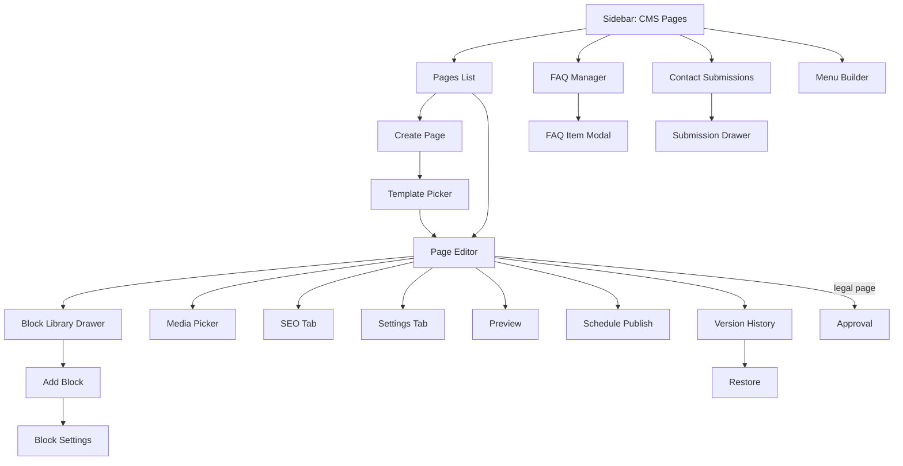
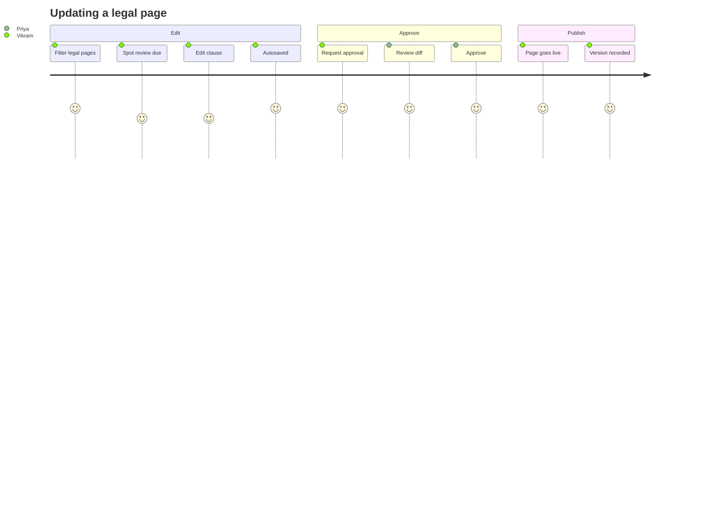
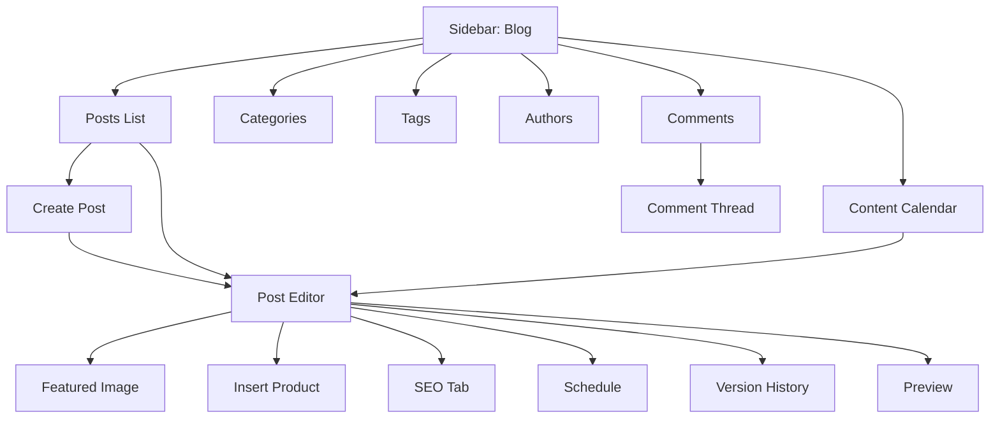
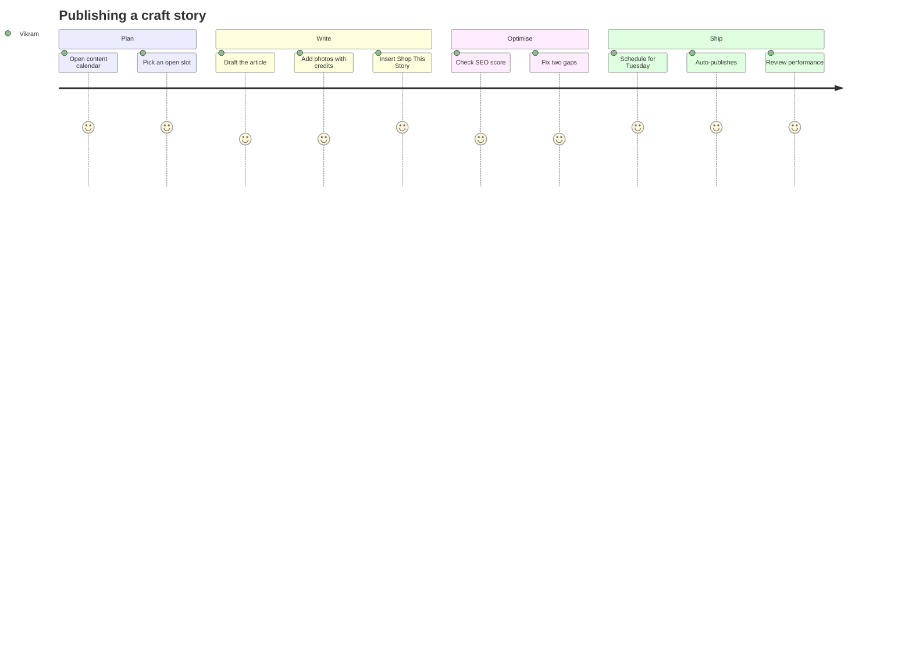
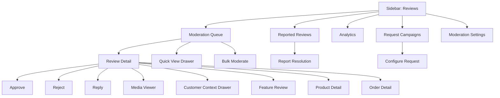
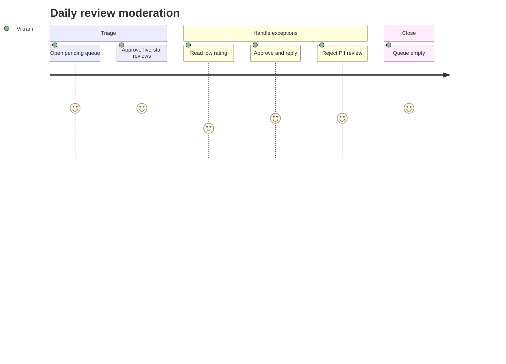
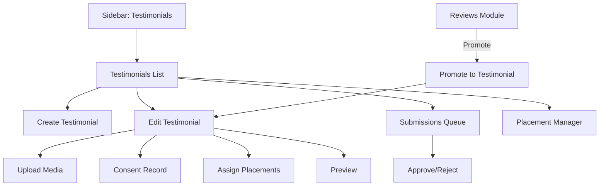
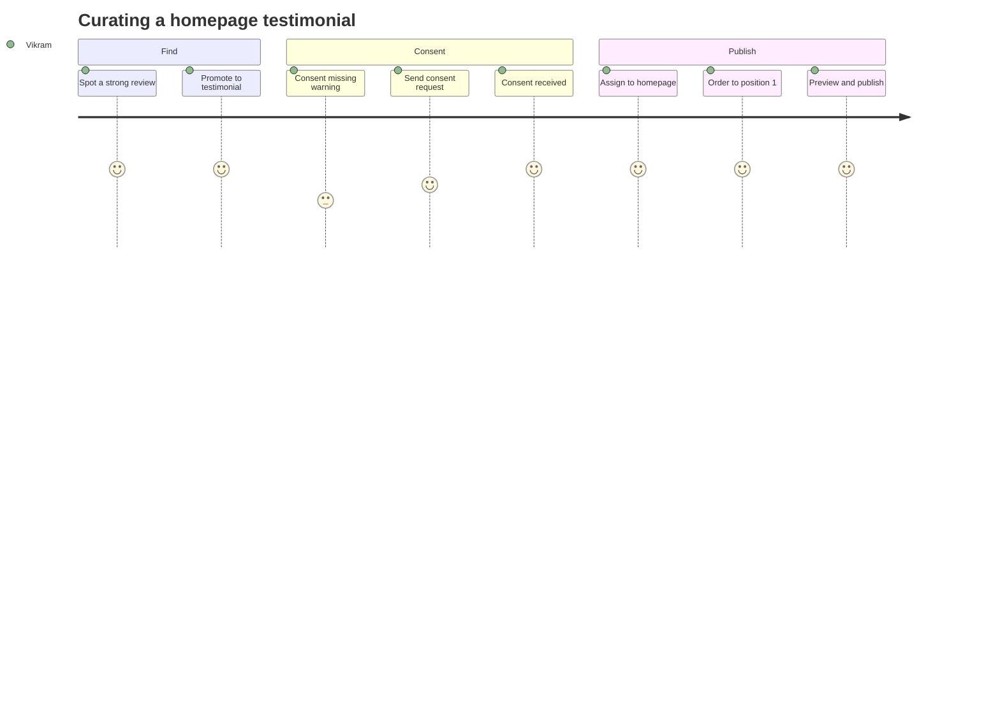

# Modules 12–15 — CMS, Blog, Reviews & Testimonials

Enterprise Handicraft E-Commerce Platform · UI/UX Design Specification

---
---

# MODULE 12 · CMS (CONTENT PAGES)

## 12.1 Business Goal

Static pages carry legal compliance (Privacy, Terms, Shipping, Return policies), trust (About Us, artisan story), and support deflection (FAQ, Contact). They must be editable by a non-technical content owner, versioned for legal traceability, and SEO-optimised because policy pages earn organic traffic and trust signals.

## 12.2 Purpose

Create and maintain storefront content pages with a block-based editor, scheduled publishing, version history, multi-language support and per-page SEO.

## 12.3 Features

| # | Feature |
|---|---------|
| CM-01 | Page CRUD with block-based/rich-text editing |
| CM-02 | Pre-seeded system pages: About Us, Contact Us, Privacy Policy, Terms & Conditions, Shipping Policy, Return & Refund Policy, FAQ |
| CM-03 | Content blocks: rich text, image, gallery, video, accordion (FAQ), CTA, product grid, artisan spotlight, testimonial strip, contact form, map, table, divider, HTML embed |
| CM-04 | Drag-and-drop block reordering |
| CM-05 | Page templates (Default, Full width, Sidebar, Landing, Legal) |
| CM-06 | Scheduled publishing and unpublishing |
| CM-07 | Version history with diff and restore |
| CM-08 | Per-page SEO with SERP preview |
| CM-09 | Multi-language content with per-locale status |
| CM-10 | Live preview (desktop/tablet/mobile, light/dark) |
| CM-11 | Approval workflow for legal pages |
| CM-12 | Menu placement (header/footer) directly from the page |
| CM-13 | FAQ manager with categories and search-weighting |
| CM-14 | Contact form submissions inbox |

## 12.4 Complete Screen List

| ID | Screen | Route | Type |
|----|--------|-------|------|
| SCR-12-01 | CMS Pages List | `/admin/cms/pages` | Page |
| SCR-12-02 | Page Editor | `/admin/cms/pages/{id}/edit` | Page (3 tabs) |
| SCR-12-03 | Page Create | `/admin/cms/pages/create` | Page |
| SCR-12-04 | FAQ Manager | `/admin/cms/faq` | Page |
| SCR-12-05 | Contact Submissions | `/admin/cms/submissions` | Page |
| SCR-12-06 | Menu Builder | `/admin/cms/menus` | Page |
| TAB-12-01 | Editor · Content | — | Tab |
| TAB-12-02 | Editor · SEO | — | Tab |
| TAB-12-03 | Editor · Settings | — | Tab |
| MOD-12-01 | Add Block | — | Modal MD |
| MOD-12-02 | Block Settings | — | Drawer/Modal MD |
| MOD-12-03 | Insert Image / Media Picker | — | Modal XL |
| MOD-12-04 | Insert Product Grid | — | Modal LG |
| MOD-12-05 | Page Template Picker | — | Modal MD |
| MOD-12-06 | Preview | — | Modal Full |
| MOD-12-07 | Schedule Publish | — | Modal SM |
| MOD-12-08 | Version History | — | Modal LG |
| MOD-12-09 | Restore Version | — | Modal SM |
| MOD-12-10 | Delete Page | — | Modal SM (guarded) |
| MOD-12-11 | Slug Change Warning | — | Modal SM |
| MOD-12-12 | Add FAQ Item | — | Modal MD |
| MOD-12-13 | Approval Request/Decision | — | Modal MD |
| MOD-12-14 | Translate Page | — | Modal LG |
| DRW-12-01 | Block Library | — | Drawer 360 |
| DRW-12-02 | Submission Detail | — | Drawer 480 |

## 12.5 Navigation Flow



## 12.6 Screen Hierarchy

```
CMS
├── Pages List (SCR-12-01)
├── Create → Template picker → Editor (SCR-12-02)
│   ├── Content tab: block canvas + block library
│   ├── SEO tab: meta, slug, SERP preview, schema
│   └── Settings tab: template, visibility, menu placement, locale
├── FAQ Manager (SCR-12-04)
├── Contact Submissions (SCR-12-05)
└── Menu Builder (SCR-12-06)
```

## 12.7 Desktop Layout

- **Pages List:** L-01 table with type tabs (All / Published / Draft / Scheduled / Legal / System).
- **Editor:** L-04-like split — left 8 cols: block canvas rendering blocks in order with hover controls; right 4 cols rail: Status/Publish card, Page settings summary, Block library toggle, SEO score. A left-edge collapsible Block Library drawer (360) opens on "Add Block".
- **FAQ Manager:** L-09 — categories list (3) + questions list (4) + editor (5).
- **Menu Builder:** L-04 — available items (5) + menu tree with drag (7).

## 12.8 Tablet Layout

Editor rail collapses to a top bar with Publish, Preview and Settings buttons; the block library opens as a bottom sheet. FAQ manager becomes two panes (categories → questions) with drill-down.

## 12.9 Mobile Layout

Page list as cards. Editing is supported for text blocks with a simplified toolbar; block reordering uses move up/down. Adding complex blocks (product grid, gallery) shows "Add this block on a larger screen". Preview is full-screen. FAQ items are fully editable on mobile.

## 12.10 Wireframe Description

### SCR-12-01 · Pages List

```
┌──────────────────────────────────────────────────────────────────────────────────────┐
│ CMS Pages                                             [Menu Builder] [+ Add Page]     │
│ 14 pages · 12 published · 1 draft · 1 scheduled                                       │
├──────────────────────────────────────────────────────────────────────────────────────┤
│ All (14) │ Published (12) │ Draft (1) │ Scheduled (1) │ Legal (5) │ System (7)        │
├──────────────────────────────────────────────────────────────────────────────────────┤
│ [⌕ Search pages] [Type▾][Status▾][Language▾] [⚙][↻]                                  │
├──────────────────────────────────────────────────────────────────────────────────────┤
│[☐]│ Page                    │ URL                │ Type  │ Updated      │ SEO │ ● │⋮ │
│[☐]│ About Us                │ /about-us          │ System│ 2 days ago   │ 92  │ ● │⋮ │
│   │ 6 blocks · EN, HI       │                    │       │ by Vikram    │     │Pub│  │
│[☐]│ Privacy Policy          │ /privacy-policy    │ Legal │ 4 months ago │ 78  │ ● │⋮ │
│   │ ⚠ Review due (12 months)│                    │       │ by Priya     │     │Pub│  │
│[☐]│ Shipping Policy         │ /shipping-policy   │ Legal │ 1 month ago  │ 84  │ ● │⋮ │
│[☐]│ FAQ                     │ /faq               │ System│ 6 days ago   │ 88  │ ● │⋮ │
│   │ 42 questions · 6 groups │                    │       │              │     │Pub│  │
│[☐]│ Artisan Stories         │ /artisan-stories   │ Custom│ 3 hours ago  │ 61  │ ○ │⋮ │
│   │ ⚠ Missing meta desc.    │                    │       │ by Vikram    │     │Drf│  │
└──────────────────────────────────────────────────────────────────────────────────────┘
```

### SCR-12-02 · Page Editor (Content tab)

```
┌──────────────────────────────────────────────────────────────────────────────────────┐
│ ◀ About Us  [● Published]      Saved 12:04 ✓   [Preview] [⋮] [Update Page]           │
│ Content │ SEO (92) │ Settings                                                         │
├──────────────────────────────────────────────────┬───────────────────────────────────┤
│ ┌─ Block Canvas ───────────────────────────────┐ │ ┌─ Publish ───────────────────┐  │
│ │ ┌──────────────────────────────────────────┐ │ │ │ Status  ⦿ Published         │  │
│ │ │ ⠿ HERO IMAGE            [⚙][⧉][🗑][▲▼]  │ │ │ │ Visibility ⦿ Public         │  │
│ │ │ [       banner 1920×600 preview      ]   │ │ │ │ Published 12 Jan 2024       │  │
│ │ └──────────────────────────────────────────┘ │ │ │ Last edit 2 days ago        │  │
│ │ ┌──────────────────────────────────────────┐ │ │ │ [Schedule] [View Live ↗]    │  │
│ │ │ ⠿ RICH TEXT             [⚙][⧉][🗑][▲▼]  │ │ │ └─────────────────────────────┘  │
│ │ │ # Our Story                              │ │ │ ┌─ Language ──────────────────┐  │
│ │ │ Karigar began in a Jaipur courtyard...   │ │ │ │ [EN ✓] [HI ✓] [+ Add]       │  │
│ │ │ 412 words                                │ │ │ │ HI updated 2 days ago       │  │
│ │ └──────────────────────────────────────────┘ │ │ └─────────────────────────────┘  │
│ │ ┌──────────────────────────────────────────┐ │ │ ┌─ Page Info ─────────────────┐  │
│ │ │ ⠿ ARTISAN SPOTLIGHT     [⚙][⧉][🗑][▲▼]  │ │ │ │ Template   Default          │  │
│ │ │ 3 artisans · grid layout                 │ │ │ │ URL /about-us         [⧉]   │  │
│ │ │ [Ram Prasad][Lakshmi D.][Mohan S.]       │ │ │ │ In menus  Footer            │  │
│ │ └──────────────────────────────────────────┘ │ │ │ Blocks    6                 │  │
│ │ ┌──────────────────────────────────────────┐ │ │ │ Words     842               │  │
│ │ │ ⠿ IMAGE GALLERY         [⚙][⧉][🗑][▲▼]  │ │ │ └─────────────────────────────┘  │
│ │ │ 8 images · masonry                       │ │ │ ┌─ Version History ───────────┐  │
│ │ └──────────────────────────────────────────┘ │ │ │ v12 · 2 days ago · Vikram   │  │
│ │ ┌──────────────────────────────────────────┐ │ │ │ v11 · 2 weeks ago · Priya   │  │
│ │ │ ⠿ CTA BANNER            [⚙][⧉][🗑][▲▼]  │ │ │ │           [View all →]      │  │
│ │ └──────────────────────────────────────────┘ │ │ └─────────────────────────────┘  │
│ │           [ + Add Block ]                    │ │                                  │
│ └──────────────────────────────────────────────┘ │                                  │
└──────────────────────────────────────────────────┴───────────────────────────────────┘
```

### SCR-12-04 · FAQ Manager

```
┌──────────────────┬─────────────────────────────────┬───────────────────────────────┐
│ CATEGORIES       │ QUESTIONS — Shipping (12)       │ EDIT QUESTION                 │
│ ⠿ General    (8) │ ⠿ How long does delivery take? ⋮│ Question *                    │
│ ⠿ Ordering  (10) │ ⠿ Do you ship internationally? ⋮│ [How long does delivery take?]│
│ ⠿ Shipping  (12) │ ⠿ What are the charges?       ⋮│ Answer *                      │
│ ⠿ Returns    (7) │ ⠿ Can I change my address?    ⋮│ [Rich text editor…          ] │
│ ⠿ Products   (9) │ ⠿ Do you deliver to my PIN?   ⋮│ Category [Shipping         ▾] │
│ ⠿ Payments   (6) │                                 │ ☑ Show on FAQ page            │
│ [+ Add Category] │ [+ Add Question]                │ ☑ Show on product pages       │
│                  │                                 │ Keywords [delivery, time  ]   │
│                  │                                 │ Helpful votes: 42 👍 3 👎     │
│                  │                                 │        [Cancel] [Save]        │
└──────────────────┴─────────────────────────────────┴───────────────────────────────┘
```

## 12.11 Header

| Screen | Title | Subtitle | Actions |
|--------|-------|----------|---------|
| Pages List | "CMS Pages" | "{n} pages · {n} published · {n} draft · {n} scheduled" | Menu Builder · **+ Add Page** |
| Editor | "{Page title}" + status | "{url} · Updated {relative} by {user} · autosave status" | Preview · `⋮` · **Update Page** / **Publish** |
| FAQ | "FAQ" | "{n} questions in {n} categories · {n} unanswered searches" | **+ Add Question** |
| Submissions | "Contact Submissions" | "{n} new · {n} this week · avg response {n}h" | Export |
| Menu Builder | "Menus" | "{n} menus · {n} items" | **Save Menu** |

## 12.12 Sidebar

`CONTENT` group → CMS Pages (badge: pages with review due or missing SEO), Blog, Testimonials, Media Library, Menus.

## 12.13 Breadcrumb

```
Dashboard / Content / CMS Pages
Dashboard / Content / CMS Pages / About Us
Dashboard / Content / CMS Pages / About Us / Edit
Dashboard / Content / FAQ / Shipping
Dashboard / Content / Contact Submissions
Dashboard / Content / Menus / Footer
```

## 12.14 Toolbar

Search (title, slug, body text) · Type filter (System / Legal / Custom / Landing) · Status filter · Language filter · Author filter · Updated date range · SEO completeness filter · Columns · Refresh.

## 12.15 Action Buttons

Add Page · Edit · Duplicate · Preview · Publish / Unpublish · Schedule · View Live · Version History · Restore Version · Translate · Delete (guarded; system pages cannot be deleted, only unpublished with a warning) · Add to Menu · Request Approval (legal) · Add Block · Duplicate Block · Delete Block · Move Block.

## 12.16 Search

Pages: matches title, slug, meta and full body content (with a snippet showing the match). FAQ: matches question, answer and keywords, and additionally surfaces "customer searches with no answer" from storefront FAQ search logs — a direct content-gap signal.

## 12.17 Filters

Status (Published, Draft, Scheduled, Archived) · Type (System, Legal, Custom, Landing) · Language and translation status (Translated / Missing / Outdated) · Template · In menu (Header/Footer/None) · SEO score band · Review due (legal pages older than 12 months) · Author · Updated range.

## 12.18 Sorting

Title, URL, Type, Updated (default desc), Published date, SEO score, Word count, Views (30d).

## 12.19 Bulk Actions

Publish · Unpublish · Add to menu · Change template · Export · Delete (custom pages only, guarded).

## 12.20 Cards / Tables / Widgets

**Pages list row:** title + block count + locales caption, URL (copyable), type chip, updated relative + author, SEO score chip (colour-banded), status chip, warning chips (Missing meta, Review due, Untranslated), actions.

**Block canvas item:** drag handle, block type label (overline), inline preview of the block's rendered content, hover toolbar (Settings, Duplicate, Delete, Move up/down), and a selected state with a 2px brand outline.

**Block library:** searchable, grouped (Text, Media, Commerce, Layout, Advanced), each entry showing an icon, name, one-line description and a small layout thumbnail.

**Version history:** list of versions with author, timestamp, change summary ("3 blocks changed, 412 words added") and a side-by-side or inline diff view.

**SEO score card:** score, checklist (title length, description length, H1 present, image alt text, internal links, word count, keyword presence, URL length).

## 12.21 Forms & Fields

| Tab | Field | Type | Required | Notes |
|-----|-------|------|----------|-------|
| Content | Page title | Text | Yes | 3–120 |
| Content | Blocks | Block canvas | ≥1 to publish | — |
| SEO | Meta title | Text | Yes to publish | ≤60 with meter |
| SEO | Meta description | Textarea | Yes to publish | ≤160 with meter |
| SEO | URL slug | Text | Yes | Unique, lowercase-hyphen; change → redirect |
| SEO | Canonical URL | URL | No | — |
| SEO | Robots index/follow | Checkboxes | No | Legal pages default to index+follow |
| SEO | OG image | Image | No | — |
| SEO | Schema type | Select | No | WebPage / FAQPage / AboutPage / ContactPage |
| Settings | Template | Select | Yes | Default / Full width / With sidebar / Landing / Legal |
| Settings | Page type | Select | Yes | Custom / Legal / System (read-only for system) |
| Settings | Visibility | Radio | Yes | Public / Private / Password-protected |
| Settings | Password | Text | Conditional | — |
| Settings | Show in menus | Multi-select | No | Header, Footer, Mobile |
| Settings | Menu label | Text | No | Defaults to the title |
| Settings | Menu position | Number | No | — |
| Settings | Show page title | Switch | No | — |
| Settings | Show breadcrumb | Switch | No | — |
| Settings | Language | Locale tabs | Yes | Per-locale content and status |
| Settings | Review reminder | Select | No | Legal pages: every 6/12/24 months |
| Publish | Status | Radio | Yes | Published / Draft / Scheduled |
| Publish | Publish at | Date-time | Conditional | — |
| Publish | Unpublish at | Date-time | No | — |

### Block-specific settings (examples)

| Block | Settings |
|-------|----------|
| Rich text | Column width (narrow/wide/full), background, padding |
| Image | Image, alt, caption, alignment, width, link, lazy-load |
| Gallery | Images, layout (grid/masonry/carousel), columns, gap, lightbox on/off |
| Video | Source (upload/YouTube/Vimeo), poster, autoplay (muted only), controls, captions file |
| Accordion/FAQ | Items (question/answer), single vs multi-open, default state |
| CTA | Heading, subtitle, button label, link, background image/colour, alignment |
| Product grid | Selection mode (manual/category/tag/bestsellers/new), count, columns, show price/rating |
| Artisan spotlight | Artisan selection, layout, show story excerpt, link to profile |
| Testimonial strip | Source (all/selected/tagged), count, layout |
| Contact form | Fields to include, recipient email, success message, spam protection |
| Map | Address, zoom, height, marker label |
| Table | Rows/columns, header row, striped, responsive behaviour |
| HTML embed | Code (Admin+ only), sandbox notice |

## 12.22 Validation Rules

| Rule | Message |
|------|---------|
| Title required | "Page title is required." |
| Slug required/unique/pattern | "URL slug is required." / "This URL is already in use." / "Use lowercase letters, numbers and hyphens." |
| Slug change | "Changing this URL will break existing links. Create a redirect?" (checked by default) |
| System page slug | "System page URLs can't be changed." |
| ≥1 block to publish | "Add at least one block before publishing." |
| Meta title/description required to publish | "Add a meta title before publishing." |
| Image alt text | "Add alt text to all images before publishing." (blocks publish) |
| Video captions | "Add captions for accessibility." (warning) |
| HTML embed | "Only administrators can add custom HTML." |
| Contact form recipient | "Enter a valid recipient email address." |
| Password-protected | "Set a password for this page." |
| Schedule | "Scheduled time must be in the future." |
| Unpublish after publish | "Unpublish time must be after the publish time." |
| Legal page publish | "Legal pages need approval from an administrator before publishing." |
| Delete system page | "System pages can't be deleted. Unpublish it instead." |
| Delete linked page | "This page is linked from the footer menu and 3 other pages. Delete anyway?" |
| Untranslated publish | "Hindi translation is missing. Publish English only?" (warning) |
| Word count | "This page has 42 words. Pages under 300 words rank poorly." (warning) |

## 12.23 Dropdowns & Data Sources

Templates (`GET /api/cms/templates`) · Locales (`GET /api/settings/locales`) · Menus (`GET /api/menus`) · Media (`GET /api/media`) · Products/Categories/Artisans (catalog APIs for commerce blocks) · Testimonials (`GET /api/testimonials`) · Schema types (static) · Block library (`GET /api/cms/blocks`).

## 12.24 Icons

CMS `file-text` · Add page `file-plus` · Blocks `layout-grid` · Rich text `type` · Image `image` · Gallery `images` · Video `video` · Accordion `chevrons-up-down` · CTA `megaphone` · Product grid `grid-3x3` · Artisan `hand-heart` · Contact form `mail` · Map `map` · Table `table` · HTML `code` · Preview `eye` · Version `history` · Translate `languages` · Menu `menu` · FAQ `circle-help` · Submissions `inbox` · Legal `scale` · Review due `calendar-clock`.

## 12.25 Pagination

Pages list 25/page. FAQ questions: all within a category (usually <30). Submissions 25/page. Version history 20 with "Load more".

## 12.26 Notifications & Toasts

Page created / updated / published / unpublished / scheduled / deleted · "Saved 12:04 PM" (autosave) · "Block added / duplicated / removed" (undo) · "Blocks reordered" (undo) · "Version restored from {date}" (undo) · "Redirect created from the old URL" · "Legal page sent for approval" · "Approval granted/rejected" · "Translation missing for Hindi" (warning) · "Alt text missing on 2 images" (blocks publish) · "New contact submission from {name}" (realtime) · "Review due: Privacy Policy was last updated 12 months ago".

## 12.27 Dialogs

Add Block (searchable library grouped by category with thumbnails) · Block settings (drawer with live canvas update) · Media picker · Product grid selector (manual picker or rule builder with a live preview count) · Template picker (visual thumbnails with layout descriptions) · Preview (device + theme + locale toggles) · Schedule · Version history (list + diff + restore) · Slug change warning · Delete page (guarded; lists inbound links) · Approval request/decision · Translate (side-by-side source and target with a "copy source" action).

## 12.28 Permission Matrix (Module 12)

| Action | Super Admin | Admin | Marketing | Content | Support | Others |
|--------|:-----------:|:-----:|:---------:|:-------:|:-------:|:------:|
| View pages | ✔ | ✔ | ✔ | ✔ | ✔ | ✖ |
| Create/edit page | ✔ | ✔ | ✖ | ✔ | ✖ | ✖ |
| Publish custom page | ✔ | ✔ | ✖ | ✔ | ✖ | ✖ |
| Publish legal page | ✔ | ✔ | ✖ | request | ✖ | ✖ |
| Edit SEO | ✔ | ✔ | ✔ | ✔ | ✖ | ✖ |
| Add HTML embed block | ✔ | ✔ | ✖ | ✖ | ✖ | ✖ |
| Manage FAQ | ✔ | ✔ | ✖ | ✔ | ✔ (suggest) | ✖ |
| View submissions | ✔ | ✔ | ✔ | ✔ | ✔ | ✖ |
| Manage menus | ✔ | ✔ | ✔ | ✔ | ✖ | ✖ |
| Delete page | ✔ | ✔ | ✖ | custom only | ✖ | ✖ |
| Restore version | ✔ | ✔ | ✖ | ✔ | ✖ | ✖ |

## 12.29 User Journey

**Vikram updates the Return Policy.** Legal sends revised wording. He opens CMS Pages, filters Legal, and sees "Return Policy · Review due". He edits the rich-text block, and autosave records a draft. Because it is a legal page, "Publish" becomes "Request Approval". Priya receives the approval notification, opens a side-by-side diff of v8 → v9 highlighting the changed clause, and approves. The page publishes, a version is recorded with both names, and the 12-month review reminder resets.



## 12.30 UX Guidelines

| ID | Guideline |
|----|-----------|
| CM-G01 | The block canvas must render an approximation of the real output, never abstract placeholders |
| CM-G02 | Autosave always; publishing is a separate, deliberate act |
| CM-G03 | Legal pages require approval and record who approved what, with a diff |
| CM-G04 | Alt text is enforced before publishing, not suggested |
| CM-G05 | Slug changes always offer a redirect |
| CM-G06 | System pages are protected from deletion and slug changes |
| CM-G07 | Version history must show what changed, not just that something changed |
| CM-G08 | Translation status is visible per locale at a glance |
| CM-G09 | Block settings open beside the canvas so the effect is immediately visible |
| CM-G10 | FAQ content gaps (unanswered searches) are surfaced to the content owner proactively |

## 12.31 Accessibility

Block canvas is a reorderable list with keyboard move support and position announcements. Each block exposes its type and index in its accessible name. The rich-text editor toolbar is a proper toolbar with documented shortcuts. Alt-text fields include inline guidance. Preview is supplementary; the underlying content is fully accessible in the editor. Video blocks require a captions file or an explicit "no dialogue" acknowledgement. Accordion blocks generate accessible disclosure markup. Contrast is checked on CTA and hero blocks.

## 12.32 Micro-interactions

Block hover reveals its toolbar with a 100ms fade · Drag lifts the block and shifts siblings · Adding a block scrolls it into view and highlights it for 1s · Block settings changes update the canvas live · Autosave indicator cycles Saving → Saved with a check that fades · SEO score animates as fields are completed · Version diff highlights additions in green and removals in red with a smooth reveal · Locale tabs show a dot for untranslated content · Publishing shows a spinner then a success dialog with the live URL.

## 12.33 Loading / Empty / Error States

Pages list: table skeleton → "No pages yet — create essential pages like About Us and Contact." + Add Page + "Create default pages" (seeds the 7 system pages). Editor: canvas skeleton of 3 block placeholders → "This page is empty — add your first block." + Add Block. FAQ: "No questions yet — answer common questions to reduce support load." Submissions: "No submissions yet." Version history: "No previous versions." Errors: standard retry with page-level fallback.

## 12.34 API & Database Dependencies

`GET/POST/PUT/DELETE /api/cms/pages` · `/api/cms/pages/{id}/publish|unpublish|schedule|duplicate` · `/api/cms/pages/{id}/versions` · `/versions/{v}/restore` · `/api/cms/pages/check-slug` · `/api/cms/blocks` · `/api/cms/templates` · `/api/cms/faq` · `/api/cms/faq/categories` · `/api/cms/faq/search-gaps` · `/api/cms/submissions` · `/api/menus` · `/api/cms/pages/{id}/translate` · `/api/cms/pages/{id}/preview-token`.

**Entities:** `CmsPages`, `CmsPageVersions`, `CmsBlocks`, `CmsBlockTypes`, `CmsTemplates`, `CmsTranslations`, `FaqCategories`, `FaqItems`, `FaqVotes`, `FaqSearchLog`, `ContactSubmissions`, `Menus`, `MenuItems`, `SeoMeta`, `UrlRedirects`, `Approvals`, `Media`.

**Notes:** blocks are stored as ordered JSON with a type discriminator so new block types need no schema change. Versions store full snapshots. Preview uses a signed token so unpublished content is viewable without exposing it publicly.

## 12.35 Figma Build Notes

**New components:** `CMP-CMS-BlockCanvasItem` (per block type × states), `CMP-CMS-BlockLibraryItem`, `CMP-CMS-BlockToolbar`, `CMP-CMS-PageListRow`, `CMP-CMS-SeoScoreCard`, `CMP-CMS-VersionRow`, `CMP-CMS-VersionDiff`, `CMP-CMS-LocaleTabs`, `CMP-CMS-TemplateCard`, `CMP-CMS-FaqRow`, `CMP-CMS-SubmissionRow`, `CMP-CMS-ApprovalBanner`.

**Auto layout:** Editor = V(Header → Tabs → H(Canvas Fill: V stack of BlockCanvasItem, gap 16 | Rail 360: Publish, Language, PageInfo, Versions)) with a left Drawer for the block library.

**Variants:** BlockCanvasItem — BlockType (14) × State (Default/Hover/Selected/Dragging/Error/Empty). PageListRow — Type (4) × Status (4) × Warning (None/MissingSeo/ReviewDue/Untranslated).

**Prototype (PT-09 segment):** Pages → Add Page → template picker → editor → Add Block → library → insert rich text → type → add gallery → media picker → reorder blocks → SEO tab → SERP preview updates → publish → legal approval path → success.

**Dev notes:** the canvas preview should reuse storefront block components where feasible so design and output stay identical; autosave must not create a version on every keystroke (debounced draft, version on explicit save/publish).

**Future scalability:** reusable global blocks (edit once, update everywhere), landing-page builder with A/B testing, content scheduling calendar shared with Blog and Offers, personalised content blocks by segment, and AI-assisted drafting for policy and story pages.

---
---

# MODULE 13 · BLOG

## 13.1 Business Goal

Blog content is the primary organic-acquisition engine for handicraft: craft stories, technique explainers, care guides, festival gifting guides and artisan profiles all attract high-intent search traffic and build the brand story that justifies premium pricing.

## 13.2 Purpose

Author, categorise, schedule and publish articles; manage blog categories, tags, authors and comments; and optimise each post for search and social sharing.

## 13.3 Features

| # | Feature |
|---|---------|
| BG-01 | Post CRUD with a full rich-text/block editor |
| BG-02 | Blog categories and tags |
| BG-03 | Author profiles with bio, photo and social links |
| BG-04 | Featured image, gallery and inline media |
| BG-05 | Scheduled publishing and post expiry |
| BG-06 | Draft, review, scheduled, published, archived workflow |
| BG-07 | Per-post SEO with SERP and social preview |
| BG-08 | Reading time and word count |
| BG-09 | Related posts (manual and automatic) |
| BG-10 | Product embedding ("shop this story") with attribution tracking |
| BG-11 | Comment moderation with spam filtering |
| BG-12 | Post performance: views, reading completion, product clicks, attributed revenue |
| BG-13 | Content calendar |
| BG-14 | Version history |
| BG-15 | Multi-language posts |

## 13.4 Complete Screen List

| ID | Screen | Route | Type |
|----|--------|-------|------|
| SCR-13-01 | Posts List | `/admin/blog/posts` | Page |
| SCR-13-02 | Post Editor | `/admin/blog/posts/{id}/edit` | Page (3 tabs) |
| SCR-13-03 | Post Create | `/admin/blog/posts/create` | Page |
| SCR-13-04 | Blog Categories | `/admin/blog/categories` | Page |
| SCR-13-05 | Blog Tags | `/admin/blog/tags` | Page |
| SCR-13-06 | Authors | `/admin/blog/authors` | Page |
| SCR-13-07 | Comments Moderation | `/admin/blog/comments` | Page |
| SCR-13-08 | Content Calendar | `/admin/blog/calendar` | Page |
| MOD-13-01 | Featured Image Picker | — | Modal LG |
| MOD-13-02 | Insert Product | — | Modal LG |
| MOD-13-03 | Insert Media | — | Modal XL |
| MOD-13-04 | Schedule Post | — | Modal SM |
| MOD-13-05 | SEO / Social Preview | — | Modal MD |
| MOD-13-06 | Related Posts Picker | — | Modal MD |
| MOD-13-07 | Add/Edit Category | — | Modal MD |
| MOD-13-08 | Add/Edit Author | — | Modal MD |
| MOD-13-09 | Delete Post | — | Modal SM (guarded) |
| MOD-13-10 | Comment Actions (approve/reject/spam) | — | Modal SM |
| MOD-13-11 | Reply to Comment | — | Modal MD |
| MOD-13-12 | Version History | — | Modal LG |
| DRW-13-01 | Post Quick View | — | Drawer 480 |
| DRW-13-02 | Comment Thread | — | Drawer 480 |

## 13.5 Navigation Flow



## 13.6 Screen Hierarchy

```
Blog
├── Posts List (SCR-13-01) — status tabs, filters
├── Editor (SCR-13-02) — Content / SEO / Settings tabs + rail
├── Categories (SCR-13-04), Tags (SCR-13-05), Authors (SCR-13-06)
├── Comments (SCR-13-07) — moderation queue
└── Content Calendar (SCR-13-08)
```

## 13.7 Desktop Layout

Posts list: L-01 table (or card grid toggle) with status tabs. Editor: L-02 (8/4) — left: title + rich editor with a sticky formatting toolbar; right rail: Publish card, Featured image card, Organisation (category/tags/author), SEO score, Related posts, Post stats. Content calendar: month grid with post chips coloured by status, drag to reschedule.

## 13.8 Tablet Layout

Editor rail collapses below the editor; the Publish card pins to the top. Calendar shows a 2-week view.

## 13.9 Mobile Layout

Post cards with featured image, title, author, status and date. Editing supports the full rich text with a compact toolbar and a "More" overflow. Calendar becomes an agenda list. Comment moderation is fully usable on mobile (approve/reject with swipe actions plus explicit buttons).

## 13.10 Wireframe Description

### SCR-13-02 · Post Editor

```
┌──────────────────────────────────────────────────────────────────────────────────────┐
│ ◀ The Art of Jaipur Blue Pottery  [◐ Draft]   Saved 12:04 ✓  [Preview] [⋮] [Publish] │
│ Content │ SEO (78) │ Settings                                                         │
├──────────────────────────────────────────────────┬───────────────────────────────────┤
│ Title *                                          │ ┌─ Publish ───────────────────┐  │
│ [The Art of Jaipur Blue Pottery              ]  │ │ Status    ◐ Draft           │  │
│ /blog/[art-of-jaipur-blue-pottery         ] ⧉   │ │ Visibility Public           │  │
│ ┌──────────────────────────────────────────────┐ │ │ Publish   [Immediately ▾]   │  │
│ │ B I U │H2 H3│ • 1. │ 🔗 🖼 ▶ 🛍 │ " ─ │ ⋯   │ │ │ [Schedule] [Save Draft]     │  │
│ ├──────────────────────────────────────────────┤ │ └─────────────────────────────┘  │
│ │ ## Where the blue comes from                 │ │ ┌─ Featured Image ────────────┐  │
│ │                                              │ │ │ [  1200×630 preview  ]      │  │
│ │ In the narrow lanes of Jaipur's old city,    │ │ │ Alt: Artisan painting a vase│  │
│ │ a craft that travelled from Persia...        │ │ │ [Replace] [Remove]          │  │
│ │                                              │ │ └─────────────────────────────┘  │
│ │ [ image: artisan at the wheel ]              │ │ ┌─ Organisation ──────────────┐  │
│ │ Caption: Ram Prasad at his wheel, Jaipur     │ │ │ Category [Craft Stories  ▾] │  │
│ │                                              │ │ │ Tags [pottery ×][jaipur ×]  │  │
│ │ ### The nine-step process                    │ │ │ Author [Vikram Rao      ▾]  │  │
│ │ 1. Preparing the dough...                    │ │ │ ☑ Featured post             │  │
│ │                                              │ │ └─────────────────────────────┘  │
│ │ ┌──────────────────────────────────────────┐ │ │ ┌─ Related Posts ─────────────┐  │
│ │ │ 🛍 SHOP THIS STORY                       │ │ │ │ • Caring for Blue Pottery   │  │
│ │ │ [img] Blue Pottery Vase      ₹1,250      │ │ │ │ • Meet Ram Prasad           │  │
│ │ │ [img] Blue Pottery Bowl Set  ₹2,100      │ │ │ │        [+ Add] [Suggest]    │  │
│ │ └──────────────────────────────────────────┘ │ │ └─────────────────────────────┘  │
│ │                                              │ │ ┌─ Stats ─────────────────────┐  │
│ │ 1,240 words · ~6 min read                    │ │ │ Views          —            │  │
│ └──────────────────────────────────────────────┘ │ │ Not published yet           │  │
│ Excerpt (shown in listings)                      │ └─────────────────────────────┘  │
│ [Blue pottery is Jaipur's most recognisable... ] │                                  │
│ 118 / 200                                        │                                  │
└──────────────────────────────────────────────────┴───────────────────────────────────┘
```

### SCR-13-07 · Comments Moderation

```
┌──────────────────────────────────────────────────────────────────────────────────────┐
│ Comments                                    24 pending · 4 flagged · 812 approved     │
├──────────────────────────────────────────────────────────────────────────────────────┤
│ Pending (24) │ Approved (812) │ Spam (36) │ Flagged (4) │ Trash                       │
├──────────────────────────────────────────────────────────────────────────────────────┤
│ ✓ 3 selected   [Approve] [Reject] [Spam] [Delete]                              [×]    │
├──────────────────────────────────────────────────────────────────────────────────────┤
│[☐] 👤 Anita R. · anita@example.com · 2 hours ago              ⚠ 2 links · first-time  │
│    On: The Art of Jaipur Blue Pottery                                                 │
│    "Beautiful article! Where can I buy the vase shown in the third photo?"             │
│    [Approve] [Reply] [Reject] [Spam]                                                   │
├──────────────────────────────────────────────────────────────────────────────────────┤
│[☐] 👤 Guest · noreply@spam.xyz · 4 hours ago                  🚩 Likely spam (94%)     │
│    "Check out cheap watches at ..."                                                    │
│    [Approve] [Reject] [Spam]                                                           │
└──────────────────────────────────────────────────────────────────────────────────────┘
```

## 13.11 Header

Posts: "Blog Posts" · "{n} posts · {n} published · {n} drafts · {n} scheduled" · Calendar · Categories · **+ New Post**.
Editor: "{Post title}" + status · "{url} · {words} words · ~{n} min read · autosave" · Preview · `⋮` · **Publish**/**Update**.
Comments: "Comments" · "{n} pending · {n} flagged" · Settings.
Calendar: "Content Calendar" · "{month} · {n} scheduled" · **+ New Post**.

## 13.12 Sidebar

`CONTENT` → Blog (badge: pending comments count).

## 13.13 Breadcrumb

```
Dashboard / Content / Blog
Dashboard / Content / Blog / The Art of Jaipur Blue Pottery
Dashboard / Content / Blog / Categories / Craft Stories
Dashboard / Content / Blog / Comments
Dashboard / Content / Blog / Calendar
```

## 13.14 Toolbar

Search (title, content, excerpt, tags) · Category filter · Author filter · Status filter · Tag filter · Date range · More filters (has featured image, has products, language, performance band) · Saved views (My Drafts, Scheduled, Top Performing, Needs Images, Untagged) · View toggle (table/grid) · Columns · Refresh.

## 13.15 Action Buttons

New Post · Edit · Duplicate · Preview · Publish / Unpublish · Schedule · View Live · Version History · Delete (guarded) · Insert Product · Insert Media · Suggest Related · Approve/Reject/Spam comment · Reply to comment · Add Category/Tag/Author · Export posts.

## 13.16 Search

Full-text across title, excerpt, body, tags and author name, with a matching snippet. Comments search matches author name, email, content and the post they belong to.

## 13.17 Filters

Status (Published, Draft, Scheduled, Under review, Archived) · Category · Tags · Author · Published date range · Language · Has featured image · Has embedded products · Comment count · Performance (views band) · Word count band.

## 13.18 Sorting

Published date (default desc), Title, Author, Category, Views (30d), Comments, Reading time, Word count, Updated, Scheduled date (asc for the Scheduled tab).

## 13.19 Bulk Actions

Publish · Unpublish · Change category · Add/remove tags · Change author · Schedule · Export · Delete (guarded). Comments: Approve · Reject · Mark spam · Delete · Assign to moderator.

## 13.20 Cards / Tables / Widgets

**Post row:** featured-image thumbnail 64×36, title + excerpt caption, category chip, author avatar + name, tags overflow, published date, views, comments count, status chip, warning chips (No featured image, No excerpt, Untagged), actions.

**Post grid card:** 16:9 featured image, category chip overlay, title (2-line clamp), excerpt (2-line), author + date, stats row, status chip.

**Comment row:** avatar, author name + email, relative time, post link, comment body (3-line clamp with expand), spam-score chip when high, flags (contains links, first-time commenter, repeated content), inline action buttons.

**Content calendar cell:** date, post chips (colour by status), "+N more" overflow, drag to reschedule, and a right-click/`⋮` to create a post on that date.

**Stats card (published posts):** views, unique readers, average read depth, average time on page, product clicks, attributed revenue, comments, shares.

## 13.21 Forms & Fields

| Section | Field | Type | Required | Notes |
|---------|-------|------|----------|-------|
| Content | Title | Text | Yes | 5–120 |
| Content | Slug | Text | Yes | Auto from title; unique; change → redirect |
| Content | Body | Rich text | Yes | ≥300 words recommended |
| Content | Excerpt | Textarea | Yes to publish | ≤200 with counter |
| Content | Featured image | Image | Yes to publish | 1200×630, alt required |
| Content | Image caption/credit | Text | No | Artisan photo credits matter |
| Organisation | Category | Select | Yes | Single primary category |
| Organisation | Tags | Tag input | No | Max 10 |
| Organisation | Author | Select | Yes | Defaults to the current user |
| Organisation | Featured post | Switch | No | Max 3 featured, enforced |
| Organisation | Language | Locale tabs | Yes | — |
| Publish | Status | Radio | Yes | Draft / Under review / Scheduled / Published |
| Publish | Publish date-time | Date-time | Conditional | — |
| Publish | Expire date-time | Date-time | No | Auto-unpublish |
| Publish | Allow comments | Switch | No | Default on |
| Publish | Pin to top | Switch | No | — |
| SEO | Meta title | Text | Yes to publish | ≤60 |
| SEO | Meta description | Textarea | Yes to publish | ≤160 |
| SEO | Focus keyword | Text | No | Drives the checklist |
| SEO | Canonical | URL | No | — |
| SEO | OG image / title / description | Image / Text | No | Falls back to featured/meta |
| SEO | Schema type | Select | No | Article / BlogPosting / HowTo / Recipe |
| Related | Related posts | Picker | No | Max 6, with "Suggest" |
| Related | Embedded products | Product picker | No | Renders the "Shop this story" block |

**Author fields:** name, slug, avatar, bio (≤500), role/title, email, social links (Instagram, X, LinkedIn, website), display on posts toggle.

**Category fields:** name, slug, description, colour, featured image, display order, show in blog nav.

## 13.22 Validation Rules

| Rule | Message |
|------|---------|
| Title required, 5–120 | "Post title is required." |
| Slug unique | "This URL is already used by another post." |
| Body required | "Add content before publishing." |
| Body word count | "This post has 120 words. Posts under 300 words rarely rank." (warning) |
| Excerpt required to publish | "Add an excerpt — it appears in listings and search results." |
| Featured image required to publish | "Add a featured image before publishing." |
| Featured image alt | "Add alt text for the featured image." |
| Category required | "Choose a category." |
| Tags ≤10 | "You can add up to 10 tags." |
| Featured posts ≤3 | "You can feature up to 3 posts. Unfeature one first." |
| Meta title/description required to publish | "Add a meta title before publishing." |
| Schedule future | "Scheduled time must be in the future." |
| Expire after publish | "Expiry must be after the publish date." |
| Embedded product exists and is published | "'{product}' is unpublished and won't show to readers." |
| Related posts exclude self | "A post can't be related to itself." |
| Delete published post | "This post has 4,218 views and 12 comments. Archive it instead?" |
| Author delete with posts | "This author has 24 posts. Reassign them first." |
| Comment reply length | "Reply can't be empty." |
| Category delete with posts | "This category has 18 posts. Move them first." |

## 13.23 Dropdowns & Data Sources

Categories (`GET /api/blog/categories`) · Tags (`GET /api/blog/tags` + create) · Authors (`GET /api/blog/authors`) · Products (catalog search) · Related posts (`GET /api/blog/posts?search=`) · Locales · Schema types (static) · Media library.

## 13.24 Icons

Blog `newspaper` · New post `pen-line` · Categories `folder` · Tags `tags` · Author `user-pen` · Comments `message-square` · Spam `shield-x` · Approve `check` · Calendar `calendar-days` · Featured `star` · Reading time `clock` · Views `eye` · Shop this story `shopping-bag` · Schedule `calendar-clock` · Pinned `pin` · Version `history` · Preview `eye`.

## 13.25 Pagination

Posts 25/page (grid 24). Comments 25/page. Categories/Tags/Authors show all. Calendar shows one month. Version history 20 + load more.

## 13.26 Notifications & Toasts

Post saved / published / scheduled / unpublished / deleted · "Saved 12:04 PM" · "Post scheduled for {date}" · "Post published — view live" · "{n} comments approved" · "Comment marked as spam" · "Reply posted" · "New comment on '{post}'" (realtime) · "Featured limit reached" · "Embedded product is unpublished" (warning) · "Related posts suggested" · "Version restored".

## 13.27 Dialogs

Featured image picker · Insert product (search + selected list + layout choice: inline card / grid / carousel) · Insert media · Schedule · SEO & social preview (Google + Facebook + X cards) · Related posts picker with "Suggest" · Category/Author editors · Delete post (guarded, shows views/comments) · Comment actions (approve/reject with optional reason, spam with training note) · Reply to comment (rich text, shows the parent) · Version history with diff.

## 13.28 Permission Matrix (Module 13)

| Action | Super Admin | Admin | Marketing | Content | Support | Others |
|--------|:-----------:|:-----:|:---------:|:-------:|:-------:|:------:|
| View posts | ✔ | ✔ | ✔ | ✔ | ✖ | ✖ |
| Create/edit own post | ✔ | ✔ | ✔ | ✔ | ✖ | ✖ |
| Edit others' posts | ✔ | ✔ | ✖ | ✔ | ✖ | ✖ |
| Publish post | ✔ | ✔ | ✖ | ✔ | ✖ | ✖ |
| Delete post | ✔ | ✔ | ✖ | own only | ✖ | ✖ |
| Manage categories/tags | ✔ | ✔ | ✖ | ✔ | ✖ | ✖ |
| Manage authors | ✔ | ✔ | ✖ | ✔ | ✖ | ✖ |
| Moderate comments | ✔ | ✔ | ✔ | ✔ | ✔ | ✖ |
| Embed products | ✔ | ✔ | ✔ | ✔ | ✖ | ✖ |
| View performance | ✔ | ✔ | ✔ | ✔ | ✖ | ✖ |

## 13.29 User Journey

**Vikram publishes a craft story.** He opens the Content Calendar, sees an empty slot next Tuesday, and clicks the date to create a post. He writes "The Art of Jaipur Blue Pottery", inserts photos with captions crediting the artisan, and uses "Insert Product" to add a Shop This Story block with three vases. The SEO tab shows 78/100 with two gaps — the focus keyword is missing from an H2 and the meta description is short. He fixes both and the score rises to 94. He schedules the post for Tuesday 9 AM. On publication day it goes live automatically, and two days later the stats card shows 1,204 views, 62% average read depth and ₹18,400 in attributed product revenue.



## 13.30 UX Guidelines

BG-G01 Reading time and word count are always visible — they shape editorial decisions. BG-G02 SEO guidance is specific and actionable, never a bare score. BG-G03 Embedded products must warn when unpublished or out of stock. BG-G04 Autosave always; publishing is deliberate. BG-G05 Comment moderation must show spam signals, not just a score. BG-G06 The calendar is the planning surface — creating from a date must be one click. BG-G07 Photo credits for artisan images are a first-class field, not a caption afterthought. BG-G08 Featured-post limits are enforced with a clear path to resolve.

## 13.31 Accessibility

The rich-text editor exposes a full keyboard shortcut set and a proper toolbar widget. Headings inserted by the editor maintain hierarchy and warn on skipped levels. Featured image alt text is required. The calendar is a grid with keyboard navigation and date announcements; drag-to-reschedule has a "Move to date" alternative. Comment actions have accessible labels including the commenter's name. Spam-score chips include text. Social preview cards are marked as previews with text equivalents.

## 13.32 Micro-interactions

Word count and reading time update live · SEO score animates with each fix and the resolved checklist item strikes through · Inserting a product animates the block into place · Autosave indicator cycles · Calendar drag shows a ghost chip and highlights the target date · Approving a comment slides the row out of the pending list with a success tint and decrements the badge · Featured toggle shows a star fill animation · Publish shows a spinner then a success dialog with the live URL and share actions.

## 13.33 Loading / Empty / Error States

Posts: table/grid skeleton → "No posts yet — share craft stories to attract and engage customers." + Write Post. Editor: skeleton. Comments: "No comments waiting — you're all caught up 🎉". Categories: "No categories yet". Authors: "No authors yet — add the people behind your stories." Calendar: skeleton grid → "Nothing scheduled this month." Errors: standard retry.

## 13.34 API & Database Dependencies

`GET/POST/PUT/DELETE /api/blog/posts` · `/{id}/publish|unpublish|schedule|duplicate` · `/{id}/versions` · `/api/blog/categories` · `/api/blog/tags` · `/api/blog/authors` · `/api/blog/comments` · `/comments/{id}/approve|reject|spam|reply` · `/api/blog/calendar` · `/api/blog/posts/{id}/stats` · `/api/blog/posts/check-slug` · `/api/blog/posts/{id}/preview-token`.

**Entities:** `BlogPosts`, `BlogPostVersions`, `BlogCategories`, `BlogTags`, `BlogPostTags`, `BlogAuthors`, `BlogComments`, `BlogCommentFlags`, `BlogPostProducts`, `BlogPostRelated`, `BlogPostStats`, `SeoMeta`, `UrlRedirects`, `Media`.

**Notes:** attributed revenue links `BlogPostProducts` clicks to orders via a session attribution window (configurable, default 7 days). Spam scoring runs server-side on submission. Scheduled publishing runs on a background job with a small grace window and logs failures visibly.

## 13.35 Figma Build Notes

**New components:** `CMP-BLG-PostRow`, `CMP-BLG-PostCard`, `CMP-BLG-EditorToolbar`, `CMP-BLG-ShopThisStoryBlock`, `CMP-BLG-SeoChecklist`, `CMP-BLG-SocialPreviewCard` (Google/Facebook/X variants), `CMP-BLG-CommentRow` (with spam signals), `CMP-BLG-CalendarCell`, `CMP-BLG-CalendarChip` (status colours), `CMP-BLG-AuthorCard`, `CMP-BLG-ReadingStats`.

**Auto layout:** Editor = V(Header → Tabs → H(Main Fill: Title, Slug, Editor, Excerpt | Rail 360: Publish, FeaturedImage, Organisation, Related, Stats)).

**Variants:** PostRow — Status (5) × Warning (None/NoImage/NoExcerpt/Untagged) × Featured (Y/N). CommentRow — State (Pending/Approved/Spam/Flagged) × SpamScore (Low/Medium/High) × FirstTime (Y/N). CalendarChip — Status (5) × Density (1–3 per cell).

**Prototype:** Calendar → click date → new post → write → insert product → SEO tab → fix issues → schedule → confirmation → Comments queue → approve one → badge decrements.

**Dev notes:** editor content stored as portable rich-text JSON, not raw HTML, so it can render safely across surfaces; scheduled publishing must be idempotent; preview tokens expire in 24h.

**Future scalability:** editorial workflow with assignments and due dates, AI-assisted outlines and meta generation, newsletter auto-composition from recent posts, podcast/video post types, and reader-facing content personalisation.

---
---

# MODULE 14 · REVIEWS

## 14.1 Business Goal

Reviews are the highest-leverage conversion asset in handicraft, where buyers cannot touch the product. Volume, authenticity and visible responsiveness all raise conversion. Moderation must be fast enough not to delay social proof, and strict enough to protect trust.

## 14.2 Purpose

Collect, moderate, respond to and analyse product reviews and ratings; manage abuse reports; and drive review volume through post-purchase requests.

## 14.3 Features

| # | Feature |
|---|---------|
| RV-01 | Review moderation queue (pending / approved / rejected / reported) |
| RV-02 | Star ratings with optional sub-ratings (quality, value, accuracy of photos, craftsmanship) |
| RV-03 | Customer photos and videos in reviews with moderation |
| RV-04 | Verified-purchase badge |
| RV-05 | Admin/brand replies published under the review |
| RV-06 | Abuse reporting with reason and resolution |
| RV-07 | Auto-moderation rules (profanity, links, minimum length, spam score) |
| RV-08 | Bulk approve/reject |
| RV-09 | Review request campaigns (post-delivery email/SMS) with reminders |
| RV-10 | Incentives (reward points for reviews) with disclosure |
| RV-11 | Rating analytics: distribution, trend, per-product, per-category, per-artisan |
| RV-12 | Low-rating alerts routed to Support |
| RV-13 | Featured reviews for product pages and homepage |
| RV-14 | Import/export reviews |

## 14.4 Complete Screen List

| ID | Screen | Route | Type |
|----|--------|-------|------|
| SCR-14-01 | Reviews List / Moderation Queue | `/admin/reviews` | Page |
| SCR-14-02 | Review Detail | `/admin/reviews/{id}` | Page |
| SCR-14-03 | Reported Reviews | `/admin/reviews/reported` | Page |
| SCR-14-04 | Review Analytics | `/admin/reviews/analytics` | Page |
| SCR-14-05 | Review Request Campaigns | `/admin/reviews/requests` | Page |
| SCR-14-06 | Moderation Settings | `/admin/reviews/settings` | Page |
| MOD-14-01 | Approve Review | — | Modal SM |
| MOD-14-02 | Reject Review | — | Modal MD |
| MOD-14-03 | Reply to Review | — | Modal MD |
| MOD-14-04 | Report Resolution | — | Modal MD |
| MOD-14-05 | Bulk Moderate | — | Modal MD |
| MOD-14-06 | Media Viewer (review photos) | — | Modal Full |
| MOD-14-07 | Feature Review | — | Modal SM |
| MOD-14-08 | Delete Review | — | Modal SM (guarded) |
| MOD-14-09 | Configure Review Request | — | Modal MD |
| MOD-14-10 | Award Points for Review | — | Modal SM |
| DRW-14-01 | Review Quick View | — | Drawer 480 |
| DRW-14-02 | Customer Context | — | Drawer 480 |

## 14.5 Navigation Flow



## 14.6 Screen Hierarchy

```
Reviews
├── Moderation Queue (SCR-14-01) — status tabs, rating filter, bulk actions
├── Review Detail (SCR-14-02) — review, media, customer/order context, actions, history
├── Reported (SCR-14-03)
├── Analytics (SCR-14-04)
├── Request Campaigns (SCR-14-05)
└── Moderation Settings (SCR-14-06)
```

## 14.7 Desktop Layout

Queue: L-01 with a KPI strip (average rating, pending count, approval rate, response rate, reviews this month) and a card-style list (reviews read better as cards than table rows). Detail: L-02 — left: review content, media, sub-ratings, reply thread, moderation history; right rail: product card, customer card with review history, order card with verification status, quick actions. Analytics: L-07 widget grid.

## 14.8 Tablet Layout

Cards go full width; the rail moves below. Bulk selection remains available. Media viewer is full-screen.

## 14.9 Mobile Layout

Review cards optimised for fast triage: rating stars, product thumbnail, title, 3-line body clamp, photo thumbnails, verified badge, and prominent Approve/Reject buttons. Swipe right to approve, left to reject, both with an undo toast — explicit buttons always remain.

## 14.10 Wireframe Description

### SCR-14-01 · Moderation Queue

```
┌──────────────────────────────────────────────────────────────────────────────────────┐
│ Reviews                                    [Analytics] [Requests] [Settings]          │
│ ★4.6 average · 24 pending · 812 approved · 94% approval rate · 68% reply rate         │
├──────────────────────────────────────────────────────────────────────────────────────┤
│ Pending (24) │ Approved (812) │ Rejected (36) │ Reported (4) │ All                    │
├──────────────────────────────────────────────────────────────────────────────────────┤
│ [⌕ Search reviews] [Rating▾][Product▾][Date▾][Has photos] [+More] [⚙][↻]             │
├──────────────────────────────────────────────────────────────────────────────────────┤
│ ✓ 3 selected  [Approve All] [Reject All] [Delete]                              [×]    │
├──────────────────────────────────────────────────────────────────────────────────────┤
│ ┌──────────────────────────────────────────────────────────────────────────────────┐ │
│ │[☐] ★★★★★  "Beautiful craftsmanship"            ✓ Verified purchase  2 hours ago  │ │
│ │    👤 Meera Nair  ·  [img] Blue Pottery Vase  ·  Order #HC-2026-000412            │ │
│ │    "The colours are even richer than the photos. You can see the brush strokes    │ │
│ │     where the artisan painted it. Packaging was excellent — arrived perfect."     │ │
│ │    Quality ★★★★★  Value ★★★★☆  As pictured ★★★★★                                 │ │
│ │    [📷][📷] 2 photos                                                              │ │
│ │    [Approve] [Reply] [Reject] [⋮]                                                 │ │
│ └──────────────────────────────────────────────────────────────────────────────────┘ │
│ ┌──────────────────────────────────────────────────────────────────────────────────┐ │
│ │[☐] ★★☆☆☆  "Smaller than expected"    ✓ Verified   ⚠ Low rating   5 hours ago     │ │
│ │    👤 Rahul Mehta · [img] Brass Diya Set · Order #HC-2026-000398                  │ │
│ │    "Nice quality but much smaller than I imagined from the photos."               │ │
│ │    ⚠ Low rating — Support notified                                                │ │
│ │    [Approve] [Reply] [Reject] [⋮]                                                 │ │
│ └──────────────────────────────────────────────────────────────────────────────────┘ │
└──────────────────────────────────────────────────────────────────────────────────────┘
```

### SCR-14-04 · Review Analytics

```
┌────────────────┬────────────────┬────────────────┬────────────────┬──────────────────┐
│ AVERAGE RATING │ TOTAL REVIEWS  │ REVIEW RATE    │ REPLY RATE     │ WITH PHOTOS      │
│ ★ 4.6          │ 852            │ 18.4%          │ 68%            │ 42%              │
│ ▲ 0.2 vs prev  │ ▲ 124 this mo  │ of delivered   │ ▲ 12pp         │ ▲ 8pp            │
├────────────────┴────────────────┴────────────────┴────────────────┴──────────────────┤
│ Rating distribution                    │ Rating trend (12 months)                     │
│ ★★★★★ ████████████████████ 612 (72%)   │  5.0 ┤        ╭───────                       │
│ ★★★★☆ ███████ 148 (17%)                │  4.5 ┤ ╭──────╯                              │
│ ★★★☆☆ ██ 48 (6%)                       │  4.0 ┤─╯                                     │
│ ★★☆☆☆ █ 28 (3%)                        │  3.5 ┼────────────────────────                │
│ ★☆☆☆☆ ▏16 (2%)                         │      Sep  Nov  Jan  Mar  May  Jul            │
├──────────────────────────────────────────────────────────────────────────────────────┤
│ Lowest-rated products              │ Most-reviewed products    │ By artisan            │
│ Terracotta Planter    ★3.2 (18)    │ Blue Pottery Vase  (124)  │ Ram Prasad ★4.8 (212) │
│ Jute Rug              ★3.6 (24)    │ Brass Diya Set     ( 98)  │ Lakshmi D. ★4.7 (168) │
└──────────────────────────────────────────────────────────────────────────────────────┘
```

## 14.11 Header

Queue: "Reviews" · "★{avg} average · {n} pending · {n} approved · {p}% approval rate" · Analytics · Requests · Settings.
Detail: "Review by {customer}" + status chip · "{product} · Order #{n} · {relative}" + record nav · `⋮` · **Approve**.
Analytics: "Review Analytics" · date range · Export.
Requests: "Review Requests" · "{n} sent this month · {p}% conversion" · **+ New Campaign**.

## 14.12 Sidebar

`CATALOG` → Reviews (badge: pending count, danger tone if any are reported).

## 14.13 Breadcrumb

```
Dashboard / Catalog / Reviews
Dashboard / Catalog / Reviews / Review by Meera Nair
Dashboard / Catalog / Reviews / Reported
Dashboard / Catalog / Reviews / Analytics
Dashboard / Catalog / Reviews / Requests
```

## 14.14 Toolbar

Search (review title/body, customer name/email, product name/SKU, order number) · Rating filter (star selector) · Product/Category filter · Status filter · Date range · Has photos/videos toggle · Verified-purchase toggle · More filters · Saved views (Pending, Low Ratings, With Photos, Unanswered, Reported) · Density · Refresh.

## 14.15 Action Buttons

Approve · Reject (with reason) · Reply · Edit reply · Feature review · Unfeature · Report resolution (Uphold/Remove) · Delete (guarded) · Award points · View product · View order · View customer · Bulk approve/reject · Export · Configure request campaign · Configure auto-moderation.

## 14.16 Search

Matches review title and body, customer name/email, product name/SKU and order number. Highlighted snippets. Searching a product name shows all its reviews with the average rating in the header.

## 14.17 Filters

Status (Pending, Approved, Rejected, Reported, Hidden) · Rating (1–5, multi) · Product · Category · Artisan · Verified purchase · Has photos · Has video · Has reply · Date range · Auto-moderation flag (profanity, links, spam score) · Customer (repeat reviewer) · Language · Featured.

## 14.18 Sorting

Date (default desc), Rating (asc default for the "Low Ratings" view), Helpful votes, Product, Photos count, Reply status, Pending age (oldest first — default in the moderation queue to guarantee SLA).

## 14.19 Bulk Actions

Approve · Reject with a shared reason · Delete · Feature · Export · Send reply template (personalised by merge tags, with an explicit warning that replies are public).

## 14.20 Cards / Tables / Widgets

**Review card:** star rating (large), title, verified badge, relative time, customer avatar + name, product thumbnail + name (link), order link, body with a 4-line clamp and expand, sub-rating rows, photo thumbnails (click opens the viewer), moderation flags (low rating, profanity, links, first review), helpful votes, reply block if present, action row.

**Reply block:** indented under the review, brand avatar, "Reply from {Store}", body, timestamp, edit/delete actions, and a "Public" label so the moderator never forgets the audience.

**Moderation flags:** chips such as `Low rating`, `Contains links`, `Possible profanity`, `Spam score 82%`, `First-time reviewer`, `Unverified purchase`, `Duplicate text`.

**Analytics widgets:** average rating with trend, review volume, review rate (reviews ÷ delivered orders), reply rate, photo rate, rating distribution bars, rating trend line, lowest-rated products, most-reviewed products, rating by artisan, rating by category, time-to-moderate.

## 14.21 Forms & Fields

**Reject review:** reason select (Inappropriate language, Spam or promotional, Irrelevant to the product, Personal information included, Fake or incentivised, Duplicate, Competitor content, Other), reason detail (required for Other, min 10), notify customer toggle with a template preview, "Block this customer from reviewing" toggle (Admin+).

**Reply:** reply body (rich-lite, ≤1,000 chars), template select (Thank you / Apology + resolution / Clarification / Care instructions), signature select, "Publish immediately" vs "Save draft", and a prominent notice: "This reply is public on the product page."

**Report resolution:** report reason (read-only), reporter details, decision radio (Uphold review / Remove review / Edit and keep), note to reporter (optional), and notify toggles.

**Review request campaign:** trigger (days after delivery, default 5), channels (Email/SMS/WhatsApp), template, reminder (days after first, max 2 reminders), incentive (none / reward points with amount), exclusions (customers who already reviewed, low-value orders, cancelled/returned orders), send window (time of day), and a preview.

**Moderation settings:** auto-approve rules (verified purchase + rating ≥4 + no flags), profanity list, link policy (block/flag), minimum length, spam threshold, low-rating alert threshold and recipients, display rules (show rating on product pages, minimum reviews before displaying an average), incentive disclosure text.

## 14.22 Validation Rules

| Rule | Message |
|------|---------|
| Reject reason required | "Select a reason for rejecting this review." |
| Reject reason detail | "Add at least 10 characters explaining the rejection." |
| Reply required | "Reply can't be empty." |
| Reply ≤1000 | "Reply must be 1,000 characters or fewer." |
| Reply contains PII | "Your reply appears to contain a phone number or email. Remove it before publishing." |
| Feature limit | "You can feature up to 12 reviews. Unfeature one first." |
| Delete approved review | "This review is visible to customers and has 24 helpful votes. Delete anyway?" |
| Request trigger days | "Choose between 1 and 60 days after delivery." |
| Reminder count | "You can send up to 2 reminders." |
| Incentive points | "Points must be between 1 and 1,000." |
| Incentive disclosure | "Incentivised reviews must be disclosed. Add disclosure text." (enforced) |
| Auto-approve rating threshold | "Auto-approve threshold must be between 1 and 5." |
| Low-rating alert recipients | "Add at least one recipient for low-rating alerts." |

## 14.23 Dropdowns & Data Sources

Reject reasons (`GET /api/settings/reason-codes?type=review-reject`) · Reply templates (`GET /api/notification-templates?entity=review`) · Products (catalog search) · Artisans · Categories · Customers · Channels/templates for campaigns.

## 14.24 Icons

Reviews `message-square-quote` · Rating `star` · Verified `badge-check` · Approve `check` · Reject `x` · Reply `reply` · Report `flag` · Spam `shield-x` · Photos `image` · Video `video` · Helpful `thumbs-up` · Featured `star` (filled brass) · Low rating `trending-down` · Analytics `chart-column` · Request `send` · Points `gem` · Settings `settings-2`.

## 14.25 Pagination

Queue 25/page (cards). Analytics uses no pagination. Reported 25/page. Requests 25/page. Mobile: infinite scroll.

## 14.26 Notifications & Toasts

"Review approved — now visible on {product}" · "Review rejected · customer notified" · "{n} reviews approved" (undo) · "Reply published" · "Reply is public on the product page" (info on open) · "Review featured" · "Report resolved" · "New review received ★2 on {product}" (realtime, warning tone for low ratings) · "Low rating alert sent to Support" · "Review request campaign started — {n} customers" · "Points awarded to {customer}" · "Auto-moderation approved {n} reviews overnight".

## 14.27 Dialogs

Approve (simple confirm showing where it will appear, with an option to also feature) · Reject (reason form) · Reply (with the public-visibility notice and preview of how it renders) · Report resolution · Bulk moderate (count + shared reason + per-item exclusion list) · Media viewer (full-screen with next/prev, download, "remove this photo" moderation action) · Feature review (choose placement: product page top / homepage / category page) · Delete (guarded) · Award points · Configure request campaign.

## 14.28 Permission Matrix (Module 14)

| Action | Super Admin | Admin | Product | Marketing | Support | Content | Others |
|--------|:-----------:|:-----:|:-------:|:---------:|:-------:|:-------:|:------:|
| View reviews | ✔ | ✔ | ✔ | ✔ | ✔ | ✔ | ✖ |
| Approve/reject | ✔ | ✔ | ✖ | ✖ | ✔ | ✔ | ✖ |
| Reply | ✔ | ✔ | ✖ | ✔ | ✔ | ✔ | ✖ |
| Feature review | ✔ | ✔ | ✔ | ✔ | ✖ | ✔ | ✖ |
| Delete review | ✔ | ✔ | ✖ | ✖ | ✖ | ✖ | ✖ |
| Resolve reports | ✔ | ✔ | ✖ | ✖ | ✔ | ✔ | ✖ |
| Configure moderation | ✔ | ✔ | ✖ | ✖ | ✖ | ✖ | ✖ |
| Run request campaigns | ✔ | ✔ | ✖ | ✔ | ✖ | ✖ | ✖ |
| Award points | ✔ | ✔ | ✖ | ✔ | ✖ | ✖ | ✖ |
| View analytics | ✔ | ✔ | ✔ | ✔ | ✔ | ✔ | ✖ |

## 14.29 User Journey

**Vikram's morning moderation.** 24 reviews are pending, sorted oldest first. He works the queue as cards: most are five-star with photos and are approved in one click each. One two-star review flags "Low rating — Support notified"; he approves it (authentic negative reviews build trust) and writes a reply apologising for the size confusion, noting that dimensions are listed on the product page and offering an exchange — the dialog reminds him the reply is public. One review contains a phone number; he rejects it with the reason "Personal information included" and the customer receives a templated explanation. Total: 24 reviews in under eight minutes.



## 14.30 UX Guidelines

RV-G01 Never hide negative reviews — the workflow must make approving them as easy as approving positive ones. RV-G02 Reply dialogs must state prominently that replies are public. RV-G03 Verified-purchase status must be visible at a glance. RV-G04 Auto-moderation flags explain themselves, never just a score. RV-G05 Moderation is oldest-first by default so no review waits indefinitely. RV-G06 Incentivised reviews require disclosure — enforced, not optional. RV-G07 Low ratings automatically alert Support so service recovery starts immediately. RV-G08 Review photos are a conversion asset — surface them prominently in moderation and allow selective removal rather than rejecting the whole review.

## 14.31 Accessibility

Star ratings expose their numeric value in the accessible name ("5 out of 5 stars"). Approve/reject buttons include the reviewer and product in their accessible labels. Swipe actions on mobile always have button equivalents. The media viewer supports keyboard navigation and announces "photo 2 of 3". Moderation flags are text chips. Bulk selection announces scope. Rating distribution bars have an accessible table alternative.

## 14.32 Micro-interactions

Approving a card collapses it out of the queue with a success tint and decrements the badge · Star ratings render with a subtle fill animation on load · Photo thumbnails zoom slightly on hover · Reply composer expands smoothly with a live character counter · Low-rating cards have a persistent warning left border · Bulk approve shows a progress toast with a running count · The queue-empty state shows a small celebratory illustration.

## 14.33 Loading / Empty / Error States

Queue: card skeletons (4) → "No reviews waiting — you're all caught up 🎉". All tab empty: "No reviews yet — customer reviews will appear here for moderation." + "Set up review requests". Reported: "No reported reviews." Analytics: skeleton widgets → "Not enough reviews yet to show trends." Requests: "No campaigns yet — ask customers for reviews after delivery." + Create Campaign. Errors: standard retry.

## 14.34 API & Database Dependencies

`GET /api/reviews?status&rating&product&hasPhotos&verified&date&page&sort` · `/api/reviews/{id}` · `POST /{id}/approve|reject|reply|feature|report-resolve` · `DELETE /{id}` · `POST /api/reviews/bulk/approve|reject` · `GET /api/reviews/analytics` · `GET/POST /api/reviews/requests` · `GET/PUT /api/reviews/settings` · `POST /api/reviews/{id}/award-points`.

**Entities:** `Reviews`, `ReviewSubRatings`, `ReviewMedia`, `ReviewReplies`, `ReviewReports`, `ReviewVotes`, `ReviewModerationLog`, `ReviewRequests`, `ReviewSettings`, `Products`, `Orders`, `Customers`, `RewardPointTransactions`.

**Notes:** verified-purchase status is derived from a delivered order containing the product. Product average ratings are denormalised and recalculated on approval/rejection/deletion. Auto-moderation runs on submission and writes its reasoning to the moderation log so decisions are explainable.

## 14.35 Figma Build Notes

**New components:** `CMP-RVW-Card` (full moderation card), `CMP-RVW-StarRating` (display/interactive, sizes), `CMP-RVW-SubRatingRow`, `CMP-RVW-VerifiedBadge`, `CMP-RVW-ModerationFlag`, `CMP-RVW-ReplyBlock`, `CMP-RVW-PhotoStrip`, `CMP-RVW-DistributionBars`, `CMP-RVW-QueueEmpty`, `CMP-RVW-RequestCampaignCard`.

**Auto layout:** Queue = V(Header → KPI strip → Tabs → Toolbar → BulkBar → V stack of RVW-Card, gap 16 → Pagination).

**Variants:** RVW-Card — Rating (1–5) × Status (Pending/Approved/Rejected/Reported) × HasMedia (Y/N) × Verified (Y/N) × HasReply (Y/N) × Flags (None/Low/Profanity/Links/Spam).

**Prototype:** Queue → approve a 5-star card (collapse animation) → open a 2-star card → Reply modal (public notice) → publish → reject a PII review with reason → queue empty state.

**Dev notes:** moderation actions must be idempotent and logged; product rating aggregates update transactionally; review media is moderated individually so one bad photo does not force rejecting a good review.

**Future scalability:** AI-assisted moderation suggestions with human confirmation, sentiment and theme extraction across reviews, review syndication to Google Shopping, Q&A alongside reviews, and artisan-level review pages.

---
---

# MODULE 15 · TESTIMONIALS

## 15.1 Business Goal

Testimonials are curated, brand-level social proof used on the homepage, About page and landing pages — distinct from product reviews. They carry the emotional story (gifting, heirloom, supporting artisans) that product reviews rarely capture.

## 15.2 Purpose

Collect, curate and publish customer testimonials with photos and video, control where they appear, and keep them fresh.

## 15.3 Features

| # | Feature | |
|---|---------|---|
| TS-01 | Testimonial CRUD with photo and video support | |
| TS-02 | Source: manual entry, promoted from a review, or submitted via a storefront form | |
| TS-03 | Placement control (homepage, about page, category pages, landing pages, footer strip) | |
| TS-04 | Display ordering with drag-and-drop | |
| TS-05 | Approval workflow for submitted testimonials | |
| TS-06 | Consent capture and record (name, photo, publication permission) | |
| TS-07 | Rich attribution: name, city, occupation, purchased product link | |
| TS-08 | Video testimonials with poster frame and captions | |
| TS-09 | Rotation/scheduling to keep content fresh | |
| TS-10 | Performance: impressions and influence on conversion (where measurable) | |

## 15.4 Complete Screen List

| ID | Screen | Route | Type |
|----|--------|-------|------|
| SCR-15-01 | Testimonials List | `/admin/testimonials` | Page |
| SCR-15-02 | Testimonial Create/Edit | `/admin/testimonials/create` · `/{id}/edit` | Page |
| SCR-15-03 | Submissions Queue | `/admin/testimonials/submissions` | Page |
| SCR-15-04 | Placement Manager | `/admin/testimonials/placements` | Page |
| SCR-15-05 | Testimonial Detail | `/admin/testimonials/{id}` | Page |
| MOD-15-01 | Promote Review to Testimonial | — | Modal MD |
| MOD-15-02 | Upload Photo / Video | — | Modal LG |
| MOD-15-03 | Consent Record | — | Modal MD |
| MOD-15-04 | Approve / Reject Submission | — | Modal MD |
| MOD-15-05 | Assign Placements | — | Modal MD |
| MOD-15-06 | Preview | — | Modal Full |
| MOD-15-07 | Delete Testimonial | — | Modal SM |
| MOD-15-08 | Reorder (Move to position) | — | Modal XS |
| DRW-15-01 | Testimonial Quick View | — | Drawer 480 |

## 15.5 Navigation Flow



## 15.6 Screen Hierarchy

```
Testimonials
├── List (SCR-15-01) — grid with drag ordering, status tabs
├── Create/Edit (SCR-15-02) — content, media, attribution, consent, placements
├── Submissions Queue (SCR-15-03)
├── Placement Manager (SCR-15-04) — what shows where, in what order
└── Detail (SCR-15-05)
```

## 15.7 Desktop Layout

List: card grid (3–4 columns) with drag ordering, status tabs (All / Published / Draft / Pending submission / Archived). Editor: L-02 — left: quote, attribution, media; right rail: status, placements, consent, preview. Placement Manager: L-04 — placements list (5) + assigned testimonials with drag ordering and a live preview (7).

## 15.8 Tablet Layout

Grid at 2 columns; editor rail below; placement manager becomes stacked with a placement selector.

## 15.9 Mobile Layout

Single-column cards. Reordering via move up/down. Video upload supported; recording from the device camera is offered. Preview full-screen.

## 15.10 Wireframe Description

### SCR-15-01 · Testimonials List

```
┌──────────────────────────────────────────────────────────────────────────────────────┐
│ Testimonials                        [Submissions (3)] [Placements] [+ Add Testimonial]│
│ 18 published · 3 pending · shown on 4 placements                                      │
├──────────────────────────────────────────────────────────────────────────────────────┤
│ All (24) │ Published (18) │ Draft (3) │ Pending (3) │ Archived (0)                    │
├──────────────────────────────────────────────────────────────────────────────────────┤
│ ┌─────────────────────────┐ ┌─────────────────────────┐ ┌─────────────────────────┐  │
│ │⠿ ❝                    ⋮ │ │⠿ ❝  ▶ VIDEO           ⋮ │ │⠿ ❝                    ⋮ │  │
│ │ "I gifted the brass     │ │ [ video poster frame ]  │ │ "Knowing the name of    │  │
│ │  diya set to my mother  │ │                         │ │  the artisan who made   │  │
│ │  and she cried. It felt │ │ "The unboxing felt like │ │  my shawl changed how   │  │
│ │  like a piece of home." │ │  opening a gift."       │ │  I see it."             │  │
│ │                         │ │                         │ │                         │  │
│ │ 👤 Meera N. · Bengaluru │ │ 👤 Arjun K. · Mumbai    │ │ 👤 Sara T. · Delhi      │  │
│ │ Bought: Brass Diya Set  │ │ Bought: Kantha Cushion  │ │ Bought: Pashmina Shawl  │  │
│ │ ● Published · Homepage  │ │ ● Published · Home,About│ │ ◐ Draft                 │  │
│ │ ✓ Consent on file       │ │ ✓ Consent on file       │ │ ⚠ Consent missing       │  │
│ └─────────────────────────┘ └─────────────────────────┘ └─────────────────────────┘  │
└──────────────────────────────────────────────────────────────────────────────────────┘
```

### SCR-15-04 · Placement Manager

```
┌──────────────────────┬───────────────────────────────────┬──────────────────────────┐
│ PLACEMENTS           │ ASSIGNED — Homepage (6)           │ LIVE PREVIEW             │
│ ▸ Homepage      (6)  │ ⠿ 1 Meera N. — "I gifted..."   ⋮ │ ┌──────────────────────┐ │
│ ▸ About Us      (4)  │ ⠿ 2 Arjun K. — video           ⋮ │ │ ❝ I gifted the brass │ │
│ ▸ Category: Gift(3)  │ ⠿ 3 Priya S. — "Beautiful..."  ⋮ │ │   diya set to my     │ │
│ ▸ Footer strip  (5)  │ ⠿ 4 Rahul M. — "Fast..."       ⋮ │ │   mother and she...  │ │
│ [+ Add Placement]    │ ⠿ 5 Anita R. — "Packaging..."  ⋮ │ │  👤 Meera N.         │ │
│                      │ ⠿ 6 Deepak V. — video          ⋮ │ │  Bengaluru           │ │
│                      │ [+ Assign Testimonial]            │ └──────────────────────┘ │
│                      │ Layout [Carousel ▾] Rotate [8s]   │ [Desktop|Tablet|Mobile]  │
└──────────────────────┴───────────────────────────────────┴──────────────────────────┘
```

## 15.11 Header

List: "Testimonials" · "{n} published · {n} pending · shown on {n} placements" · Submissions (badge) · Placements · **+ Add Testimonial**.
Editor: "{Customer name}" or "Add Testimonial" · "{status} · {placements}" · Preview · **Save**.
Submissions: "Testimonial Submissions" · "{n} pending review" · —.
Placements: "Placement Manager" · "{n} placements · {n} assignments" · **Save Order**.

## 15.12 Sidebar

`CONTENT` → Testimonials (badge: pending submissions).

## 15.13 Breadcrumb

```
Dashboard / Content / Testimonials
Dashboard / Content / Testimonials / Meera Nair
Dashboard / Content / Testimonials / Submissions
Dashboard / Content / Testimonials / Placements / Homepage
```

## 15.14 Toolbar

Search (quote text, customer name, city, product) · Status filter · Placement filter · Media type filter (Text / Photo / Video) · Consent filter (On file / Missing) · Source filter (Manual / Promoted review / Submitted) · Date range · View toggle (grid/list) · Refresh.

## 15.15 Action Buttons

Add Testimonial · Promote Review (from the Reviews module) · Edit · Preview · Publish/Unpublish · Assign Placements · Reorder · Record Consent · Approve/Reject submission · Archive · Delete · Export.

## 15.16 Search

Matches quote text, customer name, city, occupation and linked product name.

## 15.17 Filters

Status · Placement · Media type · Consent status · Source · Rating (if promoted from a review) · Product · Date added · Language.

## 15.18 Sorting

Display order (drag, default within a placement) · Date added (desc) · Customer name · Media type · Placement count.

## 15.19 Bulk Actions

Publish · Unpublish · Assign to placement · Remove from placement · Archive · Delete · Export.

## 15.20 Cards / Tables / Widgets

**Testimonial card:** quote mark glyph, quote text (4-line clamp), media indicator (photo thumbnail or video poster with a play badge), customer avatar + name + city, occupation, purchased-product link, status chip, placement chips, consent indicator (green tick or amber warning), drag handle, `⋮`.

**Submission row:** submitted quote, submitter details, submission date, source page, consent checkbox status, moderation actions.

**Placement card:** placement name, layout (Carousel / Grid / Single / Strip), rotation interval, assigned count, live preview thumbnail.

## 15.21 Forms & Fields

| Section | Field | Type | Required | Notes |
|---------|-------|------|----------|-------|
| Content | Quote | Textarea | Yes | 20–500 chars with counter; guidance to keep it under 200 for carousels |
| Content | Headline | Text | No | ≤60, optional bold lead-in |
| Attribution | Customer name | Text | Yes | Display name; may be first name + initial |
| Attribution | City / Location | Text | No | — |
| Attribution | Occupation / Descriptor | Text | No | e.g. "Interior designer" |
| Attribution | Link to customer record | Combobox | No | For verification |
| Attribution | Purchased product | Product picker | No | Renders as "Bought: {product}" with a link |
| Attribution | Order reference | Text | No | Internal verification |
| Media | Photo | Image upload | No | 400×400 min, square, alt required |
| Media | Video | Upload or embed | No | ≤100 MB, poster frame, captions file |
| Media | Media alt/caption | Text | Conditional | Required when media exists |
| Consent | Consent obtained | Switch | Yes to publish | — |
| Consent | Consent date | Date | Conditional | — |
| Consent | Consent method | Select | Conditional | Web form / Email / Written / Verbal (logged) |
| Consent | Consent evidence | File upload | No | Screenshot, email, signed form |
| Consent | Permitted uses | Checkbox group | Conditional | Website / Social media / Print / Advertising |
| Placement | Placements | Multi-select | No | Homepage, About, Category, Landing, Footer |
| Placement | Display order | Number/drag | No | Per placement |
| Placement | Featured | Switch | No | Larger display treatment |
| Publish | Status | Radio | Yes | Published / Draft / Archived |
| Publish | Show from / until | Dates | No | Rotation scheduling |
| Publish | Language | Select | No | — |

## 15.22 Validation Rules

| Rule | Message |
|------|---------|
| Quote required, 20–500 | "Quote is required." / "Quote must be between 20 and 500 characters." |
| Quote length for carousel | "Quotes over 200 characters may be cut off in carousels." (warning) |
| Customer name required | "Customer name is required." |
| Consent required to publish | "Record consent before publishing this testimonial." (blocking) |
| Consent date | "Enter the date consent was given." |
| Consent method | "Select how consent was obtained." |
| Photo alt text | "Add alt text for the photo." |
| Video captions | "Add captions for accessibility." (warning) |
| Video size/format | "Video must be an MP4 under 100 MB." |
| Placement limit | "This placement shows up to 8 testimonials and already has 8." |
| Show until after show from | "End date must be after the start date." |
| Delete published | "This testimonial appears on 2 placements. Remove it anyway?" |
| Promote review consent | "The customer hasn't consented to using this review as a testimonial. Request consent first." |

## 15.23 Dropdowns & Data Sources

Placements (`GET /api/testimonials/placements`) · Products (catalog search) · Customers (`GET /api/customers?search=`) · Reviews for promotion (`GET /api/reviews?rating=5&hasConsent=`) · Consent methods (static) · Locales.

## 15.24 Icons

Testimonials `quote` · Add `plus` · Video `video` · Photo `image` · Consent `file-check` · Consent missing `file-warning` · Placement `layout-template` · Carousel `gallery-horizontal` · Promote `arrow-up-from-line` · Approve `check` · Archive `archive` · Reorder `grip-vertical` · Preview `eye` · Featured `star`.

## 15.25 Pagination

List: 24/page grid. Submissions: 25/page. Placement assignments: all shown (limit ≤12 per placement).

## 15.26 Notifications & Toasts

Testimonial created / published / unpublished / archived / deleted · "Order saved" (undo) · "Consent recorded" · "Consent required before publishing" (blocking inline) · "Review promoted to testimonial" · "Submission approved · testimonial created" · "Submission rejected" · "Assigned to {n} placements" · "New testimonial submitted by {name}" (realtime) · "Video processing…" then "Video ready".

## 15.27 Dialogs

Promote review (shows the review, pre-fills quote/attribution, consent check with a "Request consent" action that sends an email) · Media upload (photo/video tabs with guidance) · Consent record (method, date, evidence upload, permitted uses) · Approve/reject submission (with consent verification) · Assign placements (checkbox list with per-placement position) · Preview (device toggle, placement context) · Delete (shows placements affected) · Move to position.

## 15.28 Permission Matrix (Module 15)

| Action | Super Admin | Admin | Marketing | Content | Support | Others |
|--------|:-----------:|:-----:|:---------:|:-------:|:-------:|:------:|
| View testimonials | ✔ | ✔ | ✔ | ✔ | ✔ | ✖ |
| Create/edit | ✔ | ✔ | ✔ | ✔ | ✖ | ✖ |
| Record consent | ✔ | ✔ | ✔ | ✔ | ✔ | ✖ |
| Publish | ✔ | ✔ | ✔ | ✔ | ✖ | ✖ |
| Manage placements | ✔ | ✔ | ✔ | ✔ | ✖ | ✖ |
| Approve submissions | ✔ | ✔ | ✔ | ✔ | ✖ | ✖ |
| Promote review | ✔ | ✔ | ✔ | ✔ | ✖ | ✖ |
| Delete | ✔ | ✔ | ✖ | ✔ | ✖ | ✖ |

## 15.29 User Journey

**Vikram curates the homepage strip.** A five-star review says "I gifted the brass diya set to my mother and she cried. It felt like a piece of home." He opens it in Reviews and clicks "Promote to Testimonial". The dialog pre-fills the quote and attribution but flags that consent is not on file, offering "Request consent" — an email goes to the customer with a one-click consent link. Two days later consent is recorded automatically, the testimonial's amber warning clears, and Vikram publishes it, assigning it to the Homepage carousel at position 1. The live preview confirms it reads well at all three widths.



## 15.30 UX Guidelines

TS-G01 Consent is mandatory before publishing and visible at a glance in the list — this is a legal and ethical requirement, not a nicety. TS-G02 Promoting a review must never bypass consent. TS-G03 Quote length guidance prevents layout breakage in carousels. TS-G04 Placement management is a dedicated screen with a live preview, not a hidden multi-select. TS-G05 Video testimonials require captions for accessibility. TS-G06 Attribution should include the product purchased — it makes the testimonial actionable. TS-G07 Rotation scheduling keeps social proof fresh without manual churn.

## 15.31 Accessibility

Video testimonials require captions and expose a transcript field. Photos require alt text. The reorder grid supports keyboard movement with position announcements. Consent status is text plus icon. The quote is rendered in a blockquote with proper attribution semantics. Carousel previews expose slide counts and pause controls.

## 15.32 Micro-interactions

Consent warning clears with a green tick animation when recorded · Drag reorder updates the live preview instantly · Video poster shows a play overlay that scales on hover · Publishing animates the status chip · Promoting a review animates the quote text into the editor · Placement assignment chips animate in.

## 15.33 Loading / Empty / Error States

List: card skeletons → "No testimonials yet — showcase happy customers on your storefront." + Add Testimonial + "Promote a 5-star review". Submissions: "No submissions waiting." Placements: "No testimonials assigned to this placement." Editor: standard. Errors: standard retry. Consent missing: persistent amber banner on the editor with a "Record consent" action.

## 15.34 API & Database Dependencies

`GET/POST/PUT/DELETE /api/testimonials` · `/{id}/publish|unpublish|archive` · `/api/testimonials/reorder` · `/api/testimonials/placements` · `/placements/{id}/assign` · `/api/testimonials/submissions` · `/submissions/{id}/approve|reject` · `/api/testimonials/{id}/consent` · `/api/testimonials/promote-review/{reviewId}` · `/api/testimonials/{id}/request-consent`.

**Entities:** `Testimonials`, `TestimonialMedia`, `TestimonialPlacements`, `TestimonialAssignments`, `TestimonialConsent`, `TestimonialSubmissions`, `Reviews`, `Customers`, `Products`, `Media`.

**Notes:** consent records are immutable once created (corrections create a new record); publishing is blocked server-side without a valid consent record; consent request links are signed and expire in 30 days.

## 15.35 Figma Build Notes

**New components:** `CMP-TST-Card` (text/photo/video variants), `CMP-TST-QuoteBlock`, `CMP-TST-ConsentBadge` (on file / missing / expired), `CMP-TST-PlacementChip`, `CMP-TST-PlacementCard`, `CMP-TST-SubmissionRow`, `CMP-TST-VideoPoster`, `CMP-TST-PromoteDialog`.

**Auto layout:** List = V(Header → Tabs → Toolbar → grid wrap of TST-Card, gap 24). Placement Manager = H(Placements 280 fixed | Assigned Fill | Preview 400 fixed).

**Variants:** TST-Card — MediaType (Text/Photo/Video) × Status (Published/Draft/Pending/Archived) × Consent (OnFile/Missing) × State (Default/Hover/Dragging).

**Prototype:** Reviews → 5-star review → Promote → consent missing → Request consent → (time skip) → Testimonials → publish → Placement Manager → drag to position 1 → preview.

**Dev notes:** the same testimonial component should render across storefront placements so admin previews are accurate; video transcoding is asynchronous with a processing state; consent evidence files are stored with restricted access.

**Future scalability:** video testimonial collection via a shareable recording link, social-proof widgets embeddable on landing pages, automatic testimonial candidate detection from high-sentiment reviews, and artisan testimonials (makers speaking about the platform) as a distinct type.
