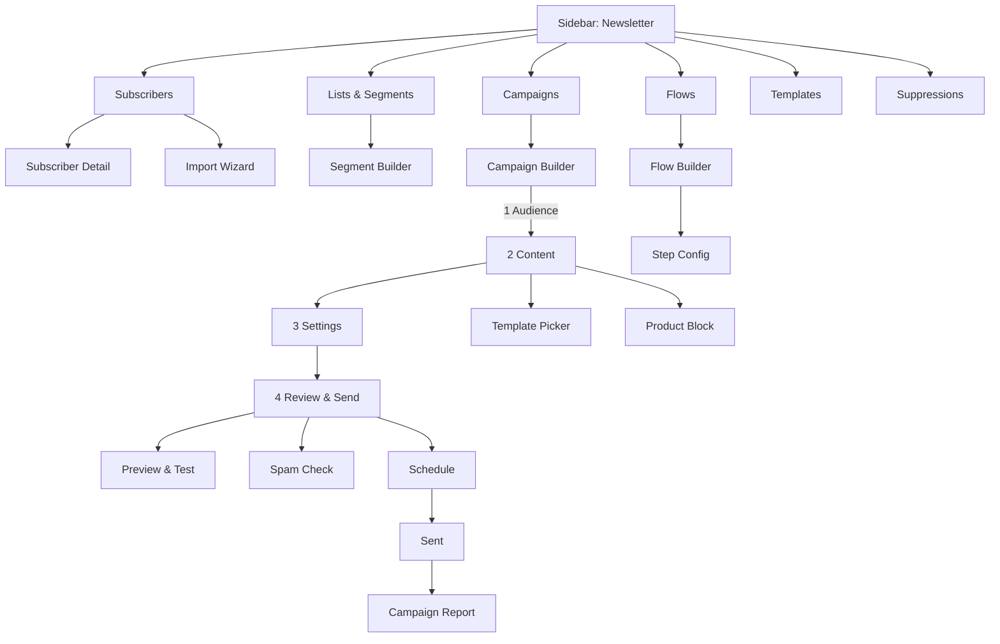
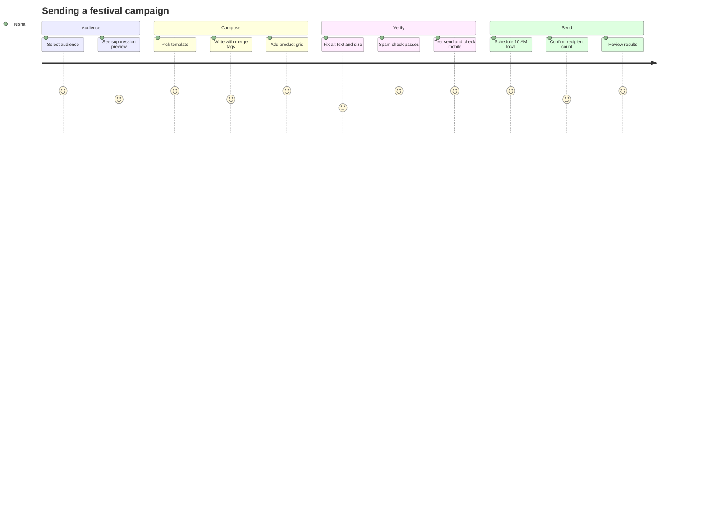
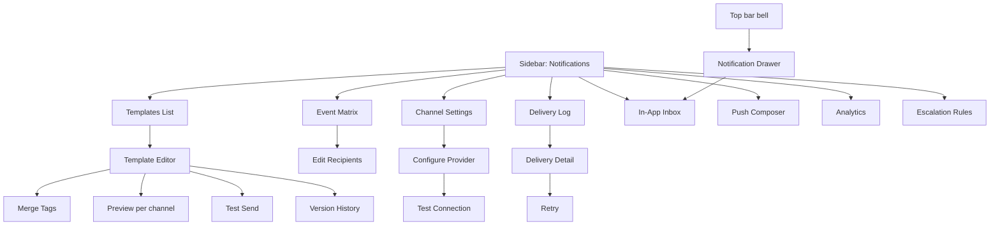
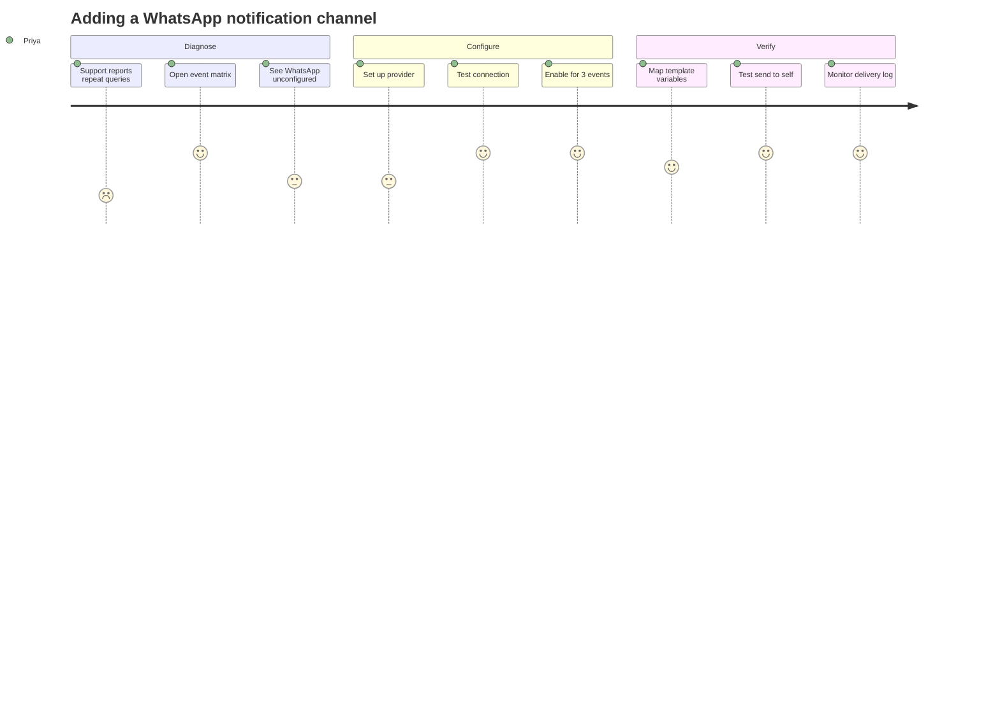
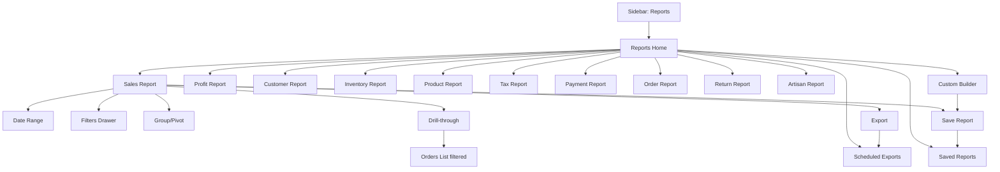
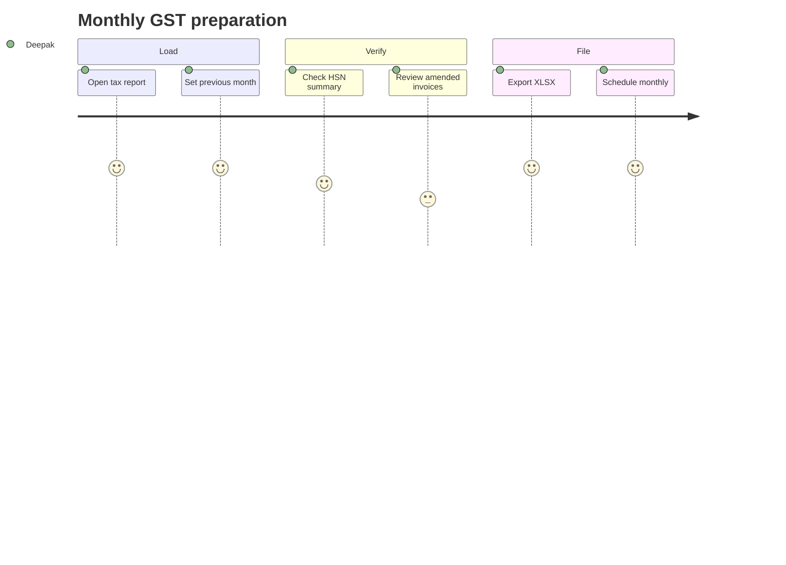

# Modules 16–18 — Newsletter, Notifications & Reports

Enterprise Handicraft E-Commerce Platform · UI/UX Design Specification

---
---

# MODULE 16 · NEWSLETTER

## 16.1 Business Goal

Email is the only owned channel with predictable ROI. For a handicraft brand, newsletters carry craft stories, artisan features and festival collections — content that converts far better than discount blasts. The module must make list health visible, campaigns fast to compose, and consent legally defensible.

## 16.2 Purpose

Manage subscribers and lists, build segments, compose and schedule email campaigns, run automated flows, and report on deliverability and revenue.

## 16.3 Features

| # | Feature |
|---|---------|
| NL-01 | Subscriber management with source, consent record and status |
| NL-02 | Lists and dynamic segments (rule-based) |
| NL-03 | Import/export subscribers with consent validation |
| NL-04 | Campaign builder: drag-and-drop blocks + HTML template option |
| NL-05 | Template library with brand-locked styles |
| NL-06 | Personalisation merge tags and conditional content |
| NL-07 | Product blocks pulled live from the catalog |
| NL-08 | Scheduling, timezone-aware send, and send-time optimisation |
| NL-09 | A/B testing on subject line, sender name, content and send time |
| NL-10 | Automated flows: welcome, abandoned cart, post-purchase, win-back, birthday, review request, back-in-stock |
| NL-11 | Preview across clients and devices, plus a spam-score check |
| NL-12 | Test sends to internal addresses |
| NL-13 | Deliverability metrics: delivered, bounced, opened, clicked, unsubscribed, complained |
| NL-14 | Revenue attribution per campaign |
| NL-15 | Suppression list and re-engagement handling |
| NL-16 | Compliance: unsubscribe link enforcement, physical address, consent audit |

## 16.4 Complete Screen List

| ID | Screen | Route | Type |
|----|--------|-------|------|
| SCR-16-01 | Subscribers List | `/admin/newsletter/subscribers` | Page |
| SCR-16-02 | Subscriber Detail | `/admin/newsletter/subscribers/{id}` | Page |
| SCR-16-03 | Lists & Segments | `/admin/newsletter/lists` | Page |
| SCR-16-04 | Segment Builder | `/admin/newsletter/segments/{id}` | Page |
| SCR-16-05 | Campaigns List | `/admin/newsletter/campaigns` | Page |
| SCR-16-06 | Campaign Builder | `/admin/newsletter/campaigns/{id}/edit` | Page (4 steps) |
| SCR-16-07 | Campaign Report | `/admin/newsletter/campaigns/{id}/report` | Page |
| SCR-16-08 | Automated Flows | `/admin/newsletter/flows` | Page |
| SCR-16-09 | Flow Builder | `/admin/newsletter/flows/{id}` | Page |
| SCR-16-10 | Templates | `/admin/newsletter/templates` | Page |
| SCR-16-11 | Suppression List | `/admin/newsletter/suppressions` | Page |
| MOD-16-01 | Add Subscriber | — | Modal MD |
| MOD-16-02 | Import Subscribers | — | Modal LG (wizard) |
| MOD-16-03 | Add to List | — | Modal SM |
| MOD-16-04 | Unsubscribe / Resubscribe | — | Modal SM |
| MOD-16-05 | Create List | — | Modal SM |
| MOD-16-06 | Segment Rule Builder | — | Modal LG |
| MOD-16-07 | Choose Template | — | Modal LG |
| MOD-16-08 | Insert Product Block | — | Modal LG |
| MOD-16-09 | Merge Tag Picker | — | Modal SM |
| MOD-16-10 | Preview & Test Send | — | Modal LG |
| MOD-16-11 | Spam Score Check | — | Modal MD |
| MOD-16-12 | Schedule Campaign | — | Modal MD |
| MOD-16-13 | A/B Test Setup | — | Modal MD |
| MOD-16-14 | Send Confirmation | — | Modal MD (guarded) |
| MOD-16-15 | Cancel Scheduled Send | — | Modal SM |
| MOD-16-16 | Export Subscribers | — | Modal MD |
| MOD-16-17 | Flow Step Configuration | — | Modal MD |
| DRW-16-01 | Subscriber Quick View | — | Drawer 480 |
| DRW-16-02 | Campaign Quick Stats | — | Drawer 480 |

## 16.5 Navigation Flow



## 16.6 Screen Hierarchy

```
Newsletter
├── Subscribers (SCR-16-01) → Detail (SCR-16-02) → Import wizard
├── Lists & Segments (SCR-16-03) → Segment Builder (SCR-16-04)
├── Campaigns (SCR-16-05) → Builder 4 steps (SCR-16-06) → Report (SCR-16-07)
├── Flows (SCR-16-08) → Flow Builder (SCR-16-09)
├── Templates (SCR-16-10)
└── Suppressions (SCR-16-11)
```

## 16.7 Desktop Layout

- **Subscribers:** L-01 table with a KPI strip (total, active, growth this month, unsubscribe rate, average open rate).
- **Campaign Builder:** L-06 wizard. Step 2 (Content) uses a split: block canvas (7 cols) + block library/settings rail (5 cols) with a live email preview toggle.
- **Campaign Report:** L-07 widget grid — funnel (sent → delivered → opened → clicked → converted), timeline chart, link heatmap, device/client split, top links, revenue.
- **Flow Builder:** node-based canvas with a vertical flow (trigger → wait → email → condition → branch), a node palette on the left and a configuration drawer on the right.

## 16.8 Tablet Layout

Campaign builder rail moves below the canvas; preview becomes a modal. Flow builder is view-and-edit-node only (structural editing needs a wider canvas), with a notice.

## 16.9 Mobile Layout

Subscriber and campaign lists as cards. Campaign builder is limited to review, preview, test send, schedule and send — composing is desktop-only with a clear message. Reports are fully readable on mobile with stacked widgets.

## 16.10 Wireframe Description

### SCR-16-05 · Campaigns List

```
┌──────────────────────────────────────────────────────────────────────────────────────┐
│ Campaigns                                        [Templates] [+ Create Campaign]      │
│ 4 scheduled · 42 sent · 28.4% avg open · 3.2% avg click · ₹4,82,100 attributed        │
├──────────────────────────────────────────────────────────────────────────────────────┤
│ All │ Draft (3) │ Scheduled (4) │ Sending (1) │ Sent (42) │ A/B Tests (2)             │
├──────────────────────────────────────────────────────────────────────────────────────┤
│[☐]│ Campaign               │ Audience      │ Sent    │ Open  │ Click │ Revenue  │ ● │
│[☐]│ Diwali Collection 2026 │ All active    │ 12 Oct  │ 34.2% │ 5.1%  │₹2,84,100 │ ● │
│   │ "Handmade for the…"    │ 8,412         │         │ 2,877 │ 429   │          │Snt│
│[☐]│ Artisan Story: Ram     │ Engaged 90d   │ Scheduled│  —   │  —    │    —     │ ◐ │
│   │ A/B subject line       │ 4,218         │ 18 Aug  │       │       │          │Sch│
│[☐]│ Back in Stock: Diyas   │ Waitlist      │ Sending │ 12.1% │ 8.4%  │ ₹42,100  │ ◑ │
│   │                        │ 412 · 68% done│         │       │       │          │Snd│
└──────────────────────────────────────────────────────────────────────────────────────┘
```

### SCR-16-06 · Campaign Builder — Step 2 Content

```
┌──────────────────────────────────────────────────────────────────────────────────────┐
│ Diwali Collection 2026                                    [Save Draft] [Next: Settings]│
│ ①──────②──────③──────④   Audience ✓ · Content · Settings · Review                     │
├──────────────────────────────────────────────┬───────────────────────────────────────┤
│ ┌─ Email Canvas ───────── [Desktop|Mobile] ┐│ ┌─ Blocks ─────────────────────────┐  │
│ │ ┌──────────────────────────────────────┐ ││ │ [T] Text      [🖼] Image         │  │
│ │ │ ⠿ HEADER · logo             [⚙][🗑] │ ││ │ [🔘] Button   [▦] Product Grid   │  │
│ │ │        [ KARIGAR logo ]              │ ││ │ [—] Divider   [◫] Two Column     │  │
│ │ ├──────────────────────────────────────┤ ││ │ [👤] Artisan  [❝] Testimonial    │  │
│ │ │ ⠿ HERO IMAGE                [⚙][🗑] │ ││ │ [🔗] Social   [📧] Footer        │  │
│ │ │  [   1200×600 Diwali banner      ]   │ ││ └──────────────────────────────────┘  │
│ │ ├──────────────────────────────────────┤ ││ ┌─ Block Settings — Text ──────────┐  │
│ │ │ ⠿ TEXT                      [⚙][🗑] │ ││ │ Font size   [16 ▾]                │  │
│ │ │ Dear {{first_name}},                 │ ││ │ Colour      [#1E293B ▾]           │  │
│ │ │ This Diwali, light your home with…   │ ││ │ Alignment   [≡ Left ▾]            │  │
│ │ ├──────────────────────────────────────┤ ││ │ Padding     [24] [24] [24] [24]   │  │
│ │ │ ⠿ PRODUCT GRID (4)          [⚙][🗑] │ ││ │ Merge tags  [Insert ▾]            │  │
│ │ │ [img][img][img][img]                 │ ││ └──────────────────────────────────┘  │
│ │ │ Brass Diya · Blue Vase · …           │ ││ ┌─ Campaign Info ──────────────────┐  │
│ │ ├──────────────────────────────────────┤ ││ │ Audience  All active (8,412)      │  │
│ │ │ ⠿ BUTTON  "Shop Diwali"     [⚙][🗑] │ ││ │ Subject   Handmade for the…       │  │
│ │ ├──────────────────────────────────────┤ ││ │ Preview   Light your home with…   │  │
│ │ │ ⠿ FOOTER · unsubscribe (required)    │ ││ │ Est. size 84 KB ✓                 │  │
│ │ └──────────────────────────────────────┘ ││ │ Images    6 (all have alt) ✓      │  │
│ │            [ + Add Block ]               ││ └──────────────────────────────────┘  │
│ └──────────────────────────────────────────┘│                                        │
└──────────────────────────────────────────────┴───────────────────────────────────────┘
```

### SCR-16-07 · Campaign Report

```
┌──────────────────────────────────────────────────────────────────────────────────────┐
│ ◀ Diwali Collection 2026  [● Sent]         Sent 12 Oct 2026, 10:00 AM · 8,412 recipients│
├─────────┬─────────┬─────────┬─────────┬─────────┬─────────┬──────────────────────────┤
│DELIVERED│ OPENED  │ CLICKED │UNSUB    │ BOUNCED │ORDERS   │ REVENUE                  │
│ 8,318   │ 2,877   │  429    │  12     │  94     │  86     │ ₹2,84,100                │
│ 98.9%   │ 34.6%   │  5.2%   │ 0.14%   │  1.1%   │ CR 2.0% │ ₹33.77 per recipient     │
├─────────┴─────────┴─────────┴─────────┴─────────┴─────────┴──────────────────────────┤
│ Engagement funnel                          │ Opens over time                          │
│ Sent      ████████████████████ 8,412       │  600 ┤ ╭╮                                │
│ Delivered ███████████████████▉ 8,318       │  400 ┤ ││╭╮                              │
│ Opened    ███████ 2,877                    │  200 ┤ ││││ ╭─╮                          │
│ Clicked   █ 429                            │    0 ┼─┴┴┴┴─┴─┴────────                  │
│ Ordered   ▏86                              │      0h  6h  12h  24h  48h               │
├──────────────────────────────────────────────────────────────────────────────────────┤
│ Top links                          │ Devices          │ Email clients                 │
│ /categories/festive       182 (42%)│ Mobile    68%    │ Gmail        54%              │
│ /products/brass-diya-set   96 (22%)│ Desktop   27%    │ Apple Mail   22%              │
│ /blog/diwali-gifting       74 (17%)│ Tablet     5%    │ Outlook      14%              │
└──────────────────────────────────────────────────────────────────────────────────────┘
```

### SCR-16-09 · Flow Builder

```
┌──────────────────────────────────────────────────────────────────────────────────────┐
│ Flow: Abandoned Cart                        [● Active]  [Stats] [Test] [Save Flow]    │
├──────────────────────────────────────────────────────────────────────────────────────┤
│                    ┌─────────────────────────┐                                        │
│                    │ ⚡ TRIGGER               │                                        │
│                    │ Cart abandoned          │  412 entered this month                │
│                    │ Value ≥ ₹500            │                                        │
│                    └───────────┬─────────────┘                                        │
│                                │                                                      │
│                    ┌───────────▼─────────────┐                                        │
│                    │ ⏱ WAIT 1 hour           │                                        │
│                    └───────────┬─────────────┘                                        │
│                    ┌───────────▼─────────────┐                                        │
│                    │ ✉ EMAIL                 │  Sent 398 · Open 42% · Click 12%       │
│                    │ "You left something…"   │                                        │
│                    └───────────┬─────────────┘                                        │
│                    ┌───────────▼─────────────┐                                        │
│                    │ ◇ CONDITION: Purchased? │                                        │
│                    └──────┬───────────┬──────┘                                        │
│                     YES   │           │  NO                                           │
│              ┌────────────▼──┐   ┌────▼────────────┐                                  │
│              │ ✓ EXIT FLOW   │   │ ⏱ WAIT 23 hours │                                  │
│              │ 84 converted  │   └────┬────────────┘                                  │
│              └───────────────┘   ┌────▼────────────┐                                  │
│                                  │ ✉ EMAIL + 10%   │  Sent 302 · Conv 8%              │
│                                  │ coupon          │                                  │
│                                  └─────────────────┘                                  │
│                                                                                       │
│ Flow performance: 412 entered · 118 converted (28.6%) · ₹1,42,800 revenue              │
└──────────────────────────────────────────────────────────────────────────────────────┘
```

## 16.11 Header

Subscribers: "Subscribers" · "{n} total · {n} active · +{n} this month · {p}% unsubscribe rate" · Import · Export · **+ Add Subscriber**.
Campaigns: "Campaigns" · "{n} scheduled · {n} sent · {p}% avg open · ₹{amount} attributed" · Templates · **+ Create Campaign**.
Builder: "{Campaign name}" · "Step {n} of 4 · {audience count} recipients" · Save Draft · **Next**/**Send**.
Report: "{Campaign name}" + status · "Sent {date} · {n} recipients" · Export · Duplicate.
Flows: "Automated Flows" · "{n} active · {n} contacts in flows · ₹{amount} this month" · **+ Create Flow**.

## 16.12 Sidebar

`MARKETING` → Newsletter (with sub-navigation as page tabs: Subscribers, Lists, Campaigns, Flows, Templates). Badge shows campaigns currently sending.

## 16.13 Breadcrumb

```
Dashboard / Marketing / Newsletter / Subscribers
Dashboard / Marketing / Newsletter / Subscribers / meera@example.com
Dashboard / Marketing / Newsletter / Campaigns
Dashboard / Marketing / Newsletter / Campaigns / Diwali Collection 2026
Dashboard / Marketing / Newsletter / Campaigns / Diwali Collection 2026 / Report
Dashboard / Marketing / Newsletter / Flows / Abandoned Cart
```

## 16.14 Toolbar

Subscribers: search (email, name, phone) · Status filter · List/Segment filter · Source filter · Engagement filter · Date range · More filters · Saved views (Active, Unengaged 90d, Recent Signups, Bounced, VIP) · Columns · Refresh.
Campaigns: search (name, subject) · Status filter · Audience filter · Date range · Performance band · Saved views.

## 16.15 Action Buttons

Add Subscriber · Import · Export · Add to list · Unsubscribe / Resubscribe · Delete subscriber (GDPR) · Create List / Segment · Create Campaign · Duplicate Campaign · Preview · Test Send · Spam Check · Schedule · Send Now (guarded) · Cancel Scheduled · Pause Sending · View Report · Create Flow · Activate/Pause Flow · Test Flow · Add Flow Step · Create Template · Duplicate Template.

## 16.16 Search

Subscribers: email (exact match ranks first), name, phone, subscriber ID. Campaigns: name, subject line, preview text, content. Templates: name and description.

## 16.17 Filters

**Subscribers:** status (Subscribed, Unsubscribed, Bounced, Complained, Pending double opt-in), list membership, segment, source (Checkout, Popup, Footer form, Import, Manual, API), engagement (Opened in 30/90 days, Never opened, Clicked ever), signup date, last activity date, location, customer status (Customer/Non-customer), lifetime value band, language.

**Campaigns:** status (Draft, Scheduled, Sending, Sent, Paused, Failed), audience, sent date, open rate band, click rate band, revenue band, has A/B test, created by.

## 16.18 Sorting

Subscribers: signup date (default desc), email, name, last opened, last clicked, engagement score, lifetime value. Campaigns: send date (default desc), name, recipients, open rate, click rate, revenue, unsubscribe rate.

## 16.19 Bulk Actions

Subscribers: add to list · remove from list · add/remove tag · unsubscribe (with consent note) · resubscribe (requires justification — consent record needed) · export · delete/anonymise (guarded, Super Admin).
Campaigns: duplicate · archive · export stats · delete drafts.

## 16.20 Cards / Tables / Widgets

**Subscriber row:** avatar/initials, email (copyable) + name, status chip, lists/segments chips, source chip, engagement indicator (a 5-dot recency scale with tooltip), last opened, last clicked, signup date, customer link if matched, actions.

**Campaign row:** name + subject caption, audience name + count, send date/schedule, open rate with mini bar, click rate with mini bar, revenue, status chip, A/B badge, actions.

**Flow node types:** Trigger (lightning icon, entry count), Wait (clock, duration), Email (envelope, sent/open/click stats), SMS/WhatsApp, Condition (diamond, branch labels with counts), Action (tag, add-to-list, award points), Exit (check, conversion count). Nodes show live stats when the flow is active.

**Campaign report widgets:** delivery KPIs, engagement funnel, opens/clicks over time, link click map (rendered email with click heat overlay), device and client splits, top links, geographic split, revenue and orders, unsubscribe reasons, A/B comparison with confidence.

## 16.21 Forms & Fields

**Subscriber:** email (required, unique), first/last name, phone, language, lists (multi-select), tags, source (read-only for imports), consent status, consent date and method, custom fields, notes.

**Campaign — Step 1 Audience:** send to (Lists / Segments / All active / Custom rule), exclude (lists/segments/recent recipients within N days), estimated recipient count (live), suppression preview ("142 suppressed: 94 bounced, 48 unsubscribed").

**Campaign — Step 2 Content:** template select, block canvas, subject line (≤80 with a length warning and emoji picker), preview text (≤120), sender name, reply-to.

**Campaign — Step 3 Settings:** send time (Now / Scheduled / Optimal per recipient), timezone handling (recipient local vs store time), tracking (opens, clicks, UTM parameters — auto-generated and editable), Google Analytics campaign name, A/B test setup, throttling (send rate), and a conversion attribution window.

**Campaign — Step 4 Review:** checklist (subject present, preview text present, all images have alt text, unsubscribe link present, physical address present, no broken links, spam score, estimated size), audience summary, test-send panel, and the final send action.

**Segment builder:** rule groups with AND/OR, conditions across subscriber fields, order history, product/category purchased, engagement, location, dates, reward points and custom fields; live count preview with a sample of 10 matching subscribers.

**Flow:** trigger type (Cart abandoned, First purchase, Nth purchase, Signup, Birthday, Product viewed, Back in stock, No purchase in N days, Review request, Tag added), trigger conditions, steps (wait, email, SMS, condition, action, exit), per-step settings, entry limits (once per contact vs repeatable), quiet hours, and flow-level goal definition.

## 16.22 Validation Rules

| Rule | Message |
|------|---------|
| Email required/valid/unique | "Enter a valid email address." / "This email is already subscribed." |
| Email on suppression list | "This address is suppressed ({reason}) and can't be added." |
| Consent required for import | "Confirm you have consent for these subscribers before importing." (blocking checkbox) |
| Import file format | "Your file must include an email column." |
| Import duplicates | "142 duplicates found. Skip or update?" |
| Subject line required | "Add a subject line before sending." |
| Subject ≤80 | "Subject lines over 80 characters get cut off on mobile." (warning) |
| Subject all caps / spam words | "This subject may trigger spam filters: 'FREE!!!'" (warning) |
| Preview text | "Add preview text — it appears next to the subject in the inbox." (warning) |
| Unsubscribe link | "An unsubscribe link is required." (enforced, auto-inserted, cannot be removed) |
| Physical address | "Your physical address is required by anti-spam law. Add it in Settings." (blocking) |
| Image alt text | "3 images are missing alt text." (warning; blocking for accessibility-strict mode) |
| Email size | "This email is 142 KB. Gmail clips emails over 102 KB." (warning) |
| Broken links | "2 links return errors: {list}" (blocking) |
| Merge tag validity | "{{first_nam}} isn't a valid merge tag." |
| Merge tag fallback | "Add a fallback for {{first_name}} — 412 subscribers have no first name." (warning) |
| Recipient count 0 | "This audience has no subscribers." (blocking) |
| Schedule future | "Scheduled time must be in the future." |
| A/B split | "Test groups must total 100%." |
| A/B minimum size | "A/B tests need at least 1,000 recipients per variant for reliable results." (warning) |
| Send confirmation | Typed confirmation for audiences over 5,000 |
| Flow trigger required | "Choose a trigger for this flow." |
| Flow email required | "A flow needs at least one message step." |
| Flow wait minimum | "Wait steps must be at least 5 minutes." |
| Flow infinite loop | "This flow can loop indefinitely. Add an exit condition." (blocking) |
| Resubscribe | "Resubscribing requires documented consent. Record how it was obtained." |

## 16.23 Dropdowns & Data Sources

Lists/Segments (`GET /api/newsletter/lists`, `/segments`) · Templates (`GET /api/newsletter/templates`) · Merge tags (`GET /api/newsletter/merge-tags`) · Products/Categories (catalog) · Sender identities (`GET /api/settings/email-senders` — verified domains only) · Suppression reasons (static) · Flow triggers (static) · Timezones · Languages.

## 16.24 Icons

Newsletter `mail` · Subscribers `users` · Lists `list` · Segment `filter` · Campaign `send` · Template `layout-template` · Flow `workflow` · Trigger `zap` · Wait `clock` · Condition `git-branch` · Exit `circle-check` · Open `mail-open` · Click `mouse-pointer-click` · Bounce `mail-x` · Unsubscribe `user-minus` · Complaint `shield-alert` · Spam check `shield-check` · Test send `flask-conical` · Schedule `calendar-clock` · A/B `split` · Import `upload` · Suppression `ban` · Revenue `indian-rupee`.

## 16.25 Pagination

Subscribers 50/page (options to 200). Campaigns 25/page. Templates grid 24/page. Flow contacts 50/page. Report link tables show all. Exports over 50,000 rows are queued and emailed.

## 16.26 Notifications & Toasts

Subscriber added / unsubscribed / resubscribed / deleted · "{n} subscribers imported · {m} skipped · {k} suppressed" · "Campaign saved as draft" · "Test email sent to {address}" · "Spam score: 2.1 — looks good" / "Spam score: 6.8 — likely to be filtered" · "Campaign scheduled for {date}" · "Campaign sending — {n} of {m} delivered" (progress) · "Campaign sent to {n} recipients" · "Sending paused" / "Sending resumed" · "Campaign cancelled" · "A/B test complete: Variant B won (+18% opens)" · "Flow activated" / "Flow paused" · "High bounce rate detected (4.2%) — check your list quality" (warning) · "Spam complaint rate above threshold — sending paused" (critical).

## 16.27 Dialogs

Import wizard (upload → map columns → consent confirmation → validate → import) · Template picker (grid of thumbnails with categories: Newsletter, Promotional, Announcement, Story, Transactional-styled) · Product block picker (manual/rule-based with live preview) · Merge tag picker (grouped with fallback field) · Preview & test send (desktop/mobile/plain-text tabs, client simulations, send test to up to 5 addresses) · Spam check (score, contributing factors, fixes) · Schedule (date-time, timezone strategy, optimal-time toggle) · A/B setup (variable, variants, split, winner criteria, test duration) · Send confirmation (guarded: recipient count, audience name, subject, "This cannot be undone", typed confirmation over 5,000) · Cancel scheduled send · Flow step configuration.

## 16.28 Permission Matrix (Module 16)

| Action | Super Admin | Admin | Marketing | Content | Support | Others |
|--------|:-----------:|:-----:|:---------:|:-------:|:-------:|:------:|
| View subscribers | ✔ | ✔ | ✔ | ✖ | ✔ | ✖ |
| Add/edit subscriber | ✔ | ✔ | ✔ | ✖ | ✖ | ✖ |
| Import subscribers | ✔ | ✔ | ✔ | ✖ | ✖ | ✖ |
| Export subscribers | ✔ | ✔ | ✔ | ✖ | ✖ | ✖ |
| Delete/anonymise subscriber | ✔ | ✖ | ✖ | ✖ | ✖ | ✖ |
| Create/edit campaign | ✔ | ✔ | ✔ | ✔ (content only) | ✖ | ✖ |
| Send campaign | ✔ | ✔ | ✔ | ✖ | ✖ | ✖ |
| Manage flows | ✔ | ✔ | ✔ | ✖ | ✖ | ✖ |
| Manage templates | ✔ | ✔ | ✔ | ✔ | ✖ | ✖ |
| Manage suppressions | ✔ | ✔ | ✔ | ✖ | ✖ | ✖ |
| View reports | ✔ | ✔ | ✔ | ✔ | ✖ | ✖ |

## 16.29 User Journey

**Nisha sends the Diwali campaign.** She creates a campaign, selects "All active subscribers" minus anyone emailed in the last 3 days — the count updates live to 8,412 with 142 suppressed and the reasons listed. She picks the "Story + Products" template, edits the hero, writes copy with `{{first_name}}` (the builder warns 412 subscribers lack a first name, so she adds the fallback "there"), and inserts a product grid rule-set to "Festive category, bestsellers, 4 items" that pulls live prices and stock. The review step flags two images missing alt text and a 108 KB size; she fixes both. Spam score reads 2.1. She sends a test to herself and a colleague, checks mobile rendering, then schedules for 10:00 AM using recipient-local time. The send confirmation requires her to type the recipient count. Two days later the report shows 34.6% opens and ₹2,84,100 attributed revenue.



## 16.30 UX Guidelines

NL-G01 Recipient count is always live and always shows suppressions with reasons. NL-G02 Compliance elements (unsubscribe, physical address) are enforced, not optional. NL-G03 The review step must catch what recipients will notice: broken links, missing alt text, clipping size, spam signals. NL-G04 Merge tags require fallbacks when data is incomplete — warn with exact counts. NL-G05 Sending is irreversible; the confirmation must state the count and require deliberate action. NL-G06 Flows must visualise live performance per step so bottlenecks are obvious. NL-G07 Consent is recorded, visible and required for resubscription. NL-G08 High bounce or complaint rates pause sending automatically and explain why. NL-G09 Product blocks pull live data — warn when items are out of stock or unpublished at send time.

## 16.31 Accessibility

The email canvas is a reorderable list with keyboard movement. Merge tag insertion is keyboard accessible with a searchable picker. Preview modes are announced. Flow builder nodes are keyboard navigable with relationships described ("Email step, follows Wait 1 hour, branches to Condition"); a linear list view is provided as an alternative to the canvas. Report charts have table alternatives. Alt-text warnings name each affected image. Colour is never the only indicator of campaign status.

## 16.32 Micro-interactions

Recipient count animates as audience rules change · Suppression breakdown expands on click · Block drag reorders with a live preview · Merge tag insertion highlights the inserted token · Spam score gauge animates to its value with a colour band · Test send shows a spinner then a check with "Sent to 2 addresses" · Sending progress bar advances live with a per-second counter · A/B winner declaration animates a highlight on the winning variant · Flow node stats update live when the flow is active.

## 16.33 Loading / Empty / Error States

Subscribers: table skeleton → "No subscribers yet — subscribers appear here when visitors sign up." + Add Subscriber + Import. Campaigns: "No campaigns yet — send your first newsletter." + Create Campaign. Builder step 1: "No lists yet — create a list or segment first." Templates: "No templates — start from a built-in template." Flows: "No automated flows — set up a welcome or abandoned-cart flow." + suggested flow cards. Report: "Results appear within a few minutes of sending." Errors: sending failures show a persistent banner with the provider error and a retry path for failed recipients only.

## 16.34 API & Database Dependencies

`GET/POST/PUT/DELETE /api/newsletter/subscribers` · `/subscribers/import|export` · `/subscribers/{id}/unsubscribe|resubscribe` · `/api/newsletter/lists` · `/segments` · `/segments/{id}/preview` · `/api/newsletter/campaigns` · `/campaigns/{id}/preview|test-send|spam-check|schedule|send|pause|cancel` · `/campaigns/{id}/report` · `/api/newsletter/templates` · `/api/newsletter/flows` · `/flows/{id}/activate|pause|test` · `/api/newsletter/suppressions` · `/webhooks/email/{provider}` (delivery, open, click, bounce, complaint).

**Entities:** `Subscribers`, `SubscriberConsent`, `Lists`, `ListMembers`, `Segments`, `SegmentRules`, `Campaigns`, `CampaignContent`, `CampaignRecipients`, `CampaignEvents`, `CampaignAbTests`, `Templates`, `Flows`, `FlowSteps`, `FlowEnrolments`, `FlowEvents`, `Suppressions`, `EmailSenders`, `Customers`, `Orders`.

**Notes:** sending is queued and throttled; campaign events arrive by webhook and are deduplicated. Revenue attribution uses a configurable window (default 7 days) matching last-click within the campaign UTM. Consent records are immutable. Automatic pause triggers on complaint rate >0.3% or bounce rate >5%.

## 16.35 Figma Build Notes

**New components:** `CMP-NLT-SubscriberRow`, `CMP-NLT-EngagementDots`, `CMP-NLT-CampaignRow`, `CMP-NLT-EmailCanvasBlock` (10 block types × states), `CMP-NLT-BlockPalette`, `CMP-NLT-MergeTagChip`, `CMP-NLT-AudienceSummary` (with suppression breakdown), `CMP-NLT-SpamScoreGauge`, `CMP-NLT-ReviewChecklist`, `CMP-NLT-EngagementFunnel`, `CMP-NLT-LinkHeatmap`, `CMP-NLT-FlowNode` (7 node types × active/inactive/error), `CMP-NLT-FlowConnector` (straight/branch/labelled), `CMP-NLT-AbComparison`, `CMP-NLT-SendProgress`.

**Auto layout:** Builder step 2 = H(EmailCanvas Fill with V stack of blocks | Rail 420: BlockPalette, BlockSettings, CampaignInfo). Flow builder uses absolute positioning inside an Auto Layout frame for the canvas, with nodes as components.

**Variants:** CampaignRow — Status (6) × Performance (High/Average/Low/None) × AbTest (Y/N). FlowNode — Type (7) × State (Configured/Unconfigured/Error/Active-with-stats). EmailCanvasBlock — Type (10) × State (Default/Hover/Selected/Dragging/Error).

**Prototype:** Campaigns → Create → audience (count animates) → template picker → content editing with merge tag insert → product block → review checklist (2 failures → fix → pass) → spam check → test send → schedule → send confirmation (typed) → sending progress → report.

**Dev notes:** email HTML must be table-based and inline-styled at render time — the builder's block model is the source of truth, not hand-written HTML; preview must render the true output; unsubscribe and address blocks are injected server-side and cannot be removed in the builder.

**Future scalability:** SMS and WhatsApp campaigns sharing the same audience and flow engine, predictive send-time optimisation, deeper product recommendation blocks driven by purchase history, RFM-based automatic segments, and a preference centre for subscribers to choose content topics and frequency.

---
---

# MODULE 17 · NOTIFICATIONS

## 17.1 Business Goal

Notifications are the operational nervous system: they tell customers where their order is and tell staff what needs attention. Poorly managed, they become noise and cost (SMS spend) or silence (missed exceptions). This module centralises templates, channels, triggers and delivery monitoring.

## 17.2 Purpose

Define notification templates per event and channel; configure which events notify whom, on which channel; monitor delivery; and manage the admin's own in-app notification inbox and preferences.

## 17.3 Features

| # | Feature |
|---|---------|
| NT-01 | Multi-channel: Email, SMS, WhatsApp, Push, In-app |
| NT-02 | Template management per event × channel with versioning |
| NT-03 | Merge tags with live preview using sample data |
| NT-04 | Event/trigger matrix: which events fire which channels for customers and staff |
| NT-05 | Recipient rules: customer, specific roles, specific users, external emails |
| NT-06 | Channel provider configuration (SMTP/SES, SMS gateway, WhatsApp Business API, FCM) |
| NT-07 | Delivery log with status, provider response and retry |
| NT-08 | Quiet hours and frequency capping |
| NT-09 | Per-user notification preferences (admin) |
| NT-10 | In-app notification inbox with categories and read state |
| NT-11 | Transactional vs promotional classification and consent handling |
| NT-12 | Test send with sample or real data |
| NT-13 | Language variants per template |
| NT-14 | Delivery analytics: sent, delivered, failed, cost (SMS/WhatsApp) |
| NT-15 | Escalation rules (if unacknowledged in N minutes, notify {role}) |

## 17.4 Complete Screen List

| ID | Screen | Route | Type |
|----|--------|-------|------|
| SCR-17-01 | Notification Templates List | `/admin/notifications/templates` | Page |
| SCR-17-02 | Template Editor | `/admin/notifications/templates/{id}` | Page |
| SCR-17-03 | Event Trigger Matrix | `/admin/notifications/events` | Page |
| SCR-17-04 | Channel Settings | `/admin/notifications/channels` | Page |
| SCR-17-05 | Delivery Log | `/admin/notifications/log` | Page |
| SCR-17-06 | In-App Inbox | `/admin/notifications/inbox` | Page |
| SCR-17-07 | My Notification Preferences | `/admin/profile/notifications` | Page |
| SCR-17-08 | Push Notification Composer | `/admin/notifications/push` | Page |
| SCR-17-09 | Notification Analytics | `/admin/notifications/analytics` | Page |
| SCR-17-10 | Escalation Rules | `/admin/notifications/escalations` | Page |
| MOD-17-01 | Create Template | — | Modal MD |
| MOD-17-02 | Merge Tag Picker | — | Modal SM |
| MOD-17-03 | Test Send | — | Modal MD |
| MOD-17-04 | Preview (per channel) | — | Modal MD |
| MOD-17-05 | Configure Channel Provider | — | Modal LG (re-auth) |
| MOD-17-06 | Test Channel Connection | — | Modal SM |
| MOD-17-07 | Retry Failed Delivery | — | Modal SM |
| MOD-17-08 | Delivery Detail | — | Modal MD |
| MOD-17-09 | Edit Event Recipients | — | Modal MD |
| MOD-17-10 | Quiet Hours & Capping | — | Modal MD |
| MOD-17-11 | Compose Push | — | Modal LG |
| MOD-17-12 | Add Escalation Rule | — | Modal MD |
| MOD-17-13 | Restore Template Version | — | Modal SM |
| MOD-17-14 | Disable Notification Warning | — | Modal SM |
| DRW-17-01 | Notification Drawer (global) | — | Drawer 400 |
| DRW-17-02 | Delivery Detail | — | Drawer 480 |

## 17.5 Navigation Flow



## 17.6 Screen Hierarchy

```
Notifications
├── Templates (SCR-17-01) → Editor (SCR-17-02)
├── Event Matrix (SCR-17-03) — event × channel × recipient grid
├── Channels (SCR-17-04) — provider config and health
├── Delivery Log (SCR-17-05) → Detail → Retry
├── In-App Inbox (SCR-17-06) + global drawer (DRW-17-01)
├── Push Composer (SCR-17-08)
├── Analytics (SCR-17-09)
├── Escalations (SCR-17-10)
└── My Preferences (SCR-17-07)
```

## 17.7 Desktop Layout

Templates: L-01 grouped by event category with channel chips per row. Editor: L-02 — left: channel tabs (Email/SMS/WhatsApp/Push/In-app) each with its own content fields; right rail: merge tags, sample data selector, live preview per channel, version history. Event Matrix: L-01 sticky-header/column grid (events × channels) with recipient chips per cell. Delivery Log: L-01 compact table. Analytics: L-07 widgets.

## 17.8 Tablet Layout

Event matrix scrolls horizontally with a sticky event column. Template editor rail moves below with the preview as a collapsible panel.

## 17.9 Mobile Layout

Templates and log as cards. Template editing supports text changes; complex email layout editing is desktop-only. The in-app inbox is fully mobile-optimised (it is the primary mobile surface). Preferences are fully editable on mobile.

## 17.10 Wireframe Description

### SCR-17-03 · Event Trigger Matrix

```
┌──────────────────────────────────────────────────────────────────────────────────────┐
│ Notification Events                          [Quiet Hours] [Escalations] [Analytics]  │
│ 42 events · 128 active notifications · ₹4,120 messaging cost this month               │
├──────────────────────────────────────────────────────────────────────────────────────┤
│ [⌕ Search events] [Category▾][Channel▾][Recipient▾]                                   │
├────────────────────────────────┬────────┬────────┬──────────┬────────┬───────────────┤
│ Event                          │ Email  │  SMS   │ WhatsApp │  Push  │ In-App        │
├────────────────────────────────┼────────┼────────┼──────────┼────────┼───────────────┤
│ ▾ ORDERS                       │        │        │          │        │               │
│   Order placed                 │ ☑ Cust │ ☑ Cust │ ☑ Cust   │ ☐      │ ☑ Order Mgr   │
│   Order confirmed              │ ☑ Cust │ ☐      │ ☑ Cust   │ ☐      │ ☐             │
│   Order packed                 │ ☑ Cust │ ☐      │ ☐        │ ☐      │ ☐             │
│   Order shipped                │ ☑ Cust │ ☑ Cust │ ☑ Cust   │ ☑ Cust │ ☐             │
│   Out for delivery             │ ☐      │ ☑ Cust │ ☑ Cust   │ ☑ Cust │ ☐             │
│   Order delivered              │ ☑ Cust │ ☑ Cust │ ☐        │ ☑ Cust │ ☐             │
│   Order cancelled              │ ☑ Cust │ ☑ Cust │ ☐        │ ☐      │ ☑ Admin       │
│   Delivery failed              │ ☑ Cust │ ☑ Cust │ ☑ Cust   │ ☐      │ ☑ Order,Supp  │
│ ▾ PAYMENTS                     │        │        │          │        │               │
│   Payment received             │ ☑ Cust │ ☐      │ ☐        │ ☐      │ ☑ Finance     │
│   Payment failed               │ ☑ Cust │ ☑ Cust │ ☐        │ ☐      │ ☑ Finance,Ord │
│   Refund initiated             │ ☑ Cust │ ☐      │ ☐        │ ☐      │ ☑ Finance     │
│ ▾ INVENTORY                    │        │        │          │        │               │
│   Low stock                    │ ☑ Inv  │ ☐      │ ☐        │ ☐      │ ☑ Inv,Admin   │
│   Out of stock                 │ ☑ Inv  │ ☑ Inv  │ ☐        │ ☐      │ ☑ Inv,Admin   │
│   Back in stock                │ ☑ Cust │ ☐      │ ☑ Cust   │ ☑ Cust │ ☐             │
├────────────────────────────────┴────────┴────────┴──────────┴────────┴───────────────┤
│ Click a cell to edit recipients and template.        [Reset to defaults] [Save]       │
└──────────────────────────────────────────────────────────────────────────────────────┘
```

### SCR-17-02 · Template Editor

```
┌──────────────────────────────────────────────────┬───────────────────────────────────┐
│ ◀ Order Shipped                    [Test] [Save] │ ┌─ Sample Data ───────────────┐  │
│ [Email] [SMS] [WhatsApp] [Push] [In-App]         │ │ Order [#HC-2026-000482  ▾]  │  │
├──────────────────────────────────────────────────┤ │ Language [English ▾]        │  │
│ ┌─ Email ──────────────────────────────────────┐ │ └─────────────────────────────┘  │
│ │ Subject *                                     │ │ ┌─ Preview ───────────────────┐  │
│ │ [Your order {{order_number}} has shipped! 📦]│ │ │ ┌─────────────────────────┐ │  │
│ │ 42 chars                                      │ │ │ │ Your order #HC-2026-    │ │  │
│ │ Preview text                                  │ │ │ │ 000482 has shipped! 📦  │ │  │
│ │ [Track your handmade treasures on the way   ]│ │ │ │                         │ │  │
│ │ Body                                          │ │ │ │ Hi Meera,               │ │  │
│ │ ┌───────────────────────────────────────────┐ │ │ │ │ Great news — your order │ │  │
│ │ │ B I │ 🔗 🖼 │ {{ }} Merge tags ▾         │ │ │ │ │ is on its way.          │ │  │
│ │ ├───────────────────────────────────────────┤ │ │ │ │                         │ │  │
│ │ │ Hi {{customer_first_name}},                │ │ │ │ │ Courier: Bluedart       │ │  │
│ │ │                                            │ │ │ │ │ AWB: BD1234567890       │ │  │
│ │ │ Great news — your order is on its way.     │ │ │ │ │ [ Track Order ]         │ │  │
│ │ │                                            │ │ │ │ └─────────────────────────┘ │  │
│ │ │ Courier: {{courier_name}}                  │ │ │ │ [Desktop|Mobile|Plain]      │  │
│ │ │ Tracking: {{tracking_number}}              │ │ │ └─────────────────────────────┘  │
│ │ │ Expected: {{expected_delivery_date}}       │ │ │ ┌─ Merge Tags ────────────────┐  │
│ │ │ [ Track Order ]                            │ │ │ │ ⌕ Search tags               │  │
│ │ └───────────────────────────────────────────┘ │ │ │ ▾ Order                     │  │
│ │ ☑ Include order summary block                 │ │ │   {{order_number}}      [+]  │  │
│ │ ☑ Include tracking button                     │ │ │   {{order_total}}       [+]  │  │
│ │ Transactional (no unsubscribe required) ℹ     │ │ │   {{order_items}}       [+]  │  │
│ └───────────────────────────────────────────────┘ │ │ ▾ Customer                  │  │
│ ┌─ SMS (160 chars) ─────────────────────────────┐ │ │   {{customer_first_name}}[+] │  │
│ │ [Your Karigar order {{order_number}} shipped! │ │ │ ▾ Shipping                  │  │
│ │  Track: {{short_url}}                       ] │ │ │   {{courier_name}}      [+]  │  │
│ │ 78 / 160 chars · 1 SMS · ~₹0.18 per message   │ │ │   {{tracking_number}}   [+]  │  │
│ └───────────────────────────────────────────────┘ │ └─────────────────────────────┘  │
└──────────────────────────────────────────────────┴───────────────────────────────────┘
```

### SCR-17-05 · Delivery Log

```
┌──────────────────────────────────────────────────────────────────────────────────────┐
│ Delivery Log                          98.2% delivered · 142 failed · ₹4,120 cost      │
├──────────────────────────────────────────────────────────────────────────────────────┤
│ All │ Delivered (12,842) │ Failed (142) │ Pending (18) │ Bounced (36)                 │
├──────────────────────────────────────────────────────────────────────────────────────┤
│ Time      │ Event          │ Channel │ Recipient          │ Status    │ Cost  │ ⋮     │
│ 10:26 AM  │ Order shipped  │ SMS     │ +91 98765 12345    │ ● Deliv   │ ₹0.18 │ ⋮     │
│ 10:25 AM  │ Order shipped  │ Email   │ meera@example.com  │ ● Deliv   │  —    │ ⋮     │
│ 10:24 AM  │ Order placed   │ WhatsApp│ +91 98765 12345    │ ● Read    │ ₹0.72 │ ⋮     │
│ 09:58 AM  │ Payment failed │ SMS     │ +91 98765 22222    │ ⚠ Failed  │  —    │ ⋮     │
│           │ Invalid number │         │                    │ [Retry]   │       │       │
└──────────────────────────────────────────────────────────────────────────────────────┘
```

## 17.11 Header

Templates: "Notification Templates" · "{n} templates · {n} events covered · {n} languages" · **+ Create Template**.
Editor: "{Event name}" · "{n} channels configured · last edited {relative}" · Test · **Save**.
Event Matrix: "Notification Events" · "{n} events · {n} active notifications · ₹{cost} messaging cost this month" · Quiet Hours · Escalations · Analytics.
Delivery Log: "Delivery Log" · "{p}% delivered · {n} failed · ₹{cost} cost" · Export.
Inbox: "Notifications" · "{n} unread" · Mark all read · Settings.
Push: "Push Notifications" · "{n} sent · {p}% open rate · {n} subscribers" · **+ Compose Push**.

## 17.12 Sidebar

`MARKETING` → Notifications. The global bell in the top bar is the primary in-app entry point.

## 17.13 Breadcrumb

```
Dashboard / Marketing / Notifications / Templates
Dashboard / Marketing / Notifications / Templates / Order Shipped
Dashboard / Marketing / Notifications / Events
Dashboard / Marketing / Notifications / Channels / SMS
Dashboard / Marketing / Notifications / Delivery Log
Dashboard / Profile / Notification Preferences
```

## 17.14 Toolbar

Templates: search (event, subject, body) · Category filter · Channel filter · Status filter · Language filter.
Delivery log: search (recipient, order number, event) · Channel filter · Status filter · Event filter · Date range · Cost range · Columns · Refresh (auto-refresh toggle).

## 17.15 Action Buttons

Create Template · Edit · Duplicate · Test Send · Preview · Enable/Disable notification · Reset to default · Version history · Restore version · Configure channel · Test connection · Retry delivery · Retry all failed · Export log · Compose push · Add escalation rule · Set quiet hours · Mark read/unread · Mark all read · Dismiss · Snooze.

## 17.16 Search

Templates: event name, subject, body content, merge tags used. Delivery log: recipient (email/phone), order number, event name, provider message ID. Inbox: notification title and body.

## 17.17 Filters

**Templates:** category (Orders, Payments, Shipping, Inventory, Customers, Reviews, Marketing, System), channel, status (Active/Disabled/Draft), language, recipient type (Customer/Staff), last edited.

**Delivery log:** channel, status (Queued, Sent, Delivered, Read, Failed, Bounced, Rejected), event, recipient type, date range, cost range, provider, retry count.

**Inbox:** category (All, Orders, Inventory, Payments, System, Mentions), read state, priority, date range.

## 17.18 Sorting

Templates: event name, category, channels configured, last edited (default desc). Delivery log: time (default desc), status, cost, event, retry count. Inbox: time (default desc), priority.

## 17.19 Bulk Actions

Templates: enable · disable · duplicate · export. Delivery log: retry failed · export. Inbox: mark read · mark unread · dismiss · snooze.

## 17.20 Cards / Tables / Widgets

**Template row:** event name + category caption, channel chips (configured channels highlighted, unconfigured greyed), recipient chips, language chips, status toggle, last edited, actions.

**Event matrix cell:** checkbox plus recipient chips (Cust / role abbreviations); hovering shows a popover with the template name, an edit link and the last-30-day send volume; disabled cells show why (channel not configured).

**Delivery log row:** timestamp, event, channel icon, recipient (masked appropriately), status chip with provider reason on failure, cost, retry count, actions.

**In-app notification item:** unread dot, category icon in a tinted circle, title, body (2-line clamp), relative time, source link, actions (mark read, pin, dismiss, snooze).

**Channel card:** channel icon, provider name, status (Connected / Not configured / Error), sending volume (30d), cost (30d), health indicator with last successful send, and actions.

**Analytics widgets:** volume by channel, delivery rate by channel, failure reasons breakdown, cost trend, cost per channel, top events by volume, average delivery latency, opt-out rate.

## 17.21 Forms & Fields

**Template (per channel):**
- Email: subject (required, ≤120), preview text (≤120), body (rich text with merge tags), optional blocks (order summary, tracking button, product list, support footer), transactional/promotional classification, attachments (invoice PDF toggle).
- SMS: message (≤160 per segment with a live segment and cost counter), sender ID, short-URL toggle, unicode warning (unicode halves the segment length).
- WhatsApp: template name (must match an approved WhatsApp Business template), header/body/footer, buttons (URL/quick reply), variable mapping, approval status indicator.
- Push: title (≤50), body (≤150), icon, image, deep link, action buttons (up to 2), badge, sound.
- In-app: title, body, category, priority, action link, icon.

**Common:** language variants tab strip, enabled toggle, recipient rules (customer / roles / specific users / external emails), send conditions (e.g. only if order value > X), delay after event, quiet-hours respect toggle.

**Channel provider config:** provider select, credentials (masked, re-auth to reveal), sender identity, webhook URL, rate limits, retry policy, test mode, cost per message (for reporting).

**Quiet hours:** enabled, start/end time, timezone (store vs recipient), channels affected, exceptions (critical notifications always send), weekend rules.

**Escalation rule:** trigger event, condition (unacknowledged for N minutes), escalate to (roles/users), channel, repeat interval, maximum escalations, and a stop condition.

**My preferences (admin):** per category × channel matrix (In-app / Email / Push), digest option (immediate / hourly / daily summary), quiet hours, sound on/off, desktop notifications permission.

## 17.22 Validation Rules

| Rule | Message |
|------|---------|
| Subject required | "Subject is required for email notifications." |
| SMS length | "This message is 178 characters — it will send as 2 SMS (₹0.36)." (warning) |
| SMS unicode | "Using emoji reduces the SMS limit to 70 characters per message." (warning) |
| Merge tag valid | "{{order_num}} isn't a valid merge tag for this event." |
| Merge tag availability | "{{tracking_number}} isn't available when this event fires." (blocking) |
| WhatsApp template approval | "This WhatsApp template hasn't been approved by Meta yet." (blocking send) |
| WhatsApp variable count | "Your template expects 3 variables but you mapped 2." |
| Push title ≤50 | "Push titles over 50 characters get truncated." |
| Recipient required | "Choose at least one recipient." |
| Channel not configured | "SMS isn't configured. Set up a provider first." (cell disabled with link) |
| Disable critical notification | "'Order shipped' keeps customers informed and reduces support contacts. Disable anyway?" |
| Disable all channels for an event | "This event will notify no one. Continue?" |
| Quiet hours overlap | "Quiet hours can't cover the full day." |
| Escalation loop | "This escalation returns to its own trigger. Choose a different recipient." |
| Test send recipient | "Enter a valid email address or phone number." |
| Provider credentials | "Enter your {provider} API credentials." |
| Provider test required | "Test the connection before enabling this channel." |
| Cost threshold | "This will send approximately 8,412 SMS at an estimated cost of ₹1,514." (confirmation) |
| Consent for promotional | "Promotional messages require marketing consent. 1,204 recipients haven't consented and will be skipped." |

## 17.23 Dropdowns & Data Sources

Events (`GET /api/notifications/events`) · Merge tags per event (`GET /api/notifications/events/{code}/merge-tags`) · Channels (`GET /api/notifications/channels`) · Providers (static per channel) · Roles/Users (admin APIs) · Languages · Sample data (`GET /api/notifications/sample-data?event=`) · WhatsApp templates (`GET /api/whatsapp/templates` with approval status).

## 17.24 Icons

Notifications `bell` · Email `mail` · SMS `message-square` · WhatsApp `whatsapp` · Push `smartphone` · In-app `app-window` · Template `file-text` · Event `zap` · Delivered `check-check` · Read `eye` · Failed `x-circle` · Retry `refresh-cw` · Cost `indian-rupee` · Quiet hours `moon` · Escalation `arrow-up-from-line` · Merge tag `braces` · Test `flask-conical` · Provider `plug` · Preferences `sliders-horizontal` · Snooze `alarm-clock-off` · Pin `pin`.

## 17.25 Pagination

Templates: grouped list, all shown (~42 events). Delivery log: 50/page with auto-refresh; exports queued beyond 50,000 rows. Inbox: 25/page with infinite scroll. Analytics: no pagination.

## 17.26 Notifications & Toasts

"Template saved" · "Test {channel} sent to {recipient}" · "Notification enabled/disabled" · "Channel connected successfully" · "Connection test failed: {reason}" · "Delivery retried" · "{n} failed deliveries retried · {m} succeeded" · "Quiet hours saved" · "Escalation rule created" · "Push sent to {n} devices" · "SMS balance low — ₹420 remaining" (warning) · "WhatsApp template pending approval" · "High failure rate on SMS (12%) — check your provider" (critical) · "All notifications marked as read".

## 17.27 Dialogs

Create template (event + channels selection) · Merge tag picker (grouped, searchable, with sample values shown) · Test send (channel, recipient, sample data selection, "send with real order data" option) · Preview (channel-accurate rendering: email client frame, phone SMS bubble, WhatsApp bubble, push banner, in-app item) · Configure provider (credentials with re-auth) · Test connection (stepped progress) · Retry delivery (single or bulk with reason display) · Edit event recipients (channel, recipient types, conditions, delay) · Quiet hours · Compose push (title, body, image, deep link, audience, schedule, preview on device frames) · Add escalation rule · Restore version · Disable notification warning.

## 17.28 Permission Matrix (Module 17)

| Action | Super Admin | Admin | Marketing | Order | Inventory | Support | Others |
|--------|:-----------:|:-----:|:---------:|:-----:|:---------:|:-------:|:------:|
| View templates | ✔ | ✔ | ✔ | ✔ | ✔ | ✔ | ✖ |
| Edit templates | ✔ | ✔ | ✔ | ✖ | ✖ | ✖ | ✖ |
| Configure event matrix | ✔ | ✔ | ✔ | ✖ | ✖ | ✖ | ✖ |
| Configure channels/providers | ✔ | ✔ | ✖ | ✖ | ✖ | ✖ | ✖ |
| Reveal provider credentials | ✔ | ✖ | ✖ | ✖ | ✖ | ✖ | ✖ |
| View delivery log | ✔ | ✔ | ✔ | ✔ | ✖ | ✔ | ✖ |
| Retry deliveries | ✔ | ✔ | ✔ | ✔ | ✖ | ✔ | ✖ |
| Send push campaigns | ✔ | ✔ | ✔ | ✖ | ✖ | ✖ | ✖ |
| Manage escalations | ✔ | ✔ | ✖ | ✖ | ✖ | ✖ | ✖ |
| Manage own preferences | ✔ | ✔ | ✔ | ✔ | ✔ | ✔ | ✔ |
| View cost analytics | ✔ | ✔ | ✔ | ✖ | ✖ | ✖ | ✖ |

## 17.29 User Journey

**Priya adds WhatsApp for shipping updates.** Support reports that customers keep asking "where is my order". She opens the Event Matrix, finds "Order shipped", and sees the WhatsApp column disabled with "WhatsApp isn't configured". She clicks through to Channels, configures the WhatsApp Business API credentials, and runs the connection test. Back in the matrix she enables WhatsApp for Order shipped, Out for delivery and Delivery failed. The template editor shows the WhatsApp tab requiring an approved Meta template — she selects the approved "shipping_update" template and maps three variables. A test send to her own number confirms the rendering. Over the next month the delivery log shows a 98.6% read rate and support contacts about shipping drop noticeably.



## 17.30 UX Guidelines

NT-G01 The event matrix is the mental model — one screen answers "who gets told what, and how". NT-G02 Cost is always visible for paid channels, per message and per month. NT-G03 SMS length and segment count must update live — cost surprises are unacceptable. NT-G04 Merge tags must be validated against what the event actually provides. NT-G05 Previews must be channel-accurate, rendered in realistic device frames. NT-G06 Disabling a customer-facing notification warns about the support consequence. NT-G07 Failures are actionable: show the provider reason and offer retry. NT-G08 Quiet hours never suppress critical operational alerts. NT-G09 Promotional versus transactional classification drives consent handling and must be explicit. NT-G10 Every admin controls their own notification preferences — no forced noise.

## 17.31 Accessibility

The event matrix is a proper data table with row and column headers; each checkbox's accessible name is "{Event}, {Channel}". Channel status uses text plus icon. SMS counters announce segment changes politely. Previews are marked as previews with plain-text equivalents. The in-app inbox uses a live region for new notifications with a politeness level matched to severity. Snooze and dismiss actions have descriptive labels including the notification title. Sound settings are user-controlled and off by default.

## 17.32 Micro-interactions

SMS character counter updates with the segment count and cost, changing tone at each segment boundary · Merge tag insertion animates the token into the field · Preview cross-fades between channels · Connection test shows a stepped animation · Matrix checkbox toggles with a ripple and updates the "active notifications" count · Failed delivery rows pulse once on arrival · Retry shows a spinner then a status change · New in-app notification slides into the drawer with a badge pulse · Cost meter animates when a channel's volume estimate changes.

## 17.33 Loading / Empty / Error States

Templates: list skeleton → "No templates yet — create defaults for common events." + "Create default templates" (seeds all 42). Event matrix: grid skeleton. Channels: "No channels configured — customers won't receive any notifications." (danger-toned) + Configure Email. Delivery log: table skeleton → "No deliveries yet." Inbox: "You're all caught up" with a bell illustration. Analytics: "Not enough data yet." Errors: provider failures show a persistent banner naming the channel and the last successful send.

## 17.34 API & Database Dependencies

`GET/POST/PUT /api/notifications/templates` · `/templates/{id}/versions` · `/templates/{id}/test-send` · `GET /api/notifications/events` · `PUT /api/notifications/events/{code}` · `GET/PUT /api/notifications/channels` · `/channels/{code}/test` · `/channels/{code}/reveal` (re-auth) · `GET /api/notifications/log` · `/log/{id}/retry` · `POST /api/notifications/log/retry-bulk` · `GET/PUT /api/notifications/quiet-hours` · `GET/POST /api/notifications/escalations` · `GET /api/notifications/inbox` · `/inbox/{id}/read|dismiss|snooze` · `POST /api/notifications/push` · `GET /api/notifications/analytics` · `GET/PUT /api/profile/notification-preferences` · webhooks per provider.

**Entities:** `NotificationTemplates`, `NotificationTemplateVersions`, `NotificationEvents`, `NotificationEventChannels`, `NotificationRecipients`, `NotificationChannels`, `ChannelCredentials` (encrypted), `NotificationLog`, `NotificationRetries`, `InAppNotifications`, `PushSubscriptions`, `QuietHours`, `EscalationRules`, `UserNotificationPreferences`, `MergeTagDefinitions`.

**Notes:** message sending is queued with per-channel rate limiting and exponential-backoff retries. Merge tag resolution is validated at save time against the event's declared payload schema. Provider webhooks update delivery status. Cost is recorded per message for reporting. Critical alerts bypass quiet hours by classification, not by exception lists.

## 17.35 Figma Build Notes

**New components:** `CMP-NTF-EventMatrixCell` (checked/unchecked/disabled/partial with recipient chips), `CMP-NTF-ChannelChip`, `CMP-NTF-ChannelCard` (5 channels × 4 states), `CMP-NTF-SmsCounter` (segments + cost), `CMP-NTF-MergeTagPicker`, `CMP-NTF-PreviewFrame` (email client / SMS bubble / WhatsApp bubble / push banner / in-app item), `CMP-NTF-DeliveryRow`, `CMP-NTF-InboxItem`, `CMP-NTF-EscalationRuleCard`, `CMP-NTF-QuietHoursPicker`, `CMP-NTF-CostMeter`.

**Auto layout:** Template editor = V(Header → ChannelTabs → H(Main Fill: per-channel form cards | Rail 380: SampleData, Preview, MergeTags)). Event matrix = V(Header → Toolbar → table with sticky first column and header).

**Variants:** EventMatrixCell — State (Checked/Unchecked/Disabled/Partial) × Recipients (0–3 chips). PreviewFrame — Channel (5) × Device (Desktop/Mobile) × Theme (Light/Dark). DeliveryRow — Status (6) × Channel (5) × Retryable (Y/N). InboxItem — Category (6) × Read (Y/N) × Priority (Normal/High/Critical).

**Prototype:** Event matrix → click a disabled WhatsApp cell → prompted to configure → Channels → configure → test → back to matrix → enable → template editor → WhatsApp tab → map variables → test send → preview → delivery log shows the result.

**Dev notes:** the preview must render using the same template engine as production sends; SMS segment calculation must follow GSM-7/UCS-2 rules exactly; WhatsApp templates cannot be edited freely — the UI must reflect Meta's approval constraints.

**Future scalability:** in-app customer messaging centre, notification digests for staff, ML-driven send-time optimisation for transactional nudges, richer WhatsApp interactive templates (order tracking carousels), and a customer preference centre exposing the same matrix to end users.

---
---

# MODULE 18 · REPORTS

## 18.1 Business Goal

Reporting turns operational data into decisions: what to reorder, what to promote, which lane is unprofitable, what to file for GST. It must be trustworthy (numbers reconcile), self-serve (no developer required) and exportable (accountants live in spreadsheets).

## 18.2 Purpose

Provide standard reports across sales, profit, customers, inventory, products, tax, payments, orders and returns; a custom report builder; scheduled exports; and consistent drill-through to source records.

## 18.3 Features

| # | Feature |
|---|---------|
| RP-01 | Report library organised by domain with descriptions and owners |
| RP-02 | Standard reports: Sales, Profit & Margin, Customer, Inventory, Product Performance, Tax/GST, Payment, Order, Return |
| RP-03 | Global date range with comparison periods |
| RP-04 | Multi-dimensional filtering, grouping and pivoting |
| RP-05 | Drill-through from any figure to its source records |
| RP-06 | Chart and table views with a toggle |
| RP-07 | Custom report builder (dimensions, measures, filters, visualisation) |
| RP-08 | Saved reports, shared with roles |
| RP-09 | Scheduled exports emailed on a cadence |
| RP-10 | Export to CSV, XLSX and PDF with applied filters printed |
| RP-11 | GST-ready tax reports (GSTR-1 style summaries, HSN summary) |
| RP-12 | Profit calculation with COGS, fees, shipping and returns |
| RP-13 | Cohort and retention analysis |
| RP-14 | ABC/velocity analysis for inventory |
| RP-15 | Artisan and craft-cluster performance reporting |
| RP-16 | Report annotations and commentary for stakeholders |

## 18.4 Complete Screen List

| ID | Screen | Route | Type |
|----|--------|-------|------|
| SCR-18-01 | Reports Home (library) | `/admin/reports` | Page |
| SCR-18-02 | Sales Report | `/admin/reports/sales` | Page |
| SCR-18-03 | Profit & Margin Report | `/admin/reports/profit` | Page |
| SCR-18-04 | Customer Report | `/admin/reports/customers` | Page |
| SCR-18-05 | Inventory Report | `/admin/reports/inventory` | Page |
| SCR-18-06 | Product Performance Report | `/admin/reports/products` | Page |
| SCR-18-07 | Tax / GST Report | `/admin/reports/tax` | Page |
| SCR-18-08 | Payment Report | `/admin/reports/payments` | Page |
| SCR-18-09 | Order Report | `/admin/reports/orders` | Page |
| SCR-18-10 | Return & Refund Report | `/admin/reports/returns` | Page |
| SCR-18-11 | Artisan Performance Report | `/admin/reports/artisans` | Page |
| SCR-18-12 | Custom Report Builder | `/admin/reports/builder` | Page |
| SCR-18-13 | Saved Reports | `/admin/reports/saved` | Page |
| SCR-18-14 | Scheduled Exports | `/admin/reports/schedules` | Page |
| MOD-18-01 | Date Range & Comparison | — | Popover |
| MOD-18-02 | Add Filter | — | Modal MD |
| MOD-18-03 | Group / Pivot Settings | — | Modal MD |
| MOD-18-04 | Column Chooser | — | Popover |
| MOD-18-05 | Export Report | — | Modal MD |
| MOD-18-06 | Schedule Export | — | Modal MD |
| MOD-18-07 | Save Report | — | Modal SM |
| MOD-18-08 | Share Report | — | Modal SM |
| MOD-18-09 | Metric Definition | — | Popover |
| MOD-18-10 | Drill-through Results | — | Modal XL / navigates |
| DRW-18-01 | Report Filters | — | Drawer 400 |
| DRW-18-02 | Report Annotations | — | Drawer 400 |

## 18.5 Navigation Flow



## 18.6 Screen Hierarchy

```
Reports
├── Home / Library (SCR-18-01) — cards by domain, recent, favourites, scheduled
├── Standard reports (SCR-18-02 … SCR-18-11) — shared shell: header + controls + KPIs + charts + table
├── Custom Builder (SCR-18-12) — dimensions, measures, filters, visualisation, preview
├── Saved Reports (SCR-18-13)
└── Scheduled Exports (SCR-18-14)
```

## 18.7 Desktop Layout

All standard reports share one shell (L-03, 9/3 when the filter rail is pinned; otherwise L-01):

```
Header: title · description · date range · compare · export · save · schedule · ⋮
KPI strip (4–6 metrics with comparison deltas)
Primary visualisation (chart, full width or 8/4 with a breakdown chart)
Secondary visualisations (2-up)
Detail table (sortable, groupable, paginated, drill-through)
Optional annotations panel
```

Custom Builder uses L-04: configuration panel (5 cols: dimensions, measures, filters, chart type) + live preview (7 cols).

## 18.8 Tablet Layout

KPI strip 2×3. Charts stack full width. Detail table scrolls horizontally with a sticky first column. Filters move to a drawer. Builder switches to a stepped layout (configure → preview).

## 18.9 Mobile Layout

KPIs stack 1-up (swipeable). Charts simplify (fewer ticks, legend below). Detail tables become summary card lists with a "View full table" option that opens a horizontally scrollable full-screen view. Export offers "Email to me" instead of direct download. The builder is view-only on mobile.

## 18.10 Wireframe Description

### SCR-18-01 · Reports Home

```
┌──────────────────────────────────────────────────────────────────────────────────────┐
│ Reports                              [Scheduled (4)] [Saved (12)] [+ Custom Report]   │
├──────────────────────────────────────────────────────────────────────────────────────┤
│ ⭐ Favourites                                                                          │
│ ┌──────────────┐ ┌──────────────┐ ┌──────────────┐                                    │
│ │ 📈 Sales     │ │ 💰 Profit    │ │ 📦 Inventory │                                    │
│ │ Last viewed  │ │ Last viewed  │ │ Last viewed  │                                    │
│ │ 2 hours ago  │ │ yesterday    │ │ 3 days ago   │                                    │
│ └──────────────┘ └──────────────┘ └──────────────┘                                    │
├──────────────────────────────────────────────────────────────────────────────────────┤
│ SALES & REVENUE                                                                        │
│ ┌────────────────────────┐ ┌────────────────────────┐ ┌────────────────────────┐      │
│ │ 📈 Sales Report        │ │ 💰 Profit & Margin     │ │ 🧾 Tax / GST           │      │
│ │ Revenue, orders, AOV   │ │ COGS, fees, net margin │ │ GSTR-1, HSN summary    │      │
│ │ by period and channel  │ │ by product & category  │ │ ready for filing       │      │
│ │ [Open] ⭐              │ │ [Open] ⭐   🔒 Finance  │ │ [Open]     🔒 Finance   │      │
│ └────────────────────────┘ └────────────────────────┘ └────────────────────────┘      │
│ CUSTOMERS                                                                              │
│ ┌────────────────────────┐ ┌────────────────────────┐                                 │
│ │ 👥 Customer Report     │ │ 🔁 Cohort & Retention  │                                 │
│ └────────────────────────┘ └────────────────────────┘                                 │
│ CATALOG & INVENTORY                                                                    │
│ ┌────────────────────────┐ ┌────────────────────────┐ ┌────────────────────────┐      │
│ │ 🏺 Product Performance │ │ 📦 Inventory & Stock   │ │ 🤲 Artisan Performance │      │
│ └────────────────────────┘ └────────────────────────┘ └────────────────────────┘      │
│ OPERATIONS                                                                             │
│ ┌────────────────────────┐ ┌────────────────────────┐ ┌────────────────────────┐      │
│ │ 🛒 Order Report        │ │ 💳 Payment Report      │ │ ↩ Return & Refund      │      │
│ └────────────────────────┘ └────────────────────────┘ └────────────────────────┘      │
└──────────────────────────────────────────────────────────────────────────────────────┘
```

### SCR-18-02 · Sales Report

```
┌──────────────────────────────────────────────────────────────────────────────────────┐
│ ◀ Sales Report                       [Last 30 Days ▾] [vs Previous ▾] [Export] [⋮]   │
│   Revenue, orders and average order value across periods and dimensions               │
├──────────────────────────────────────────────────────────────────────────────────────┤
│ [Filters (2) ▾] (Category: Home Décor ×) (Channel: Web ×)          [Save Report]      │
├──────────┬──────────┬──────────┬──────────┬──────────┬───────────────────────────────┤
│ REVENUE  │ ORDERS   │ AOV      │ UNITS    │CONVERSION│ RETURN RATE                   │
│₹42,18,500│  1,482   │ ₹2,846   │  4,218   │  11.9%   │ 4.2%                          │
│ ▲12.4% ⓘ │ ▲6.2%    │ ▲5.8%    │ ▲8.1%    │ ▲0.8pp   │ ▼0.6pp ✓                      │
├──────────┴──────────┴──────────┴──────────┴──────────┴───────────────────────────────┤
│ Revenue trend                    [Day|Week|Month]  [Chart|Table]  [Download]          │
│  15L ┤                                    ╭────╮                                      │
│  10L ┤              ╭─────╮        ╭──────╯    ╰──                                    │
│   5L ┤ ╭────────────╯     ╰────────╯                                                  │
│    0 ┼─┴────┴────┴────┴────┴────┴────┴────┴────┴────                                  │
│      1    5    10   15   20   25   30                                                 │
│  ● This period   ○ Previous period (dashed)                                           │
├────────────────────────────────────────────┬─────────────────────────────────────────┤
│ Revenue by category                        │ Revenue by payment method                │
│ Home Décor    ████████████ ₹14.2L (34%)    │  UPI        ████████████ 48%             │
│ Festive       ████████ ₹9.8L (23%)         │  Card       ██████ 24%                   │
│ Textiles      ██████ ₹7.4L (18%)           │  COD        █████ 19%                    │
│ Jewellery     ████ ₹5.2L (12%)             │  Net bank   ██ 9%                        │
├────────────────────────────────────────────┴─────────────────────────────────────────┤
│ Detail                     [Group by: Category ▾] [⚙ Columns]                         │
│ Category      │ Orders │ Units │ Revenue    │ AOV     │ Returns │ Net Revenue │ Share │
│ Home Décor    │   482  │ 1,204 │ ₹14,24,100 │ ₹2,954  │  ₹42,100│ ₹13,82,000  │ 34.1% │
│ Festive       │   386  │ 1,842 │  ₹9,84,200 │ ₹2,550  │  ₹18,400│  ₹9,65,800  │ 23.3% │
│ …                                                                                     │
│ TOTAL         │ 1,482  │ 4,218 │ ₹42,18,500 │ ₹2,846  │ ₹1,84,200│₹40,34,300  │  100% │
└──────────────────────────────────────────────────────────────────────────────────────┘
```

### SCR-18-12 · Custom Report Builder

```
┌────────────────────────────────────────────┬─────────────────────────────────────────┐
│ ┌─ Data Source ──────────────────────────┐ │ PREVIEW                    [Chart|Table]│
│ │ [Orders ▾]  (Orders, Products,         │ │ ┌─────────────────────────────────────┐ │
│ │  Customers, Inventory, Payments)       │ │ │  Revenue by Artisan (Top 10)        │ │
│ └────────────────────────────────────────┘ │ │  Ram Prasad   ████████████ ₹8.4L    │ │
│ ┌─ Dimensions (rows) ────────── [+ Add] ─┐ │ │  Lakshmi D.   █████████ ₹6.2L       │ │
│ │ ⠿ Artisan                            ⋮ │ │ │  Mohan S.     ██████ ₹4.8L          │ │
│ │ ⠿ Month                              ⋮ │ │ │  …                                  │ │
│ └────────────────────────────────────────┘ │ └─────────────────────────────────────┘ │
│ ┌─ Measures ─────────────────── [+ Add] ─┐ │ ┌─────────────────────────────────────┐ │
│ │ ⠿ Revenue (sum)                      ⋮ │ │ │ Artisan    │ Month │ Revenue │Units│ │
│ │ ⠿ Units sold (sum)                   ⋮ │ │ │ Ram Prasad │ Jul   │ ₹2.8L   │ 212 │ │
│ │ ⠿ Avg rating (avg)                   ⋮ │ │ │ Ram Prasad │ Aug   │ ₹3.1L   │ 246 │ │
│ └────────────────────────────────────────┘ │ │ …                                   │ │
│ ┌─ Filters ──────────────────── [+ Add] ─┐ │ └─────────────────────────────────────┘ │
│ │ Date is in Last 6 months             ⋮ │ │ 1,842 rows · calculated in 1.2s         │
│ │ Order status is Delivered            ⋮ │ │                                         │
│ └────────────────────────────────────────┘ │ [Save Report] [Schedule] [Export]       │
│ ┌─ Visualisation ────────────────────────┐ │                                         │
│ │ [Bar ▾] X: Artisan  Y: Revenue         │ │                                         │
│ │ Sort [Revenue desc ▾] Limit [10 ▾]     │ │                                         │
│ └────────────────────────────────────────┘ │                                         │
└────────────────────────────────────────────┴─────────────────────────────────────────┘
```

## 18.11 Header

Home: "Reports" · "{n} standard reports · {n} saved · {n} scheduled" · Scheduled · Saved · **+ Custom Report**.
Standard report: "{Report name}" · one-line description · date range · comparison · Export · Save · `⋮` (Schedule, Share, Annotations, Metric definitions, Print).
Builder: "Custom Report" or "{Saved name}" · "{n} rows · calculated in {t}s" · Save · Schedule · Export.
Scheduled: "Scheduled Exports" · "{n} active · next run {when}" · **+ Schedule Export**.

## 18.12 Sidebar

`REPORTS` group: All Reports, Report Builder, Scheduled Exports. Individual reports are reachable from Reports Home and via favourites, which appear as sidebar sub-items when starred (max 5).

## 18.13 Breadcrumb

```
Dashboard / Reports
Dashboard / Reports / Sales
Dashboard / Reports / Profit & Margin
Dashboard / Reports / Tax / GSTR-1 Summary
Dashboard / Reports / Custom Report Builder
Dashboard / Reports / Saved / Monthly Artisan Performance
Dashboard / Reports / Scheduled Exports
```

## 18.14 Toolbar

Every report shares: date range picker (with financial-year presets), comparison selector, filter bar/drawer with active chips, group-by selector, chart/table toggle, column chooser, density, refresh (with "data as of {time}"), export, save, schedule, and a `⋮` for annotations, metric definitions and print.

## 18.15 Action Buttons

Open report · Star/unstar · Export (CSV/XLSX/PDF) · Schedule export · Save as report · Share with role · Add annotation · View metric definitions · Drill through · Print · Reset filters · Add to dashboard (creates a widget from a report visualisation).

## 18.16 Search

Reports Home: search report names, descriptions and the metrics they contain ("margin" finds the Profit report). Within a report: the detail table has a local search across its dimension columns. The Builder has searchable dimension and measure pickers with descriptions.

## 18.17 Filters

**Universal:** date range with comparison, warehouse, channel (reserved), currency.

**Sales:** category, brand, artisan, product, customer segment, payment method, coupon/offer used, city/state, order status, new vs returning customer, gift orders.

**Profit:** as Sales plus cost basis (average/FIFO), include/exclude shipping and fees, include/exclude returns.

**Customer:** signup date, first/last order date, order count, lifetime value band, segment, location, acquisition source, churn risk.

**Inventory:** warehouse, category, stock status, velocity band, ABC class, supplier/artisan, value band, days of cover.

**Product:** category, brand, artisan, publish status, price band, rating band, tags, new arrival window.

**Tax:** tax rate, HSN code, state (for GST place-of-supply), B2B/B2C, invoice status, period (monthly/quarterly).

**Payment:** gateway, method, status, settlement status, refund status.

**Order:** status, courier, fulfilment status, SLA, source (web/manual/marketplace), assigned to.

**Return:** reason, condition grade, product, category, courier, refund status, RTO vs customer-initiated.

## 18.18 Sorting

All detail tables sort by any column, defaulting to the primary measure descending. Group-by tables sort within groups. Time series always order chronologically. The Builder allows explicit sort configuration with a limit (Top N).

## 18.19 Bulk Actions

Reports themselves have no bulk record actions, but support: export selected rows, drill through on multiple selected rows (opens the union in the source list), add multiple rows to a comparison view, and bulk-schedule several saved reports into one email digest.

## 18.20 Cards / Tables / Widgets

### 18.20.1 Report Card (Home)

Icon, report name, one-line description, key metrics it contains, last-viewed time, permission lock chip when restricted, star toggle, Open action.

### 18.20.2 KPI Strip

4–6 metrics with value, comparison delta (with correct semantic direction), sparkline, definition tooltip and click-through to the relevant breakdown.

### 18.20.3 Standard Report Content by Report

| Report | KPIs | Primary chart | Breakdowns | Detail table dimensions |
|--------|------|---------------|------------|-------------------------|
| **Sales** | Revenue, Orders, AOV, Units, Conversion, Return rate | Revenue trend with comparison | By category, payment method, city, channel | Category / Product / Day / Customer segment |
| **Profit & Margin** | Gross revenue, COGS, Gross profit, Margin %, Fees, Net profit | Profit trend with margin line | By category, product, artisan | Product / Category / Order with cost, fees, shipping, returns |
| **Customer** | Total customers, New, Returning, Repeat rate, LTV, Churn risk count | New vs returning trend | Acquisition source, location, segment | Customer with orders, LTV, first/last order, segment |
| **Inventory** | Stock value, SKUs, Low stock, Out of stock, Dead stock value, Turnover ratio | Stock value trend | By category, warehouse, ABC class | SKU with on hand, reserved, available, value, velocity, days of cover |
| **Product Performance** | Units sold, Revenue, Views, Conversion, Return rate, Avg rating | Top products bar | By category, artisan, price band | Product with views, units, revenue, margin, returns, rating |
| **Tax / GST** | Taxable value, CGST, SGST, IGST, Total tax, Invoice count | Tax collected trend | By rate, HSN, state | Invoice-level and HSN-summary tabs, B2B/B2C split |
| **Payment** | Collected, Fees, Net, Failed value, Refunded, Settlement pending | Collections trend | By gateway, method | Transaction-level with fee and net |
| **Order** | Orders, Fulfilment rate, Avg fulfilment time, SLA breaches, Cancellation rate | Orders by status over time | By courier, city, status | Order-level with timestamps per state |
| **Return & Refund** | Returns, Return rate, Refund value, Avg processing time, Restock rate | Returns trend | By reason, product, category, courier | Return-level with reason, condition, refund, restock |
| **Artisan Performance** | Artisans, Units sold, Revenue, Avg rating, Return rate | Revenue by artisan bar | By craft cluster, category | Artisan with products, units, revenue, rating, returns, lead time |

### 18.20.4 Detail Table Features

Column chooser, group-by with collapsible groups and subtotals, sticky header and totals row, conditional formatting (data bars on the primary measure, red/green on variance), drill-through on any dimension cell, row-level export, and a "% of total" column option.

### 18.20.5 Metric Definition Popover

Every metric name carries an info icon opening: plain-language definition, formula with the actual numbers substituted, data source, refresh cadence, and known exclusions ("excludes cancelled and test orders").

## 18.21 Forms & Fields

**Export dialog:** scope (current view / all rows / selected), format (CSV/XLSX/PDF), include (charts, filter summary, totals, raw data sheet), file name, delivery (download / email to me / email to others), and a size estimate with a queue warning above 10,000 rows.

**Schedule export:** report (pre-filled), frequency (daily/weekly/monthly/quarterly), day and time, timezone, date-range mode (rolling — "last 30 days" — or fixed period like "previous month"), recipients (users + external emails), format, subject and message, attach vs link, active toggle.

**Save report:** name, description, visibility (private / shared with roles / everyone), include current filters and grouping (checkboxes), set as favourite.

**Custom report builder:** data source, dimensions (drag-ordered), measures with aggregation (sum/avg/count/min/max/distinct count) and formatting, calculated measures (simple expression editor with field picker), filters with operators, visualisation type, axis mapping, sort, row limit, and a preview with row count and calculation time.

**Annotation:** date or date range, title, note, visibility, colour — rendered as markers on time-series charts so context ("courier strike", "Diwali", "site outage") travels with the data.

## 18.22 Validation Rules

| Rule | Message |
|------|---------|
| Date range required | "Select a date range." |
| End after start | "End date must be after the start date." |
| Range limit | "Reports are limited to 366 days. Narrow the range or use a scheduled export." |
| Future dates | "Reports can't include future dates." |
| Comparison period availability | "Not enough history for this comparison. Data starts on {date}." |
| Filter conflict | "These filters return no data. Try removing '{filter}'." |
| Builder dimensions | "Add at least one dimension." |
| Builder measures | "Add at least one measure." |
| Builder row limit | "This query returns 482,000 rows. Add filters or a row limit." |
| Calculated measure syntax | "Check the formula — '{expression}' isn't valid." |
| Divide by zero | "This calculation divides by a field that can be zero. Add a guard or accept blanks." |
| Export size | "This export has 142,000 rows and will be emailed instead of downloaded." |
| Schedule recipients | "Add at least one recipient." |
| Schedule time | "Choose a time." |
| Tax period lock | "This tax period is closed. Figures are final as of {date}." |
| Cost data missing | "42 products have no cost price. Profit figures exclude them." (warning with a link to fix) |
| Permission | "Profit data is available to Finance and administrators only." |

## 18.23 Dropdowns & Data Sources

Date presets (static, including Indian financial year) · Comparison options (static) · Dimensions and measures per data source (`GET /api/reports/schema?source=`) · Filter values (respective catalog/customer/order APIs) · Saved reports (`GET /api/reports/saved`) · Recipients (admin users + free email) · Formats (static) · Warehouses, categories, artisans, couriers, gateways (respective APIs).

## 18.24 Icons

Reports `chart-column` · Sales `trending-up` · Profit `indian-rupee` · Customer `users` · Inventory `boxes` · Product `package` · Tax `receipt-indian-rupee` · Payment `credit-card` · Order `shopping-cart` · Return `undo-2` · Artisan `hand-heart` · Builder `blocks` · Saved `bookmark` · Schedule `calendar-clock` · Export `download` · Chart/Table toggle `chart-bar` / `table` · Drill-through `arrow-down-right` · Definition `circle-help` · Annotation `message-square-plus` · Favourite `star` · Print `printer` · Compare `git-compare-arrows`.

## 18.25 Pagination

Detail tables 50/page (options 25/50/100/200/500). Grouped tables paginate by group. Builder preview shows the first 100 rows with the total count. Exports are unpaginated; over 10,000 rows they queue and email. Time series are bucketed rather than paginated.

## 18.26 Notifications & Toasts

"Report saved" · "Report shared with {role}" · "Export ready — download" · "Export queued — we'll email you when it's ready" · "Export emailed to {n} recipients" · "Scheduled export created — first run {date}" · "Scheduled export failed: {reason}" · "Data refreshed — as of {time}" · "42 products are missing cost prices; profit may be understated" (warning with fix link) · "This period is closed for tax filing" · "Comparison period has partial data" · "Query took 12s — consider adding filters" (info).

## 18.27 Dialogs

Date range with comparison (dual-month calendar, preset rail, comparison selector, resolved-range summary) · Add filter (field picker, operator, value with type-appropriate input) · Group/pivot settings (row and column dimensions, measure placement, subtotal options) · Column chooser · Export · Schedule export · Save report · Share report (role selector with a preview of who gains access) · Metric definition popover · Drill-through (either a modal with the source records or navigation to the source list pre-filtered, with a banner explaining the filter and a "Back to report" action).

## 18.28 Permission Matrix (Module 18)

| Report | Super Admin | Admin | Product | Inventory | Order | Marketing | Finance | Support | Content |
|--------|:-----------:|:-----:|:-------:|:---------:|:-----:|:---------:|:-------:|:-------:|:-------:|
| Sales | ✔ | ✔ | ✔ | ✖ | ✔ | ✔ | ✔ | ✖ | ✖ |
| Profit & Margin | ✔ | ✔ | ✖ | ✖ | ✖ | ✖ | ✔ | ✖ | ✖ |
| Customer | ✔ | ✔ | ✖ | ✖ | ✖ | ✔ | ✔ | ✔ | ✖ |
| Inventory | ✔ | ✔ | ✔ | ✔ | ✖ | ✖ | ✔ | ✖ | ✖ |
| Product Performance | ✔ | ✔ | ✔ | ✔ | ✖ | ✔ | ✔ | ✖ | ✖ |
| Tax / GST | ✔ | ✔ | ✖ | ✖ | ✖ | ✖ | ✔ | ✖ | ✖ |
| Payment | ✔ | ✔ | ✖ | ✖ | ✔ | ✖ | ✔ | ✖ | ✖ |
| Order | ✔ | ✔ | ✖ | ✔ | ✔ | ✖ | ✔ | ✔ | ✖ |
| Return & Refund | ✔ | ✔ | ✔ | ✔ | ✔ | ✖ | ✔ | ✔ | ✖ |
| Artisan Performance | ✔ | ✔ | ✔ | ✔ | ✖ | ✔ | ✔ | ✖ | ✖ |
| Custom Builder | ✔ | ✔ | ✔ (own sources) | ✔ (own) | ✔ (own) | ✔ (own) | ✔ | ✖ | ✖ |
| Schedule exports | ✔ | ✔ | ✔ | ✔ | ✔ | ✔ | ✔ | ✖ | ✖ |
| Share reports | ✔ | ✔ | ✖ | ✖ | ✖ | ✖ | ✔ | ✖ | ✖ |
| See cost/margin fields | ✔ | ✔ | ✖ | ✔ | ✖ | ✖ | ✔ | ✖ | ✖ |

Row-level scoping: an Inventory Manager scoped to one warehouse sees only that warehouse's data in every report.

## 18.29 User Journey

**Deepak prepares the GST filing.** On the 3rd he opens Reports → Tax/GST, sets the period to "Previous month", and the report loads with taxable value, CGST/SGST/IGST splits and an invoice count. He switches to the HSN Summary tab, which groups by HSN with quantity, taxable value and tax by rate — exactly the shape the GSTR-1 return requires. A warning notes that two invoices were amended after issue and shows their credit notes. He exports to XLSX including the filter summary sheet, and schedules the same report to run on the 3rd of every month, emailed to himself and the accountant.

**Anand finds what to reorder.** He opens Inventory → filters velocity "Fast" and days of cover "<14" → the table shows 18 SKUs with their reorder suggestions. He drills through on one row to the SKU's stock detail, checks the ledger, and creates a purchase entry directly.



## 18.30 UX Guidelines

RP-G01 Every metric has a definition tooltip with the formula — trust requires transparency. RP-G02 Every number drills through to its source records; no dead ends. RP-G03 Comparison deltas use the metric's semantic direction, never a blanket "up is good". RP-G04 Filters are always visible as chips, and every export prints the applied filters. RP-G05 Data freshness is always stated ("as of 10:15 AM"). RP-G06 Warn when data quality affects a figure (missing cost prices, unmapped HSN codes). RP-G07 Large queries warn before running and offer narrowing. RP-G08 Financial reports respect closed periods and say so. RP-G09 Every report is exportable and schedulable — reporting is a workflow, not a one-off view. RP-G10 Charts always offer a table alternative.

## 18.31 Accessibility

Every chart has a "View as table" toggle producing a proper data table with headers. KPI cards expose full accessible labels including value, delta and comparison basis. Data-bar conditional formatting is supplementary to the numeric value. Sortable headers announce sort state. Grouped tables announce group boundaries and subtotals. Date range presets are keyboard reachable. Report loading states announce completion with the row count. Colour-coded variance always includes a sign or word. Exported PDFs are tagged for accessibility.

## 18.32 Micro-interactions

KPI values count up on first load only · Chart series fade in with a 40ms stagger · Hovering a chart point shows a crosshair and tooltip with all series and comparison delta · Clicking a chart segment applies it as a filter with a chip animating into the filter bar · Table group expand/collapse animates height · Drill-through shows a brief transition with a banner explaining the applied filter · Export shows progress and a completion toast with a download action · The builder preview refreshes with a subtle shimmer and reports its calculation time · Annotations appear as small markers on the time axis that expand on hover.

## 18.33 Loading / Empty / Error States

Reports Home: card skeletons. Report: KPI skeletons + chart skeleton + table skeleton, staggered. Empty (no data in range): "No data for {range}" + "Change date range" + the earliest available date. Empty (filters): "No data matches your filters" + chips + Clear all. Partial: amber banner "Cost prices missing for 42 products — profit figures exclude them. [Fix]". Slow query: after 5s show "Still calculating… this query covers 482,000 records" with a Cancel option. Error: "Couldn't load this report" + reason + Retry + error reference. Permission: lock + "Profit reports are available to Finance and administrators." Builder: "Add a dimension and a measure to see a preview."

## 18.34 API & Database Dependencies

`GET /api/reports/catalog` · `GET /api/reports/{code}?from&to&compare&filters&groupBy&page&size&sort` · `GET /api/reports/{code}/kpis` · `GET /api/reports/{code}/chart/{chartId}` · `GET /api/reports/schema?source=` · `POST /api/reports/query` (builder) · `POST /api/reports/export` · `GET /api/reports/exports/{id}` · `GET/POST/PUT/DELETE /api/reports/saved` · `GET/POST/PUT/DELETE /api/reports/schedules` · `GET /api/reports/metrics/{code}/definition` · `GET/POST /api/reports/annotations` · `GET /api/reports/tax/gstr1?period=` · `GET /api/reports/tax/hsn-summary?period=`.

**Entities (read):** all transactional tables plus pre-aggregated rollups: `DailySalesSummary`, `DailyProductSummary`, `DailyInventorySummary`, `DailyCustomerSummary`, `MonthlyTaxSummary`, `ProductCostHistory`, `OrderProfitability`. Config entities: `SavedReports`, `ReportSchedules`, `ReportAnnotations`, `ReportPermissions`, `ExportJobs`.

**Critical notes:**
1. All reports read from rollup tables where possible; live queries are permitted only for ranges under 31 days.
2. Rollups refresh every 15 minutes; the UI always displays the rollup timestamp.
3. Profit uses the cost basis in effect at order time (`ProductCostHistory`), never the current cost.
4. Tax reports must be immutable for closed periods; amendments appear as credit notes, never as edits.
5. Exports over 10,000 rows run as background jobs with a downloadable link valid for 7 days.
6. Row-level security (warehouse scoping, role field masking) is enforced server-side in every report query.
7. Currency conversion for multi-currency stores uses the rate at transaction time, stated in the report footer.

## 18.35 Figma Build Notes

**Components required:** all chart components, `CMP-SRF-StatCard`, `CMP-DAT-Table` (with grouping and totals), `CMP-INP-DateRange`, `CMP-DAT-FilterBar`, `CMP-OVL-Modal`, `CMP-OVL-Popover`, `CMP-FBK-Skeleton`.

**New components:** `CMP-RPT-Card` (library card with lock chip and favourite), `CMP-RPT-KpiStrip`, `CMP-RPT-MetricTooltip` (definition + formula with values), `CMP-RPT-ChartFrame` (title, controls, chart/table toggle, download menu), `CMP-RPT-GroupedTableRow` (group header, subtotal, total variants), `CMP-RPT-DataBarCell`, `CMP-RPT-VarianceCell` (positive/negative/neutral with semantic direction), `CMP-RPT-DrillBanner`, `CMP-RPT-BuilderFieldChip` (dimension/measure/filter with drag), `CMP-RPT-BuilderPanel`, `CMP-RPT-ScheduleCard`, `CMP-RPT-AnnotationMarker`, `CMP-RPT-DataFreshness`, `CMP-RPT-ExportProgress`.

**Auto layout:** Report shell = V(PageHeader → ControlBar → FilterChips → KpiStrip (H, gap 24) → ChartFrame (Fill) → H(2 × ChartFrame, gap 24) → TableCard → Pagination). Builder = H(ConfigPanel 420 fixed | Preview Fill).

**Variants:** RPT-Card — Domain (5) × Locked (Y/N) × Favourite (Y/N). VarianceCell — Direction (Up/Down/Flat) × Sentiment (Good/Bad/Neutral). GroupedTableRow — Level (Group/Detail/Subtotal/Total) × Expanded (Y/N). ChartFrame — Type (8 chart types) × State (Loaded/Loading/Empty/Error) × View (Chart/Table).

**Prototype (PT-07):** Reports Home → Sales → change date range with comparison → apply a category filter (chip animates) → click a chart bar (drill filter applied) → switch to table view → group by product → export dialog → queued toast → Scheduled Exports → create schedule → success. Second flow: Builder → drag Artisan dimension → add Revenue measure → add filter → preview renders → Save Report → appears under Saved.

**Dev notes:** the same query service must back both the on-screen report and its export so numbers can never diverge; every metric must expose its definition through the API rather than hardcoding text in the UI; drill-through URLs must encode the full filter set so they are shareable; PDF exports must include the filter summary and generation timestamp.

**Future scalability:** dashboard composition from any saved report visualisation, anomaly detection with automatic alerts ("returns for Textiles are 3× normal"), forecasting for demand and cash flow, cohort and LTV modelling, benchmark comparison against category norms, natural-language querying, and warehouse/BI export connectors.
