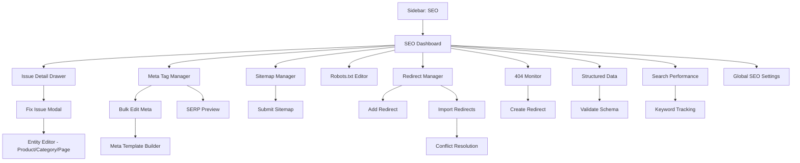
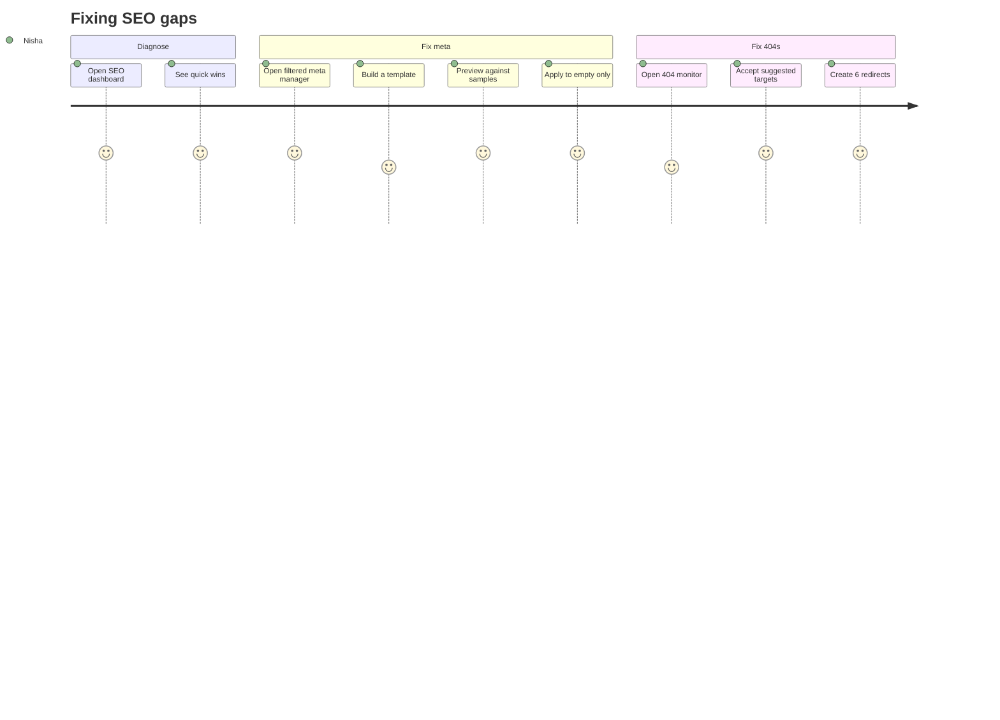
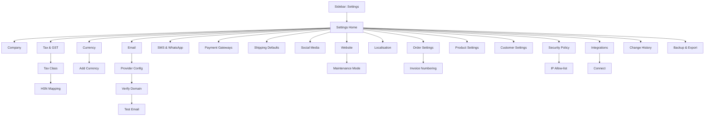
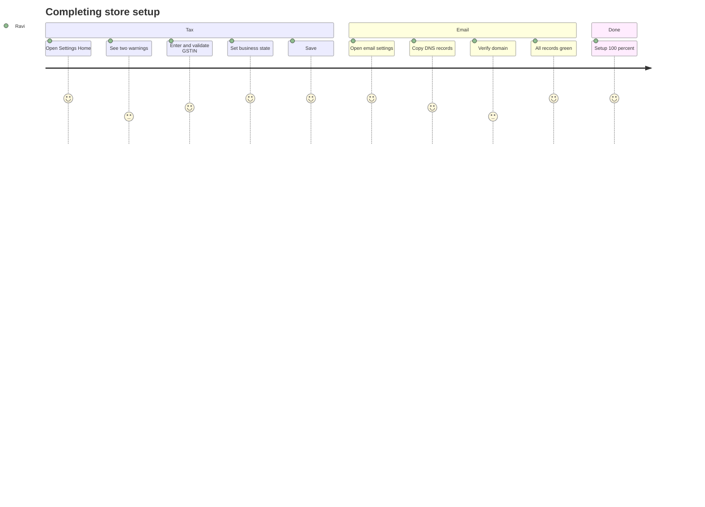

# Modules 19–20 — SEO & Settings

Enterprise Handicraft E-Commerce Platform · UI/UX Design Specification

---
---

# MODULE 19 · SEO

## 19.1 Business Goal

Organic search is the cheapest sustainable acquisition channel for handicraft, where buyers search by craft, material, technique and occasion ("blue pottery vase Jaipur", "brass diya set online"). This module centralises the SEO surface that is otherwise scattered across products, categories, pages and blog posts, and makes technical hygiene (sitemaps, redirects, canonicals, structured data) manageable without a developer.

## 19.2 Purpose

Provide a single place to audit and fix meta tags across all entity types; manage sitemaps, robots.txt, canonical URLs and redirects; configure structured data; monitor SEO health; and track keyword and page performance.

## 19.3 Features

| # | Feature |
|---|---------|
| SE-01 | Global meta tag manager across products, categories, pages, blog posts and artisans |
| SE-02 | Bulk meta editing with templates and merge tokens |
| SE-03 | SEO health dashboard with issue counts and priority |
| SE-04 | Missing/duplicate meta detection |
| SE-05 | Sitemap generation, configuration and submission status |
| SE-06 | robots.txt editor with validation and preview |
| SE-07 | Canonical URL management and duplicate-content detection |
| SE-08 | 301/302 redirect manager with import and conflict detection |
| SE-09 | 404 monitor with one-click redirect creation |
| SE-10 | Structured data (schema.org) configuration and validation per entity type |
| SE-11 | Open Graph and Twitter card defaults with per-entity overrides |
| SE-12 | Global SEO settings: title patterns, separators, site name, default images |
| SE-13 | Search Console integration: impressions, clicks, position, top queries |
| SE-14 | Keyword tracking with position history |
| SE-15 | Internal linking suggestions |
| SE-16 | Page speed / Core Web Vitals summary per template |
| SE-17 | Multi-language hreflang management |

## 19.4 Complete Screen List

| ID | Screen | Route | Type |
|----|--------|-------|------|
| SCR-19-01 | SEO Dashboard / Health | `/admin/seo` | Page |
| SCR-19-02 | Meta Tag Manager | `/admin/seo/meta` | Page |
| SCR-19-03 | Sitemap Manager | `/admin/seo/sitemap` | Page |
| SCR-19-04 | Robots.txt Editor | `/admin/seo/robots` | Page |
| SCR-19-05 | Redirect Manager | `/admin/seo/redirects` | Page |
| SCR-19-06 | 404 Monitor | `/admin/seo/404s` | Page |
| SCR-19-07 | Structured Data | `/admin/seo/schema` | Page |
| SCR-19-08 | Global SEO Settings | `/admin/seo/settings` | Page |
| SCR-19-09 | Search Performance | `/admin/seo/performance` | Page |
| SCR-19-10 | Keyword Tracking | `/admin/seo/keywords` | Page |
| MOD-19-01 | Bulk Edit Meta | — | Modal LG |
| MOD-19-02 | Meta Template Builder | — | Modal MD |
| MOD-19-03 | SERP Preview | — | Modal MD |
| MOD-19-04 | Add / Edit Redirect | — | Modal MD |
| MOD-19-05 | Import Redirects | — | Modal MD |
| MOD-19-06 | Redirect Conflict | — | Modal MD |
| MOD-19-07 | Create Redirect from 404 | — | Modal SM |
| MOD-19-08 | Sitemap Settings | — | Modal MD |
| MOD-19-09 | Submit Sitemap | — | Modal SM |
| MOD-19-10 | Schema Configuration | — | Modal LG |
| MOD-19-11 | Validate Schema | — | Modal MD |
| MOD-19-12 | Add Keyword | — | Modal SM |
| MOD-19-13 | Fix Issue (contextual) | — | Modal MD |
| MOD-19-14 | Connect Search Console | — | Modal MD |
| DRW-19-01 | Issue Detail | — | Drawer 480 |
| DRW-19-02 | Page SEO Detail | — | Drawer 560 |

## 19.5 Navigation Flow



## 19.6 Screen Hierarchy

```
SEO
├── Dashboard / Health (SCR-19-01) — score, issues by priority, quick wins
├── Meta Tag Manager (SCR-19-02) — all entities in one table, bulk edit
├── Technical
│   ├── Sitemap (SCR-19-03)
│   ├── Robots.txt (SCR-19-04)
│   ├── Redirects (SCR-19-05)
│   ├── 404 Monitor (SCR-19-06)
│   └── Structured Data (SCR-19-07)
├── Performance
│   ├── Search Performance (SCR-19-09)
│   └── Keyword Tracking (SCR-19-10)
└── Global Settings (SCR-19-08)
```

## 19.7 Desktop Layout

- **Dashboard:** L-07 — SEO health score gauge (span 4) + issue summary cards (span 8), issues-by-priority list (span 6), search performance trend (span 6), quick wins list (span 12).
- **Meta Manager:** L-01 table with entity-type tabs (All / Products / Categories / Pages / Blog / Artisans) and inline-editable meta title/description cells with live length meters.
- **Redirect Manager:** L-01 table with an inline add row at the top.
- **Structured Data:** L-03 — schema type list (3) + configuration and live JSON-LD preview (9).
- **Search Performance:** L-07 widget grid with a queries table.

## 19.8 Tablet Layout

Meta manager shows entity, title and status columns with the description in an expandable row. Dashboard widgets go 2-up. Redirect table scrolls horizontally.

## 19.9 Mobile Layout

Dashboard KPIs stack. Issue list is fully usable with tap-to-fix. Meta editing is supported one entity at a time via the detail drawer. Robots.txt and structured-data JSON editing are desktop-only with a read-only view and a clear message.

## 19.10 Wireframe Description

### SCR-19-01 · SEO Dashboard

```
┌──────────────────────────────────────────────────────────────────────────────────────┐
│ SEO                                    [Search Console: Connected ✓] [Settings]       │
│ Health score 78/100 · 42 issues · 12 high priority · last crawl 2 hours ago           │
├────────────────────────────────┬─────────────────────────────────────────────────────┤
│ ┌─ SEO Health ───────────────┐ │ ┌─ Issues by Priority ────────────────────────────┐ │
│ │        ╭─────╮             │ │ │ 🔴 HIGH (12)                                    │ │
│ │     ╱   78   ╲   Good      │ │ │  • 8 products missing meta description  [Fix]   │ │
│ │    │  /100    │            │ │ │  • 3 pages with duplicate titles        [Fix]   │ │
│ │     ╲       ╱   ▲ 6 pts    │ │ │  • 1 broken canonical URL               [Fix]   │ │
│ │        ╰─────╯   this month│ │ │ 🟡 MEDIUM (18)                                  │ │
│ │ Meta        ████████░ 82   │ │ │  • 12 images missing alt text           [Fix]   │ │
│ │ Technical   █████████ 91   │ │ │  • 4 titles over 60 characters          [Fix]   │ │
│ │ Content     ██████░░░ 68   │ │ │  • 2 pages with thin content            [Fix]   │ │
│ │ Performance ███████░░ 74   │ │ │ 🔵 LOW (12)                                     │ │
│ └────────────────────────────┘ │ │  • 12 products with no internal links   [Fix]   │ │
│                                │ └─────────────────────────────────────────────────┘ │
├────────────────────────────────┴─────────────────────────────────────────────────────┤
│ Search performance (28 days)              │ Quick wins                                │
│  Impressions 128,412  ▲18%                │ 1. Add meta descriptions to 8 products    │
│  Clicks       4,218   ▲12%                │    Est. +2.4% CTR          [Fix 8 items]  │
│  CTR           3.3%   ▼0.2pp              │ 2. Fix 3 duplicate page titles            │
│  Avg position   14.2  ▲2.1                │    Est. +1 position        [Fix 3 items]  │
│  [chart: impressions & clicks over time]  │ 3. Create redirects for 6 popular 404s    │
│                                            │    Recovering 412 visits/mo [Fix 6 items] │
└──────────────────────────────────────────────────────────────────────────────────────┘
```

### SCR-19-02 · Meta Tag Manager

```
┌──────────────────────────────────────────────────────────────────────────────────────┐
│ Meta Tags                                    [Templates] [Bulk Edit] [Export]         │
│ 1,548 URLs · 42 missing meta · 6 duplicates · 8 too long                              │
├──────────────────────────────────────────────────────────────────────────────────────┤
│ All (1548) │ Products (1482) │ Categories (42) │ Pages (14) │ Blog (8) │ Artisans (2) │
├──────────────────────────────────────────────────────────────────────────────────────┤
│ [⌕ Search] [Status▾: Issues only] [Type▾] [Category▾]                    [⚙][↻]      │
├──────────────────────────────────────────────────────────────────────────────────────┤
│[☐]│ Page                    │ Meta Title              │ Meta Description        │ ● │
│───┼─────────────────────────┼─────────────────────────┼─────────────────────────┼───│
│[☐]│ Blue Pottery Vase       │ Blue Pottery Vase —     │ Hand-painted Jaipur     │ ● │
│   │ /products/blue-pottery… │ Handmade Jaipur… 54/60 ✓│ blue pottery… 142/160 ✓ │ OK│
│[☐]│ Brass Diya Set of 5     │ Brass Diya Set of 5     │ ⚠ Missing               │ ⚠ │
│   │ /products/brass-diya-…  │ 20/60 ⚠ short            │ [Add description]       │Err│
│[☐]│ Terracotta Planter      │ Handmade Terracotta     │ Beautiful handmade      │ ⚠ │
│   │ /products/terracotta-…  │ Planter for… 68/60 ⚠ long│ terracotta… 96/160 ⚠    │Wrn│
│[☐]│ Home Décor              │ Home Décor — Karigar    │ Shop handcrafted home   │ ⚠ │
│   │ /categories/home-decor  │ ⚠ duplicate of 2 pages   │ décor… 128/160 ✓        │Wrn│
└──────────────────────────────────────────────────────────────────────────────────────┘
```

### SCR-19-05 · Redirect Manager

```
┌──────────────────────────────────────────────────────────────────────────────────────┐
│ Redirects                                      [Import CSV] [Export] [+ Add Redirect] │
│ 248 redirects · 12 created this month · 4 chains detected ⚠                            │
├──────────────────────────────────────────────────────────────────────────────────────┤
│ [⌕ Search from/to URL] [Type▾][Source▾][Status▾]                          [⚙][↻]     │
├──────────────────────────────────────────────────────────────────────────────────────┤
│ + [/old-url                    ] → [/new-url                    ] [301▾] [Add]        │
├──────────────────────────────────────────────────────────────────────────────────────┤
│[☐]│ From                      │ To                        │Type│ Hits │ Created  │ ⋮ │
│[☐]│ /products/blue-vase       │ /products/blue-pottery-…  │301 │  482 │ 12 Jun   │ ⋮ │
│[☐]│ /categories/decor         │ /categories/home-decor    │301 │  214 │ 04 Jun   │ ⋮ │
│[☐]│ /diwali-2025              │ /categories/festive       │302 │   86 │ 18 Sep   │ ⋮ │
│   │ ⚠ Chain: → /categories/festive-ritual (2 hops)        │    │      │          │   │
└──────────────────────────────────────────────────────────────────────────────────────┘
```

### SCR-19-07 · Structured Data

```
┌────────────────────┬─────────────────────────────────────────────────────────────────┐
│ SCHEMA TYPES       │ Product Schema                              [Validate] [Save]   │
│ ▸ Organization  ✓  │ ┌─────────────────────────────────────────────────────────────┐ │
│ ▸ WebSite       ✓  │ │ ☑ Enable Product schema on product pages                    │ │
│ ▸ Product       ✓  │ │ Fields mapped:                                              │ │
│ ▸ BreadcrumbList✓  │ │  name          → Product name                     ✓         │ │
│ ▸ Article       ✓  │ │  image         → Product images (up to 5)         ✓         │ │
│ ▸ FAQPage       ⚠  │ │  description   → Short description                ✓         │ │
│ ▸ LocalBusiness ○  │ │  sku           → SKU                              ✓         │ │
│ ▸ Review        ✓  │ │  brand         → Brand                            ✓         │ │
│ ▸ AggregateRating✓ │ │  offers.price  → Selling price                    ✓         │ │
│                    │ │  offers.availability → Stock status               ✓         │ │
│                    │ │  aggregateRating → Reviews (min 1 review)         ✓         │ │
│                    │ │  gtin13        → Barcode                          ⚠ 412 missing│
│                    │ ├─────────────────────────────────────────────────────────────┤ │
│                    │ │ Live preview (Blue Pottery Vase)                            │ │
│                    │ │ { "@context": "https://schema.org", "@type": "Product", …   │ │
│                    │ │ [Validate with Google Rich Results Test ↗]                  │ │
│                    │ └─────────────────────────────────────────────────────────────┘ │
└────────────────────┴─────────────────────────────────────────────────────────────────┘
```

## 19.11 Header

Dashboard: "SEO" · "Health score {n}/100 · {n} issues · {n} high priority · last crawl {relative}" · Search Console status · Settings.
Meta Manager: "Meta Tags" · "{n} URLs · {n} missing · {n} duplicates · {n} too long" · Templates · Bulk Edit · Export.
Redirects: "Redirects" · "{n} redirects · {n} this month · {n} chains" · Import · Export · **+ Add Redirect**.
404 Monitor: "404 Errors" · "{n} unique URLs · {n} hits in 30 days" · Export · Ignore selected.
Sitemap: "Sitemap" · "{n} URLs · last generated {relative} · submitted to {n} engines" · Settings · **Regenerate**.
Performance: "Search Performance" · date range · "connected to Search Console" · Export.

## 19.12 Sidebar

`MARKETING` → SEO. Badge shows high-priority issue count (danger tone).

## 19.13 Breadcrumb

```
Dashboard / Marketing / SEO
Dashboard / Marketing / SEO / Meta Tags
Dashboard / Marketing / SEO / Redirects
Dashboard / Marketing / SEO / 404 Errors
Dashboard / Marketing / SEO / Structured Data / Product
Dashboard / Marketing / SEO / Search Performance
Dashboard / Marketing / SEO / Settings
```

## 19.14 Toolbar

Meta Manager: search (URL, title, description) · entity type tabs · status filter (All / Issues only / Missing / Duplicate / Too long / Too short / OK) · category filter · publish-status filter · columns · refresh.
Redirects: search (from/to) · type filter (301/302/410) · source filter (Manual / Auto from slug change / Imported) · status filter (Active / Inactive / Chain / Loop) · date range.
404 Monitor: search · date range · hit-count range · referrer filter · status (New / Redirected / Ignored).

## 19.15 Action Buttons

Fix issue (contextual, deep-links to the offending field) · Bulk edit meta · Apply meta template · Preview SERP · Add/Edit/Delete redirect · Import/Export redirects · Create redirect from 404 · Ignore 404 · Regenerate sitemap · Submit sitemap · Edit robots.txt · Validate robots.txt · Enable/disable schema type · Validate schema · Add keyword · Connect Search Console · Recrawl · Export issues.

## 19.16 Search

Meta manager searches URL, meta title, meta description and entity name. Redirects search both from and to URLs with partial matching. 404 monitor searches the requested URL and referrer. Keyword tracking searches tracked keywords and landing pages.

## 19.17 Filters

**Meta:** entity type, issue type (missing title, missing description, duplicate title, duplicate description, too long, too short, missing OG image, noindex), publish status, category, last modified.

**Redirects:** type, source, status, hit count band, created date, has chain/loop.

**404s:** date range, hit count, referrer type (internal/external/search/direct), status, has similar existing URL (suggestion available).

**Performance:** date range, comparison, page type, country, device, query contains, position band, CTR band.

**Keywords:** tracking group, position band, position change, search volume band, landing page, difficulty.

## 19.18 Sorting

Meta: URL, entity name, title length, description length, issue severity (default: worst first), last modified. Redirects: hits (default desc), created, from URL. 404s: hits (default desc), last seen, first seen. Performance: impressions (default desc), clicks, CTR, position. Keywords: position (asc), change (biggest movers), volume.

## 19.19 Bulk Actions

**Meta:** apply template, set noindex/index, clear meta, export, regenerate from template. **Redirects:** activate, deactivate, change type, delete, export. **404s:** create redirects (bulk, using suggestions), ignore, delete. **Keywords:** add to group, remove, export.

## 19.20 Cards / Tables / Widgets

**Health score gauge:** overall score with sub-scores (Meta, Technical, Content, Performance), trend versus last month, and a "what changed" link.

**Issue row:** severity icon, issue title, affected entity count, estimated impact ("+2.4% CTR"), Fix action that opens either a bulk-fix modal or navigates to the entity with the field focused.

**Meta manager row:** entity name + URL (truncated with tooltip), meta title with an inline-editable field and a length meter, meta description likewise, status chip, duplicate indicator (with a link to the conflicting pages), and actions (SERP preview, open entity).

**Redirect row:** from URL, arrow, to URL, type chip, hit count with a 30-day sparkline, source chip, created date, chain/loop warning, actions.

**404 row:** requested URL, hit count, first/last seen, top referrer, suggested target (fuzzy-matched existing URL with a confidence indicator), actions.

**Sitemap card per section:** section name (Products, Categories, Pages, Blog, Images), URL count, last generated, include toggle, priority and change-frequency settings, and a preview link.

**Search performance widgets:** impressions, clicks, CTR, average position with deltas; trend chart; top queries table (query, impressions, clicks, CTR, position, change); top landing pages; device and country splits; position-distribution histogram.

## 19.21 Forms & Fields

**Global SEO settings:** site name, title separator (`|`, `-`, `—`, `·`), title patterns per entity type with tokens (`{product_name} | {category} | {site_name}`), default meta description pattern, default OG image, Twitter handle, Facebook app ID, default robots directives, canonical strategy (self / parameter-stripped), trailing slash policy, URL case policy, and hreflang configuration per locale.

**Meta template builder:** entity type, title pattern with token picker and live preview against 3 sample records, description pattern, apply scope (all / filtered / selected), overwrite policy (only empty / overwrite all — with a warning), and a preview table of before → after for 10 samples.

**Redirect:** from URL (path only, validated), to URL (path or absolute), type (301 permanent / 302 temporary / 410 gone), case sensitivity, query-string handling (preserve/drop/append), active toggle, notes.

**Sitemap settings:** included sections, max URLs per file, image sitemap toggle, video sitemap toggle, exclude rules (patterns), change frequency and priority per section, auto-regeneration cadence, ping search engines on regeneration.

**robots.txt:** editor with syntax highlighting, validation, common-directive snippets, a live preview of the served file, and a warning when disallowing important paths.

**Schema configuration per type:** enable toggle, field mappings (source field per schema property), required-field completeness indicator, custom static values, sample output, and validation.

**Keyword tracking:** keyword, target URL, group/tag, country, device, and optional notes.

## 19.22 Validation Rules

| Rule | Message |
|------|---------|
| Meta title length | "Titles over 60 characters get truncated in search results." (warning) / "Titles under 30 characters may be too vague." |
| Meta description length | "Descriptions over 160 characters get truncated." (warning) |
| Duplicate title | "3 other pages use this exact title. [View them]" |
| Duplicate description | "2 other pages use this description." |
| Redirect from URL | "Enter a path starting with /" |
| Redirect self-reference | "A URL can't redirect to itself." |
| Redirect loop | "This creates a loop: /a → /b → /a" (blocking) |
| Redirect chain | "This creates a chain: /a → /b → /c. Point /a directly to /c?" (warning with a one-click fix) |
| Redirect conflict | "A redirect from this URL already exists (→ /other). Replace it?" |
| Redirect to 404 | "The destination URL returns 404." (warning) |
| Redirect to redirect | "The destination is itself redirected." (warning) |
| robots.txt syntax | "Line 4: unknown directive 'Disalow'." |
| robots.txt danger | "This blocks all crawlers from your entire site. Are you sure?" (guarded) |
| robots.txt blocks sitemap | "You're disallowing /sitemap.xml, which prevents indexing." |
| Canonical URL format | "Enter a valid absolute URL." |
| Canonical to noindex page | "This canonical points to a page marked noindex." |
| Schema required fields | "Product schema requires name, image and offers. 412 products have no barcode for gtin13." |
| Schema validation | "Google reports 2 errors in this schema. [View details]" |
| Title pattern tokens | "{product_nam} isn't a valid token." |
| Bulk overwrite | "This will overwrite meta descriptions on 1,482 products, including 1,440 that already have one. Continue?" (guarded) |
| Sitemap size | "This sitemap has 62,000 URLs. Files are limited to 50,000 — it will be split automatically." |
| Keyword duplicate | "You're already tracking this keyword for this URL." |
| hreflang | "Every hreflang entry needs a reciprocal entry on the target page." |

## 19.23 Dropdowns & Data Sources

Entity types (static) · Categories/Products/Pages (catalog and CMS APIs) · Redirect types (static) · Schema types (`GET /api/seo/schema-types`) · Schema field sources (`GET /api/seo/schema-fields?type=`) · Title pattern tokens (`GET /api/seo/tokens?entity=`) · Locales · Countries and devices (for Search Console) · Search Console properties (OAuth-connected).

## 19.24 Icons

SEO `search-check` · Health `gauge` · Meta `tags` · Sitemap `map` · Robots `bot` · Redirect `corner-down-right` · 404 `link-2-off` · Schema `braces` · Canonical `link` · Performance `trending-up` · Keywords `key-round` · Issue high `circle-alert` · Issue medium `triangle-alert` · Issue low `info` · Fixed `circle-check` · Validate `shield-check` · Crawl `refresh-cw` · Search Console `globe` · Quick win `zap` · hreflang `languages`.

## 19.25 Pagination

Meta manager 50/page (options to 200). Redirects 50/page. 404s 50/page. Keywords 50/page. Search performance queries 100/page. Sitemap preview links out rather than paginating.

## 19.26 Notifications & Toasts

"Meta tags updated for {n} pages" (undo) · "Template applied to {n} products" · "Redirect created: /old → /new" · "Redirect chain resolved" · "{n} redirects imported · {m} conflicts skipped" · "Sitemap regenerated — 1,548 URLs" · "Sitemap submitted to Google and Bing" · "robots.txt saved — validated successfully" · "Schema validated — no errors" / "Schema has 2 errors" · "Search Console connected" · "Health score improved to 82 (+4)" · "New 404s detected: 6 URLs with 142 hits" (warning) · "Broken canonical detected on 1 page" (warning) · "Keyword position improved: 'blue pottery vase' moved from 14 to 7" (info).

## 19.27 Dialogs

Bulk edit meta (scope, field, template or literal value, overwrite policy, before → after preview table) · Meta template builder (pattern with token picker, live preview against samples) · SERP preview (Google desktop and mobile rendering with truncation shown) · Add/edit redirect (with live destination validation) · Import redirects (CSV upload → map columns → conflict report → import) · Redirect conflict resolution (existing vs new, choose which wins) · Create redirect from 404 (pre-filled from, suggested to with confidence, type) · Sitemap settings · Submit sitemap (per engine with status) · Schema configuration (field mapping table with completeness) · Validate schema (results with errors, warnings and a raw JSON-LD view) · Connect Search Console (OAuth flow with property selection) · Fix issue (contextual: either an inline bulk fix or a deep link).

## 19.28 Permission Matrix (Module 19)

| Action | Super Admin | Admin | Product | Marketing | Content | Others |
|--------|:-----------:|:-----:|:-------:|:---------:|:-------:|:------:|
| View SEO dashboard | ✔ | ✔ | ✔ | ✔ | ✔ | ✖ |
| Edit meta tags | ✔ | ✔ | products only | ✔ | ✔ | ✖ |
| Bulk edit meta | ✔ | ✔ | ✖ | ✔ | ✔ | ✖ |
| Manage redirects | ✔ | ✔ | ✖ | ✔ | ✔ | ✖ |
| Edit robots.txt | ✔ | ✔ | ✖ | ✖ | ✖ | ✖ |
| Manage sitemap | ✔ | ✔ | ✖ | ✔ | ✖ | ✖ |
| Configure schema | ✔ | ✔ | ✖ | ✔ | ✖ | ✖ |
| Global SEO settings | ✔ | ✔ | ✖ | ✖ | ✖ | ✖ |
| Connect Search Console | ✔ | ✔ | ✖ | ✖ | ✖ | ✖ |
| View search performance | ✔ | ✔ | ✔ | ✔ | ✔ | ✖ |
| Manage keywords | ✔ | ✔ | ✖ | ✔ | ✔ | ✖ |
| Resolve 404s | ✔ | ✔ | ✖ | ✔ | ✔ | ✖ |

## 19.29 User Journey

**Nisha fixes the catalog's SEO gaps.** The SEO dashboard shows a score of 78 with a top quick win: "Add meta descriptions to 8 products — est. +2.4% CTR". She clicks "Fix 8 items", which opens the Meta Manager filtered to those products. Rather than writing eight descriptions by hand she opens the Template Builder and creates the pattern `{short_description} Handcrafted by {artisan} in {origin}. Free shipping over ₹999.` The preview shows the result for three samples with character counts in range. She applies it with "only fill empty" so nothing existing is overwritten. The dashboard score rises to 82. She then opens the 404 Monitor, sees six URLs with 412 monthly hits from an old category structure, accepts the suggested targets (each above 90% confidence), and creates all six redirects in one action.



## 19.30 UX Guidelines

SE-G01 Every issue must be fixable from where it is reported — never just diagnose. SE-G02 Estimated impact turns a list of issues into a prioritised queue; show it wherever it can be estimated. SE-G03 Length meters must show the actual pixel-truncation behaviour, not just character counts. SE-G04 Bulk overwrite is guarded and defaults to "only fill empty". SE-G05 Redirect chains and loops are detected before saving, with one-click resolution. SE-G06 robots.txt changes that could de-index the site require explicit guarded confirmation. SE-G07 Schema completeness is shown per field with the count of affected records. SE-G08 SERP previews render both desktop and mobile truncation. SE-G09 404s with high hit counts are surfaced proactively — they are lost revenue. SE-G10 Never auto-apply SEO changes without a preview of before and after.

## 19.31 Accessibility

Length meters announce their state ("54 of 60 characters, good"). The health gauge exposes its numeric value and sub-scores as text. Issue severity is conveyed by icon and text, not colour alone. Inline-editable meta cells announce edit mode and commit/cancel keys. The SERP preview is decorative with a text equivalent. Redirect chain warnings describe the full path in text. JSON-LD previews are in a labelled code region with a copy action. Bulk-preview tables use proper headers with before/after columns clearly labelled.

## 19.32 Micro-interactions

Length meters fill and change colour band as the user types · Duplicate detection appears inline after a debounce with a link to the conflicting pages · Applying a template animates the preview rows updating · Health score gauge animates to its new value after a fix, with a "+4" delta briefly appearing · Redirect validation shows a spinner then a tick or a warning about the destination · 404 suggestion confidence appears as a small bar · Sitemap regeneration shows a progress counter of URLs · Schema validation runs a stepped animation and highlights offending JSON lines.

## 19.33 Loading / Empty / Error States

Dashboard: gauge and widget skeletons → "Connect Search Console to see search performance" (partial empty) and, for a new store, "No SEO data yet — publish some products and pages first." Meta manager: table skeleton → "All pages have complete meta tags 🎉" (success-toned when the Issues filter finds nothing). Redirects: "No redirects yet — they're created automatically when you change a URL." 404s: "No 404 errors in this period 🎉". Schema: "No schema types enabled — enable Product schema to get rich results." Performance: "Connect Search Console to see impressions, clicks and positions." + Connect. Errors: Search Console API failures show a banner with the last successful sync time.

## 19.34 API & Database Dependencies

`GET /api/seo/health` · `/api/seo/issues?severity&type` · `POST /api/seo/issues/{id}/fix` · `GET /api/seo/meta?entity&status&search&page` · `PUT /api/seo/meta/{entityType}/{id}` · `POST /api/seo/meta/bulk` · `GET/POST /api/seo/meta-templates` · `POST /api/seo/meta-templates/{id}/apply` · `GET/POST/PUT/DELETE /api/seo/redirects` · `POST /api/seo/redirects/import` · `GET /api/seo/redirects/conflicts` · `GET /api/seo/404s` · `POST /api/seo/404s/{id}/redirect|ignore` · `GET/POST /api/seo/sitemap` · `POST /api/seo/sitemap/regenerate|submit` · `GET/PUT /api/seo/robots` · `POST /api/seo/robots/validate` · `GET/PUT /api/seo/schema/{type}` · `POST /api/seo/schema/{type}/validate` · `GET/PUT /api/seo/settings` · `GET /api/seo/performance` · `GET/POST/DELETE /api/seo/keywords` · `POST /api/seo/search-console/connect`.

**Entities:** `SeoMeta`, `SeoMetaTemplates`, `UrlRedirects`, `NotFoundLog`, `SitemapConfig`, `SitemapSections`, `RobotsTxt`, `SchemaConfig`, `SchemaFieldMappings`, `SeoSettings`, `SeoIssues`, `SeoHealthSnapshots`, `TrackedKeywords`, `KeywordPositions`, `SearchConsoleData`, `HreflangMappings`, plus all content entities.

**Notes:** `SeoMeta` is polymorphic across entity types with a unique index on (entityType, entityId, locale). Redirect resolution happens in middleware with an in-memory cache; chains are collapsed at write time where possible. The 404 log is sampled and aggregated by URL. Search Console data syncs daily via OAuth. Health snapshots are stored daily so the score trend is real, not recomputed.

## 19.35 Figma Build Notes

**New components:** `CMP-SEO-HealthGauge` (with sub-score bars), `CMP-SEO-IssueRow` (severity × fixable), `CMP-SEO-QuickWinCard`, `CMP-SEO-MetaRow` (inline-editable with length meters), `CMP-SEO-LengthMeter` (too short / good / too long), `CMP-SEO-SerpPreview` (desktop/mobile), `CMP-SEO-SocialPreview`, `CMP-SEO-RedirectRow` (with chain/loop warnings), `CMP-SEO-RedirectInlineAdd`, `CMP-SEO-404Row` (with suggestion confidence), `CMP-SEO-SchemaFieldRow` (mapped/unmapped/partial), `CMP-SEO-JsonPreview`, `CMP-SEO-SitemapSectionCard`, `CMP-SEO-KeywordRow` (position with change indicator), `CMP-SEO-TemplatePreviewRow` (before → after).

**Auto layout:** Dashboard = V(Header → H(HealthGauge 380 | Issues Fill) → H(Performance Fill | QuickWins 420)). Meta manager = standard list shell with an editable table.

**Variants:** SEO-MetaRow — TitleState (OK/Short/Long/Missing/Duplicate) × DescState (same) × Editing (Y/N). LengthMeter — State (Empty/Short/Good/Long/TooLong). IssueRow — Severity (High/Medium/Low) × Fixable (Bulk/Navigate/Manual). RedirectRow — Type (301/302/410) × Warning (None/Chain/Loop/BrokenTarget).

**Prototype:** SEO dashboard → quick win "Fix 8 items" → meta manager filtered → Template Builder → preview → apply (only empty) → toast → health score animates up → 404 monitor → accept 6 suggestions → redirects created.

**Dev notes:** SERP previews must use the same truncation logic Google applies (pixel width, not character count) — supply the measurement rules to engineering; redirect middleware must be cached and its cache invalidated on write; robots.txt edits should be versioned so a bad change is instantly revertible.

**Future scalability:** automated content-gap analysis against competitors, AI-generated meta descriptions with human review, internal-link recommendation engine, Core Web Vitals per-template monitoring with regression alerts, multi-region hreflang management, and rich-result eligibility tracking per entity.

---
---

# MODULE 20 · SETTINGS

## 20.1 Business Goal

Settings encode how the business runs: legal identity, tax treatment, currency, communication, payment, shipping and storefront behaviour. Errors here are expensive and often invisible until an invoice is wrong or an email stops sending. The UI must make the impact of every setting explicit and protect the dangerous ones.

## 20.2 Purpose

Provide a single, well-organised configuration surface for company information, tax and GST, currency, communications, payment gateways, social media, website behaviour, localisation, security policy and integrations — with change history and safe defaults.

## 20.3 Features

| # | Feature |
|---|---------|
| ST-01 | Company information and legal identity (GSTIN, PAN, CIN, addresses) |
| ST-02 | Tax configuration: GST rates, HSN mapping, tax classes, place-of-supply rules, inclusive/exclusive pricing |
| ST-03 | Currency and multi-currency display with rounding rules |
| ST-04 | Email configuration (SMTP/SES), sender identities, domain verification (SPF/DKIM) |
| ST-05 | SMS and WhatsApp provider configuration |
| ST-06 | Payment gateway configuration (cross-linked from Module 07) |
| ST-07 | Shipping defaults (cross-linked from Module 08) |
| ST-08 | Social media links and sharing configuration |
| ST-09 | Website settings: store name, logo, favicon, theme, homepage layout, maintenance mode |
| ST-10 | Localisation: languages, timezone, date/number formats, units |
| ST-11 | Order settings: number format, statuses, SLA targets, auto-cancel rules, invoice numbering |
| ST-12 | Product settings: SKU pattern, low-stock default, review policy, image requirements |
| ST-13 | Customer settings: registration policy, guest checkout, reward-point rules, GDPR retention |
| ST-14 | Security policy: password rules, 2FA enforcement, session timeout, IP allow-list |
| ST-15 | Integrations directory (analytics, marketing, accounting, marketplace) |
| ST-16 | Change history for every setting with who/when/before→after |
| ST-17 | Environment banner and maintenance mode control |
| ST-18 | Backup and data export |

## 20.4 Complete Screen List

| ID | Screen | Route | Type |
|----|--------|-------|------|
| SCR-20-01 | Settings Home (directory) | `/admin/settings` | Page |
| SCR-20-02 | Company Information | `/admin/settings/company` | Page |
| SCR-20-03 | Tax & GST | `/admin/settings/tax` | Page |
| SCR-20-04 | Currency | `/admin/settings/currency` | Page |
| SCR-20-05 | Email Settings | `/admin/settings/email` | Page |
| SCR-20-06 | SMS & WhatsApp | `/admin/settings/sms` | Page |
| SCR-20-07 | Payment Gateways | `/admin/settings/payment-gateways` | Page |
| SCR-20-08 | Shipping Defaults | `/admin/settings/shipping` | Page |
| SCR-20-09 | Social Media | `/admin/settings/social` | Page |
| SCR-20-10 | Website Settings | `/admin/settings/website` | Page |
| SCR-20-11 | Localisation | `/admin/settings/localisation` | Page |
| SCR-20-12 | Order Settings | `/admin/settings/orders` | Page |
| SCR-20-13 | Product Settings | `/admin/settings/products` | Page |
| SCR-20-14 | Customer Settings | `/admin/settings/customers` | Page |
| SCR-20-15 | Security Policy | `/admin/settings/security` | Page |
| SCR-20-16 | Integrations | `/admin/settings/integrations` | Page |
| SCR-20-17 | Change History | `/admin/settings/history` | Page |
| SCR-20-18 | Backup & Data Export | `/admin/settings/backup` | Page |
| MOD-20-01 | Upload Logo / Favicon | — | Modal MD |
| MOD-20-02 | Add / Edit Tax Class | — | Modal MD |
| MOD-20-03 | HSN Rate Mapping | — | Modal LG |
| MOD-20-04 | Add Currency | — | Modal MD |
| MOD-20-05 | Configure Email Provider | — | Modal LG (re-auth) |
| MOD-20-06 | Verify Sending Domain | — | Modal MD |
| MOD-20-07 | Send Test Email | — | Modal SM |
| MOD-20-08 | Configure SMS Provider | — | Modal MD (re-auth) |
| MOD-20-09 | Enable Maintenance Mode | — | Modal MD (guarded) |
| MOD-20-10 | Change Invoice Numbering | — | Modal MD (guarded) |
| MOD-20-11 | Reset Section to Defaults | — | Modal SM (guarded) |
| MOD-20-12 | Connect Integration | — | Modal MD |
| MOD-20-13 | Disconnect Integration | — | Modal SM |
| MOD-20-14 | Request Data Export | — | Modal MD |
| MOD-20-15 | Change History Detail | — | Modal MD |
| MOD-20-16 | Confirm Sensitive Change | — | Modal SM (re-auth) |
| MOD-20-17 | Add IP to Allow-list | — | Modal SM |
| MOD-20-18 | Preview Storefront Theme | — | Modal Full |
| DRW-20-01 | Setting Help / Impact | — | Drawer 400 |
| DRW-20-02 | Change History for a Field | — | Drawer 400 |

## 20.5 Navigation Flow



## 20.6 Screen Hierarchy

```
Settings
├── Home (SCR-20-01) — searchable directory of setting groups with completion indicators
├── Business: Company · Tax & GST · Currency
├── Communications: Email · SMS & WhatsApp · Social Media
├── Commerce: Payment Gateways · Shipping Defaults · Order Settings · Product Settings · Customer Settings
├── Storefront: Website Settings · Localisation
├── Platform: Security Policy · Integrations · Change History · Backup & Export
```

## 20.7 Desktop Layout

- **Settings Home:** card grid grouped by category, each card showing the group name, description, key values summary, completion state (Complete / Incomplete / Not configured) and a warning chip when something is missing or invalid.
- **Setting pages:** L-03 (9/3) — left: form sections in cards using the horizontal-label layout (label column 200px, control column fills); right rail: "About these settings" help card, related settings links, recent changes for this section, and a save-state indicator.
- Sticky action bar at the bottom appears the moment anything is dirty, showing "{n} unsaved changes · Discard · Save Changes".

## 20.8 Tablet Layout

Horizontal-label layout collapses to stacked labels. The help rail moves below the form. Settings Home cards go 2-up.

## 20.9 Mobile Layout

Settings Home becomes a grouped list. Setting pages are single-column with stacked labels and a sticky save bar. Sensitive configuration (payment gateway keys, email provider credentials, security policy, invoice numbering, maintenance mode) is read-only on mobile with the message "Change this on a desktop for security." Change history is fully viewable.

## 20.10 Wireframe Description

### SCR-20-01 · Settings Home

```
┌──────────────────────────────────────────────────────────────────────────────────────┐
│ Settings                                          [Change History] [⌕ Search settings]│
│ Setup 92% complete · 2 items need attention                                           │
├──────────────────────────────────────────────────────────────────────────────────────┤
│ ⚠ 2 settings need attention: Email sending domain unverified · GSTIN missing          │
├──────────────────────────────────────────────────────────────────────────────────────┤
│ BUSINESS                                                                               │
│ ┌────────────────────────┐ ┌────────────────────────┐ ┌────────────────────────┐      │
│ │ 🏢 Company Information │ │ 🧾 Tax & GST           │ │ 💱 Currency            │      │
│ │ Karigar Crafts Pvt Ltd │ │ GST enabled · 5 classes│ │ INR (₹) · 1 currency   │      │
│ │ Jaipur, Rajasthan      │ │ ⚠ GSTIN missing        │ │ Complete ✓             │      │
│ └────────────────────────┘ └────────────────────────┘ └────────────────────────┘      │
│ COMMUNICATIONS                                                                         │
│ ┌────────────────────────┐ ┌────────────────────────┐ ┌────────────────────────┐      │
│ │ ✉ Email                │ │ 💬 SMS & WhatsApp      │ │ 🔗 Social Media        │      │
│ │ Amazon SES             │ │ MSG91 · WhatsApp ✓     │ │ 4 profiles linked      │      │
│ │ ⚠ Domain unverified    │ │ Complete ✓             │ │ Complete ✓             │      │
│ └────────────────────────┘ └────────────────────────┘ └────────────────────────┘      │
│ COMMERCE                                                                               │
│ ┌────────────────────────┐ ┌────────────────────────┐ ┌────────────────────────┐      │
│ │ 💳 Payment Gateways    │ │ 🚚 Shipping Defaults   │ │ 🛒 Order Settings      │      │
│ │ Razorpay · COD         │ │ 4 zones · 2 couriers   │ │ #HC-{YYYY}-{000000}    │      │
│ └────────────────────────┘ └────────────────────────┘ └────────────────────────┘      │
│ ┌────────────────────────┐ ┌────────────────────────┐                                 │
│ │ 📦 Product Settings    │ │ 👥 Customer Settings   │                                 │
│ └────────────────────────┘ └────────────────────────┘                                 │
│ STOREFRONT                                                                             │
│ ┌────────────────────────┐ ┌────────────────────────┐                                 │
│ │ 🌐 Website Settings    │ │ 🌍 Localisation        │                                 │
│ │ Live · Theme: Karigar  │ │ EN, HI · Asia/Kolkata  │                                 │
│ └────────────────────────┘ └────────────────────────┘                                 │
│ PLATFORM                                                                               │
│ ┌────────────────────────┐ ┌────────────────────────┐ ┌────────────────────────┐      │
│ │ 🔒 Security Policy     │ │ 🔌 Integrations        │ │ 💾 Backup & Export     │      │
│ │ 2FA required for admins│ │ 3 connected            │ │ Last backup 2h ago     │      │
│ └────────────────────────┘ └────────────────────────┘ └────────────────────────┘      │
└──────────────────────────────────────────────────────────────────────────────────────┘
```

### SCR-20-03 · Tax & GST

```
┌──────────────────────────────────────────────────┬───────────────────────────────────┐
│ ◀ Tax & GST                                      │ ┌─ About these settings ───────┐  │
├──────────────────────────────────────────────────┤ │ Tax settings affect every    │  │
│ ┌─ Tax Configuration ──────────────────────────┐ │ │ order and invoice. Changes   │  │
│ │ Tax enabled              [ ● On  ]            │ │ │ apply to new orders only —   │  │
│ │ Tax system               [GST (India)      ▾] │ │ │ existing invoices are never  │  │
│ │ GSTIN *                  [08AABCU9603R1ZM   ] │ │ │ altered.                     │  │
│ │                          ⚠ Required for invoices│ │ [Learn about GST setup →]   │  │
│ │ PAN                      [AABCU9603R        ] │ │ └──────────────────────────────┘  │
│ │ Business state *         [Rajasthan        ▾] │ │ ┌─ Related settings ──────────┐  │
│ │                          Determines CGST/SGST  │ │ │ Company Information         │  │
│ │                          vs IGST               │ │ │ Currency                    │  │
│ │ Prices include tax       [ ○ Off ]            │ │ │ Product Settings (HSN)      │  │
│ │                          ⓘ Changing this alters │ │ └──────────────────────────────┘ │
│ │                          all displayed prices  │ │ ┌─ Recent changes ────────────┐  │
│ │ Tax on shipping          [ ● On  ]            │ │ │ Deepak changed GST rate      │  │
│ │ Tax rounding             [Per line item    ▾] │ │ │ for HSN 6913 · 2 days ago    │  │
│ └───────────────────────────────────────────────┘ │ │        [View all →]          │  │
│ ┌─ Tax Classes ─────────────────── [+ Add Class]┐ │ └──────────────────────────────┘  │
│ │ Name              │ Rate  │ HSN codes │ Used  │ │                                  │
│ │ GST 0% (Exempt)   │  0%   │  3 codes  │  12   │ │                                  │
│ │ GST 5% (Handicraft│  5%   │ 24 codes  │ 418   │ │                                  │
│ │ GST 12% (Ceramic) │ 12%   │ 18 codes  │ 682   │ │                                  │
│ │ GST 18% (Metal)   │ 18%   │ 12 codes  │ 342   │ │                                  │
│ │ GST 28% (Luxury)  │ 28%   │  2 codes  │  28   │ │                                  │
│ └───────────────────────────────────────────────┘ │                                  │
├──────────────────────────────────────────────────┴───────────────────────────────────┤
│ 3 unsaved changes                              [Discard]  [Save Changes]              │
└──────────────────────────────────────────────────────────────────────────────────────┘
```

### SCR-20-15 · Security Policy

```
┌──────────────────────────────────────────────────────────────────────────────────────┐
│ ◀ Security Policy                                                                     │
├──────────────────────────────────────────────────────────────────────────────────────┤
│ ┌─ Password Policy ────────────────────────────────────────────────────────────────┐ │
│ │ Minimum length              [12        ]                                          │ │
│ │ Require uppercase           [ ● On  ]     Require numbers      [ ● On  ]          │ │
│ │ Require lowercase           [ ● On  ]     Require symbols      [ ● On  ]          │ │
│ │ Prevent reuse of last       [5         ] passwords                                │ │
│ │ Expire passwords after      [90        ] days   [ ● On  ]                         │ │
│ │ Lock account after          [5         ] failed attempts for [15] minutes         │ │
│ └───────────────────────────────────────────────────────────────────────────────────┘ │
│ ┌─ Two-Factor Authentication ──────────────────────────────────────────────────────┐ │
│ │ Require 2FA for:  ☑ Super Admin  ☑ Admin  ☑ Finance  ☐ Others                     │ │
│ │ Allowed methods:  ☑ Authenticator app  ☑ SMS  ☐ Email                             │ │
│ │ Backup codes:     [10        ] codes per user                                     │ │
│ │ ⚠ 3 users don't have 2FA set up yet.                        [View users]          │ │
│ └───────────────────────────────────────────────────────────────────────────────────┘ │
│ ┌─ Sessions ───────────────────────────────────────────────────────────────────────┐ │
│ │ Session timeout             [30        ] minutes of inactivity                    │ │
│ │ Maximum session length      [12        ] hours                                    │ │
│ │ Concurrent sessions         [3         ] per user                                 │ │
│ │ Remember me duration        [30        ] days                                     │ │
│ └───────────────────────────────────────────────────────────────────────────────────┘ │
│ ┌─ Access Control ─────────────────────────────────────────────────────────────────┐ │
│ │ IP allow-list               [ ○ Off ]  ⓘ Only listed IPs can access the admin     │ │
│ │ Require re-auth for:        ☑ Payment settings  ☑ Refund approval                 │ │
│ │                             ☑ Role changes      ☑ Bulk delete over 50             │ │
│ │ Audit log retention         [24        ] months                                   │ │
│ └───────────────────────────────────────────────────────────────────────────────────┘ │
└──────────────────────────────────────────────────────────────────────────────────────┘
```

## 20.11 Header

Settings Home: "Settings" · "Setup {p}% complete · {n} items need attention" · Change History · Search settings.
Setting page: "{Section name}" · one-line description of what it controls · `⋮` (Reset to defaults, View change history, Export section) · sticky save bar when dirty.
Change History: "Settings Change History" · "{n} changes in the last 90 days" · Export.

## 20.12 Sidebar

`ADMINISTRATION` → Settings (single entry). Sub-sections appear as a secondary in-page navigation on Settings Home and as breadcrumb children. A warning dot appears when any setting is invalid or incomplete.

## 20.13 Breadcrumb

```
Dashboard / Administration / Settings
Dashboard / Administration / Settings / Company Information
Dashboard / Administration / Settings / Tax & GST
Dashboard / Administration / Settings / Email
Dashboard / Administration / Settings / Security Policy
Dashboard / Administration / Settings / Change History
```

## 20.14 Toolbar

Settings Home has a global settings search that matches setting names, descriptions and their current values (e.g. searching "GST" surfaces the GSTIN field inside Tax & GST with a direct deep link). Individual setting pages have no toolbar; they rely on section navigation and the sticky save bar. Change History has full list-page toolbar behaviour (search, filters, date range, export).

## 20.15 Action Buttons

Save Changes · Discard · Reset section to defaults (guarded) · Test connection (email/SMS/gateway) · Send test message · Verify domain · Upload logo/favicon · Add tax class · Map HSN codes · Add currency · Enable/disable maintenance mode (guarded) · Change invoice numbering (guarded) · Connect/disconnect integration · Add IP to allow-list · Request data export · Download backup · View change history · Revert a change (where safely reversible).

## 20.16 Search

Global settings search indexes every setting's label, description, keywords and current value. Results show the setting name, its group, its current value and a "Go to setting" action that navigates and focuses the field with a brief highlight. Searching a value ("Razorpay") finds the settings that contain it.

## 20.17 Filters

Settings Home: category filter, status filter (Complete / Incomplete / Warning / Not configured). Change History: date range, user, section, setting name, change type (created/updated/deleted/reset), and "sensitive changes only".

## 20.18 Sorting

Settings Home is grouped, not sorted. Tax classes sort by rate. Currencies sort by default first then alphabetically. Integrations sort by connected first. Change History sorts by timestamp descending (default), user, or section.

## 20.19 Bulk Actions

Settings has no record-level bulk operations. The nearest equivalents are: applying a tax class to multiple HSN codes, adding multiple IPs to the allow-list, and bulk-verifying sender identities.

## 20.20 Cards / Tables / Widgets

**Settings group card:** icon, group name, one-line description, 1–2 key current values, completion chip (Complete / Incomplete / Not configured), warning chip when invalid, and an implicit click target for the whole card.

**Setting field row (horizontal-label layout):** label (200px, right-aligned) with an optional info icon, control, inline help text below the control, current-value badge when the value came from a default, and a "changed" dot when dirty.

**Impact notice:** an inline info panel attached to high-impact settings explaining exactly what changes, e.g. "Turning on tax-inclusive pricing recalculates displayed prices for all 1,482 products. Order totals are unaffected."

**Tax class table:** name, rate, HSN codes count, products using it, default flag, actions.

**Currency row:** code, symbol, name, exchange rate with source and last update, rounding rule, default flag, active toggle.

**Email/SMS provider card:** provider logo, connection status, sending domain with verification badges (SPF/DKIM/DMARC), monthly volume, cost, test action.

**Integration card:** logo, name, category, connection status, connected account, last sync, actions (Configure, Sync now, Disconnect).

**Change history row:** timestamp, user with avatar, section, setting name, before → after values (masked for secrets), source (UI/API/System), and a detail action.

## 20.21 Forms & Fields

### 20.21.1 Company Information

Legal business name, trading/display name, business type (Private Limited / LLP / Partnership / Proprietorship), CIN, PAN, GSTIN, registered address (full block), operational/warehouse address, contact email, contact phone, support email, support phone, support hours, website URL, company logo (light and dark variants), favicon, business registration documents (upload), and an "Established in" year used in storefront copy.

### 20.21.2 Tax & GST

Tax enabled, tax system, GSTIN, PAN, business state (drives CGST/SGST vs IGST), prices include tax, tax on shipping, tax rounding (per line / per order), tax classes (name, rate, description, HSN codes, default), HSN → rate mapping table with search, place-of-supply rule, reverse-charge handling, composition-scheme toggle, tax display on storefront (inclusive/exclusive labelling), and invoice tax breakdown format.

### 20.21.3 Currency

Base currency (locked after first order, with an explanation), currency symbol and position, decimal places, thousand and decimal separators, Indian numbering toggle, rounding rule (none / nearest 1 / 5 / 9 / 10 / 99), price display rounding, additional display currencies with rate source (manual / auto with provider) and update frequency, and a fallback behaviour when rates are stale.

### 20.21.4 Email Settings

Provider (SMTP / Amazon SES / SendGrid / Mailgun), credentials (masked), sending domain with SPF/DKIM/DMARC verification status and DNS records to copy, from name and address per purpose (transactional, marketing, support), reply-to, BCC archive address, footer content (company address — required for compliance), rate limits, bounce/complaint webhook URL, and a test-send panel.

### 20.21.5 SMS & WhatsApp

SMS provider, credentials, sender ID/header (with DLT registration fields for India), DLT template IDs mapping, unicode handling, delivery-report webhook, cost per message; WhatsApp Business API provider, phone number ID, access token, approved template sync, opt-in policy, and test send.

### 20.21.6 Website Settings

Store name, tagline, logo (light/dark), favicon, theme selection with preview, primary and accent colour overrides (constrained to accessible options), homepage layout composition, products per page, default sort, currency display, "back in stock" notifications toggle, wishlist enabled, guest checkout enabled, reviews enabled, maintenance mode with message and allow-list, coming-soon mode, storefront announcement bar, cookie consent banner configuration, and legal-page links mapping.

### 20.21.7 Localisation

Default language, enabled languages with fallback order, default timezone, date format, time format (12/24h), first day of the week, number format, measurement units (metric/imperial), weight unit, dimension unit, address format per country, and RTL support toggle.

### 20.21.8 Order Settings

Order number format with tokens and a live preview, starting number, invoice number format and starting number (guarded change), credit-note format, order status list with labels and customer visibility, SLA targets per status, auto-cancel unpaid orders after N hours, auto-complete delivered orders after N days, allow order editing until which status, minimum order value, maximum order value, guest checkout, order notes visibility, and packing-slip options (hide prices for gifts by default).

### 20.21.9 Product Settings

SKU generation pattern with tokens and preview, barcode type, default low-stock threshold, default tax class, default weight unit, image requirements (minimum dimensions, maximum size, required count to publish), require alt text to publish, default publish status, review policy (auto-approve rules), out-of-stock behaviour, backorder default, product URL pattern, and related-product suggestion rules.

### 20.21.10 Customer Settings

Registration enabled, email verification required, phone verification required, guest checkout, minimum age, password policy inheritance, reward points (earn rate, redeem rate, minimum redemption, expiry period, points on reviews), customer groups, address book limit, data retention period, right-to-be-forgotten workflow, marketing consent default (must be off), and welcome email toggle.

### 20.21.11 Security Policy

As wireframed in §20.10: password policy, 2FA requirements, session rules, IP allow-list, re-authentication triggers, audit retention, and admin login notification settings.

### 20.21.12 Integrations

Directory of available integrations by category (Analytics: Google Analytics, Meta Pixel; Marketing: Google Ads, Meta Ads; Accounting: Tally, Zoho Books; Marketplace: Amazon, Flipkart, Etsy; Support: WhatsApp Business, live chat; Reviews: Google Shopping). Each has connect/disconnect, credential fields, scope selection, sync frequency, last sync status and a log.

## 20.22 Validation Rules

| Rule | Message |
|------|---------|
| Legal name required | "Legal business name is required." |
| GSTIN format | "Enter a valid 15-character GSTIN (e.g. 08AABCU9603R1ZM)." |
| GSTIN checksum | "This GSTIN failed validation. Check the number." |
| GSTIN required for invoices | "A GSTIN is required to issue GST invoices." (warning on Settings Home) |
| PAN format | "Enter a valid 10-character PAN (e.g. AABCU9603R)." |
| CIN format | "Enter a valid 21-character CIN." |
| Email format | "Enter a valid email address." |
| Phone format | "Enter a valid 10-digit mobile number." |
| PIN code | "Enter a valid 6-digit PIN code." |
| Logo dimensions | "Logo should be at least 400×100 px for crisp display." |
| Favicon format | "Favicon must be a square PNG, SVG or ICO." |
| Base currency change | "Base currency can't be changed after your first order. Contact support if this is wrong." (locked) |
| Tax rate range | "Tax rate must be between 0 and 100." |
| Duplicate tax class | "A tax class with this name already exists." |
| Delete tax class in use | "418 products use this tax class. Reassign them first." |
| Business state required | "Business state determines CGST/SGST vs IGST and is required." |
| Tax-inclusive toggle | "Turning this on changes how prices are displayed for all 1,482 products. Order totals are unaffected." (guarded confirm) |
| Email provider credentials | "Enter your {provider} credentials." |
| Domain verification | "Add these DNS records, then click Verify. Emails may go to spam until verified." |
| Test email required | "Send a test email before enabling this provider." |
| From address domain | "The from address must use a verified domain." |
| Footer address required | "Your physical address is required in email footers by anti-spam law." |
| SMS sender ID | "Sender ID must be exactly 6 letters and DLT-registered." |
| DLT template mapping | "3 SMS templates aren't mapped to DLT template IDs and will fail to send." |
| Order number format | "Format must include a sequence token like {000000}." |
| Invoice numbering change | "Changing invoice numbering affects statutory records. Existing invoices keep their numbers. Continue?" (guarded + re-auth) |
| Invoice starting number | "The starting number must be higher than the last issued invoice ({n})." |
| Session timeout range | "Session timeout must be between 5 and 480 minutes." |
| Password minimum length | "Minimum length must be at least 8 characters." |
| 2FA requirement | "Requiring 2FA will prompt 3 users to set it up at their next sign-in." |
| IP allow-list | "Your current IP (103.21.x.x) isn't in this list. You'll be locked out. Add it first." (blocking) |
| Maintenance mode | "Your storefront will be unavailable to customers. Admins with the bypass link can still access it." (guarded) |
| Delete integration | "Disconnecting Google Analytics stops all traffic reporting. Historical data is kept." |
| Reset to defaults | "This resets {n} settings in this section to their default values." (guarded, lists affected settings) |
| Data export | "Your export will contain personal data. Handle it according to your privacy policy." |

## 20.23 Dropdowns & Data Sources

Business types, states, countries (geo APIs) · Tax systems, rounding rules (static) · HSN codes (`GET /api/hsn`) · Currencies (`GET /api/currencies`) with rate providers · Timezones · Languages (`GET /api/locales`) · Themes (`GET /api/themes`) · Email/SMS providers (static with capability metadata) · Integrations catalogue (`GET /api/integrations/catalog`) · Order statuses (`GET /api/orders/statuses`) · Roles (for 2FA requirements) · Users (for notifications).

## 20.24 Icons

Settings `settings` · Company `building-2` · Tax `receipt-indian-rupee` · Currency `indian-rupee` · Email `mail` · SMS `message-square` · WhatsApp `whatsapp` · Payment `credit-card` · Shipping `truck` · Social `share-2` · Website `globe` · Localisation `languages` · Orders `shopping-cart` · Products `package` · Customers `users` · Security `shield-check` · Integrations `plug` · History `history` · Backup `database-backup` · Maintenance `construction` · Verified `badge-check` · Unverified `badge-alert` · Test `flask-conical` · Reset `rotate-ccw` · Sensitive `lock`.

## 20.25 Pagination

Settings pages have no pagination. Tax classes, currencies and integrations show complete lists. HSN mapping uses a searchable, virtualised table. Change History paginates at 50/page with export.

## 20.26 Notifications & Toasts

"Settings saved" · "{n} settings updated" · "Test email sent to {address}" · "Domain verified successfully" / "Domain verification failed — DNS records not found yet" · "Test SMS delivered" · "Tax class created / updated / deleted" · "Currency added" · "Exchange rates updated {relative}" · "Maintenance mode enabled — your storefront is offline" (persistent warning banner) · "Maintenance mode disabled — storefront is live" · "Invoice numbering changed — recorded in the audit log" · "Integration connected: {name}" · "Integration sync failed: {reason}" · "Settings reset to defaults" (undo where safe) · "Backup completed — {size}" · "Data export ready — download" · "Your IP was added to the allow-list" · "Setup 92% complete — 2 items need attention".

## 20.27 Dialogs

Upload logo/favicon (with size guidance and light/dark previews) · Add/edit tax class (name, rate, HSN multi-select, default toggle, affected-product count) · HSN rate mapping (searchable table of HSN codes with tax class assignment and bulk apply) · Add currency (code, symbol, rate source, rounding, preview of a formatted price) · Configure email provider (credentials, re-auth, test) · Verify domain (DNS records with copy buttons, verification status per record, re-check action) · Send test email/SMS · Enable maintenance mode (guarded: message, expected duration, allow-listed IPs, bypass link, typed confirmation) · Change invoice numbering (guarded + re-auth: current last number, new format preview, statutory warning) · Reset section (guarded: lists every setting that will change with before → after) · Connect integration (OAuth or credentials, scope selection, initial sync option) · Disconnect integration (impact statement) · Request data export (scope, format, delivery, PII warning) · Change history detail (before/after with secrets masked) · Confirm sensitive change (re-auth).

## 20.28 Permission Matrix (Module 20)

| Section | Super Admin | Admin | Finance | Marketing | Content | Others |
|---------|:-----------:|:-----:|:-------:|:---------:|:-------:|:------:|
| Settings home | ✔ | ✔ | ✔ (limited) | ✔ (limited) | ✔ (limited) | ✖ |
| Company Information | ✔ | edit | view | ✖ | ✖ | ✖ |
| Tax & GST | ✔ | edit | edit | ✖ | ✖ | ✖ |
| Currency | ✔ | edit | edit | ✖ | ✖ | ✖ |
| Email | ✔ | configure | ✖ | edit templates | ✖ | ✖ |
| SMS & WhatsApp | ✔ | configure | ✖ | edit | ✖ | ✖ |
| Payment Gateways | ✔ | configure (no secret reveal) | view | ✖ | ✖ | ✖ |
| Shipping Defaults | ✔ | edit | view | ✖ | ✖ | Order Mgr edit |
| Social Media | ✔ | edit | ✖ | edit | edit | ✖ |
| Website Settings | ✔ | edit | ✖ | edit | edit | ✖ |
| Localisation | ✔ | edit | ✖ | ✖ | edit | ✖ |
| Order Settings | ✔ | edit | view | ✖ | ✖ | ✖ |
| Product Settings | ✔ | edit | ✖ | ✖ | ✖ | Product Mgr edit |
| Customer Settings | ✔ | edit | view | edit (points) | ✖ | ✖ |
| Security Policy | ✔ | view | ✖ | ✖ | ✖ | ✖ |
| Integrations | ✔ | edit | view | edit (marketing) | ✖ | ✖ |
| Change History | ✔ | ✔ | financial only | ✖ | ✖ | ✖ |
| Backup & Export | ✔ | ✖ | ✖ | ✖ | ✖ | ✖ |
| Maintenance mode | ✔ | ✔ | ✖ | ✖ | ✖ | ✖ |
| Invoice numbering | ✔ | ✖ | ✔ | ✖ | ✖ | ✖ |

## 20.29 User Journey

**Ravi completes store setup.** Settings Home shows 92% complete with two warnings. He opens Tax & GST, enters the GSTIN — the field validates the checksum inline and turns green — sets the business state to Rajasthan, and an info panel explains that intra-state orders will use CGST+SGST and inter-state IGST. He saves; the sticky bar confirms three changes. Back on Settings Home, the Tax card turns Complete. The second warning is an unverified email sending domain: he opens Email, copies three DNS records with one-click copy buttons, adds them at his registrar, and clicks Verify — SPF and DKIM turn green immediately, DMARC after a retry. Setup reaches 100%, and a success toast notes that transactional emails will now land reliably.



## 20.30 UX Guidelines

ST-G01 Every setting states what it affects — impact panels are mandatory on anything that changes prices, invoices, availability or access. ST-G02 Dangerous settings (maintenance mode, invoice numbering, IP allow-list, base currency, tax-inclusive pricing) are guarded, and several require re-authentication. ST-G03 Never lock the user out — the IP allow-list must validate the current IP before saving. ST-G04 Sensitive values are write-only with audited reveal. ST-G05 Settings search must find fields by value, not only by label. ST-G06 Completion state is visible at group level so setup gaps are obvious. ST-G07 Changes are never silently applied — the sticky bar shows a count and requires an explicit save. ST-G08 Every change is recorded with actor, timestamp and before → after. ST-G09 Defaults are sensible and safe; "Reset to defaults" always previews what will change. ST-G10 Settings that belong to another module link to it rather than duplicating the interface.

## 20.31 Accessibility

Horizontal-label layout maintains correct label association regardless of visual arrangement. Info icons open help in a drawer that is keyboard reachable and announced. Impact panels are associated with their setting via description references so screen readers hear the consequence before the control. Verification status uses text plus icon. The dirty-state save bar is announced when it appears ("3 unsaved changes"). Guarded dialogs move focus to the verification input and announce match state. Masked values announce their masked state and that revealing is logged. Change history diffs are readable as text, not colour-dependent.

## 20.32 Micro-interactions

GSTIN/PAN fields validate on blur with a tick that scales in · Dirty fields show a small brand dot beside the label and the save bar slides up with a count that rolls · Toggles with impact show their explanation panel expanding beneath in 240ms · Domain verification records show a per-record spinner then a tick, with a subtle cascade · Test email/SMS shows a stepped progress then a success state · Maintenance mode enabling turns the top bar amber immediately with a persistent banner · Completion percentage on Settings Home animates when a section becomes complete, and the card's chip flips to Complete with a check-draw · Reset preview highlights rows that will change.

## 20.33 Loading / Empty / Error States

Settings Home: card skeletons → for a brand-new store, a guided "Set up your store" checklist replaces the grid with 6 ordered steps. Setting page: form skeletons with labels rendered immediately. Integrations: "No integrations connected — connect analytics to understand your traffic." Change History: "No changes recorded yet." Provider errors: inline card error with the provider's message and a retry. Save failure: sticky bar turns danger with "Couldn't save — {reason}" and a Retry, keeping all entered values. Permission: sections the role cannot access are hidden from Settings Home; direct URLs show the 403 state.

## 20.34 API & Database Dependencies

`GET /api/settings` (all groups with completion state) · `GET/PUT /api/settings/{group}` · `POST /api/settings/{group}/reset` · `GET /api/settings/search?q=` · `GET/POST/PUT/DELETE /api/settings/tax-classes` · `GET/PUT /api/settings/hsn-mapping` · `GET/POST /api/settings/currencies` · `POST /api/settings/currencies/refresh-rates` · `PUT /api/settings/email` · `POST /api/settings/email/test|verify-domain` · `PUT /api/settings/sms` · `POST /api/settings/sms/test` · `PUT /api/settings/website` · `POST /api/settings/maintenance-mode` · `PUT /api/settings/security` · `POST /api/settings/security/ip-allowlist` · `GET /api/integrations` · `POST /api/integrations/{code}/connect|disconnect|sync` · `GET /api/settings/history?section&user&from&to` · `POST /api/settings/backup|export` · `POST /api/settings/upload-logo`.

**Entities:** `Settings` (key/value with type, group, scope), `SettingsHistory`, `TaxClasses`, `TaxClassHsn`, `HsnCodes`, `Currencies`, `ExchangeRates`, `EmailProviders`, `SendingDomains`, `SmsProviders`, `DltTemplates`, `Integrations`, `IntegrationCredentials` (encrypted), `IntegrationSyncLog`, `SecurityPolicy`, `IpAllowList`, `BackupJobs`, `DataExportRequests`, `AuditLog`.

**Critical notes:**
1. Settings are cached aggressively; every write invalidates the cache and publishes a change event so other services pick it up immediately.
2. Secrets are encrypted at rest, never returned by list endpoints, and revealed only through an audited, re-authenticated endpoint.
3. Base currency and invoice numbering have server-side guards independent of UI state.
4. The IP allow-list endpoint rejects a payload that would exclude the caller's current IP.
5. Every write records a `SettingsHistory` row with before/after (secrets stored as hashes/masks) and the actor.
6. Maintenance mode is enforced at the edge/middleware with a signed bypass cookie for admins.
7. Tax setting changes never retroactively alter issued invoices; the UI must state this and the API must enforce it.

## 20.35 Figma Build Notes

**New components:** `CMP-SET-GroupCard` (with completion and warning chips), `CMP-SET-FieldRow` (horizontal-label layout, with default badge and dirty dot), `CMP-SET-ImpactPanel` (info/warning tones), `CMP-SET-StickySaveBar` (clean/dirty/saving/error), `CMP-SET-VerificationRow` (SPF/DKIM/DMARC with copyable values), `CMP-SET-ProviderCard`, `CMP-SET-TaxClassRow`, `CMP-SET-CurrencyRow`, `CMP-SET-IntegrationCard` (connected/available/error), `CMP-SET-HistoryRow` (with before → after diff), `CMP-SET-MaintenanceBanner`, `CMP-SET-SetupChecklist`, `CMP-SET-SearchResult`, `CMP-SET-SensitiveField` (masked/revealed/locked-on-mobile).

**Auto layout:**
```
Frame: Settings Page (V, Fill × Hug, gap 0)
├── Instance: PageHeader [With Back]
├── Frame: Content (H, Fill × Hug, padding 24, gap 24)
│   ├── Frame: Main (V, Fill × Hug, gap 24)
│   │   └── n × Instance: Card / Section
│   │       └── V stack of SET-FieldRow (gap 20)
│   │           └── H: Label (200 fixed) + Control (Fill) + optional ImpactPanel below
│   └── Frame: Rail (V, 320 fixed × Hug, gap 24)
│       ├── Instance: Card / About these settings
│       ├── Instance: Card / Related settings
│       └── Instance: Card / Recent changes
└── Instance: StickySaveBar (Fill × 72)  [visible when dirty]
```

**Variants:** SET-GroupCard — Status (Complete/Incomplete/NotConfigured/Warning) × Category (5). SET-FieldRow — ControlType (Text/Number/Select/Toggle/Radio/Upload/Sensitive) × State (Default/Focus/Error/Disabled/Dirty/Readonly-mobile) × HasImpact (Y/N). StickySaveBar — State (Hidden/Dirty/Saving/Success/Error). VerificationRow — Status (Pending/Verified/Failed). IntegrationCard — Status (Available/Connected/Error/Syncing).

**Prototype:** Settings Home (2 warnings) → Tax & GST → enter GSTIN (inline validation) → set state (impact panel expands) → save bar appears → Save → card turns Complete → Email → DNS records with copy → Verify → records turn green → completion animates to 100%.

**Dev notes:** the horizontal-label layout must degrade to stacked below 992px without losing label association; mobile read-only enforcement for sensitive sections is a UI convenience, with the real guard server-side; the settings search index must be built from the same metadata that renders the forms so it never goes stale.

**Future scalability:** multi-store settings inheritance with per-store overrides, staged/scheduled setting changes with an effective date, settings import/export for environment promotion, granular per-field permissions, a policy engine replacing hardcoded guarded actions, and a compliance dashboard summarising GST, privacy and accessibility readiness in one view.
